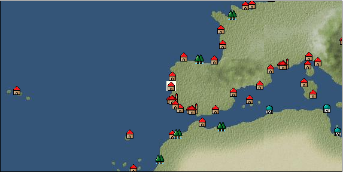

# Port: Porto

import Tabs from '@theme/Tabs';
import TabItem from '@theme/TabItem';

## General Information

| Attribute | Details |
| :--- | :--- |
| **Port Name** | Oporto |
| **Port Type** | 領地 |
| **Region** | western europe |
| **Sea Area** | off the coast of lisbon |
| **Required Language** | portuguese |
| **Coordinates** | （15765，3119） |
| **Investment Reward** | [Mode Design Collection Volume 3](docs/Items/RecipeBooks/item_952.md) （必要投資額：1,500,000ドゥカード） |

### Available Facilities

| guild | intermediary | exchange | tool shop | workshop craftsman | Painter | sculptor | peddler |
| --- | --- | --- | --- | --- | --- | --- | --- |
|   |   | ○ | ○ | ○ |   |   | ○ |
| Shipyard Master | Lumbermaker | Sail-maker | weapon craftsman | master | TavernFemale | archive | salesperson |
| --- | --- | --- | --- | --- | --- | --- | --- |
| ○ | ○ | ○ | ○ | ○ |   |   |   |
| Shipwright | 銀行 | street worker | 王宮 | Trading post | church | suburbs | translator |
| --- | --- | --- | --- | --- | --- | --- | --- |
| ○ | ○ | ○ |   |   | ○ |   |   |

### Description
A port famous for producing Port wine. Oporto means ``port,'' and this region was the center of Portugal at the time of its founding. In addition to its famous wine, fishing and salt production are popular. Cultural area: Iberia Specialty: None

<Tabs>
  <TabItem value="trade_goods_sales" label="Trade Goods Sales">

| item | group | purchase price | 同盟時 | remarks |
| --- | --- | --- | --- | --- |
| [tin ore](docs/Items/TradeGoods/TradeGoods-Minerals/item_23.md) | [Trading Items (Iron Stone)](docs/Categories/category_7.md) | 483 | 424 |  |
| [sausage](docs/Items/TradeGoods/TradeGoods-Foodstuffs/item_27.md) | [Trading items (food items)](docs/Categories/category_3.md) | 370 | 324 |  |
| [cheese](docs/Items/TradeGoods/TradeGoods-Foodstuffs/item_20.md) | [Trading items (food items)](docs/Categories/category_3.md) | 347 | 304 |  |
| [lard](docs/Items/TradeGoods/TradeGoods-Seasonings/item_43.md) | [交易品（調味料）](docs/Categories/category_4.md) | 260 | 228 |  |
| [wine](docs/Items/TradeGoods/TradeGoods-Alcohol/item_11.md) | [交易品（酒類）](docs/Categories/category_9.md) | 428 | 376 |  |
| [salt](docs/Items/TradeGoods/TradeGoods-Seasonings/item_42.md) | [交易品（調味料）](docs/Categories/category_4.md) | 237 | 208 |  |
| [wheat](docs/Items/TradeGoods/TradeGoods-Foodstuffs/item_16.md) | [Trading items (food items)](docs/Categories/category_3.md) | 45 | 40 |  |
| [leather](docs/Items/TradeGoods/TradeGoods-Fibers/item_44.md) | [交易品（繊維）](docs/Categories/category_1.md) | 424 | 372 |  |
| [pork](docs/Items/TradeGoods/TradeGoods-Foodstuffs/item_41.md) | [Trading items (food items)](docs/Categories/category_3.md) | 333 | 304 |  |
| [魚肉](docs/Items/TradeGoods/TradeGoods-Foodstuffs/item_10.md) | [Trading items (food items)](docs/Categories/category_3.md) | 146 | 128 |  |
  </TabItem>
  <TabItem value="sale_specialty" label="Sale (Specialty)">

| item | group | sale price | 同盟時 | remarks |
| --- | --- | --- | --- | --- |

#### [交易品（繊維）](docs/Categories/category_1.md)

| [flax](docs/Items/TradeGoods/TradeGoods-Fibers/item_64.md) | 交易品（繊維） | (243) | 283 |  |
| [feather](docs/Items/TradeGoods/TradeGoods-Fibers/item_585.md) | 交易品（繊維） | 757 | 810 |  |
| [tiger skin](docs/Items/TradeGoods/TradeGoods-Fibers/item_3790.md) | 交易品（繊維） | (22,563) | 26,327 |  |
| [Green ramie](docs/Items/TradeGoods/TradeGoods-Fibers/item_3428.md) | 交易品（繊維） | (24,017) | 28,024 |  |
| [deerskin](docs/Items/TradeGoods/TradeGoods-Fibers/item_3648.md) | 交易品（繊維） | (31,907) | 37,231 |  |

#### [Trading Goods (Dye)](docs/Categories/category_2.md)

| [Indian Akane](docs/Items/TradeGoods/TradeGoods-Dye/item_1037.md) | Trading Goods (Dye) | 1,145 | (1,288) |  |
| [Indian indigo](docs/Items/TradeGoods/TradeGoods-Dye/item_157.md) | Trading Goods (Dye) | 1,204 | (1,354) |  |
| [Safflower](docs/Items/TradeGoods/TradeGoods-Dye/item_1059.md) | Trading Goods (Dye) | 679 | (763) |  |
| [mimosa](docs/Items/TradeGoods/TradeGoods-Dye/item_2281.md) | Trading Goods (Dye) | (1,266) | 1,477 |  |

#### [Trading items (food items)](docs/Categories/category_3.md)

| [buckwheat](docs/Items/TradeGoods/TradeGoods-Foodstuffs/item_3430.md) | Trading items (food items) | (32,369) | 37,770 |  |
| [Chamtashima](docs/Items/TradeGoods/TradeGoods-Foodstuffs/item_3771.md) | Trading items (food items) | 1,321 | (1,486) |  |

#### [交易品（調味料）](docs/Categories/category_4.md)

| [tamarind](docs/Items/TradeGoods/TradeGoods-Seasonings/item_1968.md) | 交易品（調味料） | 2,148 | (2,416) |  |
| [Choshi](docs/Items/TradeGoods/TradeGoods-Seasonings/item_3793.md) | 交易品（調味料） | 32,655 | (36,740) |  |
| [Bean sauce](docs/Items/TradeGoods/TradeGoods-Seasonings/item_3875.md) | 交易品（調味料） | 36,900 | 100 |  |

#### [交易品（雑貨）](docs/Categories/category_5.md)

| [old ink stick](docs/Items/TradeGoods/TradeGoods-Misc/item_3921.md) | 交易品（雑貨） | (9,513) | 11,100 |  |

#### [Trading products (medical products)](docs/Categories/category_6.md)

| [Saikaku](docs/Items/TradeGoods/TradeGoods-Medicine/item_1959.md) | Trading products (medical products) | (4,013) | 4,682 |  |
| [tea tree](docs/Items/TradeGoods/TradeGoods-Medicine/item_2283.md) | Trading products (medical products) | (1,286) | 1,500 |  |
| [heath](docs/Items/TradeGoods/TradeGoods-Medicine/item_63.md) | Trading products (medical products) | (324) | 377 |  |
| [Nothing](docs/Items/TradeGoods/TradeGoods-Medicine/item_1053.md) | Trading products (medical products) | 720 | (810) |  |
| [Centennial grass](docs/Items/TradeGoods/TradeGoods-Medicine/item_5503.md) | Trading products (medical products) | (9,492) | 11,075 |  |
| [calamus](docs/Items/TradeGoods/TradeGoods-Medicine/item_3427.md) | Trading products (medical products) | 33,900 | (38,141) |  |

#### [Trading products (precious metals)](docs/Categories/category_8.md)

| [Korean silver](docs/Items/TradeGoods/TradeGoods-Metals/item_3796.md) | Trading products (precious metals) | 33,836 | (38,069) |  |

#### [交易品（酒類）](docs/Categories/category_9.md)

| [aquavit](docs/Items/TradeGoods/TradeGoods-Alcohol/item_572.md) | 交易品（酒類） | 726 | 775 |  |
| [whiskey](docs/Items/TradeGoods/TradeGoods-Alcohol/item_1.md) | 交易品（酒類） | (785) | 915 |  |
| [gin](docs/Items/TradeGoods/TradeGoods-Alcohol/item_291.md) | 交易品（酒類） | 844 | (949) |  |
| [tequila](docs/Items/TradeGoods/TradeGoods-Alcohol/item_108.md) | 交易品（酒類） | (4,452) | 5,194 |  |
| [Taiwan rice wine](docs/Items/TradeGoods/TradeGoods-Alcohol/item_3672.md) | 交易品（酒類） | (23,092) | 26,945 |  |
| [Sake](docs/Items/TradeGoods/TradeGoods-Alcohol/item_3424.md) | 交易品（酒類） | (25,412) | 29,652 |  |

#### [Trading goods (hobby goods)](docs/Categories/category_10.md)

| [Aigyoku](docs/Items/TradeGoods/TradeGoods-Sunddries/item_3677.md) | Trading goods (hobby goods) | (22,400) | 26,137 |  |
| [cacao](docs/Items/TradeGoods/TradeGoods-Sunddries/item_140.md) | Trading goods (hobby goods) | (1,348) | 1,572 |  |
| [cranberry](docs/Items/TradeGoods/TradeGoods-Sunddries/item_4008.md) | Trading goods (hobby goods) | (979) | 1,142 |  |
| [tobacco](docs/Items/TradeGoods/TradeGoods-Sunddries/item_109.md) | Trading goods (hobby goods) | (4,711) | 5,496 |  |
| [chicle](docs/Items/TradeGoods/TradeGoods-Sunddries/item_4083.md) | Trading goods (hobby goods) | (1,788) | 2,086 |  |
| [pineapple](docs/Items/TradeGoods/TradeGoods-Sunddries/item_867.md) | Trading goods (hobby goods) | (1,996) | 2,329 |  |
| [peanuts](docs/Items/TradeGoods/TradeGoods-Sunddries/item_134.md) | Trading goods (hobby goods) | (379) | 442 |  |
| [macadamia nuts](docs/Items/TradeGoods/TradeGoods-Sunddries/item_2282.md) | Trading goods (hobby goods) | (982) | 1,145 |  |
| [lemon myrtle](docs/Items/TradeGoods/TradeGoods-Sunddries/item_2840.md) | Trading goods (hobby goods) | (1,785) | 2,082 |  |
| [dried figs](docs/Items/TradeGoods/TradeGoods-Sunddries/item_611.md) | Trading goods (hobby goods) | 380 | (427) |  |
| [Korean tea](docs/Items/TradeGoods/TradeGoods-Sunddries/item_3751.md) | Trading goods (hobby goods) | 26,262 | 26,262 |  |
| [black tea](docs/Items/TradeGoods/TradeGoods-Sunddries/item_675.md) | Trading goods (hobby goods) | 2,210 | (2,486) |  |

#### [Trading Goods (Spices)](docs/Categories/category_11.md)

| [oakmoss](docs/Items/TradeGoods/TradeGoods-Perfume/item_819.md) | Trading Goods (Spices) | 1,053 | (1,184) |  |
| [gardenia](docs/Items/TradeGoods/TradeGoods-Perfume/item_1091.md) | Trading Goods (Spices) | (31,952) | 37,283 |  |
| [jasmine](docs/Items/TradeGoods/TradeGoods-Perfume/item_772.md) | Trading Goods (Spices) | 5,683 | (6,393) |  |
| [daffodil](docs/Items/TradeGoods/TradeGoods-Perfume/item_612.md) | Trading Goods (Spices) | 1,070 | (1,203) |  |
| [lily of the valley](docs/Items/TradeGoods/TradeGoods-Perfume/item_358.md) | Trading Goods (Spices) | [Edit Sale Price](docs/Ports/port_1.md) |  |
| [geranium](docs/Items/TradeGoods/TradeGoods-Perfume/item_145.md) | Trading Goods (Spices) | 1,100 | (1,237) |  |
| [Chindarle](docs/Items/TradeGoods/TradeGoods-Perfume/item_3795.md) | Trading Goods (Spices) | 46,386 | (52,189) |  |
| [eucalyptus](docs/Items/TradeGoods/TradeGoods-Perfume/item_2278.md) | Trading Goods (Spices) | (922) | 1,075 |  |
| [sandalwood](docs/Items/TradeGoods/TradeGoods-Perfume/item_771.md) | Trading Goods (Spices) | 3,820 | (4,297) |  |
| [龍脳](docs/Items/TradeGoods/TradeGoods-Perfume/item_1676.md) | Trading Goods (Spices) | (2,370) | 2,765 |  |

#### [Trading Goods (Spices)](docs/Categories/category_12.md)

| [allspice](docs/Items/TradeGoods/TradeGoods-Spices/item_1848.md) | Trading Goods (Spices) | 1,800 | (2,025) |  |
| [pepper](docs/Items/TradeGoods/TradeGoods-Spices/item_58.md) | Trading Goods (Spices) | 5,190 | (5,839) |  |
| [cinnamon](docs/Items/TradeGoods/TradeGoods-Spices/item_1432.md) | Trading Goods (Spices) | 5,000 | (5,625) |  |
| [dill](docs/Items/TradeGoods/TradeGoods-Spices/item_1093.md) | Trading Goods (Spices) | (204) | 237 |  |
| [nutmeg](docs/Items/TradeGoods/TradeGoods-Spices/item_1969.md) | Trading Goods (Spices) | (12,179) | 14,211 |  |
| [mace](docs/Items/TradeGoods/TradeGoods-Spices/item_2100.md) | Trading Goods (Spices) | (12,370) | 14,433 |  |
| [Laurier](docs/Items/TradeGoods/TradeGoods-Spices/item_615.md) | Trading Goods (Spices) | [Edit Sale Price](docs/Ports/port_1.md) |  |
| [Grapefruit](docs/Items/TradeGoods/TradeGoods-Spices/item_3422.md) | Trading Goods (Spices) | (34,591) | 40,362 |  |

#### [Trading goods (artificial goods)](docs/Categories/category_13.md)

| [Tumbaga](docs/Items/TradeGoods/TradeGoods-Luxuries/item_3028.md) | Trading goods (artificial goods) | (16,032) | 18,707 |  |
| [lacquerware](docs/Items/TradeGoods/TradeGoods-Luxuries/item_3435.md) | Trading goods (artificial goods) | (36,139) | 42,169 |  |
| [Saori](docs/Items/TradeGoods/TradeGoods-Luxuries/item_3676.md) | Trading goods (artificial goods) | (36,851) | 43,000 |  |

#### [交易品（美術品）](docs/Categories/category_14.md)

| [taiwan wood carving](docs/Items/TradeGoods/TradeGoods-Art/item_3697.md) | 交易品（美術品） | (33,316) | 38,875 |  |
| [Japanese painting](docs/Items/TradeGoods/TradeGoods-Art/item_3436.md) | 交易品（美術品） | (24,751) | 28,880 |  |

#### [Trading Items (Gemstones)](docs/Categories/category_15.md)

| [aventurine](docs/Items/TradeGoods/TradeGoods-Gems/item_678.md) | Trading Items (Gemstones) | 4,620 | (5,198) |  |
| [opal](docs/Items/TradeGoods/TradeGoods-Gems/item_2006.md) | Trading Items (Gemstones) | (6,217) | 7,254 |  |
| [cat's eye](docs/Items/TradeGoods/TradeGoods-Gems/item_1047.md) | Trading Items (Gemstones) | 8,603 | (9,679) |  |
| [sapphire](docs/Items/TradeGoods/TradeGoods-Gems/item_676.md) | Trading Items (Gemstones) | 10,000 | (11,251) |  |
| [turquoise](docs/Items/TradeGoods/TradeGoods-Gems/item_1006.md) | Trading Items (Gemstones) | 3,135 | (3,527) |  |
| [diamond](docs/Items/TradeGoods/TradeGoods-Gems/item_449.md) | Trading Items (Gemstones) | 5,837 | (6,567) |  |
| [pink diamond](docs/Items/TradeGoods/TradeGoods-Gems/item_2874.md) | Trading Items (Gemstones) | (12,960) | 15,122 |  |
| [lapis lazuli](docs/Items/TradeGoods/TradeGoods-Gems/item_995.md) | Trading Items (Gemstones) | 4,959 | (5,579) |  |
| [ruby](docs/Items/TradeGoods/TradeGoods-Gems/item_773.md) | Trading Items (Gemstones) | 10,093 | (11,355) |  |
| [amber](docs/Items/TradeGoods/TradeGoods-Gems/item_618.md) | Trading Items (Gemstones) | 3,966 | 4,019 |  |
| [amethyst](docs/Items/TradeGoods/TradeGoods-Gems/item_3434.md) | Trading Items (Gemstones) | 37,200 | 43,019 |  |
| [tiger eye stone](docs/Items/TradeGoods/TradeGoods-Gems/item_3797.md) | Trading Items (Gemstones) | 33,774 | (37,999) |  |

#### [Trading Items (Firearms)](docs/Categories/category_17.md)

| [tanegashima gun](docs/Items/TradeGoods/TradeGoods-Firearms/item_3423.md) | Trading Items (Firearms) | 33,298 | 38,724 |  |

#### [Trading Goods (Livestock)](docs/Categories/category_18.md)

| [韓牛](docs/Items/TradeGoods/TradeGoods-Livestock/item_3792.md) | Trading Goods (Livestock) | 33,620 | (37,826) |  |

#### [交易品（工業品）](docs/Categories/category_19.md)

| [papyrus](docs/Items/TradeGoods/TradeGoods-Wares/item_616.md) | 交易品（工業品） | 524 | (589) |  |
| [Japanese paper](docs/Items/TradeGoods/TradeGoods-Wares/item_3438.md) | 交易品（工業品） | (24,768) | 28,900 |  |
| [羊皮紙](docs/Items/TradeGoods/TradeGoods-Wares/item_53.md) | 交易品（工業品） | 1,349 | (1,517) |  |

#### [交易品（織物）](docs/Categories/category_20.md)

| [indian chintz](docs/Items/TradeGoods/TradeGoods-Fabrics/item_159.md) | 交易品（織物） | 2,167 | (2,438) |  |
| [dutch calico](docs/Items/TradeGoods/TradeGoods-Fabrics/item_1435.md) | 交易品（織物） | 1,245 | 1,245 |  |
| [taffeta](docs/Items/TradeGoods/TradeGoods-Fabrics/item_1001.md) | 交易品（織物） | (4,375) | 5,104 |  |
| [persian rug](docs/Items/TradeGoods/TradeGoods-Fabrics/item_606.md) | 交易品（織物） | 8,103 | (9,116) |  |
| [明紬](docs/Items/TradeGoods/TradeGoods-Fabrics/item_3753.md) | 交易品（織物） | 33,487 | (37,676) |  |
| [Nishijin textile](docs/Items/TradeGoods/TradeGoods-Fabrics/item_3431.md) | 交易品（織物） | 35,600 | 41,207 |  |
  </TabItem>
  <TabItem value="sale_no_specialty" label="Sale (No Specialty)">

| item | group | sale price | 同盟時 | remarks |
| --- | --- | --- | --- | --- |

#### [交易品（繊維）](docs/Categories/category_1.md)

| [fur](docs/Items/TradeGoods/TradeGoods-Fibers/item_634.md) | 交易品（繊維） | (2,001) | 2,334 |  |
| [raw silk](docs/Items/TradeGoods/TradeGoods-Fibers/item_677.md) | 交易品（繊維） | 2,272 | 2,638 |  |
| [cotton](docs/Items/TradeGoods/TradeGoods-Fibers/item_610.md) | 交易品（繊維） | 586 | (659) |  |
| [wool](docs/Items/TradeGoods/TradeGoods-Fibers/item_5.md) | 交易品（繊維） | 440 | (495) |  |
| [numb](docs/Items/TradeGoods/TradeGoods-Fibers/item_900.md) | 交易品（繊維） | 12 | (13) |  |
| [jute](docs/Items/TradeGoods/TradeGoods-Fibers/item_128.md) | 交易品（繊維） | 195 | 205 |  |

#### [Trading Goods (Dye)](docs/Categories/category_2.md)

| [ward](docs/Items/TradeGoods/TradeGoods-Dye/item_57.md) | Trading Goods (Dye) | 1,100 | (1,237) |  |
| [persian berry](docs/Items/TradeGoods/TradeGoods-Dye/item_693.md) | Trading Goods (Dye) | 1,398 | (1,572) |  |
| [Grass](docs/Items/TradeGoods/TradeGoods-Dye/item_906.md) | Trading Goods (Dye) | 4 | (4) |  |
| [貝紫](docs/Items/TradeGoods/TradeGoods-Dye/item_110.md) | Trading Goods (Dye) | 4,257 | (4,789) |  |

#### [Trading items (food items)](docs/Categories/category_3.md)

| [duck meat](docs/Items/TradeGoods/TradeGoods-Foodstuffs/item_32.md) | Trading items (food items) | 407 | 466 |  |
| [sole](docs/Items/TradeGoods/TradeGoods-Foodstuffs/item_45.md) | Trading items (food items) | 96 | (108) |  |
| [Jambu](docs/Items/TradeGoods/TradeGoods-Foodstuffs/item_1827.md) | Trading items (food items) | 211 | (237) |  |
| [carrot](docs/Items/TradeGoods/TradeGoods-Foodstuffs/item_2708.md) | Trading items (food items) | 109 | (122) |  |
| [ham](docs/Items/TradeGoods/TradeGoods-Foodstuffs/item_290.md) | Trading items (food items) | 414 | 440 |  |
| [pasta](docs/Items/TradeGoods/TradeGoods-Foodstuffs/item_635.md) | Trading items (food items) | 65 | (73) |  |
| [bacon](docs/Items/TradeGoods/TradeGoods-Foodstuffs/item_566.md) | Trading items (food items) | 394 | (443) |  |
| [crocodile meat](docs/Items/TradeGoods/TradeGoods-Foodstuffs/item_2284.md) | Trading items (food items) | (619) | 722 |  |
| [milk](docs/Items/TradeGoods/TradeGoods-Foodstuffs/item_254.md) | Trading items (food items) | 148 | (166) |  |
| [egg](docs/Items/TradeGoods/TradeGoods-Foodstuffs/item_40.md) | Trading items (food items) | 34 | (38) |  |
| [flour](docs/Items/TradeGoods/TradeGoods-Foodstuffs/item_605.md) | Trading items (food items) | 51 | (57) |  |
| [beef](docs/Items/TradeGoods/TradeGoods-Foodstuffs/item_26.md) | Trading items (food items) | 645 | 659 |  |
| [魚肉](docs/Items/TradeGoods/TradeGoods-Foodstuffs/item_10.md) | Trading items (food items) | 64 | (72) |  |
| [chicken meat](docs/Items/TradeGoods/TradeGoods-Foodstuffs/item_29.md) | Trading items (food items) | 339 | 377 |  |

#### [交易品（調味料）](docs/Categories/category_4.md)

| [almond oil](docs/Items/TradeGoods/TradeGoods-Seasonings/item_578.md) | 交易品（調味料） | 629 | 672 |  |
| [olive oil](docs/Items/TradeGoods/TradeGoods-Seasonings/item_48.md) | 交易品（調味料） | (350) | 408 |  |
| [coconut vinegar](docs/Items/TradeGoods/TradeGoods-Seasonings/item_1988.md) | 交易品（調味料） | 518 | (582) |  |
| [butter](docs/Items/TradeGoods/TradeGoods-Seasonings/item_3.md) | 交易品（調味料） | 358 | 405 |  |
| [white vinegar](docs/Items/TradeGoods/TradeGoods-Seasonings/item_56.md) | 交易品（調味料） | (156) | 182 |  |
| [apple cider vinegar](docs/Items/TradeGoods/TradeGoods-Seasonings/item_882.md) | 交易品（調味料） | 419 | (471) |  |
| [wine vinegar](docs/Items/TradeGoods/TradeGoods-Seasonings/item_429.md) | 交易品（調味料） | 569 | (640) |  |
| [sugar](docs/Items/TradeGoods/TradeGoods-Seasonings/item_94.md) | 交易品（調味料） | 903 | (1,015) |  |

#### [交易品（雑貨）](docs/Categories/category_5.md)

| [Western books](docs/Items/TradeGoods/TradeGoods-Misc/item_293.md) | 交易品（雑貨） | 705 | 709 |  |

#### [Trading products (medical products)](docs/Categories/category_6.md)

| [chamomile](docs/Items/TradeGoods/TradeGoods-Medicine/item_292.md) | Trading products (medical products) | 450 | (506) |  |
| [lemon balm](docs/Items/TradeGoods/TradeGoods-Medicine/item_127.md) | Trading products (medical products) | 310 | 310 |  |
| [mercury agent](docs/Items/TradeGoods/TradeGoods-Medicine/item_703.md) | Trading products (medical products) | 1,398 | (1,572) |  |

#### [Trading products (precious metals)](docs/Categories/category_8.md)

| [gold](docs/Items/TradeGoods/TradeGoods-Metals/item_659.md) | Trading products (precious metals) | (7,416) | 8,653 |  |
| [silver](docs/Items/TradeGoods/TradeGoods-Metals/item_136.md) | Trading products (precious metals) | (2,643) | 3,084 |  |

#### [交易品（酒類）](docs/Categories/category_9.md)

| [sherry](docs/Items/TradeGoods/TradeGoods-Alcohol/item_844.md) | 交易品（酒類） | 449 | (505) |  |
| [Beer](docs/Items/TradeGoods/TradeGoods-Alcohol/item_2.md) | 交易品（酒類） | 374 | (420) |  |
| [fruit brandy](docs/Items/TradeGoods/TradeGoods-Alcohol/item_1440.md) | 交易品（酒類） | 628 | 635 |  |
| [brandy](docs/Items/TradeGoods/TradeGoods-Alcohol/item_9.md) | 交易品（酒類） | 742 | 760 |  |
| [liqueur](docs/Items/TradeGoods/TradeGoods-Alcohol/item_18.md) | 交易品（酒類） | 643 | (723) |  |
| [wine](docs/Items/TradeGoods/TradeGoods-Alcohol/item_11.md) | 交易品（酒類） | 188 | 188 |  |

#### [Trading goods (hobby goods)](docs/Categories/category_10.md)

| [almond](docs/Items/TradeGoods/TradeGoods-Sunddries/item_367.md) | Trading goods (hobby goods) | 194 | (218) |  |
| [walnut](docs/Items/TradeGoods/TradeGoods-Sunddries/item_522.md) | Trading goods (hobby goods) | 509 | (572) |  |
| ▲Special products from neighboring cultural areas |
| [dried apple](docs/Items/TradeGoods/TradeGoods-Sunddries/item_19.md) | Trading goods (hobby goods) | 357 | 372 |  |

#### [Trading Goods (Spices)](docs/Categories/category_11.md)

| [lavender](docs/Items/TradeGoods/TradeGoods-Perfume/item_150.md) | Trading Goods (Spices) | 998 | (1,122) |  |
| [lira](docs/Items/TradeGoods/TradeGoods-Perfume/item_30.md) | Trading Goods (Spices) | 776 | (873) |  |
| [Musk](docs/Items/TradeGoods/TradeGoods-Perfume/item_158.md) | Trading Goods (Spices) | 4,552 | (5,121) |  |

#### [Trading Goods (Spices)](docs/Categories/category_12.md)

| [oregano](docs/Items/TradeGoods/TradeGoods-Spices/item_430.md) | Trading Goods (Spices) | (459) | 535 |  |
| [garlic](docs/Items/TradeGoods/TradeGoods-Spices/item_526.md) | Trading Goods (Spices) | (288) | 335 |  |
| [coriander](docs/Items/TradeGoods/TradeGoods-Spices/item_1044.md) | Trading Goods (Spices) | 412 | 416 |  |
| [celery](docs/Items/TradeGoods/TradeGoods-Spices/item_431.md) | Trading Goods (Spices) | 144 | (162) |  |
| [time](docs/Items/TradeGoods/TradeGoods-Spices/item_432.md) | Trading Goods (Spices) | 398 | (447) |  |
| [basil](docs/Items/TradeGoods/TradeGoods-Spices/item_126.md) | Trading Goods (Spices) | 174 | 179 |  |
| [rosemary](docs/Items/TradeGoods/TradeGoods-Spices/item_428.md) | Trading Goods (Spices) | 389 | (437) |  |

#### [Trading goods (artificial goods)](docs/Categories/category_13.md)

| [embroidery thread](docs/Items/TradeGoods/TradeGoods-Luxuries/item_898.md) | Trading goods (artificial goods) | (1,960) | 2,286 |  |
| [dragonfly ball](docs/Items/TradeGoods/TradeGoods-Luxuries/item_294.md) | Trading goods (artificial goods) | 1,200 | (1,350) |  |
| [lapidary work](docs/Items/TradeGoods/TradeGoods-Luxuries/item_153.md) | Trading goods (artificial goods) | 4,175 | (4,697) |  |
| [皮革製品](docs/Items/TradeGoods/TradeGoods-Luxuries/item_12.md) | Trading goods (artificial goods) | 1,178 | 1,178 |  |
| [goldsmith](docs/Items/TradeGoods/TradeGoods-Luxuries/item_687.md) | Trading goods (artificial goods) | 3,453 | (3,885) |  |
| [silversmith](docs/Items/TradeGoods/TradeGoods-Luxuries/item_619.md) | Trading goods (artificial goods) | 3,206 | (3,607) |  |

#### [交易品（美術品）](docs/Categories/category_14.md)

| [古美術品](docs/Items/TradeGoods/TradeGoods-Art/item_51.md) | 交易品（美術品） | 3,603 | (4,053) |  |
| [marble statue](docs/Items/TradeGoods/TradeGoods-Art/item_50.md) | 交易品（美術品） | 3,094 | (3,481) |  |
| [青銅像](docs/Items/TradeGoods/TradeGoods-Art/item_148.md) | 交易品（美術品） | 1,140 | 1,140 |  |

#### [Trading Items (Gemstones)](docs/Categories/category_15.md)

| [emerald](docs/Items/TradeGoods/TradeGoods-Gems/item_777.md) | Trading Items (Gemstones) | 6,814 | (7,666) |  |
| [peridot](docs/Items/TradeGoods/TradeGoods-Gems/item_1098.md) | Trading Items (Gemstones) | (2,409) | 2,810 |  |
| [crystal](docs/Items/TradeGoods/TradeGoods-Gems/item_893.md) | Trading Items (Gemstones) | (1,457) | 1,699 |  |
| [pearl](docs/Items/TradeGoods/TradeGoods-Gems/item_769.md) | Trading Items (Gemstones) | 8,609 | (9,686) |  |
| [ivory](docs/Items/TradeGoods/TradeGoods-Gems/item_699.md) | Trading Items (Gemstones) | 2,430 | (2,734) |  |

#### [Trading Items (Arms)](docs/Categories/category_16.md)

| [crossbow](docs/Items/TradeGoods/TradeGoods-Weapons/item_537.md) | Trading Items (Arms) | 1,050 | 1,070 |  |
| [scimitar](docs/Items/TradeGoods/TradeGoods-Weapons/item_142.md) | Trading Items (Arms) | 1,050 | 1,075 |  |
| [dagger](docs/Items/TradeGoods/TradeGoods-Weapons/item_143.md) | Trading Items (Arms) | 886 | (996) |  |

#### [Trading Items (Firearms)](docs/Categories/category_17.md)

| [arquebus gun](docs/Items/TradeGoods/TradeGoods-Firearms/item_14.md) | Trading Items (Firearms) | 1,808 | (2,034) |  |
| [musket gun](docs/Items/TradeGoods/TradeGoods-Firearms/item_584.md) | Trading Items (Firearms) | 2,352 | 2,676 |  |
| [大砲](docs/Items/TradeGoods/TradeGoods-Firearms/item_4.md) | Trading Items (Firearms) | 3,090 | (3,476) |  |
| [bullet](docs/Items/TradeGoods/TradeGoods-Firearms/item_13.md) | Trading Items (Firearms) | 875 | (984) |  |
| [gunpowder](docs/Items/TradeGoods/TradeGoods-Firearms/item_352.md) | Trading Items (Firearms) | 768 | (864) |  |
| [cannonball](docs/Items/TradeGoods/TradeGoods-Firearms/item_144.md) | Trading Items (Firearms) | 1,400 | (1,575) |  |

#### [Trading Goods (Livestock)](docs/Categories/category_18.md)

| [duck](docs/Items/TradeGoods/TradeGoods-Livestock/item_38.md) | Trading Goods (Livestock) | 65 | (73) |  |
| [horse](docs/Items/TradeGoods/TradeGoods-Livestock/item_1811.md) | Trading Goods (Livestock) | 168 | (189) |  |
| [chicken](docs/Items/TradeGoods/TradeGoods-Livestock/item_252.md) | Trading Goods (Livestock) | 54 | (60) |  |
| [pig](docs/Items/TradeGoods/TradeGoods-Livestock/item_37.md) | Trading Goods (Livestock) | 67 | (75) |  |

#### [交易品（工業品）](docs/Categories/category_19.md)

| [wood](docs/Items/TradeGoods/TradeGoods-Wares/item_277.md) | 交易品（工業品） | (749) | 873 |  |
| [水銀](docs/Items/TradeGoods/TradeGoods-Wares/item_15.md) | 交易品（工業品） | 1,176 | (1,323) |  |
| [oil](docs/Items/TradeGoods/TradeGoods-Wares/item_613.md) | 交易品（工業品） | 633 | (712) |  |
| [sulfur](docs/Items/TradeGoods/TradeGoods-Wares/item_66.md) | 交易品（工業品） | (519) | 605 |  |
| [iron material](docs/Items/TradeGoods/TradeGoods-Wares/item_268.md) | 交易品（工業品） | 888 | 936 |  |
| [鋼](docs/Items/TradeGoods/TradeGoods-Wares/item_573.md) | 交易品（工業品） | (1,105) | 1,289 |  |

#### [交易品（織物）](docs/Categories/category_20.md)

| [corduroy](docs/Items/TradeGoods/TradeGoods-Fabrics/item_824.md) | 交易品（織物） | 941 | (1,058) |  |
| [satin](docs/Items/TradeGoods/TradeGoods-Fabrics/item_996.md) | 交易品（織物） | 3,090 | (3,476) |  |
| [georgette](docs/Items/TradeGoods/TradeGoods-Fabrics/item_1000.md) | 交易品（織物） | 3,216 | (3,618) |  |
| [velvet](docs/Items/TradeGoods/TradeGoods-Fabrics/item_902.md) | 交易品（織物） | 3,098 | (3,485) |  |
| [race](docs/Items/TradeGoods/TradeGoods-Fabrics/item_59.md) | 交易品（織物） | 2,205 | (2,480) |  |
| [woolen fabric](docs/Items/TradeGoods/TradeGoods-Fabrics/item_163.md) | 交易品（織物） | 1,055 | (1,186) |  |
| [cotton fabric](docs/Items/TradeGoods/TradeGoods-Fabrics/item_571.md) | 交易品（織物） | 1,100 | (1,237) |  |
| [linen fabric](docs/Items/TradeGoods/TradeGoods-Fabrics/item_135.md) | 交易品（織物） | 485 | (545) |  |
  </TabItem>
  <TabItem value="guild_&_others" label="Guild & Others">

| item | group | Sales price | Handling NPC | remarks |
| --- | --- | --- | --- | --- |

#### Duarte Lopez

| [rescue](docs/Skills/Skill-Adventure/item_360.md) | [Skill (adventure)](docs/Categories/category_39.md) | 8,000 | Duarte Lopez |  |
| [extermination](docs/Skills/Skill-Adventure/item_361.md) | [Skill (adventure)](docs/Categories/category_39.md) | 3,000 | Duarte Lopez |  |
| [west african languages](docs/Skills/Skills-Language/item_362.md) | [Skills (language)](docs/Categories/category_42.md) | 10,000 | Duarte Lopez |  |
  </TabItem>
  <TabItem value="toolman" label="Toolman">

| item | group | Sales price | Handling NPC | remarks |
| --- | --- | --- | --- | --- |

#### [recipe book](docs/Categories/category_22.md)

| [Mode Design Collection Volume 1](docs/Items/RecipeBooks/item_92.md) | recipe book | 10,000 | tool shop owner |  |
| [Sword training/application](docs/Items/RecipeBooks/item_589.md) | recipe book | 50,000 | tool shop owner |  |
| [Livestock secrets/pig chapter](docs/Items/RecipeBooks/item_366.md) | recipe book | 8,000 | tool shop owner |  |
| [Textile secrets/fabric book](docs/Items/RecipeBooks/item_91.md) | recipe book | 10,000 | tool shop owner |  |

#### [Equipment (head)](docs/Categories/category_23.md)

| [admiral hat](docs/Items/Equipment/Equipment-Head/item_363.md) | Equipment (head) | 6,600 | tool shop owner |  |
| [Kartif](docs/Items/Equipment/Equipment-Head/item_262.md) | Equipment (head) | 2,300 | tool shop owner |  |
| [beret with wings](docs/Items/Equipment/Equipment-Head/item_364.md) | Equipment (head) | 3,800 | tool shop owner |  |

#### [Equipment (body)](docs/Categories/category_24.md)

| [felt acton](docs/Items/Equipment/Equipment-Body/item_130.md) | Equipment (body) | 8,300 | tool shop owner |  |
| [linen petticoat](docs/Items/Equipment/Equipment-Body/item_272.md) | Equipment (body) | 8,300 | tool shop owner |  |

#### [Equipment (hands)](docs/Categories/category_25.md)

| [glove](docs/Items/Equipment/Equipment-Hands/item_223.md) | Equipment (hands) | 6,400 | tool shop owner |  |

#### [Equipment (legs)](docs/Categories/category_26.md)

| [boots](docs/Items/Equipment/Equipment-Feet/item_365.md) | Equipment (legs) | 100 | tool shop owner |  |

#### [Consumables (land battle/deck battle)](docs/Categories/category_29.md)

| [black kite feather](docs/Items/Consumables/Consumables-Landbattle/item_88.md) | Consumables (land battle/deck battle) | 100 | tool shop owner |  |
| [Assortment of wound medicine](docs/Items/Consumables/Consumables-Landbattle/item_90.md) | Consumables (land battle/deck battle) | 500 | tool shop owner |  |
| [therapeutic drug](docs/Items/Consumables/Consumables-Landbattle/item_89.md) | Consumables (land battle/deck battle) | 300 | tool shop owner |  |
| [antidote](docs/Items/Consumables/Consumables-Landbattle/item_270.md) | Consumables (land battle/deck battle) | 100 | tool shop owner |  |
  </TabItem>
  <TabItem value="kobo_craftsmen" label="Craftsman">

| item | group | Sales price | Handling NPC | remarks |
| --- | --- | --- | --- | --- |

#### [recipe book](docs/Categories/category_22.md)

| [特殊兵装縫製法](docs/Items/RecipeBooks/item_1356.md) | recipe book | 50,000 | workshop craftsman |  |
| 要投資（必要投資額：180,000） |
| [Shipwright Introduction/Craft Book](docs/Items/RecipeBooks/item_75.md) | recipe book | 10,000 | workshop craftsman |  |
| [Shipwright Introduction/Sewing Book](docs/Items/RecipeBooks/item_74.md) | recipe book | 10,000 | workshop craftsman |  |
| [Shipwright Introduction/Casting Book](docs/Items/RecipeBooks/item_76.md) | recipe book | 10,000 | workshop craftsman |  |

#### [Consumables (skill activation)](docs/Categories/category_31.md)

| [四分儀](docs/Items/Consumables/Consumables-Skill/item_346.md) | Consumables (skill activation) | 500 | workshop craftsman |  |
| [simple salvage rope](docs/Items/Consumables/Consumables-Skill/item_2294.md) | Consumables (skill activation) | 500 | workshop craftsman |  |
| [Simple towing auxiliary rope](docs/Items/Consumables/Consumables-Skill/item_2295.md) | Consumables (skill activation) | 500 | workshop craftsman |  |

#### [shipbuilding materials](docs/Categories/category_47.md)

| [General purpose small square sail](docs/Items/ShipbuildingFS/item_3446.md) | shipbuilding materials | 30,000 | workshop craftsman |  |
| 要投資（必要投資額：320,000） |
| [General purpose small Latin sail](docs/Items/ShipbuildingFS/item_3445.md) | shipbuilding materials | 30,000 | workshop craftsman |  |
| 要投資（必要投資額：320,000） |
| [General-purpose small oar](docs/Items/ShipbuildingFS/item_3521.md) | shipbuilding materials | 50,000 | workshop craftsman |  |
| 要投資（必要投資額：720,000） |
| [General-purpose small reinforcement board](docs/Items/ShipbuildingFS/item_3527.md) | shipbuilding materials | 50,000 | workshop craftsman |  |
| 要投資（必要投資額：720,000） |
| [General-purpose small expansion warehouse](docs/Items/ShipbuildingFS/item_3524.md) | shipbuilding materials | 80,000 | workshop craftsman |  |
| 要投資（必要投資額：720,000） |
| [General-purpose small expansion cabin](docs/Items/ShipbuildingFS/item_3523.md) | shipbuilding materials | 80,000 | workshop craftsman |  |
| 要投資（必要投資額：680,000） |
| [General-purpose small improved rudder](docs/Items/ShipbuildingFS/item_3522.md) | shipbuilding materials | 80,000 | workshop craftsman |  |
| 要投資（必要投資額：680,000） |
| [General-purpose small paddle boat](docs/Items/ShipbuildingFS/item_3444.md) | shipbuilding materials | 100,000 | workshop craftsman |  |
| 要投資（必要投資額：320,000） |
| [General-purpose small anti-swaying water tank](docs/Items/ShipbuildingFS/item_3525.md) | shipbuilding materials | 80,000 | workshop craftsman |  |
| 要投資（必要投資額：680,000） |
| [General-purpose small gun port](docs/Items/ShipbuildingFS/item_3447.md) | shipbuilding materials | 30,000 | workshop craftsman |  |
| 要投資（必要投資額：320,000） |
| [General-purpose small hull](docs/Items/ShipbuildingFS/item_3443.md) | shipbuilding materials | 100,000 | workshop craftsman |  |
| 要投資（必要投資額：300,000） |
| [General-purpose small armor plate](docs/Items/ShipbuildingFS/item_3526.md) | shipbuilding materials | 50,000 | workshop craftsman |  |
| 要投資（必要投資額：720,000） |
  </TabItem>
  <TabItem value="shipyard" label="Shipyard">

### Shipyard Master

| item | group | Sales price | Handling NPC | remarks |
| --- | --- | --- | --- | --- |

#### [recipe book](docs/Categories/category_22.md)

| [Book of Shipbuilding Materials and Hulls Volume 2](docs/Items/RecipeBooks/item_1719.md) | recipe book | Fixed recipe | Shipyard Master |  |

#### [Boat](docs/Categories/category_43.md)

| [Galliot](docs/Items/Ships/item_210.md) | Boat | 156,000 | Shipyard Master |  |
| [galleon](docs/Items/Ships/item_411.md) | Boat | 4,500,000 | Shipyard Master |  |
| [galley](docs/Items/Ships/item_227.md) | Boat | 645,000 | Shipyard Master |  |
| [carrack](docs/Items/Ships/item_236.md) | Boat | 720,000 | Shipyard Master |  |
| [caravelle](docs/Items/Ships/item_213.md) | Boat | 285,000 | Shipyard Master |  |
| [Talette](docs/Items/Ships/item_205.md) | Boat | 11,500 | Shipyard Master |  |
| [Nao](docs/Items/Ships/item_355.md) | Boat | 1,250,000 | Shipyard Master |  |
| [Hansa Cog](docs/Items/Ships/item_263.md) | Boat | 24,000 | Shipyard Master |  |
| [Varsha](docs/Items/Ships/item_201.md) | Boat | 2,000 | Shipyard Master |  |
| [bergantine](docs/Items/Ships/item_208.md) | Boat | 148,800 | Shipyard Master |  |
| [commercial galleon](docs/Items/Ships/item_412.md) | Boat | 4,600,000 | Shipyard Master |  |
| [commercial galley](docs/Items/Ships/item_229.md) | Boat | 650,000 | Shipyard Master |  |
| [commercial carrack](docs/Items/Ships/item_239.md) | Boat | 728,000 | Shipyard Master |  |
| [commercial caravel](docs/Items/Ships/item_215.md) | Boat | 290,000 | Shipyard Master |  |
| [commercial varsha](docs/Items/Ships/item_204.md) | Boat | 5,200 | Shipyard Master |  |
| [commercial large carrack](docs/Items/Ships/item_409.md) | Boat | 1,840,000 | Shipyard Master |  |
| [commercial large caravel](docs/Items/Ships/item_1513.md) | Boat | 1,632,000 | Shipyard Master |  |
| [large caravel](docs/Items/Ships/item_246.md) | Boat | 1,160,000 | Shipyard Master |  |
| [small galleon](docs/Items/Ships/item_406.md) | Boat | 830,000 | Shipyard Master |  |
| [small carrack](docs/Items/Ships/item_219.md) | Boat | 480,000 | Shipyard Master |  |
| [small caravel](docs/Items/Ships/item_206.md) | Boat | 92,000 | Shipyard Master |  |
| [assault galley](docs/Items/Ships/item_224.md) | Boat | 640,000 | Shipyard Master |  |
| [Assault heavy caravel](docs/Items/Ships/item_1512.md) | Boat | 1,872,000 | Shipyard Master |  |
| [battle galleon](docs/Items/Ships/item_413.md) | Boat | 4,600,000 | Shipyard Master |  |
| [combat carrack](docs/Items/Ships/item_238.md) | Boat | 720,000 | Shipyard Master |  |
| [combat caravel](docs/Items/Ships/item_212.md) | Boat | 280,000 | Shipyard Master |  |
| [Battle Barsha](docs/Items/Ships/item_203.md) | Boat | 5,100 | Shipyard Master |  |
| [Nao for exploration](docs/Items/Ships/item_1511.md) | Boat | 1,704,000 | Shipyard Master |  |
| [exploration barsha](docs/Items/Ships/item_202.md) | Boat | 5,000 | Shipyard Master |  |
| [armed cog](docs/Items/Ships/item_264.md) | Boat | 25,000 | Shipyard Master |  |
| [light galleon](docs/Items/Ships/item_240.md) | Boat | 810,000 | Shipyard Master |  |
| [light galley](docs/Items/Ships/item_209.md) | Boat | 150,000 | Shipyard Master |  |
| [light carrack](docs/Items/Ships/item_218.md) | Boat | 478,000 | Shipyard Master |  |
| [light caravelle](docs/Items/Ships/item_207.md) | Boat | 92,000 | Shipyard Master |  |
| [transport galleon](docs/Items/Ships/item_407.md) | Boat | 840,000 | Shipyard Master |  |
| [transportation galley](docs/Items/Ships/item_211.md) | Boat | 160,000 | Shipyard Master |  |
| [transport carrack](docs/Items/Ships/item_222.md) | Boat | 488,000 | Shipyard Master |  |
| [heavy carrack](docs/Items/Ships/item_410.md) | Boat | 3,600,000 | Shipyard Master |  |
| [heavy caravel](docs/Items/Ships/item_248.md) | Boat | 1,250,000 | Shipyard Master |  |

#### [shipbuilding materials](docs/Categories/category_47.md)

| [2-deck medium-sized hull](docs/Items/ShipbuildingFS/item_1721.md) | shipbuilding materials | Fixed recipe | Shipyard Master |  |
| [3-deck medium-sized hull](docs/Items/ShipbuildingFS/item_1935.md) | shipbuilding materials | Fixed recipe | Shipyard Master |  |
| [Flat deck medium-sized hull](docs/Items/ShipbuildingFS/item_1720.md) | shipbuilding materials | Fixed recipe | Shipyard Master |  |

### Lumbermaker

| item | group | Sales price | Handling NPC | remarks |
| --- | --- | --- | --- | --- |

#### [recipe book](docs/Categories/category_22.md)

| [Book of Shipbuilding Materials and Crafts Volume 2](docs/Items/RecipeBooks/item_1717.md) | recipe book | Fixed recipe | Lumbermaker |  |

#### [Ship parts (additional armor)](docs/Categories/category_35.md)

| [elm board](docs/Items/ShipParts/Shipparts-Plates/item_328.md) | Ship parts (additional armor) | 13,000 | Lumbermaker |  |
| [oak board](docs/Items/ShipParts/Shipparts-Plates/item_354.md) | Ship parts (additional armor) | 34,000 | Lumbermaker |  |
| [cedar board](docs/Items/ShipParts/Shipparts-Plates/item_353.md) | Ship parts (additional armor) | 800 | Lumbermaker |  |
| [beach board](docs/Items/ShipParts/Shipparts-Plates/item_327.md) | Ship parts (additional armor) | 6,400 | Lumbermaker |  |
| [red pine board](docs/Items/ShipParts/Shipparts-Plates/item_326.md) | Ship parts (additional armor) | 2,700 | Lumbermaker |  |
| [iron plate](docs/Items/ShipParts/Shipparts-Plates/item_921.md) | Ship parts (additional armor) | 130,000 | Lumbermaker |  |
| [銅板](docs/Items/ShipParts/Shipparts-Plates/item_405.md) | Ship parts (additional armor) | 73,000 | Lumbermaker |  |

#### [shipbuilding materials](docs/Categories/category_47.md)

| [middle mast](docs/Items/ShipbuildingFS/item_1718.md) | shipbuilding materials | Fixed recipe | Lumbermaker |  |

### Sail-maker

| item | group | Sales price | Handling NPC | remarks |
| --- | --- | --- | --- | --- |

#### [recipe book](docs/Categories/category_22.md)

| [Book of Shipbuilding Materials and Sewing Volume 2](docs/Items/RecipeBooks/item_1686.md) | recipe book | Fixed recipe | Sail-maker |  |

#### [Ship parts (auxiliary sails)](docs/Categories/category_33.md)

| [outer jib](docs/Items/ShipParts/Shipparts-Studding-Sail/item_331.md) | Ship parts (auxiliary sails) | 18,000 | Sail-maker |  |
| [Outer & inner jib](docs/Items/ShipParts/Shipparts-Studding-Sail/item_332.md) | Ship parts (auxiliary sails) | 23,000 | Sail-maker |  |
| [inner jib](docs/Items/ShipParts/Shipparts-Studding-Sail/item_279.md) | Ship parts (auxiliary sails) | 1,700 | Sail-maker |  |
| [Vorgernstaisl](docs/Items/ShipParts/Shipparts-Studding-Sail/item_333.md) | Ship parts (auxiliary sails) | 22,000 | Sail-maker |  |
| [Forestaisle](docs/Items/ShipParts/Shipparts-Studding-Sail/item_280.md) | Ship parts (auxiliary sails) | 8,300 | Sail-maker |  |
| [Foretop Gernsur](docs/Items/ShipParts/Shipparts-Studding-Sail/item_282.md) | Ship parts (auxiliary sails) | 2,400 | Sail-maker |  |
| [Foretop staysle](docs/Items/ShipParts/Shipparts-Studding-Sail/item_357.md) | Ship parts (auxiliary sails) | 29,000 | Sail-maker |  |
| [Foretop Royal Sur](docs/Items/ShipParts/Shipparts-Studding-Sail/item_403.md) | Ship parts (auxiliary sails) | 48,000 | Sail-maker |  |
| [Foreroyalgernsl](docs/Items/ShipParts/Shipparts-Studding-Sail/item_330.md) | Ship parts (auxiliary sails) | 26,000 | Sail-maker |  |
| [flying outer jib](docs/Items/ShipParts/Shipparts-Studding-Sail/item_400.md) | Ship parts (auxiliary sails) | 49,000 | Sail-maker |  |
| [flying inner jib](docs/Items/ShipParts/Shipparts-Studding-Sail/item_401.md) | Ship parts (auxiliary sails) | 58,000 | Sail-maker |  |
| [bonnet](docs/Items/ShipParts/Shipparts-Studding-Sail/item_329.md) | Ship parts (auxiliary sails) | 25,000 | Sail-maker |  |
| [mizungernstaisl](docs/Items/ShipParts/Shipparts-Studding-Sail/item_334.md) | Ship parts (auxiliary sails) | 22,000 | Sail-maker |  |
| [mizzen staple](docs/Items/ShipParts/Shipparts-Studding-Sail/item_281.md) | Ship parts (auxiliary sails) | 11,000 | Sail-maker |  |
| [mizzen top gelrunsle](docs/Items/ShipParts/Shipparts-Studding-Sail/item_283.md) | Ship parts (auxiliary sails) | 4,200 | Sail-maker |  |
| [mizzen top staysle](docs/Items/ShipParts/Shipparts-Studding-Sail/item_402.md) | Ship parts (auxiliary sails) | 35,000 | Sail-maker |  |
| [Mizzen Top Royal Sur](docs/Items/ShipParts/Shipparts-Studding-Sail/item_404.md) | Ship parts (auxiliary sails) | 48,000 | Sail-maker |  |
| [mizzen royal gelrunsle](docs/Items/ShipParts/Shipparts-Studding-Sail/item_284.md) | Ship parts (auxiliary sails) | 21,000 | Sail-maker |  |
| [small inner jib](docs/Items/ShipParts/Shipparts-Studding-Sail/item_278.md) | Ship parts (auxiliary sails) | 500 | Sail-maker |  |
| [wide bonnet](docs/Items/ShipParts/Shipparts-Studding-Sail/item_356.md) | Ship parts (auxiliary sails) | 38,000 | Sail-maker |  |

#### [shipbuilding materials](docs/Categories/category_47.md)

| [medium gaff sail](docs/Items/ShipbuildingFS/item_1687.md) | shipbuilding materials | Fixed recipe | Sail-maker |  |
| [medium square sail](docs/Items/ShipbuildingFS/item_1797.md) | shipbuilding materials | Fixed recipe | Sail-maker |  |

### Shipwright

| item | group | Sales price | Handling NPC | remarks |
| --- | --- | --- | --- | --- |

#### [recipe book](docs/Categories/category_22.md)

| [Shipbuilding materials/ropes](docs/Items/RecipeBooks/item_1704.md) | recipe book | Fixed recipe | Shipwright |  |

#### [shipbuilding materials](docs/Categories/category_47.md)

| [rope](docs/Items/ShipbuildingFS/item_1684.md) | shipbuilding materials | Fixed recipe | Shipwright |  |
  </TabItem>
</Tabs>