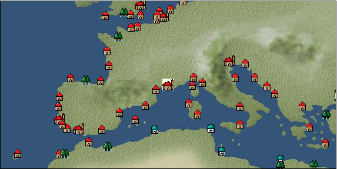

# Port: Marseille

import Tabs from '@theme/Tabs';
import TabItem from '@theme/TabItem';

## General Information

| Attribute | Details |
| :--- | :--- |
| **Port Name** | Marseille |
| **Port Type** | Headquarters |
| **Region** | western europe |
| **Sea Area** | ligurian sea |
| **Required Language** | French |
| **Coordinates** | （126，2969） |
| **Investment Reward** | [Collection of Western Mediterranean specialties](docs/Items/RecipeBooks/item_750.md) （必要投資額：1,000,000ドゥカード） |

### Available Facilities

| guild | intermediary | exchange | tool shop | workshop craftsman | Painter | sculptor | peddler |
| --- | --- | --- | --- | --- | --- | --- | --- |
| ○ | ○ | ○ | ○ | ○ |   |   | ○ |
| Shipyard Master | Lumbermaker | Sail-maker | weapon craftsman | master | TavernFemale | archive | salesperson |
| --- | --- | --- | --- | --- | --- | --- | --- |
| ○ | ○ | ○ | ○ | ○ | ○ | ○ | ○ |
| Shipwright | 銀行 | street worker | 王宮 | Trading post | church | suburbs | translator |
| --- | --- | --- | --- | --- | --- | --- | --- |
| ○ | ○ |   | ○ | ○ | ○ |   | ○ |

### Description
The city was founded in ancient Greece under the name Massilia. Venetian merchants also come and go, and trade is thriving. As agriculture is thriving in the surrounding area, a wide variety of agricultural products are traded in abundance. Tavern Girl: Irene (Help Girl: Eugenie) Beginner Navigator Training School Coachman (moves to Paris) Cultural Area: Italy/Southern France *There is a bank NPC next to the workshop craftsman

<Tabs>
  <TabItem value="trade_goods_sales" label="Trade Goods Sales">

| Item | Group | Purchase Price | Allied Price | Remarks |
| --- | --- | --- | --- | --- |
| [duck meat](docs/Items/TradeGoods/TradeGoods-Foodstuffs/item_32.md) | [Trading items (food items)](docs/Categories/category_3.md) | 306 | 268 |  |
| [walnut](docs/Items/TradeGoods/TradeGoods-Sunddries/item_522.md) | [Trading goods (hobby goods)](docs/Categories/category_10.md) | 475 | (416) |  |
| [satin](docs/Items/TradeGoods/TradeGoods-Fabrics/item_996.md) | [交易品（織物）](docs/Categories/category_20.md) | (3,156) | 2,762 |  |
| 要投資（必要投資額：400,000） |
| [brandy](docs/Items/TradeGoods/TradeGoods-Alcohol/item_9.md) | [交易品（酒類）](docs/Categories/category_9.md) | 749 | 656 |  |
| When in alliance: confirmed at 100% |
| [prune](docs/Items/TradeGoods/TradeGoods-Sunddries/item_523.md) | [Trading goods (hobby goods)](docs/Categories/category_10.md) | 328 | 288 |  |
| When in alliance: confirmed at 100% |
| [wine](docs/Items/TradeGoods/TradeGoods-Alcohol/item_11.md) | [交易品（酒類）](docs/Categories/category_9.md) | 428 | 376 |  |
| [salt](docs/Items/TradeGoods/TradeGoods-Seasonings/item_42.md) | [交易品（調味料）](docs/Categories/category_4.md) | 237 | 208 |  |
| When in alliance: confirmed at 100% |
| [paper](docs/Items/TradeGoods/TradeGoods-Wares/item_625.md) | [交易品（工業品）](docs/Categories/category_19.md) | (274) | 240 |  |
| 要投資（必要投資額：180,000） |
| [Honey](docs/Items/TradeGoods/TradeGoods-Seasonings/item_49.md) | [交易品（調味料）](docs/Categories/category_4.md) | 860 | 768 |  |
| When in alliance: confirmed at 100% |
| [青銅像](docs/Items/TradeGoods/TradeGoods-Art/item_148.md) | [交易品（美術品）](docs/Categories/category_14.md) | 986 | (863) |  |
  </TabItem>
  <TabItem value="sale_specialty" label="Sale (Specialty)">

| Item | Group | sale price | Allied Price | Remarks |
| --- | --- | --- | --- | --- |

#### [交易品（繊維）](docs/Categories/category_1.md)

| [Basho](docs/Items/TradeGoods/TradeGoods-Fibers/item_3862.md) | 交易品（繊維） | (36,761) | 42,894 |  |
| [feather](docs/Items/TradeGoods/TradeGoods-Fibers/item_585.md) | 交易品（繊維） | 877 | (986) |  |
| [tiger skin](docs/Items/TradeGoods/TradeGoods-Fibers/item_3790.md) | 交易品（繊維） | (31,269) | 36,486 |  |
| [Green ramie](docs/Items/TradeGoods/TradeGoods-Fibers/item_3428.md) | 交易品（繊維） | 33,000 | (37,128) |  |
| [deerskin](docs/Items/TradeGoods/TradeGoods-Fibers/item_3648.md) | 交易品（繊維） | (30,778) | 35,913 |  |

#### [Trading Goods (Dye)](docs/Categories/category_2.md)

| [Indian Akane](docs/Items/TradeGoods/TradeGoods-Dye/item_1037.md) | Trading Goods (Dye) | 1,198 | (1,347) |  |
| [Indian indigo](docs/Items/TradeGoods/TradeGoods-Dye/item_157.md) | Trading Goods (Dye) | 1,230 | (1,383) |  |
| [Shorou](docs/Items/TradeGoods/TradeGoods-Dye/item_3691.md) | Trading Goods (Dye) | 24,091 | (27,105) |  |
| [Safflower](docs/Items/TradeGoods/TradeGoods-Dye/item_1059.md) | Trading Goods (Dye) | 629 | (707) |  |
| [mayan blue](docs/Items/TradeGoods/TradeGoods-Dye/item_1096.md) | Trading Goods (Dye) | 1,470 | 1,654 |  |
| [gallnut](docs/Items/TradeGoods/TradeGoods-Dye/item_3429.md) | Trading Goods (Dye) | 35,589 | (40,041) |  |

#### [Trading items (food items)](docs/Categories/category_3.md)

| [Karasumi](docs/Items/TradeGoods/TradeGoods-Foodstuffs/item_3687.md) | Trading items (food items) | 32,651 | (36,735) |  |
| [Chamtashima](docs/Items/TradeGoods/TradeGoods-Foodstuffs/item_3771.md) | Trading items (food items) | (1,444) | 1,684 |  |
| [Lingjiao](docs/Items/TradeGoods/TradeGoods-Foodstuffs/item_3917.md) | Trading items (food items) | (9,017) | 10,521 |  |

#### [交易品（調味料）](docs/Categories/category_4.md)

| [Choshi](docs/Items/TradeGoods/TradeGoods-Seasonings/item_3793.md) | 交易品（調味料） | (22,578) | 26,345 |  |
| [Nampula](docs/Items/TradeGoods/TradeGoods-Seasonings/item_1972.md) | 交易品（調味料） | 566 | (636) |  |
| [apple cider vinegar](docs/Items/TradeGoods/TradeGoods-Seasonings/item_882.md) | 交易品（調味料） | 483 | (543) |  |
| [Bean sauce](docs/Items/TradeGoods/TradeGoods-Seasonings/item_3875.md) | 交易品（調味料） | (24,939) | 29,100 |  |
| [soy sauce](docs/Items/TradeGoods/TradeGoods-Seasonings/item_3425.md) | 交易品（調味料） | (33,184) | 38,721 |  |
| [black vinegar](docs/Items/TradeGoods/TradeGoods-Seasonings/item_3475.md) | 交易品（調味料） | (4,967) | 5,795 |  |

#### [交易品（雑貨）](docs/Categories/category_5.md)

| [Japanese books](docs/Items/TradeGoods/TradeGoods-Misc/item_3439.md) | 交易品（雑貨） | 34,660 | (38,996) |  |
| [lantern](docs/Items/TradeGoods/TradeGoods-Misc/item_3683.md) | 交易品（雑貨） | (36,446) | 42,527 |  |

#### [Trading products (medical products)](docs/Categories/category_6.md)

| [Noni](docs/Items/TradeGoods/TradeGoods-Medicine/item_2099.md) | Trading products (medical products) | (1,297) | 1,513 |  |
| [Borei](docs/Items/TradeGoods/TradeGoods-Medicine/item_3678.md) | Trading products (medical products) | 44,898 | (50,515) |  |
| [Nothing](docs/Items/TradeGoods/TradeGoods-Medicine/item_1053.md) | Trading products (medical products) | 745 | (838) |  |

#### [Trading Items (Iron Stone)](docs/Categories/category_7.md)

| [red copper ore](docs/Items/TradeGoods/TradeGoods-Minerals/item_3863.md) | Trading Items (Iron Stone) | (33,967) | 39,634 |  |

#### [Trading products (precious metals)](docs/Categories/category_8.md)

| [platinum](docs/Items/TradeGoods/TradeGoods-Metals/item_2178.md) | Trading products (precious metals) | (6,514) | 7,600 |  |
| [佐摩銀](docs/Items/TradeGoods/TradeGoods-Metals/item_3432.md) | Trading products (precious metals) | 36,924 | (41,543) |  |

#### [交易品（酒類）](docs/Categories/category_9.md)

| [aquavit](docs/Items/TradeGoods/TradeGoods-Alcohol/item_572.md) | 交易品（酒類） | 870 | (978) |  |
| [whiskey](docs/Items/TradeGoods/TradeGoods-Alcohol/item_1.md) | 交易品（酒類） | 872 | 960 |  |
| [gin](docs/Items/TradeGoods/TradeGoods-Alcohol/item_291.md) | 交易品（酒類） | 860 | (967) |  |
| [fruit brandy](docs/Items/TradeGoods/TradeGoods-Alcohol/item_1440.md) | 交易品（酒類） | (667) | 778 |  |
| [Taiwan rice wine](docs/Items/TradeGoods/TradeGoods-Alcohol/item_3672.md) | 交易品（酒類） | (23,120) | 26,977 |  |
| [Sake](docs/Items/TradeGoods/TradeGoods-Alcohol/item_3424.md) | 交易品（酒類） | 35,064 | (39,450) |  |

#### [Trading goods (hobby goods)](docs/Categories/category_10.md)

| [Aigyoku](docs/Items/TradeGoods/TradeGoods-Sunddries/item_3677.md) | Trading goods (hobby goods) | (30,342) | 35,404 |  |
| [cacao](docs/Items/TradeGoods/TradeGoods-Sunddries/item_140.md) | Trading goods (hobby goods) | (1,312) | 1,530 |  |
| [cranberry](docs/Items/TradeGoods/TradeGoods-Sunddries/item_4008.md) | Trading goods (hobby goods) | (1,037) | 1,210 |  |
| [tobacco](docs/Items/TradeGoods/TradeGoods-Sunddries/item_109.md) | Trading goods (hobby goods) | (4,774) | 5,570 |  |
| [blueberry](docs/Items/TradeGoods/TradeGoods-Sunddries/item_4657.md) | Trading goods (hobby goods) | (1,072) | 1,250 |  |
| [raspberry](docs/Items/TradeGoods/TradeGoods-Sunddries/item_4658.md) | Trading goods (hobby goods) | (900) | 1,050 |  |
| [dried figs](docs/Items/TradeGoods/TradeGoods-Sunddries/item_611.md) | Trading goods (hobby goods) | 361 | (406) |  |
| [dried apple](docs/Items/TradeGoods/TradeGoods-Sunddries/item_19.md) | Trading goods (hobby goods) | 439 | (493) |  |
| [black tea](docs/Items/TradeGoods/TradeGoods-Sunddries/item_675.md) | Trading goods (hobby goods) | (5,125) | 5,980 |  |

#### [Trading Goods (Spices)](docs/Categories/category_11.md)

| [gardenia](docs/Items/TradeGoods/TradeGoods-Perfume/item_1091.md) | Trading Goods (Spices) | 31,983 | (35,984) |  |
| [daffodil](docs/Items/TradeGoods/TradeGoods-Perfume/item_612.md) | Trading Goods (Spices) | 1,043 | (1,173) |  |
| [lily of the valley](docs/Items/TradeGoods/TradeGoods-Perfume/item_358.md) | Trading Goods (Spices) | 1,911 | (2,150) |  |
| [geranium](docs/Items/TradeGoods/TradeGoods-Perfume/item_145.md) | Trading Goods (Spices) | (1,076) | 1,255 |  |
| [sandalwood](docs/Items/TradeGoods/TradeGoods-Perfume/item_771.md) | Trading Goods (Spices) | 5,328 | (5,994) |  |
| [Ryushu incense](docs/Items/TradeGoods/TradeGoods-Perfume/item_101.md) | Trading Goods (Spices) | 4,025 | (4,528) |  |

#### [Trading Goods (Spices)](docs/Categories/category_12.md)

| [garam masala](docs/Items/TradeGoods/TradeGoods-Spices/item_965.md) | Trading Goods (Spices) | (691) | 806 |  |
| [cloves](docs/Items/TradeGoods/TradeGoods-Spices/item_1092.md) | Trading Goods (Spices) | (11,531) | 13,455 |  |
| [pepper](docs/Items/TradeGoods/TradeGoods-Spices/item_58.md) | Trading Goods (Spices) | (7,983) | 9,314 |  |
| [cinnamon](docs/Items/TradeGoods/TradeGoods-Spices/item_1432.md) | Trading Goods (Spices) | 5,172 | (5,819) |  |
| [star anise](docs/Items/TradeGoods/TradeGoods-Spices/item_3908.md) | Trading Goods (Spices) | (32,231) | 37,608 |  |
| [nutmeg](docs/Items/TradeGoods/TradeGoods-Spices/item_1969.md) | Trading Goods (Spices) | (12,244) | 14,286 |  |
| [mace](docs/Items/TradeGoods/TradeGoods-Spices/item_2100.md) | Trading Goods (Spices) | (12,506) | 14,592 |  |
| [lemongrass](docs/Items/TradeGoods/TradeGoods-Spices/item_2096.md) | Trading Goods (Spices) | (2,907) | 3,391 |  |
| [Grapefruit](docs/Items/TradeGoods/TradeGoods-Spices/item_3422.md) | Trading Goods (Spices) | 34,936 | (39,306) |  |

#### [Trading goods (artificial goods)](docs/Categories/category_13.md)

| [Darla Hest](docs/Items/TradeGoods/TradeGoods-Luxuries/item_6190.md) | Trading goods (artificial goods) | (4,037) | 4,710 |  |
| [Kuresute](docs/Items/TradeGoods/TradeGoods-Luxuries/item_3897.md) | Trading goods (artificial goods) | 10,364 | (11,660) |  |
| [Song Baici](docs/Items/TradeGoods/TradeGoods-Luxuries/item_3904.md) | Trading goods (artificial goods) | (45,543) | 53,142 |  |
| [湖筆](docs/Items/TradeGoods/TradeGoods-Luxuries/item_3898.md) | Trading goods (artificial goods) | 10,116 | (11,381) |  |
| [lacquerware](docs/Items/TradeGoods/TradeGoods-Luxuries/item_3435.md) | Trading goods (artificial goods) | 36,225 | (40,757) |  |
| [Saori](docs/Items/TradeGoods/TradeGoods-Luxuries/item_3676.md) | Trading goods (artificial goods) | (9,570) | 11,166 |  |
| [Corner work](docs/Items/TradeGoods/TradeGoods-Luxuries/item_3696.md) | Trading goods (artificial goods) | 44,643 | (50,228) |  |

#### [交易品（美術品）](docs/Categories/category_14.md)

| [chinese calligraphy](docs/Items/TradeGoods/TradeGoods-Art/item_3926.md) | 交易品（美術品） | 32,858 | (36,968) |  |
| [Japanese painting](docs/Items/TradeGoods/TradeGoods-Art/item_3436.md) | 交易品（美術品） | (30,852) | 36,000 |  |

#### [Trading Items (Gemstones)](docs/Categories/category_15.md)

| [inca rose](docs/Items/TradeGoods/TradeGoods-Gems/item_3014.md) | Trading Items (Gemstones) | 18,246 | (20,528) |  |
| [opal](docs/Items/TradeGoods/TradeGoods-Gems/item_2006.md) | Trading Items (Gemstones) | (7,166) | 8,361 |  |
| [sapphire](docs/Items/TradeGoods/TradeGoods-Gems/item_676.md) | Trading Items (Gemstones) | (10,542) | 12,300 |  |
| [turquoise](docs/Items/TradeGoods/TradeGoods-Gems/item_1006.md) | Trading Items (Gemstones) | 3,715 | (4,179) |  |
| [diamond](docs/Items/TradeGoods/TradeGoods-Gems/item_449.md) | Trading Items (Gemstones) | 7,120 | (8,010) |  |
| [topaz](docs/Items/TradeGoods/TradeGoods-Gems/item_1097.md) | Trading Items (Gemstones) | 5,158 | 5,713 |  |
| [tourmaline](docs/Items/TradeGoods/TradeGoods-Gems/item_4092.md) | Trading Items (Gemstones) | (6,582) | 7,680 |  |
| [pink diamond](docs/Items/TradeGoods/TradeGoods-Gems/item_2874.md) | Trading Items (Gemstones) | (12,941) | 15,100 |  |
| [lapis lazuli](docs/Items/TradeGoods/TradeGoods-Gems/item_995.md) | Trading Items (Gemstones) | 6,041 | (6,796) |  |
| [ruby](docs/Items/TradeGoods/TradeGoods-Gems/item_773.md) | Trading Items (Gemstones) | 12,927 | (14,544) |  |
| [amber](docs/Items/TradeGoods/TradeGoods-Gems/item_618.md) | Trading Items (Gemstones) | (3,951) | 4,610 |  |
| [amethyst](docs/Items/TradeGoods/TradeGoods-Gems/item_3434.md) | Trading Items (Gemstones) | 37,565 | (42,264) |  |

#### [Trading Items (Arms)](docs/Categories/category_16.md)

| [Japanese sword](docs/Items/TradeGoods/TradeGoods-Weapons/item_3437.md) | Trading Items (Arms) | 33,605 | (37,809) |  |
| [western armor](docs/Items/TradeGoods/TradeGoods-Weapons/item_6.md) | Trading Items (Arms) | 3,293 | (3,704) |  |

#### [Trading Items (Firearms)](docs/Categories/category_17.md)

| [monocular gun](docs/Items/TradeGoods/TradeGoods-Firearms/item_3916.md) | Trading Items (Firearms) | (33,440) | 39,019 |  |
| [tanegashima gun](docs/Items/TradeGoods/TradeGoods-Firearms/item_3423.md) | Trading Items (Firearms) | 24,667 | 27,728 |  |
| [銅手銃](docs/Items/TradeGoods/TradeGoods-Firearms/item_3700.md) | Trading Items (Firearms) | 31,633 | (35,590) |  |

#### [交易品（工業品）](docs/Categories/category_19.md)

| [rubber](docs/Items/TradeGoods/TradeGoods-Wares/item_2819.md) | 交易品（工業品） | 1,522 | (1,712) |  |
| [papyrus](docs/Items/TradeGoods/TradeGoods-Wares/item_616.md) | 交易品（工業品） | 505 | 529 |  |
| [Japanese paper](docs/Items/TradeGoods/TradeGoods-Wares/item_3438.md) | 交易品（工業品） | (24,768) | 28,900 |  |
| [bamboo](docs/Items/TradeGoods/TradeGoods-Wares/item_3899.md) | 交易品（工業品） | 34,149 | (38,421) |  |

#### [交易品（織物）](docs/Categories/category_20.md)

| [indian chintz](docs/Items/TradeGoods/TradeGoods-Fabrics/item_159.md) | 交易品（織物） | 2,328 | (2,619) |  |
| [dutch calico](docs/Items/TradeGoods/TradeGoods-Fabrics/item_1435.md) | 交易品（織物） | 1,361 | (1,531) |  |
| [gobelin weave](docs/Items/TradeGoods/TradeGoods-Fabrics/item_1276.md) | 交易品（織物） | (3,634) | 4,240 |  |
| [damask](docs/Items/TradeGoods/TradeGoods-Fabrics/item_614.md) | 交易品（織物） | (3,454) | 4,030 |  |
| [turkish rug](docs/Items/TradeGoods/TradeGoods-Fabrics/item_686.md) | 交易品（織物） | (3,991) | 4,656 |  |
| [flannel](docs/Items/TradeGoods/TradeGoods-Fabrics/item_149.md) | 交易品（織物） | 1,537 | (1,729) |  |
| [persian rug](docs/Items/TradeGoods/TradeGoods-Fabrics/item_606.md) | 交易品（織物） | (8,978) | 10,475 |  |
| [唐錦](docs/Items/TradeGoods/TradeGoods-Fabrics/item_3896.md) | 交易品（織物） | 35,699 | (40,165) |  |
| [明紬](docs/Items/TradeGoods/TradeGoods-Fabrics/item_3753.md) | 交易品（織物） | (31,452) | 36,700 |  |
  </TabItem>
  <TabItem value="sale_no_specialty" label="Sale (No Specialty)">

| Item | Group | sale price | Allied Price | Remarks |
| --- | --- | --- | --- | --- |

#### [交易品（繊維）](docs/Categories/category_1.md)

| [Manila hemp](docs/Items/TradeGoods/TradeGoods-Fibers/item_2098.md) | 交易品（繊維） | (196) | 228 |  |
| [camel hair](docs/Items/TradeGoods/TradeGoods-Fibers/item_577.md) | 交易品（繊維） | 498 | (560) |  |
| [flax](docs/Items/TradeGoods/TradeGoods-Fibers/item_64.md) | 交易品（繊維） | (275) | 320 |  |
| [goat hair](docs/Items/TradeGoods/TradeGoods-Fibers/item_770.md) | 交易品（繊維） | 1,268 | (1,426) |  |
| [kenaf](docs/Items/TradeGoods/TradeGoods-Fibers/item_576.md) | 交易品（繊維） | 227 | (255) |  |
| [leather](docs/Items/TradeGoods/TradeGoods-Fibers/item_44.md) | 交易品（繊維） | 610 | (686) |  |
| [cotton](docs/Items/TradeGoods/TradeGoods-Fibers/item_610.md) | 交易品（繊維） | (558) | 651 |  |
| [wool](docs/Items/TradeGoods/TradeGoods-Fibers/item_5.md) | 交易品（繊維） | 485 | 502 |  |
| [numb](docs/Items/TradeGoods/TradeGoods-Fibers/item_900.md) | 交易品（繊維） | 12 | (13) |  |
| [jute](docs/Items/TradeGoods/TradeGoods-Fibers/item_128.md) | 交易品（繊維） | 197 | (221) |  |

#### [Trading Goods (Dye)](docs/Categories/category_2.md)

| [ward](docs/Items/TradeGoods/TradeGoods-Dye/item_57.md) | Trading Goods (Dye) | 883 | (993) |  |
| [貝紫](docs/Items/TradeGoods/TradeGoods-Dye/item_110.md) | Trading Goods (Dye) | 4,539 | 4,600 |  |

#### [Trading items (food items)](docs/Categories/category_3.md)

| [mushroom](docs/Items/TradeGoods/TradeGoods-Foodstuffs/item_160.md) | Trading items (food items) | (28) | 32 |  |
| [fava beans](docs/Items/TradeGoods/TradeGoods-Foodstuffs/item_102.md) | Trading items (food items) | 90 | (101) |  |
| [duck meat](docs/Items/TradeGoods/TradeGoods-Foodstuffs/item_32.md) | Trading items (food items) | 121 | (136) |  |
| [olive](docs/Items/TradeGoods/TradeGoods-Foodstuffs/item_47.md) | Trading items (food items) | (262) | 305 |  |
| [turnip](docs/Items/TradeGoods/TradeGoods-Foodstuffs/item_55.md) | Trading items (food items) | 80 | 84 |  |
| [sausage](docs/Items/TradeGoods/TradeGoods-Foodstuffs/item_27.md) | Trading items (food items) | 500 | (562) |  |
| [cheese](docs/Items/TradeGoods/TradeGoods-Foodstuffs/item_20.md) | Trading items (food items) | 402 | (452) |  |
| [carrot](docs/Items/TradeGoods/TradeGoods-Foodstuffs/item_2708.md) | Trading items (food items) | 100 | 104 |  |
| [ham](docs/Items/TradeGoods/TradeGoods-Foodstuffs/item_290.md) | Trading items (food items) | 399 | (448) |  |
| [bacon](docs/Items/TradeGoods/TradeGoods-Foodstuffs/item_566.md) | Trading items (food items) | 391 | (439) |  |
| [european crayfish](docs/Items/TradeGoods/TradeGoods-Foodstuffs/item_6188.md) | Trading items (food items) | (5,434) | 6,340 |  |
| [milk](docs/Items/TradeGoods/TradeGoods-Foodstuffs/item_254.md) | Trading items (food items) | 148 | (166) |  |
| [egg](docs/Items/TradeGoods/TradeGoods-Foodstuffs/item_40.md) | Trading items (food items) | 34 | 36 |  |
| [Red bean](docs/Items/TradeGoods/TradeGoods-Foodstuffs/item_3419.md) | Trading items (food items) | (264) | 308 |  |
| When in alliance: confirmed at 100% |
| [wheat](docs/Items/TradeGoods/TradeGoods-Foodstuffs/item_16.md) | Trading items (food items) | 62 | (69) |  |
| [beef](docs/Items/TradeGoods/TradeGoods-Foodstuffs/item_26.md) | Trading items (food items) | 617 | 777 |  |
| [mutton](docs/Items/TradeGoods/TradeGoods-Foodstuffs/item_33.md) | Trading items (food items) | 434 | (488) |  |
| [pork](docs/Items/TradeGoods/TradeGoods-Foodstuffs/item_41.md) | Trading items (food items) | 352 | (396) |  |
| [red bean](docs/Items/TradeGoods/TradeGoods-Foodstuffs/item_123.md) | Trading items (food items) | 134 | (150) |  |
| [陸稲](docs/Items/TradeGoods/TradeGoods-Foodstuffs/item_100.md) | Trading items (food items) | 103 | (115) |  |
| [餡](docs/Items/TradeGoods/TradeGoods-Foodstuffs/item_3474.md) | Trading items (food items) | (1,286) | 1,500 |  |
| When in alliance: confirmed at 100% |
| [魚肉](docs/Items/TradeGoods/TradeGoods-Foodstuffs/item_10.md) | Trading items (food items) | 183 | 192 |  |
| [chicken meat](docs/Items/TradeGoods/TradeGoods-Foodstuffs/item_29.md) | Trading items (food items) | 331 | 331 |  |

#### [交易品（調味料）](docs/Categories/category_4.md)

| [anchovies](docs/Items/TradeGoods/TradeGoods-Seasonings/item_3004.md) | 交易品（調味料） | 288 | (324) |  |
| [almond oil](docs/Items/TradeGoods/TradeGoods-Seasonings/item_578.md) | 交易品（調味料） | 681 | (766) |  |
| [olive oil](docs/Items/TradeGoods/TradeGoods-Seasonings/item_48.md) | 交易品（調味料） | 328 | 339 |  |
| [coconut vinegar](docs/Items/TradeGoods/TradeGoods-Seasonings/item_1988.md) | 交易品（調味料） | 518 | (582) |  |
| [jam](docs/Items/TradeGoods/TradeGoods-Seasonings/item_427.md) | 交易品（調味料） | 629 | (707) |  |
| [butter](docs/Items/TradeGoods/TradeGoods-Seasonings/item_3.md) | 交易品（調味料） | 377 | (424) |  |
| [white vinegar](docs/Items/TradeGoods/TradeGoods-Seasonings/item_56.md) | 交易品（調味料） | (155) | 180 |  |
| [lard](docs/Items/TradeGoods/TradeGoods-Seasonings/item_43.md) | 交易品（調味料） | 299 | (336) |  |
| [wine vinegar](docs/Items/TradeGoods/TradeGoods-Seasonings/item_429.md) | 交易品（調味料） | 578 | (650) |  |
| [salt](docs/Items/TradeGoods/TradeGoods-Seasonings/item_42.md) | 交易品（調味料） | 104 | (117) |  |
| When in alliance: confirmed at 100% |
| [sugar](docs/Items/TradeGoods/TradeGoods-Seasonings/item_94.md) | 交易品（調味料） | 882 | (992) |  |

#### [交易品（雑貨）](docs/Categories/category_5.md)

| [Western books](docs/Items/TradeGoods/TradeGoods-Misc/item_293.md) | 交易品（雑貨） | 720 | (810) |  |

#### [Trading products (medical products)](docs/Categories/category_6.md)

| [nettle](docs/Items/TradeGoods/TradeGoods-Medicine/item_6189.md) | Trading products (medical products) | (652) | 760 |  |
| [digitalis](docs/Items/TradeGoods/TradeGoods-Medicine/item_2148.md) | Trading products (medical products) | 379 | (426) |  |
| [Mandragora](docs/Items/TradeGoods/TradeGoods-Medicine/item_1054.md) | Trading products (medical products) | 1,028 | (1,156) |  |
| [mercury agent](docs/Items/TradeGoods/TradeGoods-Medicine/item_703.md) | Trading products (medical products) | 1,385 | (1,558) |  |

#### [Trading Items (Iron Stone)](docs/Categories/category_7.md)

| [tin ore](docs/Items/TradeGoods/TradeGoods-Minerals/item_23.md) | Trading Items (Iron Stone) | 578 | (650) |  |
| [Saltpeter](docs/Items/TradeGoods/TradeGoods-Minerals/item_884.md) | Trading Items (Iron Stone) | 2,055 | (2,312) |  |
| [cinnabar](docs/Items/TradeGoods/TradeGoods-Minerals/item_154.md) | Trading Items (Iron Stone) | 1,010 | (1,136) |  |
| [iron ore](docs/Items/TradeGoods/TradeGoods-Minerals/item_146.md) | Trading Items (Iron Stone) | 738 | 784 |  |
| [lead ore](docs/Items/TradeGoods/TradeGoods-Minerals/item_21.md) | Trading Items (Iron Stone) | 507 | (570) |  |
| [copper ore](docs/Items/TradeGoods/TradeGoods-Minerals/item_65.md) | Trading Items (Iron Stone) | 915 | (1,029) |  |

#### [Trading products (precious metals)](docs/Categories/category_8.md)

| [gold](docs/Items/TradeGoods/TradeGoods-Metals/item_659.md) | Trading products (precious metals) | 8,490 | (9,552) |  |
| [silver](docs/Items/TradeGoods/TradeGoods-Metals/item_136.md) | Trading products (precious metals) | 2,850 | 2,880 |  |

#### [交易品（酒類）](docs/Categories/category_9.md)

| [sherry](docs/Items/TradeGoods/TradeGoods-Alcohol/item_844.md) | 交易品（酒類） | 498 | 518 |  |
| [Beer](docs/Items/TradeGoods/TradeGoods-Alcohol/item_2.md) | 交易品（酒類） | 398 | 427 |  |
| [palm wine](docs/Items/TradeGoods/TradeGoods-Alcohol/item_436.md) | 交易品（酒類） | 453 | (509) |  |
| [rum](docs/Items/TradeGoods/TradeGoods-Alcohol/item_139.md) | 交易品（酒類） | 720 | (810) |  |
| [liqueur](docs/Items/TradeGoods/TradeGoods-Alcohol/item_18.md) | 交易品（酒類） | 643 | (723) |  |
| [Milk liquor](docs/Items/TradeGoods/TradeGoods-Alcohol/item_2897.md) | 交易品（酒類） | 398 | (447) |  |
| [Shochu](docs/Items/TradeGoods/TradeGoods-Alcohol/item_3449.md) | 交易品（酒類） | 6,200 | (6,975) |  |
| Confirmed at 100% when non-aligned. Junior 6th class |
| [紹興酒](docs/Items/TradeGoods/TradeGoods-Alcohol/item_3882.md) | 交易品（酒類） | (34,638) | 40,417 |  |

#### [Trading goods (hobby goods)](docs/Categories/category_10.md)

| [almond](docs/Items/TradeGoods/TradeGoods-Sunddries/item_367.md) | Trading goods (hobby goods) | 200 | (225) |  |
| [eggplant](docs/Items/TradeGoods/TradeGoods-Sunddries/item_3426.md) | Trading goods (hobby goods) | 33,067 | (37,203) |  |
| [pickles](docs/Items/TradeGoods/TradeGoods-Sunddries/item_535.md) | Trading goods (hobby goods) | 290 | (326) |  |
| [hazelnut](docs/Items/TradeGoods/TradeGoods-Sunddries/item_125.md) | Trading goods (hobby goods) | 464 | (522) |  |
| [raisins](docs/Items/TradeGoods/TradeGoods-Sunddries/item_35.md) | Trading goods (hobby goods) | 341 | 354 |  |

#### [Trading Goods (Spices)](docs/Categories/category_11.md)

| [oakmoss](docs/Items/TradeGoods/TradeGoods-Perfume/item_819.md) | Trading Goods (Spices) | 838 | (942) |  |
| [lavender](docs/Items/TradeGoods/TradeGoods-Perfume/item_150.md) | Trading Goods (Spices) | 885 | 899 |  |
| [lemon oil](docs/Items/TradeGoods/TradeGoods-Perfume/item_151.md) | Trading Goods (Spices) | 547 | 571 |  |
| [rose](docs/Items/TradeGoods/TradeGoods-Perfume/item_536.md) | Trading Goods (Spices) | 2,800 | (3,150) |  |
| [Musk](docs/Items/TradeGoods/TradeGoods-Perfume/item_158.md) | Trading Goods (Spices) | 4,463 | (5,021) |  |

#### [Trading Goods (Spices)](docs/Categories/category_12.md)

| [oregano](docs/Items/TradeGoods/TradeGoods-Spices/item_430.md) | Trading Goods (Spices) | 532 | (598) |  |
| [garlic](docs/Items/TradeGoods/TradeGoods-Spices/item_526.md) | Trading Goods (Spices) | 321 | 338 |  |
| [cumin](docs/Items/TradeGoods/TradeGoods-Spices/item_156.md) | Trading Goods (Spices) | 1,050 | 1,142 |  |
| [coriander](docs/Items/TradeGoods/TradeGoods-Spices/item_1044.md) | Trading Goods (Spices) | 458 | (515) |  |
| [Sesame](docs/Items/TradeGoods/TradeGoods-Spices/item_437.md) | Trading Goods (Spices) | (303) | 353 |  |
| [saffron](docs/Items/TradeGoods/TradeGoods-Spices/item_845.md) | Trading Goods (Spices) | 2,378 | (2,675) |  |
| [celery](docs/Items/TradeGoods/TradeGoods-Spices/item_431.md) | Trading Goods (Spices) | 142 | (159) |  |
| [time](docs/Items/TradeGoods/TradeGoods-Spices/item_432.md) | Trading Goods (Spices) | 458 | (515) |  |
| [parsley](docs/Items/TradeGoods/TradeGoods-Spices/item_46.md) | Trading Goods (Spices) | 142 | 148 |  |
| [mustard](docs/Items/TradeGoods/TradeGoods-Spices/item_575.md) | Trading Goods (Spices) | 272 | (306) |  |
| [rosemary](docs/Items/TradeGoods/TradeGoods-Spices/item_428.md) | Trading Goods (Spices) | 419 | (471) |  |

#### [Trading goods (artificial goods)](docs/Categories/category_13.md)

| [glasswork](docs/Items/TradeGoods/TradeGoods-Luxuries/item_60.md) | Trading goods (artificial goods) | 1,180 | 1,210 |  |
| [coral work](docs/Items/TradeGoods/TradeGoods-Luxuries/item_595.md) | Trading goods (artificial goods) | 2,874 | (3,233) |  |
| [lapidary work](docs/Items/TradeGoods/TradeGoods-Luxuries/item_153.md) | Trading goods (artificial goods) | 4,100 | 4,100 |  |
| [皮革製品](docs/Items/TradeGoods/TradeGoods-Luxuries/item_12.md) | Trading goods (artificial goods) | 1,269 | 1,320 |  |
| [goldsmith](docs/Items/TradeGoods/TradeGoods-Luxuries/item_687.md) | Trading goods (artificial goods) | (2,597) | 3,030 |  |
| [silversmith](docs/Items/TradeGoods/TradeGoods-Luxuries/item_619.md) | Trading goods (artificial goods) | 3,000 | (3,375) |  |
| [ceramics](docs/Items/TradeGoods/TradeGoods-Luxuries/item_152.md) | Trading goods (artificial goods) | 1,459 | 1,510 |  |
| [luxury clothing](docs/Items/TradeGoods/TradeGoods-Luxuries/item_165.md) | Trading goods (artificial goods) | 4,420 | (4,972) |  |

#### [交易品（美術品）](docs/Categories/category_14.md)

| [古美術品](docs/Items/TradeGoods/TradeGoods-Art/item_51.md) | 交易品（美術品） | 3,490 | (3,926) |  |
| [marble statue](docs/Items/TradeGoods/TradeGoods-Art/item_50.md) | 交易品（美術品） | 3,059 | (3,441) |  |
| [oil painting](docs/Items/TradeGoods/TradeGoods-Art/item_1088.md) | 交易品（美術品） | (1,869) | 2,180 |  |

#### [Trading Items (Gemstones)](docs/Categories/category_15.md)

| [Agate](docs/Items/TradeGoods/TradeGoods-Gems/item_107.md) | Trading Items (Gemstones) | (4,634) | 5,407 |  |
| [emerald](docs/Items/TradeGoods/TradeGoods-Gems/item_777.md) | Trading Items (Gemstones) | 7,860 | (8,843) |  |
| [garnet](docs/Items/TradeGoods/TradeGoods-Gems/item_1005.md) | Trading Items (Gemstones) | (4,259) | 4,969 |  |
| [coral](docs/Items/TradeGoods/TradeGoods-Gems/item_141.md) | Trading Items (Gemstones) | 2,920 | (3,285) |  |
| [peridot](docs/Items/TradeGoods/TradeGoods-Gems/item_1098.md) | Trading Items (Gemstones) | (2,811) | 3,280 |  |
| [crystal](docs/Items/TradeGoods/TradeGoods-Gems/item_893.md) | Trading Items (Gemstones) | 1,855 | (2,087) |  |
| [pearl](docs/Items/TradeGoods/TradeGoods-Gems/item_769.md) | Trading Items (Gemstones) | 8,790 | 9,810 |  |
| [ivory](docs/Items/TradeGoods/TradeGoods-Gems/item_699.md) | Trading Items (Gemstones) | 3,589 | (4,038) |  |

#### [Trading Items (Arms)](docs/Categories/category_16.md)

| [crossbow](docs/Items/TradeGoods/TradeGoods-Weapons/item_537.md) | Trading Items (Arms) | 1,010 | (1,136) |  |
| [two-handed sword](docs/Items/TradeGoods/TradeGoods-Weapons/item_24.md) | Trading Items (Arms) | 1,650 | (1,856) |  |
| [scimitar](docs/Items/TradeGoods/TradeGoods-Weapons/item_142.md) | Trading Items (Arms) | 1,087 | (1,222) |  |
| [dagger](docs/Items/TradeGoods/TradeGoods-Weapons/item_143.md) | Trading Items (Arms) | 947 | (1,065) |  |

#### [Trading Items (Firearms)](docs/Categories/category_17.md)

| [arquebus gun](docs/Items/TradeGoods/TradeGoods-Firearms/item_14.md) | Trading Items (Firearms) | 1,832 | 1,910 |  |
| [musket gun](docs/Items/TradeGoods/TradeGoods-Firearms/item_584.md) | Trading Items (Firearms) | 2,785 | (3,133) |  |
| [大砲](docs/Items/TradeGoods/TradeGoods-Firearms/item_4.md) | Trading Items (Firearms) | 3,495 | (3,932) |  |
| [bullet](docs/Items/TradeGoods/TradeGoods-Firearms/item_13.md) | Trading Items (Firearms) | 898 | 913 |  |
| [cannonball](docs/Items/TradeGoods/TradeGoods-Firearms/item_144.md) | Trading Items (Firearms) | 1,725 | 1,762 |  |

#### [Trading Goods (Livestock)](docs/Categories/category_18.md)

| [duck](docs/Items/TradeGoods/TradeGoods-Livestock/item_38.md) | Trading Goods (Livestock) | 60 | 69 |  |
| [cow](docs/Items/TradeGoods/TradeGoods-Livestock/item_17.md) | Trading Goods (Livestock) | 341 | (383) |  |
| [chicken](docs/Items/TradeGoods/TradeGoods-Livestock/item_252.md) | Trading Goods (Livestock) | 52 | 55 |  |
| [sheep](docs/Items/TradeGoods/TradeGoods-Livestock/item_253.md) | Trading Goods (Livestock) | 131 | (147) |  |
| [pig](docs/Items/TradeGoods/TradeGoods-Livestock/item_37.md) | Trading Goods (Livestock) | 67 | (75) |  |
| [goat](docs/Items/TradeGoods/TradeGoods-Livestock/item_534.md) | Trading Goods (Livestock) | (174) | 203 |  |

#### [交易品（工業品）](docs/Categories/category_19.md)

| [alabaster](docs/Items/TradeGoods/TradeGoods-Wares/item_1086.md) | 交易品（工業品） | 622 | 661 |  |
| [wax](docs/Items/TradeGoods/TradeGoods-Wares/item_54.md) | 交易品（工業品） | (807) | 941 |  |
| [log](docs/Items/TradeGoods/TradeGoods-Wares/item_846.md) | 交易品（工業品） | 132 | (148) |  |
| [marble](docs/Items/TradeGoods/TradeGoods-Wares/item_52.md) | 交易品（工業品） | 1,379 | (1,551) |  |
| [wood](docs/Items/TradeGoods/TradeGoods-Wares/item_277.md) | 交易品（工業品） | 823 | 880 |  |
| [水銀](docs/Items/TradeGoods/TradeGoods-Wares/item_15.md) | 交易品（工業品） | 1,220 | (1,372) |  |
| [brass](docs/Items/TradeGoods/TradeGoods-Wares/item_624.md) | 交易品（工業品） | 856 | (963) |  |
| [graphite](docs/Items/TradeGoods/TradeGoods-Wares/item_25.md) | 交易品（工業品） | 1,164 | (1,309) |  |
| [oil](docs/Items/TradeGoods/TradeGoods-Wares/item_613.md) | 交易品（工業品） | 630 | (708) |  |
| [羊皮紙](docs/Items/TradeGoods/TradeGoods-Wares/item_53.md) | 交易品（工業品） | (1,106) | 1,290 |  |
| [iron material](docs/Items/TradeGoods/TradeGoods-Wares/item_268.md) | 交易品（工業品） | 968 | (1,089) |  |
| [鋼](docs/Items/TradeGoods/TradeGoods-Wares/item_573.md) | 交易品（工業品） | 1,293 | (1,454) |  |
| [青銅](docs/Items/TradeGoods/TradeGoods-Wares/item_7.md) | 交易品（工業品） | 1,330 | (1,496) |  |
| [ebony](docs/Items/TradeGoods/TradeGoods-Wares/item_2094.md) | 交易品（工業品） | (1,903) | 2,220 |  |

#### [交易品（織物）](docs/Categories/category_20.md)

| [corduroy](docs/Items/TradeGoods/TradeGoods-Fabrics/item_824.md) | 交易品（織物） | (840) | 979 |  |
| [georgette](docs/Items/TradeGoods/TradeGoods-Fabrics/item_1000.md) | 交易品（織物） | (2,529) | 2,950 |  |
| [tweed](docs/Items/TradeGoods/TradeGoods-Fabrics/item_31.md) | 交易品（織物） | 1,400 | (1,575) |  |
| [knit](docs/Items/TradeGoods/TradeGoods-Fabrics/item_164.md) | 交易品（織物） | 550 | (618) |  |
| [velvet](docs/Items/TradeGoods/TradeGoods-Fabrics/item_902.md) | 交易品（織物） | 3,000 | (3,375) |  |
| [woolen fabric](docs/Items/TradeGoods/TradeGoods-Fabrics/item_163.md) | 交易品（織物） | 896 | (1,008) |  |
| [cotton fabric](docs/Items/TradeGoods/TradeGoods-Fabrics/item_571.md) | 交易品（織物） | 1,036 | 1,070 |  |
| [linen fabric](docs/Items/TradeGoods/TradeGoods-Fabrics/item_135.md) | 交易品（織物） | 486 | (546) |  |
  </TabItem>
  <TabItem value="guild_&_others" label="Guild & Others">

| Item | Group | Sales price | Handling NPC | Remarks |
| --- | --- | --- | --- | --- |

#### adventure guild

| [biology](docs/Skills/Skill-Adventure/item_434.md) | [Skill (adventure)](docs/Categories/category_39.md) | 5,000 | adventure guild |  |
| [archeology](docs/Skills/Skill-Adventure/item_342.md) | [Skill (adventure)](docs/Categories/category_39.md) | 3,000 | adventure guild |  |
| [observation](docs/Skills/Skill-Adventure/item_459.md) | [Skill (adventure)](docs/Categories/category_39.md) | 2,000 | adventure guild |  |

#### merchant guild

| [storage](docs/Skills/Skill-Trade/item_473.md) | [Skill (trade)](docs/Categories/category_40.md) | 8,000 | merchant guild |  |
| [social contact](docs/Skills/Skill-Trade/item_467.md) | [Skill (trade)](docs/Categories/category_40.md) | 2,000 | merchant guild |  |
| [運用](docs/Skills/Skill-Trade/item_469.md) | [Skill (trade)](docs/Categories/category_40.md) | 8,000 | merchant guild |  |

#### maritime guild

| [repair](docs/Skills/Skill-Battle/item_502.md) | [Skill (combat)](docs/Categories/category_41.md) | 8,000 | maritime guild |  |
| [docking](docs/Skills/Skill-Battle/item_496.md) | [Skill (combat)](docs/Categories/category_41.md) | 2,000 | maritime guild |  |
| [steering](docs/Skills/Skill-Battle/item_507.md) | [Skill (combat)](docs/Categories/category_41.md) | 1,000 | maritime guild |  |

#### Irene

| [Sewing method for female aristocrat costumes](docs/Items/RecipeBooks/item_5582.md) | [recipe book](docs/Categories/category_22.md) | Fixed recipe | Irene |  |

#### Duke of Condé

| [Livestock trading](docs/Skills/Skill-Trade/item_1490.md) | [Skill (trade)](docs/Categories/category_40.md) | 10,000 | Duke of Condé |  |
| [seasoning trading](docs/Skills/Skill-Trade/item_477.md) | [Skill (trade)](docs/Categories/category_40.md) | 4,000 | Duke of Condé |  |

#### da vinci

| [美術](docs/Skills/Skill-Adventure/item_285.md) | [Skill (adventure)](docs/Categories/category_39.md) | 5,000 | da vinci |  |
| [Crafts](docs/Skills/Skill-Trade/item_476.md) | [Skill (trade)](docs/Categories/category_40.md) | 20,000 | da vinci |  |
| [italian](docs/Skills/Skills-Language/item_422.md) | [Skills (language)](docs/Categories/category_42.md) | 1,000 | da vinci |  |

#### nostradamus

| [Mine discovered](docs/Skills/Skill-Adventure/item_465.md) | [Skill (adventure)](docs/Categories/category_39.md) | 15,000 | nostradamus |  |
| [unlock](docs/Skills/Skill-Adventure/item_460.md) | [Skill (adventure)](docs/Categories/category_39.md) | 30,000 | nostradamus |  |
| [Pathology](docs/Skills/Skill-Battle/item_505.md) | [Skill (combat)](docs/Categories/category_41.md) | 4,000 | nostradamus |  |

#### Francois Rabelais

| [religious studies](docs/Skills/Skill-Adventure/item_340.md) | [Skill (adventure)](docs/Categories/category_39.md) | 8,000 | Francois Rabelais |  |
| [dutch](docs/Skills/Skills-Language/item_599.md) | [Skills (language)](docs/Categories/category_42.md) | 1,000 | Francois Rabelais |  |
| [English](docs/Skills/Skills-Language/item_341.md) | [Skills (language)](docs/Categories/category_42.md) | 1,000 | Francois Rabelais |  |

#### Marshal of Montmorency

| [Banquet](docs/Skills/Skill-Adventure/item_457.md) | [Skill (adventure)](docs/Categories/category_39.md) | 25,000 | Marshal of Montmorency |  |
| [ballistics](docs/Skills/Skill-Battle/item_443.md) | [Skill (combat)](docs/Categories/category_41.md) | 25,000 | Marshal of Montmorency |  |
| [request for reinforcements](docs/Skills/Skill-Battle/item_510.md) | [Skill (combat)](docs/Categories/category_41.md) | 5,000 | Marshal of Montmorency |  |

#### others

| [French national favorite hat sewing method](docs/Items/RecipeBooks/item_4513.md) | [recipe book](docs/Categories/category_22.md) | Fixed recipe |  |  |
| girl in the audience |
| [Bonnet hat sewing method](docs/Items/RecipeBooks/item_4515.md) | [recipe book](docs/Categories/category_22.md) | Fixed recipe |  |  |
| Period limited (1st period of the 16th century) Local lady |
| [超文明服飾縫製法](docs/Items/RecipeBooks/item_5018.md) | [recipe book](docs/Categories/category_22.md) | Fixed recipe |  |  |
| 書記官 |
  </TabItem>
  <TabItem value="toolman" label="Toolman">

| Item | Group | Sales price | Handling NPC | Remarks |
| --- | --- | --- | --- | --- |

#### [recipe book](docs/Categories/category_22.md)

| [Mode Design Collection Volume 4](docs/Items/RecipeBooks/item_729.md) | recipe book | 300,000 | tool shop owner |  |
| 時代限定（15世紀第2期、15世紀第3期、15世紀第4期） |
| [Sword training/introduction](docs/Items/RecipeBooks/item_754.md) | recipe book | 20,000 | tool shop owner |  |
| [sweets made with fruit](docs/Items/RecipeBooks/item_911.md) | recipe book | 7,000 | tool shop owner |  |
| [Fisherman's tips: How to preserve fresh fish](docs/Items/RecipeBooks/item_319.md) | recipe book | 5,000 | tool shop owner |  |
| [Book of textile secrets and materials](docs/Items/RecipeBooks/item_321.md) | recipe book | 5,000 | tool shop owner |  |
| [Textile secrets/book of high quality fabrics](docs/Items/RecipeBooks/item_756.md) | recipe book | 100,000 | tool shop owner |  |
| 要投資（必要投資額：不明） |
| [How to sew golden priest clothes](docs/Items/RecipeBooks/item_753.md) | recipe book | 800,000 | tool shop owner |  |
| 要投資（必要投資額：不明） |
| [Armor craftsman's craft techniques](docs/Items/RecipeBooks/item_1469.md) | recipe book | 300,000 | tool shop owner |  |
| 要投資（必要投資額：不明） |
| [High quality delivery packaging (NO.2)](docs/Items/RecipeBooks/item_4200.md) | recipe book | Fixed recipe | tool shop owner |  |
| [How to sew a luxury hat](docs/Items/RecipeBooks/item_752.md) | recipe book | 200,000 | tool shop owner |  |
| 要投資（必要投資額：不明） |

#### [Equipment (head)](docs/Categories/category_23.md)

| [Wimple](docs/Items/Equipment/Equipment-Head/item_1414.md) | Equipment (head) | 6,600 | tool shop owner |  |
| [Chapron](docs/Items/Equipment/Equipment-Head/item_1443.md) | Equipment (head) | 53,800 | tool shop owner |  |
| 要投資（必要投資額：不明） |
| [ballet dancer headdress](docs/Items/Equipment/Equipment-Head/item_4738.md) | Equipment (head) | 483,000 | tool shop owner |  |
| 要投資（必要投資額：不明） |

#### [Equipment (body)](docs/Categories/category_24.md)

| [acton](docs/Items/Equipment/Equipment-Body/item_259.md) | Equipment (body) | 3,800 | tool shop owner |  |
| [jerkin](docs/Items/Equipment/Equipment-Body/item_323.md) | Equipment (body) | 12,500 | tool shop owner |  |
| [ballet dancer costume](docs/Items/Equipment/Equipment-Body/item_4737.md) | Equipment (body) | 750,000 | tool shop owner |  |
| 要投資（必要投資額：不明） |
| [breast plate](docs/Items/Equipment/Equipment-Body/item_609.md) | Equipment (body) | 104,000 | tool shop owner |  |
| Investment required (required investment amount: unknown) Investment Confirmed that it can be purchased for 320,000 yen. Investment 300,000 yen unknown |
| [pool point](docs/Items/Equipment/Equipment-Body/item_414.md) | Equipment (body) | 40,700 | tool shop owner |  |
| [petticoat](docs/Items/Equipment/Equipment-Body/item_415.md) | Equipment (body) | 3,800 | tool shop owner |  |

#### [Equipment (legs)](docs/Categories/category_26.md)

| [buckle boots](docs/Items/Equipment/Equipment-Feet/item_417.md) | Equipment (legs) | 100 | tool shop owner |  |
| [ballet dancer's boots](docs/Items/Equipment/Equipment-Feet/item_4739.md) | Equipment (legs) | 237,000 | tool shop owner |  |
| 要投資（必要投資額：不明） |
| [poulaine](docs/Items/Equipment/Equipment-Feet/item_513.md) | Equipment (legs) | 14,700 | tool shop owner |  |

#### [Equipment (belongings)](docs/Categories/category_27.md)

| [estoc](docs/Items/Equipment/Equipment-Weapon/item_1011.md) | Equipment (belongings) | 19,000 | tool shop owner |  |
| [short sword](docs/Items/Equipment/Equipment-Weapon/item_301.md) | Equipment (belongings) | 9,300 | tool shop owner |  |
| [long sword](docs/Items/Equipment/Equipment-Weapon/item_302.md) | Equipment (belongings) | 15,400 | tool shop owner |  |
| [Short bow (equipment)](docs/Items/Equipment/Equipment-Weapon/item_3871.md) | Equipment (belongings) | 32,000 | tool shop owner |  |

#### [装備品（服飾品）](docs/Categories/category_28.md)

| [Strange Hands Guide Volume 1](docs/Items/Equipment/Equipment-Accessory/item_2232.md) | 装備品（服飾品） | 10,000 | tool shop owner |  |
| 要投資（必要投資額：120,000） |
| [Strategy Guide Volume 1](docs/Items/Equipment/Equipment-Accessory/item_3382.md) | 装備品（服飾品） | 10,000 | tool shop owner |  |

#### [Consumables (land battle/deck battle)](docs/Categories/category_29.md)

| [傷薬](docs/Items/Consumables/Consumables-Landbattle/item_317.md) | Consumables (land battle/deck battle) | 150 | tool shop owner |  |
| [dart](docs/Items/Consumables/Consumables-Landbattle/item_312.md) | Consumables (land battle/deck battle) | 50 | tool shop owner |  |
| [torch for throwing](docs/Items/Consumables/Consumables-Landbattle/item_313.md) | Consumables (land battle/deck battle) | 150 | tool shop owner |  |
| [catapult](docs/Items/Consumables/Consumables-Landbattle/item_311.md) | Consumables (land battle/deck battle) | 30 | tool shop owner |  |
| [Mind-blowing medicine](docs/Items/Consumables/Consumables-Landbattle/item_2168.md) | Consumables (land battle/deck battle) | 10,000 | tool shop owner |  |
| 時代限定（16世紀第2期） |
| [explosive powder](docs/Items/Consumables/Consumables-Landbattle/item_230.md) | Consumables (land battle/deck battle) | 150 | tool shop owner |  |
| [antidote](docs/Items/Consumables/Consumables-Landbattle/item_270.md) | Consumables (land battle/deck battle) | 100 | tool shop owner |  |

#### [Consumables (naval/hand-to-hand combat)](docs/Categories/category_30.md)

| [Battle Maiden's Seal](docs/Items/Consumables/Consumables-navalhand-to-hand combat/item_2263.md) | Consumables (naval/hand-to-hand combat) | 100,000 | tool shop owner |  |
| 時代限定（15世紀第2期） |

#### [Consumables (skill activation)](docs/Categories/category_31.md)

| [card](docs/Items/Consumables/Consumables-Skill/item_855.md) | Consumables (skill activation) | 500 | tool shop owner |  |
| [dowsing rod](docs/Items/Consumables/Consumables-Skill/item_304.md) | Consumables (skill activation) | 500 | tool shop owner |  |
| [捕獲網](docs/Items/Consumables/Consumables-Skill/item_315.md) | Consumables (skill activation) | 300 | tool shop owner |  |
| [Traveler's Notes](docs/Items/Consumables/Consumables-Skill/item_305.md) | Consumables (skill activation) | 500 | tool shop owner |  |
| [片眼鏡](docs/Items/Consumables/Consumables-Skill/item_306.md) | Consumables (skill activation) | 500 | tool shop owner |  |
| [簡易望遠鏡](docs/Items/Consumables/Consumables-Skill/item_303.md) | Consumables (skill activation) | 500 | tool shop owner |  |
| [釣餌](docs/Items/Consumables/Consumables-Skill/item_307.md) | Consumables (skill activation) | 10 | tool shop owner |  |

#### [Consumables (other)](docs/Categories/category_44.md)

| [Dyed powder](docs/Items/Consumables/Consumables-Other/item_3370.md) | Consumables (other) | 2,000 | tool shop owner |  |
| [dyeing agent](docs/Items/Consumables/Consumables-Other/item_309.md) | Consumables (other) | 1,000 | tool shop owner |  |
| [white powder](docs/Items/Consumables/Consumables-Other/item_1953.md) | Consumables (other) | 1,000 | tool shop owner |  |
| [sewing tools](docs/Items/Consumables/Consumables-Other/item_310.md) | Consumables (other) | 10,000 | tool shop owner |  |
| [Bounty Wanted Book](docs/Items/Consumables/Consumables-Other/item_5277.md) | Consumables (other) | 100,000 | tool shop owner |  |
  </TabItem>
  <TabItem value="kobo_craftsmen" label="Craftsman">

| Item | Group | Sales price | Handling NPC | Remarks |
| --- | --- | --- | --- | --- |

#### [Consumables (condition recovery)](docs/Categories/category_21.md)

| [Nostalgic carillon bell](docs/Items/Consumables/Consumables-Recovery/item_245.md) | Consumables (condition recovery) | 200 | workshop craftsman |  |
| [Ship song sheet music](docs/Items/Consumables/Consumables-Recovery/item_247.md) | Consumables (condition recovery) | 200 | workshop craftsman |  |

#### [recipe book](docs/Categories/category_22.md)

| [Medium cannon casting method](docs/Items/RecipeBooks/item_926.md) | recipe book | 100,000 | workshop craftsman |  |
| 要投資（必要投資額：不明） |
| [Full rigging auxiliary sail assembly method](docs/Items/RecipeBooks/item_607.md) | recipe book | 100,000 | workshop craftsman |  |
| 要投資（必要投資額：不明） |
| [Single sail auxiliary sail sewing method](docs/Items/RecipeBooks/item_349.md) | recipe book | 15,000 | workshop craftsman |  |
| [Large cannon casting method](docs/Items/RecipeBooks/item_927.md) | recipe book | 200,000 | workshop craftsman |  |
| 要投資（必要投資額：不明） |
| [Small cannon casting method](docs/Items/RecipeBooks/item_351.md) | recipe book | 10,000 | workshop craftsman |  |
| [How to create additional wood armor](docs/Items/RecipeBooks/item_350.md) | recipe book | 15,000 | workshop craftsman |  |
| [Shipwright Introduction/Craft Book](docs/Items/RecipeBooks/item_75.md) | recipe book | Fixed recipe | workshop craftsman |  |
| [複合補助帆縫製法](docs/Items/RecipeBooks/item_924.md) | recipe book | 50,000 | workshop craftsman |  |
| 要投資（必要投資額：不明） |
| [複帆補助帆縫製法](docs/Items/RecipeBooks/item_923.md) | recipe book | 30,000 | workshop craftsman |  |
| 要投資（必要投資額：不明） |
| [通常大砲強化法](docs/Items/RecipeBooks/item_928.md) | recipe book | 800,000 | workshop craftsman |  |
| 要投資（必要投資額：不明） |
| [How to create additional metal armor](docs/Items/RecipeBooks/item_925.md) | recipe book | 40,000 | workshop craftsman |  |
| 要投資（必要投資額：不明） |

#### [Consumables (naval/hand-to-hand combat)](docs/Categories/category_30.md)

| [rope of assault](docs/Items/Consumables/Consumables-navalhand-to-hand combat/item_3805.md) | Consumables (naval/hand-to-hand combat) | 100,000 | workshop craftsman |  |

#### [Consumables (skill activation)](docs/Categories/category_31.md)

| [四分儀](docs/Items/Consumables/Consumables-Skill/item_346.md) | Consumables (skill activation) | 500 | workshop craftsman |  |

#### [Consumables (other)](docs/Categories/category_44.md)

| [帆塗料](docs/Items/Consumables/Consumables-Other/item_348.md) | Consumables (other) | 500 | workshop craftsman |  |
| [ship paint](docs/Items/Consumables/Consumables-Other/item_347.md) | Consumables (other) | 500 | workshop craftsman |  |

#### [shipbuilding materials](docs/Categories/category_47.md)

| [General purpose large square sail](docs/Items/ShipbuildingFS/item_3462.md) | shipbuilding materials | 1,500,000 | workshop craftsman |  |
| 要投資（必要投資額：720,000） |
| [General purpose large Latin sail](docs/Items/ShipbuildingFS/item_3461.md) | shipbuilding materials | 1,500,000 | workshop craftsman |  |
| 要投資（必要投資額：720,000） |
| [General-purpose large expansion warehouse](docs/Items/ShipbuildingFS/item_3530.md) | shipbuilding materials | 4,000,000 | workshop craftsman |  |
| 要投資（必要投資額：720,000） |
| [General-purpose large improved rudder](docs/Items/ShipbuildingFS/item_3528.md) | shipbuilding materials | 4,000,000 | workshop craftsman |  |
| 要投資（必要投資額：720,000） |
| [General-purpose large paddle boat](docs/Items/ShipbuildingFS/item_3459.md) | shipbuilding materials | 5,000,000 | workshop craftsman |  |
| 要投資（必要投資額：720,000） |
| [General-purpose large gun port](docs/Items/ShipbuildingFS/item_3464.md) | shipbuilding materials | 1,500,000 | workshop craftsman |  |
| 要投資（必要投資額：720,000） |
| [General-purpose large hull](docs/Items/ShipbuildingFS/item_3460.md) | shipbuilding materials | 5,000,000 | workshop craftsman |  |
| 要投資（必要投資額：720,000） |

#### [furniture](docs/Categories/category_48.md)

| [Mannequin (usually female)](docs/Items/Furniture/item_2234.md) | furniture | 3,000 | workshop craftsman |  |
| [Mannequin (usually male)](docs/Items/Furniture/item_2233.md) | furniture | 3,000 | workshop craftsman |  |
  </TabItem>
  <TabItem value="peddler" label="peddler">

| Item | Group | Sales price | Handling NPC | Remarks |
| --- | --- | --- | --- | --- |

#### [Consumables (condition recovery)](docs/Categories/category_21.md)

| [Nekoirazu](docs/Items/Consumables/Consumables-Recovery/item_70.md) | Consumables (condition recovery) |  | peddler |  |
| [lime juice](docs/Items/Consumables/Consumables-Recovery/item_121.md) | Consumables (condition recovery) |  | peddler |  |
| [spare sail](docs/Items/Consumables/Consumables-Recovery/item_242.md) | Consumables (condition recovery) |  | peddler |  |
| [carpentry tools](docs/Items/Consumables/Consumables-Recovery/item_271.md) | Consumables (condition recovery) |  | peddler |  |
| [fire extinguishing sand](docs/Items/Consumables/Consumables-Recovery/item_68.md) | Consumables (condition recovery) |  | peddler |  |
| [clean deck brush](docs/Items/Consumables/Consumables-Recovery/item_72.md) | Consumables (condition recovery) |  | peddler |  |

#### [Consumables (land battle/deck battle)](docs/Categories/category_29.md)

| [frankisca](docs/Items/Consumables/Consumables-Landbattle/item_1484.md) | Consumables (land battle/deck battle) |  | peddler |  |

#### [Consumables (skill activation)](docs/Categories/category_31.md)

| [life aid](docs/Items/Consumables/Consumables-Skill/item_67.md) | Consumables (skill activation) |  | peddler |  |
  </TabItem>
  <TabItem value="trading merchant" label="trading merchant">

| Item | Group | Sales price | Handling NPC | Remarks |
| --- | --- | --- | --- | --- |

#### [Consumables (condition recovery)](docs/Categories/category_21.md)

| [reserve rudder](docs/Items/Consumables/Consumables-Recovery/item_243.md) | Consumables (condition recovery) | 4,465 | trading merchant |  |
| [recreational sake barrel](docs/Items/Consumables/Consumables-Recovery/item_83.md) | Consumables (condition recovery) | 1,461 | trading merchant |  |
| [Special drug for epidemics](docs/Items/Consumables/Consumables-Recovery/item_308.md) | Consumables (condition recovery) | 1,981 | trading merchant |  |

#### [Consumables (naval/hand-to-hand combat)](docs/Categories/category_30.md)

| [ceasefire agreement](docs/Items/Consumables/Consumables-navalhand-to-hand combat/item_129.md) | Consumables (naval/hand-to-hand combat) | 2,100 | trading merchant |  |
| [evacuation bell](docs/Items/Consumables/Consumables-navalhand-to-hand combat/item_919.md) | Consumables (naval/hand-to-hand combat) | 3,750 | trading merchant |  |
| [flag of calm](docs/Items/Consumables/Consumables-navalhand-to-hand combat/item_84.md) | Consumables (naval/hand-to-hand combat) | 1,345 | trading merchant |  |
  </TabItem>
  <TabItem value="salesperson" label="salesperson">

| Item | Group | Sales price | Handling NPC | Remarks |
| --- | --- | --- | --- | --- |

#### [Consumables (cooking)](docs/Categories/category_32.md)

| [Mushroom sautéed with butter](docs/Items/Consumables/Consumables-Cooking/item_1061.md) | Consumables (cooking) |  | salesperson |  |
| [garlic cheese](docs/Items/Consumables/Consumables-Cooking/item_1060.md) | Consumables (cooking) |  | salesperson |  |
| [assorted fruits](docs/Items/Consumables/Consumables-Cooking/item_1078.md) | Consumables (cooking) | 2,473 | salesperson |  |
| [bouillabaisse](docs/Items/Consumables/Consumables-Cooking/item_1106.md) | Consumables (cooking) |  | salesperson |  |
| [Buche de Noel](docs/Items/Consumables/Consumables-Cooking/item_1611.md) | Consumables (cooking) |  | salesperson |  |
| [boule](docs/Items/Consumables/Consumables-Cooking/item_683.md) | Consumables (cooking) | 673 | salesperson |  |
| [Oatmeal with cured meat](docs/Items/Consumables/Consumables-Cooking/item_1081.md) | Consumables (cooking) |  | salesperson |  |
  </TabItem>
  <TabItem value="translator" label="translator">

| Item | Group | Sales price | Handling NPC | Remarks |
| --- | --- | --- | --- | --- |

#### [Consumables (skill activation)](docs/Categories/category_31.md)

| [Romance languages ​​translation notes](docs/Items/Consumables/Consumables-Skill/item_2441.md) | Consumables (skill activation) |  | translator |  |
  </TabItem>
  <TabItem value="trainer" label="trainer">

| Item | Group | Sales price | Handling NPC | Remarks |
| --- | --- | --- | --- | --- |

#### [recipe book](docs/Categories/category_22.md)

| [easy pet food](docs/Items/RecipeBooks/item_2719.md) | recipe book | Fixed recipe | trainer |  |
  </TabItem>
  <TabItem value="shipyard" label="Shipyard">

### Shipyard Master

| Item | Group | Sales price | Handling NPC | Remarks |
| --- | --- | --- | --- | --- |

#### [recipe book](docs/Categories/category_22.md)

| [Book of Shipbuilding Materials and Hulls Volume 1](docs/Items/RecipeBooks/item_1703.md) | recipe book | Fixed recipe | Shipyard Master |  |
| 要投資（必要投資額：不明） |

#### [Boat](docs/Categories/category_43.md)

| [Galliot](docs/Items/Ships/item_210.md) | Boat | 156,000 | Shipyard Master |  |
| [galeas](docs/Items/Ships/item_1447.md) | Boat | 7,500,000 | Shipyard Master |  |
| [galleon](docs/Items/Ships/item_411.md) | Boat | 4,500,000 | Shipyard Master |  |
| [galley](docs/Items/Ships/item_227.md) | Boat | 645,000 | Shipyard Master |  |
| [carrack](docs/Items/Ships/item_236.md) | Boat | 720,000 | Shipyard Master |  |
| [caravelle](docs/Items/Ships/item_213.md) | Boat | 285,000 | Shipyard Master |  |
| [Talette](docs/Items/Ships/item_205.md) | Boat | 11,500 | Shipyard Master |  |
| [bus](docs/Items/Ships/item_244.md) | Boat | 880,000 | Shipyard Master |  |
| [Varsha](docs/Items/Ships/item_201.md) | Boat | 2,000 | Shipyard Master |  |
| [frigate](docs/Items/Ships/item_760.md) | Boat | 1,080,000 | Shipyard Master |  |
| [bergantine](docs/Items/Ships/item_208.md) | Boat | 148,800 | Shipyard Master |  |
| [la real](docs/Items/Ships/item_551.md) | Boat | 6,100,000 | Shipyard Master |  |
| [Operation galley](docs/Items/Ships/item_4065.md) | Boat | 1,180,000 | Shipyard Master |  |
| [commercial galleon](docs/Items/Ships/item_412.md) | Boat | 4,600,000 | Shipyard Master |  |
| [commercial galley](docs/Items/Ships/item_229.md) | Boat | 650,000 | Shipyard Master |  |
| [commercial carrack](docs/Items/Ships/item_239.md) | Boat | 728,000 | Shipyard Master |  |
| [commercial caravel](docs/Items/Ships/item_215.md) | Boat | 290,000 | Shipyard Master |  |
| [commercial varsha](docs/Items/Ships/item_204.md) | Boat | 5,200 | Shipyard Master |  |
| [commercial large caravel](docs/Items/Ships/item_1513.md) | Boat | 1,632,000 | Shipyard Master |  |
| [large galley](docs/Items/Ships/item_250.md) | Boat | 2,250,000 | Shipyard Master |  |
| [large caravel](docs/Items/Ships/item_246.md) | Boat | 1,160,000 | Shipyard Master |  |
| [small galleon](docs/Items/Ships/item_406.md) | Boat | 830,000 | Shipyard Master |  |
| [small carrack](docs/Items/Ships/item_219.md) | Boat | 480,000 | Shipyard Master |  |
| [small caravel](docs/Items/Ships/item_206.md) | Boat | 92,000 | Shipyard Master |  |
| [assault galley](docs/Items/Ships/item_224.md) | Boat | 640,000 | Shipyard Master |  |
| [Assault heavy caravel](docs/Items/Ships/item_1512.md) | Boat | 1,872,000 | Shipyard Master |  |
| [battle galleon](docs/Items/Ships/item_413.md) | Boat | 4,600,000 | Shipyard Master |  |
| [combat carrack](docs/Items/Ships/item_238.md) | Boat | 720,000 | Shipyard Master |  |
| [combat caravel](docs/Items/Ships/item_212.md) | Boat | 280,000 | Shipyard Master |  |
| [Battle Barsha](docs/Items/Ships/item_203.md) | Boat | 5,100 | Shipyard Master |  |
| [exploration barsha](docs/Items/Ships/item_202.md) | Boat | 5,000 | Shipyard Master |  |
| [research galley](docs/Items/Ships/item_4073.md) | Boat | 1,220,000 | Shipyard Master |  |
| [light galleon](docs/Items/Ships/item_240.md) | Boat | 810,000 | Shipyard Master |  |
| [light galley](docs/Items/Ships/item_209.md) | Boat | 150,000 | Shipyard Master |  |
| [light carrack](docs/Items/Ships/item_218.md) | Boat | 478,000 | Shipyard Master |  |
| [light caravelle](docs/Items/Ships/item_207.md) | Boat | 92,000 | Shipyard Master |  |
| [transport galleon](docs/Items/Ships/item_407.md) | Boat | 840,000 | Shipyard Master |  |
| [transportation galley](docs/Items/Ships/item_211.md) | Boat | 160,000 | Shipyard Master |  |
| [transport carrack](docs/Items/Ships/item_222.md) | Boat | 488,000 | Shipyard Master |  |
| [Large galley for transportation](docs/Items/Ships/item_251.md) | Boat | 2,280,000 | Shipyard Master |  |
| [Small caravel for transport](docs/Items/Ships/item_3674.md) | Boat | 92,000 | Shipyard Master |  |
| [heavy galley](docs/Items/Ships/item_550.md) | Boat | 2,650,000 | Shipyard Master |  |
| [heavy caravel](docs/Items/Ships/item_248.md) | Boat | 1,250,000 | Shipyard Master |  |

#### [shipbuilding materials](docs/Categories/category_47.md)

| [Flat deck small hull](docs/Items/ShipbuildingFS/item_1702.md) | shipbuilding materials | Fixed recipe | Shipyard Master |  |

### Lumbermaker

| Item | Group | Sales price | Handling NPC | Remarks |
| --- | --- | --- | --- | --- |

#### [recipe book](docs/Categories/category_22.md)

| [Book of Shipbuilding Materials and Crafts Volume 1](docs/Items/RecipeBooks/item_1692.md) | recipe book | Fixed recipe | Lumbermaker |  |

#### [Ship parts (additional armor)](docs/Categories/category_35.md)

| [elm board](docs/Items/ShipParts/Shipparts-Plates/item_328.md) | Ship parts (additional armor) | 13,000 | Lumbermaker |  |
| [oak board](docs/Items/ShipParts/Shipparts-Plates/item_354.md) | Ship parts (additional armor) | 34,000 | Lumbermaker |  |
| [cedar board](docs/Items/ShipParts/Shipparts-Plates/item_353.md) | Ship parts (additional armor) | 800 | Lumbermaker |  |
| [beach board](docs/Items/ShipParts/Shipparts-Plates/item_327.md) | Ship parts (additional armor) | 6,400 | Lumbermaker |  |
| [red pine board](docs/Items/ShipParts/Shipparts-Plates/item_326.md) | Ship parts (additional armor) | 2,700 | Lumbermaker |  |
| [iron plate](docs/Items/ShipParts/Shipparts-Plates/item_921.md) | Ship parts (additional armor) | 130,000 | Lumbermaker |  |
| [銅板](docs/Items/ShipParts/Shipparts-Plates/item_405.md) | Ship parts (additional armor) | 73,000 | Lumbermaker |  |

#### [shipbuilding materials](docs/Categories/category_47.md)

| [small mast](docs/Items/ShipbuildingFS/item_1690.md) | shipbuilding materials | Fixed recipe | Lumbermaker |  |

### Sail-maker

| Item | Group | Sales price | Handling NPC | Remarks |
| --- | --- | --- | --- | --- |

#### [recipe book](docs/Categories/category_22.md)

| [Book of Shipbuilding Materials and Sewing Volume 1](docs/Items/RecipeBooks/item_1680.md) | recipe book | Fixed recipe | Sail-maker |  |

#### [Ship parts (auxiliary sails)](docs/Categories/category_33.md)

| [outer jib](docs/Items/ShipParts/Shipparts-Studding-Sail/item_331.md) | Ship parts (auxiliary sails) | 18,000 | Sail-maker |  |
| [Outer & inner jib](docs/Items/ShipParts/Shipparts-Studding-Sail/item_332.md) | Ship parts (auxiliary sails) | 23,000 | Sail-maker |  |
| [inner jib](docs/Items/ShipParts/Shipparts-Studding-Sail/item_279.md) | Ship parts (auxiliary sails) | 1,700 | Sail-maker |  |
| [Vorgernstaisl](docs/Items/ShipParts/Shipparts-Studding-Sail/item_333.md) | Ship parts (auxiliary sails) | 22,000 | Sail-maker |  |
| [Vorgeln bonnet](docs/Items/ShipParts/Shipparts-Studding-Sail/item_929.md) | Ship parts (auxiliary sails) | 110,000 | Sail-maker |  |
| [Forestaisle](docs/Items/ShipParts/Shipparts-Studding-Sail/item_280.md) | Ship parts (auxiliary sails) | 8,300 | Sail-maker |  |
| [Foretop Gernsur](docs/Items/ShipParts/Shipparts-Studding-Sail/item_282.md) | Ship parts (auxiliary sails) | 2,400 | Sail-maker |  |
| [Foretop staysle](docs/Items/ShipParts/Shipparts-Studding-Sail/item_357.md) | Ship parts (auxiliary sails) | 29,000 | Sail-maker |  |
| [Foretop Royal Sur](docs/Items/ShipParts/Shipparts-Studding-Sail/item_403.md) | Ship parts (auxiliary sails) | 48,000 | Sail-maker |  |
| [Foreroyalgernsl](docs/Items/ShipParts/Shipparts-Studding-Sail/item_330.md) | Ship parts (auxiliary sails) | 26,000 | Sail-maker |  |
| [Fore Royal Stains](docs/Items/ShipParts/Shipparts-Studding-Sail/item_931.md) | Ship parts (auxiliary sails) | 70,000 | Sail-maker |  |
| [flying outer jib](docs/Items/ShipParts/Shipparts-Studding-Sail/item_400.md) | Ship parts (auxiliary sails) | 49,000 | Sail-maker |  |
| [flying inner jib](docs/Items/ShipParts/Shipparts-Studding-Sail/item_401.md) | Ship parts (auxiliary sails) | 58,000 | Sail-maker |  |
| [bonnet](docs/Items/ShipParts/Shipparts-Studding-Sail/item_329.md) | Ship parts (auxiliary sails) | 25,000 | Sail-maker |  |
| [mizungernstaisl](docs/Items/ShipParts/Shipparts-Studding-Sail/item_334.md) | Ship parts (auxiliary sails) | 22,000 | Sail-maker |  |
| [Mizungern bonnet](docs/Items/ShipParts/Shipparts-Studding-Sail/item_930.md) | Ship parts (auxiliary sails) | 130,000 | Sail-maker |  |
| [mizzen staple](docs/Items/ShipParts/Shipparts-Studding-Sail/item_281.md) | Ship parts (auxiliary sails) | 11,000 | Sail-maker |  |
| [mizzen top gelrunsle](docs/Items/ShipParts/Shipparts-Studding-Sail/item_283.md) | Ship parts (auxiliary sails) | 4,200 | Sail-maker |  |
| [mizzen top staysle](docs/Items/ShipParts/Shipparts-Studding-Sail/item_402.md) | Ship parts (auxiliary sails) | 35,000 | Sail-maker |  |
| [Mizzen Top Royal Sur](docs/Items/ShipParts/Shipparts-Studding-Sail/item_404.md) | Ship parts (auxiliary sails) | 45,000 | Sail-maker |  |
| [mizzen royal gelrunsle](docs/Items/ShipParts/Shipparts-Studding-Sail/item_284.md) | Ship parts (auxiliary sails) | 21,000 | Sail-maker |  |
| [small inner jib](docs/Items/ShipParts/Shipparts-Studding-Sail/item_278.md) | Ship parts (auxiliary sails) | 500 | Sail-maker |  |
| [wide bonnet](docs/Items/ShipParts/Shipparts-Studding-Sail/item_356.md) | Ship parts (auxiliary sails) | 38,000 | Sail-maker |  |

#### [shipbuilding materials](docs/Categories/category_47.md)

| [quality rigging](docs/Items/ShipbuildingFS/item_1688.md) | shipbuilding materials | Fixed recipe | Sail-maker |  |
| [small gaff sail](docs/Items/ShipbuildingFS/item_1683.md) | shipbuilding materials | Fixed recipe | Sail-maker |  |
| [small square sail](docs/Items/ShipbuildingFS/item_1681.md) | shipbuilding materials | Fixed recipe | Sail-maker |  |
| [small latin sails](docs/Items/ShipbuildingFS/item_1682.md) | shipbuilding materials | Fixed recipe | Sail-maker |  |

### Shipwright

| Item | Group | Sales price | Handling NPC | Remarks |
| --- | --- | --- | --- | --- |

#### [recipe book](docs/Categories/category_22.md)

| [How to make official equipment for each country's armed forces](docs/Items/RecipeBooks/item_5321.md) | recipe book | Fixed recipe | Shipwright |  |
| 要投資（必要投資額：2,000,000） |
  </TabItem>
  <TabItem value="weapon craftsman" label="weapon craftsman">

| Item | Group | Sales price | Handling NPC | Remarks |
| --- | --- | --- | --- | --- |

#### [recipe book](docs/Categories/category_22.md)

| [Book of Shipbuilding Materials and Casting Volume 1](docs/Items/RecipeBooks/item_1697.md) | recipe book | Fixed recipe | weapon craftsman |  |

#### [Ship parts (special weapons)](docs/Categories/category_37.md)

| [Corvus](docs/Items/ShipParts/Shipparts-Special-Equipment/item_194.md) | Ship parts (special weapons) | 24,000 | weapon craftsman |  |
| [rum](docs/Items/ShipParts/Shipparts-Special-Equipment/item_191.md) | Ship parts (special weapons) | 4,800 | weapon craftsman |  |
| [medium sized ram](docs/Items/ShipParts/Shipparts-Special-Equipment/item_192.md) | Ship parts (special weapons) | 31,000 | weapon craftsman |  |
| [small corvus](docs/Items/ShipParts/Shipparts-Special-Equipment/item_193.md) | Ship parts (special weapons) | 3,000 | weapon craftsman |  |
| [small ram](docs/Items/ShipParts/Shipparts-Special-Equipment/item_190.md) | Ship parts (special weapons) | 1,000 | weapon craftsman |  |
| [small poop](docs/Items/ShipParts/Shipparts-Special-Equipment/item_198.md) | Ship parts (special weapons) | 39,000 | weapon craftsman |  |
| [small ship forecastle](docs/Items/ShipParts/Shipparts-Special-Equipment/item_195.md) | Ship parts (special weapons) | 5,000 | weapon craftsman |  |
| [additional spanker](docs/Items/ShipParts/Shipparts-Special-Equipment/item_200.md) | Ship parts (special weapons) | 55,000 | weapon craftsman |  |
| [additional split](docs/Items/ShipParts/Shipparts-Special-Equipment/item_197.md) | Ship parts (special weapons) | 44,000 | weapon craftsman |  |
| [additional small spanker](docs/Items/ShipParts/Shipparts-Special-Equipment/item_199.md) | Ship parts (special weapons) | 3,500 | weapon craftsman |  |
| [additional small split](docs/Items/ShipParts/Shipparts-Special-Equipment/item_196.md) | Ship parts (special weapons) | 2,000 | weapon craftsman |  |

#### [Ship parts (cannon)](docs/Categories/category_38.md)

| [4 amfer guns](docs/Items/ShipParts/Shipparts-Cannons/item_391.md) | Ship parts (cannon) | 26,600 | weapon craftsman |  |
| [6 Amfer cannons](docs/Items/ShipParts/Shipparts-Cannons/item_392.md) | Ship parts (cannon) | 81,000 | weapon craftsman |  |
| [2 Exploder guns](docs/Items/ShipParts/Shipparts-Cannons/item_1416.md) | Ship parts (cannon) | 7,100 | weapon craftsman |  |
| [4 Exploder guns](docs/Items/ShipParts/Shipparts-Cannons/item_1415.md) | Ship parts (cannon) | 28,500 | weapon craftsman |  |
| [6 Exploder guns](docs/Items/ShipParts/Shipparts-Cannons/item_1163.md) | Ship parts (cannon) | 64,000 | weapon craftsman |  |
| [8 Exploder guns](docs/Items/ShipParts/Shipparts-Cannons/item_1164.md) | Ship parts (cannon) | 113,900 | weapon craftsman |  |
| [10 angel cannons](docs/Items/ShipParts/Shipparts-Cannons/item_853.md) | Ship parts (cannon) | 249,400 | weapon craftsman |  |
| [2 angel cannons](docs/Items/ShipParts/Shipparts-Cannons/item_382.md) | Ship parts (cannon) | 10,000 | weapon craftsman |  |
| [4 angel cannons](docs/Items/ShipParts/Shipparts-Cannons/item_383.md) | Ship parts (cannon) | 39,900 | weapon craftsman |  |
| [6 angel cannons](docs/Items/ShipParts/Shipparts-Cannons/item_388.md) | Ship parts (cannon) | 89,800 | weapon craftsman |  |
| [8 angel cannons](docs/Items/ShipParts/Shipparts-Cannons/item_389.md) | Ship parts (cannon) | 159,600 | weapon craftsman |  |
| [4 Caprice guns](docs/Items/ShipParts/Shipparts-Cannons/item_395.md) | Ship parts (cannon) | 18,200 | weapon craftsman |  |
| [6 Caprice guns](docs/Items/ShipParts/Shipparts-Cannons/item_396.md) | Ship parts (cannon) | 55,500 | weapon craftsman |  |
| [8 Caprice guns](docs/Items/ShipParts/Shipparts-Cannons/item_397.md) | Ship parts (cannon) | 103,600 | weapon craftsman |  |
| [10 culverines](docs/Items/ShipParts/Shipparts-Cannons/item_375.md) | Ship parts (cannon) | 136,300 | weapon craftsman |  |
| [12 culverin guns](docs/Items/ShipParts/Shipparts-Cannons/item_744.md) | Ship parts (cannon) | 196,300 | weapon craftsman |  |
| [4 culverine guns](docs/Items/ShipParts/Shipparts-Cannons/item_372.md) | Ship parts (cannon) | 21,800 | weapon craftsman |  |
| [6 culverine guns](docs/Items/ShipParts/Shipparts-Cannons/item_373.md) | Ship parts (cannon) | 49,100 | weapon craftsman |  |
| [8 culverine guns](docs/Items/ShipParts/Shipparts-Cannons/item_374.md) | Ship parts (cannon) | 87,300 | weapon craftsman |  |
| [4 carronades](docs/Items/ShipParts/Shipparts-Cannons/item_836.md) | Ship parts (cannon) | 14,500 | weapon craftsman |  |
| [10 Cannon Pedro guns](docs/Items/ShipParts/Shipparts-Cannons/item_746.md) | Ship parts (cannon) | 190,900 | weapon craftsman |  |
| [12 Cannon Pedro guns](docs/Items/ShipParts/Shipparts-Cannons/item_834.md) | Ship parts (cannon) | 274,900 | weapon craftsman |  |
| [4 Cannon Pedro guns](docs/Items/ShipParts/Shipparts-Cannons/item_376.md) | Ship parts (cannon) | 30,500 | weapon craftsman |  |
| [6 Cannon Pedro guns](docs/Items/ShipParts/Shipparts-Cannons/item_377.md) | Ship parts (cannon) | 68,700 | weapon craftsman |  |
| [8 Cannon Pedro guns](docs/Items/ShipParts/Shipparts-Cannons/item_745.md) | Ship parts (cannon) | 122,200 | weapon craftsman |  |
| [4 Shumine cannons](docs/Items/ShipParts/Shipparts-Cannons/item_2967.md) | Ship parts (cannon) | 29,300 | weapon craftsman |  |
| [6 Shumine cannons](docs/Items/ShipParts/Shipparts-Cannons/item_2968.md) | Ship parts (cannon) | 89,100 | weapon craftsman |  |
| [10 Saker cannons](docs/Items/ShipParts/Shipparts-Cannons/item_187.md) | Ship parts (cannon) | 79,000 | weapon craftsman |  |
| [2 saker cannons](docs/Items/ShipParts/Shipparts-Cannons/item_183.md) | Ship parts (cannon) | 3,200 | weapon craftsman |  |
| [4 saker cannons](docs/Items/ShipParts/Shipparts-Cannons/item_184.md) | Ship parts (cannon) | 12,600 | weapon craftsman |  |
| [6 Saker cannons](docs/Items/ShipParts/Shipparts-Cannons/item_185.md) | Ship parts (cannon) | 28,400 | weapon craftsman |  |
| [8 Saker cannons](docs/Items/ShipParts/Shipparts-Cannons/item_186.md) | Ship parts (cannon) | 50,500 | weapon craftsman |  |
| [10 Seraphim cannons](docs/Items/ShipParts/Shipparts-Cannons/item_2293.md) | Ship parts (cannon) | 269,400 | weapon craftsman |  |
| [4 Seraphim cannons](docs/Items/ShipParts/Shipparts-Cannons/item_4018.md) | Ship parts (cannon) | 43,100 | weapon craftsman |  |
| [6 Seraphim cannons](docs/Items/ShipParts/Shipparts-Cannons/item_2291.md) | Ship parts (cannon) | 97,000 | weapon craftsman |  |
| [8 Seraphim cannons](docs/Items/ShipParts/Shipparts-Cannons/item_2292.md) | Ship parts (cannon) | 172,400 | weapon craftsman |  |
| [10 demi culverin cannons](docs/Items/ShipParts/Shipparts-Cannons/item_370.md) | Ship parts (cannon) | 101,000 | weapon craftsman |  |
| [12 demi culverin cannons](docs/Items/ShipParts/Shipparts-Cannons/item_371.md) | Ship parts (cannon) | 145,400 | weapon craftsman |  |
| [2 demi culverin cannons](docs/Items/ShipParts/Shipparts-Cannons/item_188.md) | Ship parts (cannon) | 4,000 | weapon craftsman |  |
| [4 demi culverin cannons](docs/Items/ShipParts/Shipparts-Cannons/item_189.md) | Ship parts (cannon) | 16,200 | weapon craftsman |  |
| [6 demi culverin cannons](docs/Items/ShipParts/Shipparts-Cannons/item_368.md) | Ship parts (cannon) | 36,400 | weapon craftsman |  |
| [8 demi culverin cannons](docs/Items/ShipParts/Shipparts-Cannons/item_369.md) | Ship parts (cannon) | 64,600 | weapon craftsman |  |
| [10 trench guns](docs/Items/ShipParts/Shipparts-Cannons/item_835.md) | Ship parts (cannon) | 163,600 | weapon craftsman |  |
| [2 trench guns](docs/Items/ShipParts/Shipparts-Cannons/item_378.md) | Ship parts (cannon) | 6,500 | weapon craftsman |  |
| [4 trench guns](docs/Items/ShipParts/Shipparts-Cannons/item_379.md) | Ship parts (cannon) | 26,200 | weapon craftsman |  |
| [6 trench guns](docs/Items/ShipParts/Shipparts-Cannons/item_380.md) | Ship parts (cannon) | 58,900 | weapon craftsman |  |
| [8 trench guns](docs/Items/ShipParts/Shipparts-Cannons/item_381.md) | Ship parts (cannon) | 104,700 | weapon craftsman |  |
| [4 Draconis cannons](docs/Items/ShipParts/Shipparts-Cannons/item_386.md) | Ship parts (cannon) | 18,200 | weapon craftsman |  |
| [6 Draconis cannons](docs/Items/ShipParts/Shipparts-Cannons/item_387.md) | Ship parts (cannon) | 55,500 | weapon craftsman |  |
| [8 Draconis cannons](docs/Items/ShipParts/Shipparts-Cannons/item_390.md) | Ship parts (cannon) | 103,600 | weapon craftsman |  |
| [4 Hyperier guns](docs/Items/ShipParts/Shipparts-Cannons/item_3062.md) | Ship parts (cannon) | 9,200 | weapon craftsman |  |
| [6 Hyperier guns](docs/Items/ShipParts/Shipparts-Cannons/item_3061.md) | Ship parts (cannon) | 36,800 | weapon craftsman |  |
| [8 Hyperier guns](docs/Items/ShipParts/Shipparts-Cannons/item_2437.md) | Ship parts (cannon) | 83,100 | weapon craftsman |  |
| [4 pyro cannons](docs/Items/ShipParts/Shipparts-Cannons/item_384.md) | Ship parts (cannon) | 12,500 | weapon craftsman |  |
| [6 pyro cannons](docs/Items/ShipParts/Shipparts-Cannons/item_385.md) | Ship parts (cannon) | 38,000 | weapon craftsman |  |
| [2 falcon guns](docs/Items/ShipParts/Shipparts-Cannons/item_174.md) | Ship parts (cannon) | 500 | weapon craftsman |  |
| [4 falcon guns](docs/Items/ShipParts/Shipparts-Cannons/item_175.md) | Ship parts (cannon) | 2,000 | weapon craftsman |  |
| [6 falcon guns](docs/Items/ShipParts/Shipparts-Cannons/item_176.md) | Ship parts (cannon) | 4,600 | weapon craftsman |  |
| [8 falcon guns](docs/Items/ShipParts/Shipparts-Cannons/item_177.md) | Ship parts (cannon) | 8,100 | weapon craftsman |  |
| [4 frango guns](docs/Items/ShipParts/Shipparts-Cannons/item_393.md) | Ship parts (cannon) | 12,500 | weapon craftsman |  |
| [6 frango guns](docs/Items/ShipParts/Shipparts-Cannons/item_394.md) | Ship parts (cannon) | 38,000 | weapon craftsman |  |
| [4 Perrier guns](docs/Items/ShipParts/Shipparts-Cannons/item_937.md) | Ship parts (cannon) | 7,800 | weapon craftsman |  |
| [6 Perrier guns](docs/Items/ShipParts/Shipparts-Cannons/item_938.md) | Ship parts (cannon) | 31,200 | weapon craftsman |  |
| [8 Perrier guns](docs/Items/ShipParts/Shipparts-Cannons/item_1152.md) | Ship parts (cannon) | 70,400 | weapon craftsman |  |
| [10 minion cannons](docs/Items/ShipParts/Shipparts-Cannons/item_182.md) | Ship parts (cannon) | 34,800 | weapon craftsman |  |
| [2 minion cannons](docs/Items/ShipParts/Shipparts-Cannons/item_178.md) | Ship parts (cannon) | 1,400 | weapon craftsman |  |
| [4 minion cannons](docs/Items/ShipParts/Shipparts-Cannons/item_179.md) | Ship parts (cannon) | 5,600 | weapon craftsman |  |
| [6 minion cannons](docs/Items/ShipParts/Shipparts-Cannons/item_180.md) | Ship parts (cannon) | 12,400 | weapon craftsman |  |
| [8 minion cannons](docs/Items/ShipParts/Shipparts-Cannons/item_181.md) | Ship parts (cannon) | 22,400 | weapon craftsman |  |
| [4 Meteora cannons](docs/Items/ShipParts/Shipparts-Cannons/item_398.md) | Ship parts (cannon) | 26,600 | weapon craftsman |  |
| [6 Meteora cannons](docs/Items/ShipParts/Shipparts-Cannons/item_399.md) | Ship parts (cannon) | 81,000 | weapon craftsman |  |
| [4 Volcan guns](docs/Items/ShipParts/Shipparts-Cannons/item_2965.md) | Ship parts (cannon) | 29,300 | weapon craftsman |  |
| [6 Volcan guns](docs/Items/ShipParts/Shipparts-Cannons/item_2966.md) | Ship parts (cannon) | 89,100 | weapon craftsman |  |

#### [shipbuilding materials](docs/Categories/category_47.md)

| [改良小型砲門](docs/Items/ShipbuildingFS/item_1696.md) | shipbuilding materials | Fixed recipe | weapon craftsman |  |
  </TabItem>
  <TabItem value="Tavern Master" label="Tavern Master">

| Item | Group | Sales price | Handling NPC | Remarks |
| --- | --- | --- | --- | --- |

#### [adjutant](docs/Categories/category_46.md)

| [Uriel](docs/Items/Aides/item_1551.md) | adjutant | 100,000 | Tavern Master |  |
| [edgar](docs/Items/Aides/item_1555.md) | adjutant | 100,000 | Tavern Master |  |
| [charlotte](docs/Items/Aides/item_1550.md) | adjutant | 100,000 | Tavern Master |  |
| [jerome](docs/Items/Aides/item_1554.md) | adjutant | 100,000 | Tavern Master |  |
| [Pierre](docs/Items/Aides/item_1556.md) | adjutant | 100,000 | Tavern Master |  |
| [Firman](docs/Items/Aides/item_1552.md) | adjutant | 100,000 | Tavern Master |  |
| [Francine](docs/Items/Aides/item_3613.md) | adjutant | 100,000 | Tavern Master |  |
| [Michelle](docs/Items/Aides/item_1549.md) | adjutant | 100,000 | Tavern Master |  |
| [valerie](docs/Items/Aides/item_1553.md) | adjutant | 100,000 | Tavern Master |  |
  </TabItem>
</Tabs>