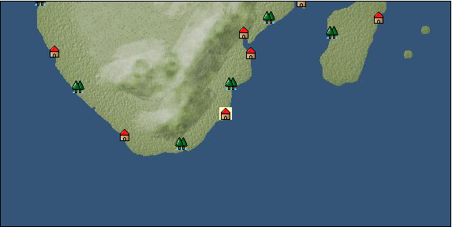

# Port: ナタール

import Tabs from '@theme/Tabs';
import TabItem from '@theme/TabItem';

## General Information

| Attribute | Details |
| :--- | :--- |
| **Port Name** | Natal |
| **Port Type** | port of alliance |
| **Region** | southern africa |
| **Sea Area** | Off Cape Agulhas |
| **Required Language** | Swahili |
| **Coordinates** | （1481，5915） |
| **Investment Reward** | [Precious metal smelting method](Items/Recipe Book/item_1119.md) （必要投資額：1,560,000ドゥカード） |

### Available Facilities

| guild | intermediary | exchange | tool shop | workshop craftsman | Painter | sculptor | peddler |
| --- | --- | --- | --- | --- | --- | --- | --- |
|   |   | ○ | ○ | ○ |   |   |   |
| Shipyard Master | Lumbermaker | Sail-maker | weapon craftsman | master | TavernFemale | archive | salesperson |
| --- | --- | --- | --- | --- | --- | --- | --- |
|   |   |   |   | ○ |   |   |   |
| Shipwright | 銀行 | street worker | 王宮 | Trading post | church | suburbs | translator |
| --- | --- | --- | --- | --- | --- | --- | --- |
| ○ | ○ |   |   |   |   |   |   |

### Description
A port city located on the southern coast of Africa, facing the Indian Ocean. Natal means Christmas in Portuguese. Cultural area: East Africa

<Tabs>
  <TabItem value="trade_goods_sales" label="Trade Goods Sales">

| item | group | purchase price | 同盟時 | remarks |
| --- | --- | --- | --- | --- |
| [sugar cane](Items/Trade Goods/TradeGoods-Foodstuffs/item_93.md) | [Trading items (food items)](Categories/category_3.md) | 206 | 192 |  |
| [corn](Items/Trade Goods/TradeGoods-Foodstuffs/item_138.md) | [Trading items (food items)](Categories/category_3.md) | 51 | 51 |  |
| [platinum](Items/Trade Goods/TradeGoods-Metals/item_2178.md) | [Trading products (precious metals)](Categories/category_8.md) | 4,560 | (3,990) |  |
| 要投資（必要投資額：720,000） |
| [goat](Items/Trade Goods/TradeGoods-Livestock/item_534.md) | [Trading Goods (Livestock)](Categories/category_18.md) | 176 | 164 |  |
| [coal](Items/Trade Goods/TradeGoods-Wares/item_359.md) | [交易品（工業品）](Categories/category_19.md) | 445 | 416 |  |
| [gold](Items/Trade Goods/TradeGoods-Metals/item_659.md) | [Trading products (precious metals)](Categories/category_8.md) | 4,490 | (3,929) |  |
| 要投資（必要投資額：240,000） |
  </TabItem>
  <TabItem value="sale_specialty" label="Sale (Specialty)">

| item | group | sale price | 同盟時 | remarks |
| --- | --- | --- | --- | --- |

#### [交易品（繊維）](Categories/category_1.md)

| [feather](Items/Trade Goods/TradeGoods-Fibers/item_585.md) | [交易品（繊維）](Categories/category_1.md) | 999 | (1,123) |  |

#### [Trading Goods (Dye)](Categories/category_2.md)

| [Indian Akane](Items/Trade Goods/TradeGoods-Dye/item_1037.md) | [Trading Goods (Dye)](Categories/category_2.md) | 835 | (939) |  |
| [Indian indigo](Items/Trade Goods/TradeGoods-Dye/item_157.md) | [Trading Goods (Dye)](Categories/category_2.md) | 835 | (939) |  |
| [ward](Items/Trade Goods/TradeGoods-Dye/item_57.md) | [Trading Goods (Dye)](Categories/category_2.md) | 1,990 | (2,238) |  |
| [Safflower](Items/Trade Goods/TradeGoods-Dye/item_1059.md) | [Trading Goods (Dye)](Categories/category_2.md) | 1,035 | (1,164) |  |

#### [交易品（調味料）](Categories/category_4.md)

| [apple cider vinegar](Items/Trade Goods/TradeGoods-Seasonings/item_882.md) | [交易品（調味料）](Categories/category_4.md) | 667 | (750) |  |

#### [Trading products (medical products)](Categories/category_6.md)

| [Nothing](Items/Trade Goods/TradeGoods-Medicine/item_1053.md) | [Trading products (medical products)](Categories/category_6.md) | 1,103 | (1,240) |  |

#### [交易品（酒類）](Categories/category_9.md)

| [aquavit](Items/Trade Goods/TradeGoods-Alcohol/item_572.md) | [交易品（酒類）](Categories/category_9.md) | 1,234 | (1,388) |  |
| [whiskey](Items/Trade Goods/TradeGoods-Alcohol/item_1.md) | [交易品（酒類）](Categories/category_9.md) | 1,370 | (1,541) |  |
| [sherry](Items/Trade Goods/TradeGoods-Alcohol/item_844.md) | [交易品（酒類）](Categories/category_9.md) | 681 | (766) |  |
| [gin](Items/Trade Goods/TradeGoods-Alcohol/item_291.md) | [交易品（酒類）](Categories/category_9.md) | 1,480 | (1,665) |  |
| [fruit brandy](Items/Trade Goods/TradeGoods-Alcohol/item_1440.md) | [交易品（酒類）](Categories/category_9.md) | 1,060 | (1,192) |  |
| [Sake](Items/Trade Goods/TradeGoods-Alcohol/item_3424.md) | [交易品（酒類）](Categories/category_9.md) | 30,000 | (33,753) |  |

#### [Trading goods (hobby goods)](Categories/category_10.md)

| [prune](Items/Trade Goods/TradeGoods-Sunddries/item_523.md) | [Trading goods (hobby goods)](Categories/category_10.md) | 628 | (706) |  |
| [dried figs](Items/Trade Goods/TradeGoods-Sunddries/item_611.md) | [Trading goods (hobby goods)](Categories/category_10.md) | 622 | (699) |  |
| [dried apple](Items/Trade Goods/TradeGoods-Sunddries/item_19.md) | [Trading goods (hobby goods)](Categories/category_10.md) | 484 | (544) |  |
| [black tea](Items/Trade Goods/TradeGoods-Sunddries/item_675.md) | [Trading goods (hobby goods)](Categories/category_10.md) | 855 | (961) |  |

#### [Trading Goods (Spices)](Categories/category_11.md)

| [oakmoss](Items/Trade Goods/TradeGoods-Perfume/item_819.md) | [Trading Goods (Spices)](Categories/category_11.md) | 1,040 | (1,170) |  |
| [jasmine](Items/Trade Goods/TradeGoods-Perfume/item_772.md) | [Trading Goods (Spices)](Categories/category_11.md) | 6,123 | (6,889) |  |
| [daffodil](Items/Trade Goods/TradeGoods-Perfume/item_612.md) | [Trading Goods (Spices)](Categories/category_11.md) | 1,970 | (2,216) |  |
| [lily of the valley](Items/Trade Goods/TradeGoods-Perfume/item_358.md) | [Trading Goods (Spices)](Categories/category_11.md) | 1,580 | (1,777) |  |
| [lira](Items/Trade Goods/TradeGoods-Perfume/item_30.md) | [Trading Goods (Spices)](Categories/category_11.md) | 1,500 | (1,687) |  |
| [sandalwood](Items/Trade Goods/TradeGoods-Perfume/item_771.md) | [Trading Goods (Spices)](Categories/category_11.md) | 2,530 | (2,846) |  |

#### [Trading Goods (Spices)](Categories/category_12.md)

| [pepper](Items/Trade Goods/TradeGoods-Spices/item_58.md) | [Trading Goods (Spices)](Categories/category_12.md) | 451 | (507) |  |
| [cinnamon](Items/Trade Goods/TradeGoods-Spices/item_1432.md) | [Trading Goods (Spices)](Categories/category_12.md) | 686 | (771) |  |

#### [Trading goods (artificial goods)](Categories/category_13.md)

| [glasswork](Items/Trade Goods/TradeGoods-Luxuries/item_60.md) | [Trading goods (artificial goods)](Categories/category_13.md) | 2,480 | (2,790) |  |
| [Darla Hest](Items/Trade Goods/TradeGoods-Luxuries/item_6190.md) | [Trading goods (artificial goods)](Categories/category_13.md) | (5,364) | 6,259 |  |

#### [Trading Items (Gemstones)](Categories/category_15.md)

| [aventurine](Items/Trade Goods/TradeGoods-Gems/item_678.md) | [Trading Items (Gemstones)](Categories/category_15.md) | 2,120 | (2,385) |  |
| [cat's eye](Items/Trade Goods/TradeGoods-Gems/item_1047.md) | [Trading Items (Gemstones)](Categories/category_15.md) | 3,300 | (3,712) |  |
| [sapphire](Items/Trade Goods/TradeGoods-Gems/item_676.md) | [Trading Items (Gemstones)](Categories/category_15.md) | 4,470 | (5,029) |  |
| [diamond](Items/Trade Goods/TradeGoods-Gems/item_449.md) | [Trading Items (Gemstones)](Categories/category_15.md) | 3,570 | (4,016) |  |
| [ruby](Items/Trade Goods/TradeGoods-Gems/item_773.md) | [Trading Items (Gemstones)](Categories/category_15.md) | 4,541 | (5,109) |  |

#### [Trading Items (Arms)](Categories/category_16.md)

| [crossbow](Items/Trade Goods/TradeGoods-Weapons/item_537.md) | [Trading Items (Arms)](Categories/category_16.md) | 1,360 | (1,530) |  |

#### [Trading Items (Firearms)](Categories/category_17.md)

| [musket gun](Items/Trade Goods/TradeGoods-Firearms/item_584.md) | [Trading Items (Firearms)](Categories/category_17.md) | 4,143 | (4,661) |  |

#### [交易品（工業品）](Categories/category_19.md)

| [rubber](Items/Trade Goods/TradeGoods-Wares/item_2819.md) | [交易品（工業品）](Categories/category_19.md) | 1,208 | (1,359) |  |
| [paint](Items/Trade Goods/TradeGoods-Wares/item_3411.md) | [交易品（工業品）](Categories/category_19.md) | 1,865 | (2,098) |  |

#### [交易品（織物）](Categories/category_20.md)

| [indian chintz](Items/Trade Goods/TradeGoods-Fabrics/item_159.md) | [交易品（織物）](Categories/category_20.md) | 1,184 | (1,332) |  |
| [dutch calico](Items/Trade Goods/TradeGoods-Fabrics/item_1435.md) | [交易品（織物）](Categories/category_20.md) | 2,040 | (2,295) |  |
| [turkish rug](Items/Trade Goods/TradeGoods-Fabrics/item_686.md) | [交易品（織物）](Categories/category_20.md) | 6,347 | (7,141) |  |
| [flannel](Items/Trade Goods/TradeGoods-Fabrics/item_149.md) | [交易品（織物）](Categories/category_20.md) | 1,920 | (2,160) |  |
| [大和錦](Items/Trade Goods/TradeGoods-Fabrics/item_3482.md) | [交易品（織物）](Categories/category_20.md) | 13,049 | (14,681) |  |
  </TabItem>
  <TabItem value="sale_no_specialty" label="Sale (No Specialty)">

| item | group | sale price | 同盟時 | remarks |
| --- | --- | --- | --- | --- |

#### [交易品（繊維）](Categories/category_1.md)

| [cotton](Items/Trade Goods/TradeGoods-Fibers/item_610.md) | [交易品（繊維）](Categories/category_1.md) | 329 | (370) |  |
| [wool](Items/Trade Goods/TradeGoods-Fibers/item_5.md) | [交易品（繊維）](Categories/category_1.md) | 468 | (526) |  |

#### [Trading Goods (Dye)](Categories/category_2.md)

| [貝紫](Items/Trade Goods/TradeGoods-Dye/item_110.md) | [Trading Goods (Dye)](Categories/category_2.md) | 6,360 | (7,155) |  |

#### [Trading items (food items)](Categories/category_3.md)

| [european crayfish](Items/Trade Goods/TradeGoods-Foodstuffs/item_6188.md) | [Trading items (food items)](Categories/category_3.md) | (6,119) | 7,140 |  |

#### [交易品（調味料）](Categories/category_4.md)

| [coconut vinegar](Items/Trade Goods/TradeGoods-Seasonings/item_1988.md) | [交易品（調味料）](Categories/category_4.md) | 499 | (561) |  |
| [tamarind](Items/Trade Goods/TradeGoods-Seasonings/item_1968.md) | [交易品（調味料）](Categories/category_4.md) | 883 | (993) |  |
| [coconut oil](Items/Trade Goods/TradeGoods-Seasonings/item_446.md) | [交易品（調味料）](Categories/category_4.md) | 293 | (329) |  |
| [sugar](Items/Trade Goods/TradeGoods-Seasonings/item_94.md) | [交易品（調味料）](Categories/category_4.md) | 861 | (968) |  |

#### [交易品（雑貨）](Categories/category_5.md)

| [Western books](Items/Trade Goods/TradeGoods-Misc/item_293.md) | [交易品（雑貨）](Categories/category_5.md) | 566 | (636) |  |

#### [Trading products (medical products)](Categories/category_6.md)

| [chamomile](Items/Trade Goods/TradeGoods-Medicine/item_292.md) | [Trading products (medical products)](Categories/category_6.md) | 458 | (515) |  |

#### [Trading Items (Iron Stone)](Categories/category_7.md)

| [Saltpeter](Items/Trade Goods/TradeGoods-Minerals/item_884.md) | [Trading Items (Iron Stone)](Categories/category_7.md) | 3,311 | (3,725) |  |

#### [Trading goods (hobby goods)](Categories/category_10.md)

| [coffee](Items/Trade Goods/TradeGoods-Sunddries/item_445.md) | [Trading goods (hobby goods)](Categories/category_10.md) | 452 | (508) |  |

#### [Trading Goods (Spices)](Categories/category_11.md)

| [ylang ylang](Items/Trade Goods/TradeGoods-Perfume/item_1434.md) | [Trading Goods (Spices)](Categories/category_11.md) | 797 | (896) |  |
| [orange oil](Items/Trade Goods/TradeGoods-Perfume/item_778.md) | [Trading Goods (Spices)](Categories/category_11.md) | 578 | (650) |  |
| [Musk](Items/Trade Goods/TradeGoods-Perfume/item_158.md) | [Trading Goods (Spices)](Categories/category_11.md) | 3,500 | (3,937) |  |

#### [Trading goods (artificial goods)](Categories/category_13.md)

| [goldsmith](Items/Trade Goods/TradeGoods-Luxuries/item_687.md) | [Trading goods (artificial goods)](Categories/category_13.md) | 4,810 | (5,411) |  |
| [silversmith](Items/Trade Goods/TradeGoods-Luxuries/item_619.md) | [Trading goods (artificial goods)](Categories/category_13.md) | 5,010 | (5,636) |  |

#### [交易品（美術品）](Categories/category_14.md)

| [古美術品](Items/Trade Goods/TradeGoods-Art/item_51.md) | [交易品（美術品）](Categories/category_14.md) | 3,609 | (4,060) |  |

#### [Trading Items (Gemstones)](Categories/category_15.md)

| [emerald](Items/Trade Goods/TradeGoods-Gems/item_777.md) | [Trading Items (Gemstones)](Categories/category_15.md) | 3,868 | (4,351) |  |
| [coral](Items/Trade Goods/TradeGoods-Gems/item_141.md) | [Trading Items (Gemstones)](Categories/category_15.md) | 3,350 | (3,769) |  |
| [turquoise](Items/Trade Goods/TradeGoods-Gems/item_1006.md) | [Trading Items (Gemstones)](Categories/category_15.md) | 1,350 | (1,518) |  |
| [lapis lazuli](Items/Trade Goods/TradeGoods-Gems/item_995.md) | [Trading Items (Gemstones)](Categories/category_15.md) | 2,623 | (2,951) |  |
| [ivory](Items/Trade Goods/TradeGoods-Gems/item_699.md) | [Trading Items (Gemstones)](Categories/category_15.md) | 1,900 | (2,137) |  |

#### [Trading Items (Firearms)](Categories/category_17.md)

| [arquebus gun](Items/Trade Goods/TradeGoods-Firearms/item_14.md) | [Trading Items (Firearms)](Categories/category_17.md) | 2,164 | (2,434) |  |
| [大砲](Items/Trade Goods/TradeGoods-Firearms/item_4.md) | [Trading Items (Firearms)](Categories/category_17.md) | 4,390 | (4,939) |  |
| [gunpowder](Items/Trade Goods/TradeGoods-Firearms/item_352.md) | [Trading Items (Firearms)](Categories/category_17.md) | 1,334 | (1,500) |  |

#### [交易品（工業品）](Categories/category_19.md)

| [oil](Items/Trade Goods/TradeGoods-Wares/item_613.md) | [交易品（工業品）](Categories/category_19.md) | 597 | (671) |  |

#### [交易品（織物）](Categories/category_20.md)

| [satin](Items/Trade Goods/TradeGoods-Fabrics/item_996.md) | [交易品（織物）](Categories/category_20.md) | 3,528 | (3,969) |  |
| [persian rug](Items/Trade Goods/TradeGoods-Fabrics/item_606.md) | [交易品（織物）](Categories/category_20.md) | 4,655 | (5,237) |  |
| [woolen fabric](Items/Trade Goods/TradeGoods-Fabrics/item_163.md) | [交易品（織物）](Categories/category_20.md) | 1,157 | (1,301) |  |
  </TabItem>
  <TabItem value="guild_&_others" label="Guild & Others">

| item | group | Sales price | Handling NPC | remarks |
| --- | --- | --- | --- | --- |
| There is no sales information for the item |
| --- |
  </TabItem>
  <TabItem value="toolman" label="Toolman">

| item | group | Sales price | Handling NPC | remarks |
| --- | --- | --- | --- | --- |

#### [Consumables (land battle/deck battle)](Categories/category_29.md)

| [numbness medicine](Items/Consumables/Consumables-Landbattle/item_452.md) | [Consumables (land battle/deck battle)](Categories/category_29.md) | 500 | tool shop owner |  |
| [boomerang](Items/Consumables/Consumables-Landbattle/item_454.md) | [Consumables (land battle/deck battle)](Categories/category_29.md) | 150 | tool shop owner |  |
| [poison](Items/Consumables/Consumables-Landbattle/item_269.md) | [Consumables (land battle/deck battle)](Categories/category_29.md) | 250 | tool shop owner |  |

#### [Consumables (skill activation)](Categories/category_31.md)

| [Adventurer's Notes](Items/Consumables/Consumables-Skill/item_451.md) | [Consumables (skill activation)](Categories/category_31.md) | 2,500 | tool shop owner |  |
| [簡易望遠鏡](Items/Consumables/Consumables-Skill/item_303.md) | [Consumables (skill activation)](Categories/category_31.md) | 500 | tool shop owner |  |
| [fishing gear](Items/Consumables/Consumables-Skill/item_79.md) | [Consumables (skill activation)](Categories/category_31.md) | 2,500 | tool shop owner |  |
  </TabItem>
  <TabItem value="kobo_craftsmen" label="Craftsman">

| item | group | Sales price | Handling NPC | remarks |
| --- | --- | --- | --- | --- |

#### [Consumables (other)](Categories/category_44.md)

| [帆塗料](Items/Consumables/Consumables-Other/item_348.md) | [Consumables (other)](Categories/category_44.md) | 500 | workshop craftsman |  |
| [ship paint](Items/Consumables/Consumables-Other/item_347.md) | [Consumables (other)](Categories/category_44.md) | 500 | workshop craftsman |  |
  </TabItem>
</Tabs>