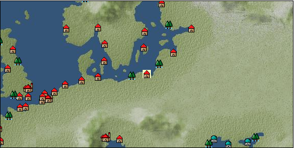

# Port: ダンツィヒ

import Tabs from '@theme/Tabs';
import TabItem from '@theme/TabItem';

## General Information

| Attribute | Details |
| :--- | :--- |
| **Port Name** | danzig |
| **Port Type** | port of alliance |
| **Region** | northern europe |
| **Sea Area** | baltic sea |
| **Required Language** | german |
| **Coordinates** | （863，2312） |
| **Investment Reward** | [jewelry cut yellow calligraphy](Items/Recipe Book/item_1212.md) （必要投資額：2,000,000ドゥカード） |

### Available Facilities

| guild | intermediary | exchange | tool shop | workshop craftsman | Painter | sculptor | peddler |
| --- | --- | --- | --- | --- | --- | --- | --- |
|   |   | ○ | ○ | ○ |   |   | ○ |
| Shipyard Master | Lumbermaker | Sail-maker | weapon craftsman | master | TavernFemale | archive | salesperson |
| --- | --- | --- | --- | --- | --- | --- | --- |
| ○ |   |   |   |   |   |   |   |
| Shipwright | 銀行 | street worker | 王宮 | Trading post | church | suburbs | translator |
| --- | --- | --- | --- | --- | --- | --- | --- |
| ○ | ○ | ○ |   |   | ○ |   |   |

### Description
A city built around the 10th century. In the 14th century, it also joined the Hanseatic League. Due to its active shipbuilding industry, it established itself as a shipbuilding city. Cultural area: Northern Europe

<Tabs>
  <TabItem value="trade_goods_sales" label="Trade Goods Sales">

| item | group | purchase price | 同盟時 | remarks |
| --- | --- | --- | --- | --- |
| [georgette](Items/Trade Goods/TradeGoods-Fabrics/item_1000.md) | [交易品（織物）](Categories/category_20.md) | (2,980) | 2,608 |  |
| 時代限定（15世紀第1期、15世紀第2期、15世紀第3期） |
| [Sugar beet](Items/Trade Goods/TradeGoods-Foodstuffs/item_1846.md) | [Trading items (food items)](Categories/category_3.md) | 183 | (161) |  |
| 要投資（必要投資額：500,000） |
| [rye](Items/Trade Goods/TradeGoods-Foodstuffs/item_61.md) | [Trading items (food items)](Categories/category_3.md) | 37 | (33) |  |
| 要投資（必要投資額：400,000） EO第４章で追加 |
| [wood](Items/Trade Goods/TradeGoods-Wares/item_277.md) | [交易品（工業品）](Categories/category_19.md) | 675 | 592 |  |
| [fur](Items/Trade Goods/TradeGoods-Fibers/item_634.md) | [交易品（繊維）](Categories/category_1.md) | 1,296 | (1,134) |  |
| [amber](Items/Trade Goods/TradeGoods-Gems/item_618.md) | [Trading Items (Gemstones)](Categories/category_15.md) | (2,313) | 2,024 |  |
| 要投資（必要投資額：320,000） |
| [coal](Items/Trade Goods/TradeGoods-Wares/item_359.md) | [交易品（工業品）](Categories/category_19.md) | 474 | (415) |  |
| 要投資（必要投資額：600,000） EO第４章で追加 |
| [iron ore](Items/Trade Goods/TradeGoods-Minerals/item_146.md) | [Trading Items (Iron Stone)](Categories/category_7.md) | 638 | (559) |  |
| 要投資（必要投資額：180,000） |
  </TabItem>
  <TabItem value="sale_specialty" label="Sale (Specialty)">

| item | group | sale price | 同盟時 | remarks |
| --- | --- | --- | --- | --- |

#### [交易品（雑貨）](Categories/category_5.md)

| [old ink stick](Items/Trade Goods/TradeGoods-Misc/item_3921.md) | 交易品（雑貨） | (37,451) | 43,700 |  |

#### [Trading goods (hobby goods)](Categories/category_10.md)

| [black tea](Items/Trade Goods/TradeGoods-Sunddries/item_675.md) | Trading goods (hobby goods) | 2,780 | (3,127) |  |

#### [Trading Goods (Spices)](Categories/category_11.md)

| [jasmine](Items/Trade Goods/TradeGoods-Perfume/item_772.md) | Trading Goods (Spices) | 6,809 | (7,660) |  |
| [geranium](Items/Trade Goods/TradeGoods-Perfume/item_145.md) | Trading Goods (Spices) | 1,300 | (1,462) |  |
| [sandalwood](Items/Trade Goods/TradeGoods-Perfume/item_771.md) | Trading Goods (Spices) | 4,683 | (5,268) |  |

#### [Trading goods (artificial goods)](Categories/category_13.md)

| [Tumbaga](Items/Trade Goods/TradeGoods-Luxuries/item_3028.md) | Trading goods (artificial goods) | (21,004) | 24,508 |  |

#### [交易品（美術品）](Categories/category_14.md)

| [oil painting](Items/Trade Goods/TradeGoods-Art/item_1088.md) | 交易品（美術品） | (2,237) | 2,610 |  |

#### [Trading Items (Gemstones)](Categories/category_15.md)

| [aventurine](Items/Trade Goods/TradeGoods-Gems/item_678.md) | Trading Items (Gemstones) | 6,110 | 6,510 |  |
| [opal](Items/Trade Goods/TradeGoods-Gems/item_2006.md) | Trading Items (Gemstones) | 7,655 | (8,612) |  |
| [cat's eye](Items/Trade Goods/TradeGoods-Gems/item_1047.md) | Trading Items (Gemstones) | 10,500 | 11,200 |  |
| [sapphire](Items/Trade Goods/TradeGoods-Gems/item_676.md) | Trading Items (Gemstones) | 12,800 | 13,500 |  |
| [diamond](Items/Trade Goods/TradeGoods-Gems/item_449.md) | Trading Items (Gemstones) | 8,977 | (10,100) |  |
| [pink diamond](Items/Trade Goods/TradeGoods-Gems/item_2874.md) | Trading Items (Gemstones) | 14,673 | (16,508) |  |

#### [Trading Items (Arms)](Categories/category_16.md)

| [damascus sword](Items/Trade Goods/TradeGoods-Weapons/item_903.md) | Trading Items (Arms) | (6,721) | 7,842 |  |

#### [交易品（工業品）](Categories/category_19.md)

| [Japanese paper](Items/Trade Goods/TradeGoods-Wares/item_3438.md) | 交易品（工業品） | (24,768) | 28,900 |  |
| [羊皮紙](Items/Trade Goods/TradeGoods-Wares/item_53.md) | 交易品（工業品） | 1,620 | (1,822) |  |

#### [交易品（織物）](Categories/category_20.md)

| [Awaiyo](Items/Trade Goods/TradeGoods-Fabrics/item_3002.md) | 交易品（織物） | (10,360) | 12,088 |  |
| [damask](Items/Trade Goods/TradeGoods-Fabrics/item_614.md) | 交易品（織物） | 6,435 | (7,240) |  |
  </TabItem>
  <TabItem value="sale_no_specialty" label="Sale (No Specialty)">

| item | group | sale price | 同盟時 | remarks |
| --- | --- | --- | --- | --- |

#### [交易品（繊維）](Categories/category_1.md)

| [flax](Items/Trade Goods/TradeGoods-Fibers/item_64.md) | 交易品（繊維） | 243 | 254 |  |
| ▲Special products from the same cultural area |
| [raw silk](Items/Trade Goods/TradeGoods-Fibers/item_677.md) | 交易品（繊維） | 2,256 | (2,538) |  |
| [feather](Items/Trade Goods/TradeGoods-Fibers/item_585.md) | 交易品（繊維） | 658 | (740) |  |

#### [Trading products (medical products)](Categories/category_6.md)

| [Maca](Items/Trade Goods/TradeGoods-Medicine/item_3000.md) | Trading products (medical products) | (1,911) | 2,229 |  |

#### [Trading products (precious metals)](Categories/category_8.md)

| [gold](Items/Trade Goods/TradeGoods-Metals/item_659.md) | Trading products (precious metals) | (7,762) | 9,057 |  |
| [silver](Items/Trade Goods/TradeGoods-Metals/item_136.md) | Trading products (precious metals) | 2,807 | (3,158) |  |

#### [交易品（酒類）](Categories/category_9.md)

| [aquavit](Items/Trade Goods/TradeGoods-Alcohol/item_572.md) | 交易品（酒類） | 585 | (658) |  |
| ▲Special products from the same cultural area |
| [whiskey](Items/Trade Goods/TradeGoods-Alcohol/item_1.md) | 交易品（酒類） | 700 | (787) |  |
| ▲Special products from neighboring cultural areas |
| [Beer](Items/Trade Goods/TradeGoods-Alcohol/item_2.md) | 交易品（酒類） | (281) | 327 |  |

#### [Trading goods (artificial goods)](Categories/category_13.md)

| [lapidary work](Items/Trade Goods/TradeGoods-Luxuries/item_153.md) | Trading goods (artificial goods) | 3,900 | (4,387) |  |
| [goldsmith](Items/Trade Goods/TradeGoods-Luxuries/item_687.md) | Trading goods (artificial goods) | 5,817 | (6,544) |  |

#### [Trading Items (Gemstones)](Categories/category_15.md)

| [pearl](Items/Trade Goods/TradeGoods-Gems/item_769.md) | Trading Items (Gemstones) | 11,569 | 12,599 |  |
| [ivory](Items/Trade Goods/TradeGoods-Gems/item_699.md) | Trading Items (Gemstones) | 4,120 | 4,330 |  |

#### [Trading Items (Arms)](Categories/category_16.md)

| [western armor](Items/Trade Goods/TradeGoods-Weapons/item_6.md) | Trading Items (Arms) | 2,852 | (3,208) |  |
| ▲Special products from neighboring cultural areas |

#### [交易品（工業品）](Categories/category_19.md)

| [sulfur](Items/Trade Goods/TradeGoods-Wares/item_66.md) | 交易品（工業品） | 413 | (464) |  |
| [鋼](Items/Trade Goods/TradeGoods-Wares/item_573.md) | 交易品（工業品） | 1,260 | (1,417) |  |

#### [交易品（織物）](Categories/category_20.md)

| [satin](Items/Trade Goods/TradeGoods-Fabrics/item_996.md) | 交易品（織物） | 4,370 | (4,916) |  |
  </TabItem>
  <TabItem value="guild_&_others" label="Guild & Others">

| item | group | Sales price | Handling NPC | remarks |
| --- | --- | --- | --- | --- |

#### others

| [How to make Eastern European light cavalry equipment](Items/Recipe Book/item_4517.md) | [recipe book](Categories/category_22.md) | Fixed recipe |  |  |
| 17th century second period young man |
  </TabItem>
  <TabItem value="toolman" label="Toolman">

| item | group | Sales price | Handling NPC | remarks |
| --- | --- | --- | --- | --- |

#### [recipe book](Categories/category_22.md)

| [Spear training/application](Items/Recipe Book/item_1141.md) | recipe book | 50,000 | tool shop owner |  |
| 要投資（必要投資額：500,000） |

#### [Equipment (belongings)](Categories/category_27.md)

| [snap lock shooting gun](Items/Equipment/Equipment-Weapon/item_267.md) | Equipment (belongings) | 8,000 | tool shop owner |  |

#### [Consumables (land battle/deck battle)](Categories/category_29.md)

| [poison](Items/Consumables/Consumables-Landbattle/item_269.md) | Consumables (land battle/deck battle) | 250 | tool shop owner |  |
| [antidote](Items/Consumables/Consumables-Landbattle/item_270.md) | Consumables (land battle/deck battle) | 100 | tool shop owner |  |

#### [Consumables (skill activation)](Categories/category_31.md)

| [fishing gear](Items/Consumables/Consumables-Skill/item_79.md) | Consumables (skill activation) | 2,500 | tool shop owner |  |
  </TabItem>
  <TabItem value="kobo_craftsmen" label="Craftsman">

| item | group | Sales price | Handling NPC | remarks |
| --- | --- | --- | --- | --- |

#### [Consumables (condition recovery)](Categories/category_21.md)

| [Nostalgic carillon bell](Items/Consumables/Consumables-Recovery/item_245.md) | Consumables (condition recovery) | 200 | workshop craftsman |  |
| [Ship song sheet music](Items/Consumables/Consumables-Recovery/item_247.md) | Consumables (condition recovery) | 200 | workshop craftsman |  |

#### [recipe book](Categories/category_22.md)

| [Marine life sculpture](Items/Recipe Book/item_273.md) | recipe book | 10,000 | workshop craftsman |  |

#### [Consumables (skill activation)](Categories/category_31.md)

| [四分儀](Items/Consumables/Consumables-Skill/item_346.md) | Consumables (skill activation) | 500 | workshop craftsman |  |
  </TabItem>
  <TabItem value="shipyard" label="Shipyard">

### Shipyard Master

| item | group | Sales price | Handling NPC | remarks |
| --- | --- | --- | --- | --- |

#### [Boat](Categories/category_43.md)

| [2 mast cogs](Items/Ships/item_265.md) | Boat | 96,000 | Shipyard Master |  |
| [warwick cog](Items/Ships/item_336.md) | Boat | 230,000 | Shipyard Master |  |
| [carrack](Items/Ships/item_236.md) | Boat | 720,000 | Shipyard Master |  |
| [Hansa Cog](Items/Ships/item_263.md) | Boat | 24,000 | Shipyard Master |  |
| [Varsha](Items/Ships/item_201.md) | Boat | 2,000 | Shipyard Master |  |
| [hooker](Items/Ships/item_335.md) | Boat | 220,000 | Shipyard Master |  |
| [commercial carrack](Items/Ships/item_239.md) | Boat | 728,000 | Shipyard Master |  |
| [commercial large carrack](Items/Ships/item_409.md) | Boat | 1,840,000 | Shipyard Master |  |
| [large carrack](Items/Ships/item_408.md) | Boat | 1,800,000 | Shipyard Master |  |
| [small carrack](Items/Ships/item_219.md) | Boat | 480,000 | Shipyard Master |  |
| [small caravel](Items/Ships/item_206.md) | Boat | 92,000 | Shipyard Master |  |
| [combat carrack](Items/Ships/item_238.md) | Boat | 720,000 | Shipyard Master |  |
| [armed cog](Items/Ships/item_264.md) | Boat | 25,000 | Shipyard Master |  |
| [light caravelle](Items/Ships/item_207.md) | Boat | 92,000 | Shipyard Master |  |
| [transport carrack](Items/Ships/item_222.md) | Boat | 488,000 | Shipyard Master |  |
  </TabItem>
</Tabs>