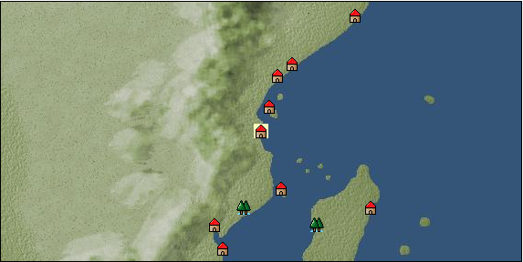

# Port: Kilwa

import Tabs from '@theme/Tabs';
import TabItem from '@theme/TabItem';

## General Information

| Attribute | Details |
| :--- | :--- |
| **Port Name** | Kilwa |
| **Port Type** | port of alliance |
| **Region** | Eastern Africa/India |
| **Sea Area** | Off the coast of Zanzibar |
| **Required Language** | Swahili |
| **Coordinates** | （1775，5087） |
| **Investment Reward** | [Fragrance secret](docs/Items/RecipeBooks/item_1209.md) （必要投資額：500,000ドゥカード） |

### Available Facilities

| guild | intermediary | exchange | tool shop | workshop craftsman | Painter | sculptor | peddler |
| --- | --- | --- | --- | --- | --- | --- | --- |
|   |   | ○ | ○ |   |   |   |   |
| Shipyard Master | Lumbermaker | Sail-maker | weapon craftsman | master | TavernFemale | archive | salesperson |
| --- | --- | --- | --- | --- | --- | --- | --- |
|   |   |   |   | ○ |   |   |   |
| Shipwright | 銀行 | street worker | 王宮 | Trading post | church | suburbs | translator |
| --- | --- | --- | --- | --- | --- | --- | --- |
| ○ | ○ |   |   |   |   |   |   |

### Description
A port town located on the Swahili coast of East Africa. It gradually developed as a temporary settlement for Arab and Persian merchants who arrived with the seasonal winds. Cultural area: East Africa

<Tabs>
  <TabItem value="trade_goods_sales" label="Trade Goods Sales">

| Item | Group | Purchase Price | Allied Price | Remarks |
| --- | --- | --- | --- | --- |
| [coconut](docs/Items/TradeGoods/TradeGoods-Sunddries/item_96.md) | [Trading goods (hobby goods)](docs/Categories/category_10.md) | 292 | (256) |  |
| [tamarind](docs/Items/TradeGoods/TradeGoods-Seasonings/item_1968.md) | [交易品（調味料）](docs/Categories/category_4.md) | 762 | (667) |  |
| 要投資（必要投資額：500,000） |
| [ivory](docs/Items/TradeGoods/TradeGoods-Gems/item_699.md) | [Trading Items (Gemstones)](docs/Categories/category_15.md) | 1,920 | 1,681 |  |
| [gold](docs/Items/TradeGoods/TradeGoods-Metals/item_659.md) | [Trading products (precious metals)](docs/Categories/category_8.md) | 4,490 | (3,929) |  |
| Required investment (required investment amount: 240,000) Confirmed at 320k, but not at 180k. |
| [iron ore](docs/Items/TradeGoods/TradeGoods-Minerals/item_146.md) | [Trading Items (Iron Stone)](docs/Categories/category_7.md) | 613 | (537) |  |
| 要投資（必要投資額：180,000） |
  </TabItem>
  <TabItem value="sale_specialty" label="Sale (Specialty)">

| Item | Group | sale price | Allied Price | Remarks |
| --- | --- | --- | --- | --- |

#### [交易品（繊維）](docs/Categories/category_1.md)

| [tiger skin](docs/Items/TradeGoods/TradeGoods-Fibers/item_3790.md) | 交易品（繊維） | 14,300 | (16,089) |  |

#### [Trading Goods (Dye)](docs/Categories/category_2.md)

| [Indian Akane](docs/Items/TradeGoods/TradeGoods-Dye/item_1037.md) | Trading Goods (Dye) | 823 | (925) |  |
| [ward](docs/Items/TradeGoods/TradeGoods-Dye/item_57.md) | Trading Goods (Dye) | 1,990 | (2,238) |  |
| [Safflower](docs/Items/TradeGoods/TradeGoods-Dye/item_1059.md) | Trading Goods (Dye) | 1,035 | (1,164) |  |

#### [交易品（調味料）](docs/Categories/category_4.md)

| [apple cider vinegar](docs/Items/TradeGoods/TradeGoods-Seasonings/item_882.md) | 交易品（調味料） | 667 | (750) |  |

#### [Trading products (medical products)](docs/Categories/category_6.md)

| [Nothing](docs/Items/TradeGoods/TradeGoods-Medicine/item_1053.md) | Trading products (medical products) | 1,103 | (1,240) |  |

#### [交易品（酒類）](docs/Categories/category_9.md)

| [aquavit](docs/Items/TradeGoods/TradeGoods-Alcohol/item_572.md) | 交易品（酒類） | 1,217 | (1,369) |  |
| [whiskey](docs/Items/TradeGoods/TradeGoods-Alcohol/item_1.md) | 交易品（酒類） | 1,370 | (1,541) |  |
| [gin](docs/Items/TradeGoods/TradeGoods-Alcohol/item_291.md) | 交易品（酒類） | 1,480 | (1,665) |  |
| [fruit brandy](docs/Items/TradeGoods/TradeGoods-Alcohol/item_1440.md) | 交易品（酒類） | 1,060 | (1,192) |  |

#### [Trading goods (hobby goods)](docs/Categories/category_10.md)

| [banana](docs/Items/TradeGoods/TradeGoods-Sunddries/item_1947.md) | Trading goods (hobby goods) | 343 | (385) |  |
| [prune](docs/Items/TradeGoods/TradeGoods-Sunddries/item_523.md) | Trading goods (hobby goods) | 628 | (706) |  |
| [dried figs](docs/Items/TradeGoods/TradeGoods-Sunddries/item_611.md) | Trading goods (hobby goods) | 622 | (699) |  |
| [dried apple](docs/Items/TradeGoods/TradeGoods-Sunddries/item_19.md) | Trading goods (hobby goods) | 484 | (544) |  |

#### [Trading Goods (Spices)](docs/Categories/category_11.md)

| [oakmoss](docs/Items/TradeGoods/TradeGoods-Perfume/item_819.md) | Trading Goods (Spices) | 1,040 | (1,170) |  |
| [jasmine](docs/Items/TradeGoods/TradeGoods-Perfume/item_772.md) | Trading Goods (Spices) | 6,169 | (6,940) |  |
| [daffodil](docs/Items/TradeGoods/TradeGoods-Perfume/item_612.md) | Trading Goods (Spices) | 1,970 | (2,216) |  |
| [lily of the valley](docs/Items/TradeGoods/TradeGoods-Perfume/item_358.md) | Trading Goods (Spices) | 1,580 | (1,777) |  |
| [geranium](docs/Items/TradeGoods/TradeGoods-Perfume/item_145.md) | Trading Goods (Spices) | 929 | (1,045) |  |
| [patchouli](docs/Items/TradeGoods/TradeGoods-Perfume/item_1963.md) | Trading Goods (Spices) | 1,870 | (2,103) |  |
| [lira](docs/Items/TradeGoods/TradeGoods-Perfume/item_30.md) | Trading Goods (Spices) | 1,500 | (1,687) |  |
| [sandalwood](docs/Items/TradeGoods/TradeGoods-Perfume/item_771.md) | Trading Goods (Spices) | 2,530 | (2,846) |  |

#### [Trading Goods (Spices)](docs/Categories/category_12.md)

| [Sanshou](docs/Items/TradeGoods/TradeGoods-Spices/item_3794.md) | Trading Goods (Spices) | 13,300 | (14,963) |  |

#### [Trading goods (artificial goods)](docs/Categories/category_13.md)

| [glasswork](docs/Items/TradeGoods/TradeGoods-Luxuries/item_60.md) | Trading goods (artificial goods) | 2,480 | (2,790) |  |

#### [Trading Items (Gemstones)](docs/Categories/category_15.md)

| [aventurine](docs/Items/TradeGoods/TradeGoods-Gems/item_678.md) | Trading Items (Gemstones) | 2,120 | (2,385) |  |
| [cat's eye](docs/Items/TradeGoods/TradeGoods-Gems/item_1047.md) | Trading Items (Gemstones) | 3,300 | (3,712) |  |
| [sapphire](docs/Items/TradeGoods/TradeGoods-Gems/item_676.md) | Trading Items (Gemstones) | 4,470 | (5,029) |  |
| [diamond](docs/Items/TradeGoods/TradeGoods-Gems/item_449.md) | Trading Items (Gemstones) | 3,570 | (4,016) |  |
| [ruby](docs/Items/TradeGoods/TradeGoods-Gems/item_773.md) | Trading Items (Gemstones) | 4,541 | (5,109) |  |

#### [Trading Items (Arms)](docs/Categories/category_16.md)

| [crossbow](docs/Items/TradeGoods/TradeGoods-Weapons/item_537.md) | Trading Items (Arms) | 1,360 | (1,530) |  |

#### [Trading Items (Firearms)](docs/Categories/category_17.md)

| [musket gun](docs/Items/TradeGoods/TradeGoods-Firearms/item_584.md) | Trading Items (Firearms) | 4,143 | (4,661) |  |
| [tanegashima gun](docs/Items/TradeGoods/TradeGoods-Firearms/item_3423.md) | Trading Items (Firearms) | 14,700 | (16,539) |  |

#### [Trading Goods (Livestock)](docs/Categories/category_18.md)

| [donkey](docs/Items/TradeGoods/TradeGoods-Livestock/item_3924.md) | Trading Goods (Livestock) | 8,560 | (9,630) |  |

#### [交易品（工業品）](docs/Categories/category_19.md)

| [marble](docs/Items/TradeGoods/TradeGoods-Wares/item_52.md) | 交易品（工業品） | (1,683) | 1,963 |  |
| [羊皮紙](docs/Items/TradeGoods/TradeGoods-Wares/item_53.md) | 交易品（工業品） | (1,675) | 1,954 |  |

#### [交易品（織物）](docs/Categories/category_20.md)

| [dutch calico](docs/Items/TradeGoods/TradeGoods-Fabrics/item_1435.md) | 交易品（織物） | 2,040 | (2,295) |  |
| [turkish rug](docs/Items/TradeGoods/TradeGoods-Fabrics/item_686.md) | 交易品（織物） | (5,527) | 6,449 |  |
  </TabItem>
  <TabItem value="sale_no_specialty" label="Sale (No Specialty)">

| Item | Group | sale price | Allied Price | Remarks |
| --- | --- | --- | --- | --- |

#### [交易品（繊維）](docs/Categories/category_1.md)

| [cotton](docs/Items/TradeGoods/TradeGoods-Fibers/item_610.md) | 交易品（繊維） | 325 | (365) |  |

#### [Trading Goods (Dye)](docs/Categories/category_2.md)

| [Indian indigo](docs/Items/TradeGoods/TradeGoods-Dye/item_157.md) | Trading Goods (Dye) | 820 | (922) |  |

#### [Trading items (food items)](docs/Categories/category_3.md)

| [Paddy rice](docs/Items/TradeGoods/TradeGoods-Foodstuffs/item_654.md) | Trading items (food items) | 60 | (67) |  |
| [beef](docs/Items/TradeGoods/TradeGoods-Foodstuffs/item_26.md) | Trading items (food items) | 703 | (790) |  |
| [陸稲](docs/Items/TradeGoods/TradeGoods-Foodstuffs/item_100.md) | Trading items (food items) | 79 | (88) |  |

#### [交易品（調味料）](docs/Categories/category_4.md)

| [coconut vinegar](docs/Items/TradeGoods/TradeGoods-Seasonings/item_1988.md) | 交易品（調味料） | 499 | (561) |  |

#### [Trading products (medical products)](docs/Categories/category_6.md)

| [chamomile](docs/Items/TradeGoods/TradeGoods-Medicine/item_292.md) | Trading products (medical products) | 458 | (515) |  |

#### [Trading products (precious metals)](docs/Categories/category_8.md)

| [gold](docs/Items/TradeGoods/TradeGoods-Metals/item_659.md) | Trading products (precious metals) | 1,970 | (2,216) |  |
| Required investment (required investment amount: 240,000) Confirmed at 320k, but not at 180k. |
| [silver](docs/Items/TradeGoods/TradeGoods-Metals/item_136.md) | Trading products (precious metals) | 2,912 | (3,276) |  |

#### [交易品（酒類）](docs/Categories/category_9.md)

| [palm wine](docs/Items/TradeGoods/TradeGoods-Alcohol/item_436.md) | 交易品（酒類） | 333 | (374) |  |

#### [Trading goods (hobby goods)](docs/Categories/category_10.md)

| [coffee](docs/Items/TradeGoods/TradeGoods-Sunddries/item_445.md) | Trading goods (hobby goods) | 467 | (525) |  |
| [black tea](docs/Items/TradeGoods/TradeGoods-Sunddries/item_675.md) | Trading goods (hobby goods) | 848 | (954) |  |

#### [Trading Goods (Spices)](docs/Categories/category_11.md)

| [ylang ylang](docs/Items/TradeGoods/TradeGoods-Perfume/item_1434.md) | Trading Goods (Spices) | 793 | (892) |  |
| [orange oil](docs/Items/TradeGoods/TradeGoods-Perfume/item_778.md) | Trading Goods (Spices) | 579 | (651) |  |
| [Musk](docs/Items/TradeGoods/TradeGoods-Perfume/item_158.md) | Trading Goods (Spices) | 3,550 | (3,994) |  |

#### [Trading Goods (Spices)](docs/Categories/category_12.md)

| [pepper](docs/Items/TradeGoods/TradeGoods-Spices/item_58.md) | Trading Goods (Spices) | 451 | (507) |  |
| [cinnamon](docs/Items/TradeGoods/TradeGoods-Spices/item_1432.md) | Trading Goods (Spices) | 686 | (771) |  |
| [ginger](docs/Items/TradeGoods/TradeGoods-Spices/item_112.md) | Trading Goods (Spices) | 32 | (36) |  |

#### [Trading goods (artificial goods)](docs/Categories/category_13.md)

| [goldsmith](docs/Items/TradeGoods/TradeGoods-Luxuries/item_687.md) | Trading goods (artificial goods) | 4,810 | (5,411) |  |
| [silversmith](docs/Items/TradeGoods/TradeGoods-Luxuries/item_619.md) | Trading goods (artificial goods) | 5,010 | (5,636) |  |

#### [交易品（美術品）](docs/Categories/category_14.md)

| [古美術品](docs/Items/TradeGoods/TradeGoods-Art/item_51.md) | 交易品（美術品） | 3,608 | (4,059) |  |

#### [Trading Items (Gemstones)](docs/Categories/category_15.md)

| [emerald](docs/Items/TradeGoods/TradeGoods-Gems/item_777.md) | Trading Items (Gemstones) | 3,868 | (4,351) |  |
| [turquoise](docs/Items/TradeGoods/TradeGoods-Gems/item_1006.md) | Trading Items (Gemstones) | 1,350 | (1,518) |  |
| [lapis lazuli](docs/Items/TradeGoods/TradeGoods-Gems/item_995.md) | Trading Items (Gemstones) | 2,623 | (2,951) |  |
| [malachite](docs/Items/TradeGoods/TradeGoods-Gems/item_679.md) | Trading Items (Gemstones) | 2,000 | (2,250) |  |

#### [Trading Items (Firearms)](docs/Categories/category_17.md)

| [arquebus gun](docs/Items/TradeGoods/TradeGoods-Firearms/item_14.md) | Trading Items (Firearms) | 2,146 | (2,414) |  |
| [大砲](docs/Items/TradeGoods/TradeGoods-Firearms/item_4.md) | Trading Items (Firearms) | 4,390 | (4,939) |  |
| [bullet](docs/Items/TradeGoods/TradeGoods-Firearms/item_13.md) | Trading Items (Firearms) | 1,230 | (1,383) |  |

#### [交易品（工業品）](docs/Categories/category_19.md)

| [coal](docs/Items/TradeGoods/TradeGoods-Wares/item_359.md) | 交易品（工業品） | 536 | (603) |  |

#### [交易品（織物）](docs/Categories/category_20.md)

| [indian chintz](docs/Items/TradeGoods/TradeGoods-Fabrics/item_159.md) | 交易品（織物） | 1,189 | (1,337) |  |
| [persian rug](docs/Items/TradeGoods/TradeGoods-Fabrics/item_606.md) | 交易品（織物） | 4,655 | (5,237) |  |
  </TabItem>
  <TabItem value="guild_&_others" label="Guild & Others">

| Item | Group | Sales price | Handling NPC | Remarks |
| --- | --- | --- | --- | --- |
| There is no sales information for the Item |
| --- |
  </TabItem>
  <TabItem value="toolman" label="Toolman">

| Item | Group | Sales price | Handling NPC | Remarks |
| --- | --- | --- | --- | --- |

#### [Consumables (land battle/deck battle)](docs/Categories/category_29.md)

| [boomerang](docs/Items/Consumables/Consumables-Landbattle/item_454.md) | Consumables (land battle/deck battle) | 150 | tool shop owner |  |
| [dart](docs/Items/Consumables/Consumables-Landbattle/item_312.md) | Consumables (land battle/deck battle) | 50 | tool shop owner |  |
| [torch for throwing](docs/Items/Consumables/Consumables-Landbattle/item_313.md) | Consumables (land battle/deck battle) | 150 | tool shop owner |  |
| [therapeutic drug](docs/Items/Consumables/Consumables-Landbattle/item_89.md) | Consumables (land battle/deck battle) | 300 | tool shop owner |  |
| [Assortment of therapeutic drugs](docs/Items/Consumables/Consumables-Landbattle/item_564.md) | Consumables (land battle/deck battle) | 900 | tool shop owner |  |

#### [Consumables (skill activation)](docs/Categories/category_31.md)

| [捕獲網](docs/Items/Consumables/Consumables-Skill/item_315.md) | Consumables (skill activation) | 300 | tool shop owner |  |

#### [Consumables (request documents)](docs/Categories/category_45.md)

| [Dye purchase order](docs/Items/Consumables/Consumables-Documents/item_4913.md) | Consumables (request documents) | 20,000 | tool shop owner |  |
  </TabItem>
</Tabs>