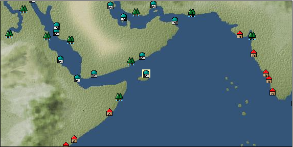

# Port: ソコトラ

import Tabs from '@theme/Tabs';
import TabItem from '@theme/TabItem';

## General Information

| Attribute | Details |
| :--- | :--- |
| **Port Name** | socotra |
| **Port Type** | port of alliance |
| **Region** | Eastern Africa/India |
| **Sea Area** | arabian sea |
| **Required Language** | arabic |
| **Coordinates** | （2474，4272） |
| **Investment Reward** | [soup with spices](docs/Items/RecipeBooks/item_1080.md) （必要投資額：400,000ドゥカード） |

### Available Facilities

| guild | intermediary | exchange | tool shop | workshop craftsman | Painter | sculptor | peddler |
| --- | --- | --- | --- | --- | --- | --- | --- |
|   |   | ○ | ○ | ○ |   |   |   |
| Shipyard Master | Lumbermaker | Sail-maker | weapon craftsman | master | TavernFemale | archive | salesperson |
| --- | --- | --- | --- | --- | --- | --- | --- |
|   |   |   |   | ○ |   |   |   |
| Shipwright | 銀行 | street worker | 王宮 | Trading post | church | suburbs | translator |
| --- | --- | --- | --- | --- | --- | --- | --- |
| ○ | ○ | ○ |   |   | ○ |   |   |

### Description
A city located on an island in the Indian Ocean off the coast of the Arabian Peninsula. It is often a port of call for sailors sailing through the Indian Ocean. Cultural area: Arab

<Tabs>
  <TabItem value="trade_goods_sales" label="Trade Goods Sales">

| item | group | purchase price | 同盟時 | remarks |
| --- | --- | --- | --- | --- |
| [pomegranate](docs/Items/TradeGoods/TradeGoods-Dye/item_907.md) | [Trading Goods (Dye)](docs/Categories/category_2.md) | (444) | 389 |  |
| Investment required (Required investment amount: 500,000) A fruit with yellowish-red skin. The peel becomes a brown dye. |
| [mastic](docs/Items/TradeGoods/TradeGoods-Perfume/item_680.md) | [Trading Goods (Spices)](docs/Categories/category_11.md) | 1,419 | (1,242) |  |
| 要投資（必要投資額：120,000） |
| [Ryushu incense](docs/Items/TradeGoods/TradeGoods-Perfume/item_101.md) | [Trading Goods (Spices)](docs/Categories/category_11.md) | 2,673 | (2,339) |  |
| [dragon blood](docs/Items/TradeGoods/TradeGoods-Medicine/item_4209.md) | [Trading products (medical products)](docs/Categories/category_6.md) | (2,678) | 2,343 |  |
| 要投資（必要投資額：720,000） |
| [cotton](docs/Items/TradeGoods/TradeGoods-Fibers/item_610.md) | [交易品（繊維）](docs/Categories/category_1.md) | 305 | 268 |  |
| [魚肉](docs/Items/TradeGoods/TradeGoods-Foodstuffs/item_10.md) | [Trading items (food items)](docs/Categories/category_3.md) | 146 | 128 |  |
  </TabItem>
  <TabItem value="sale_specialty" label="Sale (Specialty)">

| item | group | sale price | 同盟時 | remarks |
| --- | --- | --- | --- | --- |

#### [Trading Goods (Dye)](docs/Categories/category_2.md)

| [Indian Akane](docs/Items/TradeGoods/TradeGoods-Dye/item_1037.md) | Trading Goods (Dye) | 699 | (786) |  |
| [Indian indigo](docs/Items/TradeGoods/TradeGoods-Dye/item_157.md) | Trading Goods (Dye) | 707 | 742 |  |
| [ward](docs/Items/TradeGoods/TradeGoods-Dye/item_57.md) | Trading Goods (Dye) | 1,947 | (2,190) |  |
| [turmeric](docs/Items/TradeGoods/TradeGoods-Dye/item_1433.md) | Trading Goods (Dye) | 427 | (480) |  |
| [Safflower](docs/Items/TradeGoods/TradeGoods-Dye/item_1059.md) | Trading Goods (Dye) | 900 | (1,012) |  |

#### [交易品（調味料）](docs/Categories/category_4.md)

| [apple cider vinegar](docs/Items/TradeGoods/TradeGoods-Seasonings/item_882.md) | 交易品（調味料） | 770 | (866) |  |

#### [Trading products (medical products)](docs/Categories/category_6.md)

| [Nothing](docs/Items/TradeGoods/TradeGoods-Medicine/item_1053.md) | Trading products (medical products) | 1,070 | (1,203) |  |

#### [Trading goods (hobby goods)](docs/Categories/category_10.md)

| [caviar](docs/Items/TradeGoods/TradeGoods-Sunddries/item_2122.md) | Trading goods (hobby goods) | (1,058) | 1,234 |  |
| [prune](docs/Items/TradeGoods/TradeGoods-Sunddries/item_523.md) | Trading goods (hobby goods) | 712 | (801) |  |
| [dried figs](docs/Items/TradeGoods/TradeGoods-Sunddries/item_611.md) | Trading goods (hobby goods) | 671 | (754) |  |
| [dried apple](docs/Items/TradeGoods/TradeGoods-Sunddries/item_19.md) | Trading goods (hobby goods) | 571 | (642) |  |
| [black tea](docs/Items/TradeGoods/TradeGoods-Sunddries/item_675.md) | Trading goods (hobby goods) | 818 | (920) |  |

#### [Trading Goods (Spices)](docs/Categories/category_11.md)

| [oakmoss](docs/Items/TradeGoods/TradeGoods-Perfume/item_819.md) | Trading Goods (Spices) | 1,155 | (1,299) |  |
| [jasmine](docs/Items/TradeGoods/TradeGoods-Perfume/item_772.md) | Trading Goods (Spices) | 3,843 | (4,323) |  |
| [daffodil](docs/Items/TradeGoods/TradeGoods-Perfume/item_612.md) | Trading Goods (Spices) | 1,320 | (1,485) |  |
| [lily of the valley](docs/Items/TradeGoods/TradeGoods-Perfume/item_358.md) | Trading Goods (Spices) | 2,050 | (2,306) |  |
| [geranium](docs/Items/TradeGoods/TradeGoods-Perfume/item_145.md) | Trading Goods (Spices) | 1,250 | (1,406) |  |
| [lira](docs/Items/TradeGoods/TradeGoods-Perfume/item_30.md) | Trading Goods (Spices) | 1,640 | (1,845) |  |
| [sandalwood](docs/Items/TradeGoods/TradeGoods-Perfume/item_771.md) | Trading Goods (Spices) | 2,740 | (3,082) |  |

#### [Trading Goods (Spices)](docs/Categories/category_12.md)

| [cardamom](docs/Items/TradeGoods/TradeGoods-Spices/item_1431.md) | Trading Goods (Spices) | 1,440 | (1,620) |  |
| [pepper](docs/Items/TradeGoods/TradeGoods-Spices/item_58.md) | Trading Goods (Spices) | 439 | 460 |  |
| [cinnamon](docs/Items/TradeGoods/TradeGoods-Spices/item_1432.md) | Trading Goods (Spices) | 668 | (751) |  |

#### [Trading goods (artificial goods)](docs/Categories/category_13.md)

| [glasswork](docs/Items/TradeGoods/TradeGoods-Luxuries/item_60.md) | Trading goods (artificial goods) | 2,260 | (2,542) |  |
| [Darla Hest](docs/Items/TradeGoods/TradeGoods-Luxuries/item_6190.md) | Trading goods (artificial goods) | (5,983) | 6,981 |  |

#### [Trading Items (Gemstones)](docs/Categories/category_15.md)

| [aventurine](docs/Items/TradeGoods/TradeGoods-Gems/item_678.md) | Trading Items (Gemstones) | 2,090 | (2,351) |  |
| [inca rose](docs/Items/TradeGoods/TradeGoods-Gems/item_3014.md) | Trading Items (Gemstones) | 12,864 | (14,473) |  |
| [sapphire](docs/Items/TradeGoods/TradeGoods-Gems/item_676.md) | Trading Items (Gemstones) | 4,560 | (5,130) |  |
| [diamond](docs/Items/TradeGoods/TradeGoods-Gems/item_449.md) | Trading Items (Gemstones) | 4,550 | 5,192 |  |
| [ruby](docs/Items/TradeGoods/TradeGoods-Gems/item_773.md) | Trading Items (Gemstones) | 4,582 | (5,155) |  |

#### [Trading Items (Arms)](docs/Categories/category_16.md)

| [crossbow](docs/Items/TradeGoods/TradeGoods-Weapons/item_537.md) | Trading Items (Arms) | 1,600 | (1,800) |  |

#### [Trading Items (Firearms)](docs/Categories/category_17.md)

| [musket gun](docs/Items/TradeGoods/TradeGoods-Firearms/item_584.md) | Trading Items (Firearms) | 4,972 | (5,594) |  |

#### [交易品（工業品）](docs/Categories/category_19.md)

| [rosewood](docs/Items/TradeGoods/TradeGoods-Wares/item_5559.md) | 交易品（工業品） | (4,713) | 5,499 |  |

#### [交易品（織物）](docs/Categories/category_20.md)

| [indian chintz](docs/Items/TradeGoods/TradeGoods-Fabrics/item_159.md) | 交易品（織物） | (1,007) | 1,174 |  |
| [dutch calico](docs/Items/TradeGoods/TradeGoods-Fabrics/item_1435.md) | 交易品（織物） | 2,220 | (2,497) |  |
| [turkish rug](docs/Items/TradeGoods/TradeGoods-Fabrics/item_686.md) | 交易品（織物） | (7,147) | 8,339 |  |
| [flannel](docs/Items/TradeGoods/TradeGoods-Fabrics/item_149.md) | 交易品（織物） | 2,039 | (2,294) |  |
  </TabItem>
  <TabItem value="sale_no_specialty" label="Sale (No Specialty)">

| item | group | sale price | 同盟時 | remarks |
| --- | --- | --- | --- | --- |

#### [交易品（繊維）](docs/Categories/category_1.md)

| [goat hair](docs/Items/TradeGoods/TradeGoods-Fibers/item_770.md) | 交易品（繊維） | 1,020 | (1,147) |  |
| [raw silk](docs/Items/TradeGoods/TradeGoods-Fibers/item_677.md) | 交易品（繊維） | 2,334 | (2,626) |  |

#### [Trading items (food items)](docs/Categories/category_3.md)

| [european crayfish](docs/Items/TradeGoods/TradeGoods-Foodstuffs/item_6188.md) | Trading items (food items) | (6,308) | 7,360 |  |
| [wheat](docs/Items/TradeGoods/TradeGoods-Foodstuffs/item_16.md) | Trading items (food items) | (54) | 62 |  |

#### [交易品（調味料）](docs/Categories/category_4.md)

| [tamarind](docs/Items/TradeGoods/TradeGoods-Seasonings/item_1968.md) | 交易品（調味料） | 1,080 | (1,215) |  |

#### [Trading products (medical products)](docs/Categories/category_6.md)

| [chamomile](docs/Items/TradeGoods/TradeGoods-Medicine/item_292.md) | Trading products (medical products) | 731 | (822) |  |
| [dandelion](docs/Items/TradeGoods/TradeGoods-Medicine/item_1089.md) | Trading products (medical products) | (235) | 274 |  |
| [Maca](docs/Items/TradeGoods/TradeGoods-Medicine/item_3000.md) | Trading products (medical products) | (1,616) | 1,885 |  |

#### [Trading products (precious metals)](docs/Categories/category_8.md)

| [gold](docs/Items/TradeGoods/TradeGoods-Metals/item_659.md) | Trading products (precious metals) | 4,909 | (5,523) |  |

#### [Trading goods (hobby goods)](docs/Categories/category_10.md)

| [coffee](docs/Items/TradeGoods/TradeGoods-Sunddries/item_445.md) | Trading goods (hobby goods) | 488 | 495 |  |
| [dried apricots](docs/Items/TradeGoods/TradeGoods-Sunddries/item_8.md) | Trading goods (hobby goods) | (378) | 440 |  |

#### [Trading Goods (Spices)](docs/Categories/category_11.md)

| [ylang ylang](docs/Items/TradeGoods/TradeGoods-Perfume/item_1434.md) | Trading Goods (Spices) | 917 | (1,031) |  |
| [orange oil](docs/Items/TradeGoods/TradeGoods-Perfume/item_778.md) | Trading Goods (Spices) | 606 | (681) |  |
| [civet](docs/Items/TradeGoods/TradeGoods-Perfume/item_808.md) | Trading Goods (Spices) | 2,900 | (3,262) |  |
| [貝甲香](docs/Items/TradeGoods/TradeGoods-Perfume/item_776.md) | Trading Goods (Spices) | 1,194 | 1,221 |  |
| [Musk](docs/Items/TradeGoods/TradeGoods-Perfume/item_158.md) | Trading Goods (Spices) | 3,763 | (4,233) |  |

#### [Trading goods (artificial goods)](docs/Categories/category_13.md)

| [embroidery thread](docs/Items/TradeGoods/TradeGoods-Luxuries/item_898.md) | Trading goods (artificial goods) | 2,209 | (2,485) |  |
| [gold thread](docs/Items/TradeGoods/TradeGoods-Luxuries/item_897.md) | Trading goods (artificial goods) | 3,079 | (3,464) |  |
| [goldsmith](docs/Items/TradeGoods/TradeGoods-Luxuries/item_687.md) | Trading goods (artificial goods) | 5,340 | (6,008) |  |
| [silversmith](docs/Items/TradeGoods/TradeGoods-Luxuries/item_619.md) | Trading goods (artificial goods) | 5,260 | (5,918) |  |

#### [交易品（美術品）](docs/Categories/category_14.md)

| [古美術品](docs/Items/TradeGoods/TradeGoods-Art/item_51.md) | 交易品（美術品） | 4,030 | (4,534) |  |

#### [Trading Items (Gemstones)](docs/Categories/category_15.md)

| [emerald](docs/Items/TradeGoods/TradeGoods-Gems/item_777.md) | Trading Items (Gemstones) | 3,807 | 3,811 |  |
| [cat's eye](docs/Items/TradeGoods/TradeGoods-Gems/item_1047.md) | Trading Items (Gemstones) | 3,370 | (3,791) |  |
| [coral](docs/Items/TradeGoods/TradeGoods-Gems/item_141.md) | Trading Items (Gemstones) | (3,173) | 3,702 |  |
| [turquoise](docs/Items/TradeGoods/TradeGoods-Gems/item_1006.md) | Trading Items (Gemstones) | 1,369 | (1,540) |  |
| [pink diamond](docs/Items/TradeGoods/TradeGoods-Gems/item_2874.md) | Trading Items (Gemstones) | (6,115) | 7,135 |  |
| [lapis lazuli](docs/Items/TradeGoods/TradeGoods-Gems/item_995.md) | Trading Items (Gemstones) | 2,664 | (2,997) |  |
| [malachite](docs/Items/TradeGoods/TradeGoods-Gems/item_679.md) | Trading Items (Gemstones) | (1,667) | 1,944 |  |
| [ivory](docs/Items/TradeGoods/TradeGoods-Gems/item_699.md) | Trading Items (Gemstones) | 2,130 | (2,396) |  |

#### [Trading Items (Firearms)](docs/Categories/category_17.md)

| [arquebus gun](docs/Items/TradeGoods/TradeGoods-Firearms/item_14.md) | Trading Items (Firearms) | 2,481 | (2,791) |  |
| [大砲](docs/Items/TradeGoods/TradeGoods-Firearms/item_4.md) | Trading Items (Firearms) | 4,830 | (5,434) |  |
| [bullet](docs/Items/TradeGoods/TradeGoods-Firearms/item_13.md) | Trading Items (Firearms) | 1,307 | (1,470) |  |

#### [交易品（工業品）](docs/Categories/category_19.md)

| [Stone](docs/Items/TradeGoods/TradeGoods-Wares/item_276.md) | 交易品（工業品） | 886 | (996) |  |
| [oil](docs/Items/TradeGoods/TradeGoods-Wares/item_613.md) | 交易品（工業品） | 595 | (669) |  |

#### [交易品（織物）](docs/Categories/category_20.md)

| [persian rug](docs/Items/TradeGoods/TradeGoods-Fabrics/item_606.md) | 交易品（織物） | 4,541 | (5,109) |  |
| [silk fabric](docs/Items/TradeGoods/TradeGoods-Fabrics/item_823.md) | 交易品（織物） | 2,747 | (3,090) |  |
| [cotton fabric](docs/Items/TradeGoods/TradeGoods-Fabrics/item_571.md) | 交易品（織物） | 801 | (901) |  |
  </TabItem>
  <TabItem value="guild_&_others" label="Guild & Others">

| item | group | Sales price | Handling NPC | remarks |
| --- | --- | --- | --- | --- |
| There is no sales information for the item |
| --- |
  </TabItem>
  <TabItem value="toolman" label="Toolman">

| item | group | Sales price | Handling NPC | remarks |
| --- | --- | --- | --- | --- |

#### [Consumables (land battle/deck battle)](docs/Categories/category_29.md)

| [numbness medicine](docs/Items/Consumables/Consumables-Landbattle/item_452.md) | Consumables (land battle/deck battle) | 500 | tool shop owner |  |
| [strong adhesive oil](docs/Items/Consumables/Consumables-Landbattle/item_662.md) | Consumables (land battle/deck battle) | 200 | tool shop owner |  |
| [hellfire torch](docs/Items/Consumables/Consumables-Landbattle/item_233.md) | Consumables (land battle/deck battle) | 300 | tool shop owner |  |
| [explosive drug](docs/Items/Consumables/Consumables-Landbattle/item_558.md) | Consumables (land battle/deck battle) | 300 | tool shop owner |  |

#### [Consumables (request documents)](docs/Categories/category_45.md)

| [Art purchase order form](docs/Items/Consumables/Consumables-Documents/item_4915.md) | Consumables (request documents) | 30,000 | tool shop owner |  |
  </TabItem>
  <TabItem value="kobo_craftsmen" label="Craftsman">

| item | group | Sales price | Handling NPC | remarks |
| --- | --- | --- | --- | --- |

#### [Consumables (condition recovery)](docs/Categories/category_21.md)

| [cat figurine](docs/Items/Consumables/Consumables-Recovery/item_588.md) | Consumables (condition recovery) | 14,500 | workshop craftsman |  |
| [Nostalgic carillon bell](docs/Items/Consumables/Consumables-Recovery/item_245.md) | Consumables (condition recovery) | 200 | workshop craftsman |  |
| [Ship song sheet music](docs/Items/Consumables/Consumables-Recovery/item_247.md) | Consumables (condition recovery) | 200 | workshop craftsman |  |

#### [装備品（服飾品）](docs/Categories/category_28.md)

| [操帆術指南書](docs/Items/Equipment/Equipment-Accessory/item_802.md) | 装備品（服飾品） | 2,000 | workshop craftsman |  |
  </TabItem>
</Tabs>