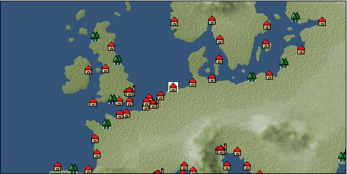

# Port: ブレーメン

import Tabs from '@theme/Tabs';
import TabItem from '@theme/TabItem';

## General Information

| Attribute | Details |
| :--- | :--- |
| **Port Name** | bremen |
| **Port Type** | port of alliance |
| **Region** | northern europe |
| **Sea Area** | North Sea |
| **Required Language** | german |
| **Coordinates** | （226，2393） |
| **Investment Reward** | [Lot (NO.1)](docs/Items/Consumables/Consumables-Treasure-Chests/item_2800.md) （必要投資額：300,000ドゥカード） |

### Available Facilities

| guild | intermediary | exchange | tool shop | workshop craftsman | Painter | sculptor | peddler |
| --- | --- | --- | --- | --- | --- | --- | --- |
|   |   | ○ | ○ | ○ |   |   |   |
| Shipyard Master | Lumbermaker | Sail-maker | weapon craftsman | master | TavernFemale | archive | salesperson |
| --- | --- | --- | --- | --- | --- | --- | --- |
| ○ |   |   |   | ○ |   |   |   |
| Shipwright | 銀行 | street worker | 王宮 | Trading post | church | suburbs | translator |
| --- | --- | --- | --- | --- | --- | --- | --- |
| ○ | ○ | ○ |   |   | ○ |   |   |

### Description
A port city located at the mouth of the Wesel River. It was founded in the 9th century as an archdiocese town. Around the 14th century, it became a Hanseatic city and flourished as a commercial city. Cultural area: Germany Investment reward is 1 piece for every 300k

<Tabs>
  <TabItem value="trade_goods_sales" label="Trade Goods Sales">

| item | group | purchase price | 同盟時 | remarks |
| --- | --- | --- | --- | --- |
| [arquebus gun](docs/Items/TradeGoods/TradeGoods-Firearms/item_14.md) | [Trading Items (Firearms)](docs/Categories/category_17.md) | (1,754) | 1,535 |  |
| 時代限定（15世紀第2期） |
| [tin ore](docs/Items/TradeGoods/TradeGoods-Minerals/item_23.md) | [Trading Items (Iron Stone)](docs/Categories/category_7.md) | (484) | 424 |  |
| Time limited (15th century 3rd period) During alliance: confirmed at 100% |
| [dandelion](docs/Items/TradeGoods/TradeGoods-Medicine/item_1089.md) | [Trading products (medical products)](docs/Categories/category_6.md) | 219 | 192 |  |
| 要投資（必要投資額：500,000） |
| [Beer](docs/Items/TradeGoods/TradeGoods-Alcohol/item_2.md) | [交易品（酒類）](docs/Categories/category_9.md) | 282 | 248 |  |
| When in alliance: confirmed at 100% |
| [salt](docs/Items/TradeGoods/TradeGoods-Seasonings/item_42.md) | [交易品（調味料）](docs/Categories/category_4.md) | 237 | 208 |  |
| When in alliance: confirmed at 100% |
| [wheat](docs/Items/TradeGoods/TradeGoods-Foodstuffs/item_16.md) | [Trading items (food items)](docs/Categories/category_3.md) | 45 | 40 |  |
| When in alliance: confirmed at 100% |
| [fur](docs/Items/TradeGoods/TradeGoods-Fibers/item_634.md) | [交易品（繊維）](docs/Categories/category_1.md) | 1,297 | (1,135) |  |
| [amber](docs/Items/TradeGoods/TradeGoods-Gems/item_618.md) | [Trading Items (Gemstones)](docs/Categories/category_15.md) | (3,251) | 2,845 |  |
| 時代限定（15世紀第1期、15世紀第2期、15世紀第3期） |
| [cotton fabric](docs/Items/TradeGoods/TradeGoods-Fabrics/item_571.md) | [交易品（織物）](docs/Categories/category_20.md) | (1,000) | 875 |  |
| 要投資（必要投資額：600,000） EO第４章で追加 |
  </TabItem>
  <TabItem value="sale_specialty" label="Sale (Specialty)">

| item | group | sale price | 同盟時 | remarks |
| --- | --- | --- | --- | --- |

#### [交易品（繊維）](docs/Categories/category_1.md)

| [alpaca hair](docs/Items/TradeGoods/TradeGoods-Fibers/item_3009.md) | 交易品（繊維） | (2,662) | 3,106 |  |
| [Green ramie](docs/Items/TradeGoods/TradeGoods-Fibers/item_3428.md) | 交易品（繊維） | (32,995) | 38,500 |  |
| 80%=30800 |

#### [Trading Goods (Dye)](docs/Categories/category_2.md)

| [ward](docs/Items/TradeGoods/TradeGoods-Dye/item_57.md) | Trading Goods (Dye) | 1,440 | 1,480 |  |
| [Locao](docs/Items/TradeGoods/TradeGoods-Dye/item_3909.md) | Trading Goods (Dye) | 44,706 | (50,299) |  |

#### [Trading items (food items)](docs/Categories/category_3.md)

| [buckwheat](docs/Items/TradeGoods/TradeGoods-Foodstuffs/item_3430.md) | Trading items (food items) | (32,553) | 37,984 |  |
| 124%=47100 |
| [Karasumi](docs/Items/TradeGoods/TradeGoods-Foodstuffs/item_3687.md) | Trading items (food items) | 33,206 | (37,360) |  |

#### [交易品（調味料）](docs/Categories/category_4.md)

| [tamarind](docs/Items/TradeGoods/TradeGoods-Seasonings/item_1968.md) | 交易品（調味料） | (2,038) | 2,378 |  |
| [apple cider vinegar](docs/Items/TradeGoods/TradeGoods-Seasonings/item_882.md) | 交易品（調味料） | (417) | 486 |  |
| [Sha Cha Ji](docs/Items/TradeGoods/TradeGoods-Seasonings/item_3689.md) | 交易品（調味料） | 45,778 | (51,505) |  |

#### [交易品（雑貨）](docs/Categories/category_5.md)

| [Japanese books](docs/Items/TradeGoods/TradeGoods-Misc/item_3439.md) | 交易品（雑貨） | (32,914) | 38,405 |  |
| [rattan work](docs/Items/TradeGoods/TradeGoods-Misc/item_3698.md) | 交易品（雑貨） | 32,022 | (36,028) |  |

#### [Trading products (medical products)](docs/Categories/category_6.md)

| [Borei](docs/Items/TradeGoods/TradeGoods-Medicine/item_3678.md) | Trading products (medical products) | 33,334 | (37,504) |  |
| [Nothing](docs/Items/TradeGoods/TradeGoods-Medicine/item_1053.md) | Trading products (medical products) | (870) | 1,015 |  |
| [calamus](docs/Items/TradeGoods/TradeGoods-Medicine/item_3427.md) | Trading products (medical products) | (34,395) | 40,134 |  |
| 75%=30100 |

#### [Trading Items (Iron Stone)](docs/Categories/category_7.md)

| [Hokutolite](docs/Items/TradeGoods/TradeGoods-Minerals/item_3694.md) | Trading Items (Iron Stone) | (32,928) | 38,422 |  |

#### [Trading products (precious metals)](docs/Categories/category_8.md)

| [platinum](docs/Items/TradeGoods/TradeGoods-Metals/item_2178.md) | Trading products (precious metals) | (7,199) | 8,400 |  |
| When in alliance: confirmed at 100% |
| [佐摩銀](docs/Items/TradeGoods/TradeGoods-Metals/item_3432.md) | Trading products (precious metals) | (36,605) | 42,712 |  |
| 118%=50400 |

#### [交易品（酒類）](docs/Categories/category_9.md)

| [sherry](docs/Items/TradeGoods/TradeGoods-Alcohol/item_844.md) | 交易品（酒類） | 613 | (689) |  |
| [fruit brandy](docs/Items/TradeGoods/TradeGoods-Alcohol/item_1440.md) | 交易品（酒類） | 712 | (801) |  |
| [Sake](docs/Items/TradeGoods/TradeGoods-Alcohol/item_3424.md) | 交易品（酒類） | (45,339) | 52,904 |  |
| 93%=49200 |

#### [Trading goods (hobby goods)](docs/Categories/category_10.md)

| [Aigyoku](docs/Items/TradeGoods/TradeGoods-Sunddries/item_3677.md) | Trading goods (hobby goods) | 43,475 | (48,914) |  |
| [cacao](docs/Items/TradeGoods/TradeGoods-Sunddries/item_140.md) | Trading goods (hobby goods) | (1,242) | 1,449 |  |
| [caviar](docs/Items/TradeGoods/TradeGoods-Sunddries/item_2122.md) | Trading goods (hobby goods) | (1,727) | 2,015 |  |
| [eggplant](docs/Items/TradeGoods/TradeGoods-Sunddries/item_3426.md) | Trading goods (hobby goods) | (32,837) | 38,316 |  |
| 95%=36400 |
| [peanuts](docs/Items/TradeGoods/TradeGoods-Sunddries/item_134.md) | Trading goods (hobby goods) | (380) | 443 |  |
| [prune](docs/Items/TradeGoods/TradeGoods-Sunddries/item_523.md) | Trading goods (hobby goods) | (461) | 537 |  |
| [dried figs](docs/Items/TradeGoods/TradeGoods-Sunddries/item_611.md) | Trading goods (hobby goods) | (435) | 507 |  |
| When in alliance: confirmed at 100% |
| [black tea](docs/Items/TradeGoods/TradeGoods-Sunddries/item_675.md) | Trading goods (hobby goods) | 2,670 | 2,847 |  |

#### [Trading Goods (Spices)](docs/Categories/category_11.md)

| [oakmoss](docs/Items/TradeGoods/TradeGoods-Perfume/item_819.md) | Trading Goods (Spices) | (1,171) | 1,366 |  |
| [jasmine](docs/Items/TradeGoods/TradeGoods-Perfume/item_772.md) | Trading Goods (Spices) | (7,424) | 8,662 |  |
| [geranium](docs/Items/TradeGoods/TradeGoods-Perfume/item_145.md) | Trading Goods (Spices) | 1,280 | 1,340 |  |
| [lira](docs/Items/TradeGoods/TradeGoods-Perfume/item_30.md) | Trading Goods (Spices) | (738) | 861 |  |
| [Tang Muxiang](docs/Items/TradeGoods/TradeGoods-Perfume/item_593.md) | Trading Goods (Spices) | (1,749) | 2,040 |  |
| When in alliance: confirmed at 100% |
| [sandalwood](docs/Items/TradeGoods/TradeGoods-Perfume/item_771.md) | Trading Goods (Spices) | 4,720 | 5,280 |  |

#### [Trading Goods (Spices)](docs/Categories/category_12.md)

| [cloves](docs/Items/TradeGoods/TradeGoods-Spices/item_1092.md) | Trading Goods (Spices) | (11,056) | 12,900 |  |
| When in alliance: confirmed at 100% |
| [Sanshou](docs/Items/TradeGoods/TradeGoods-Spices/item_3794.md) | Trading Goods (Spices) | 33,715 | (37,933) |  |
| [nutmeg](docs/Items/TradeGoods/TradeGoods-Spices/item_1969.md) | Trading Goods (Spices) | (20,532) | 23,957 |  |
| [mace](docs/Items/TradeGoods/TradeGoods-Spices/item_2100.md) | Trading Goods (Spices) | (12,084) | 14,100 |  |
| 98%＝13800 |
| [Laurier](docs/Items/TradeGoods/TradeGoods-Spices/item_615.md) | Trading Goods (Spices) | (223) | 260 |  |
| [Grapefruit](docs/Items/TradeGoods/TradeGoods-Spices/item_3422.md) | Trading Goods (Spices) | (34,623) | 40,400 |  |
| When in alliance: confirmed at 100% |

#### [Trading goods (artificial goods)](docs/Categories/category_13.md)

| [glasswork](docs/Items/TradeGoods/TradeGoods-Luxuries/item_60.md) | Trading goods (artificial goods) | (1,457) | 1,700 |  |
| [Tumbaga](docs/Items/TradeGoods/TradeGoods-Luxuries/item_3028.md) | Trading goods (artificial goods) | (18,700) | 21,820 |  |
| 98%＝21500 |
| [Corner work](docs/Items/TradeGoods/TradeGoods-Luxuries/item_3696.md) | Trading goods (artificial goods) | 31,326 | (35,245) |  |

#### [交易品（美術品）](docs/Categories/category_14.md)

| [Japanese painting](docs/Items/TradeGoods/TradeGoods-Art/item_3436.md) | 交易品（美術品） | (34,376) | 40,112 |  |
| 90%=36100 |
| [Mother-of-pearl lacquerware](docs/Items/TradeGoods/TradeGoods-Art/item_3785.md) | 交易品（美術品） | (31,937) | 37,265 |  |

#### [Trading Items (Gemstones)](docs/Categories/category_15.md)

| [aventurine](docs/Items/TradeGoods/TradeGoods-Gems/item_678.md) | Trading Items (Gemstones) | 5,980 | 6,265 |  |
| [inca rose](docs/Items/TradeGoods/TradeGoods-Gems/item_3014.md) | Trading Items (Gemstones) | (15,512) | 18,100 |  |
| When in alliance: confirmed at 100% |
| [opal](docs/Items/TradeGoods/TradeGoods-Gems/item_2006.md) | Trading Items (Gemstones) | (6,931) | 8,087 |  |
| [cat's eye](docs/Items/TradeGoods/TradeGoods-Gems/item_1047.md) | Trading Items (Gemstones) | 10,300 | 10,800 |  |
| [sapphire](docs/Items/TradeGoods/TradeGoods-Gems/item_676.md) | Trading Items (Gemstones) | 12,500 | 13,100 |  |
| When in alliance: confirmed at 100% |
| [diamond](docs/Items/TradeGoods/TradeGoods-Gems/item_449.md) | Trading Items (Gemstones) | 8,500 | 8,966 |  |
| [pink diamond](docs/Items/TradeGoods/TradeGoods-Gems/item_2874.md) | Trading Items (Gemstones) | (13,798) | 16,100 |  |
| When in alliance: confirmed at 100% |
| [ruby](docs/Items/TradeGoods/TradeGoods-Gems/item_773.md) | Trading Items (Gemstones) | (11,656) | 13,600 |  |
| When in alliance: confirmed at 100% |
| [taiwan sapphire](docs/Items/TradeGoods/TradeGoods-Gems/item_3695.md) | Trading Items (Gemstones) | 30,000 | (33,753) |  |

#### [Trading Items (Arms)](docs/Categories/category_16.md)

| [crossbow](docs/Items/TradeGoods/TradeGoods-Weapons/item_537.md) | Trading Items (Arms) | (1,227) | 1,431 |  |
| [damascus sword](docs/Items/TradeGoods/TradeGoods-Weapons/item_903.md) | Trading Items (Arms) | (6,254) | 7,297 |  |
| 6640=91% |
| [Japanese sword](docs/Items/TradeGoods/TradeGoods-Weapons/item_3437.md) | Trading Items (Arms) | (33,320) | 38,879 |  |
| 107%=41600 |
| [rattan armor](docs/Items/TradeGoods/TradeGoods-Weapons/item_3699.md) | Trading Items (Arms) | 45,000 | (50,629) |  |

#### [Trading Items (Firearms)](docs/Categories/category_17.md)

| [musket gun](docs/Items/TradeGoods/TradeGoods-Firearms/item_584.md) | Trading Items (Firearms) | 3,471 | (3,905) |  |
| [tanegashima gun](docs/Items/TradeGoods/TradeGoods-Firearms/item_3423.md) | Trading Items (Firearms) | (32,186) | 37,556 |  |
| 90%=33800 |

#### [Trading Goods (Livestock)](docs/Categories/category_18.md)

| [boar](docs/Items/TradeGoods/TradeGoods-Livestock/item_3476.md) | Trading Goods (Livestock) | (32,652) | 38,100 |  |

#### [交易品（工業品）](docs/Categories/category_19.md)

| [Japanese paper](docs/Items/TradeGoods/TradeGoods-Wares/item_3438.md) | 交易品（工業品） | (25,025) | 29,200 |  |
| [rattan](docs/Items/TradeGoods/TradeGoods-Wares/item_3701.md) | 交易品（工業品） | 31,539 | (35,484) |  |
| [羊皮紙](docs/Items/TradeGoods/TradeGoods-Wares/item_53.md) | 交易品（工業品） | (1,415) | 1,650 |  |

#### [交易品（織物）](docs/Categories/category_20.md)

| [Awaiyo](docs/Items/TradeGoods/TradeGoods-Fabrics/item_3002.md) | 交易品（織物） | (9,427) | 11,000 |  |
| When in alliance: confirmed at 100% |
| [indian chintz](docs/Items/TradeGoods/TradeGoods-Fabrics/item_159.md) | 交易品（織物） | (2,314) | 2,700 |  |
| When in alliance: confirmed at 100% |
| [gobelin weave](docs/Items/TradeGoods/TradeGoods-Fabrics/item_1276.md) | 交易品（織物） | 3,979 | (4,476) |  |
| [damask](docs/Items/TradeGoods/TradeGoods-Fabrics/item_614.md) | 交易品（織物） | (6,114) | 7,134 |  |
| [velvet](docs/Items/TradeGoods/TradeGoods-Fabrics/item_902.md) | 交易品（織物） | 5,030 | 4,664 |  |
| [persian rug](docs/Items/TradeGoods/TradeGoods-Fabrics/item_606.md) | 交易品（織物） | (10,027) | 11,700 |  |
| 98%＝11600 101%＝11800 |
| [Nishijin textile](docs/Items/TradeGoods/TradeGoods-Fabrics/item_3431.md) | 交易品（織物） | (36,297) | 42,353 |  |
| 68%=28800 |
  </TabItem>
  <TabItem value="sale_no_specialty" label="Sale (No Specialty)">

| item | group | sale price | 同盟時 | remarks |
| --- | --- | --- | --- | --- |

#### [交易品（繊維）](docs/Categories/category_1.md)

| [flax](docs/Items/TradeGoods/TradeGoods-Fibers/item_64.md) | 交易品（繊維） | 246 | 254 |  |
| [leather](docs/Items/TradeGoods/TradeGoods-Fibers/item_44.md) | 交易品（繊維） | 740 | 781 |  |
| [feather](docs/Items/TradeGoods/TradeGoods-Fibers/item_585.md) | 交易品（繊維） | 619 | 686 |  |

#### [Trading Goods (Dye)](docs/Categories/category_2.md)

| [貝紫](docs/Items/TradeGoods/TradeGoods-Dye/item_110.md) | Trading Goods (Dye) | (4,889) | 5,704 |  |

#### [Trading items (food items)](docs/Categories/category_3.md)

| [redfish](docs/Items/TradeGoods/TradeGoods-Foodstuffs/item_701.md) | Trading items (food items) | 42 | (47) |  |
| [duck meat](docs/Items/TradeGoods/TradeGoods-Foodstuffs/item_32.md) | Trading items (food items) | (416) | 485 |  |
| [turnip](docs/Items/TradeGoods/TradeGoods-Foodstuffs/item_55.md) | Trading items (food items) | 94 | (105) |  |
| [Oat](docs/Items/TradeGoods/TradeGoods-Foodstuffs/item_275.md) | Trading items (food items) | 80 | (90) |  |
| [Pacific saury](docs/Items/TradeGoods/TradeGoods-Foodstuffs/item_700.md) | Trading items (food items) | 28 | (31) |  |
| [sausage](docs/Items/TradeGoods/TradeGoods-Foodstuffs/item_27.md) | Trading items (food items) | (336) | 392 |  |
| [cheese](docs/Items/TradeGoods/TradeGoods-Foodstuffs/item_20.md) | Trading items (food items) | 448 | (504) |  |
| [corn](docs/Items/TradeGoods/TradeGoods-Foodstuffs/item_138.md) | Trading items (food items) | (193) | 225 |  |
| [herring](docs/Items/TradeGoods/TradeGoods-Foodstuffs/item_698.md) | Trading items (food items) | 28 | (31) |  |
| [ham](docs/Items/TradeGoods/TradeGoods-Foodstuffs/item_290.md) | Trading items (food items) | 418 | 440 |  |
| [egg](docs/Items/TradeGoods/TradeGoods-Foodstuffs/item_40.md) | Trading items (food items) | (31) | 36 |  |
| [barley](docs/Items/TradeGoods/TradeGoods-Foodstuffs/item_124.md) | Trading items (food items) | 100 | (112) |  |
| [mutton](docs/Items/TradeGoods/TradeGoods-Foodstuffs/item_33.md) | Trading items (food items) | (434) | 506 |  |
| [魚肉](docs/Items/TradeGoods/TradeGoods-Foodstuffs/item_10.md) | Trading items (food items) | 206 | 218 |  |
| When in alliance: confirmed at 100% |
| [chicken meat](docs/Items/TradeGoods/TradeGoods-Foodstuffs/item_29.md) | Trading items (food items) | (427) | 498 |  |

#### [交易品（調味料）](docs/Categories/category_4.md)

| [almond oil](docs/Items/TradeGoods/TradeGoods-Seasonings/item_578.md) | 交易品（調味料） | (691) | 806 |  |
| When in alliance: confirmed at 100% |
| [white vinegar](docs/Items/TradeGoods/TradeGoods-Seasonings/item_56.md) | 交易品（調味料） | (199) | 232 |  |
| [salt](docs/Items/TradeGoods/TradeGoods-Seasonings/item_42.md) | 交易品（調味料） | 283 | (318) |  |
| When in alliance: confirmed at 100% |
| [Honey](docs/Items/TradeGoods/TradeGoods-Seasonings/item_49.md) | 交易品（調味料） | 1,074 | (1,208) |  |

#### [交易品（雑貨）](docs/Categories/category_5.md)

| [Western books](docs/Items/TradeGoods/TradeGoods-Misc/item_293.md) | 交易品（雑貨） | 709 | (797) |  |

#### [Trading products (medical products)](docs/Categories/category_6.md)

| [chamomile](docs/Items/TradeGoods/TradeGoods-Medicine/item_292.md) | Trading products (medical products) | 352 | 363 |  |
| [dandelion](docs/Items/TradeGoods/TradeGoods-Medicine/item_1089.md) | Trading products (medical products) | 286 | (321) |  |
| 要投資（必要投資額：500,000） |

#### [Trading Items (Iron Stone)](docs/Categories/category_7.md)

| [tin ore](docs/Items/TradeGoods/TradeGoods-Minerals/item_23.md) | Trading Items (Iron Stone) | (473) | 551 |  |
| Time limited (15th century 3rd period) During alliance: confirmed at 100% |
| [iron ore](docs/Items/TradeGoods/TradeGoods-Minerals/item_146.md) | Trading Items (Iron Stone) | (624) | 727 |  |
| When in alliance: confirmed at 100% |
| [lead ore](docs/Items/TradeGoods/TradeGoods-Minerals/item_21.md) | Trading Items (Iron Stone) | 480 | 490 |  |
| [copper ore](docs/Items/TradeGoods/TradeGoods-Minerals/item_65.md) | Trading Items (Iron Stone) | (748) | 872 |  |

#### [Trading products (precious metals)](docs/Categories/category_8.md)

| [gold](docs/Items/TradeGoods/TradeGoods-Metals/item_659.md) | Trading products (precious metals) | (7,758) | 9,052 |  |
| [silver](docs/Items/TradeGoods/TradeGoods-Metals/item_136.md) | Trading products (precious metals) | (2,469) | 2,880 |  |
| When in alliance: confirmed at 100% |

#### [交易品（酒類）](docs/Categories/category_9.md)

| [aquavit](docs/Items/TradeGoods/TradeGoods-Alcohol/item_572.md) | 交易品（酒類） | 594 | 595 |  |
| [whiskey](docs/Items/TradeGoods/TradeGoods-Alcohol/item_1.md) | 交易品（酒類） | 728 | 773 |  |
| [gin](docs/Items/TradeGoods/TradeGoods-Alcohol/item_291.md) | 交易品（酒類） | 600 | 619 |  |
| [brandy](docs/Items/TradeGoods/TradeGoods-Alcohol/item_9.md) | 交易品（酒類） | 913 | (1,027) |  |
| [wine](docs/Items/TradeGoods/TradeGoods-Alcohol/item_11.md) | 交易品（酒類） | 541 | (608) |  |

#### [Trading goods (hobby goods)](docs/Categories/category_10.md)

| [pickles](docs/Items/TradeGoods/TradeGoods-Sunddries/item_535.md) | Trading goods (hobby goods) | (288) | 336 |  |

#### [Trading Goods (Spices)](docs/Categories/category_11.md)

| [lily of the valley](docs/Items/TradeGoods/TradeGoods-Perfume/item_358.md) | Trading Goods (Spices) | (664) | 774 |  |
| [lemon oil](docs/Items/TradeGoods/TradeGoods-Perfume/item_151.md) | Trading Goods (Spices) | (551) | 642 |  |

#### [Trading Goods (Spices)](docs/Categories/category_12.md)

| [celery](docs/Items/TradeGoods/TradeGoods-Spices/item_431.md) | Trading Goods (Spices) | (146) | 170 |  |
| [mint](docs/Items/TradeGoods/TradeGoods-Spices/item_816.md) | Trading Goods (Spices) | 197 | (221) |  |

#### [Trading goods (artificial goods)](docs/Categories/category_13.md)

| [dragonfly ball](docs/Items/TradeGoods/TradeGoods-Luxuries/item_294.md) | Trading goods (artificial goods) | 1,178 | 1,220 |  |
| [lapidary work](docs/Items/TradeGoods/TradeGoods-Luxuries/item_153.md) | Trading goods (artificial goods) | (3,740) | 4,363 |  |
| [皮革製品](docs/Items/TradeGoods/TradeGoods-Luxuries/item_12.md) | Trading goods (artificial goods) | 1,266 | (1,424) |  |
| [Ivory work](docs/Items/TradeGoods/TradeGoods-Luxuries/item_1090.md) | Trading goods (artificial goods) | 3,369 | (3,790) |  |
| [goldsmith](docs/Items/TradeGoods/TradeGoods-Luxuries/item_687.md) | Trading goods (artificial goods) | 4,952 | (5,571) |  |
| [silversmith](docs/Items/TradeGoods/TradeGoods-Luxuries/item_619.md) | Trading goods (artificial goods) | (2,829) | 3,300 |  |
| [ceramics](docs/Items/TradeGoods/TradeGoods-Luxuries/item_152.md) | Trading goods (artificial goods) | (1,322) | 1,542 |  |
| [luxury furniture](docs/Items/TradeGoods/TradeGoods-Luxuries/item_1048.md) | Trading goods (artificial goods) | 2,858 | (3,215) |  |

#### [交易品（美術品）](docs/Categories/category_14.md)

| [古美術品](docs/Items/TradeGoods/TradeGoods-Art/item_51.md) | 交易品（美術品） | 5,232 | (5,886) |  |
| [青銅像](docs/Items/TradeGoods/TradeGoods-Art/item_148.md) | 交易品（美術品） | (1,170) | 1,365 |  |

#### [Trading Items (Gemstones)](docs/Categories/category_15.md)

| [Agate](docs/Items/TradeGoods/TradeGoods-Gems/item_107.md) | Trading Items (Gemstones) | (4,634) | 5,407 |  |
| [emerald](docs/Items/TradeGoods/TradeGoods-Gems/item_777.md) | Trading Items (Gemstones) | (7,336) | 8,560 |  |
| [malachite](docs/Items/TradeGoods/TradeGoods-Gems/item_679.md) | Trading Items (Gemstones) | 1,964 | (2,209) |  |
| [crystal](docs/Items/TradeGoods/TradeGoods-Gems/item_893.md) | Trading Items (Gemstones) | (1,199) | 1,398 |  |
| [pearl](docs/Items/TradeGoods/TradeGoods-Gems/item_769.md) | Trading Items (Gemstones) | (10,284) | 12,000 |  |
| [ivory](docs/Items/TradeGoods/TradeGoods-Gems/item_699.md) | Trading Items (Gemstones) | 3,950 | 4,150 |  |

#### [Trading Items (Arms)](docs/Categories/category_16.md)

| [scimitar](docs/Items/TradeGoods/TradeGoods-Weapons/item_142.md) | Trading Items (Arms) | 1,039 | (1,168) |  |
| [one handed sword](docs/Items/TradeGoods/TradeGoods-Weapons/item_433.md) | Trading Items (Arms) | 1,171 | (1,317) |  |
| [dagger](docs/Items/TradeGoods/TradeGoods-Weapons/item_143.md) | Trading Items (Arms) | (852) | 993 |  |
| When in alliance: confirmed at 100% |
| [western armor](docs/Items/TradeGoods/TradeGoods-Weapons/item_6.md) | Trading Items (Arms) | 2,689 | (3,025) |  |
| ▲Special products from neighboring areas |
| [長弓](docs/Items/TradeGoods/TradeGoods-Weapons/item_1049.md) | Trading Items (Arms) | 863 | (970) |  |

#### [Trading Items (Firearms)](docs/Categories/category_17.md)

| [大砲](docs/Items/TradeGoods/TradeGoods-Firearms/item_4.md) | Trading Items (Firearms) | 3,200 | (3,600) |  |
| [cannonball](docs/Items/TradeGoods/TradeGoods-Firearms/item_144.md) | Trading Items (Firearms) | (1,526) | 1,780 |  |
| When in alliance: confirmed at 100% |

#### [Trading Goods (Livestock)](docs/Categories/category_18.md)

| [duck](docs/Items/TradeGoods/TradeGoods-Livestock/item_38.md) | Trading Goods (Livestock) | (60) | 69 |  |
| [chicken](docs/Items/TradeGoods/TradeGoods-Livestock/item_252.md) | Trading Goods (Livestock) | (48) | 55 |  |
| [sheep](docs/Items/TradeGoods/TradeGoods-Livestock/item_253.md) | Trading Goods (Livestock) | (115) | 134 |  |

#### [交易品（工業品）](docs/Categories/category_19.md)

| [wood](docs/Items/TradeGoods/TradeGoods-Wares/item_277.md) | 交易品（工業品） | 800 | 830 |  |
| [Stone](docs/Items/TradeGoods/TradeGoods-Wares/item_276.md) | 交易品（工業品） | 744 | (837) |  |
| [coal](docs/Items/TradeGoods/TradeGoods-Wares/item_359.md) | 交易品（工業品） | (457) | 533 |  |
| When in alliance: confirmed at 100% |
| [iron material](docs/Items/TradeGoods/TradeGoods-Wares/item_268.md) | 交易品（工業品） | 873 | (982) |  |

#### [交易品（織物）](docs/Categories/category_20.md)

| [dutch calico](docs/Items/TradeGoods/TradeGoods-Fabrics/item_1435.md) | 交易品（織物） | 910 | 943 |  |
| [satin](docs/Items/TradeGoods/TradeGoods-Fabrics/item_996.md) | 交易品（織物） | 4,040 | (4,545) |  |
| [flannel](docs/Items/TradeGoods/TradeGoods-Fabrics/item_149.md) | 交易品（織物） | 1,323 | (1,488) |  |
| [muslin](docs/Items/TradeGoods/TradeGoods-Fabrics/item_581.md) | 交易品（織物） | 1,588 | (1,786) |  |
| [woolen fabric](docs/Items/TradeGoods/TradeGoods-Fabrics/item_163.md) | 交易品（織物） | 1,000 | 1,020 |  |
| [cotton fabric](docs/Items/TradeGoods/TradeGoods-Fabrics/item_571.md) | 交易品（織物） | 1,178 | (1,325) |  |
| 要投資（必要投資額：600,000） EO第４章で追加 |
| [linen fabric](docs/Items/TradeGoods/TradeGoods-Fabrics/item_135.md) | 交易品（織物） | 445 | (500) |  |
  </TabItem>
  <TabItem value="guild_&_others" label="Guild & Others">

| item | group | Sales price | Handling NPC | remarks |
| --- | --- | --- | --- | --- |
| There is no sales information for the item |
| --- |
  </TabItem>
  <TabItem value="toolman" label="Toolman">

| item | group | Sales price | Handling NPC | remarks |
| --- | --- | --- | --- | --- |

#### [recipe book](docs/Categories/category_22.md)

| [Mode Design Collection Volume 2](docs/Items/RecipeBooks/item_709.md) | recipe book | 30,000 | tool shop owner |  |
| 要投資（必要投資額：120,000） |
| [Mercenary combat uniform sewing method](docs/Items/RecipeBooks/item_4501.md) | recipe book | Fixed recipe | tool shop owner |  |
| 15世紀第4期、第5期 |
| [Wand forging/application](docs/Items/RecipeBooks/item_710.md) | recipe book | 50,000 | tool shop owner |  |
| 要投資（必要投資額：120,000） |
| [Book of land battle props and crafts](docs/Items/RecipeBooks/item_521.md) | recipe book | 10,000 | tool shop owner |  |

#### [Equipment (belongings)](docs/Categories/category_27.md)

| [matchlock shooting gun](docs/Items/Equipment/Equipment-Weapon/item_103.md) | Equipment (belongings) | 3,000 | tool shop owner |  |
| [roundel dagger](docs/Items/Equipment/Equipment-Weapon/item_1670.md) | Equipment (belongings) | 24,500 | tool shop owner |  |
| 要投資（必要投資額：240,000） |

#### [装備品（服飾品）](docs/Categories/category_28.md)

| [Utilization guidebook volume 1](docs/Items/Equipment/Equipment-Accessory/item_2209.md) | 装備品（服飾品） | 10,000 | tool shop owner |  |
| 要投資（必要投資額：120,000） |
| [Consecutive Attack Guide Volume 1](docs/Items/Equipment/Equipment-Accessory/item_2208.md) | 装備品（服飾品） | 10,000 | tool shop owner |  |
| 要投資（必要投資額：120,000） |

#### [Consumables (land battle/deck battle)](docs/Categories/category_29.md)

| [hawk feather](docs/Items/Consumables/Consumables-Landbattle/item_562.md) | Consumables (land battle/deck battle) | 200 | tool shop owner |  |
| [throwing knife](docs/Items/Consumables/Consumables-Landbattle/item_560.md) | Consumables (land battle/deck battle) | 150 | tool shop owner |  |
| [Assortment of therapeutic drugs](docs/Items/Consumables/Consumables-Landbattle/item_564.md) | Consumables (land battle/deck battle) | 900 | tool shop owner |  |
| [secret cure](docs/Items/Consumables/Consumables-Landbattle/item_563.md) | Consumables (land battle/deck battle) | 600 | tool shop owner |  |

#### [Consumables (naval/hand-to-hand combat)](docs/Categories/category_30.md)

| [forged correspondence](docs/Items/Consumables/Consumables-navalhand-to-hand combat/item_559.md) | Consumables (naval/hand-to-hand combat) | 3,000 | tool shop owner |  |

#### [Consumables (skill activation)](docs/Categories/category_31.md)

| [fishing gear](docs/Items/Consumables/Consumables-Skill/item_79.md) | Consumables (skill activation) | 2,500 | tool shop owner |  |

#### [Consumables (request documents)](docs/Categories/category_45.md)

| [Textile purchase order](docs/Items/Consumables/Consumables-Documents/item_2977.md) | Consumables (request documents) | 50,000 | tool shop owner |  |
  </TabItem>
  <TabItem value="kobo_craftsmen" label="Craftsman">

| item | group | Sales price | Handling NPC | remarks |
| --- | --- | --- | --- | --- |

#### [Consumables (condition recovery)](docs/Categories/category_21.md)

| [Nostalgic carillon bell](docs/Items/Consumables/Consumables-Recovery/item_245.md) | Consumables (condition recovery) | 200 | workshop craftsman |  |
| [Ship song sheet music](docs/Items/Consumables/Consumables-Recovery/item_247.md) | Consumables (condition recovery) | 200 | workshop craftsman |  |

#### [recipe book](docs/Categories/category_22.md)

| [Furniture Manufacturing/North Sea Volume 1](docs/Items/RecipeBooks/item_2002.md) | recipe book | Fixed recipe | workshop craftsman |  |
| [Special weapons manufacturing method](docs/Items/RecipeBooks/item_747.md) | recipe book | 100,000 | workshop craftsman |  |
| 要投資（必要投資額：不明） |

#### [Consumables (skill activation)](docs/Categories/category_31.md)

| [四分儀](docs/Items/Consumables/Consumables-Skill/item_346.md) | Consumables (skill activation) | 500 | workshop craftsman |  |

#### [shipbuilding materials](docs/Categories/category_47.md)

| [General purpose medium square sail](docs/Items/ShipbuildingFS/item_3453.md) | shipbuilding materials | 300,000 | workshop craftsman |  |
| 要投資（必要投資額：500,000） |
| [General purpose medium latin sail](docs/Items/ShipbuildingFS/item_3452.md) | shipbuilding materials | 300,000 | workshop craftsman |  |
| 要投資（必要投資額：500,000） |
| [General-purpose medium-sized oar](docs/Items/ShipbuildingFS/item_3454.md) | shipbuilding materials | 500,000 | workshop craftsman |  |
| 要投資（必要投資額：720,000） |
| [General-purpose medium-sized reinforcement board](docs/Items/ShipbuildingFS/item_3456.md) | shipbuilding materials | 500,000 | workshop craftsman |  |
| 要投資（必要投資額：720,000） |
| [General-purpose medium-sized expansion warehouse](docs/Items/ShipbuildingFS/item_3534.md) | shipbuilding materials | 800,000 | workshop craftsman |  |
| 要投資（必要投資額：720,000） |
| [General-purpose medium-sized expansion cabin](docs/Items/ShipbuildingFS/item_3533.md) | shipbuilding materials | 800,000 | workshop craftsman |  |
| 要投資（必要投資額：720,000） |
| [General-purpose medium-sized improved rudder](docs/Items/ShipbuildingFS/item_3532.md) | shipbuilding materials | 800,000 | workshop craftsman |  |
| 要投資（必要投資額：720,000） |
| [General-purpose medium-sized paddle boat](docs/Items/ShipbuildingFS/item_3451.md) | shipbuilding materials | 1,000,000 | workshop craftsman |  |
| 要投資（必要投資額：600,000） |
| [General-purpose medium-sized anti-swaying water tank](docs/Items/ShipbuildingFS/item_3535.md) | shipbuilding materials | 800,000 | workshop craftsman |  |
| 要投資（必要投資額：720,000） |
| [General purpose medium gun port](docs/Items/ShipbuildingFS/item_3455.md) | shipbuilding materials | 300,000 | workshop craftsman |  |
| 要投資（必要投資額：500,000） |
| [General-purpose medium-sized hull](docs/Items/ShipbuildingFS/item_3450.md) | shipbuilding materials | 1,000,000 | workshop craftsman |  |
| 要投資（必要投資額：600,000） |
| [General purpose medium armor plate](docs/Items/ShipbuildingFS/item_3503.md) | shipbuilding materials | 500,000 | workshop craftsman |  |
| 要投資（必要投資額：720,000） |

#### [furniture](docs/Categories/category_48.md)

| [Skill bookshelf 2 tiers](docs/Items/Furniture/item_2929.md) | furniture | Fixed recipe | workshop craftsman |  |
| [open rack for storage](docs/Items/Furniture/item_2610.md) | furniture | Fixed recipe | workshop craftsman |  |
| [side table with storage](docs/Items/Furniture/item_2810.md) | furniture | Fixed recipe | workshop craftsman |  |
| [wooden container](docs/Items/Furniture/item_2611.md) | furniture | Fixed recipe | workshop craftsman |  |
  </TabItem>
  <TabItem value="shipyard" label="Shipyard">

### Shipyard Master

| item | group | Sales price | Handling NPC | remarks |
| --- | --- | --- | --- | --- |

#### [Boat](docs/Categories/category_43.md)

| [2 mast cogs](docs/Items/Ships/item_265.md) | Boat | 96,000 | Shipyard Master |  |
| [warwick cog](docs/Items/Ships/item_336.md) | Boat | 230,000 | Shipyard Master |  |
| [carrack](docs/Items/Ships/item_236.md) | Boat | 720,000 | Shipyard Master |  |
| [caravelle](docs/Items/Ships/item_213.md) | Boat | 285,000 | Shipyard Master |  |
| [Hansa Cog](docs/Items/Ships/item_263.md) | Boat | 24,000 | Shipyard Master |  |
| [Varsha](docs/Items/Ships/item_201.md) | Boat | 2,000 | Shipyard Master |  |
| [pinnace](docs/Items/Ships/item_767.md) | Boat | 950,000 | Shipyard Master |  |
| [flute](docs/Items/Ships/item_569.md) | Boat | 410,000 | Shipyard Master |  |
| [hooker](docs/Items/Ships/item_335.md) | Boat | 220,000 | Shipyard Master |  |
| [commercial carrack](docs/Items/Ships/item_239.md) | Boat | 728,000 | Shipyard Master |  |
| [commercial caravel](docs/Items/Ships/item_215.md) | Boat | 290,000 | Shipyard Master |  |
| [commercial pinnace](docs/Items/Ships/item_768.md) | Boat | 960,000 | Shipyard Master |  |
| [commercial flute](docs/Items/Ships/item_570.md) | Boat | 420,000 | Shipyard Master |  |
| [commercial large carrack](docs/Items/Ships/item_409.md) | Boat | 1,840,000 | Shipyard Master |  |
| [commercial armed carrack](docs/Items/Ships/item_1502.md) | Boat | 4,000,000 | Shipyard Master |  |
| [large carrack](docs/Items/Ships/item_408.md) | Boat | 1,800,000 | Shipyard Master |  |
| [small galleon](docs/Items/Ships/item_406.md) | Boat | 830,000 | Shipyard Master |  |
| [small carrack](docs/Items/Ships/item_219.md) | Boat | 480,000 | Shipyard Master |  |
| [small caravel](docs/Items/Ships/item_206.md) | Boat | 92,000 | Shipyard Master |  |
| [combat carrack](docs/Items/Ships/item_238.md) | Boat | 720,000 | Shipyard Master |  |
| [combat caravel](docs/Items/Ships/item_212.md) | Boat | 280,000 | Shipyard Master |  |
| [combat pinnace](docs/Items/Ships/item_766.md) | Boat | 950,000 | Shipyard Master |  |
| [combat flute](docs/Items/Ships/item_568.md) | Boat | 400,000 | Shipyard Master |  |
| [Large exploration carrack](docs/Items/Ships/item_1503.md) | Boat | 3,360,000 | Shipyard Master |  |
| [refurbished heavy carrack](docs/Items/Ships/item_1504.md) | Boat | 7,000,000 | Shipyard Master |  |
| [armed cog](docs/Items/Ships/item_264.md) | Boat | 25,000 | Shipyard Master |  |
| [light galleon](docs/Items/Ships/item_240.md) | Boat | 810,000 | Shipyard Master |  |
| [light carrack](docs/Items/Ships/item_218.md) | Boat | 478,000 | Shipyard Master |  |
| [light caravelle](docs/Items/Ships/item_207.md) | Boat | 92,000 | Shipyard Master |  |
| [transport carrack](docs/Items/Ships/item_222.md) | Boat | 488,000 | Shipyard Master |  |
| [heavy carrack](docs/Items/Ships/item_410.md) | Boat | 3,000,000 | Shipyard Master |  |

### Shipwright

| item | group | Sales price | Handling NPC | remarks |
| --- | --- | --- | --- | --- |

#### [recipe book](docs/Categories/category_22.md)

| [木製装材製造法](docs/Items/RecipeBooks/item_3567.md) | recipe book | Fixed recipe | Shipwright |  |
| 要投資（必要投資額：720,000） |

#### [shipbuilding materials](docs/Categories/category_47.md)

| [Elm material](docs/Items/ShipbuildingFS/item_3542.md) | shipbuilding materials | Fixed recipe | Shipwright |  |
| 要投資（必要投資額：720,000） |
| [oak upholstery](docs/Items/ShipbuildingFS/item_3569.md) | shipbuilding materials | Fixed recipe | Shipwright |  |
| 要投資（必要投資額：720,000） |
| [Cedar upholstery](docs/Items/ShipbuildingFS/item_3539.md) | shipbuilding materials | Fixed recipe | Shipwright |  |
| 要投資（必要投資額：720,000） |
| [beach coverings](docs/Items/ShipbuildingFS/item_3541.md) | shipbuilding materials | Fixed recipe | Shipwright |  |
| 要投資（必要投資額：720,000） |
| [red pine material](docs/Items/ShipbuildingFS/item_3540.md) | shipbuilding materials | Fixed recipe | Shipwright |  |
| 要投資（必要投資額：720,000） |
  </TabItem>
</Tabs>