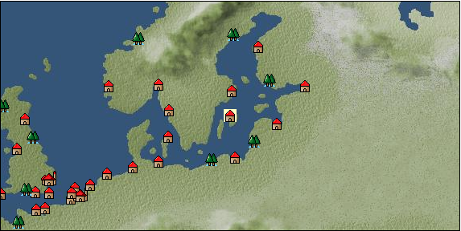

# Port: ヴィスビー

import Tabs from '@theme/Tabs';
import TabItem from '@theme/TabItem';

## General Information

| Attribute | Details |
| :--- | :--- |
| **Port Name** | Visby |
| **Port Type** | port of alliance |
| **Region** | northern europe |
| **Sea Area** | baltic sea |
| **Required Language** | Norse |
| **Coordinates** | （840，2104） |
| **Investment Reward** | [Lot (NO.1)](Items/Consumables/Consumables-Treasure-Chests/item_2800.md) （必要投資額：300,000ドゥカード） |

### Available Facilities

| guild | intermediary | exchange | tool shop | workshop craftsman | Painter | sculptor | peddler |
| --- | --- | --- | --- | --- | --- | --- | --- |
|   |   | ○ | ○ |   |   |   |   |
| Shipyard Master | Lumbermaker | Sail-maker | weapon craftsman | master | TavernFemale | archive | salesperson |
| --- | --- | --- | --- | --- | --- | --- | --- |
|   |   |   | ○ |   |   |   |   |
| Shipwright | 銀行 | street worker | 王宮 | Trading post | church | suburbs | translator |
| --- | --- | --- | --- | --- | --- | --- | --- |
| ○ | ○ | ○ |   |   |   |   |   |

### Description
A Hanseatic city on the island of Gotland in the Baltic Sea. Towards the end of the 13th century, it lost a political battle with Lübeck, which was competing for commercial supremacy in the Baltic Sea, and became a member of the Hanseatic Empire. Cultural area: Northern Europe

<Tabs>
  <TabItem value="trade_goods_sales" label="Trade Goods Sales">

| item | group | purchase price | 同盟時 | remarks |
| --- | --- | --- | --- | --- |
| [aquavit](Items/Trade Goods/TradeGoods-Alcohol/item_572.md) | [交易品（酒類）](Categories/category_9.md) | 565 | 504 |  |
| [arquebus gun](Items/Trade Goods/TradeGoods-Firearms/item_14.md) | [Trading Items (Firearms)](Categories/category_17.md) | 2,856 | (2,499) |  |
| 時代限定（17世紀第1期、17世紀第2期、18世紀第1期） ●17世紀第1期～第2期、18世紀第1期 |
| [sheep](Items/Trade Goods/TradeGoods-Livestock/item_253.md) | [Trading Goods (Livestock)](Categories/category_18.md) | 121 | 108 |  |
| [musket gun](Items/Trade Goods/TradeGoods-Firearms/item_584.md) | [Trading Items (Firearms)](Categories/category_17.md) | 4,231 | (3,702) |  |
| Period-limited (1st period of the 17th century, 2nd period of the 17th century, 1st period of the 18th century) ●1st to 2nd periods of the 17th century, 1st period of the 18th century. An Iberian specialty. |
| [log](Items/Trade Goods/TradeGoods-Wares/item_846.md) | [交易品（工業品）](Categories/category_19.md) | 173 | (152) |  |
| 要投資（必要投資額：500,000） EO第４章で追加 |
| [flax](Items/Trade Goods/TradeGoods-Fibers/item_64.md) | [交易品（繊維）](Categories/category_1.md) | 188 | 168 |  |
| [bullet](Items/Trade Goods/TradeGoods-Firearms/item_13.md) | [Trading Items (Firearms)](Categories/category_17.md) | 842 | (737) |  |
| 時代限定（17世紀第1期、17世紀第2期、18世紀第1期） ●17世紀第1期～第2期、18世紀第1期 |
| [wood](Items/Trade Goods/TradeGoods-Wares/item_277.md) | [交易品（工業品）](Categories/category_19.md) | 675 | 592 |  |
| [fur](Items/Trade Goods/TradeGoods-Fibers/item_634.md) | [交易品（繊維）](Categories/category_1.md) | 1,272 | 1,133 |  |
| [鋼](Items/Trade Goods/TradeGoods-Wares/item_573.md) | [交易品（工業品）](Categories/category_19.md) | 1,111 | (973) |  |
| 時代限定（17世紀第1期） ●17世紀第1期～第3期、18世紀第1期 |
  </TabItem>
  <TabItem value="sale_specialty" label="Sale (Specialty)">

| item | group | sale price | 同盟時 | remarks |
| --- | --- | --- | --- | --- |

#### [交易品（繊維）](Categories/category_1.md)

| [Basho](Items/Trade Goods/TradeGoods-Fibers/item_3862.md) | 交易品（繊維） | 25,254 | (28,413) |  |

#### [Trading goods (hobby goods)](Categories/category_10.md)

| [black tea](Items/Trade Goods/TradeGoods-Sunddries/item_675.md) | Trading goods (hobby goods) | 2,780 | (3,127) |  |

#### [Trading Goods (Spices)](Categories/category_11.md)

| [oakmoss](Items/Trade Goods/TradeGoods-Perfume/item_819.md) | Trading Goods (Spices) | [Edit Sale Price](Ports/port_106.md) |  |
| [geranium](Items/Trade Goods/TradeGoods-Perfume/item_145.md) | Trading Goods (Spices) | 1,300 | (1,462) |  |
| [sandalwood](Items/Trade Goods/TradeGoods-Perfume/item_771.md) | Trading Goods (Spices) | 4,820 | (5,423) |  |

#### [Trading Goods (Spices)](Categories/category_12.md)

| [nutmeg](Items/Trade Goods/TradeGoods-Spices/item_1969.md) | Trading Goods (Spices) | (8,326) | 9,715 |  |

#### [Trading goods (artificial goods)](Categories/category_13.md)

| [glasswork](Items/Trade Goods/TradeGoods-Luxuries/item_60.md) | Trading goods (artificial goods) | (1,570) | 1,831 |  |
| [Tumbaga](Items/Trade Goods/TradeGoods-Luxuries/item_3028.md) | Trading goods (artificial goods) | (21,004) | 24,508 |  |

#### [交易品（美術品）](Categories/category_14.md)

| [oil painting](Items/Trade Goods/TradeGoods-Art/item_1088.md) | 交易品（美術品） | (2,237) | 2,610 |  |

#### [Trading Items (Gemstones)](Categories/category_15.md)

| [aventurine](Items/Trade Goods/TradeGoods-Gems/item_678.md) | Trading Items (Gemstones) | 6,110 | 6,510 |  |
| [cat's eye](Items/Trade Goods/TradeGoods-Gems/item_1047.md) | Trading Items (Gemstones) | 10,500 | 11,200 |  |
| [sapphire](Items/Trade Goods/TradeGoods-Gems/item_676.md) | Trading Items (Gemstones) | 12,800 | 13,500 |  |
| [diamond](Items/Trade Goods/TradeGoods-Gems/item_449.md) | Trading Items (Gemstones) | 9,700 | (10,913) |  |

#### [Trading Items (Arms)](Categories/category_16.md)

| [crossbow](Items/Trade Goods/TradeGoods-Weapons/item_537.md) | Trading Items (Arms) | (1,286) | 1,500 |  |

#### [交易品（工業品）](Categories/category_19.md)

| [marble](Items/Trade Goods/TradeGoods-Wares/item_52.md) | 交易品（工業品） | (2,006) | 2,340 |  |
| [羊皮紙](Items/Trade Goods/TradeGoods-Wares/item_53.md) | 交易品（工業品） | 1,620 | 1,768 |  |

#### [交易品（織物）](Categories/category_20.md)

| [Awaiyo](Items/Trade Goods/TradeGoods-Fabrics/item_3002.md) | 交易品（織物） | (10,199) | 11,900 |  |
| [damask](Items/Trade Goods/TradeGoods-Fabrics/item_614.md) | 交易品（織物） | (5,631) | 6,570 |  |
| [turkish rug](Items/Trade Goods/TradeGoods-Fabrics/item_686.md) | 交易品（織物） | (7,678) | 8,958 |  |
| [flannel](Items/Trade Goods/TradeGoods-Fabrics/item_149.md) | 交易品（織物） | (1,132) | 1,320 |  |
| [velvet](Items/Trade Goods/TradeGoods-Fabrics/item_902.md) | 交易品（織物） | (4,387) | 5,119 |  |
  </TabItem>
  <TabItem value="sale_no_specialty" label="Sale (No Specialty)">

| item | group | sale price | 同盟時 | remarks |
| --- | --- | --- | --- | --- |

#### [交易品（繊維）](Categories/category_1.md)

| [flax](Items/Trade Goods/TradeGoods-Fibers/item_64.md) | 交易品（繊維） | (72) | 84 |  |
| [raw silk](Items/Trade Goods/TradeGoods-Fibers/item_677.md) | 交易品（繊維） | 2,257 | (2,539) |  |
| [wool](Items/Trade Goods/TradeGoods-Fibers/item_5.md) | 交易品（繊維） | (422) | 492 |  |

#### [Trading items (food items)](Categories/category_3.md)

| [duck meat](Items/Trade Goods/TradeGoods-Foodstuffs/item_32.md) | Trading items (food items) | (402) | 469 |  |
| [turnip](Items/Trade Goods/TradeGoods-Foodstuffs/item_55.md) | Trading items (food items) | (89) | 103 |  |
| [Oat](Items/Trade Goods/TradeGoods-Foodstuffs/item_275.md) | Trading items (food items) | (73) | 85 |  |
| [sausage](Items/Trade Goods/TradeGoods-Foodstuffs/item_27.md) | Trading items (food items) | 354 | 399 |  |
| [rye](Items/Trade Goods/TradeGoods-Foodstuffs/item_61.md) | Trading items (food items) | 37 | (41) |  |
| [mutton](Items/Trade Goods/TradeGoods-Foodstuffs/item_33.md) | Trading items (food items) | 484 | 544 |  |

#### [交易品（調味料）](Categories/category_4.md)

| [salt](Items/Trade Goods/TradeGoods-Seasonings/item_42.md) | 交易品（調味料） | 267 | 275 |  |

#### [Trading products (medical products)](Categories/category_6.md)

| [heath](Items/Trade Goods/TradeGoods-Medicine/item_63.md) | Trading products (medical products) | 225 | (253) |  |
| ▲Special products from the same cultural area |
| [Maca](Items/Trade Goods/TradeGoods-Medicine/item_3000.md) | Trading products (medical products) | (1,910) | 2,228 |  |

#### [Trading products (precious metals)](Categories/category_8.md)

| [gold](Items/Trade Goods/TradeGoods-Metals/item_659.md) | Trading products (precious metals) | (9,088) | 10,604 |  |
| [silver](Items/Trade Goods/TradeGoods-Metals/item_136.md) | Trading products (precious metals) | 3,590 | (4,039) |  |

#### [交易品（酒類）](Categories/category_9.md)

| [whiskey](Items/Trade Goods/TradeGoods-Alcohol/item_1.md) | 交易品（酒類） | 713 | (802) |  |
| [vodka](Items/Trade Goods/TradeGoods-Alcohol/item_579.md) | 交易品（酒類） | (579) | 675 |  |
| [Beer](Items/Trade Goods/TradeGoods-Alcohol/item_2.md) | 交易品（酒類） | 320 | 327 |  |
| [rum](Items/Trade Goods/TradeGoods-Alcohol/item_139.md) | 交易品（酒類） | 752 | (846) |  |

#### [Trading Goods (Spices)](Categories/category_12.md)

| [mint](Items/Trade Goods/TradeGoods-Spices/item_816.md) | Trading Goods (Spices) | 204 | (229) |  |

#### [Trading goods (artificial goods)](Categories/category_13.md)

| [dragonfly ball](Items/Trade Goods/TradeGoods-Luxuries/item_294.md) | Trading goods (artificial goods) | 1,216 | (1,368) |  |
| [silversmith](Items/Trade Goods/TradeGoods-Luxuries/item_619.md) | Trading goods (artificial goods) | (2,717) | 3,170 |  |
| [ceramics](Items/Trade Goods/TradeGoods-Luxuries/item_152.md) | Trading goods (artificial goods) | 1,459 | 1,459 |  |
| [luxury furniture](Items/Trade Goods/TradeGoods-Luxuries/item_1048.md) | Trading goods (artificial goods) | (2,571) | 3,000 |  |

#### [交易品（美術品）](Categories/category_14.md)

| [古美術品](Items/Trade Goods/TradeGoods-Art/item_51.md) | 交易品（美術品） | (4,556) | 5,316 |  |

#### [Trading Items (Gemstones)](Categories/category_15.md)

| [coral](Items/Trade Goods/TradeGoods-Gems/item_141.md) | Trading Items (Gemstones) | 4,594 | (5,168) |  |
| [ivory](Items/Trade Goods/TradeGoods-Gems/item_699.md) | Trading Items (Gemstones) | 4,120 | 4,330 |  |

#### [Trading Items (Arms)](Categories/category_16.md)

| [scimitar](Items/Trade Goods/TradeGoods-Weapons/item_142.md) | Trading Items (Arms) | 1,045 | (1,175) |  |
| [western armor](Items/Trade Goods/TradeGoods-Weapons/item_6.md) | Trading Items (Arms) | 2,870 | (3,229) |  |
| ▲Special products from neighboring cultural areas |

#### [Trading Goods (Livestock)](Categories/category_18.md)

| [alpaca](Items/Trade Goods/TradeGoods-Livestock/item_2995.md) | Trading Goods (Livestock) | (1,232) | 1,437 |  |

#### [交易品（工業品）](Categories/category_19.md)

| [wood](Items/Trade Goods/TradeGoods-Wares/item_277.md) | 交易品（工業品） | (254) | 296 |  |
| [Stone](Items/Trade Goods/TradeGoods-Wares/item_276.md) | 交易品（工業品） | (588) | 686 |  |
| [oil](Items/Trade Goods/TradeGoods-Wares/item_613.md) | 交易品（工業品） | 671 | (754) |  |

#### [交易品（織物）](Categories/category_20.md)

| [satin](Items/Trade Goods/TradeGoods-Fabrics/item_996.md) | 交易品（織物） | 4,395 | (4,944) |  |
  </TabItem>
  <TabItem value="guild_&_others" label="Guild & Others">

| item | group | Sales price | Handling NPC | remarks |
| --- | --- | --- | --- | --- |
| There is no sales information for the item |
| --- |
  </TabItem>
  <TabItem value="toolman" label="Toolman">

| item | group | Sales price | Handling NPC | remarks |
| --- | --- | --- | --- | --- |

#### [recipe book](Categories/category_22.md)

| [Spear training/application](Items/Recipe Book/item_1141.md) | recipe book | 50,000 | tool shop owner |  |
| 要投資（必要投資額：120,000） |

#### [Equipment (belongings)](Categories/category_27.md)

| [snap lock shooting gun](Items/Equipment/Equipment-Weapon/item_267.md) | Equipment (belongings) | 8,000 | tool shop owner |  |

#### [Consumables (land battle/deck battle)](Categories/category_29.md)

| [poison](Items/Consumables/Consumables-Landbattle/item_269.md) | Consumables (land battle/deck battle) | 250 | tool shop owner |  |
| [antidote](Items/Consumables/Consumables-Landbattle/item_270.md) | Consumables (land battle/deck battle) | 100 | tool shop owner |  |

#### [Consumables (skill activation)](Categories/category_31.md)

| [fishing gear](Items/Consumables/Consumables-Skill/item_79.md) | Consumables (skill activation) | 2,500 | tool shop owner |  |
  </TabItem>
</Tabs>