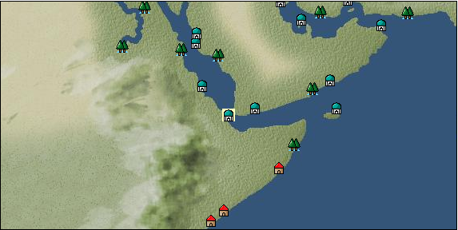

# Port: Sayla

import Tabs from '@theme/Tabs';
import TabItem from '@theme/TabItem';

## General Information

| Attribute | Details |
| :--- | :--- |
| **Port Name** | Sayla |
| **Port Type** | port of alliance |
| **Region** | Eastern Africa/India |
| **Sea Area** | 紅海 |
| **Required Language** | arabic |
| **Coordinates** | （1935，4310） |
| **Investment Reward** | [Lot (NO.6)](docs/Items/Consumables/Consumables-Treasure-Chests/item_2794.md) （必要投資額：500,000ドゥカード） |

### Available Facilities

| guild | intermediary | exchange | tool shop | workshop craftsman | Painter | sculptor | peddler |
| --- | --- | --- | --- | --- | --- | --- | --- |
|   |   | ○ | ○ |   |   |   |   |
| Shipyard Master | Lumbermaker | Sail-maker | weapon craftsman | master | TavernFemale | archive | salesperson |
| --- | --- | --- | --- | --- | --- | --- | --- |
|   |   |   |   | ○ |   |   |   |
| Shipwright | 銀行 | street worker | 王宮 | Trading post | church | suburbs | translator |
| --- | --- | --- | --- | --- | --- | --- | --- |
| ○ | ○ | ○ |   |   |   |   |   |

### Description
A port city on the northeastern side of Africa, on the opposite coast of the Arabian Peninsula. It is located on the way from the Gulf of Aden to the Red Sea. Cultural area: Arab

<Tabs>
  <TabItem value="trade_goods_sales" label="Trade Goods Sales">

| Item | Group | Purchase Price | Allied Price | Remarks |
| --- | --- | --- | --- | --- |
| [coffee](docs/Items/TradeGoods/TradeGoods-Sunddries/item_445.md) | [Trading goods (hobby goods)](docs/Categories/category_10.md) | 429 | (376) |  |
| [civet](docs/Items/TradeGoods/TradeGoods-Perfume/item_808.md) | [Trading Goods (Spices)](docs/Categories/category_11.md) | 2,847 | (2,491) |  |
| [scimitar](docs/Items/TradeGoods/TradeGoods-Weapons/item_142.md) | [Trading Items (Arms)](docs/Categories/category_16.md) | 781 | (684) |  |
| 要投資（必要投資額：600,000） |
| [oil](docs/Items/TradeGoods/TradeGoods-Wares/item_613.md) | [交易品（工業品）](docs/Categories/category_19.md) | 462 | (405) |  |
| [gold](docs/Items/TradeGoods/TradeGoods-Metals/item_659.md) | [Trading products (precious metals)](docs/Categories/category_8.md) | 4,483 | (3,923) |  |
| 要投資（必要投資額：240,000） |
| [chicken meat](docs/Items/TradeGoods/TradeGoods-Foodstuffs/item_29.md) | [Trading items (food items)](docs/Categories/category_3.md) | 328 | 288 |  |
  </TabItem>
  <TabItem value="sale_specialty" label="Sale (Specialty)">

| Item | Group | sale price | Allied Price | Remarks |
| --- | --- | --- | --- | --- |

#### [交易品（繊維）](docs/Categories/category_1.md)

| [Basho](docs/Items/TradeGoods/TradeGoods-Fibers/item_3862.md) | 交易品（繊維） | (11,656) | 13,600 |  |

#### [Trading Goods (Dye)](docs/Categories/category_2.md)

| [Indian Akane](docs/Items/TradeGoods/TradeGoods-Dye/item_1037.md) | Trading Goods (Dye) | 699 | (786) |  |
| [Indian indigo](docs/Items/TradeGoods/TradeGoods-Dye/item_157.md) | Trading Goods (Dye) | 707 | (795) |  |
| [ward](docs/Items/TradeGoods/TradeGoods-Dye/item_57.md) | Trading Goods (Dye) | 1,874 | (2,108) |  |
| [Safflower](docs/Items/TradeGoods/TradeGoods-Dye/item_1059.md) | Trading Goods (Dye) | 900 | (1,012) |  |
| [Locao](docs/Items/TradeGoods/TradeGoods-Dye/item_3909.md) | Trading Goods (Dye) | (11,303) | 13,189 |  |

#### [Trading items (food items)](docs/Categories/category_3.md)

| [Chinese noodles](docs/Items/TradeGoods/TradeGoods-Foodstuffs/item_3906.md) | Trading items (food items) | (10,021) | 11,693 |  |

#### [交易品（調味料）](docs/Categories/category_4.md)

| [apple cider vinegar](docs/Items/TradeGoods/TradeGoods-Seasonings/item_882.md) | 交易品（調味料） | 770 | (866) |  |
| [羅漢果](docs/Items/TradeGoods/TradeGoods-Seasonings/item_4004.md) | 交易品（調味料） | (3,158) | 3,684 |  |
| [Bean sauce](docs/Items/TradeGoods/TradeGoods-Seasonings/item_3875.md) | 交易品（調味料） | (11,305) | 13,191 |  |

#### [交易品（雑貨）](docs/Categories/category_5.md)

| [chinese books](docs/Items/TradeGoods/TradeGoods-Misc/item_3927.md) | 交易品（雑貨） | (11,670) | 13,617 |  |
| [old ink stick](docs/Items/TradeGoods/TradeGoods-Misc/item_3921.md) | 交易品（雑貨） | (3,060) | 3,570 |  |

#### [Trading products (medical products)](docs/Categories/category_6.md)

| [Saikaku](docs/Items/TradeGoods/TradeGoods-Medicine/item_1959.md) | Trading products (medical products) | (2,966) | 3,460 |  |
| [Cordyceps sinensis](docs/Items/TradeGoods/TradeGoods-Medicine/item_3839.md) | Trading products (medical products) | (12,110) | 14,130 |  |
| [Nothing](docs/Items/TradeGoods/TradeGoods-Medicine/item_1053.md) | Trading products (medical products) | 1,070 | (1,203) |  |

#### [Trading Items (Iron Stone)](docs/Categories/category_7.md)

| [red copper ore](docs/Items/TradeGoods/TradeGoods-Minerals/item_3863.md) | Trading Items (Iron Stone) | (12,019) | 14,024 |  |

#### [Trading products (precious metals)](docs/Categories/category_8.md)

| [雲南銀](docs/Items/TradeGoods/TradeGoods-Metals/item_3905.md) | Trading products (precious metals) | (13,214) | 15,418 |  |

#### [Trading goods (hobby goods)](docs/Categories/category_10.md)

| [prune](docs/Items/TradeGoods/TradeGoods-Sunddries/item_523.md) | Trading goods (hobby goods) | 712 | (801) |  |
| [Chinese tea](docs/Items/TradeGoods/TradeGoods-Sunddries/item_3907.md) | Trading goods (hobby goods) | (10,713) | 12,500 |  |
| [dried figs](docs/Items/TradeGoods/TradeGoods-Sunddries/item_611.md) | Trading goods (hobby goods) | 671 | (754) |  |
| [dried apple](docs/Items/TradeGoods/TradeGoods-Sunddries/item_19.md) | Trading goods (hobby goods) | 571 | (642) |  |
| [black tea](docs/Items/TradeGoods/TradeGoods-Sunddries/item_675.md) | Trading goods (hobby goods) | 823 | (925) |  |

#### [Trading Goods (Spices)](docs/Categories/category_11.md)

| [oakmoss](docs/Items/TradeGoods/TradeGoods-Perfume/item_819.md) | Trading Goods (Spices) | 1,183 | (1,331) |  |
| [Osmanthus](docs/Items/TradeGoods/TradeGoods-Perfume/item_3925.md) | Trading Goods (Spices) | (11,609) | 13,545 |  |
| [jasmine](docs/Items/TradeGoods/TradeGoods-Perfume/item_772.md) | Trading Goods (Spices) | 3,817 | (4,294) |  |
| [daffodil](docs/Items/TradeGoods/TradeGoods-Perfume/item_612.md) | Trading Goods (Spices) | 1,320 | (1,485) |  |
| [lily of the valley](docs/Items/TradeGoods/TradeGoods-Perfume/item_358.md) | Trading Goods (Spices) | 2,050 | (2,306) |  |
| [geranium](docs/Items/TradeGoods/TradeGoods-Perfume/item_145.md) | Trading Goods (Spices) | 1,250 | (1,406) |  |
| [patchouli](docs/Items/TradeGoods/TradeGoods-Perfume/item_1963.md) | Trading Goods (Spices) | (1,463) | 1,707 |  |
| [lira](docs/Items/TradeGoods/TradeGoods-Perfume/item_30.md) | Trading Goods (Spices) | 1,640 | (1,845) |  |
| [sandalwood](docs/Items/TradeGoods/TradeGoods-Perfume/item_771.md) | Trading Goods (Spices) | 2,740 | (3,082) |  |

#### [Trading Goods (Spices)](docs/Categories/category_12.md)

| [cloves](docs/Items/TradeGoods/TradeGoods-Spices/item_1092.md) | Trading Goods (Spices) | (1,212) | 1,414 |  |
| [Kouzuku](docs/Items/TradeGoods/TradeGoods-Spices/item_3690.md) | Trading Goods (Spices) | (10,321) | 12,043 |  |
| [pepper](docs/Items/TradeGoods/TradeGoods-Spices/item_58.md) | Trading Goods (Spices) | 439 | (493) |  |
| [star anise](docs/Items/TradeGoods/TradeGoods-Spices/item_3908.md) | Trading Goods (Spices) | (13,227) | 15,434 |  |
| [nutmeg](docs/Items/TradeGoods/TradeGoods-Spices/item_1969.md) | Trading Goods (Spices) | (1,318) | 1,537 |  |
| [mace](docs/Items/TradeGoods/TradeGoods-Spices/item_2100.md) | Trading Goods (Spices) | (1,479) | 1,725 |  |
| [lemongrass](docs/Items/TradeGoods/TradeGoods-Spices/item_2096.md) | Trading Goods (Spices) | (1,436) | 1,675 |  |

#### [Trading goods (artificial goods)](docs/Categories/category_13.md)

| [glasswork](docs/Items/TradeGoods/TradeGoods-Luxuries/item_60.md) | Trading goods (artificial goods) | 2,260 | (2,542) |  |
| [Kuresute](docs/Items/TradeGoods/TradeGoods-Luxuries/item_3897.md) | Trading goods (artificial goods) | (3,232) | 3,771 |  |
| [Song Baici](docs/Items/TradeGoods/TradeGoods-Luxuries/item_3904.md) | Trading goods (artificial goods) | (11,772) | 13,736 |  |
| [湖筆](docs/Items/TradeGoods/TradeGoods-Luxuries/item_3898.md) | Trading goods (artificial goods) | (3,267) | 3,811 |  |

#### [交易品（美術品）](docs/Categories/category_14.md)

| [chinese calligraphy](docs/Items/TradeGoods/TradeGoods-Art/item_3926.md) | 交易品（美術品） | (11,903) | 13,888 |  |

#### [Trading Items (Gemstones)](docs/Categories/category_15.md)

| [aventurine](docs/Items/TradeGoods/TradeGoods-Gems/item_678.md) | Trading Items (Gemstones) | 2,090 | (2,351) |  |
| [sapphire](docs/Items/TradeGoods/TradeGoods-Gems/item_676.md) | Trading Items (Gemstones) | 4,560 | (5,130) |  |
| [diamond](docs/Items/TradeGoods/TradeGoods-Gems/item_449.md) | Trading Items (Gemstones) | 4,550 | (5,119) |  |
| [pink diamond](docs/Items/TradeGoods/TradeGoods-Gems/item_2874.md) | Trading Items (Gemstones) | (6,068) | 7,080 |  |
| [ruby](docs/Items/TradeGoods/TradeGoods-Gems/item_773.md) | Trading Items (Gemstones) | 4,634 | (5,213) |  |
| [mutton fat white jade](docs/Items/TradeGoods/TradeGoods-Gems/item_3903.md) | Trading Items (Gemstones) | (12,243) | 14,285 |  |

#### [Trading Items (Arms)](docs/Categories/category_16.md)

| [crossbow](docs/Items/TradeGoods/TradeGoods-Weapons/item_537.md) | Trading Items (Arms) | 1,600 | (1,800) |  |
| [Blue dragon sword](docs/Items/TradeGoods/TradeGoods-Weapons/item_3923.md) | Trading Items (Arms) | (11,633) | 13,573 |  |

#### [Trading Items (Firearms)](docs/Categories/category_17.md)

| [musket gun](docs/Items/TradeGoods/TradeGoods-Firearms/item_584.md) | Trading Items (Firearms) | 5,072 | (5,706) |  |
| [monocular gun](docs/Items/TradeGoods/TradeGoods-Firearms/item_3916.md) | Trading Items (Firearms) | (11,753) | 13,714 |  |

#### [Trading Goods (Livestock)](docs/Categories/category_18.md)

| [donkey](docs/Items/TradeGoods/TradeGoods-Livestock/item_3924.md) | Trading Goods (Livestock) | (3,920) | 4,573 |  |

#### [交易品（工業品）](docs/Categories/category_19.md)

| [bamboo](docs/Items/TradeGoods/TradeGoods-Wares/item_3899.md) | 交易品（工業品） | (10,641) | 12,416 |  |

#### [交易品（織物）](docs/Categories/category_20.md)

| [indian chintz](docs/Items/TradeGoods/TradeGoods-Fabrics/item_159.md) | 交易品（織物） | 1,120 | (1,260) |  |
| [dutch calico](docs/Items/TradeGoods/TradeGoods-Fabrics/item_1435.md) | 交易品（織物） | 2,220 | (2,497) |  |
| [唐錦](docs/Items/TradeGoods/TradeGoods-Fabrics/item_3896.md) | 交易品（織物） | (13,343) | 15,569 |  |
| [麻織物](docs/Items/TradeGoods/TradeGoods-Fabrics/item_3673.md) | 交易品（織物） | (11,364) | 13,260 |  |
  </TabItem>
  <TabItem value="sale_no_specialty" label="Sale (No Specialty)">

| Item | Group | sale price | Allied Price | Remarks |
| --- | --- | --- | --- | --- |

#### [交易品（繊維）](docs/Categories/category_1.md)

| [leather](docs/Items/TradeGoods/TradeGoods-Fibers/item_44.md) | 交易品（繊維） | 530 | (596) |  |
| [cotton](docs/Items/TradeGoods/TradeGoods-Fibers/item_610.md) | 交易品（繊維） | 351 | (394) |  |

#### [Trading items (food items)](docs/Categories/category_3.md)

| [魚肉](docs/Items/TradeGoods/TradeGoods-Foodstuffs/item_10.md) | Trading items (food items) | 177 | (199) |  |

#### [交易品（調味料）](docs/Categories/category_4.md)

| [tamarind](docs/Items/TradeGoods/TradeGoods-Seasonings/item_1968.md) | 交易品（調味料） | 1,080 | (1,215) |  |

#### [Trading products (medical products)](docs/Categories/category_6.md)

| [chamomile](docs/Items/TradeGoods/TradeGoods-Medicine/item_292.md) | Trading products (medical products) | 731 | (822) |  |

#### [Trading Goods (Spices)](docs/Categories/category_11.md)

| [ylang ylang](docs/Items/TradeGoods/TradeGoods-Perfume/item_1434.md) | Trading Goods (Spices) | 917 | (1,031) |  |
| [civet](docs/Items/TradeGoods/TradeGoods-Perfume/item_808.md) | Trading Goods (Spices) | (1,072) | 1,250 |  |
| [mastic](docs/Items/TradeGoods/TradeGoods-Perfume/item_680.md) | Trading Goods (Spices) | 1,728 | (1,944) |  |
| [Ryushu incense](docs/Items/TradeGoods/TradeGoods-Perfume/item_101.md) | Trading Goods (Spices) | (2,433) | 2,838 |  |
| [Musk](docs/Items/TradeGoods/TradeGoods-Perfume/item_158.md) | Trading Goods (Spices) | 3,682 | (4,142) |  |

#### [Trading Goods (Spices)](docs/Categories/category_12.md)

| [cinnamon](docs/Items/TradeGoods/TradeGoods-Spices/item_1432.md) | Trading Goods (Spices) | 668 | (751) |  |

#### [Trading goods (artificial goods)](docs/Categories/category_13.md)

| [goldsmith](docs/Items/TradeGoods/TradeGoods-Luxuries/item_687.md) | Trading goods (artificial goods) | 5,340 | (6,008) |  |
| [silversmith](docs/Items/TradeGoods/TradeGoods-Luxuries/item_619.md) | Trading goods (artificial goods) | 5,260 | (5,918) |  |

#### [交易品（美術品）](docs/Categories/category_14.md)

| [古美術品](docs/Items/TradeGoods/TradeGoods-Art/item_51.md) | 交易品（美術品） | 4,030 | (4,534) |  |

#### [Trading Items (Gemstones)](docs/Categories/category_15.md)

| [emerald](docs/Items/TradeGoods/TradeGoods-Gems/item_777.md) | Trading Items (Gemstones) | 3,807 | (4,283) |  |
| [cat's eye](docs/Items/TradeGoods/TradeGoods-Gems/item_1047.md) | Trading Items (Gemstones) | 3,370 | (3,791) |  |
| [turquoise](docs/Items/TradeGoods/TradeGoods-Gems/item_1006.md) | Trading Items (Gemstones) | 1,369 | (1,540) |  |
| [lapis lazuli](docs/Items/TradeGoods/TradeGoods-Gems/item_995.md) | Trading Items (Gemstones) | 2,664 | (2,997) |  |
| [ivory](docs/Items/TradeGoods/TradeGoods-Gems/item_699.md) | Trading Items (Gemstones) | 2,130 | (2,396) |  |

#### [Trading Items (Firearms)](docs/Categories/category_17.md)

| [arquebus gun](docs/Items/TradeGoods/TradeGoods-Firearms/item_14.md) | Trading Items (Firearms) | 2,481 | (2,791) |  |
| [大砲](docs/Items/TradeGoods/TradeGoods-Firearms/item_4.md) | Trading Items (Firearms) | 4,830 | (5,434) |  |
| [bullet](docs/Items/TradeGoods/TradeGoods-Firearms/item_13.md) | Trading Items (Firearms) | 1,307 | (1,470) |  |

#### [交易品（工業品）](docs/Categories/category_19.md)

| [Stone](docs/Items/TradeGoods/TradeGoods-Wares/item_276.md) | 交易品（工業品） | 888 | (999) |  |

#### [交易品（織物）](docs/Categories/category_20.md)

| [persian rug](docs/Items/TradeGoods/TradeGoods-Fabrics/item_606.md) | 交易品（織物） | 4,541 | (5,109) |  |
  </TabItem>
  <TabItem value="guild_&_others" label="Guild & Others">

| Item | Group | Sales price | Handling NPC | Remarks |
| --- | --- | --- | --- | --- |
| There is no sales information for the Item |
| --- |
  </TabItem>
  <TabItem value="toolman" label="Toolman">

| Item | Group | Sales price | Handling NPC | Remarks |
| --- | --- | --- | --- | --- |

#### [Consumables (land battle/deck battle)](docs/Categories/category_29.md)

| [numbness medicine](docs/Items/Consumables/Consumables-Landbattle/item_452.md) | Consumables (land battle/deck battle) | 500 | tool shop owner |  |
| [strong adhesive oil](docs/Items/Consumables/Consumables-Landbattle/item_662.md) | Consumables (land battle/deck battle) | 200 | tool shop owner |  |
| [hellfire torch](docs/Items/Consumables/Consumables-Landbattle/item_233.md) | Consumables (land battle/deck battle) | 300 | tool shop owner |  |
| [explosive drug](docs/Items/Consumables/Consumables-Landbattle/item_558.md) | Consumables (land battle/deck battle) | 300 | tool shop owner |  |

#### [Consumables (request documents)](docs/Categories/category_45.md)

| [Art purchase order form](docs/Items/Consumables/Consumables-Documents/item_4915.md) | Consumables (request documents) | 30,000 | tool shop owner |  |
  </TabItem>
  <TabItem value="shipyard" label="Shipyard">

### Shipwright

| Item | Group | Sales price | Handling NPC | Remarks |
| --- | --- | --- | --- | --- |

#### [recipe book](docs/Categories/category_22.md)

| [特殊木製装材製造法](docs/Items/RecipeBooks/item_3571.md) | recipe book | Fixed recipe | Shipwright |  |
| 要投資（必要投資額：720,000） |

#### [shipbuilding materials](docs/Categories/category_47.md)

| [teak upholstery](docs/Items/ShipbuildingFS/item_3485.md) | shipbuilding materials | Fixed recipe | Shipwright |  |
| 要投資（必要投資額：720,000） |
| [mahogany upholstery](docs/Items/ShipbuildingFS/item_3543.md) | shipbuilding materials | Fixed recipe | Shipwright |  |
| 要投資（必要投資額：720,000） |
| [rosewood upholstery](docs/Items/ShipbuildingFS/item_3544.md) | shipbuilding materials | Fixed recipe | Shipwright |  |
| 要投資（必要投資額：720,000） |
  </TabItem>
</Tabs>