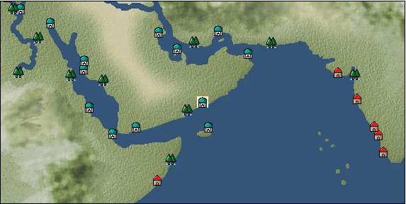

# Port: ジョファール

import Tabs from '@theme/Tabs';
import TabItem from '@theme/TabItem';

## General Information

| Attribute | Details |
| :--- | :--- |
| **Port Name** | Joffar |
| **Port Type** | port of alliance |
| **Region** | Eastern Africa/India |
| **Sea Area** | arabian sea |
| **Required Language** | arabic |
| **Coordinates** | （2444，4132） |
| **Investment Reward** | [Lot (NO.6)](Items/Consumables/Consumables-Treasure-Chests/item_2794.md) （必要投資額：500,000ドゥカード） |

### Available Facilities

| guild | intermediary | exchange | tool shop | workshop craftsman | Painter | sculptor | peddler |
| --- | --- | --- | --- | --- | --- | --- | --- |
|   |   | ○ | ○ |   |   |   |   |
| Shipyard Master | Lumbermaker | Sail-maker | weapon craftsman | master | TavernFemale | archive | salesperson |
| --- | --- | --- | --- | --- | --- | --- | --- |
|   |   |   |   | ○ |   |   |   |
| Shipwright | 銀行 | street worker | 王宮 | Trading post | church | suburbs | translator |
| --- | --- | --- | --- | --- | --- | --- | --- |
| ○ | ○ | ○ |   |   |   |   |   |

### Description
A port town located on the coast of the Arabian Sea. There is a lot of rain during the monsoon season. Cultural area: Arab

<Tabs>
  <TabItem value="trade_goods_sales" label="Trade Goods Sales">

| item | group | purchase price | 同盟時 | remarks |
| --- | --- | --- | --- | --- |
| [cow](Items/Trade Goods/TradeGoods-Livestock/item_17.md) | [Trading Goods (Livestock)](Categories/category_18.md) | 319 | (280) |  |
| [pistachio](Items/Trade Goods/TradeGoods-Sunddries/item_2353.md) | [Trading goods (hobby goods)](Categories/category_10.md) | 392 | (343) |  |
| 要投資（必要投資額：500,000） |
| [coconut fiber](Items/Trade Goods/TradeGoods-Fibers/item_444.md) | [交易品（繊維）](Categories/category_1.md) | 146 | (128) |  |
| [milk](Items/Trade Goods/TradeGoods-Foodstuffs/item_254.md) | [Trading items (food items)](Categories/category_3.md) | (169) | 148 |  |
| 要投資（必要投資額：660,000） |
| [mastic](Items/Trade Goods/TradeGoods-Perfume/item_680.md) | [Trading Goods (Spices)](Categories/category_11.md) | 1,495 | (1,308) |  |
| [Honey](Items/Trade Goods/TradeGoods-Seasonings/item_49.md) | [交易品（調味料）](Categories/category_4.md) | 876 | 768 |  |
| [copper ore](Items/Trade Goods/TradeGoods-Minerals/item_65.md) | [Trading Items (Iron Stone)](Categories/category_7.md) | 747 | (654) |  |
| 要投資（必要投資額：180,000） |
  </TabItem>
  <TabItem value="sale_specialty" label="Sale (Specialty)">

| item | group | sale price | 同盟時 | remarks |
| --- | --- | --- | --- | --- |

#### [Trading Goods (Dye)](Categories/category_2.md)

| [Indian Akane](Items/Trade Goods/TradeGoods-Dye/item_1037.md) | [Trading Goods (Dye)](Categories/category_2.md) | 699 | (786) |  |
| [Indian indigo](Items/Trade Goods/TradeGoods-Dye/item_157.md) | [Trading Goods (Dye)](Categories/category_2.md) | 707 | (795) |  |
| [ward](Items/Trade Goods/TradeGoods-Dye/item_57.md) | [Trading Goods (Dye)](Categories/category_2.md) | 1,874 | (2,108) |  |
| [Safflower](Items/Trade Goods/TradeGoods-Dye/item_1059.md) | [Trading Goods (Dye)](Categories/category_2.md) | 900 | (1,012) |  |

#### [交易品（調味料）](Categories/category_4.md)

| [apple cider vinegar](Items/Trade Goods/TradeGoods-Seasonings/item_882.md) | [交易品（調味料）](Categories/category_4.md) | 770 | (866) |  |

#### [Trading products (medical products)](Categories/category_6.md)

| [Nothing](Items/Trade Goods/TradeGoods-Medicine/item_1053.md) | [Trading products (medical products)](Categories/category_6.md) | 1,070 | (1,203) |  |

#### [Trading goods (hobby goods)](Categories/category_10.md)

| [tobacco](Items/Trade Goods/TradeGoods-Sunddries/item_109.md) | [Trading goods (hobby goods)](Categories/category_10.md) | (1,425) | 1,662 |  |
| 同盟時2010=121% |
| [prune](Items/Trade Goods/TradeGoods-Sunddries/item_523.md) | [Trading goods (hobby goods)](Categories/category_10.md) | 712 | (801) |  |
| [dried figs](Items/Trade Goods/TradeGoods-Sunddries/item_611.md) | [Trading goods (hobby goods)](Categories/category_10.md) | 671 | (754) |  |
| [dried apple](Items/Trade Goods/TradeGoods-Sunddries/item_19.md) | [Trading goods (hobby goods)](Categories/category_10.md) | (473) | 551 |  |
| 同盟時688=125% |
| [black tea](Items/Trade Goods/TradeGoods-Sunddries/item_675.md) | [Trading goods (hobby goods)](Categories/category_10.md) | 823 | (925) |  |

#### [Trading Goods (Spices)](Categories/category_11.md)

| [oakmoss](Items/Trade Goods/TradeGoods-Perfume/item_819.md) | [Trading Goods (Spices)](Categories/category_11.md) | 1,183 | (1,331) |  |
| [jasmine](Items/Trade Goods/TradeGoods-Perfume/item_772.md) | [Trading Goods (Spices)](Categories/category_11.md) | 3,817 | (4,294) |  |
| [daffodil](Items/Trade Goods/TradeGoods-Perfume/item_612.md) | [Trading Goods (Spices)](Categories/category_11.md) | 1,320 | (1,485) |  |
| [lily of the valley](Items/Trade Goods/TradeGoods-Perfume/item_358.md) | [Trading Goods (Spices)](Categories/category_11.md) | 2,050 | (2,306) |  |
| [geranium](Items/Trade Goods/TradeGoods-Perfume/item_145.md) | [Trading Goods (Spices)](Categories/category_11.md) | 1,250 | (1,406) |  |
| [lira](Items/Trade Goods/TradeGoods-Perfume/item_30.md) | [Trading Goods (Spices)](Categories/category_11.md) | 1,640 | (1,845) |  |
| [sandalwood](Items/Trade Goods/TradeGoods-Perfume/item_771.md) | [Trading Goods (Spices)](Categories/category_11.md) | 2,740 | (3,082) |  |

#### [Trading Goods (Spices)](Categories/category_12.md)

| [pepper](Items/Trade Goods/TradeGoods-Spices/item_58.md) | [Trading Goods (Spices)](Categories/category_12.md) | 439 | (493) |  |

#### [Trading goods (artificial goods)](Categories/category_13.md)

| [glasswork](Items/Trade Goods/TradeGoods-Luxuries/item_60.md) | [Trading goods (artificial goods)](Categories/category_13.md) | 2,260 | (2,542) |  |

#### [Trading Items (Gemstones)](Categories/category_15.md)

| [aventurine](Items/Trade Goods/TradeGoods-Gems/item_678.md) | [Trading Items (Gemstones)](Categories/category_15.md) | 2,090 | (2,351) |  |
| [sapphire](Items/Trade Goods/TradeGoods-Gems/item_676.md) | [Trading Items (Gemstones)](Categories/category_15.md) | 4,560 | (5,130) |  |
| [diamond](Items/Trade Goods/TradeGoods-Gems/item_449.md) | [Trading Items (Gemstones)](Categories/category_15.md) | 4,550 | (5,119) |  |
| [ruby](Items/Trade Goods/TradeGoods-Gems/item_773.md) | [Trading Items (Gemstones)](Categories/category_15.md) | 4,582 | (5,155) |  |

#### [Trading Items (Arms)](Categories/category_16.md)

| [crossbow](Items/Trade Goods/TradeGoods-Weapons/item_537.md) | [Trading Items (Arms)](Categories/category_16.md) | 1,600 | (1,800) |  |
| [damascus sword](Items/Trade Goods/TradeGoods-Weapons/item_903.md) | [Trading Items (Arms)](Categories/category_16.md) | (7,258) | 8,468 |  |
| 同盟時9230=109% |

#### [Trading Items (Firearms)](Categories/category_17.md)

| [musket gun](Items/Trade Goods/TradeGoods-Firearms/item_584.md) | [Trading Items (Firearms)](Categories/category_17.md) | 5,105 | (5,743) |  |

#### [交易品（織物）](Categories/category_20.md)

| [indian chintz](Items/Trade Goods/TradeGoods-Fabrics/item_159.md) | [交易品（織物）](Categories/category_20.md) | 1,120 | (1,260) |  |
| [dutch calico](Items/Trade Goods/TradeGoods-Fabrics/item_1435.md) | [交易品（織物）](Categories/category_20.md) | 2,220 | (2,497) |  |
| [turkish rug](Items/Trade Goods/TradeGoods-Fabrics/item_686.md) | [交易品（織物）](Categories/category_20.md) | [Edit Sale Price](Ports/port_109.md) |  |
| [flannel](Items/Trade Goods/TradeGoods-Fabrics/item_149.md) | [交易品（織物）](Categories/category_20.md) | (1,931) | 2,253 |  |
  </TabItem>
  <TabItem value="sale_no_specialty" label="Sale (No Specialty)">

| item | group | sale price | 同盟時 | remarks |
| --- | --- | --- | --- | --- |

#### [Trading items (food items)](Categories/category_3.md)

| [cheese](Items/Trade Goods/TradeGoods-Foodstuffs/item_20.md) | [Trading items (food items)](Categories/category_3.md) | (496) | 578 |  |
| [milk](Items/Trade Goods/TradeGoods-Foodstuffs/item_254.md) | [Trading items (food items)](Categories/category_3.md) | (127) | 148 |  |
| 要投資（必要投資額：660,000） |
| [beef](Items/Trade Goods/TradeGoods-Foodstuffs/item_26.md) | [Trading items (food items)](Categories/category_3.md) | (652) | 760 |  |
| [魚肉](Items/Trade Goods/TradeGoods-Foodstuffs/item_10.md) | [Trading items (food items)](Categories/category_3.md) | 178 | (200) |  |

#### [交易品（調味料）](Categories/category_4.md)

| [tamarind](Items/Trade Goods/TradeGoods-Seasonings/item_1968.md) | [交易品（調味料）](Categories/category_4.md) | 1,080 | (1,215) |  |
| [butter](Items/Trade Goods/TradeGoods-Seasonings/item_3.md) | [交易品（調味料）](Categories/category_4.md) | (404) | 471 |  |

#### [Trading products (medical products)](Categories/category_6.md)

| [chamomile](Items/Trade Goods/TradeGoods-Medicine/item_292.md) | [Trading products (medical products)](Categories/category_6.md) | 731 | (822) |  |

#### [Trading Items (Iron Stone)](Categories/category_7.md)

| [Saltpeter](Items/Trade Goods/TradeGoods-Minerals/item_884.md) | [Trading Items (Iron Stone)](Categories/category_7.md) | (1,736) | 2,025 |  |
| 同盟時1660=82% |

#### [Trading products (precious metals)](Categories/category_8.md)

| [platinum](Items/Trade Goods/TradeGoods-Metals/item_2178.md) | [Trading products (precious metals)](Categories/category_8.md) | 4,934 | (5,551) |  |
| [gold](Items/Trade Goods/TradeGoods-Metals/item_659.md) | [Trading products (precious metals)](Categories/category_8.md) | 4,909 | (5,523) |  |

#### [Trading goods (hobby goods)](Categories/category_10.md)

| [coffee](Items/Trade Goods/TradeGoods-Sunddries/item_445.md) | [Trading goods (hobby goods)](Categories/category_10.md) | (420) | 489 |  |
| [dried apricots](Items/Trade Goods/TradeGoods-Sunddries/item_8.md) | [Trading goods (hobby goods)](Categories/category_10.md) | (375) | 437 |  |

#### [Trading Goods (Spices)](Categories/category_11.md)

| [ylang ylang](Items/Trade Goods/TradeGoods-Perfume/item_1434.md) | [Trading Goods (Spices)](Categories/category_11.md) | 917 | (1,031) |  |
| [civet](Items/Trade Goods/TradeGoods-Perfume/item_808.md) | [Trading Goods (Spices)](Categories/category_11.md) | 2,860 | (3,217) |  |
| [貝甲香](Items/Trade Goods/TradeGoods-Perfume/item_776.md) | [Trading Goods (Spices)](Categories/category_11.md) | (1,047) | 1,221 |  |
| [Musk](Items/Trade Goods/TradeGoods-Perfume/item_158.md) | [Trading Goods (Spices)](Categories/category_11.md) | 3,839 | (4,319) |  |

#### [Trading Goods (Spices)](Categories/category_12.md)

| [cinnamon](Items/Trade Goods/TradeGoods-Spices/item_1432.md) | [Trading Goods (Spices)](Categories/category_12.md) | 668 | (751) |  |

#### [Trading goods (artificial goods)](Categories/category_13.md)

| [皮革製品](Items/Trade Goods/TradeGoods-Luxuries/item_12.md) | [Trading goods (artificial goods)](Categories/category_13.md) | (1,269) | 1,480 |  |
| [goldsmith](Items/Trade Goods/TradeGoods-Luxuries/item_687.md) | [Trading goods (artificial goods)](Categories/category_13.md) | 5,340 | (6,008) |  |
| [silversmith](Items/Trade Goods/TradeGoods-Luxuries/item_619.md) | [Trading goods (artificial goods)](Categories/category_13.md) | 5,260 | (5,918) |  |

#### [交易品（美術品）](Categories/category_14.md)

| [古美術品](Items/Trade Goods/TradeGoods-Art/item_51.md) | [交易品（美術品）](Categories/category_14.md) | 4,030 | (4,534) |  |

#### [Trading Items (Gemstones)](Categories/category_15.md)

| [emerald](Items/Trade Goods/TradeGoods-Gems/item_777.md) | [Trading Items (Gemstones)](Categories/category_15.md) | 3,807 | 3,812 |  |
| [cat's eye](Items/Trade Goods/TradeGoods-Gems/item_1047.md) | [Trading Items (Gemstones)](Categories/category_15.md) | 3,370 | (3,791) |  |
| [coral](Items/Trade Goods/TradeGoods-Gems/item_141.md) | [Trading Items (Gemstones)](Categories/category_15.md) | (3,171) | 3,699 |  |
| [turquoise](Items/Trade Goods/TradeGoods-Gems/item_1006.md) | [Trading Items (Gemstones)](Categories/category_15.md) | 1,369 | (1,540) |  |
| [lapis lazuli](Items/Trade Goods/TradeGoods-Gems/item_995.md) | [Trading Items (Gemstones)](Categories/category_15.md) | 2,664 | (2,997) |  |
| [malachite](Items/Trade Goods/TradeGoods-Gems/item_679.md) | [Trading Items (Gemstones)](Categories/category_15.md) | (1,672) | 1,950 |  |
| [ivory](Items/Trade Goods/TradeGoods-Gems/item_699.md) | [Trading Items (Gemstones)](Categories/category_15.md) | 2,160 | (2,430) |  |

#### [Trading Items (Firearms)](Categories/category_17.md)

| [arquebus gun](Items/Trade Goods/TradeGoods-Firearms/item_14.md) | [Trading Items (Firearms)](Categories/category_17.md) | 2,490 | (2,801) |  |
| [大砲](Items/Trade Goods/TradeGoods-Firearms/item_4.md) | [Trading Items (Firearms)](Categories/category_17.md) | 4,830 | (5,434) |  |
| [bullet](Items/Trade Goods/TradeGoods-Firearms/item_13.md) | [Trading Items (Firearms)](Categories/category_17.md) | 1,302 | (1,464) |  |
| [gunpowder](Items/Trade Goods/TradeGoods-Firearms/item_352.md) | [Trading Items (Firearms)](Categories/category_17.md) | (1,269) | 1,480 |  |
| 同盟時1450=98% |

#### [交易品（織物）](Categories/category_20.md)

| [tweed](Items/Trade Goods/TradeGoods-Fabrics/item_31.md) | [交易品（織物）](Categories/category_20.md) | (1,463) | 1,706 |  |
| [persian rug](Items/Trade Goods/TradeGoods-Fabrics/item_606.md) | [交易品（織物）](Categories/category_20.md) | 4,541 | (5,109) |  |
| [muslin](Items/Trade Goods/TradeGoods-Fabrics/item_581.md) | [交易品（織物）](Categories/category_20.md) | (1,178) | 1,374 |  |
| [cotton fabric](Items/Trade Goods/TradeGoods-Fabrics/item_571.md) | [交易品（織物）](Categories/category_20.md) | 809 | (910) |  |
  </TabItem>
  <TabItem value="guild_&_others" label="Guild & Others">

| item | group | Sales price | Handling NPC | remarks |
| --- | --- | --- | --- | --- |
| There is no sales information for the item |
| --- |
  </TabItem>
  <TabItem value="toolman" label="Toolman">

| item | group | Sales price | Handling NPC | remarks |
| --- | --- | --- | --- | --- |

#### [Consumables (land battle/deck battle)](Categories/category_29.md)

| [numbness medicine](Items/Consumables/Consumables-Landbattle/item_452.md) | [Consumables (land battle/deck battle)](Categories/category_29.md) | 500 | tool shop owner |  |
| [strong adhesive oil](Items/Consumables/Consumables-Landbattle/item_662.md) | [Consumables (land battle/deck battle)](Categories/category_29.md) | 200 | tool shop owner |  |
| [hellfire torch](Items/Consumables/Consumables-Landbattle/item_233.md) | [Consumables (land battle/deck battle)](Categories/category_29.md) | 300 | tool shop owner |  |
| [explosive drug](Items/Consumables/Consumables-Landbattle/item_558.md) | [Consumables (land battle/deck battle)](Categories/category_29.md) | 300 | tool shop owner |  |
  </TabItem>
</Tabs>