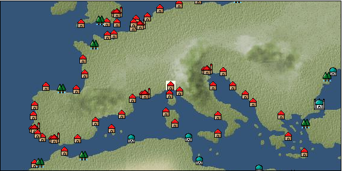

# Port: ジェノヴァ

import Tabs from '@theme/Tabs';
import TabItem from '@theme/TabItem';

## General Information

| Attribute | Details |
| :--- | :--- |
| **Port Name** | genoa |
| **Port Type** | Headquarters |
| **Region** | western europe |
| **Sea Area** | ligurian sea |
| **Required Language** | italian |
| **Coordinates** | （300，2918） |
| **Investment Reward** | [divine statue carving](docs/Items/RecipeBooks/item_1245.md) （必要投資額：840,000ドゥカード） |

### Available Facilities

| guild | intermediary | exchange | tool shop | workshop craftsman | Painter | sculptor | peddler |
| --- | --- | --- | --- | --- | --- | --- | --- |
| ○ | ○ | ○ | ○ | ○ |   | ○ | ○ |
| Shipyard Master | Lumbermaker | Sail-maker | weapon craftsman | master | TavernFemale | archive | salesperson |
| --- | --- | --- | --- | --- | --- | --- | --- |
| ○ |   |   | ○ | ○ | ○ | ○ | ○ |
| Shipwright | 銀行 | street worker | 王宮 | Trading post | church | suburbs | translator |
| --- | --- | --- | --- | --- | --- | --- | --- |
| ○ | ○ |   | ○ | ○ | ○ | ○ | ○ |

### Description
The city was founded in the ancient Roman era and flourished during the Crusades. There was once a fierce power struggle with Venice, but things have been going downhill in recent years. However, as befits a big city, they sell high-class products. Tavern woman: Beatrice Suburb: Northwest of Genoa Cultural area: Italy/Southern France

<Tabs>
  <TabItem value="trade_goods_sales" label="Trade Goods Sales">

| item | group | purchase price | 同盟時 | remarks |
| --- | --- | --- | --- | --- |
| [knit](docs/Items/TradeGoods/TradeGoods-Fabrics/item_164.md) | [交易品（織物）](docs/Categories/category_20.md) | 483 | 456 |  |
| [velvet](docs/Items/TradeGoods/TradeGoods-Fabrics/item_902.md) | [交易品（織物）](docs/Categories/category_20.md) | 3,082 | 2,900 |  |
| 要投資（必要投資額：180,000） |
| [lavender](docs/Items/TradeGoods/TradeGoods-Perfume/item_150.md) | [Trading Goods (Spices)](docs/Categories/category_11.md) | 771 | 676 |  |
| When in alliance: confirmed at 100% |
| [liqueur](docs/Items/TradeGoods/TradeGoods-Alcohol/item_18.md) | [交易品（酒類）](docs/Categories/category_9.md) | 505 | 476 |  |
| [古美術品](docs/Items/TradeGoods/TradeGoods-Art/item_51.md) | [交易品（美術品）](docs/Categories/category_14.md) | (3,749) | 3,280 |  |
| When in alliance: confirmed at 100% |
| [marble statue](docs/Items/TradeGoods/TradeGoods-Art/item_50.md) | [交易品（美術品）](docs/Categories/category_14.md) | (2,903) | 2,540 |  |
| 要投資（必要投資額：720,000） |
| [woolen fabric](docs/Items/TradeGoods/TradeGoods-Fabrics/item_163.md) | [交易品（織物）](docs/Categories/category_20.md) | 864 | 812 |  |
| [silver](docs/Items/TradeGoods/TradeGoods-Metals/item_136.md) | [Trading products (precious metals)](docs/Categories/category_8.md) | 3,292 | 2,510 |  |
| When in alliance: confirmed at 100% |
| [silversmith](docs/Items/TradeGoods/TradeGoods-Luxuries/item_619.md) | [Trading goods (artificial goods)](docs/Categories/category_13.md) | 3,058 | 2,680 |  |
| Investment required (Required investment amount: 240,000) At alliance: Confirmed at 100% |
| [luxury clothing](docs/Items/TradeGoods/TradeGoods-Luxuries/item_165.md) | [Trading goods (artificial goods)](docs/Categories/category_13.md) | 3,900 | 3,650 |  |
| When in alliance: confirmed at 100% |
  </TabItem>
  <TabItem value="sale_specialty" label="Sale (Specialty)">

| item | group | sale price | 同盟時 | remarks |
| --- | --- | --- | --- | --- |

#### [交易品（繊維）](docs/Categories/category_1.md)

| [Basho](docs/Items/TradeGoods/TradeGoods-Fibers/item_3862.md) | 交易品（繊維） | (36,423) | 42,500 |  |
| When in alliance: confirmed at 100% |
| [Panya](docs/Items/TradeGoods/TradeGoods-Fibers/item_2097.md) | 交易品（繊維） | (706) | 823 |  |
| When in alliance: confirmed at 100% |
| [flax](docs/Items/TradeGoods/TradeGoods-Fibers/item_64.md) | 交易品（繊維） | (275) | 320 |  |
| [feather](docs/Items/TradeGoods/TradeGoods-Fibers/item_585.md) | 交易品（繊維） | (774) | 903 |  |
| [tiger skin](docs/Items/TradeGoods/TradeGoods-Fibers/item_3790.md) | 交易品（繊維） | (30,938) | 36,100 |  |
| 98％＝49500　105％＝53000 |
| [Green ramie](docs/Items/TradeGoods/TradeGoods-Fibers/item_3428.md) | 交易品（繊維） | (32,652) | 38,100 |  |
| 98％＝37400　104％＝39600 |

#### [Trading Goods (Dye)](docs/Categories/category_2.md)

| [Indian Akane](docs/Items/TradeGoods/TradeGoods-Dye/item_1037.md) | Trading Goods (Dye) | (1,137) | 1,326 |  |
| [Indian indigo](docs/Items/TradeGoods/TradeGoods-Dye/item_157.md) | Trading Goods (Dye) | (1,110) | 1,295 |  |
| [cochineal](docs/Items/TradeGoods/TradeGoods-Dye/item_1817.md) | Trading Goods (Dye) | (1,466) | 1,710 |  |
| When in alliance: confirmed at 100% |
| [turmeric](docs/Items/TradeGoods/TradeGoods-Dye/item_1433.md) | Trading Goods (Dye) | (662) | 772 |  |
| When in alliance: confirmed at 100% |
| [Safflower](docs/Items/TradeGoods/TradeGoods-Dye/item_1059.md) | Trading Goods (Dye) | (564) | 657 |  |
| [mayan blue](docs/Items/TradeGoods/TradeGoods-Dye/item_1096.md) | Trading Goods (Dye) | (1,406) | 1,640 |  |
| [mangosteen](docs/Items/TradeGoods/TradeGoods-Dye/item_1973.md) | Trading Goods (Dye) | (1,912) | 2,230 |  |
| When in alliance: confirmed at 100% |
| [mimosa](docs/Items/TradeGoods/TradeGoods-Dye/item_2281.md) | Trading Goods (Dye) | (1,320) | 1,540 |  |
| 98％＝1520　102％＝1560 |
| [log wood](docs/Items/TradeGoods/TradeGoods-Dye/item_1813.md) | Trading Goods (Dye) | 1,500 | (1,687) |  |
| [gallnut](docs/Items/TradeGoods/TradeGoods-Dye/item_3429.md) | Trading Goods (Dye) | (35,052) | 40,900 |  |
| 98％＝40100　104％＝42500 |
| [purple root](docs/Items/TradeGoods/TradeGoods-Dye/item_3752.md) | Trading Goods (Dye) | (30,852) | 36,000 |  |
| 98％＝35300　103％＝37000 |

#### [Trading items (food items)](docs/Categories/category_3.md)

| [buckwheat](docs/Items/TradeGoods/TradeGoods-Foodstuffs/item_3430.md) | Trading items (food items) | (45,164) | 52,700 |  |
| When in alliance: confirmed at 100% |
| [Karasumi](docs/Items/TradeGoods/TradeGoods-Foodstuffs/item_3687.md) | Trading items (food items) | (31,424) | 36,667 |  |
| [kangaroo meat](docs/Items/TradeGoods/TradeGoods-Foodstuffs/item_2285.md) | Trading items (food items) | (803) | 936 |  |
| When in alliance: confirmed at 100% |
| [cactus](docs/Items/TradeGoods/TradeGoods-Foodstuffs/item_2740.md) | Trading items (food items) | 415 | (466) |  |
| [taro](docs/Items/TradeGoods/TradeGoods-Foodstuffs/item_1960.md) | Trading items (food items) | (235) | 274 |  |
| When in alliance: confirmed at 100% |
| [Chamtashima](docs/Items/TradeGoods/TradeGoods-Foodstuffs/item_3771.md) | Trading items (food items) | (1,423) | 1,660 |  |
| 98％＝1650　103％＝1680 |
| [楊州栗](docs/Items/TradeGoods/TradeGoods-Foodstuffs/item_3789.md) | Trading items (food items) | (9,256) | 10,800 |  |
| When in alliance: confirmed at 100% |

#### [交易品（調味料）](docs/Categories/category_4.md)

| [oyster sauce](docs/Items/TradeGoods/TradeGoods-Seasonings/item_3505.md) | 交易品（調味料） | (2,794) | 3,260 |  |
| When in alliance: confirmed at 100% |
| [Gochujang](docs/Items/TradeGoods/TradeGoods-Seasonings/item_3591.md) | 交易品（調味料） | (6,608) | 7,710 |  |
| 98％＝7580　104％＝7980 |
| [tamarind](docs/Items/TradeGoods/TradeGoods-Seasonings/item_1968.md) | 交易品（調味料） | 1,990 | 2,180 |  |
| 98％＝2140　104％＝2250 |
| [Choshi](docs/Items/TradeGoods/TradeGoods-Seasonings/item_3793.md) | 交易品（調味料） | (30,681) | 35,800 |  |
| 98％＝35100　103％＝36800 |
| [Nampula](docs/Items/TradeGoods/TradeGoods-Seasonings/item_1972.md) | 交易品（調味料） | (530) | 618 |  |
| [apple cider vinegar](docs/Items/TradeGoods/TradeGoods-Seasonings/item_882.md) | 交易品（調味料） | (428) | 499 |  |
| [miso](docs/Items/TradeGoods/TradeGoods-Seasonings/item_3420.md) | 交易品（調味料） | (3,643) | 4,250 |  |
| When in alliance: confirmed at 100% |
| [Sha Cha Ji](docs/Items/TradeGoods/TradeGoods-Seasonings/item_3689.md) | 交易品（調味料） | (44,089) | 51,445 |  |
| [Bean sauce](docs/Items/TradeGoods/TradeGoods-Seasonings/item_3875.md) | 交易品（調味料） | (34,023) | 39,700 |  |
| When in alliance: confirmed at 100% |

#### [交易品（雑貨）](docs/Categories/category_5.md)

| [old ink stick](docs/Items/TradeGoods/TradeGoods-Misc/item_3921.md) | 交易品（雑貨） | (9,513) | 11,100 |  |
| When in alliance: confirmed at 100% |
| [lantern](docs/Items/TradeGoods/TradeGoods-Misc/item_3683.md) | 交易品（雑貨） | 38,750 | 42,174 |  |
| [Korean books](docs/Items/TradeGoods/TradeGoods-Misc/item_3750.md) | 交易品（雑貨） | (31,024) | 36,200 |  |
| When in alliance: confirmed at 100% |
| [rattan work](docs/Items/TradeGoods/TradeGoods-Misc/item_3698.md) | 交易品（雑貨） | (30,767) | 35,900 |  |
| When in alliance: confirmed at 100% |

#### [Trading products (medical products)](docs/Categories/category_6.md)

| [Saikaku](docs/Items/TradeGoods/TradeGoods-Medicine/item_1959.md) | Trading products (medical products) | 5,032 | (5,661) |  |
| [tea tree](docs/Items/TradeGoods/TradeGoods-Medicine/item_2283.md) | Trading products (medical products) | (1,277) | 1,490 |  |
| When in alliance: confirmed at 100% |
| [Noni](docs/Items/TradeGoods/TradeGoods-Medicine/item_2099.md) | Trading products (medical products) | (1,200) | 1,400 |  |
| When in alliance: confirmed at 100% |
| [heath](docs/Items/TradeGoods/TradeGoods-Medicine/item_63.md) | Trading products (medical products) | (366) | 426 |  |
| 98％＝418　102％＝433 |
| [Borei](docs/Items/TradeGoods/TradeGoods-Medicine/item_3678.md) | Trading products (medical products) | (44,611) | 52,054 |  |
| [Korean ginseng](docs/Items/TradeGoods/TradeGoods-Medicine/item_3738.md) | Trading products (medical products) | (30,681) | 35,800 |  |
| 98％＝35100　106％＝37900 |
| [Nothing](docs/Items/TradeGoods/TradeGoods-Medicine/item_1053.md) | Trading products (medical products) | 719 | 765 |  |
| [calamus](docs/Items/TradeGoods/TradeGoods-Medicine/item_3427.md) | Trading products (medical products) | (33,938) | 39,600 |  |
| When in alliance: confirmed at 100% |

#### [Trading Items (Iron Stone)](docs/Categories/category_7.md)

| [white porcelain ore](docs/Items/TradeGoods/TradeGoods-Minerals/item_3433.md) | Trading Items (Iron Stone) | (34,880) | 40,700 |  |
| 98％＝39900　103％＝41800 |
| [medical stone](docs/Items/TradeGoods/TradeGoods-Minerals/item_3786.md) | Trading Items (Iron Stone) | (31,110) | 36,300 |  |
| When in alliance: confirmed at 100% |

#### [Trading products (precious metals)](docs/Categories/category_8.md)

| [platinum](docs/Items/TradeGoods/TradeGoods-Metals/item_2178.md) | Trading products (precious metals) | (6,514) | 7,600 |  |
| [佐摩銀](docs/Items/TradeGoods/TradeGoods-Metals/item_3432.md) | Trading products (precious metals) | (36,680) | 42,800 |  |
| When in alliance: confirmed at 100% |
| [Korean silver](docs/Items/TradeGoods/TradeGoods-Metals/item_3796.md) | Trading products (precious metals) | (31,281) | 36,500 |  |
| When in alliance: confirmed at 100% |

#### [交易品（酒類）](docs/Categories/category_9.md)

| [aquavit](docs/Items/TradeGoods/TradeGoods-Alcohol/item_572.md) | 交易品（酒類） | 831 | 910 |  |
| [whiskey](docs/Items/TradeGoods/TradeGoods-Alcohol/item_1.md) | 交易品（酒類） | (823) | 960 |  |
| [gin](docs/Items/TradeGoods/TradeGoods-Alcohol/item_291.md) | 交易品（酒類） | 842 | 894 |  |
| [tequila](docs/Items/TradeGoods/TradeGoods-Alcohol/item_108.md) | 交易品（酒類） | (1,972) | 2,300 |  |
| [fruit brandy](docs/Items/TradeGoods/TradeGoods-Alcohol/item_1440.md) | 交易品（酒類） | (667) | 778 |  |
| When in alliance: confirmed at 100% |
| [Andong soju](docs/Items/TradeGoods/TradeGoods-Alcohol/item_3757.md) | 交易品（酒類） | (31,024) | 36,200 |  |
| When in alliance: confirmed at 100% |
| [Sake](docs/Items/TradeGoods/TradeGoods-Alcohol/item_3424.md) | 交易品（酒類） | (34,623) | 40,400 |  |
| When in alliance: confirmed at 100% |

#### [Trading goods (hobby goods)](docs/Categories/category_10.md)

| [cacao](docs/Items/TradeGoods/TradeGoods-Sunddries/item_140.md) | Trading goods (hobby goods) | (1,286) | 1,500 |  |
| [cashew nuts](docs/Items/TradeGoods/TradeGoods-Sunddries/item_2120.md) | Trading goods (hobby goods) | (866) | 1,010 |  |
| When in alliance: confirmed at 100% |
| [caviar](docs/Items/TradeGoods/TradeGoods-Sunddries/item_2122.md) | Trading goods (hobby goods) | (1,149) | 1,340 |  |
| When in alliance: confirmed at 100% |
| [cranberry](docs/Items/TradeGoods/TradeGoods-Sunddries/item_4008.md) | Trading goods (hobby goods) | (998) | 1,164 |  |
| 104％＝1210 |
| [tobacco](docs/Items/TradeGoods/TradeGoods-Sunddries/item_109.md) | Trading goods (hobby goods) | 4,941 | 1,490 |  |
| When in alliance: confirmed at 100% |
| [durian](docs/Items/TradeGoods/TradeGoods-Sunddries/item_1949.md) | Trading goods (hobby goods) | (1,560) | 1,820 |  |
| When in alliance: confirmed at 100% |
| [pineapple](docs/Items/TradeGoods/TradeGoods-Sunddries/item_867.md) | Trading goods (hobby goods) | (1,834) | 2,140 |  |
| When in alliance: confirmed at 100% |
| [pistachio](docs/Items/TradeGoods/TradeGoods-Sunddries/item_2353.md) | Trading goods (hobby goods) | (801) | 934 |  |
| When in alliance: confirmed at 100% |
| [peanuts](docs/Items/TradeGoods/TradeGoods-Sunddries/item_134.md) | Trading goods (hobby goods) | (395) | 460 |  |
| When in alliance: confirmed at 100% |
| [macadamia nuts](docs/Items/TradeGoods/TradeGoods-Sunddries/item_2282.md) | Trading goods (hobby goods) | (1,029) | 1,200 |  |
| When in alliance: confirmed at 100% |
| [lemon myrtle](docs/Items/TradeGoods/TradeGoods-Sunddries/item_2840.md) | Trading goods (hobby goods) | (1,963) | 2,290 |  |
| When in alliance: confirmed at 100% |
| [Chinese tea](docs/Items/TradeGoods/TradeGoods-Sunddries/item_3907.md) | Trading goods (hobby goods) | (33,595) | 39,200 |  |
| When in alliance: confirmed at 100% |
| [dried apple](docs/Items/TradeGoods/TradeGoods-Sunddries/item_19.md) | Trading goods (hobby goods) | (369) | 430 |  |
| When in alliance: confirmed at 100% |
| [Korean tea](docs/Items/TradeGoods/TradeGoods-Sunddries/item_3751.md) | Trading goods (hobby goods) | (30,852) | 36,000 |  |
| When in alliance: confirmed at 100% |
| [black tea](docs/Items/TradeGoods/TradeGoods-Sunddries/item_675.md) | Trading goods (hobby goods) | (2,212) | 2,580 |  |
| 98%＝2540 |
| [金針花](docs/Items/TradeGoods/TradeGoods-Sunddries/item_3739.md) | Trading goods (hobby goods) | (9,342) | 10,900 |  |
| When in alliance: confirmed at 100% |

#### [Trading Goods (Spices)](docs/Categories/category_11.md)

| [gardenia](docs/Items/TradeGoods/TradeGoods-Perfume/item_1091.md) | Trading Goods (Spices) | (23,475) | 27,392 |  |
| [jasmine](docs/Items/TradeGoods/TradeGoods-Perfume/item_772.md) | Trading Goods (Spices) | (5,597) | 6,530 |  |
| 98%＝6460 |
| [daffodil](docs/Items/TradeGoods/TradeGoods-Perfume/item_612.md) | Trading Goods (Spices) | 831 | 945 |  |
| ●Special products of the Near East |
| [lily of the valley](docs/Items/TradeGoods/TradeGoods-Perfume/item_358.md) | Trading Goods (Spices) | 1,386 | 1,554 |  |
| ●German specialties |
| [geranium](docs/Items/TradeGoods/TradeGoods-Perfume/item_145.md) | Trading Goods (Spices) | 1,215 | (1,367) |  |
| [Chindarle](docs/Items/TradeGoods/TradeGoods-Perfume/item_3795.md) | Trading Goods (Spices) | (30,767) | 35,900 |  |
| 98％＝35200　103％＝36900 |
| [patchouli](docs/Items/TradeGoods/TradeGoods-Perfume/item_1963.md) | Trading Goods (Spices) | (2,554) | 2,980 |  |
| 98％＝2950 103％＝3020 |
| [eucalyptus](docs/Items/TradeGoods/TradeGoods-Perfume/item_2278.md) | Trading Goods (Spices) | (952) | 1,110 |  |
| When in alliance: confirmed at 100% |
| [lira](docs/Items/TradeGoods/TradeGoods-Perfume/item_30.md) | Trading Goods (Spices) | 862 | 1,000 |  |
| ●Special products from northern France |
| [mastic](docs/Items/TradeGoods/TradeGoods-Perfume/item_680.md) | Trading Goods (Spices) | (2,314) | 2,700 |  |
| 98%＝2670 |
| [benzoin](docs/Items/TradeGoods/TradeGoods-Perfume/item_1962.md) | Trading Goods (Spices) | (1,740) | 2,030 |  |
| When in alliance: confirmed at 100% |
| [sandalwood](docs/Items/TradeGoods/TradeGoods-Perfume/item_771.md) | Trading Goods (Spices) | (3,634) | 4,240 |  |
| When in alliance: confirmed at 100% |
| [龍脳](docs/Items/TradeGoods/TradeGoods-Perfume/item_1676.md) | Trading Goods (Spices) | (2,640) | 3,080 |  |
| When in alliance: confirmed at 100% |

#### [Trading Goods (Spices)](docs/Categories/category_12.md)

| [cardamom](docs/Items/TradeGoods/TradeGoods-Spices/item_1431.md) | Trading Goods (Spices) | (4,568) | 5,330 |  |
| When in alliance: confirmed at 100% |
| [garam masala](docs/Items/TradeGoods/TradeGoods-Spices/item_965.md) | Trading Goods (Spices) | (691) | 806 |  |
| When in alliance: confirmed at 100% |
| [cloves](docs/Items/TradeGoods/TradeGoods-Spices/item_1092.md) | Trading Goods (Spices) | (11,698) | 13,649 |  |
| [Kouzuku](docs/Items/TradeGoods/TradeGoods-Spices/item_3690.md) | Trading Goods (Spices) | (32,311) | 37,702 |  |
| [pepper](docs/Items/TradeGoods/TradeGoods-Spices/item_58.md) | Trading Goods (Spices) | 5,334 | 5,730 |  |
| [Sanshou](docs/Items/TradeGoods/TradeGoods-Spices/item_3794.md) | Trading Goods (Spices) | (30,938) | 36,100 |  |
| 98％＝35400　104％＝37500 |
| [cinnamon](docs/Items/TradeGoods/TradeGoods-Spices/item_1432.md) | Trading Goods (Spices) | (4,740) | 5,530 |  |
| When in alliance: confirmed at 100% |
| [lemongrass](docs/Items/TradeGoods/TradeGoods-Spices/item_2096.md) | Trading Goods (Spices) | (2,914) | 3,400 |  |
| 99%＝3370　102%＝3470 |
| [chili pepper](docs/Items/TradeGoods/TradeGoods-Spices/item_1831.md) | Trading Goods (Spices) | (1,455) | 1,697 |  |
| 102%＝1730 |
| [Grapefruit](docs/Items/TradeGoods/TradeGoods-Spices/item_3422.md) | Trading Goods (Spices) | (34,538) | 40,300 |  |
| 98％＝39500　103％＝41500 |
| [green chili pepper](docs/Items/TradeGoods/TradeGoods-Spices/item_1990.md) | Trading Goods (Spices) | (2,301) | 2,684 |  |
| 98%＝2630 |

#### [Trading goods (artificial goods)](docs/Categories/category_13.md)

| [Kuresute](docs/Items/TradeGoods/TradeGoods-Luxuries/item_3897.md) | Trading goods (artificial goods) | (10,370) | 12,100 |  |
| When in alliance: confirmed at 100% |
| [Song Baici](docs/Items/TradeGoods/TradeGoods-Luxuries/item_3904.md) | Trading goods (artificial goods) | (32,769) | 38,236 |  |
| 98％＝51600　105％＝55100 |
| [湖筆](docs/Items/TradeGoods/TradeGoods-Luxuries/item_3898.md) | Trading goods (artificial goods) | (9,856) | 11,500 |  |
| When in alliance: confirmed at 100% |
| [lacquerware](docs/Items/TradeGoods/TradeGoods-Luxuries/item_3435.md) | Trading goods (artificial goods) | (36,080) | 42,100 |  |
| 98％＝41300　103％＝43300 |
| [Corner work](docs/Items/TradeGoods/TradeGoods-Luxuries/item_3696.md) | Trading goods (artificial goods) | (43,367) | 50,603 |  |
| [Goryeo celadon](docs/Items/TradeGoods/TradeGoods-Luxuries/item_3758.md) | Trading goods (artificial goods) | (43,279) | 50,500 |  |
| 98％＝49500　105％＝53000 |

#### [交易品（美術品）](docs/Categories/category_14.md)

| [Chinese painting](docs/Items/TradeGoods/TradeGoods-Art/item_971.md) | 交易品（美術品） | 7,044 | (7,925) |  |
| [Japanese painting](docs/Items/TradeGoods/TradeGoods-Art/item_3436.md) | 交易品（美術品） | 31,500 | 31,500 |  |
| When in alliance: confirmed at 100% |
| [Mother-of-pearl lacquerware](docs/Items/TradeGoods/TradeGoods-Art/item_3785.md) | 交易品（美術品） | (44,479) | 51,900 |  |
| When in alliance: confirmed at 100% |

#### [Trading Items (Gemstones)](docs/Categories/category_15.md)

| [jade](docs/Items/TradeGoods/TradeGoods-Gems/item_2015.md) | Trading Items (Gemstones) | (4,705) | 5,490 |  |
| When in alliance: confirmed at 100% |
| [Tortoiseshell](docs/Items/TradeGoods/TradeGoods-Gems/item_1980.md) | Trading Items (Gemstones) | (3,617) | 4,220 |  |
| When in alliance: confirmed at 100% |
| [alexandrite](docs/Items/TradeGoods/TradeGoods-Gems/item_4429.md) | Trading Items (Gemstones) | 5,077 | (5,712) |  |
| [inca rose](docs/Items/TradeGoods/TradeGoods-Gems/item_3014.md) | Trading Items (Gemstones) | (14,569) | 17,000 |  |
| [opal](docs/Items/TradeGoods/TradeGoods-Gems/item_2006.md) | Trading Items (Gemstones) | (6,799) | 7,933 |  |
| 104%＝8250 |
| [sapphire](docs/Items/TradeGoods/TradeGoods-Gems/item_676.md) | Trading Items (Gemstones) | (11,503) | 13,422 |  |
| [turquoise](docs/Items/TradeGoods/TradeGoods-Gems/item_1006.md) | Trading Items (Gemstones) | (3,548) | 4,140 |  |
| [diamond](docs/Items/TradeGoods/TradeGoods-Gems/item_449.md) | Trading Items (Gemstones) | 6,961 | 7,349 |  |
| [topaz](docs/Items/TradeGoods/TradeGoods-Gems/item_1097.md) | Trading Items (Gemstones) | (5,079) | 5,926 |  |
| [pink diamond](docs/Items/TradeGoods/TradeGoods-Gems/item_2874.md) | Trading Items (Gemstones) | (12,941) | 15,100 |  |
| [lapis lazuli](docs/Items/TradeGoods/TradeGoods-Gems/item_995.md) | Trading Items (Gemstones) | (5,785) | 6,750 |  |
| [ruby](docs/Items/TradeGoods/TradeGoods-Gems/item_773.md) | Trading Items (Gemstones) | (11,784) | 13,750 |  |
| [amber](docs/Items/TradeGoods/TradeGoods-Gems/item_618.md) | Trading Items (Gemstones) | (3,798) | 4,431 |  |
| [amethyst](docs/Items/TradeGoods/TradeGoods-Gems/item_3434.md) | Trading Items (Gemstones) | (37,023) | 43,200 |  |
| When in alliance: confirmed at 100% |
| [tiger eye stone](docs/Items/TradeGoods/TradeGoods-Gems/item_3797.md) | Trading Items (Gemstones) | (30,681) | 35,800 |  |
| When in alliance: confirmed at 100% |

#### [Trading Items (Arms)](docs/Categories/category_16.md)

| [damascus sword](docs/Items/TradeGoods/TradeGoods-Weapons/item_903.md) | Trading Items (Arms) | (4,551) | 5,310 |  |
| When in alliance: confirmed at 100% |
| [Broadsword](docs/Items/TradeGoods/TradeGoods-Weapons/item_3754.md) | Trading Items (Arms) | (43,450) | 50,700 |  |
| When in alliance: confirmed at 100% |
| [Japanese sword](docs/Items/TradeGoods/TradeGoods-Weapons/item_3437.md) | Trading Items (Arms) | (33,252) | 38,800 |  |
| When in alliance: confirmed at 100% |
| [japanese armor](docs/Items/TradeGoods/TradeGoods-Weapons/item_3590.md) | Trading Items (Arms) | (11,056) | 12,900 |  |
| When in alliance: confirmed at 100% |

#### [Trading Items (Firearms)](docs/Categories/category_17.md)

| [monocular gun](docs/Items/TradeGoods/TradeGoods-Firearms/item_3916.md) | Trading Items (Firearms) | (33,423) | 39,000 |  |
| When in alliance: confirmed at 100% |
| [throwing bomb](docs/Items/TradeGoods/TradeGoods-Firearms/item_3784.md) | Trading Items (Firearms) | (31,024) | 36,200 |  |
| When in alliance: confirmed at 100% |
| [tanegashima gun](docs/Items/TradeGoods/TradeGoods-Firearms/item_3423.md) | Trading Items (Firearms) | 24,584 | (27,659) |  |

#### [Trading Goods (Livestock)](docs/Categories/category_18.md)

| [boar](docs/Items/TradeGoods/TradeGoods-Livestock/item_3476.md) | Trading Goods (Livestock) | 23,728 | 37,700 |  |
| When in alliance: confirmed at 100% |
| [韓牛](docs/Items/TradeGoods/TradeGoods-Livestock/item_3792.md) | Trading Goods (Livestock) | (37,451) | 43,700 |  |
| When in alliance: confirmed at 100% |

#### [交易品（工業品）](docs/Categories/category_19.md)

| [rubber](docs/Items/TradeGoods/TradeGoods-Wares/item_2819.md) | 交易品（工業品） | 1,689 | (1,900) |  |
| [papyrus](docs/Items/TradeGoods/TradeGoods-Wares/item_616.md) | 交易品（工業品） | 524 | 534 |  |
| [Japanese paper](docs/Items/TradeGoods/TradeGoods-Wares/item_3438.md) | 交易品（工業品） | (33,938) | 39,600 |  |
| When in alliance: confirmed at 100% |
| [paint](docs/Items/TradeGoods/TradeGoods-Wares/item_3411.md) | 交易品（工業品） | (2,623) | 3,060 |  |
| When in alliance: confirmed at 100% |
| [bamboo](docs/Items/TradeGoods/TradeGoods-Wares/item_3899.md) | 交易品（工業品） | (33,595) | 39,200 |  |
| When in alliance: confirmed at 100% |
| [rattan](docs/Items/TradeGoods/TradeGoods-Wares/item_3701.md) | 交易品（工業品） | (30,462) | 35,544 |  |
| [韓紙](docs/Items/TradeGoods/TradeGoods-Wares/item_3755.md) | 交易品（工業品） | (31,367) | 36,600 |  |
| When in alliance: confirmed at 100% |

#### [交易品（織物）](docs/Categories/category_20.md)

| [Awaiyo](docs/Items/TradeGoods/TradeGoods-Fabrics/item_3002.md) | 交易品（織物） | (8,091) | 9,440 |  |
| When in alliance: confirmed at 100% |
| [indian chintz](docs/Items/TradeGoods/TradeGoods-Fabrics/item_159.md) | 交易品（織物） | (2,057) | 2,400 |  |
| 同盟時：100% |
| [dutch calico](docs/Items/TradeGoods/TradeGoods-Fabrics/item_1435.md) | 交易品（織物） | (1,160) | 1,353 |  |
| 102%＝1380 |
| [gobelin weave](docs/Items/TradeGoods/TradeGoods-Fabrics/item_1276.md) | 交易品（織物） | (3,634) | 4,240 |  |
| When in alliance: confirmed at 100% |
| [java chintz](docs/Items/TradeGoods/TradeGoods-Fabrics/item_1970.md) | 交易品（織物） | (3,557) | 4,150 |  |
| 98%＝4080　102%＝4220 |
| [taffeta](docs/Items/TradeGoods/TradeGoods-Fabrics/item_1001.md) | 交易品（織物） | (5,194) | 6,060 |  |
| When in alliance: confirmed at 100% |
| [damask](docs/Items/TradeGoods/TradeGoods-Fabrics/item_614.md) | 交易品（織物） | (3,454) | 4,030 |  |
| [turkish rug](docs/Items/TradeGoods/TradeGoods-Fabrics/item_686.md) | 交易品（織物） | (4,037) | 4,710 |  |
| 98%＝4620　107％＝5010 |
| [felt](docs/Items/TradeGoods/TradeGoods-Fabrics/item_4439.md) | 交易品（織物） | 1,286 | (1,446) |  |
| [flannel](docs/Items/TradeGoods/TradeGoods-Fabrics/item_149.md) | 交易品（織物） | (1,423) | 1,660 |  |
| When in alliance: confirmed at 100% |
| [persian rug](docs/Items/TradeGoods/TradeGoods-Fabrics/item_606.md) | 交易品（織物） | (8,176) | 9,540 |  |
| 98％＝9420　107％＝9940 |
| [唐錦](docs/Items/TradeGoods/TradeGoods-Fabrics/item_3896.md) | 交易品（織物） | (35,052) | 40,900 |  |
| When in alliance: confirmed at 100% |
| [大和錦](docs/Items/TradeGoods/TradeGoods-Fabrics/item_3482.md) | 交易品（織物） | (18,169) | 21,200 |  |
| 98％＝20900　102％＝21500 |
| [明紬](docs/Items/TradeGoods/TradeGoods-Fabrics/item_3753.md) | 交易品（織物） | 33,700 | 36,700 |  |
| Alliance/non-alignment: Confirmed at 100% |
| [Bingata](docs/Items/TradeGoods/TradeGoods-Fabrics/item_3479.md) | 交易品（織物） | (18,083) | 21,100 |  |
| 98％＝20800　103％＝21600 |
| [Nishijin textile](docs/Items/TradeGoods/TradeGoods-Fabrics/item_3431.md) | 交易品（織物） | (35,652) | 41,600 |  |
| When in alliance: confirmed at 100% |
  </TabItem>
  <TabItem value="sale_no_specialty" label="Sale (No Specialty)">

| item | group | sale price | 同盟時 | remarks |
| --- | --- | --- | --- | --- |

#### [交易品（繊維）](docs/Categories/category_1.md)

| [rabbit hair](docs/Items/TradeGoods/TradeGoods-Fibers/item_1036.md) | 交易品（繊維） | (836) | 975 |  |
| When in alliance: confirmed at 100% |
| [peacock feather](docs/Items/TradeGoods/TradeGoods-Fibers/item_901.md) | 交易品（繊維） | (446) | 520 |  |
| 98％＝510　107％＝557 |
| [goat hair](docs/Items/TradeGoods/TradeGoods-Fibers/item_770.md) | 交易品（繊維） | (1,401) | 1,634 |  |
| [fur](docs/Items/TradeGoods/TradeGoods-Fibers/item_634.md) | 交易品（繊維） | 2,422 | (2,725) |  |
| [raw silk](docs/Items/TradeGoods/TradeGoods-Fibers/item_677.md) | 交易品（繊維） | 2,403 | (2,703) |  |
| [leather](docs/Items/TradeGoods/TradeGoods-Fibers/item_44.md) | 交易品（繊維） | (540) | 629 |  |
| [cotton](docs/Items/TradeGoods/TradeGoods-Fibers/item_610.md) | 交易品（繊維） | (558) | 651 |  |
| [wool](docs/Items/TradeGoods/TradeGoods-Fibers/item_5.md) | 交易品（繊維） | (516) | 602 |  |
| [numb](docs/Items/TradeGoods/TradeGoods-Fibers/item_900.md) | 交易品（繊維） | (11) | 12 |  |
| [jute](docs/Items/TradeGoods/TradeGoods-Fibers/item_128.md) | 交易品（繊維） | (181) | 211 |  |

#### [Trading Goods (Dye)](docs/Categories/category_2.md)

| [ward](docs/Items/TradeGoods/TradeGoods-Dye/item_57.md) | Trading Goods (Dye) | (778) | 907 |  |
| [persian berry](docs/Items/TradeGoods/TradeGoods-Dye/item_693.md) | Trading Goods (Dye) | (1,223) | 1,426 |  |
| [貝紫](docs/Items/TradeGoods/TradeGoods-Dye/item_110.md) | Trading Goods (Dye) | (3,943) | 4,600 |  |

#### [Trading items (food items)](docs/Categories/category_3.md)

| [mushroom](docs/Items/TradeGoods/TradeGoods-Foodstuffs/item_160.md) | Trading items (food items) | 32 | (36) |  |
| [fava beans](docs/Items/TradeGoods/TradeGoods-Foodstuffs/item_102.md) | Trading items (food items) | (82) | 95 |  |
| [horse mackerel](docs/Items/TradeGoods/TradeGoods-Foodstuffs/item_161.md) | Trading items (food items) | 27 | (30) |  |
| [duck meat](docs/Items/TradeGoods/TradeGoods-Foodstuffs/item_32.md) | Trading items (food items) | 444 | 456 |  |
| When in alliance: confirmed at 100% |
| [olive](docs/Items/TradeGoods/TradeGoods-Foodstuffs/item_47.md) | Trading items (food items) | (262) | 305 |  |
| [turnip](docs/Items/TradeGoods/TradeGoods-Foodstuffs/item_55.md) | Trading items (food items) | 80 | 84 |  |
| [pumpkin](docs/Items/TradeGoods/TradeGoods-Foodstuffs/item_137.md) | Trading items (food items) | (243) | 283 |  |
| [Black sea bream](docs/Items/TradeGoods/TradeGoods-Foodstuffs/item_525.md) | Trading items (food items) | 86 | (96) |  |
| [sweet potato](docs/Items/TradeGoods/TradeGoods-Foodstuffs/item_1931.md) | Trading items (food items) | (203) | 236 |  |
| When in alliance: confirmed at 100% |
| [potato](docs/Items/TradeGoods/TradeGoods-Foodstuffs/item_106.md) | Trading items (food items) | (350) | 408 |  |
| [cheese](docs/Items/TradeGoods/TradeGoods-Foodstuffs/item_20.md) | Trading items (food items) | 386 | (434) |  |
| [Sugar beet](docs/Items/TradeGoods/TradeGoods-Foodstuffs/item_1846.md) | Trading items (food items) | (225) | 262 |  |
| When in alliance: confirmed at 100% |
| [corn](docs/Items/TradeGoods/TradeGoods-Foodstuffs/item_138.md) | Trading items (food items) | (193) | 225 |  |
| [tomato](docs/Items/TradeGoods/TradeGoods-Foodstuffs/item_1809.md) | Trading items (food items) | (242) | 282 |  |
| When in alliance: confirmed at 100% |
| [carrot](docs/Items/TradeGoods/TradeGoods-Foodstuffs/item_2708.md) | Trading items (food items) | (90) | 104 |  |
| [ham](docs/Items/TradeGoods/TradeGoods-Foodstuffs/item_290.md) | Trading items (food items) | 434 | 444 |  |
| [bacon](docs/Items/TradeGoods/TradeGoods-Foodstuffs/item_566.md) | Trading items (food items) | 413 | (464) |  |
| [crocodile meat](docs/Items/TradeGoods/TradeGoods-Foodstuffs/item_2284.md) | Trading items (food items) | (628) | 732 |  |
| 98％＝717　102％＝746 |
| [egg](docs/Items/TradeGoods/TradeGoods-Foodstuffs/item_40.md) | Trading items (food items) | (31) | 36 |  |
| [barley](docs/Items/TradeGoods/TradeGoods-Foodstuffs/item_124.md) | Trading items (food items) | 83 | (93) |  |
| [Red bean](docs/Items/TradeGoods/TradeGoods-Foodstuffs/item_3419.md) | Trading items (food items) | (264) | 308 |  |
| When in alliance: confirmed at 100% |
| [wheat](docs/Items/TradeGoods/TradeGoods-Foodstuffs/item_16.md) | Trading items (food items) | 62 | 65 |  |
| [flour](docs/Items/TradeGoods/TradeGoods-Foodstuffs/item_605.md) | Trading items (food items) | (48) | 56 |  |
| [beef](docs/Items/TradeGoods/TradeGoods-Foodstuffs/item_26.md) | Trading items (food items) | (556) | 648 |  |
| When in alliance: confirmed at 100% |
| [red bean](docs/Items/TradeGoods/TradeGoods-Foodstuffs/item_123.md) | Trading items (food items) | (123) | 143 |  |
| [餡](docs/Items/TradeGoods/TradeGoods-Foodstuffs/item_3474.md) | Trading items (food items) | (1,286) | 1,500 |  |
| When in alliance: confirmed at 100% |
| [魚肉](docs/Items/TradeGoods/TradeGoods-Foodstuffs/item_10.md) | Trading items (food items) | 165 | 192 |  |
| When in alliance: confirmed at 100% |
| [chicken meat](docs/Items/TradeGoods/TradeGoods-Foodstuffs/item_29.md) | Trading items (food items) | 316 | 331 |  |
| When in alliance: confirmed at 100% |

#### [交易品（調味料）](docs/Categories/category_4.md)

| [anchovies](docs/Items/TradeGoods/TradeGoods-Seasonings/item_3004.md) | 交易品（調味料） | (247) | 288 |  |
| When in alliance: confirmed at 100% |
| [almond oil](docs/Items/TradeGoods/TradeGoods-Seasonings/item_578.md) | 交易品（調味料） | (615) | 717 |  |
| When in alliance: confirmed at 100% |
| [olive oil](docs/Items/TradeGoods/TradeGoods-Seasonings/item_48.md) | 交易品（調味料） | (291) | 339 |  |
| [coconut vinegar](docs/Items/TradeGoods/TradeGoods-Seasonings/item_1988.md) | 交易品（調味料） | 518 | (582) |  |
| [herbal salt](docs/Items/TradeGoods/TradeGoods-Seasonings/item_840.md) | 交易品（調味料） | (223) | 260 |  |
| When in alliance: confirmed at 100% |
| [butter](docs/Items/TradeGoods/TradeGoods-Seasonings/item_3.md) | 交易品（調味料） | (350) | 408 |  |
| [white vinegar](docs/Items/TradeGoods/TradeGoods-Seasonings/item_56.md) | 交易品（調味料） | (155) | 180 |  |
| [lard](docs/Items/TradeGoods/TradeGoods-Seasonings/item_43.md) | 交易品（調味料） | (284) | 331 |  |
| When in alliance: confirmed at 100% |
| [wine vinegar](docs/Items/TradeGoods/TradeGoods-Seasonings/item_429.md) | 交易品（調味料） | (509) | 593 |  |
| [salt](docs/Items/TradeGoods/TradeGoods-Seasonings/item_42.md) | 交易品（調味料） | 261 | 272 |  |
| [Honey](docs/Items/TradeGoods/TradeGoods-Seasonings/item_49.md) | 交易品（調味料） | 1,091 | 1,133 |  |

#### [交易品（雑貨）](docs/Categories/category_5.md)

| [Western books](docs/Items/TradeGoods/TradeGoods-Misc/item_293.md) | 交易品（雑貨） | 728 | (819) |  |

#### [Trading products (medical products)](docs/Categories/category_6.md)

| [chamomile](docs/Items/TradeGoods/TradeGoods-Medicine/item_292.md) | Trading products (medical products) | 518 | (582) |  |
| [cinchona bark](docs/Items/TradeGoods/TradeGoods-Medicine/item_2121.md) | Trading products (medical products) | 1,016 | (1,143) |  |
| [Kyonin](docs/Items/TradeGoods/TradeGoods-Medicine/item_964.md) | Trading products (medical products) | (458) | 534 |  |
| [digitalis](docs/Items/TradeGoods/TradeGoods-Medicine/item_2148.md) | Trading products (medical products) | (336) | 392 |  |
| [senna](docs/Items/TradeGoods/TradeGoods-Medicine/item_155.md) | Trading products (medical products) | (414) | 483 |  |
| [dandelion](docs/Items/TradeGoods/TradeGoods-Medicine/item_1089.md) | Trading products (medical products) | 288 | (324) |  |
| [belladonna](docs/Items/TradeGoods/TradeGoods-Medicine/item_1056.md) | Trading products (medical products) | 549 | (617) |  |
| [Mandragora](docs/Items/TradeGoods/TradeGoods-Medicine/item_1054.md) | Trading products (medical products) | (883) | 1,030 |  |
| [rose hips](docs/Items/TradeGoods/TradeGoods-Medicine/item_904.md) | Trading products (medical products) | 412 | (463) |  |

#### [Trading Items (Iron Stone)](docs/Categories/category_7.md)

| [tin ore](docs/Items/TradeGoods/TradeGoods-Minerals/item_23.md) | Trading Items (Iron Stone) | (504) | 587 |  |
| [Saltpeter](docs/Items/TradeGoods/TradeGoods-Minerals/item_884.md) | Trading Items (Iron Stone) | (1,783) | 2,080 |  |
| 98％＝2030　106％＝2200 |
| [iron ore](docs/Items/TradeGoods/TradeGoods-Minerals/item_146.md) | Trading Items (Iron Stone) | (672) | 784 |  |
| [lead ore](docs/Items/TradeGoods/TradeGoods-Minerals/item_21.md) | Trading Items (Iron Stone) | (443) | 516 |  |
| [copper ore](docs/Items/TradeGoods/TradeGoods-Minerals/item_65.md) | Trading Items (Iron Stone) | (807) | 941 |  |

#### [Trading products (precious metals)](docs/Categories/category_8.md)

| [gold dust](docs/Items/TradeGoods/TradeGoods-Metals/item_111.md) | Trading products (precious metals) | (3,923) | 4,577 |  |
| [gold](docs/Items/TradeGoods/TradeGoods-Metals/item_659.md) | Trading products (precious metals) | (7,594) | 8,860 |  |
| 98％＝8680　107％＝9480 |

#### [交易品（酒類）](docs/Categories/category_9.md)

| [sherry](docs/Items/TradeGoods/TradeGoods-Alcohol/item_844.md) | 交易品（酒類） | 498 | 518 |  |
| [Beer](docs/Items/TradeGoods/TradeGoods-Alcohol/item_2.md) | 交易品（酒類） | (366) | 427 |  |
| When in alliance: confirmed at 100% |
| [brandy](docs/Items/TradeGoods/TradeGoods-Alcohol/item_9.md) | 交易品（酒類） | 791 | 794 |  |
| [rum](docs/Items/TradeGoods/TradeGoods-Alcohol/item_139.md) | 交易品（酒類） | (646) | 753 |  |
| [liqueur](docs/Items/TradeGoods/TradeGoods-Alcohol/item_18.md) | 交易品（酒類） | 238 | (267) |  |
| [wine](docs/Items/TradeGoods/TradeGoods-Alcohol/item_11.md) | 交易品（酒類） | 493 | 515 |  |
| [Shochu](docs/Items/TradeGoods/TradeGoods-Alcohol/item_3449.md) | 交易品（酒類） | (6,068) | 7,080 |  |
| When in alliance: confirmed at 100% |

#### [Trading goods (hobby goods)](docs/Categories/category_10.md)

| [almond](docs/Items/TradeGoods/TradeGoods-Sunddries/item_367.md) | Trading goods (hobby goods) | (179) | 208 |  |
| When in alliance: confirmed at 100% |
| [walnut](docs/Items/TradeGoods/TradeGoods-Sunddries/item_522.md) | Trading goods (hobby goods) | 475 | 488 |  |
| ▲Special products from the same cultural area |
| [coffee](docs/Items/TradeGoods/TradeGoods-Sunddries/item_445.md) | Trading goods (hobby goods) | (471) | 549 |  |
| [pickles](docs/Items/TradeGoods/TradeGoods-Sunddries/item_535.md) | Trading goods (hobby goods) | 284 | 297 |  |
| When in alliance: confirmed at 100% |
| [prune](docs/Items/TradeGoods/TradeGoods-Sunddries/item_523.md) | Trading goods (hobby goods) | 374 | 374 |  |
| [hazelnut](docs/Items/TradeGoods/TradeGoods-Sunddries/item_125.md) | Trading goods (hobby goods) | (398) | 464 |  |
| When in alliance: confirmed at 100% |
| [raisins](docs/Items/TradeGoods/TradeGoods-Sunddries/item_35.md) | Trading goods (hobby goods) | (304) | 354 |  |
| [dried mango](docs/Items/TradeGoods/TradeGoods-Sunddries/item_883.md) | Trading goods (hobby goods) | (487) | 568 |  |
| 98％＝556　103％＝585 |

#### [Trading Goods (Spices)](docs/Categories/category_11.md)

| [lemon oil](docs/Items/TradeGoods/TradeGoods-Perfume/item_151.md) | Trading Goods (Spices) | 556 | 571 |  |
| [rose](docs/Items/TradeGoods/TradeGoods-Perfume/item_536.md) | Trading Goods (Spices) | (2,529) | 2,950 |  |
| 98%＝2890　107％＝3150 |
| [Fragrance under the moon](docs/Items/TradeGoods/TradeGoods-Perfume/item_1057.md) | Trading Goods (Spices) | 1,143 | (1,286) |  |
| 13/08/17 |
| [agarwood](docs/Items/TradeGoods/TradeGoods-Perfume/item_1058.md) | Trading Goods (Spices) | (2,160) | 2,520 |  |
| When in alliance: confirmed at 100% |
| [Musk](docs/Items/TradeGoods/TradeGoods-Perfume/item_158.md) | Trading Goods (Spices) | (3,891) | 4,540 |  |
| 98%＝4450 |

#### [Trading Goods (Spices)](docs/Categories/category_12.md)

| [oregano](docs/Items/TradeGoods/TradeGoods-Spices/item_430.md) | Trading Goods (Spices) | (457) | 533 |  |
| When in alliance: confirmed at 100% |
| [garlic](docs/Items/TradeGoods/TradeGoods-Spices/item_526.md) | Trading Goods (Spices) | (290) | 338 |  |
| [cumin](docs/Items/TradeGoods/TradeGoods-Spices/item_156.md) | Trading Goods (Spices) | (972) | 1,134 |  |
| [ginger](docs/Items/TradeGoods/TradeGoods-Spices/item_112.md) | Trading Goods (Spices) | (1,803) | 2,103 |  |
| [celery](docs/Items/TradeGoods/TradeGoods-Spices/item_431.md) | Trading Goods (Spices) | (124) | 144 |  |
| [time](docs/Items/TradeGoods/TradeGoods-Spices/item_432.md) | Trading Goods (Spices) | (391) | 456 |  |
| 98％＝446 |
| [dill](docs/Items/TradeGoods/TradeGoods-Spices/item_1093.md) | Trading Goods (Spices) | 177 | 205 |  |
| [basil](docs/Items/TradeGoods/TradeGoods-Spices/item_126.md) | Trading Goods (Spices) | 174 | (195) |  |
| [vanilla](docs/Items/TradeGoods/TradeGoods-Spices/item_1810.md) | Trading Goods (Spices) | (593) | 691 |  |
| [parsley](docs/Items/TradeGoods/TradeGoods-Spices/item_46.md) | Trading Goods (Spices) | 139 | 148 |  |
| [mustard](docs/Items/TradeGoods/TradeGoods-Spices/item_575.md) | Trading Goods (Spices) | (254) | 296 |  |
| When in alliance: confirmed at 100% |
| [mint](docs/Items/TradeGoods/TradeGoods-Spices/item_816.md) | Trading Goods (Spices) | (174) | 202 |  |
| 98％＝197　101％＝204 |
| [rosemary](docs/Items/TradeGoods/TradeGoods-Spices/item_428.md) | Trading Goods (Spices) | (359) | 418 |  |

#### [Trading goods (artificial goods)](docs/Categories/category_13.md)

| [glasswork](docs/Items/TradeGoods/TradeGoods-Luxuries/item_60.md) | Trading goods (artificial goods) | (1,037) | 1,210 |  |
| When in alliance: confirmed at 100% |
| [coral work](docs/Items/TradeGoods/TradeGoods-Luxuries/item_595.md) | Trading goods (artificial goods) | (2,584) | 3,015 |  |
| [dragonfly ball](docs/Items/TradeGoods/TradeGoods-Luxuries/item_294.md) | Trading goods (artificial goods) | 1,200 | (1,350) |  |
| [lapidary work](docs/Items/TradeGoods/TradeGoods-Luxuries/item_153.md) | Trading goods (artificial goods) | (3,514) | 4,100 |  |
| When in alliance: confirmed at 100% |
| [皮革製品](docs/Items/TradeGoods/TradeGoods-Luxuries/item_12.md) | Trading goods (artificial goods) | (1,132) | 1,320 |  |
| [goldsmith](docs/Items/TradeGoods/TradeGoods-Luxuries/item_687.md) | Trading goods (artificial goods) | (2,597) | 3,030 |  |
| When in alliance: confirmed at 100% |
| [ceramics](docs/Items/TradeGoods/TradeGoods-Luxuries/item_152.md) | Trading goods (artificial goods) | (1,295) | 1,510 |  |
| When in alliance: confirmed at 100% |
| [luxury furniture](docs/Items/TradeGoods/TradeGoods-Luxuries/item_1048.md) | Trading goods (artificial goods) | (2,383) | 2,780 |  |
| 98％＝2720　105％＝2920 |

#### [交易品（美術品）](docs/Categories/category_14.md)

| [marble statue](docs/Items/TradeGoods/TradeGoods-Art/item_50.md) | 交易品（美術品） | 3,070 | 3,090 |  |
| 要投資（必要投資額：720,000） |
| [oil painting](docs/Items/TradeGoods/TradeGoods-Art/item_1088.md) | 交易品（美術品） | (1,869) | 2,180 |  |
| [copperplate print](docs/Items/TradeGoods/TradeGoods-Art/item_1087.md) | 交易品（美術品） | (661) | 771 |  |
| [青銅像](docs/Items/TradeGoods/TradeGoods-Art/item_148.md) | 交易品（美術品） | 1,080 | 1,080 |  |

#### [Trading Items (Gemstones)](docs/Categories/category_15.md)

| [Agate](docs/Items/TradeGoods/TradeGoods-Gems/item_107.md) | Trading Items (Gemstones) | (4,631) | 5,403 |  |
| [emerald](docs/Items/TradeGoods/TradeGoods-Gems/item_777.md) | Trading Items (Gemstones) | 7,860 | 8,170 |  |
| When in alliance: confirmed at 100% |
| [garnet](docs/Items/TradeGoods/TradeGoods-Gems/item_1005.md) | Trading Items (Gemstones) | (4,260) | 4,970 |  |
| When in alliance: confirmed at 100% |
| [coral](docs/Items/TradeGoods/TradeGoods-Gems/item_141.md) | Trading Items (Gemstones) | 2,814 | (3,166) |  |
| [nephrite](docs/Items/TradeGoods/TradeGoods-Gems/item_2314.md) | Trading Items (Gemstones) | (2,383) | 2,780 |  |
| When in alliance: confirmed at 100% |
| [peridot](docs/Items/TradeGoods/TradeGoods-Gems/item_1098.md) | Trading Items (Gemstones) | (3,763) | 4,390 |  |
| When in alliance: confirmed at 100% |
| [crystal](docs/Items/TradeGoods/TradeGoods-Gems/item_893.md) | Trading Items (Gemstones) | 1,856 | (2,088) |  |
| [pearl](docs/Items/TradeGoods/TradeGoods-Gems/item_769.md) | Trading Items (Gemstones) | 9,077 | 9,773 |  |
| [ivory](docs/Items/TradeGoods/TradeGoods-Gems/item_699.md) | Trading Items (Gemstones) | (3,309) | 3,860 |  |
| When in alliance: confirmed at 100% |

#### [Trading Items (Arms)](docs/Categories/category_16.md)

| [crossbow](docs/Items/TradeGoods/TradeGoods-Weapons/item_537.md) | Trading Items (Arms) | 1,000 | 1,021 |  |
| [two-handed sword](docs/Items/TradeGoods/TradeGoods-Weapons/item_24.md) | Trading Items (Arms) | (1,409) | 1,643 |  |
| [scimitar](docs/Items/TradeGoods/TradeGoods-Weapons/item_142.md) | Trading Items (Arms) | (930) | 1,085 |  |
| [one handed sword](docs/Items/TradeGoods/TradeGoods-Weapons/item_433.md) | Trading Items (Arms) | (969) | 1,130 |  |
| [dagger](docs/Items/TradeGoods/TradeGoods-Weapons/item_143.md) | Trading Items (Arms) | (812) | 947 |  |
| When in alliance: confirmed at 100% |
| [western armor](docs/Items/TradeGoods/TradeGoods-Weapons/item_6.md) | Trading Items (Arms) | (2,407) | 2,808 |  |
| [長弓](docs/Items/TradeGoods/TradeGoods-Weapons/item_1049.md) | Trading Items (Arms) | (712) | 830 |  |
| When in alliance: confirmed at 100% |

#### [Trading Items (Firearms)](docs/Categories/category_17.md)

| [arquebus gun](docs/Items/TradeGoods/TradeGoods-Firearms/item_14.md) | Trading Items (Firearms) | 1,890 | 1,904 |  |
| [musket gun](docs/Items/TradeGoods/TradeGoods-Firearms/item_584.md) | Trading Items (Firearms) | 2,737 | 2,770 |  |
| [大砲](docs/Items/TradeGoods/TradeGoods-Firearms/item_4.md) | Trading Items (Firearms) | (3,009) | 3,510 |  |
| When in alliance: confirmed at 100% |
| [bullet](docs/Items/TradeGoods/TradeGoods-Firearms/item_13.md) | Trading Items (Firearms) | 899 | 913 |  |
| [gunpowder](docs/Items/TradeGoods/TradeGoods-Firearms/item_352.md) | Trading Items (Firearms) | (992) | 1,157 |  |
| [cannonball](docs/Items/TradeGoods/TradeGoods-Firearms/item_144.md) | Trading Items (Firearms) | (1,509) | 1,760 |  |
| When in alliance: confirmed at 100% |

#### [Trading Goods (Livestock)](docs/Categories/category_18.md)

| [duck](docs/Items/TradeGoods/TradeGoods-Livestock/item_38.md) | Trading Goods (Livestock) | (60) | 69 |  |
| [chicken](docs/Items/TradeGoods/TradeGoods-Livestock/item_252.md) | Trading Goods (Livestock) | (48) | 55 |  |
| [sheep](docs/Items/TradeGoods/TradeGoods-Livestock/item_253.md) | Trading Goods (Livestock) | (115) | 134 |  |
| [pig](docs/Items/TradeGoods/TradeGoods-Livestock/item_37.md) | Trading Goods (Livestock) | (60) | 69 |  |
| [goat](docs/Items/TradeGoods/TradeGoods-Livestock/item_534.md) | Trading Goods (Livestock) | (174) | 203 |  |

#### [交易品（工業品）](docs/Categories/category_19.md)

| [alabaster](docs/Items/TradeGoods/TradeGoods-Wares/item_1086.md) | 交易品（工業品） | 636 | 661 |  |
| [wax](docs/Items/TradeGoods/TradeGoods-Wares/item_54.md) | 交易品（工業品） | (807) | 941 |  |
| [log](docs/Items/TradeGoods/TradeGoods-Wares/item_846.md) | 交易品（工業品） | 132 | (148) |  |
| [marble](docs/Items/TradeGoods/TradeGoods-Wares/item_52.md) | 交易品（工業品） | (1,183) | 1,380 |  |
| [wood](docs/Items/TradeGoods/TradeGoods-Wares/item_277.md) | 交易品（工業品） | 836 | 880 |  |
| [水銀](docs/Items/TradeGoods/TradeGoods-Wares/item_15.md) | 交易品（工業品） | 1,220 | (1,372) |  |
| [brass](docs/Items/TradeGoods/TradeGoods-Wares/item_624.md) | 交易品（工業品） | 878 | (987) |  |
| [graphite](docs/Items/TradeGoods/TradeGoods-Wares/item_25.md) | 交易品（工業品） | (1,012) | 1,180 |  |
| [oil](docs/Items/TradeGoods/TradeGoods-Wares/item_613.md) | 交易品（工業品） | (540) | 630 |  |
| [paper](docs/Items/TradeGoods/TradeGoods-Wares/item_625.md) | 交易品（工業品） | 312 | (351) |  |
| [羊皮紙](docs/Items/TradeGoods/TradeGoods-Wares/item_53.md) | 交易品（工業品） | 1,220 | 1,290 |  |
| [iron material](docs/Items/TradeGoods/TradeGoods-Wares/item_268.md) | 交易品（工業品） | (834) | 972 |  |
| [鉛](docs/Items/TradeGoods/TradeGoods-Wares/item_895.md) | 交易品（工業品） | (651) | 759 |  |
| [銅](docs/Items/TradeGoods/TradeGoods-Wares/item_894.md) | 交易品（工業品） | (977) | 1,140 |  |
| 98％＝1120　101％＝1150 |
| [鋼](docs/Items/TradeGoods/TradeGoods-Wares/item_573.md) | 交易品（工業品） | 1,256 | 1,298 |  |
| [青銅](docs/Items/TradeGoods/TradeGoods-Wares/item_7.md) | 交易品（工業品） | (966) | 1,127 |  |

#### [交易品（織物）](docs/Categories/category_20.md)

| [corduroy](docs/Items/TradeGoods/TradeGoods-Fabrics/item_824.md) | 交易品（織物） | (840) | 979 |  |
| [satin](docs/Items/TradeGoods/TradeGoods-Fabrics/item_996.md) | 交易品（織物） | (2,417) | 2,820 |  |
| When in alliance: confirmed at 100% |
| [georgette](docs/Items/TradeGoods/TradeGoods-Fabrics/item_1000.md) | 交易品（織物） | (2,529) | 2,950 |  |
| [tweed](docs/Items/TradeGoods/TradeGoods-Fabrics/item_31.md) | 交易品（織物） | (1,297) | 1,513 |  |
| [muslin](docs/Items/TradeGoods/TradeGoods-Fabrics/item_581.md) | 交易品（織物） | 1,545 | 1,600 |  |
| [race](docs/Items/TradeGoods/TradeGoods-Fabrics/item_59.md) | 交易品（織物） | (1,642) | 1,915 |  |
| [cotton fabric](docs/Items/TradeGoods/TradeGoods-Fabrics/item_571.md) | 交易品（織物） | (917) | 1,070 |  |
  </TabItem>
  <TabItem value="guild_&_others" label="Guild & Others">

| item | group | Sales price | Handling NPC | remarks |
| --- | --- | --- | --- | --- |

#### adventure guild

| [Geography](docs/Skills/Skill-Adventure/item_343.md) | [Skill (adventure)](docs/Categories/category_39.md) | 5,000 | adventure guild |  |
| [rescue](docs/Skills/Skill-Adventure/item_360.md) | [Skill (adventure)](docs/Categories/category_39.md) | 8,000 | adventure guild |  |
| [procurement](docs/Skills/Skill-Adventure/item_256.md) | [Skill (adventure)](docs/Categories/category_39.md) | 6,000 | adventure guild |  |

#### merchant guild

| [vigilance](docs/Skills/Skill-Trade/item_470.md) | [Skill (trade)](docs/Categories/category_40.md) | 2,000 | merchant guild |  |
| [運用](docs/Skills/Skill-Trade/item_469.md) | [Skill (trade)](docs/Categories/category_40.md) | 8,000 | merchant guild |  |
| [arabic](docs/Skills/Skills-Language/item_440.md) | [Skills (language)](docs/Categories/category_42.md) | 10,000 | merchant guild |  |

#### maritime guild

| [rowing boat](docs/Skills/Skill-Battle/item_424.md) | [Skill (combat)](docs/Categories/category_41.md) | 5,000 | maritime guild |  |
| [lookout](docs/Skills/Skill-Battle/item_508.md) | [Skill (combat)](docs/Categories/category_41.md) | 1,000 | maritime guild |  |
| [English](docs/Skills/Skills-Language/item_341.md) | [Skills (language)](docs/Categories/category_42.md) | 1,000 | maritime guild |  |

#### Marchioness of Traget

| [Admiral style costume sewing method](docs/Items/RecipeBooks/item_4305.md) | [recipe book](docs/Categories/category_22.md) | Fixed recipe | Marchioness of Traget |  |
| 【時代固定】15世紀第5期、16世紀第1期 |
| [sewing](docs/Skills/Skill-Trade/item_474.md) | [Skill (trade)](docs/Categories/category_40.md) | 10,000 | Marchioness of Traget |  |
| [cooking](docs/Skills/Skill-Trade/item_472.md) | [Skill (trade)](docs/Categories/category_40.md) | 10,000 | Marchioness of Traget |  |
  </TabItem>
  <TabItem value="toolman" label="Toolman">

| item | group | Sales price | Handling NPC | remarks |
| --- | --- | --- | --- | --- |

#### [recipe book](docs/Categories/category_22.md)

| [Mode Design Collection Volume 1](docs/Items/RecipeBooks/item_92.md) | recipe book | 10,000 | tool shop owner |  |
| [Sword training/application](docs/Items/RecipeBooks/item_589.md) | recipe book | 50,000 | tool shop owner |  |
| [How to sew an admiral's uniform](docs/Items/RecipeBooks/item_975.md) | recipe book | 500,000 | tool shop owner |  |
| 要投資（必要投資額：320,000） 180K　？ |
| [Spear training/introduction](docs/Items/RecipeBooks/item_322.md) | recipe book | 20,000 | tool shop owner |  |
| [Textile secrets/fabric book](docs/Items/RecipeBooks/item_91.md) | recipe book | 10,000 | tool shop owner |  |
| [Basics of meat cooking](docs/Items/RecipeBooks/item_520.md) | recipe book | 10,000 | tool shop owner |  |
| [Book of land battle props and crafts](docs/Items/RecipeBooks/item_521.md) | recipe book | 10,000 | tool shop owner |  |
| [Casting method for high-class armor](docs/Items/RecipeBooks/item_1147.md) | recipe book | 800,000 | tool shop owner |  |
| Investment required (Required investment amount: 320,000) I think it's probably an investment. |

#### [Equipment (head)](docs/Categories/category_23.md)

| [crespin](docs/Items/Equipment/Equipment-Head/item_1426.md) | Equipment (head) | 53,900 | tool shop owner |  |
| 要投資（必要投資額：180,000） |
| [flat cap with wings](docs/Items/Equipment/Equipment-Head/item_298.md) | Equipment (head) | 5,100 | tool shop owner |  |

#### [Equipment (body)](docs/Categories/category_24.md)

| [shamal](docs/Items/Equipment/Equipment-Body/item_1321.md) | Equipment (body) | 123,200 | tool shop owner |  |
| 要投資（必要投資額：120,000） |
| [doublet](docs/Items/Equipment/Equipment-Body/item_514.md) | Equipment (body) | 90,800 | tool shop owner |  |
| [handler](docs/Items/Equipment/Equipment-Body/item_515.md) | Equipment (body) | 26,400 | tool shop owner |  |
| [plate armor](docs/Items/Equipment/Equipment-Body/item_1148.md) | Equipment (body) | 300,000 | tool shop owner |  |
| 要投資（必要投資額：400,000） |
| [velvet tunic](docs/Items/Equipment/Equipment-Body/item_516.md) | Equipment (body) | 6,700 | tool shop owner |  |

#### [Equipment (legs)](docs/Categories/category_26.md)

| [poulaine](docs/Items/Equipment/Equipment-Feet/item_513.md) | Equipment (legs) | 14,700 | tool shop owner |  |

#### [Equipment (belongings)](docs/Categories/category_27.md)

| [lute](docs/Items/Equipment/Equipment-Weapon/item_519.md) | Equipment (belongings) | 8,000 | tool shop owner |  |
| [priest's cane](docs/Items/Equipment/Equipment-Weapon/item_517.md) | Equipment (belongings) | 10,900 | tool shop owner |  |
| [priest's staff](docs/Items/Equipment/Equipment-Weapon/item_518.md) | Equipment (belongings) | 13,600 | tool shop owner |  |

#### [Consumables (land battle/deck battle)](docs/Categories/category_29.md)

| [black kite feather](docs/Items/Consumables/Consumables-Landbattle/item_88.md) | Consumables (land battle/deck battle) | 100 | tool shop owner |  |
| [Assortment of wound medicine](docs/Items/Consumables/Consumables-Landbattle/item_90.md) | Consumables (land battle/deck battle) | 500 | tool shop owner |  |
| [therapeutic drug](docs/Items/Consumables/Consumables-Landbattle/item_89.md) | Consumables (land battle/deck battle) | 300 | tool shop owner |  |
| [antidote](docs/Items/Consumables/Consumables-Landbattle/item_270.md) | Consumables (land battle/deck battle) | 100 | tool shop owner |  |

#### [Consumables (skill activation)](docs/Categories/category_31.md)

| [card](docs/Items/Consumables/Consumables-Skill/item_855.md) | Consumables (skill activation) | 500 | tool shop owner |  |
  </TabItem>
  <TabItem value="kobo_craftsmen" label="Craftsman">

| item | group | Sales price | Handling NPC | remarks |
| --- | --- | --- | --- | --- |

#### [recipe book](docs/Categories/category_22.md)

| [Large special weapon manufacturing method](docs/Items/RecipeBooks/item_728.md) | recipe book | 200,000 | workshop craftsman |  |
| 要投資（必要投資額：320,000） |
| [特殊兵装縫製法](docs/Items/RecipeBooks/item_1356.md) | recipe book | 50,000 | workshop craftsman |  |
| 要投資（必要投資額：180,000） |
| [Shipwright Introduction/Craft Book](docs/Items/RecipeBooks/item_75.md) | recipe book | 10,000 | workshop craftsman |  |
| [Shipwright Introduction/Sewing Book](docs/Items/RecipeBooks/item_74.md) | recipe book | 10,000 | workshop craftsman |  |
| There is also a fixed recipe in Genoa. |
| [Shipwright Introduction/Casting Book](docs/Items/RecipeBooks/item_76.md) | recipe book | 10,000 | workshop craftsman |  |
| [bird statue carving](docs/Items/RecipeBooks/item_166.md) | recipe book | 10,000 | workshop craftsman |  |

#### [Consumables (skill activation)](docs/Categories/category_31.md)

| [四分儀](docs/Items/Consumables/Consumables-Skill/item_346.md) | Consumables (skill activation) | 500 | workshop craftsman |  |
| [simple salvage rope](docs/Items/Consumables/Consumables-Skill/item_2294.md) | Consumables (skill activation) | 500 | workshop craftsman |  |
| [Simple towing auxiliary rope](docs/Items/Consumables/Consumables-Skill/item_2295.md) | Consumables (skill activation) | 500 | workshop craftsman |  |

#### [shipbuilding materials](docs/Categories/category_47.md)

| [Use small boats](docs/Items/ShipbuildingFS/item_3680.md) | shipbuilding materials | 100,000 | workshop craftsman |  |
| 要投資（必要投資額：680,000） |
| [General purpose small square sail](docs/Items/ShipbuildingFS/item_3446.md) | shipbuilding materials | 30,000 | workshop craftsman |  |
| 要投資（必要投資額：300,000） |
| [General purpose small Latin sail](docs/Items/ShipbuildingFS/item_3445.md) | shipbuilding materials | 30,000 | workshop craftsman |  |
| 要投資（必要投資額：300,000） |
| [General-purpose small oar](docs/Items/ShipbuildingFS/item_3521.md) | shipbuilding materials | 50,000 | workshop craftsman |  |
| 要投資（必要投資額：770,000） |
| [General-purpose small reinforcement board](docs/Items/ShipbuildingFS/item_3527.md) | shipbuilding materials | 50,000 | workshop craftsman |  |
| 要投資（必要投資額：770,000） |
| [General-purpose small expansion warehouse](docs/Items/ShipbuildingFS/item_3524.md) | shipbuilding materials | 80,000 | workshop craftsman |  |
| 要投資（必要投資額：770,000） |
| [General-purpose small expansion cabin](docs/Items/ShipbuildingFS/item_3523.md) | shipbuilding materials | 80,000 | workshop craftsman |  |
| 要投資（必要投資額：680,000） |
| [General-purpose small improved rudder](docs/Items/ShipbuildingFS/item_3522.md) | shipbuilding materials | 80,000 | workshop craftsman |  |
| 要投資（必要投資額：680,000） |
| [General-purpose small anti-swaying water tank](docs/Items/ShipbuildingFS/item_3525.md) | shipbuilding materials | 80,000 | workshop craftsman |  |
| 要投資（必要投資額：680,000） |
| [General-purpose small gun port](docs/Items/ShipbuildingFS/item_3447.md) | shipbuilding materials | 30,000 | workshop craftsman |  |
| 要投資（必要投資額：300,000） |
| [General-purpose small hull](docs/Items/ShipbuildingFS/item_3443.md) | shipbuilding materials | 100,000 | workshop craftsman |  |
| 要投資（必要投資額：300,000） |
| [General-purpose small armor plate](docs/Items/ShipbuildingFS/item_3526.md) | shipbuilding materials | 50,000 | workshop craftsman |  |
| 要投資（必要投資額：770,000） |
  </TabItem>
  <TabItem value="sculptor" label="sculptor">

| item | group | Sales price | Handling NPC | remarks |
| --- | --- | --- | --- | --- |

#### [Ship parts (figurehead)](docs/Categories/category_34.md)

| [dolphin statue](docs/Items/ShipParts/Shipparts-Figurehead/item_169.md) | Ship parts (figurehead) | 500 | sculptor |  |
| [whale statue](docs/Items/ShipParts/Shipparts-Figurehead/item_172.md) | Ship parts (figurehead) | 12,000 | sculptor |  |
| [shark statue](docs/Items/ShipParts/Shipparts-Figurehead/item_171.md) | Ship parts (figurehead) | 8,600 | sculptor |  |
| [killer whale statue](docs/Items/ShipParts/Shipparts-Figurehead/item_170.md) | Ship parts (figurehead) | 8,600 | sculptor |  |
| [phoenix statue](docs/Items/ShipParts/Shipparts-Figurehead/item_631.md) | Ship parts (figurehead) | 62,000 | sculptor |  |
| [maiden statue](docs/Items/ShipParts/Shipparts-Figurehead/item_167.md) | Ship parts (figurehead) | 13,000 | sculptor |  |
| [statue of a great man](docs/Items/ShipParts/Shipparts-Figurehead/item_717.md) | Ship parts (figurehead) | 60,000 | sculptor |  |
| [statue of the brave](docs/Items/ShipParts/Shipparts-Figurehead/item_716.md) | Ship parts (figurehead) | 60,000 | sculptor |  |
| [angel statue](docs/Items/ShipParts/Shipparts-Figurehead/item_168.md) | Ship parts (figurehead) | 13,000 | sculptor |  |
| [statue of tenryu](docs/Items/ShipParts/Shipparts-Figurehead/item_630.md) | Ship parts (figurehead) | 62,000 | sculptor |  |
| [statue of goddess](docs/Items/ShipParts/Shipparts-Figurehead/item_721.md) | Ship parts (figurehead) | 60,000 | sculptor |  |
| [sea ​​turtle statue](docs/Items/ShipParts/Shipparts-Figurehead/item_173.md) | Ship parts (figurehead) | 1,800 | sculptor |  |
| [sea ​​monster statue](docs/Items/ShipParts/Shipparts-Figurehead/item_628.md) | Ship parts (figurehead) | 62,000 | sculptor |  |
| [statue of sea god](docs/Items/ShipParts/Shipparts-Figurehead/item_720.md) | Ship parts (figurehead) | 60,000 | sculptor |  |
| [statue of king](docs/Items/ShipParts/Shipparts-Figurehead/item_718.md) | Ship parts (figurehead) | 60,000 | sculptor |  |
| [statue of a saint](docs/Items/ShipParts/Shipparts-Figurehead/item_629.md) | Ship parts (figurehead) | 100,000 | sculptor |  |
| [statue of virgin](docs/Items/ShipParts/Shipparts-Figurehead/item_719.md) | Ship parts (figurehead) | 60,000 | sculptor |  |
  </TabItem>
  <TabItem value="peddler" label="peddler">

| item | group | Sales price | Handling NPC | remarks |
| --- | --- | --- | --- | --- |

#### [Consumables (condition recovery)](docs/Categories/category_21.md)

| [spare sail](docs/Items/Consumables/Consumables-Recovery/item_242.md) | Consumables (condition recovery) |  | peddler |  |
| [hand bucket](docs/Items/Consumables/Consumables-Recovery/item_69.md) | Consumables (condition recovery) |  | peddler |  |
| [fire extinguishing sand](docs/Items/Consumables/Consumables-Recovery/item_68.md) | Consumables (condition recovery) |  | peddler |  |

#### [Consumables (land battle/deck battle)](docs/Categories/category_29.md)

| [javelin](docs/Items/Consumables/Consumables-Landbattle/item_1515.md) | Consumables (land battle/deck battle) |  | peddler |  |
| [煙玉](docs/Items/Consumables/Consumables-Landbattle/item_86.md) | Consumables (land battle/deck battle) |  | peddler |  |

#### [Consumables (naval/hand-to-hand combat)](docs/Categories/category_30.md)

| [手術道具](docs/Items/Consumables/Consumables-navalhand-to-hand combat/item_80.md) | Consumables (naval/hand-to-hand combat) |  | peddler |  |
| [flag of calm](docs/Items/Consumables/Consumables-navalhand-to-hand combat/item_84.md) | Consumables (naval/hand-to-hand combat) |  | peddler |  |

#### [Consumables (skill activation)](docs/Categories/category_31.md)

| [landmark ribbon](docs/Items/Consumables/Consumables-Skill/item_316.md) | Consumables (skill activation) |  | peddler |  |
  </TabItem>
  <TabItem value="salesperson" label="salesperson">

| item | group | Sales price | Handling NPC | remarks |
| --- | --- | --- | --- | --- |

#### [Consumables (cooking)](docs/Categories/category_32.md)

| [cheese omelet](docs/Items/Consumables/Consumables-Cooking/item_642.md) | Consumables (cooking) |  | salesperson |  |
| [pound cake](docs/Items/Consumables/Consumables-Cooking/item_645.md) | Consumables (cooking) |  | salesperson |  |
| [fiadone](docs/Items/Consumables/Consumables-Cooking/item_1505.md) | Consumables (cooking) |  | salesperson |  |
| [focaccia](docs/Items/Consumables/Consumables-Cooking/item_1064.md) | Consumables (cooking) |  | salesperson |  |
| [Brioche with prunes](docs/Items/Consumables/Consumables-Cooking/item_987.md) | Consumables (cooking) |  | salesperson |  |
| [bagel](docs/Items/Consumables/Consumables-Cooking/item_1066.md) | Consumables (cooking) |  | salesperson |  |
| [meat pie](docs/Items/Consumables/Consumables-Cooking/item_1076.md) | Consumables (cooking) |  | salesperson |  |
  </TabItem>
  <TabItem value="translator" label="translator">

| item | group | Sales price | Handling NPC | remarks |
| --- | --- | --- | --- | --- |

#### [Consumables (skill activation)](docs/Categories/category_31.md)

| [Romance languages ​​translation notes](docs/Items/Consumables/Consumables-Skill/item_2441.md) | Consumables (skill activation) |  | translator |  |
  </TabItem>
  <TabItem value="shipyard" label="Shipyard">

### Shipyard Master

| item | group | Sales price | Handling NPC | remarks |
| --- | --- | --- | --- | --- |

#### [Boat](docs/Categories/category_43.md)

| [Galliot](docs/Items/Ships/item_210.md) | Boat | 156,000 | Shipyard Master |  |
| [galeas](docs/Items/Ships/item_1447.md) | Boat | 7,500,000 | Shipyard Master |  |
| [galleon](docs/Items/Ships/item_411.md) | Boat | 4,500,000 | Shipyard Master |  |
| [galley](docs/Items/Ships/item_227.md) | Boat | 645,000 | Shipyard Master |  |
| [carrack](docs/Items/Ships/item_236.md) | Boat | 720,000 | Shipyard Master |  |
| [caravelle](docs/Items/Ships/item_213.md) | Boat | 285,000 | Shipyard Master |  |
| [Talette](docs/Items/Ships/item_205.md) | Boat | 11,500 | Shipyard Master |  |
| [bus](docs/Items/Ships/item_244.md) | Boat | 880,000 | Shipyard Master |  |
| [Varsha](docs/Items/Ships/item_201.md) | Boat | 2,000 | Shipyard Master |  |
| [frigate](docs/Items/Ships/item_760.md) | Boat | 1,080,000 | Shipyard Master |  |
| [bergantine](docs/Items/Ships/item_208.md) | Boat | 148,800 | Shipyard Master |  |
| [la real](docs/Items/Ships/item_551.md) | Boat | 6,100,000 | Shipyard Master |  |
| [Operation galley](docs/Items/Ships/item_4065.md) | Boat | 1,180,000 | Shipyard Master |  |
| [commercial galleon](docs/Items/Ships/item_412.md) | Boat | 4,600,000 | Shipyard Master |  |
| [commercial galley](docs/Items/Ships/item_229.md) | Boat | 650,000 | Shipyard Master |  |
| [commercial carrack](docs/Items/Ships/item_239.md) | Boat | 728,000 | Shipyard Master |  |
| [commercial caravel](docs/Items/Ships/item_215.md) | Boat | 290,000 | Shipyard Master |  |
| [commercial varsha](docs/Items/Ships/item_204.md) | Boat | 5,200 | Shipyard Master |  |
| [commercial large caravel](docs/Items/Ships/item_1513.md) | Boat | 1,632,000 | Shipyard Master |  |
| [large galley](docs/Items/Ships/item_250.md) | Boat | 2,250,000 | Shipyard Master |  |
| [large caravel](docs/Items/Ships/item_246.md) | Boat | 1,160,000 | Shipyard Master |  |
| [small galleon](docs/Items/Ships/item_406.md) | Boat | 830,000 | Shipyard Master |  |
| [small carrack](docs/Items/Ships/item_219.md) | Boat | 480,000 | Shipyard Master |  |
| [small caravel](docs/Items/Ships/item_206.md) | Boat | 92,000 | Shipyard Master |  |
| [assault galley](docs/Items/Ships/item_224.md) | Boat | 640,000 | Shipyard Master |  |
| [Assault heavy caravel](docs/Items/Ships/item_1512.md) | Boat | 1,872,000 | Shipyard Master |  |
| [battle galleon](docs/Items/Ships/item_413.md) | Boat | 4,600,000 | Shipyard Master |  |
| [combat carrack](docs/Items/Ships/item_238.md) | Boat | 720,000 | Shipyard Master |  |
| [combat caravel](docs/Items/Ships/item_212.md) | Boat | 280,000 | Shipyard Master |  |
| [Battle Barsha](docs/Items/Ships/item_203.md) | Boat | 5,100 | Shipyard Master |  |
| [exploration barsha](docs/Items/Ships/item_202.md) | Boat | 5,000 | Shipyard Master |  |
| [research galley](docs/Items/Ships/item_4073.md) | Boat | 1,220,000 | Shipyard Master |  |
| [light galleon](docs/Items/Ships/item_240.md) | Boat | 810,000 | Shipyard Master |  |
| [light galley](docs/Items/Ships/item_209.md) | Boat | 150,000 | Shipyard Master |  |
| [light carrack](docs/Items/Ships/item_218.md) | Boat | 478,000 | Shipyard Master |  |
| [light caravelle](docs/Items/Ships/item_207.md) | Boat | 92,000 | Shipyard Master |  |
| [transport galleon](docs/Items/Ships/item_407.md) | Boat | 840,000 | Shipyard Master |  |
| [transportation galley](docs/Items/Ships/item_211.md) | Boat | 160,000 | Shipyard Master |  |
| [transport carrack](docs/Items/Ships/item_222.md) | Boat | 488,000 | Shipyard Master |  |
| [Large galley for transportation](docs/Items/Ships/item_251.md) | Boat | 2,280,000 | Shipyard Master |  |
| [Small caravel for transport](docs/Items/Ships/item_3674.md) | Boat | 92,000 | Shipyard Master |  |
| [heavy galley](docs/Items/Ships/item_550.md) | Boat | 2,650,000 | Shipyard Master |  |
| [heavy caravel](docs/Items/Ships/item_248.md) | Boat | 1,250,000 | Shipyard Master |  |

### Shipwright

| item | group | Sales price | Handling NPC | remarks |
| --- | --- | --- | --- | --- |

#### [recipe book](docs/Categories/category_22.md)

| [Shipbuilding materials/mast tops](docs/Items/RecipeBooks/item_1693.md) | recipe book | Fixed recipe | Shipwright |  |

#### [shipbuilding materials](docs/Categories/category_47.md)

| [must top](docs/Items/ShipbuildingFS/item_1691.md) | shipbuilding materials | Fixed recipe | Shipwright |  |
  </TabItem>
  <TabItem value="weapon craftsman" label="weapon craftsman">

| item | group | Sales price | Handling NPC | remarks |
| --- | --- | --- | --- | --- |

#### [Ship parts (special weapons)](docs/Categories/category_37.md)

| [Corvus](docs/Items/ShipParts/Shipparts-Special-Weapons/item_194.md) | Ship parts (special weapons) | 24,000 | weapon craftsman |  |
| [rum](docs/Items/ShipParts/Shipparts-Special-Weapons/item_191.md) | Ship parts (special weapons) | 4,800 | weapon craftsman |  |
| [medium sized ram](docs/Items/ShipParts/Shipparts-Special-Weapons/item_192.md) | Ship parts (special weapons) | 31,000 | weapon craftsman |  |
| [small corvus](docs/Items/ShipParts/Shipparts-Special-Weapons/item_193.md) | Ship parts (special weapons) | 3,000 | weapon craftsman |  |
| [small ram](docs/Items/ShipParts/Shipparts-Special-Weapons/item_190.md) | Ship parts (special weapons) | 1,000 | weapon craftsman |  |
| [small poop](docs/Items/ShipParts/Shipparts-Special-Weapons/item_198.md) | Ship parts (special weapons) | 39,000 | weapon craftsman |  |
| [small ship forecastle](docs/Items/ShipParts/Shipparts-Special-Weapons/item_195.md) | Ship parts (special weapons) | 5,000 | weapon craftsman |  |
| [additional spanker](docs/Items/ShipParts/Shipparts-Special-Weapons/item_200.md) | Ship parts (special weapons) | 55,000 | weapon craftsman |  |
| [additional split](docs/Items/ShipParts/Shipparts-Special-Weapons/item_197.md) | Ship parts (special weapons) | 44,000 | weapon craftsman |  |
| [additional small spanker](docs/Items/ShipParts/Shipparts-Special-Weapons/item_199.md) | Ship parts (special weapons) | 3,500 | weapon craftsman |  |
| [additional small split](docs/Items/ShipParts/Shipparts-Special-Weapons/item_196.md) | Ship parts (special weapons) | 2,000 | weapon craftsman |  |

#### [Ship parts (cannon)](docs/Categories/category_38.md)

| [4 amfer guns](docs/Items/ShipParts/Shipparts-Cannons/item_391.md) | Ship parts (cannon) | 26,600 | weapon craftsman |  |
| [6 Amfer cannons](docs/Items/ShipParts/Shipparts-Cannons/item_392.md) | Ship parts (cannon) | 81,000 | weapon craftsman |  |
| [2 Exploder guns](docs/Items/ShipParts/Shipparts-Cannons/item_1416.md) | Ship parts (cannon) | 7,100 | weapon craftsman |  |
| [4 Exploder guns](docs/Items/ShipParts/Shipparts-Cannons/item_1415.md) | Ship parts (cannon) | 28,500 | weapon craftsman |  |
| [6 Exploder guns](docs/Items/ShipParts/Shipparts-Cannons/item_1163.md) | Ship parts (cannon) | 64,000 | weapon craftsman |  |
| [8 Exploder guns](docs/Items/ShipParts/Shipparts-Cannons/item_1164.md) | Ship parts (cannon) | 113,900 | weapon craftsman |  |
| [10 angel cannons](docs/Items/ShipParts/Shipparts-Cannons/item_853.md) | Ship parts (cannon) | 249,400 | weapon craftsman |  |
| [2 angel cannons](docs/Items/ShipParts/Shipparts-Cannons/item_382.md) | Ship parts (cannon) | 10,000 | weapon craftsman |  |
| [4 angel cannons](docs/Items/ShipParts/Shipparts-Cannons/item_383.md) | Ship parts (cannon) | 39,900 | weapon craftsman |  |
| [6 angel cannons](docs/Items/ShipParts/Shipparts-Cannons/item_388.md) | Ship parts (cannon) | 89,800 | weapon craftsman |  |
| [8 angel cannons](docs/Items/ShipParts/Shipparts-Cannons/item_389.md) | Ship parts (cannon) | 159,600 | weapon craftsman |  |
| [4 Caprice guns](docs/Items/ShipParts/Shipparts-Cannons/item_395.md) | Ship parts (cannon) | 18,200 | weapon craftsman |  |
| [6 Caprice guns](docs/Items/ShipParts/Shipparts-Cannons/item_396.md) | Ship parts (cannon) | 55,500 | weapon craftsman |  |
| [8 Caprice guns](docs/Items/ShipParts/Shipparts-Cannons/item_397.md) | Ship parts (cannon) | 103,600 | weapon craftsman |  |
| [10 culverines](docs/Items/ShipParts/Shipparts-Cannons/item_375.md) | Ship parts (cannon) | 136,300 | weapon craftsman |  |
| [12 culverin guns](docs/Items/ShipParts/Shipparts-Cannons/item_744.md) | Ship parts (cannon) | 196,300 | weapon craftsman |  |
| [4 culverine guns](docs/Items/ShipParts/Shipparts-Cannons/item_372.md) | Ship parts (cannon) | 21,800 | weapon craftsman |  |
| [6 culverine guns](docs/Items/ShipParts/Shipparts-Cannons/item_373.md) | Ship parts (cannon) | 49,100 | weapon craftsman |  |
| [8 culverine guns](docs/Items/ShipParts/Shipparts-Cannons/item_374.md) | Ship parts (cannon) | 87,300 | weapon craftsman |  |
| [4 carronades](docs/Items/ShipParts/Shipparts-Cannons/item_836.md) | Ship parts (cannon) | 14,500 | weapon craftsman |  |
| [10 Cannon Pedro guns](docs/Items/ShipParts/Shipparts-Cannons/item_746.md) | Ship parts (cannon) | 190,900 | weapon craftsman |  |
| [4 Cannon Pedro guns](docs/Items/ShipParts/Shipparts-Cannons/item_376.md) | Ship parts (cannon) | 30,500 | weapon craftsman |  |
| [6 Cannon Pedro guns](docs/Items/ShipParts/Shipparts-Cannons/item_377.md) | Ship parts (cannon) | 68,700 | weapon craftsman |  |
| [8 Cannon Pedro guns](docs/Items/ShipParts/Shipparts-Cannons/item_745.md) | Ship parts (cannon) | 122,200 | weapon craftsman |  |
| [4 Shumine cannons](docs/Items/ShipParts/Shipparts-Cannons/item_2967.md) | Ship parts (cannon) | 29,300 | weapon craftsman |  |
| [6 Shumine cannons](docs/Items/ShipParts/Shipparts-Cannons/item_2968.md) | Ship parts (cannon) | 89,100 | weapon craftsman |  |
| [10 Saker cannons](docs/Items/ShipParts/Shipparts-Cannons/item_187.md) | Ship parts (cannon) | 79,000 | weapon craftsman |  |
| [2 saker cannons](docs/Items/ShipParts/Shipparts-Cannons/item_183.md) | Ship parts (cannon) | 3,200 | weapon craftsman |  |
| [4 saker cannons](docs/Items/ShipParts/Shipparts-Cannons/item_184.md) | Ship parts (cannon) | 12,600 | weapon craftsman |  |
| [6 Saker cannons](docs/Items/ShipParts/Shipparts-Cannons/item_185.md) | Ship parts (cannon) | 28,400 | weapon craftsman |  |
| [8 Saker cannons](docs/Items/ShipParts/Shipparts-Cannons/item_186.md) | Ship parts (cannon) | 50,500 | weapon craftsman |  |
| [10 Seraphim cannons](docs/Items/ShipParts/Shipparts-Cannons/item_2293.md) | Ship parts (cannon) | 269,400 | weapon craftsman |  |
| [4 Seraphim cannons](docs/Items/ShipParts/Shipparts-Cannons/item_4018.md) | Ship parts (cannon) | 43,100 | weapon craftsman |  |
| [6 Seraphim cannons](docs/Items/ShipParts/Shipparts-Cannons/item_2291.md) | Ship parts (cannon) | 97,000 | weapon craftsman |  |
| [8 Seraphim cannons](docs/Items/ShipParts/Shipparts-Cannons/item_2292.md) | Ship parts (cannon) | 172,400 | weapon craftsman |  |
| [10 demi culverin cannons](docs/Items/ShipParts/Shipparts-Cannons/item_370.md) | Ship parts (cannon) | 10,100 | weapon craftsman |  |
| [12 demi culverin cannons](docs/Items/ShipParts/Shipparts-Cannons/item_371.md) | Ship parts (cannon) | 145,400 | weapon craftsman |  |
| [2 demi culverin cannons](docs/Items/ShipParts/Shipparts-Cannons/item_188.md) | Ship parts (cannon) | 4,000 | weapon craftsman |  |
| [4 demi culverin cannons](docs/Items/ShipParts/Shipparts-Cannons/item_189.md) | Ship parts (cannon) | 16,200 | weapon craftsman |  |
| [6 demi culverin cannons](docs/Items/ShipParts/Shipparts-Cannons/item_368.md) | Ship parts (cannon) | 36,400 | weapon craftsman |  |
| [8 demi culverin cannons](docs/Items/ShipParts/Shipparts-Cannons/item_369.md) | Ship parts (cannon) | 64,600 | weapon craftsman |  |
| [10 trench guns](docs/Items/ShipParts/Shipparts-Cannons/item_835.md) | Ship parts (cannon) | 163,600 | weapon craftsman |  |
| [2 trench guns](docs/Items/ShipParts/Shipparts-Cannons/item_378.md) | Ship parts (cannon) | 6,500 | weapon craftsman |  |
| [4 trench guns](docs/Items/ShipParts/Shipparts-Cannons/item_379.md) | Ship parts (cannon) | 26,200 | weapon craftsman |  |
| [6 trench guns](docs/Items/ShipParts/Shipparts-Cannons/item_380.md) | Ship parts (cannon) | 58,900 | weapon craftsman |  |
| [8 trench guns](docs/Items/ShipParts/Shipparts-Cannons/item_381.md) | Ship parts (cannon) | 104,700 | weapon craftsman |  |
| [4 Draconis cannons](docs/Items/ShipParts/Shipparts-Cannons/item_386.md) | Ship parts (cannon) | 18,200 | weapon craftsman |  |
| [6 Draconis cannons](docs/Items/ShipParts/Shipparts-Cannons/item_387.md) | Ship parts (cannon) | 55,500 | weapon craftsman |  |
| [8 Draconis cannons](docs/Items/ShipParts/Shipparts-Cannons/item_390.md) | Ship parts (cannon) | 103,600 | weapon craftsman |  |
| [4 Hyperier guns](docs/Items/ShipParts/Shipparts-Cannons/item_3062.md) | Ship parts (cannon) | 9,200 | weapon craftsman |  |
| [6 Hyperier guns](docs/Items/ShipParts/Shipparts-Cannons/item_3061.md) | Ship parts (cannon) | 36,800 | weapon craftsman |  |
| [8 Hyperier guns](docs/Items/ShipParts/Shipparts-Cannons/item_2437.md) | Ship parts (cannon) | 83,100 | weapon craftsman |  |
| [4 pyro cannons](docs/Items/ShipParts/Shipparts-Cannons/item_384.md) | Ship parts (cannon) | 12,500 | weapon craftsman |  |
| [6 pyro cannons](docs/Items/ShipParts/Shipparts-Cannons/item_385.md) | Ship parts (cannon) | 38,000 | weapon craftsman |  |
| [2 falcon guns](docs/Items/ShipParts/Shipparts-Cannons/item_174.md) | Ship parts (cannon) | 500 | weapon craftsman |  |
| [4 falcon guns](docs/Items/ShipParts/Shipparts-Cannons/item_175.md) | Ship parts (cannon) | 2,000 | weapon craftsman |  |
| [6 falcon guns](docs/Items/ShipParts/Shipparts-Cannons/item_176.md) | Ship parts (cannon) | 4,600 | weapon craftsman |  |
| [8 falcon guns](docs/Items/ShipParts/Shipparts-Cannons/item_177.md) | Ship parts (cannon) | 8,100 | weapon craftsman |  |
| [4 frango guns](docs/Items/ShipParts/Shipparts-Cannons/item_393.md) | Ship parts (cannon) | 12,500 | weapon craftsman |  |
| [6 frango guns](docs/Items/ShipParts/Shipparts-Cannons/item_394.md) | Ship parts (cannon) | 38,000 | weapon craftsman |  |
| [4 Perrier guns](docs/Items/ShipParts/Shipparts-Cannons/item_937.md) | Ship parts (cannon) | 7,800 | weapon craftsman |  |
| [6 Perrier guns](docs/Items/ShipParts/Shipparts-Cannons/item_938.md) | Ship parts (cannon) | 31,200 | weapon craftsman |  |
| [8 Perrier guns](docs/Items/ShipParts/Shipparts-Cannons/item_1152.md) | Ship parts (cannon) | 70,400 | weapon craftsman |  |
| [10 minion cannons](docs/Items/ShipParts/Shipparts-Cannons/item_182.md) | Ship parts (cannon) | 34,800 | weapon craftsman |  |
| [2 minion cannons](docs/Items/ShipParts/Shipparts-Cannons/item_178.md) | Ship parts (cannon) | 1,400 | weapon craftsman |  |
| [4 minion cannons](docs/Items/ShipParts/Shipparts-Cannons/item_179.md) | Ship parts (cannon) | 5,600 | weapon craftsman |  |
| [6 minion cannons](docs/Items/ShipParts/Shipparts-Cannons/item_180.md) | Ship parts (cannon) | 12,400 | weapon craftsman |  |
| [8 minion cannons](docs/Items/ShipParts/Shipparts-Cannons/item_181.md) | Ship parts (cannon) | 22,400 | weapon craftsman |  |
| [4 Meteora cannons](docs/Items/ShipParts/Shipparts-Cannons/item_398.md) | Ship parts (cannon) | 26,600 | weapon craftsman |  |
| [6 Meteora cannons](docs/Items/ShipParts/Shipparts-Cannons/item_399.md) | Ship parts (cannon) | 81,000 | weapon craftsman |  |
| [4 Volcan guns](docs/Items/ShipParts/Shipparts-Cannons/item_2965.md) | Ship parts (cannon) | 29,300 | weapon craftsman |  |
| [6 Volcan guns](docs/Items/ShipParts/Shipparts-Cannons/item_2966.md) | Ship parts (cannon) | 89,100 | weapon craftsman |  |
  </TabItem>
  <TabItem value="Tavern Master" label="Tavern Master">

| item | group | Sales price | Handling NPC | remarks |
| --- | --- | --- | --- | --- |

#### [adjutant](docs/Categories/category_46.md)

| [orazio](docs/Items/Aides/item_1560.md) | adjutant | 100,000 | Tavern Master |  |
| [joseph](docs/Items/Aides/item_1561.md) | adjutant | 100,000 | Tavern Master |  |
| [Nicola](docs/Items/Aides/item_5275.md) | adjutant | 100,000 | Tavern Master |  |
| [pietro](docs/Items/Aides/item_1558.md) | adjutant | 100,000 | Tavern Master |  |
| [fernando](docs/Items/Aides/item_1557.md) | adjutant | 100,000 | Tavern Master |  |
| [beatrice](docs/Items/Aides/item_5276.md) | adjutant | 100,000 | Tavern Master |  |
| [pole](docs/Items/Aides/item_1559.md) | adjutant | 100,000 | Tavern Master |  |
  </TabItem>
</Tabs>