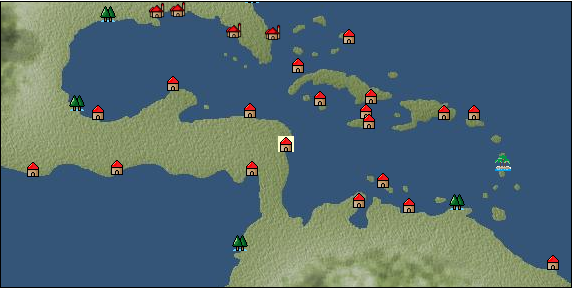

# Port: Portobello

import Tabs from '@theme/Tabs';
import TabItem from '@theme/TabItem';

## General Information

| Attribute | Details |
| :--- | :--- |
| **Port Name** | Portobello |
| **Port Type** | port of alliance |
| **Region** | Caribbean/Central America |
| **Sea Area** | western caribbean |
| **Required Language** | mayan languages |
| **Coordinates** | （12851，4167） |
| **Investment Reward** | [Land battle props/cooking book](docs/Items/RecipeBooks/item_1833.md) （必要投資額：500,000ドゥカード） |

### Available Facilities

| guild | intermediary | exchange | tool shop | workshop craftsman | Painter | sculptor | peddler |
| --- | --- | --- | --- | --- | --- | --- | --- |
|   | ○ | ○ | ○ | ○ |   |   | ○ |
| Shipyard Master | Lumbermaker | Sail-maker | weapon craftsman | master | TavernFemale | archive | salesperson |
| --- | --- | --- | --- | --- | --- | --- | --- |
| ○ |   |   |   | ○ | ○ |   | ○ |
| Shipwright | 銀行 | street worker | 王宮 | Trading post | church | suburbs | translator |
| --- | --- | --- | --- | --- | --- | --- | --- |
| ○ | ○ | ○ |   |   |   | ○ | ○ |

### Description
A port city facing the Caribbean Sea that serves as a transit point for trade with Central and South America. Portobello means "beautiful port". Panama Canal Tavern Waiter: Raul Suburb: Northwest of Portobello Gathering: You can get black mud ← Really? *Spanish is also spoken Cultural area: East coast of Central and South America

<Tabs>
  <TabItem value="trade_goods_sales" label="Trade Goods Sales">

| Item | Group | Purchase Price | Allied Price | Remarks |
| --- | --- | --- | --- | --- |
| [Cassava](docs/Items/TradeGoods/TradeGoods-Foodstuffs/item_1805.md) | [Trading items (food items)](docs/Categories/category_3.md) | 68 | 60 |  |
| [potato](docs/Items/TradeGoods/TradeGoods-Foodstuffs/item_106.md) | [Trading items (food items)](docs/Categories/category_3.md) | 132 | 116 |  |
| [chicle](docs/Items/TradeGoods/TradeGoods-Sunddries/item_4083.md) | [Trading goods (hobby goods)](docs/Categories/category_10.md) | 1,177 | (1,030) |  |
| 要投資（必要投資額：500,000） 投資額600k以下 |
| [corn](docs/Items/TradeGoods/TradeGoods-Foodstuffs/item_138.md) | [Trading items (food items)](docs/Categories/category_3.md) | 54 | 48 |  |
| [vanilla](docs/Items/TradeGoods/TradeGoods-Spices/item_1810.md) | [Trading Goods (Spices)](docs/Categories/category_12.md) | 328 | 288 |  |
| [silver](docs/Items/TradeGoods/TradeGoods-Metals/item_136.md) | [Trading products (precious metals)](docs/Categories/category_8.md) | 1,088 | 953 |  |
| 要投資（必要投資額：400,000） |
  </TabItem>
  <TabItem value="sale_specialty" label="Sale (Specialty)">

| Item | Group | sale price | Allied Price | Remarks |
| --- | --- | --- | --- | --- |

#### [交易品（繊維）](docs/Categories/category_1.md)

| [feather](docs/Items/TradeGoods/TradeGoods-Fibers/item_585.md) | 交易品（繊維） | 1,144 | (1,287) |  |

#### [Trading Goods (Dye)](docs/Categories/category_2.md)

| [ward](docs/Items/TradeGoods/TradeGoods-Dye/item_57.md) | Trading Goods (Dye) | (2,148) | 2,506 |  |

#### [交易品（酒類）](docs/Categories/category_9.md)

| [aquavit](docs/Items/TradeGoods/TradeGoods-Alcohol/item_572.md) | 交易品（酒類） | (1,414) | 1,649 |  |
| [whiskey](docs/Items/TradeGoods/TradeGoods-Alcohol/item_1.md) | 交易品（酒類） | 1,717 | 1,770 |  |
| [sherry](docs/Items/TradeGoods/TradeGoods-Alcohol/item_844.md) | 交易品（酒類） | (733) | 855 |  |
| [gin](docs/Items/TradeGoods/TradeGoods-Alcohol/item_291.md) | 交易品（酒類） | (1,553) | 1,812 |  |
| [fruit brandy](docs/Items/TradeGoods/TradeGoods-Alcohol/item_1440.md) | 交易品（酒類） | (1,121) | 1,308 |  |

#### [Trading goods (hobby goods)](docs/Categories/category_10.md)

| [caviar](docs/Items/TradeGoods/TradeGoods-Sunddries/item_2122.md) | Trading goods (hobby goods) | (1,610) | 1,878 |  |
| 同盟時1840-98% |
| [banana](docs/Items/TradeGoods/TradeGoods-Sunddries/item_1947.md) | Trading goods (hobby goods) | 533 | 592 |  |
| [prune](docs/Items/TradeGoods/TradeGoods-Sunddries/item_523.md) | Trading goods (hobby goods) | (667) | 778 |  |
| 同盟時871-112% |
| [金針花](docs/Items/TradeGoods/TradeGoods-Sunddries/item_3739.md) | Trading goods (hobby goods) | (3,242) | 3,782 |  |

#### [Trading Goods (Spices)](docs/Categories/category_11.md)

| [geranium](docs/Items/TradeGoods/TradeGoods-Perfume/item_145.md) | Trading Goods (Spices) | (636) | 742 |  |
| [lira](docs/Items/TradeGoods/TradeGoods-Perfume/item_30.md) | Trading Goods (Spices) | (1,310) | 1,528 |  |

#### [Trading Goods (Spices)](docs/Categories/category_12.md)

| [cloves](docs/Items/TradeGoods/TradeGoods-Spices/item_1092.md) | Trading Goods (Spices) | 4,379 | (4,926) |  |
| [saffron](docs/Items/TradeGoods/TradeGoods-Spices/item_845.md) | Trading Goods (Spices) | (4,190) | 4,888 |  |
| [nutmeg](docs/Items/TradeGoods/TradeGoods-Spices/item_1969.md) | Trading Goods (Spices) | 4,454 | (5,011) |  |
| [bergamot](docs/Items/TradeGoods/TradeGoods-Spices/item_879.md) | Trading Goods (Spices) | (1,217) | 1,419 |  |
| [mace](docs/Items/TradeGoods/TradeGoods-Spices/item_2100.md) | Trading Goods (Spices) | 4,786 | (5,384) |  |

#### [Trading Items (Gemstones)](docs/Categories/category_15.md)

| [alexandrite](docs/Items/TradeGoods/TradeGoods-Gems/item_4429.md) | Trading Items (Gemstones) | 10,840 | (12,196) |  |
| [pink diamond](docs/Items/TradeGoods/TradeGoods-Gems/item_2874.md) | Trading Items (Gemstones) | 11,000 | 13,816 |  |
| 同盟時10500-76% |

#### [Trading Items (Arms)](docs/Categories/category_16.md)

| [damascus sword](docs/Items/TradeGoods/TradeGoods-Weapons/item_903.md) | Trading Items (Arms) | (8,034) | 9,374 |  |
| 同盟時8530-91% |

#### [Trading Items (Firearms)](docs/Categories/category_17.md)

| [musket gun](docs/Items/TradeGoods/TradeGoods-Firearms/item_584.md) | Trading Items (Firearms) | 5,852 | 6,235 |  |

#### [交易品（工業品）](docs/Categories/category_19.md)

| [papyrus](docs/Items/TradeGoods/TradeGoods-Wares/item_616.md) | 交易品（工業品） | (692) | 807 |  |
| [marble](docs/Items/TradeGoods/TradeGoods-Wares/item_52.md) | 交易品（工業品） | (2,203) | 2,570 |  |
| [羊皮紙](docs/Items/TradeGoods/TradeGoods-Wares/item_53.md) | 交易品（工業品） | (1,974) | 2,303 |  |

#### [交易品（織物）](docs/Categories/category_20.md)

| [damask](docs/Items/TradeGoods/TradeGoods-Fabrics/item_614.md) | 交易品（織物） | (6,023) | 7,028 |  |
| 同盟時7590-108% |
| [turkish rug](docs/Items/TradeGoods/TradeGoods-Fabrics/item_686.md) | 交易品（織物） | (7,084) | 8,266 |  |
| 8100=98% |
| [flannel](docs/Items/TradeGoods/TradeGoods-Fabrics/item_149.md) | 交易品（織物） | 2,170 | 2,483 |  |
| [velvet](docs/Items/TradeGoods/TradeGoods-Fabrics/item_902.md) | 交易品（織物） | (5,232) | 6,104 |  |
  </TabItem>
  <TabItem value="sale_no_specialty" label="Sale (No Specialty)">

| Item | Group | sale price | Allied Price | Remarks |
| --- | --- | --- | --- | --- |

#### [交易品（繊維）](docs/Categories/category_1.md)

| [cotton](docs/Items/TradeGoods/TradeGoods-Fibers/item_610.md) | 交易品（繊維） | 516 | (580) |  |
| [wool](docs/Items/TradeGoods/TradeGoods-Fibers/item_5.md) | 交易品（繊維） | (403) | 470 |  |
| [numb](docs/Items/TradeGoods/TradeGoods-Fibers/item_900.md) | 交易品（繊維） | 12 | (13) |  |

#### [Trading Goods (Dye)](docs/Categories/category_2.md)

| [貝紫](docs/Items/TradeGoods/TradeGoods-Dye/item_110.md) | Trading Goods (Dye) | 4,539 | (5,106) |  |

#### [Trading items (food items)](docs/Categories/category_3.md)

| [mushroom](docs/Items/TradeGoods/TradeGoods-Foodstuffs/item_160.md) | Trading items (food items) | 32 | 32 |  |
| [tomato](docs/Items/TradeGoods/TradeGoods-Foodstuffs/item_1809.md) | Trading items (food items) | 106 | (119) |  |
| [ham](docs/Items/TradeGoods/TradeGoods-Foodstuffs/item_290.md) | Trading items (food items) | 665 | (748) |  |
| [bacon](docs/Items/TradeGoods/TradeGoods-Foodstuffs/item_566.md) | Trading items (food items) | (540) | 630 |  |
| [wheat](docs/Items/TradeGoods/TradeGoods-Foodstuffs/item_16.md) | Trading items (food items) | (105) | 122 |  |
| [Paddy rice](docs/Items/TradeGoods/TradeGoods-Foodstuffs/item_654.md) | Trading items (food items) | 117 | (131) |  |
| [真珠貝](docs/Items/TradeGoods/TradeGoods-Foodstuffs/item_1095.md) | Trading items (food items) | 112 | (126) |  |
| [mutton](docs/Items/TradeGoods/TradeGoods-Foodstuffs/item_33.md) | Trading items (food items) | 554 | (623) |  |
| [pork](docs/Items/TradeGoods/TradeGoods-Foodstuffs/item_41.md) | Trading items (food items) | (534) | 623 |  |
| [魚肉](docs/Items/TradeGoods/TradeGoods-Foodstuffs/item_10.md) | Trading items (food items) | 196 | (220) |  |

#### [交易品（調味料）](docs/Categories/category_4.md)

| [almond oil](docs/Items/TradeGoods/TradeGoods-Seasonings/item_578.md) | 交易品（調味料） | 899 | (1,011) |  |
| [coconut vinegar](docs/Items/TradeGoods/TradeGoods-Seasonings/item_1988.md) | 交易品（調味料） | 499 | (561) |  |
| [peanut oil](docs/Items/TradeGoods/TradeGoods-Seasonings/item_596.md) | 交易品（調味料） | 450 | (506) |  |
| [lard](docs/Items/TradeGoods/TradeGoods-Seasonings/item_43.md) | 交易品（調味料） | (257) | 299 |  |
| [salt](docs/Items/TradeGoods/TradeGoods-Seasonings/item_42.md) | 交易品（調味料） | (234) | 272 |  |
| [sugar](docs/Items/TradeGoods/TradeGoods-Seasonings/item_94.md) | 交易品（調味料） | 1,011 | (1,137) |  |

#### [交易品（雑貨）](docs/Categories/category_5.md)

| [Western books](docs/Items/TradeGoods/TradeGoods-Misc/item_293.md) | 交易品（雑貨） | 645 | (725) |  |

#### [Trading products (medical products)](docs/Categories/category_6.md)

| [cinchona bark](docs/Items/TradeGoods/TradeGoods-Medicine/item_2121.md) | Trading products (medical products) | 702 | (789) |  |
| [dandelion](docs/Items/TradeGoods/TradeGoods-Medicine/item_1089.md) | Trading products (medical products) | (258) | 300 |  |
| [mercury agent](docs/Items/TradeGoods/TradeGoods-Medicine/item_703.md) | Trading products (medical products) | 1,625 | (1,828) |  |

#### [Trading Items (Iron Stone)](docs/Categories/category_7.md)

| [iron ore](docs/Items/TradeGoods/TradeGoods-Minerals/item_146.md) | Trading Items (Iron Stone) | 693 | 727 |  |
| [copper ore](docs/Items/TradeGoods/TradeGoods-Minerals/item_65.md) | Trading Items (Iron Stone) | (786) | 916 |  |

#### [Trading products (precious metals)](docs/Categories/category_8.md)

| [gold dust](docs/Items/TradeGoods/TradeGoods-Metals/item_111.md) | Trading products (precious metals) | 2,209 | (2,485) |  |
| [gold](docs/Items/TradeGoods/TradeGoods-Metals/item_659.md) | Trading products (precious metals) | (2,367) | 2,761 |  |

#### [交易品（酒類）](docs/Categories/category_9.md)

| [tequila](docs/Items/TradeGoods/TradeGoods-Alcohol/item_108.md) | 交易品（酒類） | 1,145 | (1,288) |  |
| [brandy](docs/Items/TradeGoods/TradeGoods-Alcohol/item_9.md) | 交易品（酒類） | 1,450 | (1,631) |  |

#### [Trading goods (hobby goods)](docs/Categories/category_10.md)

| [cacao](docs/Items/TradeGoods/TradeGoods-Sunddries/item_140.md) | Trading goods (hobby goods) | 975 | (1,096) |  |
| [coconut](docs/Items/TradeGoods/TradeGoods-Sunddries/item_96.md) | Trading goods (hobby goods) | 553 | (622) |  |
| [coffee](docs/Items/TradeGoods/TradeGoods-Sunddries/item_445.md) | Trading goods (hobby goods) | 536 | (603) |  |
| [tobacco](docs/Items/TradeGoods/TradeGoods-Sunddries/item_109.md) | Trading goods (hobby goods) | 636 | (715) |  |
| [pineapple](docs/Items/TradeGoods/TradeGoods-Sunddries/item_867.md) | Trading goods (hobby goods) | 1,038 | (1,167) |  |
| [peanuts](docs/Items/TradeGoods/TradeGoods-Sunddries/item_134.md) | Trading goods (hobby goods) | 180 | (202) |  |
| [Yerba mate tea](docs/Items/TradeGoods/TradeGoods-Sunddries/item_1808.md) | Trading goods (hobby goods) | 283 | (318) |  |

#### [Trading Goods (Spices)](docs/Categories/category_11.md)

| [rose](docs/Items/TradeGoods/TradeGoods-Perfume/item_536.md) | Trading Goods (Spices) | 4,158 | 4,450 |  |

#### [Trading Goods (Spices)](docs/Categories/category_12.md)

| [garlic](docs/Items/TradeGoods/TradeGoods-Spices/item_526.md) | Trading Goods (Spices) | (335) | 390 |  |
| [coriander](docs/Items/TradeGoods/TradeGoods-Spices/item_1044.md) | Trading Goods (Spices) | (541) | 631 |  |
| [basil](docs/Items/TradeGoods/TradeGoods-Spices/item_126.md) | Trading Goods (Spices) | 261 | 270 |  |

#### [Trading goods (artificial goods)](docs/Categories/category_13.md)

| [Tumbaga](docs/Items/TradeGoods/TradeGoods-Luxuries/item_3028.md) | Trading goods (artificial goods) | 6,000 | (6,750) |  |
| [皮革製品](docs/Items/TradeGoods/TradeGoods-Luxuries/item_12.md) | Trading goods (artificial goods) | 1,460 | (1,642) |  |

#### [Trading Items (Gemstones)](docs/Categories/category_15.md)

| [inca rose](docs/Items/TradeGoods/TradeGoods-Gems/item_3014.md) | Trading Items (Gemstones) | 5,536 | (6,228) |  |
| [pearl](docs/Items/TradeGoods/TradeGoods-Gems/item_769.md) | Trading Items (Gemstones) | (4,884) | 5,698 |  |

#### [Trading Items (Arms)](docs/Categories/category_16.md)

| [dagger](docs/Items/TradeGoods/TradeGoods-Weapons/item_143.md) | Trading Items (Arms) | 910 | (1,023) |  |

#### [Trading Items (Firearms)](docs/Categories/category_17.md)

| [arquebus gun](docs/Items/TradeGoods/TradeGoods-Firearms/item_14.md) | Trading Items (Firearms) | 2,658 | (2,990) |  |
| [大砲](docs/Items/TradeGoods/TradeGoods-Firearms/item_4.md) | Trading Items (Firearms) | 5,167 | (5,813) |  |
| [bullet](docs/Items/TradeGoods/TradeGoods-Firearms/item_13.md) | Trading Items (Firearms) | 1,200 | (1,350) |  |
| [cannonball](docs/Items/TradeGoods/TradeGoods-Firearms/item_144.md) | Trading Items (Firearms) | 1,741 | (1,958) |  |

#### [Trading Goods (Livestock)](docs/Categories/category_18.md)

| [chicken](docs/Items/TradeGoods/TradeGoods-Livestock/item_252.md) | Trading Goods (Livestock) | 51 | (57) |  |

#### [交易品（工業品）](docs/Categories/category_19.md)

| [log](docs/Items/TradeGoods/TradeGoods-Wares/item_846.md) | 交易品（工業品） | 130 | (146) |  |
| [wood](docs/Items/TradeGoods/TradeGoods-Wares/item_277.md) | 交易品（工業品） | 784 | 809 |  |
| [水銀](docs/Items/TradeGoods/TradeGoods-Wares/item_15.md) | 交易品（工業品） | 1,240 | (1,395) |  |
| [iron material](docs/Items/TradeGoods/TradeGoods-Wares/item_268.md) | 交易品（工業品） | 816 | (918) |  |

#### [交易品（織物）](docs/Categories/category_20.md)

| [cotton fabric](docs/Items/TradeGoods/TradeGoods-Fabrics/item_571.md) | 交易品（織物） | 1,196 | (1,345) |  |
  </TabItem>
  <TabItem value="guild_&_others" label="Guild & Others">

| Item | Group | Sales price | Handling NPC | Remarks |
| --- | --- | --- | --- | --- |

#### balboa

| [16 gun casting method](docs/Items/RecipeBooks/item_3857.md) | [recipe book](docs/Categories/category_22.md) |  | balboa |  |
| Memorial album “Multi-gun cannon by craftsmanship” reward |
| [weapons technology](docs/Skills/Skill-Battle/item_1731.md) | [Skill (combat)](docs/Categories/category_41.md) | 300,000 | balboa |  |
| [sniper technique](docs/Skills/Skill-Battle/item_1734.md) | [Skill (combat)](docs/Categories/category_41.md) | 200,000 | balboa |  |
| [Quechua](docs/Skills/Skills-Language/item_3010.md) | [Skills (language)](docs/Categories/category_42.md) | 800,000 | balboa |  |
  </TabItem>
  <TabItem value="toolman" label="Toolman">

| Item | Group | Sales price | Handling NPC | Remarks |
| --- | --- | --- | --- | --- |

#### [recipe book](docs/Categories/category_22.md)

| [Sewing method for South American ethnic clothing](docs/Items/RecipeBooks/item_1824.md) | recipe book | Fixed recipe | tool shop owner |  |

#### [Equipment (body)](docs/Categories/category_24.md)

| [Surcoat](docs/Items/Equipment/Equipment-Body/item_131.md) | Equipment (body) | 30,000 | tool shop owner |  |

#### [Equipment (legs)](docs/Categories/category_26.md)

| [boots](docs/Items/Equipment/Equipment-Feet/item_365.md) | Equipment (legs) | 100 | tool shop owner |  |

#### [Equipment (belongings)](docs/Categories/category_27.md)

| [long sword](docs/Items/Equipment/Equipment-Weapon/item_302.md) | Equipment (belongings) | 15,400 | tool shop owner |  |

#### [Consumables (land battle/deck battle)](docs/Categories/category_29.md)

| [Taheebo juice](docs/Items/Consumables/Consumables-Landbattle/item_1807.md) | Consumables (land battle/deck battle) | 300 | tool shop owner |  |
| [taheebo bottle](docs/Items/Consumables/Consumables-Landbattle/item_1823.md) | Consumables (land battle/deck battle) | 600 | tool shop owner |  |
| 要投資（必要投資額：120,000） |
| [tonic](docs/Items/Consumables/Consumables-Landbattle/item_1678.md) | Consumables (land battle/deck battle) | 300 | tool shop owner |  |
| [torch for throwing](docs/Items/Consumables/Consumables-Landbattle/item_313.md) | Consumables (land battle/deck battle) | 150 | tool shop owner |  |

#### [Consumables (request documents)](docs/Categories/category_45.md)

| [spice purchase order](docs/Items/Consumables/Consumables-Documents/item_4918.md) | Consumables (request documents) | 60,000 | tool shop owner |  |
  </TabItem>
  <TabItem value="kobo_craftsmen" label="Craftsman">

| Item | Group | Sales price | Handling NPC | Remarks |
| --- | --- | --- | --- | --- |

#### [Consumables (condition recovery)](docs/Categories/category_21.md)

| [Nostalgic carillon bell](docs/Items/Consumables/Consumables-Recovery/item_245.md) | Consumables (condition recovery) | 200 | workshop craftsman |  |
| [Ship song sheet music](docs/Items/Consumables/Consumables-Recovery/item_247.md) | Consumables (condition recovery) | 200 | workshop craftsman |  |

#### [Consumables (other)](docs/Categories/category_44.md)

| [帆塗料](docs/Items/Consumables/Consumables-Other/item_348.md) | Consumables (other) | 500 | workshop craftsman |  |
| [ship paint](docs/Items/Consumables/Consumables-Other/item_347.md) | Consumables (other) | 500 | workshop craftsman |  |
  </TabItem>
  <TabItem value="peddler" label="peddler">

| Item | Group | Sales price | Handling NPC | Remarks |
| --- | --- | --- | --- | --- |

#### [Consumables (condition recovery)](docs/Categories/category_21.md)

| [spare sail](docs/Items/Consumables/Consumables-Recovery/item_242.md) | Consumables (condition recovery) |  | peddler |  |
| [recreational sake barrel](docs/Items/Consumables/Consumables-Recovery/item_83.md) | Consumables (condition recovery) |  | peddler |  |
| [fire extinguishing sand](docs/Items/Consumables/Consumables-Recovery/item_68.md) | Consumables (condition recovery) |  | peddler |  |

#### [Consumables (land battle/deck battle)](docs/Categories/category_29.md)

| [suma juice](docs/Items/Consumables/Consumables-Landbattle/item_1825.md) | Consumables (land battle/deck battle) |  | peddler |  |
| [chili pepper sauce](docs/Items/Consumables/Consumables-Landbattle/item_1826.md) | Consumables (land battle/deck battle) |  | peddler |  |
| [煙玉](docs/Items/Consumables/Consumables-Landbattle/item_86.md) | Consumables (land battle/deck battle) |  | peddler |  |

#### [Consumables (naval/hand-to-hand combat)](docs/Categories/category_30.md)

| [flag of calm](docs/Items/Consumables/Consumables-navalhand-to-hand combat/item_84.md) | Consumables (naval/hand-to-hand combat) |  | peddler |  |

#### [Consumables (skill activation)](docs/Categories/category_31.md)

| [landmark ribbon](docs/Items/Consumables/Consumables-Skill/item_316.md) | Consumables (skill activation) |  | peddler |  |
  </TabItem>
  <TabItem value="salesperson" label="salesperson">

| Item | Group | Sales price | Handling NPC | Remarks |
| --- | --- | --- | --- | --- |

#### [Consumables (cooking)](docs/Categories/category_32.md)

| [Cacahuatl](docs/Items/Consumables/Consumables-Cooking/item_1942.md) | Consumables (cooking) |  | salesperson |  |
| [ceviche](docs/Items/Consumables/Consumables-Cooking/item_1941.md) | Consumables (cooking) |  | salesperson |  |
| [sopa de tortilla](docs/Items/Consumables/Consumables-Cooking/item_1940.md) | Consumables (cooking) |  | salesperson |  |
| [Takaka](docs/Items/Consumables/Consumables-Cooking/item_1939.md) | Consumables (cooking) |  | salesperson |  |
| [Tlaxcali](docs/Items/Consumables/Consumables-Cooking/item_1832.md) | Consumables (cooking) |  | salesperson |  |
| [Grilled papaya stuffed with meat](docs/Items/Consumables/Consumables-Cooking/item_1110.md) | Consumables (cooking) |  | salesperson |  |
| [Manisoba](docs/Items/Consumables/Consumables-Cooking/item_1938.md) | Consumables (cooking) |  | salesperson |  |
| [Leakage](docs/Items/Consumables/Consumables-Cooking/item_1937.md) | Consumables (cooking) |  | salesperson |  |
  </TabItem>
  <TabItem value="translator" label="translator">

| Item | Group | Sales price | Handling NPC | Remarks |
| --- | --- | --- | --- | --- |

#### [Consumables (skill activation)](docs/Categories/category_31.md)

| [American languages ​​translation notes](docs/Items/Consumables/Consumables-Skill/item_2276.md) | Consumables (skill activation) |  | translator |  |
  </TabItem>
  <TabItem value="shipyard" label="Shipyard">

### Shipyard Master

| Item | Group | Sales price | Handling NPC | Remarks |
| --- | --- | --- | --- | --- |

#### [Boat](docs/Categories/category_43.md)

| [Varsha](docs/Items/Ships/item_201.md) | Boat | 2,000 | Shipyard Master |  |
| [bergantine](docs/Items/Ships/item_208.md) | Boat | 148,800 | Shipyard Master |  |
| [commercial varsha](docs/Items/Ships/item_204.md) | Boat | 5,200 | Shipyard Master |  |
| [Battle Barsha](docs/Items/Ships/item_203.md) | Boat | 5,100 | Shipyard Master |  |
| [exploration barsha](docs/Items/Ships/item_202.md) | Boat | 5,000 | Shipyard Master |  |

### Shipwright

| Item | Group | Sales price | Handling NPC | Remarks |
| --- | --- | --- | --- | --- |

#### [recipe book](docs/Categories/category_22.md)

| [Shipbuilding materials/special mines](docs/Items/RecipeBooks/item_1908.md) | recipe book | Fixed recipe | Shipwright |  |

#### [shipbuilding materials](docs/Categories/category_47.md)

| [special mines](docs/Items/ShipbuildingFS/item_1907.md) | shipbuilding materials | Fixed recipe | Shipwright |  |
  </TabItem>
</Tabs>