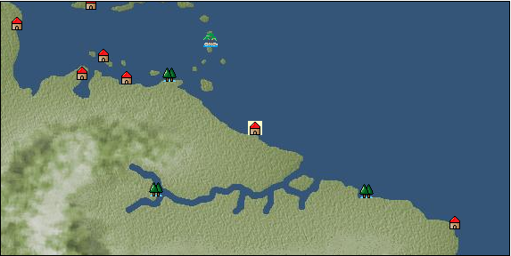

# Port: カイエンヌ

import Tabs from '@theme/Tabs';
import TabItem from '@theme/TabItem';

## General Information

| Attribute | Details |
| :--- | :--- |
| **Port Name** | cayenne |
| **Port Type** | 開拓地 |
| **Region** | Caribbean/Central America |
| **Sea Area** | amazon river basin |
| **Required Language** | French |
| **Coordinates** | （13918，4650） |
| **Investment Reward** | [Lot (NO.11)](Items/Consumables/Consumables-Treasure-Chests/item_2896.md) （必要投資額：500,000ドゥカード） |

### Available Facilities

| guild | intermediary | exchange | tool shop | workshop craftsman | Painter | sculptor | peddler |
| --- | --- | --- | --- | --- | --- | --- | --- |
|   |   | ○ | ○ | ○ | ○ | ○ | ○ |
| Shipyard Master | Lumbermaker | Sail-maker | weapon craftsman | master | TavernFemale | archive | salesperson |
| --- | --- | --- | --- | --- | --- | --- | --- |
| ○ | ○ | ○ | ○ | ○ |   | ○ |   |
| Shipwright | 銀行 | street worker | 王宮 | Trading post | church | suburbs | translator |
| --- | --- | --- | --- | --- | --- | --- | --- |
| ○ | ○ | ○ |   |   |   |   |   |

### Description
A port town located on the northeast coast of South America. The weather is warm throughout the year, but there is a lot of rainfall. *French territory Clerk Master cook Skilled sewing engineer Skilled foundry worker Dock manager Cultural area: East coast of Central and South America

<Tabs>
  <TabItem value="trade_goods_sales" label="Trade Goods Sales">

| item | group | purchase price | 同盟時 | remarks |
| --- | --- | --- | --- | --- |
| [Cassava](Items/Trade Goods/TradeGoods-Foodstuffs/item_1805.md) | [Trading items (food items)](Categories/category_3.md) | 69 | (61) |  |
| [coffee](Items/Trade Goods/TradeGoods-Sunddries/item_445.md) | [Trading goods (hobby goods)](Categories/category_10.md) | (429) | 376 |  |
| 要投資（必要投資額：240,000） |
| [gobelin weave](Items/Trade Goods/TradeGoods-Fabrics/item_1276.md) | [交易品（織物）](Categories/category_20.md) | (9,470) | 8,286 |  |
| 要投資（必要投資額：400,000） |
| [sugar cane](Items/Trade Goods/TradeGoods-Foodstuffs/item_93.md) | [Trading items (food items)](Categories/category_3.md) | (219) | 192 |  |
| [Jambu](Items/Trade Goods/TradeGoods-Foodstuffs/item_1827.md) | [Trading items (food items)](Categories/category_3.md) | 127 | 112 |  |
| [topaz](Items/Trade Goods/TradeGoods-Gems/item_1097.md) | [Trading Items (Gemstones)](Categories/category_15.md) | (1,920) | 1,680 |  |
| 要投資（必要投資額：400,000） |
| [peanuts](Items/Trade Goods/TradeGoods-Sunddries/item_134.md) | [Trading goods (hobby goods)](Categories/category_10.md) | (182) | 160 |  |
| 要投資（必要投資額：320,000） |
| [mayan blue](Items/Trade Goods/TradeGoods-Dye/item_1096.md) | [Trading Goods (Dye)](Categories/category_2.md) | (534) | 468 |  |
| 要投資（必要投資額：240,000） |
| [rum](Items/Trade Goods/TradeGoods-Alcohol/item_139.md) | [交易品（酒類）](Categories/category_9.md) | (475) | 416 |  |
| 要投資（必要投資額：240,000） |
  </TabItem>
  <TabItem value="sale_specialty" label="Sale (Specialty)">

| item | group | sale price | 同盟時 | remarks |
| --- | --- | --- | --- | --- |

#### [交易品（繊維）](Categories/category_1.md)

| [Green ramie](Items/Trade Goods/TradeGoods-Fibers/item_3428.md) | [交易品（繊維）](Categories/category_1.md) | (19,945) | 23,273 |  |
| [deerskin](Items/Trade Goods/TradeGoods-Fibers/item_3648.md) | [交易品（繊維）](Categories/category_1.md) | (18,699) | 21,819 |  |

#### [Trading Goods (Dye)](Categories/category_2.md)

| [ward](Items/Trade Goods/TradeGoods-Dye/item_57.md) | [Trading Goods (Dye)](Categories/category_2.md) | 2,061 | (2,318) |  |

#### [交易品（酒類）](Categories/category_9.md)

| [Taiwan rice wine](Items/Trade Goods/TradeGoods-Alcohol/item_3672.md) | [交易品（酒類）](Categories/category_9.md) | (18,986) | 22,154 |  |
| [Sake](Items/Trade Goods/TradeGoods-Alcohol/item_3424.md) | [交易品（酒類）](Categories/category_9.md) | (18,935) | 22,094 |  |

#### [Trading goods (hobby goods)](Categories/category_10.md)

| [Aigyoku](Items/Trade Goods/TradeGoods-Sunddries/item_3677.md) | [Trading goods (hobby goods)](Categories/category_10.md) | (18,945) | 22,106 |  |
| [prune](Items/Trade Goods/TradeGoods-Sunddries/item_523.md) | [Trading goods (hobby goods)](Categories/category_10.md) | 771 | (867) |  |

#### [Trading Goods (Spices)](Categories/category_11.md)

| [Tang Muxiang](Items/Trade Goods/TradeGoods-Perfume/item_593.md) | [Trading Goods (Spices)](Categories/category_11.md) | 920 | (1,035) |  |
| ●Special products of West Africa |

#### [交易品（美術品）](Categories/category_14.md)

| [taiwan wood carving](Items/Trade Goods/TradeGoods-Art/item_3697.md) | [交易品（美術品）](Categories/category_14.md) | (18,337) | 21,396 |  |
  </TabItem>
  <TabItem value="sale_no_specialty" label="Sale (No Specialty)">

| item | group | sale price | 同盟時 | remarks |
| --- | --- | --- | --- | --- |

#### [交易品（繊維）](Categories/category_1.md)

| [cotton](Items/Trade Goods/TradeGoods-Fibers/item_610.md) | [交易品（繊維）](Categories/category_1.md) | 511 | (574) |  |
| [numb](Items/Trade Goods/TradeGoods-Fibers/item_900.md) | [交易品（繊維）](Categories/category_1.md) | 12 | (13) |  |

#### [Trading items (food items)](Categories/category_3.md)

| [魚肉](Items/Trade Goods/TradeGoods-Foodstuffs/item_10.md) | [Trading items (food items)](Categories/category_3.md) | 195 | (219) |  |

#### [交易品（調味料）](Categories/category_4.md)

| [salt](Items/Trade Goods/TradeGoods-Seasonings/item_42.md) | [交易品（調味料）](Categories/category_4.md) | 267 | (300) |  |
| [sugar](Items/Trade Goods/TradeGoods-Seasonings/item_94.md) | [交易品（調味料）](Categories/category_4.md) | 1,020 | (1,147) |  |

#### [Trading Items (Iron Stone)](Categories/category_7.md)

| [iron ore](Items/Trade Goods/TradeGoods-Minerals/item_146.md) | [Trading Items (Iron Stone)](Categories/category_7.md) | 711 | (799) |  |
| [copper ore](Items/Trade Goods/TradeGoods-Minerals/item_65.md) | [Trading Items (Iron Stone)](Categories/category_7.md) | 906 | (1,019) |  |

#### [交易品（酒類）](Categories/category_9.md)

| [rum](Items/Trade Goods/TradeGoods-Alcohol/item_139.md) | [交易品（酒類）](Categories/category_9.md) | 208 | (234) |  |
| 要投資（必要投資額：240,000） |

#### [Trading goods (hobby goods)](Categories/category_10.md)

| [cacao](Items/Trade Goods/TradeGoods-Sunddries/item_140.md) | [Trading goods (hobby goods)](Categories/category_10.md) | 957 | (1,076) |  |

#### [Trading goods (artificial goods)](Categories/category_13.md)

| [luxury furniture](Items/Trade Goods/TradeGoods-Luxuries/item_1048.md) | [Trading goods (artificial goods)](Categories/category_13.md) | 2,558 | (2,878) |  |

#### [Trading Items (Gemstones)](Categories/category_15.md)

| [coral](Items/Trade Goods/TradeGoods-Gems/item_141.md) | [Trading Items (Gemstones)](Categories/category_15.md) | 3,170 | (3,566) |  |

#### [Trading Items (Arms)](Categories/category_16.md)

| [dagger](Items/Trade Goods/TradeGoods-Weapons/item_143.md) | [Trading Items (Arms)](Categories/category_16.md) | 943 | (1,060) |  |

#### [Trading Goods (Livestock)](Categories/category_18.md)

| [rat](Items/Trade Goods/TradeGoods-Livestock/item_2710.md) | [Trading Goods (Livestock)](Categories/category_18.md) | (18) | 20 |  |

#### [交易品（工業品）](Categories/category_19.md)

| [wood](Items/Trade Goods/TradeGoods-Wares/item_277.md) | [交易品（工業品）](Categories/category_19.md) | 796 | (895) |  |
  </TabItem>
  <TabItem value="guild_&_others" label="Guild & Others">

| item | group | Sales price | Handling NPC | remarks |
| --- | --- | --- | --- | --- |

#### others

| [master caribbean cuisine](Items/Recipe Book/item_2847.md) | [recipe book](Categories/category_22.md) | Fixed recipe |  |  |
| Owned by a cooking expert |
| [Advanced sewing technology](Items/Recipe Book/item_2849.md) | [recipe book](Categories/category_22.md) | Fixed recipe |  |  |
| Owned by a skilled seamstress |
| [Advanced casting technology](Items/Recipe Book/item_2848.md) | [recipe book](Categories/category_22.md) | Fixed recipe |  |  |
| Owned by a skilled casting engineer |
  </TabItem>
  <TabItem value="toolman" label="Toolman">

| item | group | Sales price | Handling NPC | remarks |
| --- | --- | --- | --- | --- |

#### [Equipment (body)](Categories/category_24.md)

| [Surcoat](Items/Equipment/Equipment-Body/item_131.md) | [Equipment (body)](Categories/category_24.md) | 30,000 | tool shop owner |  |

#### [Equipment (legs)](Categories/category_26.md)

| [boots](Items/Equipment/Equipment-Feet/item_365.md) | [Equipment (legs)](Categories/category_26.md) | 100 | tool shop owner |  |

#### [Equipment (belongings)](Categories/category_27.md)

| [long sword](Items/Equipment/Equipment-Weapon/item_302.md) | [Equipment (belongings)](Categories/category_27.md) | 15,400 | tool shop owner |  |

#### [装備品（服飾品）](Categories/category_28.md)

| [jade ring](Items/Equipment/Equipment-Accessory/item_1955.md) | [装備品（服飾品）](Categories/category_28.md) | 7,000,000 | tool shop owner |  |
| 要投資（必要投資額：240,000） |

#### [Consumables (land battle/deck battle)](Categories/category_29.md)

| [Taheebo juice](Items/Consumables/Consumables-Landbattle/item_1807.md) | [Consumables (land battle/deck battle)](Categories/category_29.md) | 300 | tool shop owner |  |
| [taheebo bottle](Items/Consumables/Consumables-Landbattle/item_1823.md) | [Consumables (land battle/deck battle)](Categories/category_29.md) | 600 | tool shop owner |  |
| 要投資（必要投資額：120,000） |
| [tonic](Items/Consumables/Consumables-Landbattle/item_1678.md) | [Consumables (land battle/deck battle)](Categories/category_29.md) | 300 | tool shop owner |  |

#### [Consumables (other)](Categories/category_44.md)

| [black powder](Items/Consumables/Consumables-Other/item_1954.md) | [Consumables (other)](Categories/category_44.md) | 1,000 | tool shop owner |  |
  </TabItem>
  <TabItem value="kobo_craftsmen" label="Craftsman">

| item | group | Sales price | Handling NPC | remarks |
| --- | --- | --- | --- | --- |

#### [recipe book](Categories/category_22.md)

| [Furniture manufacturing/Caribbean edition](Items/Recipe Book/item_1951.md) | [recipe book](Categories/category_22.md) | Fixed recipe | workshop craftsman |  |

#### [furniture](Categories/category_48.md)

| [caribbean style costume box](Items/Furniture/item_2088.md) | [furniture](Categories/category_48.md) | Fixed recipe | workshop craftsman |  |
| [food basket](Items/Furniture/item_2089.md) | [furniture](Categories/category_48.md) | Fixed recipe | workshop craftsman |  |
| [Open rack for small items](Items/Furniture/item_2219.md) | [furniture](Categories/category_48.md) | Fixed recipe | workshop craftsman |  |
| [Stone monument for book stand](Items/Furniture/item_1952.md) | [furniture](Categories/category_48.md) | Fixed recipe | workshop craftsman |  |
| [cat car](Items/Furniture/item_2090.md) | [furniture](Categories/category_48.md) | Fixed recipe | workshop craftsman |  |
  </TabItem>
  <TabItem value="Painter" label="Painter">

| item | group | Sales price | Handling NPC | remarks |
| --- | --- | --- | --- | --- |

#### [Ship parts (emblem)](Categories/category_36.md)

| [admiral](Items/Ship Parts/Shipparts-Crests/item_548.md) | [Ship parts (emblem)](Categories/category_36.md) | 5,000 | Painter |  |
| [anchor](Items/Ship Parts/Shipparts-Crests/item_549.md) | [Ship parts (emblem)](Categories/category_36.md) | 5,000 | Painter |  |
| [whale](Items/Ship Parts/Shipparts-Crests/item_792.md) | [Ship parts (emblem)](Categories/category_36.md) | 5,000 | Painter |  |
| [sun](Items/Ship Parts/Shipparts-Crests/item_597.md) | [Ship parts (emblem)](Categories/category_36.md) | 5,000 | Painter |  |
| [circle cross](Items/Ship Parts/Shipparts-Crests/item_544.md) | [Ship parts (emblem)](Categories/category_36.md) | 5,000 | Painter |  |
| [shellfish](Items/Ship Parts/Shipparts-Crests/item_546.md) | [Ship parts (emblem)](Categories/category_36.md) | 5,000 | Painter |  |
| [Delphine](Items/Ship Parts/Shipparts-Crests/item_542.md) | [Ship parts (emblem)](Categories/category_36.md) | 5,000 | Painter |  |
| [fisherman](Items/Ship Parts/Shipparts-Crests/item_545.md) | [Ship parts (emblem)](Categories/category_36.md) | 5,000 | Painter |  |
  </TabItem>
  <TabItem value="sculptor" label="sculptor">

| item | group | Sales price | Handling NPC | remarks |
| --- | --- | --- | --- | --- |

#### [recipe book](Categories/category_22.md)

| [Saint statue creation, part 4](Items/Recipe Book/item_4472.md) | [recipe book](Categories/category_22.md) | Fixed recipe | sculptor |  |

#### [Ship parts (figurehead)](Categories/category_34.md)

| [dolphin statue](Items/Ship Parts/Shipparts-Figurehead/item_169.md) | [Ship parts (figurehead)](Categories/category_34.md) | 500 | sculptor |  |
| [whale statue](Items/Ship Parts/Shipparts-Figurehead/item_172.md) | [Ship parts (figurehead)](Categories/category_34.md) | 12,000 | sculptor |  |
| [shark statue](Items/Ship Parts/Shipparts-Figurehead/item_171.md) | [Ship parts (figurehead)](Categories/category_34.md) | 8,600 | sculptor |  |
| [killer whale statue](Items/Ship Parts/Shipparts-Figurehead/item_170.md) | [Ship parts (figurehead)](Categories/category_34.md) | 8,600 | sculptor |  |
| [Tobi statue](Items/Ship Parts/Shipparts-Figurehead/item_287.md) | [Ship parts (figurehead)](Categories/category_34.md) | 500 | sculptor |  |
| [maiden statue](Items/Ship Parts/Shipparts-Figurehead/item_167.md) | [Ship parts (figurehead)](Categories/category_34.md) | 13,000 | sculptor |  |
| [statue of a great man](Items/Ship Parts/Shipparts-Figurehead/item_717.md) | [Ship parts (figurehead)](Categories/category_34.md) | 60,000 | sculptor |  |
| [statue of the brave](Items/Ship Parts/Shipparts-Figurehead/item_716.md) | [Ship parts (figurehead)](Categories/category_34.md) | 60,000 | sculptor |  |
| [angel statue](Items/Ship Parts/Shipparts-Figurehead/item_168.md) | [Ship parts (figurehead)](Categories/category_34.md) | 13,000 | sculptor |  |
| [statue of tenryu](Items/Ship Parts/Shipparts-Figurehead/item_630.md) | [Ship parts (figurehead)](Categories/category_34.md) | 62,000 | sculptor |  |
| [statue of goddess](Items/Ship Parts/Shipparts-Figurehead/item_721.md) | [Ship parts (figurehead)](Categories/category_34.md) | 60,000 | sculptor |  |
| [sea ​​turtle statue](Items/Ship Parts/Shipparts-Figurehead/item_173.md) | [Ship parts (figurehead)](Categories/category_34.md) | 1,800 | sculptor |  |
| [sea ​​monster statue](Items/Ship Parts/Shipparts-Figurehead/item_628.md) | [Ship parts (figurehead)](Categories/category_34.md) | 62,000 | sculptor |  |
| [statue of sea god](Items/Ship Parts/Shipparts-Figurehead/item_720.md) | [Ship parts (figurehead)](Categories/category_34.md) | 60,000 | sculptor |  |
| [statue of king](Items/Ship Parts/Shipparts-Figurehead/item_718.md) | [Ship parts (figurehead)](Categories/category_34.md) | 60,000 | sculptor |  |
  </TabItem>
  <TabItem value="shipyard" label="Shipyard">

### Shipyard Master

| item | group | Sales price | Handling NPC | remarks |
| --- | --- | --- | --- | --- |

#### [recipe book](Categories/category_22.md)

| [Book of Shipbuilding Materials and Hulls Volume 3](Items/Recipe Book/item_1818.md) | [recipe book](Categories/category_22.md) | Fixed recipe | Shipyard Master |  |

#### [Boat](Categories/category_43.md)

| [Varsha](Items/Ships/item_201.md) | [Boat](Categories/category_43.md) | 2,000 | Shipyard Master |  |

#### [shipbuilding materials](Categories/category_47.md)

| [2-deck type large hull](Items/Shipbuilding FS Material/item_1820.md) | [shipbuilding materials](Categories/category_47.md) | Fixed recipe | Shipyard Master |  |
| [3-deck type large hull](Items/Shipbuilding FS Material/item_2087.md) | [shipbuilding materials](Categories/category_47.md) | Fixed recipe | Shipyard Master |  |
| [Flat deck type large hull](Items/Shipbuilding FS Material/item_1819.md) | [shipbuilding materials](Categories/category_47.md) | Fixed recipe | Shipyard Master |  |

### Lumbermaker

| item | group | Sales price | Handling NPC | remarks |
| --- | --- | --- | --- | --- |

#### [recipe book](Categories/category_22.md)

| [Book of Shipbuilding Materials and Crafts Volume 3](Items/Recipe Book/item_1924.md) | [recipe book](Categories/category_22.md) | Fixed recipe | Lumbermaker |  |

#### [Ship parts (additional armor)](Categories/category_35.md)

| [rosewood plank](Items/Ship Parts/Shipparts-Plates/item_815.md) | [Ship parts (additional armor)](Categories/category_35.md) | 100,000 | Lumbermaker |  |
| [simple rosewood board](Items/Ship Parts/Shipparts-Plates/item_3312.md) | [Ship parts (additional armor)](Categories/category_35.md) | 52,000 | Lumbermaker |  |
| [lightweight rosewood plank](Items/Ship Parts/Shipparts-Plates/item_832.md) | [Ship parts (additional armor)](Categories/category_35.md) | 110,000 | Lumbermaker |  |

#### [shipbuilding materials](Categories/category_47.md)

| [large mast](Items/Shipbuilding FS Material/item_1925.md) | [shipbuilding materials](Categories/category_47.md) | Fixed recipe | Lumbermaker |  |

### Sail-maker

| item | group | Sales price | Handling NPC | remarks |
| --- | --- | --- | --- | --- |

#### [recipe book](Categories/category_22.md)

| [Book of Shipbuilding Materials and Sewing Volume 3](Items/Recipe Book/item_1913.md) | [recipe book](Categories/category_22.md) | Fixed recipe | Sail-maker |  |

#### [shipbuilding materials](Categories/category_47.md)

| [large gaff sail](Items/Shipbuilding FS Material/item_1917.md) | [shipbuilding materials](Categories/category_47.md) | Fixed recipe | Sail-maker |  |
| [large square sail](Items/Shipbuilding FS Material/item_1916.md) | [shipbuilding materials](Categories/category_47.md) | Fixed recipe | Sail-maker |  |
| [large lateen sail](Items/Shipbuilding FS Material/item_1915.md) | [shipbuilding materials](Categories/category_47.md) | Fixed recipe | Sail-maker |  |

### Shipwright

| item | group | Sales price | Handling NPC | remarks |
| --- | --- | --- | --- | --- |

#### [recipe book](Categories/category_22.md)

| [Shipbuilding materials and processed wood](Items/Recipe Book/item_1774.md) | [recipe book](Categories/category_22.md) | Fixed recipe | Shipwright |  |

#### [shipbuilding materials](Categories/category_47.md)

| [processed wood](Items/Shipbuilding FS Material/item_1695.md) | [shipbuilding materials](Categories/category_47.md) | Fixed recipe | Shipwright |  |
  </TabItem>
  <TabItem value="weapon craftsman" label="weapon craftsman">

| item | group | Sales price | Handling NPC | remarks |
| --- | --- | --- | --- | --- |

#### [recipe book](Categories/category_22.md)

| [Book of Shipbuilding Materials and Casting Volume 3](Items/Recipe Book/item_1912.md) | [recipe book](Categories/category_22.md) | Fixed recipe | weapon craftsman |  |

#### [shipbuilding materials](Categories/category_47.md)

| [改良大型砲門](Items/Shipbuilding FS Material/item_1914.md) | [shipbuilding materials](Categories/category_47.md) | Fixed recipe | weapon craftsman |  |
  </TabItem>
  <TabItem value="dock manager" label="dock manager">

| item | group | Sales price | Handling NPC | remarks |
| --- | --- | --- | --- | --- |

#### [recipe book](Categories/category_22.md)

| [造船技術研究成果](Items/Recipe Book/item_2850.md) | [recipe book](Categories/category_22.md) | Fixed recipe | dock manager |  |

#### [shipbuilding materials](Categories/category_47.md)

| [lifeboat](Items/Shipbuilding FS Material/item_2846.md) | [shipbuilding materials](Categories/category_47.md) | Fixed recipe | dock manager |  |
| hub city |
| [Sewing tools set](Items/Shipbuilding FS Material/item_2879.md) | [shipbuilding materials](Categories/category_47.md) | Fixed recipe | dock manager |  |
| [shipwright's room](Items/Shipbuilding FS Material/item_2880.md) | [shipbuilding materials](Categories/category_47.md) | Fixed recipe | dock manager |  |
  </TabItem>
  <TabItem value="scholar" label="scholar">

| item | group | Sales price | Handling NPC | remarks |
| --- | --- | --- | --- | --- |

#### [recipe book](Categories/category_22.md)

| [How to make an American language dictionary](Items/Recipe Book/item_2119.md) | [recipe book](Categories/category_22.md) | Fixed recipe | scholar |  |
| 要投資（必要投資額：不明） |
  </TabItem>
</Tabs>