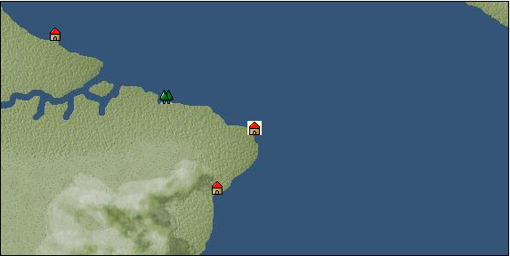

# Port: ペルナンブコ

import Tabs from '@theme/Tabs';
import TabItem from '@theme/TabItem';

## General Information

| Attribute | Details |
| :--- | :--- |
| **Port Name** | pernambuco |
| **Port Type** | 開拓地 |
| **Region** | Caribbean/Central America |
| **Sea Area** | Off Cape San Roque |
| **Required Language** | portuguese |
| **Coordinates** | （14817，5066） |
| **Investment Reward** | [Lot (NO.11)](Items/Consumables/Consumables-Treasure-Chests/item_2896.md) （必要投資額：500,000ドゥカード） |

### Available Facilities

| guild | intermediary | exchange | tool shop | workshop craftsman | Painter | sculptor | peddler |
| --- | --- | --- | --- | --- | --- | --- | --- |
|   |   | ○ | ○ | ○ | ○ | ○ | ○ |
| Shipyard Master | Lumbermaker | Sail-maker | weapon craftsman | master | TavernFemale | archive | salesperson |
| --- | --- | --- | --- | --- | --- | --- | --- |
| ○ | ○ | ○ | ○ | ○ |   | ○ |   |
| Shipwright | 銀行 | street worker | 王宮 | Trading post | church | suburbs | translator |
| --- | --- | --- | --- | --- | --- | --- | --- |
| ○ | ○ | ○ |   |   |   |   |   |

### Description
A port city located on the eastern coast of the South American continent. It developed as a center of Atlantic trade. *Portuguese territory Secretary, Master cook, Skilled seamstress, Skilled foundry worker, Dock manager Cultural area: East coast of Central and South America

<Tabs>
  <TabItem value="trade_goods_sales" label="Trade Goods Sales">

| item | group | purchase price | 同盟時 | remarks |
| --- | --- | --- | --- | --- |
| [sugar cane](Items/Trade Goods/TradeGoods-Foodstuffs/item_93.md) | [Trading items (food items)](Categories/category_3.md) | 218 | 192 |  |
| [sherry](Items/Trade Goods/TradeGoods-Alcohol/item_844.md) | [交易品（酒類）](Categories/category_9.md) | (1,162) | 1,017 |  |
| 要投資（必要投資額：400,000） |
| [tobacco](Items/Trade Goods/TradeGoods-Sunddries/item_109.md) | [Trading goods (hobby goods)](Categories/category_10.md) | (947) | 829 |  |
| 要投資（必要投資額：320,000） |
| [corn](Items/Trade Goods/TradeGoods-Foodstuffs/item_138.md) | [Trading items (food items)](Categories/category_3.md) | (54) | 48 |  |
| 要投資（必要投資額：180,000） |
| [pig](Items/Trade Goods/TradeGoods-Livestock/item_37.md) | [Trading Goods (Livestock)](Categories/category_18.md) | (64) | 56 |  |
| 要投資（必要投資額：120,000） |
| [Yerba mate tea](Items/Trade Goods/TradeGoods-Sunddries/item_1808.md) | [Trading goods (hobby goods)](Categories/category_10.md) | 264 | 232 |  |
| [log](Items/Trade Goods/TradeGoods-Wares/item_846.md) | [交易品（工業品）](Categories/category_19.md) | 259 | 228 |  |
| [leather](Items/Trade Goods/TradeGoods-Fibers/item_44.md) | [交易品（繊維）](Categories/category_1.md) | (425) | 372 |  |
| 要投資（必要投資額：210,000） |
| [cotton](Items/Trade Goods/TradeGoods-Fibers/item_610.md) | [交易品（繊維）](Categories/category_1.md) | 305 | 268 |  |
  </TabItem>
  <TabItem value="sale_specialty" label="Sale (Specialty)">

| item | group | sale price | 同盟時 | remarks |
| --- | --- | --- | --- | --- |

#### [交易品（繊維）](Categories/category_1.md)

| [Green ramie](Items/Trade Goods/TradeGoods-Fibers/item_3428.md) | 交易品（繊維） | 21,757 | (24,479) |  |
| [deerskin](Items/Trade Goods/TradeGoods-Fibers/item_3648.md) | 交易品（繊維） | 20,834 | (23,440) |  |

#### [Trading Goods (Dye)](Categories/category_2.md)

| [ward](Items/Trade Goods/TradeGoods-Dye/item_57.md) | Trading Goods (Dye) | 2,114 | (2,378) |  |
| [Shorou](Items/Trade Goods/TradeGoods-Dye/item_3691.md) | Trading Goods (Dye) | (18,395) | 21,464 |  |

#### [Trading products (medical products)](Categories/category_6.md)

| [mercury agent](Items/Trade Goods/TradeGoods-Medicine/item_703.md) | Trading products (medical products) | 2,635 | (2,964) |  |

#### [交易品（酒類）](Categories/category_9.md)

| [aquavit](Items/Trade Goods/TradeGoods-Alcohol/item_572.md) | 交易品（酒類） | 1,412 | (1,588) |  |
| [whiskey](Items/Trade Goods/TradeGoods-Alcohol/item_1.md) | 交易品（酒類） | 1,594 | 1,770 |  |
| [gin](Items/Trade Goods/TradeGoods-Alcohol/item_291.md) | 交易品（酒類） | 1,579 | (1,776) |  |
| [fruit brandy](Items/Trade Goods/TradeGoods-Alcohol/item_1440.md) | 交易品（酒類） | 1,210 | (1,361) |  |
| [Taiwan rice wine](Items/Trade Goods/TradeGoods-Alcohol/item_3672.md) | 交易品（酒類） | 20,462 | (23,021) |  |
| [Sake](Items/Trade Goods/TradeGoods-Alcohol/item_3424.md) | 交易品（酒類） | 21,385 | 35,556 |  |

#### [Trading goods (hobby goods)](Categories/category_10.md)

| [Aigyoku](Items/Trade Goods/TradeGoods-Sunddries/item_3677.md) | Trading goods (hobby goods) | 20,455 | (23,014) |  |
| [almond](Items/Trade Goods/TradeGoods-Sunddries/item_367.md) | Trading goods (hobby goods) | 339 | (381) |  |
| [eggplant](Items/Trade Goods/TradeGoods-Sunddries/item_3426.md) | Trading goods (hobby goods) | (18,284) | 21,334 |  |
| [dried figs](Items/Trade Goods/TradeGoods-Sunddries/item_611.md) | Trading goods (hobby goods) | (513) | 598 |  |

#### [Trading Goods (Spices)](Categories/category_11.md)

| [daffodil](Items/Trade Goods/TradeGoods-Perfume/item_612.md) | Trading Goods (Spices) | (1,337) | 1,560 |  |
| [lira](Items/Trade Goods/TradeGoods-Perfume/item_30.md) | Trading Goods (Spices) | 1,434 | (1,613) |  |

#### [Trading Goods (Spices)](Categories/category_12.md)

| [nutmeg](Items/Trade Goods/TradeGoods-Spices/item_1969.md) | Trading Goods (Spices) | (4,480) | 5,227 |  |
| [Grapefruit](Items/Trade Goods/TradeGoods-Spices/item_3422.md) | Trading Goods (Spices) | (19,939) | 23,266 |  |

#### [交易品（美術品）](Categories/category_14.md)

| [taiwan wood carving](Items/Trade Goods/TradeGoods-Art/item_3697.md) | 交易品（美術品） | 19,742 | (22,211) |  |

#### [Trading Items (Gemstones)](Categories/category_15.md)

| [pink diamond](Items/Trade Goods/TradeGoods-Gems/item_2874.md) | Trading Items (Gemstones) | 11,600 | (13,051) |  |
| [amethyst](Items/Trade Goods/TradeGoods-Gems/item_3434.md) | Trading Items (Gemstones) | (32,297) | 37,686 |  |

#### [Trading Items (Arms)](Categories/category_16.md)

| [damascus sword](Items/Trade Goods/TradeGoods-Weapons/item_903.md) | Trading Items (Arms) | (10,581) | 12,346 |  |

#### [Trading Items (Firearms)](Categories/category_17.md)

| [musket gun](Items/Trade Goods/TradeGoods-Firearms/item_584.md) | Trading Items (Firearms) | 5,640 | 6,076 |  |
| [tanegashima gun](Items/Trade Goods/TradeGoods-Firearms/item_3423.md) | Trading Items (Firearms) | (19,694) | 22,979 |  |

#### [Trading Goods (Livestock)](Categories/category_18.md)

| [boar](Items/Trade Goods/TradeGoods-Livestock/item_3476.md) | Trading Goods (Livestock) | (17,912) | 20,900 |  |

#### [交易品（工業品）](Categories/category_19.md)

| [papyrus](Items/Trade Goods/TradeGoods-Wares/item_616.md) | 交易品（工業品） | (708) | 826 |  |
| [Japanese paper](Items/Trade Goods/TradeGoods-Wares/item_3438.md) | 交易品（工業品） | (30,442) | 35,521 |  |
| [marble](Items/Trade Goods/TradeGoods-Wares/item_52.md) | 交易品（工業品） | (2,290) | 2,671 |  |
| [paint](Items/Trade Goods/TradeGoods-Wares/item_3411.md) | 交易品（工業品） | (1,870) | 2,182 |  |

#### [交易品（織物）](Categories/category_20.md)

| [indian chintz](Items/Trade Goods/TradeGoods-Fabrics/item_159.md) | 交易品（織物） | 2,334 | (2,626) |  |
| [dutch calico](Items/Trade Goods/TradeGoods-Fabrics/item_1435.md) | 交易品（織物） | 2,300 | (2,587) |  |
| [damask](Items/Trade Goods/TradeGoods-Fabrics/item_614.md) | 交易品（織物） | (5,653) | 6,596 |  |
| [velvet](Items/Trade Goods/TradeGoods-Fabrics/item_902.md) | 交易品（織物） | 5,654 | (6,361) |  |
  </TabItem>
  <TabItem value="sale_no_specialty" label="Sale (No Specialty)">

| item | group | sale price | 同盟時 | remarks |
| --- | --- | --- | --- | --- |

#### [交易品（繊維）](Categories/category_1.md)

| [numb](Items/Trade Goods/TradeGoods-Fibers/item_900.md) | 交易品（繊維） | 12 | (13) |  |

#### [Trading items (food items)](Categories/category_3.md)

| [crab](Items/Trade Goods/TradeGoods-Foodstuffs/item_873.md) | Trading items (food items) | 62 | (69) |  |
| [Cassava](Items/Trade Goods/TradeGoods-Foodstuffs/item_1805.md) | Trading items (food items) | 73 | (82) |  |
| [Jambu](Items/Trade Goods/TradeGoods-Foodstuffs/item_1827.md) | Trading items (food items) | 179 | (201) |  |
| [sausage](Items/Trade Goods/TradeGoods-Foodstuffs/item_27.md) | Trading items (food items) | (556) | 648 |  |
| [ham](Items/Trade Goods/TradeGoods-Foodstuffs/item_290.md) | Trading items (food items) | 673 | 714 |  |
| [bacon](Items/Trade Goods/TradeGoods-Foodstuffs/item_566.md) | Trading items (food items) | 604 | (679) |  |
| [pork](Items/Trade Goods/TradeGoods-Foodstuffs/item_41.md) | Trading items (food items) | (534) | 623 |  |
| [魚肉](Items/Trade Goods/TradeGoods-Foodstuffs/item_10.md) | Trading items (food items) | 185 | (208) |  |

#### [交易品（調味料）](Categories/category_4.md)

| [almond oil](Items/Trade Goods/TradeGoods-Seasonings/item_578.md) | 交易品（調味料） | (845) | 985 |  |
| [coconut vinegar](Items/Trade Goods/TradeGoods-Seasonings/item_1988.md) | 交易品（調味料） | 499 | (561) |  |
| [sugar](Items/Trade Goods/TradeGoods-Seasonings/item_94.md) | 交易品（調味料） | 991 | 1,057 |  |

#### [Trading Items (Iron Stone)](Categories/category_7.md)

| [iron ore](Items/Trade Goods/TradeGoods-Minerals/item_146.md) | Trading Items (Iron Stone) | 881 | (991) |  |
| [copper ore](Items/Trade Goods/TradeGoods-Minerals/item_65.md) | Trading Items (Iron Stone) | 900 | (1,012) |  |

#### [Trading products (precious metals)](Categories/category_8.md)

| [gold](Items/Trade Goods/TradeGoods-Metals/item_659.md) | Trading products (precious metals) | 2,758 | 2,755 |  |
| [silver](Items/Trade Goods/TradeGoods-Metals/item_136.md) | Trading products (precious metals) | 1,380 | (1,552) |  |

#### [交易品（酒類）](Categories/category_9.md)

| [tequila](Items/Trade Goods/TradeGoods-Alcohol/item_108.md) | 交易品（酒類） | (1,024) | 1,194 |  |
| [brandy](Items/Trade Goods/TradeGoods-Alcohol/item_9.md) | 交易品（酒類） | (1,349) | 1,574 |  |
| [rum](Items/Trade Goods/TradeGoods-Alcohol/item_139.md) | 交易品（酒類） | 602 | (677) |  |
| [wine](Items/Trade Goods/TradeGoods-Alcohol/item_11.md) | 交易品（酒類） | 675 | (759) |  |

#### [Trading goods (hobby goods)](Categories/category_10.md)

| [pineapple](Items/Trade Goods/TradeGoods-Sunddries/item_867.md) | Trading goods (hobby goods) | 1,037 | (1,166) |  |

#### [Trading Goods (Spices)](Categories/category_11.md)

| [rose](Items/Trade Goods/TradeGoods-Perfume/item_536.md) | Trading Goods (Spices) | (3,817) | 4,453 |  |
| [Ryushu incense](Items/Trade Goods/TradeGoods-Perfume/item_101.md) | Trading Goods (Spices) | 2,381 | (2,678) |  |

#### [Trading Goods (Spices)](Categories/category_12.md)

| [allspice](Items/Trade Goods/TradeGoods-Spices/item_1848.md) | Trading Goods (Spices) | 454 | (510) |  |
| [vanilla](Items/Trade Goods/TradeGoods-Spices/item_1810.md) | Trading Goods (Spices) | 436 | (490) |  |

#### [Trading goods (artificial goods)](Categories/category_13.md)

| [Tumbaga](Items/Trade Goods/TradeGoods-Luxuries/item_3028.md) | Trading goods (artificial goods) | (5,150) | 6,009 |  |
| [皮革製品](Items/Trade Goods/TradeGoods-Luxuries/item_12.md) | Trading goods (artificial goods) | 1,373 | (1,544) |  |
| [luxury furniture](Items/Trade Goods/TradeGoods-Luxuries/item_1048.md) | Trading goods (artificial goods) | 2,541 | (2,858) |  |

#### [交易品（美術品）](Categories/category_14.md)

| [wooden statue](Items/Trade Goods/TradeGoods-Art/item_95.md) | 交易品（美術品） | (987) | 1,151 |  |

#### [Trading Items (Gemstones)](Categories/category_15.md)

| [opal](Items/Trade Goods/TradeGoods-Gems/item_2006.md) | Trading Items (Gemstones) | 2,674 | (3,008) |  |

#### [Trading Items (Arms)](Categories/category_16.md)

| [dagger](Items/Trade Goods/TradeGoods-Weapons/item_143.md) | Trading Items (Arms) | 943 | (1,060) |  |

#### [Trading Items (Firearms)](Categories/category_17.md)

| [arquebus gun](Items/Trade Goods/TradeGoods-Firearms/item_14.md) | Trading Items (Firearms) | 2,727 | (3,068) |  |
| [大砲](Items/Trade Goods/TradeGoods-Firearms/item_4.md) | Trading Items (Firearms) | 5,185 | 5,574 |  |
| [bullet](Items/Trade Goods/TradeGoods-Firearms/item_13.md) | Trading Items (Firearms) | 1,225 | (1,378) |  |
| [cannonball](Items/Trade Goods/TradeGoods-Firearms/item_144.md) | Trading Items (Firearms) | 1,731 | 1,763 |  |

#### [Trading Goods (Livestock)](Categories/category_18.md)

| [rat](Items/Trade Goods/TradeGoods-Livestock/item_2710.md) | Trading Goods (Livestock) | 18 | (20) |  |

#### [交易品（工業品）](Categories/category_19.md)

| [wood](Items/Trade Goods/TradeGoods-Wares/item_277.md) | 交易品（工業品） | 745 | 809 |  |

#### [交易品（織物）](Categories/category_20.md)

| [Nishijin textile](Items/Trade Goods/TradeGoods-Fabrics/item_3431.md) | 交易品（織物） | (31,567) | 36,834 |  |
  </TabItem>
  <TabItem value="guild_&_others" label="Guild & Others">

| item | group | Sales price | Handling NPC | remarks |
| --- | --- | --- | --- | --- |

#### others

| [master caribbean cuisine](Items/Recipe Book/item_2847.md) | [recipe book](Categories/category_22.md) | Fixed recipe |  |  |
| cooking master |
| [Advanced sewing technology](Items/Recipe Book/item_2849.md) | [recipe book](Categories/category_22.md) | Fixed recipe |  |  |
| Owned by a skilled casting engineer |
| [Advanced casting technology](Items/Recipe Book/item_2848.md) | [recipe book](Categories/category_22.md) | Fixed recipe |  |  |
| Owned by a skilled casting engineer |
  </TabItem>
  <TabItem value="toolman" label="Toolman">

| item | group | Sales price | Handling NPC | remarks |
| --- | --- | --- | --- | --- |

#### [recipe book](Categories/category_22.md)

| [How to make a corolla](Items/Recipe Book/item_1806.md) | recipe book | Fixed recipe | tool shop owner |  |

#### [Equipment (body)](Categories/category_24.md)

| [Surcoat](Items/Equipment/Equipment-Body/item_131.md) | Equipment (body) | 30,000 | tool shop owner |  |

#### [Equipment (legs)](Categories/category_26.md)

| [boots](Items/Equipment/Equipment-Feet/item_365.md) | Equipment (legs) | 100 | tool shop owner |  |

#### [Equipment (belongings)](Categories/category_27.md)

| [long sword](Items/Equipment/Equipment-Weapon/item_302.md) | Equipment (belongings) | 15,400 | tool shop owner |  |

#### [装備品（服飾品）](Categories/category_28.md)

| [jade ring](Items/Equipment/Equipment-Accessory/item_1955.md) | 装備品（服飾品） | 7,000,000 | tool shop owner |  |
| 要投資（必要投資額：240,000） |

#### [Consumables (land battle/deck battle)](Categories/category_29.md)

| [Taheebo juice](Items/Consumables/Consumables-Landbattle/item_1807.md) | Consumables (land battle/deck battle) | 300 | tool shop owner |  |
| [tonic](Items/Consumables/Consumables-Landbattle/item_1678.md) | Consumables (land battle/deck battle) | 300 | tool shop owner |  |

#### [Consumables (other)](Categories/category_44.md)

| [black powder](Items/Consumables/Consumables-Other/item_1954.md) | Consumables (other) | 1,000 | tool shop owner |  |
  </TabItem>
  <TabItem value="kobo_craftsmen" label="Craftsman">

| item | group | Sales price | Handling NPC | remarks |
| --- | --- | --- | --- | --- |

#### [Consumables (condition recovery)](Categories/category_21.md)

| [Nostalgic carillon bell](Items/Consumables/Consumables-Recovery/item_245.md) | Consumables (condition recovery) | 200 | workshop craftsman |  |
| [Ship song sheet music](Items/Consumables/Consumables-Recovery/item_247.md) | Consumables (condition recovery) | 200 | workshop craftsman |  |

#### [recipe book](Categories/category_22.md)

| [Furniture manufacturing/Caribbean edition](Items/Recipe Book/item_1951.md) | recipe book | Fixed recipe | workshop craftsman |  |

#### [Consumables (other)](Categories/category_44.md)

| [帆塗料](Items/Consumables/Consumables-Other/item_348.md) | Consumables (other) | 500 | workshop craftsman |  |
| [ship paint](Items/Consumables/Consumables-Other/item_347.md) | Consumables (other) | 500 | workshop craftsman |  |

#### [furniture](Categories/category_48.md)

| [caribbean style costume box](Items/Furniture/item_2088.md) | furniture | Fixed recipe | workshop craftsman |  |
| [food basket](Items/Furniture/item_2089.md) | furniture | Fixed recipe | workshop craftsman |  |
| [Open rack for small items](Items/Furniture/item_2219.md) | furniture | Fixed recipe | workshop craftsman |  |
| [Stone monument for book stand](Items/Furniture/item_1952.md) | furniture | Fixed recipe | workshop craftsman |  |
| [cat car](Items/Furniture/item_2090.md) | furniture | Fixed recipe | workshop craftsman |  |
  </TabItem>
  <TabItem value="Painter" label="Painter">

| item | group | Sales price | Handling NPC | remarks |
| --- | --- | --- | --- | --- |

#### [Ship parts (emblem)](Categories/category_36.md)

| [admiral](Items/Ship Parts/Shipparts-Crests/item_548.md) | Ship parts (emblem) | 5,000 | Painter |  |
| [anchor](Items/Ship Parts/Shipparts-Crests/item_549.md) | Ship parts (emblem) | 5,000 | Painter |  |
| [whale](Items/Ship Parts/Shipparts-Crests/item_792.md) | Ship parts (emblem) | 5,000 | Painter |  |
| [sun](Items/Ship Parts/Shipparts-Crests/item_597.md) | Ship parts (emblem) | 5,000 | Painter |  |
| [circle cross](Items/Ship Parts/Shipparts-Crests/item_544.md) | Ship parts (emblem) | 5,000 | Painter |  |
| [shellfish](Items/Ship Parts/Shipparts-Crests/item_546.md) | Ship parts (emblem) | 5,000 | Painter |  |
| [Delphine](Items/Ship Parts/Shipparts-Crests/item_542.md) | Ship parts (emblem) | 5,000 | Painter |  |
| [fisherman](Items/Ship Parts/Shipparts-Crests/item_545.md) | Ship parts (emblem) | 5,000 | Painter |  |
  </TabItem>
  <TabItem value="sculptor" label="sculptor">

| item | group | Sales price | Handling NPC | remarks |
| --- | --- | --- | --- | --- |

#### [recipe book](Categories/category_22.md)

| [Saint statue creation, part 2](Items/Recipe Book/item_2159.md) | recipe book | Fixed recipe | sculptor |  |

#### [Ship parts (figurehead)](Categories/category_34.md)

| [dolphin statue](Items/Ship Parts/Shipparts-Figurehead/item_169.md) | Ship parts (figurehead) | 500 | sculptor |  |
| [whale statue](Items/Ship Parts/Shipparts-Figurehead/item_172.md) | Ship parts (figurehead) | 12,000 | sculptor |  |
| [shark statue](Items/Ship Parts/Shipparts-Figurehead/item_171.md) | Ship parts (figurehead) | 8,600 | sculptor |  |
| [killer whale statue](Items/Ship Parts/Shipparts-Figurehead/item_170.md) | Ship parts (figurehead) | 8,600 | sculptor |  |
| [Tobi statue](Items/Ship Parts/Shipparts-Figurehead/item_287.md) | Ship parts (figurehead) | 500 | sculptor |  |
| [maiden statue](Items/Ship Parts/Shipparts-Figurehead/item_167.md) | Ship parts (figurehead) | 13,000 | sculptor |  |
| [statue of a great man](Items/Ship Parts/Shipparts-Figurehead/item_717.md) | Ship parts (figurehead) | 60,000 | sculptor |  |
| [statue of the brave](Items/Ship Parts/Shipparts-Figurehead/item_716.md) | Ship parts (figurehead) | 60,000 | sculptor |  |
| [angel statue](Items/Ship Parts/Shipparts-Figurehead/item_168.md) | Ship parts (figurehead) | 13,000 | sculptor |  |
| [statue of tenryu](Items/Ship Parts/Shipparts-Figurehead/item_630.md) | Ship parts (figurehead) | 62,000 | sculptor |  |
| [statue of goddess](Items/Ship Parts/Shipparts-Figurehead/item_721.md) | Ship parts (figurehead) | 60,000 | sculptor |  |
| [sea ​​turtle statue](Items/Ship Parts/Shipparts-Figurehead/item_173.md) | Ship parts (figurehead) | 1,800 | sculptor |  |
| [sea ​​monster statue](Items/Ship Parts/Shipparts-Figurehead/item_628.md) | Ship parts (figurehead) | 62,000 | sculptor |  |
| [statue of sea god](Items/Ship Parts/Shipparts-Figurehead/item_720.md) | Ship parts (figurehead) | 60,000 | sculptor |  |
| [statue of king](Items/Ship Parts/Shipparts-Figurehead/item_718.md) | Ship parts (figurehead) | 60,000 | sculptor |  |
| [saint barbara statue](Items/Ship Parts/Shipparts-Figurehead/item_2160.md) | Ship parts (figurehead) | Fixed recipe | sculptor |  |
  </TabItem>
  <TabItem value="shipyard" label="Shipyard">

### Shipyard Master

| item | group | Sales price | Handling NPC | remarks |
| --- | --- | --- | --- | --- |

#### [recipe book](Categories/category_22.md)

| [Book of Shipbuilding Materials and Hulls Volume 3](Items/Recipe Book/item_1818.md) | recipe book | Fixed recipe | Shipyard Master |  |

#### [Boat](Categories/category_43.md)

| [Varsha](Items/Ships/item_201.md) | Boat | 2,000 | Shipyard Master |  |

#### [shipbuilding materials](Categories/category_47.md)

| [2-deck type large hull](Items/Shipbuilding FS Material/item_1820.md) | shipbuilding materials | Fixed recipe | Shipyard Master |  |
| [3-deck type large hull](Items/Shipbuilding FS Material/item_2087.md) | shipbuilding materials | Fixed recipe | Shipyard Master |  |
| [Flat deck type large hull](Items/Shipbuilding FS Material/item_1819.md) | shipbuilding materials | Fixed recipe | Shipyard Master |  |

### Lumbermaker

| item | group | Sales price | Handling NPC | remarks |
| --- | --- | --- | --- | --- |

#### [recipe book](Categories/category_22.md)

| [Book of Shipbuilding Materials and Crafts Volume 3](Items/Recipe Book/item_1924.md) | recipe book | Fixed recipe | Lumbermaker |  |

#### [Ship parts (additional armor)](Categories/category_35.md)

| [rosewood plank](Items/Ship Parts/Shipparts-Plates/item_815.md) | Ship parts (additional armor) | 100,000 | Lumbermaker |  |

#### [shipbuilding materials](Categories/category_47.md)

| [large mast](Items/Shipbuilding FS Material/item_1925.md) | shipbuilding materials | Fixed recipe | Lumbermaker |  |

### Sail-maker

| item | group | Sales price | Handling NPC | remarks |
| --- | --- | --- | --- | --- |

#### [recipe book](Categories/category_22.md)

| [Book of Shipbuilding Materials and Sewing Volume 3](Items/Recipe Book/item_1913.md) | recipe book | Fixed recipe | Sail-maker |  |

#### [shipbuilding materials](Categories/category_47.md)

| [large gaff sail](Items/Shipbuilding FS Material/item_1917.md) | shipbuilding materials | Fixed recipe | Sail-maker |  |
| [large square sail](Items/Shipbuilding FS Material/item_1916.md) | shipbuilding materials | Fixed recipe | Sail-maker |  |
| [large lateen sail](Items/Shipbuilding FS Material/item_1915.md) | shipbuilding materials | Fixed recipe | Sail-maker |  |

### Shipwright

| item | group | Sales price | Handling NPC | remarks |
| --- | --- | --- | --- | --- |

#### [recipe book](Categories/category_22.md)

| [Shipbuilding materials and processed wood](Items/Recipe Book/item_1774.md) | recipe book | Fixed recipe | Shipwright |  |

#### [shipbuilding materials](Categories/category_47.md)

| [processed wood](Items/Shipbuilding FS Material/item_1695.md) | shipbuilding materials | Fixed recipe | Shipwright |  |
  </TabItem>
  <TabItem value="weapon craftsman" label="weapon craftsman">

| item | group | Sales price | Handling NPC | remarks |
| --- | --- | --- | --- | --- |

#### [recipe book](Categories/category_22.md)

| [Book of Shipbuilding Materials and Casting Volume 3](Items/Recipe Book/item_1912.md) | recipe book | Fixed recipe | weapon craftsman |  |

#### [shipbuilding materials](Categories/category_47.md)

| [改良大型砲門](Items/Shipbuilding FS Material/item_1914.md) | shipbuilding materials | Fixed recipe | weapon craftsman |  |
  </TabItem>
  <TabItem value="dock manager" label="dock manager">

| item | group | Sales price | Handling NPC | remarks |
| --- | --- | --- | --- | --- |

#### [recipe book](Categories/category_22.md)

| [造船技術研究成果](Items/Recipe Book/item_2850.md) | recipe book | Fixed recipe | dock manager |  |

#### [shipbuilding materials](Categories/category_47.md)

| [lifeboat](Items/Shipbuilding FS Material/item_2846.md) | shipbuilding materials | Fixed recipe | dock manager |  |
| [Sewing tools set](Items/Shipbuilding FS Material/item_2879.md) | shipbuilding materials | Fixed recipe | dock manager |  |
| [shipwright's room](Items/Shipbuilding FS Material/item_2880.md) | shipbuilding materials | Fixed recipe | dock manager |  |
  </TabItem>
  <TabItem value="scholar" label="scholar">

| item | group | Sales price | Handling NPC | remarks |
| --- | --- | --- | --- | --- |

#### [recipe book](Categories/category_22.md)

| [How to make an American language dictionary](Items/Recipe Book/item_2119.md) | recipe book | Fixed recipe | scholar |  |
| 要投資（必要投資額：不明） |
  </TabItem>
</Tabs>