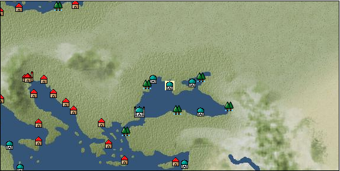

# Port: セヴァストポリ

import Tabs from '@theme/Tabs';
import TabItem from '@theme/TabItem';

## General Information

| Attribute | Details |
| :--- | :--- |
| **Port Name** | Sevastopol |
| **Port Type** | port of alliance |
| **Region** | eastern europe |
| **Sea Area** | Black Sea |
| **Required Language** | turkish |
| **Coordinates** | （1501，2867） |
| **Investment Reward** | [Lot (NO.2)](docs/Items/Consumables/Consumables-Treasure-Chests/item_3016.md) （必要投資額：300,000ドゥカード） |

### Available Facilities

| guild | intermediary | exchange | tool shop | workshop craftsman | Painter | sculptor | peddler |
| --- | --- | --- | --- | --- | --- | --- | --- |
|   |   | ○ | ○ |   |   |   | ○ |
| Shipyard Master | Lumbermaker | Sail-maker | weapon craftsman | master | TavernFemale | archive | salesperson |
| --- | --- | --- | --- | --- | --- | --- | --- |
|   |   |   |   | ○ |   |   |   |
| Shipwright | 銀行 | street worker | 王宮 | Trading post | church | suburbs | translator |
| --- | --- | --- | --- | --- | --- | --- | --- |
| ○ | ○ | ○ |   |   |   |   |   |

### Description
A port city located on the Crimean Peninsula, facing the Black Sea. Cultural area: Türkiye

<Tabs>
  <TabItem value="trade_goods_sales" label="Trade Goods Sales">

| item | group | purchase price | 同盟時 | remarks |
| --- | --- | --- | --- | --- |
| [dog saffron](docs/Items/TradeGoods/TradeGoods-Medicine/item_1055.md) | [Trading products (medical products)](docs/Categories/category_6.md) | (384) | 336 |  |
| 要投資（必要投資額：500,000） |
| [cow](docs/Items/TradeGoods/TradeGoods-Livestock/item_17.md) | [Trading Goods (Livestock)](docs/Categories/category_18.md) | (320) | 280 |  |
| When in alliance: confirmed at 100% |
| [lapis lazuli](docs/Items/TradeGoods/TradeGoods-Gems/item_995.md) | [Trading Items (Gemstones)](docs/Categories/category_15.md) | 4,956 | (4,336) |  |
| 時代限定（16世紀第3期、16世紀第4期、16世紀第5期） |
| [barley](docs/Items/TradeGoods/TradeGoods-Foodstuffs/item_124.md) | [Trading items (food items)](docs/Categories/category_3.md) | 37 | 32 |  |
| When in alliance: confirmed at 100% |
| [wheat](docs/Items/TradeGoods/TradeGoods-Foodstuffs/item_16.md) | [Trading items (food items)](docs/Categories/category_3.md) | 45 | 40 |  |
| [beef](docs/Items/TradeGoods/TradeGoods-Foodstuffs/item_26.md) | [Trading items (food items)](docs/Categories/category_3.md) | 647 | 568 |  |
| When in alliance: confirmed at 100% |
| [iron ore](docs/Items/TradeGoods/TradeGoods-Minerals/item_146.md) | [Trading Items (Iron Stone)](docs/Categories/category_7.md) | 647 | 568 |  |
| Investment required (Required investment amount: 240,000) At alliance: Confirmed at 100% |
| [鋼](docs/Items/TradeGoods/TradeGoods-Wares/item_573.md) | [交易品（工業品）](docs/Categories/category_19.md) | 1,059 | (927) |  |
| 要投資（必要投資額：720,000） |
  </TabItem>
  <TabItem value="sale_specialty" label="Sale (Specialty)">

| item | group | sale price | 同盟時 | remarks |
| --- | --- | --- | --- | --- |

#### [交易品（繊維）](docs/Categories/category_1.md)

| [sisal hemp](docs/Items/TradeGoods/TradeGoods-Fibers/item_1766.md) | 交易品（繊維） | (341) | 397 |  |
| When in alliance: confirmed at 100% |
| [Panya](docs/Items/TradeGoods/TradeGoods-Fibers/item_2097.md) | 交易品（繊維） | (706) | 823 |  |
| When in alliance: confirmed at 100% |
| [flax](docs/Items/TradeGoods/TradeGoods-Fibers/item_64.md) | 交易品（繊維） | (302) | 352 |  |
| [feather](docs/Items/TradeGoods/TradeGoods-Fibers/item_585.md) | 交易品（繊維） | (875) | 1,020 |  |
| 98%＝999　102%＝1030 |

#### [Trading Goods (Dye)](docs/Categories/category_2.md)

| [ward](docs/Items/TradeGoods/TradeGoods-Dye/item_57.md) | Trading Goods (Dye) | (1,183) | 1,380 |  |
| 103%＝1430 |
| [turmeric](docs/Items/TradeGoods/TradeGoods-Dye/item_1433.md) | Trading Goods (Dye) | (628) | 732 |  |
| When in alliance: confirmed at 100% |
| [mayan blue](docs/Items/TradeGoods/TradeGoods-Dye/item_1096.md) | Trading Goods (Dye) | (1,449) | 1,690 |  |
| 98%＝1670 |

#### [Trading products (medical products)](docs/Categories/category_6.md)

| [tea tree](docs/Items/TradeGoods/TradeGoods-Medicine/item_2283.md) | Trading products (medical products) | (1,397) | 1,630 |  |
| When in alliance: confirmed at 100% |
| [Noni](docs/Items/TradeGoods/TradeGoods-Medicine/item_2099.md) | Trading products (medical products) | (1,217) | 1,420 |  |
| When in alliance: confirmed at 100% |

#### [Trading goods (hobby goods)](docs/Categories/category_10.md)

| [cacao](docs/Items/TradeGoods/TradeGoods-Sunddries/item_140.md) | Trading goods (hobby goods) | (1,363) | 1,590 |  |
| 98%＝1570 |
| [cashew nuts](docs/Items/TradeGoods/TradeGoods-Sunddries/item_2120.md) | Trading goods (hobby goods) | (952) | 1,110 |  |
| When in alliance: confirmed at 100% |
| [mango](docs/Items/TradeGoods/TradeGoods-Sunddries/item_2095.md) | Trading goods (hobby goods) | (840) | 979 |  |
| When in alliance: confirmed at 100% |
| [black tea](docs/Items/TradeGoods/TradeGoods-Sunddries/item_675.md) | Trading goods (hobby goods) | (2,040) | 2,380 |  |
| 98%=2350　104%＝2450 |

#### [Trading Goods (Spices)](docs/Categories/category_11.md)

| [ylang ylang](docs/Items/TradeGoods/TradeGoods-Perfume/item_1434.md) | Trading Goods (Spices) | (1,860) | 2,170 |  |
| 98%＝2140　103%＝2220 |
| [jasmine](docs/Items/TradeGoods/TradeGoods-Perfume/item_772.md) | Trading Goods (Spices) | (5,494) | 6,410 |  |
| 98%＝6340 |
| [geranium](docs/Items/TradeGoods/TradeGoods-Perfume/item_145.md) | Trading Goods (Spices) | (1,277) | 1,490 |  |
| 98%＝1460　102%＝1510 |
| [eucalyptus](docs/Items/TradeGoods/TradeGoods-Perfume/item_2278.md) | Trading Goods (Spices) | (986) | 1,150 |  |
| When in alliance: confirmed at 100% |
| [lira](docs/Items/TradeGoods/TradeGoods-Perfume/item_30.md) | Trading Goods (Spices) | (1,166) | 1,360 |  |
| 98%＝1340　102%＝1380 |
| [mastic](docs/Items/TradeGoods/TradeGoods-Perfume/item_680.md) | Trading Goods (Spices) | (2,417) | 2,820 |  |
| 98%＝2790　104%＝2890 |
| [benzoin](docs/Items/TradeGoods/TradeGoods-Perfume/item_1962.md) | Trading Goods (Spices) | (1,740) | 2,030 |  |
| When in alliance: confirmed at 100% |
| [sandalwood](docs/Items/TradeGoods/TradeGoods-Perfume/item_771.md) | Trading Goods (Spices) | (3,694) | 4,310 |  |
| When in alliance: confirmed at 100% |
| [龍脳](docs/Items/TradeGoods/TradeGoods-Perfume/item_1676.md) | Trading Goods (Spices) | (2,820) | 3,290 |  |
| When in alliance: confirmed at 100% |

#### [Trading Goods (Spices)](docs/Categories/category_12.md)

| [allspice](docs/Items/TradeGoods/TradeGoods-Spices/item_1848.md) | Trading Goods (Spices) | (1,646) | 1,920 |  |
| When in alliance: confirmed at 100% |
| [cardamom](docs/Items/TradeGoods/TradeGoods-Spices/item_1431.md) | Trading Goods (Spices) | (3,137) | 3,660 |  |
| When in alliance: confirmed at 100% |
| [lemongrass](docs/Items/TradeGoods/TradeGoods-Spices/item_2096.md) | Trading Goods (Spices) | (2,914) | 3,400 |  |
| 98%＝3340　101%＝3430 |
| [chili pepper](docs/Items/TradeGoods/TradeGoods-Spices/item_1831.md) | Trading Goods (Spices) | (1,500) | 1,750 |  |
| 98%＝1720　102%＝1780 |
| [green chili pepper](docs/Items/TradeGoods/TradeGoods-Spices/item_1990.md) | Trading Goods (Spices) | (2,357) | 2,750 |  |
| 98%＝2700　104%＝2840 |

#### [Trading goods (artificial goods)](docs/Categories/category_13.md)

| [glasswork](docs/Items/TradeGoods/TradeGoods-Luxuries/item_60.md) | Trading goods (artificial goods) | (1,620) | 1,890 |  |
| When in alliance: confirmed at 100% |
| [Tumbaga](docs/Items/TradeGoods/TradeGoods-Luxuries/item_3028.md) | Trading goods (artificial goods) | (17,997) | 21,000 |  |
| 98%＝20700　107%＝22100 |

#### [Trading Items (Gemstones)](docs/Categories/category_15.md)

| [opal](docs/Items/TradeGoods/TradeGoods-Gems/item_2006.md) | Trading Items (Gemstones) | (8,296) | 9,680 |  |
| 98%＝9530 |
| [topaz](docs/Items/TradeGoods/TradeGoods-Gems/item_1097.md) | Trading Items (Gemstones) | (5,931) | 6,920 |  |
| 106%＝7220 |
| [amber](docs/Items/TradeGoods/TradeGoods-Gems/item_618.md) | Trading Items (Gemstones) | 4,561 | (5,131) |  |

#### [Trading Items (Firearms)](docs/Categories/category_17.md)

| [musket gun](docs/Items/TradeGoods/TradeGoods-Firearms/item_584.md) | Trading Items (Firearms) | (3,394) | 3,960 |  |
| When in alliance: confirmed at 100% |

#### [交易品（工業品）](docs/Categories/category_19.md)

| [rubber](docs/Items/TradeGoods/TradeGoods-Wares/item_2819.md) | 交易品（工業品） | (658) | 767 |  |
| When in alliance: confirmed at 100% |

#### [交易品（織物）](docs/Categories/category_20.md)

| [Awaiyo](docs/Items/TradeGoods/TradeGoods-Fabrics/item_3002.md) | 交易品（織物） | (8,742) | 10,200 |  |
| When in alliance: confirmed at 100% |
| [java chintz](docs/Items/TradeGoods/TradeGoods-Fabrics/item_1970.md) | 交易品（織物） | (3,806) | 4,440 |  |
| When in alliance: confirmed at 100% |
| [velvet](docs/Items/TradeGoods/TradeGoods-Fabrics/item_902.md) | 交易品（織物） | 4,055 | (4,562) |  |
  </TabItem>
  <TabItem value="sale_no_specialty" label="Sale (No Specialty)">

| item | group | sale price | 同盟時 | remarks |
| --- | --- | --- | --- | --- |

#### [交易品（繊維）](docs/Categories/category_1.md)

| [raw silk](docs/Items/TradeGoods/TradeGoods-Fibers/item_677.md) | 交易品（繊維） | 2,208 | (2,484) |  |

#### [Trading Goods (Dye)](docs/Categories/category_2.md)

| [persian berry](docs/Items/TradeGoods/TradeGoods-Dye/item_693.md) | Trading Goods (Dye) | (1,200) | 1,400 |  |
| 98%＝1370　103%＝1440 |
| [貝紫](docs/Items/TradeGoods/TradeGoods-Dye/item_110.md) | Trading Goods (Dye) | (3,712) | 4,331 |  |

#### [Trading items (food items)](docs/Categories/category_3.md)

| [sweet potato](docs/Items/TradeGoods/TradeGoods-Foodstuffs/item_1931.md) | Trading items (food items) | (228) | 266 |  |
| [tomato](docs/Items/TradeGoods/TradeGoods-Foodstuffs/item_1809.md) | Trading items (food items) | (272) | 317 |  |
| When in alliance: confirmed at 100% |

#### [Trading products (medical products)](docs/Categories/category_6.md)

| [anise](docs/Items/TradeGoods/TradeGoods-Medicine/item_1050.md) | Trading products (medical products) | (229) | 267 |  |
| When in alliance: confirmed at 100% |
| [senna](docs/Items/TradeGoods/TradeGoods-Medicine/item_155.md) | Trading products (medical products) | (353) | 411 |  |
| 98%＝403　103%＝424 |

#### [Trading products (precious metals)](docs/Categories/category_8.md)

| [gold](docs/Items/TradeGoods/TradeGoods-Metals/item_659.md) | Trading products (precious metals) | (8,099) | 9,450 |  |
| 98%＝9260 |
| [silver](docs/Items/TradeGoods/TradeGoods-Metals/item_136.md) | Trading products (precious metals) | (3,397) | 3,963 |  |

#### [Trading Goods (Spices)](docs/Categories/category_11.md)

| [lavender](docs/Items/TradeGoods/TradeGoods-Perfume/item_150.md) | Trading Goods (Spices) | 917 | (1,031) |  |
| [lemon oil](docs/Items/TradeGoods/TradeGoods-Perfume/item_151.md) | Trading Goods (Spices) | 697 | (784) |  |
| [Musk](docs/Items/TradeGoods/TradeGoods-Perfume/item_158.md) | Trading Goods (Spices) | (3,480) | 4,060 |  |
| When in alliance: confirmed at 100% |

#### [Trading Goods (Spices)](docs/Categories/category_12.md)

| [cumin](docs/Items/TradeGoods/TradeGoods-Spices/item_156.md) | Trading Goods (Spices) | (756) | 881 |  |
| 104%＝916 |
| [vanilla](docs/Items/TradeGoods/TradeGoods-Spices/item_1810.md) | Trading Goods (Spices) | (618) | 720 |  |
| 98%＝705 |

#### [Trading goods (artificial goods)](docs/Categories/category_13.md)

| [lapidary work](docs/Items/TradeGoods/TradeGoods-Luxuries/item_153.md) | Trading goods (artificial goods) | 5,163 | (5,808) |  |
| [silversmith](docs/Items/TradeGoods/TradeGoods-Luxuries/item_619.md) | Trading goods (artificial goods) | (3,171) | 3,700 |  |
| When in alliance: confirmed at 100% |

#### [交易品（美術品）](docs/Categories/category_14.md)

| [古美術品](docs/Items/TradeGoods/TradeGoods-Art/item_51.md) | 交易品（美術品） | 4,190 | (4,714) |  |
| [wooden statue](docs/Items/TradeGoods/TradeGoods-Art/item_95.md) | 交易品（美術品） | 1,066 | (1,199) |  |

#### [Trading Items (Gemstones)](docs/Categories/category_15.md)

| [emerald](docs/Items/TradeGoods/TradeGoods-Gems/item_777.md) | Trading Items (Gemstones) | (8,037) | 9,378 |  |
| 98%＝9190 |
| [coral](docs/Items/TradeGoods/TradeGoods-Gems/item_141.md) | Trading Items (Gemstones) | (3,147) | 3,671 |  |

#### [Trading Items (Arms)](docs/Categories/category_16.md)

| [damascus sword](docs/Items/TradeGoods/TradeGoods-Weapons/item_903.md) | Trading Items (Arms) | (4,303) | 5,020 |  |
| When in alliance: confirmed at 100% |
| [長弓](docs/Items/TradeGoods/TradeGoods-Weapons/item_1049.md) | Trading Items (Arms) | 769 | (865) |  |

#### [Trading Items (Firearms)](docs/Categories/category_17.md)

| [arquebus gun](docs/Items/TradeGoods/TradeGoods-Firearms/item_14.md) | Trading Items (Firearms) | 2,130 | (2,396) |  |
| [大砲](docs/Items/TradeGoods/TradeGoods-Firearms/item_4.md) | Trading Items (Firearms) | 3,855 | (4,337) |  |
| [bullet](docs/Items/TradeGoods/TradeGoods-Firearms/item_13.md) | Trading Items (Firearms) | 1,164 | (1,309) |  |
| [cannonball](docs/Items/TradeGoods/TradeGoods-Firearms/item_144.md) | Trading Items (Firearms) | 1,636 | 1,760 |  |

#### [交易品（工業品）](docs/Categories/category_19.md)

| [marble](docs/Items/TradeGoods/TradeGoods-Wares/item_52.md) | 交易品（工業品） | 1,372 | (1,543) |  |
| [wood](docs/Items/TradeGoods/TradeGoods-Wares/item_277.md) | 交易品（工業品） | (745) | 869 |  |
| [coal](docs/Items/TradeGoods/TradeGoods-Wares/item_359.md) | 交易品（工業品） | (456) | 531 |  |
| [iron material](docs/Items/TradeGoods/TradeGoods-Wares/item_268.md) | 交易品（工業品） | 964 | (1,084) |  |

#### [交易品（織物）](docs/Categories/category_20.md)

| [damask](docs/Items/TradeGoods/TradeGoods-Fabrics/item_614.md) | 交易品（織物） | (3,154) | 3,680 |  |
| When in alliance: confirmed at 100% |
| [muslin](docs/Items/TradeGoods/TradeGoods-Fabrics/item_581.md) | 交易品（織物） | (1,303) | 1,520 |  |
| When in alliance: confirmed at 100% |
| [cotton fabric](docs/Items/TradeGoods/TradeGoods-Fabrics/item_571.md) | 交易品（織物） | (960) | 1,120 |  |
| When in alliance: confirmed at 100% |
  </TabItem>
  <TabItem value="guild_&_others" label="Guild & Others">

| item | group | Sales price | Handling NPC | remarks |
| --- | --- | --- | --- | --- |
| There is no sales information for the item |
| --- |
  </TabItem>
  <TabItem value="toolman" label="Toolman">

| item | group | Sales price | Handling NPC | remarks |
| --- | --- | --- | --- | --- |

#### [Consumables (land battle/deck battle)](docs/Categories/category_29.md)

| [tear gas powder bag](docs/Items/Consumables/Consumables-Landbattle/item_104.md) | Consumables (land battle/deck battle) | 150 | tool shop owner |  |
| [hellfire torch](docs/Items/Consumables/Consumables-Landbattle/item_233.md) | Consumables (land battle/deck battle) | 300 | tool shop owner |  |
| [explosive powder](docs/Items/Consumables/Consumables-Landbattle/item_230.md) | Consumables (land battle/deck battle) | 150 | tool shop owner |  |
| [sticky oil](docs/Items/Consumables/Consumables-Landbattle/item_231.md) | Consumables (land battle/deck battle) | 150 | tool shop owner |  |

#### [Consumables (naval/hand-to-hand combat)](docs/Categories/category_30.md)

| [assault flag](docs/Items/Consumables/Consumables-navalhand-to-hand combat/item_228.md) | Consumables (naval/hand-to-hand combat) | 5,000 | tool shop owner |  |

#### [Consumables (skill activation)](docs/Categories/category_31.md)

| [perfume](docs/Items/Consumables/Consumables-Skill/item_226.md) | Consumables (skill activation) | 3,000 | tool shop owner |  |

#### [Consumables (request documents)](docs/Categories/category_45.md)

| [jewelry purchase order](docs/Items/Consumables/Consumables-Documents/item_4861.md) | Consumables (request documents) | 60,000 | tool shop owner |  |
  </TabItem>
  <TabItem value="peddler" label="peddler">

| item | group | Sales price | Handling NPC | remarks |
| --- | --- | --- | --- | --- |

#### [Consumables (condition recovery)](docs/Categories/category_21.md)

| [spare sail](docs/Items/Consumables/Consumables-Recovery/item_242.md) | Consumables (condition recovery) |  | peddler |  |
| [fire extinguishing sand](docs/Items/Consumables/Consumables-Recovery/item_68.md) | Consumables (condition recovery) |  | peddler |  |
| [Special drug for epidemics](docs/Items/Consumables/Consumables-Recovery/item_308.md) | Consumables (condition recovery) |  | peddler |  |

#### [Consumables (land battle/deck battle)](docs/Categories/category_29.md)

| [煙玉](docs/Items/Consumables/Consumables-Landbattle/item_86.md) | Consumables (land battle/deck battle) |  | peddler |  |
| [explosive drug](docs/Items/Consumables/Consumables-Landbattle/item_2493.md) | Consumables (land battle/deck battle) |  | peddler |  |

#### [Consumables (naval/hand-to-hand combat)](docs/Categories/category_30.md)

| [手術道具](docs/Items/Consumables/Consumables-navalhand-to-hand combat/item_80.md) | Consumables (naval/hand-to-hand combat) |  | peddler |  |
| [flag of calm](docs/Items/Consumables/Consumables-navalhand-to-hand combat/item_84.md) | Consumables (naval/hand-to-hand combat) |  | peddler |  |

#### [Consumables (skill activation)](docs/Categories/category_31.md)

| [landmark ribbon](docs/Items/Consumables/Consumables-Skill/item_316.md) | Consumables (skill activation) |  | peddler |  |
  </TabItem>
  <TabItem value="shipyard" label="Shipyard">

### Shipwright

| item | group | Sales price | Handling NPC | remarks |
| --- | --- | --- | --- | --- |

#### [recipe book](docs/Categories/category_22.md)

| [Shipbuilding materials/large oars](docs/Items/RecipeBooks/item_1788.md) | recipe book | Fixed recipe | Shipwright |  |

#### [shipbuilding materials](docs/Categories/category_47.md)

| [Custom-made large oar](docs/Items/ShipbuildingFS/item_1787.md) | shipbuilding materials | Fixed recipe | Shipwright |  |
  </TabItem>
</Tabs>