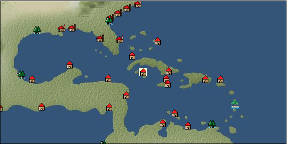

# Port: グランドケイマン

import Tabs from '@theme/Tabs';
import TabItem from '@theme/TabItem';

## General Information

| Attribute | Details |
| :--- | :--- |
| **Port Name** | grand cayman |
| **Port Type** | 開拓地 |
| **Region** | Caribbean/Central America |
| **Sea Area** | western caribbean |
| **Required Language** | English |
| **Coordinates** | （12988，3979） |
| **Investment Reward** | [Lot (NO.11)](docs/Items/Consumables/Consumables-Treasure-Chests/item_2896.md) （必要投資額：500,000ドゥカード） |

### Available Facilities

| guild | intermediary | exchange | tool shop | workshop craftsman | Painter | sculptor | peddler |
| --- | --- | --- | --- | --- | --- | --- | --- |
|   |   | ○ | ○ | ○ | ○ | ○ |   |
| Shipyard Master | Lumbermaker | Sail-maker | weapon craftsman | master | TavernFemale | archive | salesperson |
| --- | --- | --- | --- | --- | --- | --- | --- |
| ○ | ○ | ○ | ○ | ○ |   | ○ |   |
| Shipwright | 銀行 | street worker | 王宮 | Trading post | church | suburbs | translator |
| --- | --- | --- | --- | --- | --- | --- | --- |
| ○ | ○ | ○ |   |   |   |   |   |

### Description
A city located in the western West Indies, on the largest island of the Cayman Islands. It seems that shipwrecked sailors and pirates are starting to settle there. *English territory Clerk Master cook Skilled seamstress Skilled foundry worker Dock manager Cultural area: Caribbean (music from the east coast of Central and South America)

<Tabs>
  <TabItem value="trade_goods_sales" label="Trade Goods Sales">

| item | group | purchase price | 同盟時 | remarks |
| --- | --- | --- | --- | --- |
| [cow](docs/Items/TradeGoods/TradeGoods-Livestock/item_17.md) | [Trading Goods (Livestock)](docs/Categories/category_18.md) | (320) | 280 |  |
| [coffee](docs/Items/TradeGoods/TradeGoods-Sunddries/item_445.md) | [Trading goods (hobby goods)](docs/Categories/category_10.md) | (429) | 376 |  |
| 要投資（必要投資額：240,000） |
| [tequila](docs/Items/TradeGoods/TradeGoods-Alcohol/item_108.md) | [交易品（酒類）](docs/Categories/category_9.md) | (1,132) | 991 |  |
| [pineapple](docs/Items/TradeGoods/TradeGoods-Sunddries/item_867.md) | [Trading goods (hobby goods)](docs/Categories/category_10.md) | (888) | 777 |  |
| [peanuts](docs/Items/TradeGoods/TradeGoods-Sunddries/item_134.md) | [Trading goods (hobby goods)](docs/Categories/category_10.md) | (146) | 128 |  |
| 要投資（必要投資額：120,000） |
| [flannel](docs/Items/TradeGoods/TradeGoods-Fabrics/item_149.md) | [交易品（織物）](docs/Categories/category_20.md) | 2,688 | (2,352) |  |
| 要投資（必要投資額：400,000） |
| [silver](docs/Items/TradeGoods/TradeGoods-Metals/item_136.md) | [Trading products (precious metals)](docs/Categories/category_8.md) | (1,293) | 1,132 |  |
| 要投資（必要投資額：320,000） |
| [魚肉](docs/Items/TradeGoods/TradeGoods-Foodstuffs/item_10.md) | [Trading items (food items)](docs/Categories/category_3.md) | 146 | 128 |  |
  </TabItem>
  <TabItem value="sale_specialty" label="Sale (Specialty)">

| item | group | sale price | 同盟時 | remarks |
| --- | --- | --- | --- | --- |

#### [Trading Goods (Dye)](docs/Categories/category_2.md)

| [ward](docs/Items/TradeGoods/TradeGoods-Dye/item_57.md) | Trading Goods (Dye) | 2,173 | (2,444) |  |

#### [交易品（酒類）](docs/Categories/category_9.md)

| [sherry](docs/Items/TradeGoods/TradeGoods-Alcohol/item_844.md) | 交易品（酒類） | 697 | (784) |  |
| [tequila](docs/Items/TradeGoods/TradeGoods-Alcohol/item_108.md) | 交易品（酒類） | (426) | 496 |  |

#### [Trading Items (Firearms)](docs/Categories/category_17.md)

| [musket gun](docs/Items/TradeGoods/TradeGoods-Firearms/item_584.md) | Trading Items (Firearms) | 5,446 | (6,127) |  |
  </TabItem>
  <TabItem value="sale_no_specialty" label="Sale (No Specialty)">

| item | group | sale price | 同盟時 | remarks |
| --- | --- | --- | --- | --- |

#### [Trading items (food items)](docs/Categories/category_3.md)

| [sweet potato](docs/Items/TradeGoods/TradeGoods-Foodstuffs/item_1931.md) | Trading items (food items) | 100 | (112) |  |
| [sugar cane](docs/Items/TradeGoods/TradeGoods-Foodstuffs/item_93.md) | Trading items (food items) | 261 | (293) |  |
| [tomato](docs/Items/TradeGoods/TradeGoods-Foodstuffs/item_1809.md) | Trading items (food items) | (98) | 114 |  |
| [beef](docs/Items/TradeGoods/TradeGoods-Foodstuffs/item_26.md) | Trading items (food items) | 928 | (1,044) |  |

#### [Trading products (precious metals)](docs/Categories/category_8.md)

| [gold dust](docs/Items/TradeGoods/TradeGoods-Metals/item_111.md) | Trading products (precious metals) | 2,219 | (2,496) |  |
| [silver](docs/Items/TradeGoods/TradeGoods-Metals/item_136.md) | Trading products (precious metals) | (1,077) | 1,256 |  |
| 要投資（必要投資額：320,000） |

#### [交易品（酒類）](docs/Categories/category_9.md)

| [Beer](docs/Items/TradeGoods/TradeGoods-Alcohol/item_2.md) | 交易品（酒類） | 403 | (453) |  |
| [wine](docs/Items/TradeGoods/TradeGoods-Alcohol/item_11.md) | 交易品（酒類） | 612 | (688) |  |

#### [Trading goods (hobby goods)](docs/Categories/category_10.md)

| [cacao](docs/Items/TradeGoods/TradeGoods-Sunddries/item_140.md) | Trading goods (hobby goods) | 964 | (1,084) |  |
| [tobacco](docs/Items/TradeGoods/TradeGoods-Sunddries/item_109.md) | Trading goods (hobby goods) | 608 | 627 |  |
| ▲Special products from the same cultural area |
| [pineapple](docs/Items/TradeGoods/TradeGoods-Sunddries/item_867.md) | Trading goods (hobby goods) | 388 | (436) |  |
| [Yerba mate tea](docs/Items/TradeGoods/TradeGoods-Sunddries/item_1808.md) | Trading goods (hobby goods) | (259) | 302 |  |

#### [Trading Goods (Spices)](docs/Categories/category_12.md)

| [allspice](docs/Items/TradeGoods/TradeGoods-Spices/item_1848.md) | Trading Goods (Spices) | 454 | (510) |  |

#### [Trading goods (artificial goods)](docs/Categories/category_13.md)

| [luxury furniture](docs/Items/TradeGoods/TradeGoods-Luxuries/item_1048.md) | Trading goods (artificial goods) | 2,541 | (2,858) |  |

#### [交易品（美術品）](docs/Categories/category_14.md)

| [wooden statue](docs/Items/TradeGoods/TradeGoods-Art/item_95.md) | 交易品（美術品） | 985 | (1,108) |  |

#### [Trading Items (Firearms)](docs/Categories/category_17.md)

| [cannonball](docs/Items/TradeGoods/TradeGoods-Firearms/item_144.md) | Trading Items (Firearms) | 1,723 | (1,938) |  |
  </TabItem>
  <TabItem value="guild_&_others" label="Guild & Others">

| item | group | Sales price | Handling NPC | remarks |
| --- | --- | --- | --- | --- |

#### others

| [master caribbean cuisine](docs/Items/RecipeBooks/item_2847.md) | [recipe book](docs/Categories/category_22.md) | Fixed recipe |  |  |
| Owned by a cooking expert |
| [Advanced casting technology](docs/Items/RecipeBooks/item_2848.md) | [recipe book](docs/Categories/category_22.md) | Fixed recipe |  |  |
| Owned by a skilled casting engineer |
  </TabItem>
  <TabItem value="toolman" label="Toolman">

| item | group | Sales price | Handling NPC | remarks |
| --- | --- | --- | --- | --- |

#### [recipe book](docs/Categories/category_22.md)

| [Advanced sewing technology](docs/Items/RecipeBooks/item_2849.md) | recipe book | Fixed recipe | tool shop owner |  |
| Owned by a skilled seamstress |

#### [Equipment (body)](docs/Categories/category_24.md)

| [Surcoat](docs/Items/Equipment/Equipment-Body/item_131.md) | Equipment (body) | 30,000 | tool shop owner |  |

#### [Equipment (legs)](docs/Categories/category_26.md)

| [boots](docs/Items/Equipment/Equipment-Feet/item_365.md) | Equipment (legs) | 100 | tool shop owner |  |

#### [Equipment (belongings)](docs/Categories/category_27.md)

| [long sword](docs/Items/Equipment/Equipment-Weapon/item_302.md) | Equipment (belongings) | 15,400 | tool shop owner |  |

#### [装備品（服飾品）](docs/Categories/category_28.md)

| [jade ring](docs/Items/Equipment/Equipment-Accessory/item_1955.md) | 装備品（服飾品） | 7,000,000 | tool shop owner |  |
| 要投資（必要投資額：240,000） |

#### [Consumables (land battle/deck battle)](docs/Categories/category_29.md)

| [Taheebo juice](docs/Items/Consumables/Consumables-Landbattle/item_1807.md) | Consumables (land battle/deck battle) | 300 | tool shop owner |  |
| [tonic](docs/Items/Consumables/Consumables-Landbattle/item_1678.md) | Consumables (land battle/deck battle) | 300 | tool shop owner |  |

#### [Consumables (other)](docs/Categories/category_44.md)

| [black powder](docs/Items/Consumables/Consumables-Other/item_1954.md) | Consumables (other) | 1,000 | tool shop owner |  |
  </TabItem>
  <TabItem value="kobo_craftsmen" label="Craftsman">

| item | group | Sales price | Handling NPC | remarks |
| --- | --- | --- | --- | --- |

#### [Consumables (condition recovery)](docs/Categories/category_21.md)

| [Nostalgic carillon bell](docs/Items/Consumables/Consumables-Recovery/item_245.md) | Consumables (condition recovery) | 200 | workshop craftsman |  |
| [Ship song sheet music](docs/Items/Consumables/Consumables-Recovery/item_247.md) | Consumables (condition recovery) | 200 | workshop craftsman |  |

#### [recipe book](docs/Categories/category_22.md)

| [Furniture manufacturing/Caribbean edition](docs/Items/RecipeBooks/item_1951.md) | recipe book | Fixed recipe | workshop craftsman |  |

#### [Consumables (other)](docs/Categories/category_44.md)

| [帆塗料](docs/Items/Consumables/Consumables-Other/item_348.md) | Consumables (other) | 500 | workshop craftsman |  |
| [ship paint](docs/Items/Consumables/Consumables-Other/item_347.md) | Consumables (other) | 500 | workshop craftsman |  |

#### [furniture](docs/Categories/category_48.md)

| [caribbean style costume box](docs/Items/Furniture/item_2088.md) | furniture | Fixed recipe | workshop craftsman |  |
| [food basket](docs/Items/Furniture/item_2089.md) | furniture | Fixed recipe | workshop craftsman |  |
| [Open rack for small items](docs/Items/Furniture/item_2219.md) | furniture | Fixed recipe | workshop craftsman |  |
| [Stone monument for book stand](docs/Items/Furniture/item_1952.md) | furniture | Fixed recipe | workshop craftsman |  |
| [cat car](docs/Items/Furniture/item_2090.md) | furniture | Fixed recipe | workshop craftsman |  |
  </TabItem>
  <TabItem value="Painter" label="Painter">

| item | group | Sales price | Handling NPC | remarks |
| --- | --- | --- | --- | --- |

#### [Ship parts (emblem)](docs/Categories/category_36.md)

| [admiral](docs/Items/ShipParts/Shipparts-Crests/item_548.md) | Ship parts (emblem) | 5,000 | Painter |  |
| [anchor](docs/Items/ShipParts/Shipparts-Crests/item_549.md) | Ship parts (emblem) | 5,000 | Painter |  |
| [Quetzalcoatl](docs/Items/ShipParts/Shipparts-Crests/item_3201.md) | Ship parts (emblem) | 1,000,000 | Painter |  |
| [sun](docs/Items/ShipParts/Shipparts-Crests/item_597.md) | Ship parts (emblem) | 5,000 | Painter |  |
| [circle cross](docs/Items/ShipParts/Shipparts-Crests/item_544.md) | Ship parts (emblem) | 5,000 | Painter |  |
| [shellfish](docs/Items/ShipParts/Shipparts-Crests/item_546.md) | Ship parts (emblem) | 5,000 | Painter |  |
| [Delphine](docs/Items/ShipParts/Shipparts-Crests/item_542.md) | Ship parts (emblem) | 5,000 | Painter |  |
| [butterfly](docs/Items/ShipParts/Shipparts-Crests/item_547.md) | Ship parts (emblem) | 5,000 | Painter |  |
| [fisherman](docs/Items/ShipParts/Shipparts-Crests/item_545.md) | Ship parts (emblem) | 5,000 | Painter |  |
  </TabItem>
  <TabItem value="sculptor" label="sculptor">

| item | group | Sales price | Handling NPC | remarks |
| --- | --- | --- | --- | --- |

#### [recipe book](docs/Categories/category_22.md)

| [Creating saint statues, part 6](docs/Items/RecipeBooks/item_4474.md) | recipe book | Fixed recipe | sculptor |  |

#### [Ship parts (figurehead)](docs/Categories/category_34.md)

| [dolphin statue](docs/Items/ShipParts/Shipparts-Figurehead/item_169.md) | Ship parts (figurehead) | 500 | sculptor |  |
| [whale statue](docs/Items/ShipParts/Shipparts-Figurehead/item_172.md) | Ship parts (figurehead) | 12,000 | sculptor |  |
| [shark statue](docs/Items/ShipParts/Shipparts-Figurehead/item_171.md) | Ship parts (figurehead) | 8,600 | sculptor |  |
| [killer whale statue](docs/Items/ShipParts/Shipparts-Figurehead/item_170.md) | Ship parts (figurehead) | 8,600 | sculptor |  |
| [phoenix statue](docs/Items/ShipParts/Shipparts-Figurehead/item_631.md) | Ship parts (figurehead) | 62,000 | sculptor |  |
| [maiden statue](docs/Items/ShipParts/Shipparts-Figurehead/item_167.md) | Ship parts (figurehead) | 13,000 | sculptor |  |
| [statue of a great man](docs/Items/ShipParts/Shipparts-Figurehead/item_717.md) | Ship parts (figurehead) | 60,000 | sculptor |  |
| [statue of the brave](docs/Items/ShipParts/Shipparts-Figurehead/item_716.md) | Ship parts (figurehead) | 60,000 | sculptor |  |
| [angel statue](docs/Items/ShipParts/Shipparts-Figurehead/item_168.md) | Ship parts (figurehead) | 13,000 | sculptor |  |
| [statue of tenryu](docs/Items/ShipParts/Shipparts-Figurehead/item_630.md) | Ship parts (figurehead) | 62,000 | sculptor |  |
| [statue of goddess](docs/Items/ShipParts/Shipparts-Figurehead/item_721.md) | Ship parts (figurehead) | 60,000 | sculptor |  |
| [sea ​​turtle statue](docs/Items/ShipParts/Shipparts-Figurehead/item_173.md) | Ship parts (figurehead) | 1,800 | sculptor |  |
| [sea ​​monster statue](docs/Items/ShipParts/Shipparts-Figurehead/item_628.md) | Ship parts (figurehead) | 62,000 | sculptor |  |
| [statue of sea god](docs/Items/ShipParts/Shipparts-Figurehead/item_720.md) | Ship parts (figurehead) | 60,000 | sculptor |  |
| [statue of king](docs/Items/ShipParts/Shipparts-Figurehead/item_718.md) | Ship parts (figurehead) | 60,000 | sculptor |  |
  </TabItem>
  <TabItem value="shipyard" label="Shipyard">

### Shipyard Master

| item | group | Sales price | Handling NPC | remarks |
| --- | --- | --- | --- | --- |

#### [recipe book](docs/Categories/category_22.md)

| [Book of Shipbuilding Materials and Hulls Volume 3](docs/Items/RecipeBooks/item_1818.md) | recipe book | Fixed recipe | Shipyard Master |  |

#### [Boat](docs/Categories/category_43.md)

| [carrack](docs/Items/Ships/item_236.md) | Boat | 720,000 | Shipyard Master |  |
| [schooner](docs/Items/Ships/item_1889.md) | Boat |  | Shipyard Master |  |
| [Varsha](docs/Items/Ships/item_201.md) | Boat | 2,000 | Shipyard Master |  |
| [bergantine](docs/Items/Ships/item_208.md) | Boat | 148,800 | Shipyard Master |  |
| [commercial schooner](docs/Items/Ships/item_1892.md) | Boat |  | Shipyard Master |  |
| [commercial varsha](docs/Items/Ships/item_204.md) | Boat | 5,200 | Shipyard Master |  |
| [small galleon](docs/Items/Ships/item_406.md) | Boat | 830,000 | Shipyard Master |  |
| [small carrack](docs/Items/Ships/item_219.md) | Boat | 480,000 | Shipyard Master |  |
| [small caravel](docs/Items/Ships/item_206.md) | Boat | 92,000 | Shipyard Master |  |
| [Battle Barsha](docs/Items/Ships/item_203.md) | Boat | 5,100 | Shipyard Master |  |
| [exploration barsha](docs/Items/Ships/item_202.md) | Boat | 5,000 | Shipyard Master |  |
| [light galleon](docs/Items/Ships/item_240.md) | Boat | 810,000 | Shipyard Master |  |
| [light carrack](docs/Items/Ships/item_218.md) | Boat | 478,000 | Shipyard Master |  |
| [light caravelle](docs/Items/Ships/item_207.md) | Boat | 92,000 | Shipyard Master |  |
| [transport galleon](docs/Items/Ships/item_407.md) | Boat | 840,000 | Shipyard Master |  |
| [transport carrack](docs/Items/Ships/item_222.md) | Boat | 488,000 | Shipyard Master |  |

#### [shipbuilding materials](docs/Categories/category_47.md)

| [2-deck type large hull](docs/Items/ShipbuildingFS/item_1820.md) | shipbuilding materials | Fixed recipe | Shipyard Master |  |
| [3-deck type large hull](docs/Items/ShipbuildingFS/item_2087.md) | shipbuilding materials | Fixed recipe | Shipyard Master |  |
| [Flat deck type large hull](docs/Items/ShipbuildingFS/item_1819.md) | shipbuilding materials | Fixed recipe | Shipyard Master |  |

### Lumbermaker

| item | group | Sales price | Handling NPC | remarks |
| --- | --- | --- | --- | --- |

#### [recipe book](docs/Categories/category_22.md)

| [Book of Shipbuilding Materials and Crafts Volume 3](docs/Items/RecipeBooks/item_1924.md) | recipe book | Fixed recipe | Lumbermaker |  |

#### [shipbuilding materials](docs/Categories/category_47.md)

| [large mast](docs/Items/ShipbuildingFS/item_1925.md) | shipbuilding materials | Fixed recipe | Lumbermaker |  |

### Sail-maker

| item | group | Sales price | Handling NPC | remarks |
| --- | --- | --- | --- | --- |

#### [recipe book](docs/Categories/category_22.md)

| [Book of Shipbuilding Materials and Sewing Volume 3](docs/Items/RecipeBooks/item_1913.md) | recipe book | Fixed recipe | Sail-maker |  |

#### [shipbuilding materials](docs/Categories/category_47.md)

| [large gaff sail](docs/Items/ShipbuildingFS/item_1917.md) | shipbuilding materials | Fixed recipe | Sail-maker |  |
| [large square sail](docs/Items/ShipbuildingFS/item_1916.md) | shipbuilding materials | Fixed recipe | Sail-maker |  |
| [large lateen sail](docs/Items/ShipbuildingFS/item_1915.md) | shipbuilding materials | Fixed recipe | Sail-maker |  |

### Shipwright

| item | group | Sales price | Handling NPC | remarks |
| --- | --- | --- | --- | --- |

#### [recipe book](docs/Categories/category_22.md)

| [Shipbuilding materials and processed wood](docs/Items/RecipeBooks/item_1774.md) | recipe book | Fixed recipe | Shipwright |  |

#### [shipbuilding materials](docs/Categories/category_47.md)

| [processed wood](docs/Items/ShipbuildingFS/item_1695.md) | shipbuilding materials | Fixed recipe | Shipwright |  |
  </TabItem>
  <TabItem value="weapon craftsman" label="weapon craftsman">

| item | group | Sales price | Handling NPC | remarks |
| --- | --- | --- | --- | --- |

#### [recipe book](docs/Categories/category_22.md)

| [Book of Shipbuilding Materials and Casting Volume 3](docs/Items/RecipeBooks/item_1912.md) | recipe book | Fixed recipe | weapon craftsman |  |

#### [shipbuilding materials](docs/Categories/category_47.md)

| [改良大型砲門](docs/Items/ShipbuildingFS/item_1914.md) | shipbuilding materials | Fixed recipe | weapon craftsman |  |
  </TabItem>
  <TabItem value="dock manager" label="dock manager">

| item | group | Sales price | Handling NPC | remarks |
| --- | --- | --- | --- | --- |

#### [recipe book](docs/Categories/category_22.md)

| [造船技術研究成果](docs/Items/RecipeBooks/item_2850.md) | recipe book | Fixed recipe | dock manager |  |
| hub city |

#### [shipbuilding materials](docs/Categories/category_47.md)

| [lifeboat](docs/Items/ShipbuildingFS/item_2846.md) | shipbuilding materials | Fixed recipe | dock manager |  |
| hub city |
| [Sewing tools set](docs/Items/ShipbuildingFS/item_2879.md) | shipbuilding materials | Fixed recipe | dock manager |  |
| [shipwright's room](docs/Items/ShipbuildingFS/item_2880.md) | shipbuilding materials | Fixed recipe | dock manager |  |
  </TabItem>
  <TabItem value="scholar" label="scholar">

| item | group | Sales price | Handling NPC | remarks |
| --- | --- | --- | --- | --- |

#### [recipe book](docs/Categories/category_22.md)

| [How to make an American language dictionary](docs/Items/RecipeBooks/item_2119.md) | recipe book | Fixed recipe | scholar |  |
| 要投資（必要投資額：不明） |
  </TabItem>
</Tabs>