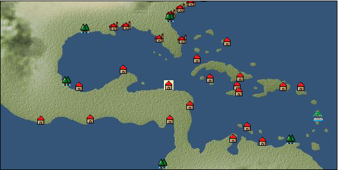

# Port: Trujillo

import Tabs from '@theme/Tabs';
import TabItem from '@theme/TabItem';

## General Information

| Attribute | Details |
| :--- | :--- |
| **Port Name** | Trujillo |
| **Port Type** | 開拓地 |
| **Region** | Caribbean/Central America |
| **Sea Area** | western caribbean |
| **Required Language** | spanish |
| **Coordinates** | （12707，4028） |
| **Investment Reward** | [Lot (NO.11)](docs/Items/Consumables/Consumables-Treasure-Chests/item_2896.md) （必要投資額：500,000ドゥカード） |

### Available Facilities

| guild | intermediary | exchange | tool shop | workshop craftsman | Painter | sculptor | peddler |
| --- | --- | --- | --- | --- | --- | --- | --- |
|   |   | ○ | ○ | ○ | ○ | ○ | ○ |
| Shipyard Master | Lumbermaker | Sail-maker | weapon craftsman | master | TavernFemale | archive | salesperson |
| --- | --- | --- | --- | --- | --- | --- | --- |
| ○ | ○ | ○ | ○ | ○ |   | ○ |   |
| Shipwright | 銀行 | street worker | 王宮 | Trading post | church | suburbs | translator |
| --- | --- | --- | --- | --- | --- | --- | --- |
| ○ | ○ | ○ |   |   |   |   |   |

### Description
A town facing the Gulf of Honduras in the Caribbean Sea, discovered by Cristobal Colon on his fourth voyage. ``Honduras'' means ``deep'' in Spanish, and comes from the fact that Admiral Colón lowered his anchor during his landing, but did not reach the bottom of the ocean. *Hispanian Territory Secretary, Master Cook, Skilled Tailor, Skilled Foundry Technician, Dock Manager Cultural Area: East Coast of Central and South America

<Tabs>
  <TabItem value="trade_goods_sales" label="Trade Goods Sales">

| Item | Group | Purchase Price | Allied Price | Remarks |
| --- | --- | --- | --- | --- |
| [allspice](docs/Items/TradeGoods/TradeGoods-Spices/item_1848.md) | [Trading Goods (Spices)](docs/Categories/category_12.md) | 336 | 336 |  |
| [coffee](docs/Items/TradeGoods/TradeGoods-Sunddries/item_445.md) | [Trading goods (hobby goods)](docs/Categories/category_10.md) | 376 | 376 |  |
| 要投資（必要投資額：180,000） |
| [corn](docs/Items/TradeGoods/TradeGoods-Foodstuffs/item_138.md) | [Trading items (food items)](docs/Categories/category_3.md) | 51 | 48 |  |
| [pig](docs/Items/TradeGoods/TradeGoods-Livestock/item_37.md) | [Trading Goods (Livestock)](docs/Categories/category_18.md) | 60 | 56 |  |
| [musket gun](docs/Items/TradeGoods/TradeGoods-Firearms/item_584.md) | [Trading Items (Firearms)](docs/Categories/category_17.md) | (7,920) | 6,930 |  |
| 要投資（必要投資額：400,000） |
| [silver](docs/Items/TradeGoods/TradeGoods-Metals/item_136.md) | [Trading products (precious metals)](docs/Categories/category_8.md) | (1,291) | 1,130 |  |
| 要投資（必要投資額：320,000） |
| [魚肉](docs/Items/TradeGoods/TradeGoods-Foodstuffs/item_10.md) | [Trading items (food items)](docs/Categories/category_3.md) | 146 | 128 |  |
  </TabItem>
  <TabItem value="sale_specialty" label="Sale (Specialty)">

| Item | Group | sale price | Allied Price | Remarks |
| --- | --- | --- | --- | --- |

#### [Trading Goods (Dye)](docs/Categories/category_2.md)

| [ward](docs/Items/TradeGoods/TradeGoods-Dye/item_57.md) | Trading Goods (Dye) | (2,109) | 2,460 |  |

#### [交易品（調味料）](docs/Categories/category_4.md)

| [apple cider vinegar](docs/Items/TradeGoods/TradeGoods-Seasonings/item_882.md) | 交易品（調味料） | (834) | 972 |  |
| 同盟時1010-104% |

#### [Trading products (medical products)](docs/Categories/category_6.md)

| [Nothing](docs/Items/TradeGoods/TradeGoods-Medicine/item_1053.md) | Trading products (medical products) | (989) | 1,153 |  |
| 同盟時1210-105% |

#### [交易品（酒類）](docs/Categories/category_9.md)

| [aquavit](docs/Items/TradeGoods/TradeGoods-Alcohol/item_572.md) | 交易品（酒類） | (1,456) | 1,698 |  |
| [whiskey](docs/Items/TradeGoods/TradeGoods-Alcohol/item_1.md) | 交易品（酒類） | (1,603) | 1,870 |  |
| [fruit brandy](docs/Items/TradeGoods/TradeGoods-Alcohol/item_1440.md) | 交易品（酒類） | (1,121) | 1,308 |  |

#### [Trading goods (hobby goods)](docs/Categories/category_10.md)

| [caviar](docs/Items/TradeGoods/TradeGoods-Sunddries/item_2122.md) | Trading goods (hobby goods) | (1,714) | 2,000 |  |
| 同盟時1600-80% |
| [prune](docs/Items/TradeGoods/TradeGoods-Sunddries/item_523.md) | Trading goods (hobby goods) | (761) | 887 |  |
| 同盟時674-76% |
| [black tea](docs/Items/TradeGoods/TradeGoods-Sunddries/item_675.md) | Trading goods (hobby goods) | (2,161) | 2,521 |  |

#### [Trading Goods (Spices)](docs/Categories/category_11.md)

| [jasmine](docs/Items/TradeGoods/TradeGoods-Perfume/item_772.md) | Trading Goods (Spices) | (5,169) | 6,031 |  |
| [lira](docs/Items/TradeGoods/TradeGoods-Perfume/item_30.md) | Trading Goods (Spices) | (1,410) | 1,645 |  |
| [sandalwood](docs/Items/TradeGoods/TradeGoods-Perfume/item_771.md) | Trading Goods (Spices) | (3,718) | 4,338 |  |

#### [Trading Goods (Spices)](docs/Categories/category_12.md)

| [saffron](docs/Items/TradeGoods/TradeGoods-Spices/item_845.md) | Trading Goods (Spices) | (3,710) | 4,328 |  |

#### [Trading goods (artificial goods)](docs/Categories/category_13.md)

| [湖筆](docs/Items/TradeGoods/TradeGoods-Luxuries/item_3898.md) | Trading goods (artificial goods) | 4,038 | (4,543) |  |

#### [Trading Items (Gemstones)](docs/Categories/category_15.md)

| [pink diamond](docs/Items/TradeGoods/TradeGoods-Gems/item_2874.md) | Trading Items (Gemstones) | (11,395) | 13,296 |  |

#### [Trading Items (Arms)](docs/Categories/category_16.md)

| [damascus sword](docs/Items/TradeGoods/TradeGoods-Weapons/item_903.md) | Trading Items (Arms) | (10,581) | 12,346 |  |

#### [交易品（織物）](docs/Categories/category_20.md)

| [dutch calico](docs/Items/TradeGoods/TradeGoods-Fabrics/item_1435.md) | 交易品（織物） | 2,374 | (2,671) |  |
| [damask](docs/Items/TradeGoods/TradeGoods-Fabrics/item_614.md) | 交易品（織物） | (6,023) | 7,028 |  |
| [velvet](docs/Items/TradeGoods/TradeGoods-Fabrics/item_902.md) | 交易品（織物） | (5,274) | 6,154 |  |
  </TabItem>
  <TabItem value="sale_no_specialty" label="Sale (No Specialty)">

| Item | Group | sale price | Allied Price | Remarks |
| --- | --- | --- | --- | --- |

#### [交易品（繊維）](docs/Categories/category_1.md)

| [sisal hemp](docs/Items/TradeGoods/TradeGoods-Fibers/item_1766.md) | 交易品（繊維） | 254 | (285) |  |
| [cotton](docs/Items/TradeGoods/TradeGoods-Fibers/item_610.md) | 交易品（繊維） | 490 | (551) |  |
| [wool](docs/Items/TradeGoods/TradeGoods-Fibers/item_5.md) | 交易品（繊維） | (403) | 470 |  |

#### [Trading items (food items)](docs/Categories/category_3.md)

| [Cassava](docs/Items/TradeGoods/TradeGoods-Foodstuffs/item_1805.md) | Trading items (food items) | (63) | 73 |  |
| [sweet potato](docs/Items/TradeGoods/TradeGoods-Foodstuffs/item_1931.md) | Trading items (food items) | (91) | 106 |  |
| [sugar cane](docs/Items/TradeGoods/TradeGoods-Foodstuffs/item_93.md) | Trading items (food items) | 258 | (290) |  |
| [potato](docs/Items/TradeGoods/TradeGoods-Foodstuffs/item_106.md) | Trading items (food items) | (130) | 151 |  |
| [Jambu](docs/Items/TradeGoods/TradeGoods-Foodstuffs/item_1827.md) | Trading items (food items) | (154) | 179 |  |
| [sausage](docs/Items/TradeGoods/TradeGoods-Foodstuffs/item_27.md) | Trading items (food items) | (556) | 648 |  |
| [tomato](docs/Items/TradeGoods/TradeGoods-Foodstuffs/item_1809.md) | Trading items (food items) | 106 | (119) |  |
| [ham](docs/Items/TradeGoods/TradeGoods-Foodstuffs/item_290.md) | Trading items (food items) | (612) | 714 |  |
| [bacon](docs/Items/TradeGoods/TradeGoods-Foodstuffs/item_566.md) | Trading items (food items) | (542) | 632 |  |
| [pork](docs/Items/TradeGoods/TradeGoods-Foodstuffs/item_41.md) | Trading items (food items) | (534) | 623 |  |
| [魚肉](docs/Items/TradeGoods/TradeGoods-Foodstuffs/item_10.md) | Trading items (food items) | (55) | 64 |  |

#### [交易品（調味料）](docs/Categories/category_4.md)

| [lard](docs/Items/TradeGoods/TradeGoods-Seasonings/item_43.md) | 交易品（調味料） | (257) | 299 |  |

#### [Trading Items (Iron Stone)](docs/Categories/category_7.md)

| [iron ore](docs/Items/TradeGoods/TradeGoods-Minerals/item_146.md) | Trading Items (Iron Stone) | 610 | (686) |  |

#### [Trading products (precious metals)](docs/Categories/category_8.md)

| [gold dust](docs/Items/TradeGoods/TradeGoods-Metals/item_111.md) | Trading products (precious metals) | (1,897) | 2,213 |  |
| [gold](docs/Items/TradeGoods/TradeGoods-Metals/item_659.md) | Trading products (precious metals) | (2,104) | 2,455 |  |
| [silver](docs/Items/TradeGoods/TradeGoods-Metals/item_136.md) | Trading products (precious metals) | 1,252 | (1,408) |  |
| 要投資（必要投資額：320,000） |

#### [交易品（酒類）](docs/Categories/category_9.md)

| [tequila](docs/Items/TradeGoods/TradeGoods-Alcohol/item_108.md) | 交易品（酒類） | (1,018) | 1,187 |  |
| ▲Special products from neighboring cultural areas |
| [Beer](docs/Items/TradeGoods/TradeGoods-Alcohol/item_2.md) | 交易品（酒類） | (401) | 467 |  |
| [wine](docs/Items/TradeGoods/TradeGoods-Alcohol/item_11.md) | 交易品（酒類） | (542) | 632 |  |

#### [Trading goods (hobby goods)](docs/Categories/category_10.md)

| [cacao](docs/Items/TradeGoods/TradeGoods-Sunddries/item_140.md) | Trading goods (hobby goods) | 953 | (1,072) |  |
| [tobacco](docs/Items/TradeGoods/TradeGoods-Sunddries/item_109.md) | Trading goods (hobby goods) | 624 | (702) |  |
| [chicle](docs/Items/TradeGoods/TradeGoods-Sunddries/item_4083.md) | Trading goods (hobby goods) | (842) | 982 |  |
| ▲Special products from neighboring cultural areas |
| [pineapple](docs/Items/TradeGoods/TradeGoods-Sunddries/item_867.md) | Trading goods (hobby goods) | 1,055 | (1,186) |  |
| [peanuts](docs/Items/TradeGoods/TradeGoods-Sunddries/item_134.md) | Trading goods (hobby goods) | 177 | (199) |  |
| [Yerba mate tea](docs/Items/TradeGoods/TradeGoods-Sunddries/item_1808.md) | Trading goods (hobby goods) | 286 | (321) |  |

#### [Trading Goods (Spices)](docs/Categories/category_12.md)

| [basil](docs/Items/TradeGoods/TradeGoods-Spices/item_126.md) | Trading Goods (Spices) | (232) | 270 |  |
| [vanilla](docs/Items/TradeGoods/TradeGoods-Spices/item_1810.md) | Trading Goods (Spices) | 389 | (437) |  |

#### [Trading goods (artificial goods)](docs/Categories/category_13.md)

| [lapidary work](docs/Items/TradeGoods/TradeGoods-Luxuries/item_153.md) | Trading goods (artificial goods) | (6,191) | 7,223 |  |
| [luxury furniture](docs/Items/TradeGoods/TradeGoods-Luxuries/item_1048.md) | Trading goods (artificial goods) | (2,474) | 2,886 |  |

#### [交易品（美術品）](docs/Categories/category_14.md)

| [wooden statue](docs/Items/TradeGoods/TradeGoods-Art/item_95.md) | 交易品（美術品） | (986) | 1,150 |  |

#### [Trading Items (Gemstones)](docs/Categories/category_15.md)

| [Agate](docs/Items/TradeGoods/TradeGoods-Gems/item_107.md) | Trading Items (Gemstones) | (1,954) | 2,280 |  |
| [emerald](docs/Items/TradeGoods/TradeGoods-Gems/item_777.md) | Trading Items (Gemstones) | (3,381) | 3,945 |  |
| [opal](docs/Items/TradeGoods/TradeGoods-Gems/item_2006.md) | Trading Items (Gemstones) | (2,292) | 2,674 |  |
| [garnet](docs/Items/TradeGoods/TradeGoods-Gems/item_1005.md) | Trading Items (Gemstones) | (1,934) | 2,256 |  |
| [pearl](docs/Items/TradeGoods/TradeGoods-Gems/item_769.md) | Trading Items (Gemstones) | (4,884) | 5,698 |  |

#### [Trading Items (Firearms)](docs/Categories/category_17.md)

| [arquebus gun](docs/Items/TradeGoods/TradeGoods-Firearms/item_14.md) | Trading Items (Firearms) | (2,438) | 2,844 |  |
| [大砲](docs/Items/TradeGoods/TradeGoods-Firearms/item_4.md) | Trading Items (Firearms) | (4,731) | 5,520 |  |
| [cannonball](docs/Items/TradeGoods/TradeGoods-Firearms/item_144.md) | Trading Items (Firearms) | (1,511) | 1,763 |  |

#### [Trading Goods (Livestock)](docs/Categories/category_18.md)

| [cow](docs/Items/TradeGoods/TradeGoods-Livestock/item_17.md) | Trading Goods (Livestock) | (298) | 347 |  |

#### [交易品（工業品）](docs/Categories/category_19.md)

| [rubber](docs/Items/TradeGoods/TradeGoods-Wares/item_2819.md) | 交易品（工業品） | (660) | 770 |  |
| [log](docs/Items/TradeGoods/TradeGoods-Wares/item_846.md) | 交易品（工業品） | (131) | 152 |  |
| [wood](docs/Items/TradeGoods/TradeGoods-Wares/item_277.md) | 交易品（工業品） | 790 | (888) |  |
| [iron material](docs/Items/TradeGoods/TradeGoods-Wares/item_268.md) | 交易品（工業品） | 937 | (1,054) |  |

#### [交易品（織物）](docs/Categories/category_20.md)

| [cotton fabric](docs/Items/TradeGoods/TradeGoods-Fabrics/item_571.md) | 交易品（織物） | (1,082) | 1,262 |  |
| [linen fabric](docs/Items/TradeGoods/TradeGoods-Fabrics/item_135.md) | 交易品（織物） | 409 | (460) |  |
  </TabItem>
  <TabItem value="guild_&_others" label="Guild & Others">

| Item | Group | Sales price | Handling NPC | Remarks |
| --- | --- | --- | --- | --- |
| There is no sales information for the Item |
| --- |
  </TabItem>
  <TabItem value="toolman" label="Toolman">

| Item | Group | Sales price | Handling NPC | Remarks |
| --- | --- | --- | --- | --- |

#### [Equipment (body)](docs/Categories/category_24.md)

| [Surcoat](docs/Items/Equipment/Equipment-Body/item_131.md) | Equipment (body) | 30,000 | tool shop owner |  |

#### [Equipment (legs)](docs/Categories/category_26.md)

| [boots](docs/Items/Equipment/Equipment-Feet/item_365.md) | Equipment (legs) | 100 | tool shop owner |  |

#### [Equipment (belongings)](docs/Categories/category_27.md)

| [long sword](docs/Items/Equipment/Equipment-Weapon/item_302.md) | Equipment (belongings) | 15,400 | tool shop owner |  |

#### [装備品（服飾品）](docs/Categories/category_28.md)

| [jade ring](docs/Items/Equipment/Equipment-Accessory/item_1955.md) | 装備品（服飾品） | 7,000,000 | tool shop owner |  |
| 要投資（必要投資額：240,000） |

#### [Consumables (land battle/deck battle)](docs/Categories/category_29.md)

| [Taheebo juice](docs/Items/Consumables/Consumables-Landbattle/item_1807.md) | Consumables (land battle/deck battle) | 300 | tool shop owner |  |
| [taheebo bottle](docs/Items/Consumables/Consumables-Landbattle/item_1823.md) | Consumables (land battle/deck battle) | 600 | tool shop owner |  |
| 要投資（必要投資額：不明） |
| [tonic](docs/Items/Consumables/Consumables-Landbattle/item_1678.md) | Consumables (land battle/deck battle) | 300 | tool shop owner |  |

#### [Consumables (other)](docs/Categories/category_44.md)

| [black powder](docs/Items/Consumables/Consumables-Other/item_1954.md) | Consumables (other) | 1,000 | tool shop owner |  |
  </TabItem>
  <TabItem value="kobo_craftsmen" label="Craftsman">

| Item | Group | Sales price | Handling NPC | Remarks |
| --- | --- | --- | --- | --- |

#### [Consumables (condition recovery)](docs/Categories/category_21.md)

| [Nostalgic carillon bell](docs/Items/Consumables/Consumables-Recovery/item_245.md) | Consumables (condition recovery) | 200 | workshop craftsman |  |
| [Ship song sheet music](docs/Items/Consumables/Consumables-Recovery/item_247.md) | Consumables (condition recovery) | 200 | workshop craftsman |  |

#### [recipe book](docs/Categories/category_22.md)

| [Furniture manufacturing/Caribbean edition](docs/Items/RecipeBooks/item_1951.md) | recipe book | Fixed recipe | workshop craftsman |  |

#### [Consumables (other)](docs/Categories/category_44.md)

| [帆塗料](docs/Items/Consumables/Consumables-Other/item_348.md) | Consumables (other) | 500 | workshop craftsman |  |
| [ship paint](docs/Items/Consumables/Consumables-Other/item_347.md) | Consumables (other) | 500 | workshop craftsman |  |

#### [furniture](docs/Categories/category_48.md)

| [caribbean style costume box](docs/Items/Furniture/item_2088.md) | furniture | Fixed recipe | workshop craftsman |  |
| [food basket](docs/Items/Furniture/item_2089.md) | furniture | Fixed recipe | workshop craftsman |  |
| [Open rack for small items](docs/Items/Furniture/item_2219.md) | furniture | Fixed recipe | workshop craftsman |  |
| [Stone monument for book stand](docs/Items/Furniture/item_1952.md) | furniture | Fixed recipe | workshop craftsman |  |
| [cat car](docs/Items/Furniture/item_2090.md) | furniture | Fixed recipe | workshop craftsman |  |
  </TabItem>
  <TabItem value="Painter" label="Painter">

| Item | Group | Sales price | Handling NPC | Remarks |
| --- | --- | --- | --- | --- |

#### [Ship parts (emblem)](docs/Categories/category_36.md)

| [admiral](docs/Items/ShipParts/Shipparts-Crests/item_548.md) | Ship parts (emblem) | 5,000 | Painter |  |
| [anchor](docs/Items/ShipParts/Shipparts-Crests/item_549.md) | Ship parts (emblem) | 5,000 | Painter |  |
| [whale](docs/Items/ShipParts/Shipparts-Crests/item_792.md) | Ship parts (emblem) | 5,000 | Painter |  |
| [sun](docs/Items/ShipParts/Shipparts-Crests/item_597.md) | Ship parts (emblem) | 5,000 | Painter |  |
| [circle cross](docs/Items/ShipParts/Shipparts-Crests/item_544.md) | Ship parts (emblem) | 5,000 | Painter |  |
| [shellfish](docs/Items/ShipParts/Shipparts-Crests/item_546.md) | Ship parts (emblem) | 5,000 | Painter |  |
| [Delphine](docs/Items/ShipParts/Shipparts-Crests/item_542.md) | Ship parts (emblem) | 5,000 | Painter |  |
| [fisherman](docs/Items/ShipParts/Shipparts-Crests/item_545.md) | Ship parts (emblem) | 5,000 | Painter |  |
  </TabItem>
  <TabItem value="sculptor" label="sculptor">

| Item | Group | Sales price | Handling NPC | Remarks |
| --- | --- | --- | --- | --- |

#### [recipe book](docs/Categories/category_22.md)

| [Saint statue creation, part 1](docs/Items/RecipeBooks/item_2157.md) | recipe book | Fixed recipe | sculptor |  |

#### [Ship parts (figurehead)](docs/Categories/category_34.md)

| [dolphin statue](docs/Items/ShipParts/Shipparts-Figurehead/item_169.md) | Ship parts (figurehead) | 500 | sculptor |  |
| [whale statue](docs/Items/ShipParts/Shipparts-Figurehead/item_172.md) | Ship parts (figurehead) | 12,000 | sculptor |  |
| [shark statue](docs/Items/ShipParts/Shipparts-Figurehead/item_171.md) | Ship parts (figurehead) | 8,600 | sculptor |  |
| [killer whale statue](docs/Items/ShipParts/Shipparts-Figurehead/item_170.md) | Ship parts (figurehead) | 8,600 | sculptor |  |
| [Tobi statue](docs/Items/ShipParts/Shipparts-Figurehead/item_287.md) | Ship parts (figurehead) | 500 | sculptor |  |
| [maiden statue](docs/Items/ShipParts/Shipparts-Figurehead/item_167.md) | Ship parts (figurehead) | 13,000 | sculptor |  |
| [statue of a great man](docs/Items/ShipParts/Shipparts-Figurehead/item_717.md) | Ship parts (figurehead) | 60,000 | sculptor |  |
| [statue of the brave](docs/Items/ShipParts/Shipparts-Figurehead/item_716.md) | Ship parts (figurehead) | 60,000 | sculptor |  |
| [angel statue](docs/Items/ShipParts/Shipparts-Figurehead/item_168.md) | Ship parts (figurehead) | 13,000 | sculptor |  |
| [statue of tenryu](docs/Items/ShipParts/Shipparts-Figurehead/item_630.md) | Ship parts (figurehead) | 62,000 | sculptor |  |
| [statue of goddess](docs/Items/ShipParts/Shipparts-Figurehead/item_721.md) | Ship parts (figurehead) | 60,000 | sculptor |  |
| [sea ​​turtle statue](docs/Items/ShipParts/Shipparts-Figurehead/item_173.md) | Ship parts (figurehead) | 1,800 | sculptor |  |
| [sea ​​monster statue](docs/Items/ShipParts/Shipparts-Figurehead/item_628.md) | Ship parts (figurehead) | 62,000 | sculptor |  |
| [statue of sea god](docs/Items/ShipParts/Shipparts-Figurehead/item_720.md) | Ship parts (figurehead) | 60,000 | sculptor |  |
| [statue of king](docs/Items/ShipParts/Shipparts-Figurehead/item_718.md) | Ship parts (figurehead) | 60,000 | sculptor |  |
| [st christophorus statue](docs/Items/ShipParts/Shipparts-Figurehead/item_2158.md) | Ship parts (figurehead) | Fixed recipe | sculptor |  |
  </TabItem>
  <TabItem value="shipyard" label="Shipyard">

### Shipyard Master

| Item | Group | Sales price | Handling NPC | Remarks |
| --- | --- | --- | --- | --- |

#### [recipe book](docs/Categories/category_22.md)

| [Book of Shipbuilding Materials and Hulls Volume 3](docs/Items/RecipeBooks/item_1818.md) | recipe book | Fixed recipe | Shipyard Master |  |

#### [Boat](docs/Categories/category_43.md)

| [Varsha](docs/Items/Ships/item_201.md) | Boat | 2,000 | Shipyard Master |  |

#### [shipbuilding materials](docs/Categories/category_47.md)

| [2-deck type large hull](docs/Items/ShipbuildingFS/item_1820.md) | shipbuilding materials | Fixed recipe | Shipyard Master |  |
| [3-deck type large hull](docs/Items/ShipbuildingFS/item_2087.md) | shipbuilding materials | Fixed recipe | Shipyard Master |  |
| [Flat deck type large hull](docs/Items/ShipbuildingFS/item_1819.md) | shipbuilding materials | Fixed recipe | Shipyard Master |  |

### Lumbermaker

| Item | Group | Sales price | Handling NPC | Remarks |
| --- | --- | --- | --- | --- |

#### [recipe book](docs/Categories/category_22.md)

| [Book of Shipbuilding Materials and Crafts Volume 3](docs/Items/RecipeBooks/item_1924.md) | recipe book | Fixed recipe | Lumbermaker |  |

#### [Ship parts (additional armor)](docs/Categories/category_35.md)

| [rosewood plank](docs/Items/ShipParts/Shipparts-Plates/item_815.md) | Ship parts (additional armor) | 100,000 | Lumbermaker |  |
| [simple rosewood board](docs/Items/ShipParts/Shipparts-Plates/item_3312.md) | Ship parts (additional armor) | 52,000 | Lumbermaker |  |
| [Simple iron plate](docs/Items/ShipParts/Shipparts-Plates/item_1389.md) | Ship parts (additional armor) | 80,000 | Lumbermaker |  |
| [簡易銅板](docs/Items/ShipParts/Shipparts-Plates/item_617.md) | Ship parts (additional armor) | 41,000 | Lumbermaker |  |
| [lightweight elm board](docs/Items/ShipParts/Shipparts-Plates/item_1264.md) | Ship parts (additional armor) | 14,000 | Lumbermaker |  |
| [lightweight oak board](docs/Items/ShipParts/Shipparts-Plates/item_533.md) | Ship parts (additional armor) | 38,000 | Lumbermaker |  |
| [lightweight cedar board](docs/Items/ShipParts/Shipparts-Plates/item_325.md) | Ship parts (additional armor) | 880 | Lumbermaker |  |
| [lightweight beach board](docs/Items/ShipParts/Shipparts-Plates/item_532.md) | Ship parts (additional armor) | 7,000 | Lumbermaker |  |
| [lightweight mahogany board](docs/Items/ShipParts/Shipparts-Plates/item_831.md) | Ship parts (additional armor) | 56,000 | Lumbermaker |  |
| [lightweight rosewood plank](docs/Items/ShipParts/Shipparts-Plates/item_832.md) | Ship parts (additional armor) | 110,000 | Lumbermaker |  |

#### [shipbuilding materials](docs/Categories/category_47.md)

| [large mast](docs/Items/ShipbuildingFS/item_1925.md) | shipbuilding materials | Fixed recipe | Lumbermaker |  |

### Sail-maker

| Item | Group | Sales price | Handling NPC | Remarks |
| --- | --- | --- | --- | --- |

#### [recipe book](docs/Categories/category_22.md)

| [Book of Shipbuilding Materials and Sewing Volume 3](docs/Items/RecipeBooks/item_1913.md) | recipe book | Fixed recipe | Sail-maker |  |

#### [shipbuilding materials](docs/Categories/category_47.md)

| [large gaff sail](docs/Items/ShipbuildingFS/item_1917.md) | shipbuilding materials | Fixed recipe | Sail-maker |  |
| [large square sail](docs/Items/ShipbuildingFS/item_1916.md) | shipbuilding materials | Fixed recipe | Sail-maker |  |
| [large lateen sail](docs/Items/ShipbuildingFS/item_1915.md) | shipbuilding materials | Fixed recipe | Sail-maker |  |

### Shipwright

| Item | Group | Sales price | Handling NPC | Remarks |
| --- | --- | --- | --- | --- |

#### [recipe book](docs/Categories/category_22.md)

| [Shipbuilding materials and processed wood](docs/Items/RecipeBooks/item_1774.md) | recipe book | Fixed recipe | Shipwright |  |

#### [shipbuilding materials](docs/Categories/category_47.md)

| [processed wood](docs/Items/ShipbuildingFS/item_1695.md) | shipbuilding materials | Fixed recipe | Shipwright |  |
  </TabItem>
  <TabItem value="weapon craftsman" label="weapon craftsman">

| Item | Group | Sales price | Handling NPC | Remarks |
| --- | --- | --- | --- | --- |

#### [recipe book](docs/Categories/category_22.md)

| [Book of Shipbuilding Materials and Casting Volume 3](docs/Items/RecipeBooks/item_1912.md) | recipe book | Fixed recipe | weapon craftsman |  |

#### [shipbuilding materials](docs/Categories/category_47.md)

| [改良大型砲門](docs/Items/ShipbuildingFS/item_1914.md) | shipbuilding materials | Fixed recipe | weapon craftsman |  |
  </TabItem>
  <TabItem value="dock manager" label="dock manager">

| Item | Group | Sales price | Handling NPC | Remarks |
| --- | --- | --- | --- | --- |

#### [recipe book](docs/Categories/category_22.md)

| [造船技術研究成果](docs/Items/RecipeBooks/item_2850.md) | recipe book | Fixed recipe | dock manager |  |

#### [shipbuilding materials](docs/Categories/category_47.md)

| [lifeboat](docs/Items/ShipbuildingFS/item_2846.md) | shipbuilding materials | Fixed recipe | dock manager |  |
| hub city |
| [Sewing tools set](docs/Items/ShipbuildingFS/item_2879.md) | shipbuilding materials | Fixed recipe | dock manager |  |
| [shipwright's room](docs/Items/ShipbuildingFS/item_2880.md) | shipbuilding materials | Fixed recipe | dock manager |  |
  </TabItem>
  <TabItem value="Skilled foundry technician" label="Skilled foundry technician">

| Item | Group | Sales price | Handling NPC | Remarks |
| --- | --- | --- | --- | --- |

#### [recipe book](docs/Categories/category_22.md)

| [Advanced casting technology](docs/Items/RecipeBooks/item_2848.md) | recipe book | Fixed recipe | Skilled foundry technician |  |
| Owned by a skilled casting engineer |
  </TabItem>
  <TabItem value="熟練縫製技師" label="熟練縫製技師">

| Item | Group | Sales price | Handling NPC | Remarks |
| --- | --- | --- | --- | --- |

#### [recipe book](docs/Categories/category_22.md)

| [Advanced sewing technology](docs/Items/RecipeBooks/item_2849.md) | recipe book | Fixed recipe | 熟練縫製技師 |  |
| Owned by a skilled seamstress |
  </TabItem>
  <TabItem value="調理名人" label="調理名人">

| Item | Group | Sales price | Handling NPC | Remarks |
| --- | --- | --- | --- | --- |

#### [recipe book](docs/Categories/category_22.md)

| [master caribbean cuisine](docs/Items/RecipeBooks/item_2847.md) | recipe book | Fixed recipe | 調理名人 |  |
| Investment required (required investment amount: unknown) Owned by a master chef |
  </TabItem>
  <TabItem value="scholar" label="scholar">

| Item | Group | Sales price | Handling NPC | Remarks |
| --- | --- | --- | --- | --- |

#### [recipe book](docs/Categories/category_22.md)

| [How to make an American language dictionary](docs/Items/RecipeBooks/item_2119.md) | recipe book | Fixed recipe | scholar |  |
| 要投資（必要投資額：不明） |
  </TabItem>
</Tabs>