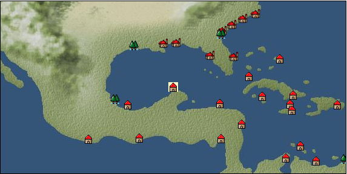

# Port: メリダ

import Tabs from '@theme/Tabs';
import TabItem from '@theme/TabItem';

## General Information

| Attribute | Details |
| :--- | :--- |
| **Port Name** | merida |
| **Port Type** | port of alliance |
| **Region** | Caribbean/Central America |
| **Sea Area** | gulf of mexico |
| **Required Language** | mayan languages |
| **Coordinates** | （12398，3920） |
| **Investment Reward** | [Dye secret](docs/Items/RecipeBooks/item_1943.md) （必要投資額：800,000ドゥカード） |

### Available Facilities

| guild | intermediary | exchange | tool shop | workshop craftsman | Painter | sculptor | peddler |
| --- | --- | --- | --- | --- | --- | --- | --- |
|   |   | ○ | ○ |   |   |   |   |
| Shipyard Master | Lumbermaker | Sail-maker | weapon craftsman | master | TavernFemale | archive | salesperson |
| --- | --- | --- | --- | --- | --- | --- | --- |
|   |   |   |   | ○ |   |   |   |
| Shipwright | 銀行 | street worker | 王宮 | Trading post | church | suburbs | translator |
| --- | --- | --- | --- | --- | --- | --- | --- |
| ○ | ○ | ○ |   |   |   | ○ |   |

### Description
A city located at the northwest tip of the Yucatan Peninsula, covered in tropical rainforest. It is said that the Mayan civilization flourished long ago. Suburbs: Southwest of Merida *Spanish is also spoken Cultural area: East coast of Central and South America

<Tabs>
  <TabItem value="trade_goods_sales" label="Trade Goods Sales">

| item | group | purchase price | 同盟時 | remarks |
| --- | --- | --- | --- | --- |
| [opal](docs/Items/TradeGoods/TradeGoods-Gems/item_2006.md) | [Trading Items (Gemstones)](docs/Categories/category_15.md) | (2,729) | 2,388 |  |
| 要投資（必要投資額：500,000） |
| [pumpkin](docs/Items/TradeGoods/TradeGoods-Foodstuffs/item_137.md) | [Trading items (food items)](docs/Categories/category_3.md) | (109) | 96 |  |
| [potato](docs/Items/TradeGoods/TradeGoods-Foodstuffs/item_106.md) | [Trading items (food items)](docs/Categories/category_3.md) | (132) | 116 |  |
| [chicle](docs/Items/TradeGoods/TradeGoods-Sunddries/item_4083.md) | [Trading goods (hobby goods)](docs/Categories/category_10.md) | 1,143 | 1,031 |  |
| 要投資（必要投資額：600,000） |
| [corn](docs/Items/TradeGoods/TradeGoods-Foodstuffs/item_138.md) | [Trading items (food items)](docs/Categories/category_3.md) | (54) | 48 |  |
| [tomato](docs/Items/TradeGoods/TradeGoods-Foodstuffs/item_1809.md) | [Trading items (food items)](docs/Categories/category_3.md) | (100) | 88 |  |
| [chicken](docs/Items/TradeGoods/TradeGoods-Livestock/item_252.md) | [Trading Goods (Livestock)](docs/Categories/category_18.md) | 50 | 44 |  |
| [silver](docs/Items/TradeGoods/TradeGoods-Metals/item_136.md) | [Trading products (precious metals)](docs/Categories/category_8.md) | 1,089 | 956 |  |
| 要投資（必要投資額：400,000） |
  </TabItem>
  <TabItem value="sale_specialty" label="Sale (Specialty)">

| item | group | sale price | 同盟時 | remarks |
| --- | --- | --- | --- | --- |

#### [交易品（繊維）](docs/Categories/category_1.md)

| [flax](docs/Items/TradeGoods/TradeGoods-Fibers/item_64.md) | 交易品（繊維） | (369) | 430 |  |
| [feather](docs/Items/TradeGoods/TradeGoods-Fibers/item_585.md) | 交易品（繊維） | (1,211) | 1,412 |  |
| 同盟時1080=86% |

#### [Trading products (medical products)](docs/Categories/category_6.md)

| [Nothing](docs/Items/TradeGoods/TradeGoods-Medicine/item_1053.md) | Trading products (medical products) | (1,015) | 1,184 |  |
| 同盟時1160=98% |

#### [交易品（酒類）](docs/Categories/category_9.md)

| [aquavit](docs/Items/TradeGoods/TradeGoods-Alcohol/item_572.md) | 交易品（酒類） | (1,379) | 1,608 |  |
| [whiskey](docs/Items/TradeGoods/TradeGoods-Alcohol/item_1.md) | 交易品（酒類） | (1,493) | 1,741 |  |
| [sherry](docs/Items/TradeGoods/TradeGoods-Alcohol/item_844.md) | 交易品（酒類） | (696) | 812 |  |
| [gin](docs/Items/TradeGoods/TradeGoods-Alcohol/item_291.md) | 交易品（酒類） | (1,576) | 1,838 |  |
| [fruit brandy](docs/Items/TradeGoods/TradeGoods-Alcohol/item_1440.md) | 交易品（酒類） | (1,225) | 1,429 |  |

#### [Trading goods (hobby goods)](docs/Categories/category_10.md)

| [banana](docs/Items/TradeGoods/TradeGoods-Sunddries/item_1947.md) | Trading goods (hobby goods) | 523 | 582 |  |
| [black tea](docs/Items/TradeGoods/TradeGoods-Sunddries/item_675.md) | Trading goods (hobby goods) | (2,104) | 2,455 |  |

#### [Trading Goods (Spices)](docs/Categories/category_11.md)

| [jasmine](docs/Items/TradeGoods/TradeGoods-Perfume/item_772.md) | Trading Goods (Spices) | (5,169) | 6,031 |  |
| [lira](docs/Items/TradeGoods/TradeGoods-Perfume/item_30.md) | Trading Goods (Spices) | (1,387) | 1,618 |  |
| [sandalwood](docs/Items/TradeGoods/TradeGoods-Perfume/item_771.md) | Trading Goods (Spices) | (4,036) | 4,709 |  |

#### [Trading Goods (Spices)](docs/Categories/category_12.md)

| [saffron](docs/Items/TradeGoods/TradeGoods-Spices/item_845.md) | Trading Goods (Spices) | (4,190) | 4,888 |  |

#### [Trading goods (artificial goods)](docs/Categories/category_13.md)

| [glasswork](docs/Items/TradeGoods/TradeGoods-Luxuries/item_60.md) | Trading goods (artificial goods) | (2,809) | 3,277 |  |

#### [交易品（美術品）](docs/Categories/category_14.md)

| [oil painting](docs/Items/TradeGoods/TradeGoods-Art/item_1088.md) | 交易品（美術品） | 5,093 | (5,730) |  |

#### [Trading Items (Gemstones)](docs/Categories/category_15.md)

| [pink diamond](docs/Items/TradeGoods/TradeGoods-Gems/item_2874.md) | Trading Items (Gemstones) | (11,215) | 13,086 |  |

#### [Trading Items (Arms)](docs/Categories/category_16.md)

| [damascus sword](docs/Items/TradeGoods/TradeGoods-Weapons/item_903.md) | Trading Items (Arms) | (7,140) | 8,331 |  |

#### [Trading Items (Firearms)](docs/Categories/category_17.md)

| [musket gun](docs/Items/TradeGoods/TradeGoods-Firearms/item_584.md) | Trading Items (Firearms) | (5,450) | 6,359 |  |

#### [交易品（織物）](docs/Categories/category_20.md)

| [damask](docs/Items/TradeGoods/TradeGoods-Fabrics/item_614.md) | 交易品（織物） | (6,466) | 7,544 |  |
| [turkish rug](docs/Items/TradeGoods/TradeGoods-Fabrics/item_686.md) | 交易品（織物） | (7,799) | 9,100 |  |
| 同盟時7280=80% |
| [flannel](docs/Items/TradeGoods/TradeGoods-Fabrics/item_149.md) | 交易品（織物） | (2,063) | 2,407 |  |
| [velvet](docs/Items/TradeGoods/TradeGoods-Fabrics/item_902.md) | 交易品（織物） | (6,139) | 7,163 |  |
  </TabItem>
  <TabItem value="sale_no_specialty" label="Sale (No Specialty)">

| item | group | sale price | 同盟時 | remarks |
| --- | --- | --- | --- | --- |

#### [交易品（繊維）](docs/Categories/category_1.md)

| [sisal hemp](docs/Items/TradeGoods/TradeGoods-Fibers/item_1766.md) | 交易品（繊維） | (224) | 261 |  |
| ▲Special products from the same cultural area |
| [raw silk](docs/Items/TradeGoods/TradeGoods-Fibers/item_677.md) | 交易品（繊維） | (2,119) | 2,472 |  |
| [cotton](docs/Items/TradeGoods/TradeGoods-Fibers/item_610.md) | 交易品（繊維） | 523 | (588) |  |
| [wool](docs/Items/TradeGoods/TradeGoods-Fibers/item_5.md) | 交易品（繊維） | (403) | 470 |  |

#### [Trading Goods (Dye)](docs/Categories/category_2.md)

| [natal indigo](docs/Items/TradeGoods/TradeGoods-Dye/item_4102.md) | Trading Goods (Dye) | 1,379 | (1,551) |  |
| [log wood](docs/Items/TradeGoods/TradeGoods-Dye/item_1813.md) | Trading Goods (Dye) | (696) | 812 |  |
| [貝紫](docs/Items/TradeGoods/TradeGoods-Dye/item_110.md) | Trading Goods (Dye) | (3,919) | 4,572 |  |

#### [Trading items (food items)](docs/Categories/category_3.md)

| [mushroom](docs/Items/TradeGoods/TradeGoods-Foodstuffs/item_160.md) | Trading items (food items) | 32 | 32 |  |
| [duck meat](docs/Items/TradeGoods/TradeGoods-Foodstuffs/item_32.md) | Trading items (food items) | (528) | 616 |  |
| [sweet potato](docs/Items/TradeGoods/TradeGoods-Foodstuffs/item_1931.md) | Trading items (food items) | (91) | 106 |  |
| [cactus](docs/Items/TradeGoods/TradeGoods-Foodstuffs/item_2740.md) | Trading items (food items) | (175) | 204 |  |
| [corn](docs/Items/TradeGoods/TradeGoods-Foodstuffs/item_138.md) | Trading items (food items) | (21) | 24 |  |
| [egg](docs/Items/TradeGoods/TradeGoods-Foodstuffs/item_40.md) | Trading items (food items) | (31) | 36 |  |
| [Paddy rice](docs/Items/TradeGoods/TradeGoods-Foodstuffs/item_654.md) | Trading items (food items) | 117 | (131) |  |
| [mutton](docs/Items/TradeGoods/TradeGoods-Foodstuffs/item_33.md) | Trading items (food items) | 555 | (624) |  |
| [chicken meat](docs/Items/TradeGoods/TradeGoods-Foodstuffs/item_29.md) | Trading items (food items) | (581) | 677 |  |

#### [交易品（調味料）](docs/Categories/category_4.md)

| [coconut vinegar](docs/Items/TradeGoods/TradeGoods-Seasonings/item_1988.md) | 交易品（調味料） | (428) | 499 |  |
| [peanut oil](docs/Items/TradeGoods/TradeGoods-Seasonings/item_596.md) | 交易品（調味料） | (415) | 484 |  |
| [salt](docs/Items/TradeGoods/TradeGoods-Seasonings/item_42.md) | 交易品（調味料） | (234) | 272 |  |
| [sugar](docs/Items/TradeGoods/TradeGoods-Seasonings/item_94.md) | 交易品（調味料） | 1,000 | (1,125) |  |

#### [交易品（雑貨）](docs/Categories/category_5.md)

| [Western books](docs/Items/TradeGoods/TradeGoods-Misc/item_293.md) | 交易品（雑貨） | (564) | 658 |  |

#### [Trading products (medical products)](docs/Categories/category_6.md)

| [belladonna](docs/Items/TradeGoods/TradeGoods-Medicine/item_1056.md) | Trading products (medical products) | (478) | 557 |  |

#### [Trading Items (Iron Stone)](docs/Categories/category_7.md)

| [copper ore](docs/Items/TradeGoods/TradeGoods-Minerals/item_65.md) | Trading Items (Iron Stone) | 916 | (1,030) |  |

#### [Trading products (precious metals)](docs/Categories/category_8.md)

| [gold dust](docs/Items/TradeGoods/TradeGoods-Metals/item_111.md) | Trading products (precious metals) | (1,894) | 2,210 |  |
| [silver](docs/Items/TradeGoods/TradeGoods-Metals/item_136.md) | Trading products (precious metals) | 477 | (536) |  |
| 要投資（必要投資額：400,000） |

#### [交易品（酒類）](docs/Categories/category_9.md)

| [tequila](docs/Items/TradeGoods/TradeGoods-Alcohol/item_108.md) | 交易品（酒類） | (993) | 1,158 |  |
| [brandy](docs/Items/TradeGoods/TradeGoods-Alcohol/item_9.md) | 交易品（酒類） | (1,348) | 1,572 |  |
| [rum](docs/Items/TradeGoods/TradeGoods-Alcohol/item_139.md) | 交易品（酒類） | 614 | (690) |  |

#### [Trading goods (hobby goods)](docs/Categories/category_10.md)

| [cacao](docs/Items/TradeGoods/TradeGoods-Sunddries/item_140.md) | Trading goods (hobby goods) | 933 | (1,049) |  |
| [cashew nuts](docs/Items/TradeGoods/TradeGoods-Sunddries/item_2120.md) | Trading goods (hobby goods) | (348) | 405 |  |
| [cranberry](docs/Items/TradeGoods/TradeGoods-Sunddries/item_4008.md) | Trading goods (hobby goods) | 464 | (522) |  |
| [coffee](docs/Items/TradeGoods/TradeGoods-Sunddries/item_445.md) | Trading goods (hobby goods) | 542 | (609) |  |
| [tobacco](docs/Items/TradeGoods/TradeGoods-Sunddries/item_109.md) | Trading goods (hobby goods) | 636 | 636 |  |
| [pineapple](docs/Items/TradeGoods/TradeGoods-Sunddries/item_867.md) | Trading goods (hobby goods) | (905) | 1,055 |  |
| [peanuts](docs/Items/TradeGoods/TradeGoods-Sunddries/item_134.md) | Trading goods (hobby goods) | (160) | 186 |  |
| ▲Special products from neighboring cultural areas |

#### [Trading Goods (Spices)](docs/Categories/category_12.md)

| [chili pepper](docs/Items/TradeGoods/TradeGoods-Spices/item_1831.md) | Trading Goods (Spices) | (254) | 296 |  |
| [green chili pepper](docs/Items/TradeGoods/TradeGoods-Spices/item_1990.md) | Trading Goods (Spices) | (399) | 465 |  |

#### [Trading goods (artificial goods)](docs/Categories/category_13.md)

| [lapidary work](docs/Items/TradeGoods/TradeGoods-Luxuries/item_153.md) | Trading goods (artificial goods) | (6,196) | 7,229 |  |
| [ethnic costume](docs/Items/TradeGoods/TradeGoods-Luxuries/item_4050.md) | Trading goods (artificial goods) | 2,304 | (2,592) |  |
| [ceramics](docs/Items/TradeGoods/TradeGoods-Luxuries/item_152.md) | Trading goods (artificial goods) | (1,332) | 1,554 |  |

#### [交易品（美術品）](docs/Categories/category_14.md)

| [marble statue](docs/Items/TradeGoods/TradeGoods-Art/item_50.md) | 交易品（美術品） | (2,673) | 3,119 |  |
| [wooden statue](docs/Items/TradeGoods/TradeGoods-Art/item_95.md) | 交易品（美術品） | (995) | 1,160 |  |
| [stone statue](docs/Items/TradeGoods/TradeGoods-Art/item_899.md) | 交易品（美術品） | 1,760 | (1,980) |  |
| [青銅像](docs/Items/TradeGoods/TradeGoods-Art/item_148.md) | 交易品（美術品） | 1,096 | (1,233) |  |

#### [Trading Items (Gemstones)](docs/Categories/category_15.md)

| [Agate](docs/Items/TradeGoods/TradeGoods-Gems/item_107.md) | Trading Items (Gemstones) | 2,382 | 2,273 |  |
| [coral](docs/Items/TradeGoods/TradeGoods-Gems/item_141.md) | Trading Items (Gemstones) | 3,200 | (3,600) |  |
| [peridot](docs/Items/TradeGoods/TradeGoods-Gems/item_1098.md) | Trading Items (Gemstones) | 2,237 | (2,516) |  |
| [crystal](docs/Items/TradeGoods/TradeGoods-Gems/item_893.md) | Trading Items (Gemstones) | (1,147) | 1,338 |  |
| [pearl](docs/Items/TradeGoods/TradeGoods-Gems/item_769.md) | Trading Items (Gemstones) | (4,885) | 5,700 |  |

#### [Trading Items (Firearms)](docs/Categories/category_17.md)

| [arquebus gun](docs/Items/TradeGoods/TradeGoods-Firearms/item_14.md) | Trading Items (Firearms) | (2,440) | 2,847 |  |
| [大砲](docs/Items/TradeGoods/TradeGoods-Firearms/item_4.md) | Trading Items (Firearms) | (4,736) | 5,526 |  |
| [bullet](docs/Items/TradeGoods/TradeGoods-Firearms/item_13.md) | Trading Items (Firearms) | (1,091) | 1,272 |  |
| [cannonball](docs/Items/TradeGoods/TradeGoods-Firearms/item_144.md) | Trading Items (Firearms) | (1,516) | 1,768 |  |

#### [Trading Goods (Livestock)](docs/Categories/category_18.md)

| [duck](docs/Items/TradeGoods/TradeGoods-Livestock/item_38.md) | Trading Goods (Livestock) | (60) | 69 |  |

#### [交易品（工業品）](docs/Categories/category_19.md)

| [wax](docs/Items/TradeGoods/TradeGoods-Wares/item_54.md) | 交易品（工業品） | 1,042 | (1,172) |  |
| [log](docs/Items/TradeGoods/TradeGoods-Wares/item_846.md) | 交易品（工業品） | (131) | 152 |  |
| [wood](docs/Items/TradeGoods/TradeGoods-Wares/item_277.md) | 交易品（工業品） | (694) | 809 |  |
| [paper](docs/Items/TradeGoods/TradeGoods-Wares/item_625.md) | 交易品（工業品） | (474) | 552 |  |
| [鋼](docs/Items/TradeGoods/TradeGoods-Wares/item_573.md) | 交易品（工業品） | (1,079) | 1,258 |  |

#### [交易品（織物）](docs/Categories/category_20.md)

| [cotton fabric](docs/Items/TradeGoods/TradeGoods-Fabrics/item_571.md) | 交易品（織物） | (1,082) | 1,262 |  |
  </TabItem>
  <TabItem value="guild_&_others" label="Guild & Others">

| item | group | Sales price | Handling NPC | remarks |
| --- | --- | --- | --- | --- |
| There is no sales information for the item |
| --- |
  </TabItem>
  <TabItem value="toolman" label="Toolman">

| item | group | Sales price | Handling NPC | remarks |
| --- | --- | --- | --- | --- |

#### [recipe book](docs/Categories/category_22.md)

| [Concheros sandal manufacturing method](docs/Items/RecipeBooks/item_1815.md) | recipe book | Fixed recipe | tool shop owner |  |

#### [Equipment (body)](docs/Categories/category_24.md)

| [Surcoat](docs/Items/Equipment/Equipment-Body/item_131.md) | Equipment (body) | 30,000 | tool shop owner |  |

#### [Equipment (legs)](docs/Categories/category_26.md)

| [boots](docs/Items/Equipment/Equipment-Feet/item_365.md) | Equipment (legs) | 100 | tool shop owner |  |

#### [Equipment (belongings)](docs/Categories/category_27.md)

| [long sword](docs/Items/Equipment/Equipment-Weapon/item_302.md) | Equipment (belongings) | 15,400 | tool shop owner |  |

#### [Consumables (land battle/deck battle)](docs/Categories/category_29.md)

| [Taheebo juice](docs/Items/Consumables/Consumables-Landbattle/item_1807.md) | Consumables (land battle/deck battle) | 300 | tool shop owner |  |
| [taheebo bottle](docs/Items/Consumables/Consumables-Landbattle/item_1823.md) | Consumables (land battle/deck battle) | 600 | tool shop owner |  |
| 要投資（必要投資額：120,000） |
| [tonic](docs/Items/Consumables/Consumables-Landbattle/item_1678.md) | Consumables (land battle/deck battle) | 300 | tool shop owner |  |
| [torch for throwing](docs/Items/Consumables/Consumables-Landbattle/item_313.md) | Consumables (land battle/deck battle) | 150 | tool shop owner |  |
  </TabItem>
</Tabs>