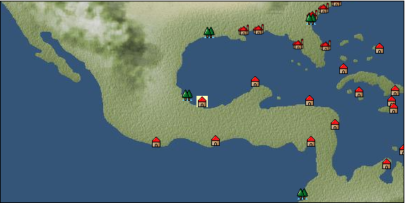

# Port: ヴェラクルス

import Tabs from '@theme/Tabs';
import TabItem from '@theme/TabItem';

## General Information

| Attribute | Details |
| :--- | :--- |
| **Port Name** | veracruz |
| **Port Type** | port of alliance |
| **Region** | Caribbean/Central America |
| **Sea Area** | gulf of mexico |
| **Required Language** | mayan languages |
| **Coordinates** | （12101，4036） |
| **Investment Reward** | [Autobiography of a wealthy merchant](docs/Items/RecipeBooks/item_1944.md) （必要投資額：1,000,000ドゥカード） |

### Available Facilities

| guild | intermediary | exchange | tool shop | workshop craftsman | Painter | sculptor | peddler |
| --- | --- | --- | --- | --- | --- | --- | --- |
|   |   | ○ | ○ | ○ |   |   | ○ |
| Shipyard Master | Lumbermaker | Sail-maker | weapon craftsman | master | TavernFemale | archive | salesperson |
| --- | --- | --- | --- | --- | --- | --- | --- |
|   |   |   | ○ |   |   |   |   |
| Shipwright | 銀行 | street worker | 王宮 | Trading post | church | suburbs | translator |
| --- | --- | --- | --- | --- | --- | --- | --- |
| ○ | ○ | ○ |   |   |   | ○ |   |

### Description
The city's name means "True Cross" in Spanish. In the early 16th century, Hernán Cortés landed here, and it became the main gateway for maritime trade in the Gulf of Mexico. Suburbs: Southeast of Veracruz/South of Veracruz *Spanish is also spoken Cultural area: East coast of Central and South America

<Tabs>
  <TabItem value="trade_goods_sales" label="Trade Goods Sales">

| item | group | purchase price | 同盟時 | remarks |
| --- | --- | --- | --- | --- |
| [coffee](docs/Items/TradeGoods/TradeGoods-Sunddries/item_445.md) | [Trading goods (hobby goods)](docs/Categories/category_10.md) | (429) | 376 |  |
| [potato](docs/Items/TradeGoods/TradeGoods-Foodstuffs/item_106.md) | [Trading items (food items)](docs/Categories/category_3.md) | (132) | 116 |  |
| [corn](docs/Items/TradeGoods/TradeGoods-Foodstuffs/item_138.md) | [Trading items (food items)](docs/Categories/category_3.md) | (54) | 48 |  |
| [basil](docs/Items/TradeGoods/TradeGoods-Spices/item_126.md) | [Trading Goods (Spices)](docs/Categories/category_12.md) | (118) | 104 |  |
| [mayan blue](docs/Items/TradeGoods/TradeGoods-Dye/item_1096.md) | [Trading Goods (Dye)](docs/Categories/category_2.md) | (534) | 468 |  |
| 要投資（必要投資額：500,000） |
| [gold](docs/Items/TradeGoods/TradeGoods-Metals/item_659.md) | [Trading products (precious metals)](docs/Categories/category_8.md) | (4,501) | 3,938 |  |
| 要投資（必要投資額：550,000） |
| [silver](docs/Items/TradeGoods/TradeGoods-Metals/item_136.md) | [Trading products (precious metals)](docs/Categories/category_8.md) | 983 | 879 |  |
| 要投資（必要投資額：320,000） |
  </TabItem>
  <TabItem value="sale_specialty" label="Sale (Specialty)">

| item | group | sale price | 同盟時 | remarks |
| --- | --- | --- | --- | --- |

#### [交易品（繊維）](docs/Categories/category_1.md)

| [feather](docs/Items/TradeGoods/TradeGoods-Fibers/item_585.md) | 交易品（繊維） | (1,049) | 1,223 |  |
| 同盟時82%=1050　90%=1100 |

#### [Trading Goods (Dye)](docs/Categories/category_2.md)

| [ward](docs/Items/TradeGoods/TradeGoods-Dye/item_57.md) | Trading Goods (Dye) | (2,338) | 2,727 |  |
| [mimosa](docs/Items/TradeGoods/TradeGoods-Dye/item_2281.md) | Trading Goods (Dye) | (1,149) | 1,340 |  |
| 同盟時1420＝106% |

#### [交易品（調味料）](docs/Categories/category_4.md)

| [tamarind](docs/Items/TradeGoods/TradeGoods-Seasonings/item_1968.md) | 交易品（調味料） | (1,204) | 1,404 |  |
| 同盟時1460=104% |
| [apple cider vinegar](docs/Items/TradeGoods/TradeGoods-Seasonings/item_882.md) | 交易品（調味料） | (866) | 1,010 |  |
| 同盟時929=92% |

#### [Trading products (medical products)](docs/Categories/category_6.md)

| [Nothing](docs/Items/TradeGoods/TradeGoods-Medicine/item_1053.md) | Trading products (medical products) | (989) | 1,153 |  |
| 同盟時1210=105% |

#### [交易品（酒類）](docs/Categories/category_9.md)

| [aquavit](docs/Items/TradeGoods/TradeGoods-Alcohol/item_572.md) | 交易品（酒類） | (1,475) | 1,720 |  |
| [whiskey](docs/Items/TradeGoods/TradeGoods-Alcohol/item_1.md) | 交易品（酒類） | (1,517) | 1,770 |  |
| [sherry](docs/Items/TradeGoods/TradeGoods-Alcohol/item_844.md) | 交易品（酒類） | (690) | 805 |  |
| [gin](docs/Items/TradeGoods/TradeGoods-Alcohol/item_291.md) | 交易品（酒類） | (1,466) | 1,710 |  |
| [fruit brandy](docs/Items/TradeGoods/TradeGoods-Alcohol/item_1440.md) | 交易品（酒類） | (1,140) | 1,330 |  |
| 同盟時100% |

#### [Trading goods (hobby goods)](docs/Categories/category_10.md)

| [caviar](docs/Items/TradeGoods/TradeGoods-Sunddries/item_2122.md) | Trading goods (hobby goods) | (1,552) | 1,810 |  |
| 同盟時1990=110% |
| [durian](docs/Items/TradeGoods/TradeGoods-Sunddries/item_1949.md) | Trading goods (hobby goods) | (1,952) | 2,277 |  |
| 同盟時1480=65% |
| [banana](docs/Items/TradeGoods/TradeGoods-Sunddries/item_1947.md) | Trading goods (hobby goods) | 530 | (596) |  |
| [prune](docs/Items/TradeGoods/TradeGoods-Sunddries/item_523.md) | Trading goods (hobby goods) | (706) | 823 |  |
| 同盟時773-94% |
| [macadamia nuts](docs/Items/TradeGoods/TradeGoods-Sunddries/item_2282.md) | Trading goods (hobby goods) | (925) | 1,079 |  |
| 同盟時971=90% |
| [black tea](docs/Items/TradeGoods/TradeGoods-Sunddries/item_675.md) | Trading goods (hobby goods) | (2,104) | 2,455 |  |

#### [Trading Goods (Spices)](docs/Categories/category_11.md)

| [jasmine](docs/Items/TradeGoods/TradeGoods-Perfume/item_772.md) | Trading Goods (Spices) | (5,169) | 6,031 |  |
| [eucalyptus](docs/Items/TradeGoods/TradeGoods-Perfume/item_2278.md) | Trading Goods (Spices) | (838) | 977 |  |
| 同盟時898=92% |
| [lira](docs/Items/TradeGoods/TradeGoods-Perfume/item_30.md) | Trading Goods (Spices) | (1,410) | 1,645 |  |
| 同盟時1480=90% |
| [benzoin](docs/Items/TradeGoods/TradeGoods-Perfume/item_1962.md) | Trading Goods (Spices) | (1,725) | 2,012 |  |
| 同盟時85%=1710 |
| [sandalwood](docs/Items/TradeGoods/TradeGoods-Perfume/item_771.md) | Trading Goods (Spices) | (3,497) | 4,080 |  |

#### [Trading Goods (Spices)](docs/Categories/category_12.md)

| [saffron](docs/Items/TradeGoods/TradeGoods-Spices/item_845.md) | Trading Goods (Spices) | (4,612) | 5,381 |  |
| [nutmeg](docs/Items/TradeGoods/TradeGoods-Spices/item_1969.md) | Trading Goods (Spices) | (4,519) | 5,273 |  |
| [mace](docs/Items/TradeGoods/TradeGoods-Spices/item_2100.md) | Trading Goods (Spices) | (4,687) | 5,468 |  |

#### [Trading goods (artificial goods)](docs/Categories/category_13.md)

| [glasswork](docs/Items/TradeGoods/TradeGoods-Luxuries/item_60.md) | Trading goods (artificial goods) | (2,751) | 3,210 |  |
| 同盟時100% |

#### [Trading Items (Gemstones)](docs/Categories/category_15.md)

| [jade](docs/Items/TradeGoods/TradeGoods-Gems/item_2015.md) | Trading Items (Gemstones) | (4,060) | 4,737 |  |
| [sapphire](docs/Items/TradeGoods/TradeGoods-Gems/item_676.md) | Trading Items (Gemstones) | (6,148) | 7,173 |  |
| [diamond](docs/Items/TradeGoods/TradeGoods-Gems/item_449.md) | Trading Items (Gemstones) | (3,668) | 4,280 |  |
| [pink diamond](docs/Items/TradeGoods/TradeGoods-Gems/item_2874.md) | Trading Items (Gemstones) | (11,602) | 13,537 |  |
| [ruby](docs/Items/TradeGoods/TradeGoods-Gems/item_773.md) | Trading Items (Gemstones) | (5,628) | 6,566 |  |

#### [Trading Items (Arms)](docs/Categories/category_16.md)

| [damascus sword](docs/Items/TradeGoods/TradeGoods-Weapons/item_903.md) | Trading Items (Arms) | (7,384) | 8,615 |  |
| 同盟時109%=9390 |

#### [Trading Items (Firearms)](docs/Categories/category_17.md)

| [musket gun](docs/Items/TradeGoods/TradeGoods-Firearms/item_584.md) | Trading Items (Firearms) | (5,183) | 6,047 |  |

#### [交易品（織物）](docs/Categories/category_20.md)

| [java chintz](docs/Items/TradeGoods/TradeGoods-Fabrics/item_1970.md) | 交易品（織物） | (2,772) | 3,234 |  |
| 同盟時90%=2910 |
| [damask](docs/Items/TradeGoods/TradeGoods-Fabrics/item_614.md) | 交易品（織物） | (6,023) | 7,028 |  |
| 同盟時7590=108% |
| [turkish rug](docs/Items/TradeGoods/TradeGoods-Fabrics/item_686.md) | 交易品（織物） | (6,817) | 7,954 |  |
| 7280=80%　8510=107% |
| [velvet](docs/Items/TradeGoods/TradeGoods-Fabrics/item_902.md) | 交易品（織物） | (5,914) | 6,900 |  |
  </TabItem>
  <TabItem value="sale_no_specialty" label="Sale (No Specialty)">

| item | group | sale price | 同盟時 | remarks |
| --- | --- | --- | --- | --- |

#### [交易品（繊維）](docs/Categories/category_1.md)

| [sisal hemp](docs/Items/TradeGoods/TradeGoods-Fibers/item_1766.md) | 交易品（繊維） | 224 | 261 |  |
| ▲Special products from the same cultural area |
| [ramy](docs/Items/TradeGoods/TradeGoods-Fibers/item_1961.md) | 交易品（繊維） | (222) | 259 |  |
| 同盟時104%=269 |
| [raw silk](docs/Items/TradeGoods/TradeGoods-Fibers/item_677.md) | 交易品（繊維） | (2,117) | 2,470 |  |
| [wool](docs/Items/TradeGoods/TradeGoods-Fibers/item_5.md) | 交易品（繊維） | (403) | 470 |  |

#### [Trading Goods (Dye)](docs/Categories/category_2.md)

| [Gerep](docs/Items/TradeGoods/TradeGoods-Dye/item_1814.md) | Trading Goods (Dye) | (500) | 583 |  |
| [cochineal](docs/Items/TradeGoods/TradeGoods-Dye/item_1817.md) | Trading Goods (Dye) | (630) | 734 |  |
| [貝紫](docs/Items/TradeGoods/TradeGoods-Dye/item_110.md) | Trading Goods (Dye) | (3,919) | 4,572 |  |

#### [Trading items (food items)](docs/Categories/category_3.md)

| [mushroom](docs/Items/TradeGoods/TradeGoods-Foodstuffs/item_160.md) | Trading items (food items) | 32 | (36) |  |
| [duck meat](docs/Items/TradeGoods/TradeGoods-Foodstuffs/item_32.md) | Trading items (food items) | (528) | 616 |  |
| [pumpkin](docs/Items/TradeGoods/TradeGoods-Foodstuffs/item_137.md) | Trading items (food items) | (124) | 144 |  |
| [Cassava](docs/Items/TradeGoods/TradeGoods-Foodstuffs/item_1805.md) | Trading items (food items) | 72 | (81) |  |
| [egg](docs/Items/TradeGoods/TradeGoods-Foodstuffs/item_40.md) | Trading items (food items) | (31) | 36 |  |
| [wheat](docs/Items/TradeGoods/TradeGoods-Foodstuffs/item_16.md) | Trading items (food items) | 112 | (126) |  |
| [Paddy rice](docs/Items/TradeGoods/TradeGoods-Foodstuffs/item_654.md) | Trading items (food items) | 117 | (131) |  |
| [mutton](docs/Items/TradeGoods/TradeGoods-Foodstuffs/item_33.md) | Trading items (food items) | 551 | (619) |  |
| [魚肉](docs/Items/TradeGoods/TradeGoods-Foodstuffs/item_10.md) | Trading items (food items) | 204 | (229) |  |
| [chicken meat](docs/Items/TradeGoods/TradeGoods-Foodstuffs/item_29.md) | Trading items (food items) | (581) | 677 |  |

#### [交易品（調味料）](docs/Categories/category_4.md)

| [coconut vinegar](docs/Items/TradeGoods/TradeGoods-Seasonings/item_1988.md) | 交易品（調味料） | (428) | 499 |  |
| [peanut oil](docs/Items/TradeGoods/TradeGoods-Seasonings/item_596.md) | 交易品（調味料） | (415) | 484 |  |
| [salt](docs/Items/TradeGoods/TradeGoods-Seasonings/item_42.md) | 交易品（調味料） | (234) | 272 |  |

#### [交易品（雑貨）](docs/Categories/category_5.md)

| [Western books](docs/Items/TradeGoods/TradeGoods-Misc/item_293.md) | 交易品（雑貨） | 566 | 658 |  |

#### [Trading products (medical products)](docs/Categories/category_6.md)

| [cinchona bark](docs/Items/TradeGoods/TradeGoods-Medicine/item_2121.md) | Trading products (medical products) | (700) | 816 |  |
| [dandelion](docs/Items/TradeGoods/TradeGoods-Medicine/item_1089.md) | Trading products (medical products) | (258) | 300 |  |
| [belladonna](docs/Items/TradeGoods/TradeGoods-Medicine/item_1056.md) | Trading products (medical products) | (478) | 557 |  |

#### [Trading products (precious metals)](docs/Categories/category_8.md)

| [gold dust](docs/Items/TradeGoods/TradeGoods-Metals/item_111.md) | Trading products (precious metals) | (1,894) | 2,209 |  |

#### [交易品（酒類）](docs/Categories/category_9.md)

| [tequila](docs/Items/TradeGoods/TradeGoods-Alcohol/item_108.md) | 交易品（酒類） | (1,023) | 1,193 |  |
| [brandy](docs/Items/TradeGoods/TradeGoods-Alcohol/item_9.md) | 交易品（酒類） | 1,460 | (1,642) |  |
| [wine](docs/Items/TradeGoods/TradeGoods-Alcohol/item_11.md) | 交易品（酒類） | 606 | (681) |  |

#### [Trading goods (hobby goods)](docs/Categories/category_10.md)

| [tobacco](docs/Items/TradeGoods/TradeGoods-Sunddries/item_109.md) | Trading goods (hobby goods) | (546) | 636 |  |
| ▲Special products from neighboring cultural areas |
| [chicle](docs/Items/TradeGoods/TradeGoods-Sunddries/item_4083.md) | Trading goods (hobby goods) | (842) | 982 |  |
| ▲Special products from neighboring cultural areas |
| [pineapple](docs/Items/TradeGoods/TradeGoods-Sunddries/item_867.md) | Trading goods (hobby goods) | (905) | 1,055 |  |
| [papaya](docs/Items/TradeGoods/TradeGoods-Sunddries/item_1948.md) | Trading goods (hobby goods) | (417) | 486 |  |
| 同盟時427=88% |
| [peanuts](docs/Items/TradeGoods/TradeGoods-Sunddries/item_134.md) | Trading goods (hobby goods) | (160) | 186 |  |
| ▲Special products from the same cultural area |

#### [Trading Goods (Spices)](docs/Categories/category_12.md)

| [basil](docs/Items/TradeGoods/TradeGoods-Spices/item_126.md) | Trading Goods (Spices) | 52 | (58) |  |
| [vanilla](docs/Items/TradeGoods/TradeGoods-Spices/item_1810.md) | Trading Goods (Spices) | 389 | (437) |  |

#### [Trading goods (artificial goods)](docs/Categories/category_13.md)

| [lapidary work](docs/Items/TradeGoods/TradeGoods-Luxuries/item_153.md) | Trading goods (artificial goods) | (6,197) | 7,230 |  |
| 同盟時5780=80% 7230=100% |
| [silversmith](docs/Items/TradeGoods/TradeGoods-Luxuries/item_619.md) | Trading goods (artificial goods) | (2,425) | 2,829 |  |
| [luxury furniture](docs/Items/TradeGoods/TradeGoods-Luxuries/item_1048.md) | Trading goods (artificial goods) | (2,472) | 2,884 |  |

#### [交易品（美術品）](docs/Categories/category_14.md)

| [marble statue](docs/Items/TradeGoods/TradeGoods-Art/item_50.md) | 交易品（美術品） | (2,664) | 3,108 |  |
| [wooden statue](docs/Items/TradeGoods/TradeGoods-Art/item_95.md) | 交易品（美術品） | (995) | 1,160 |  |

#### [Trading Items (Gemstones)](docs/Categories/category_15.md)

| [opal](docs/Items/TradeGoods/TradeGoods-Gems/item_2006.md) | Trading Items (Gemstones) | (2,293) | 2,675 |  |
| [garnet](docs/Items/TradeGoods/TradeGoods-Gems/item_1005.md) | Trading Items (Gemstones) | (1,941) | 2,264 |  |
| [crystal](docs/Items/TradeGoods/TradeGoods-Gems/item_893.md) | Trading Items (Gemstones) | (1,146) | 1,337 |  |
| [pearl](docs/Items/TradeGoods/TradeGoods-Gems/item_769.md) | Trading Items (Gemstones) | (4,885) | 5,700 |  |
| 同盟時100% |

#### [Trading Items (Arms)](docs/Categories/category_16.md)

| [dagger](docs/Items/TradeGoods/TradeGoods-Weapons/item_143.md) | Trading Items (Arms) | (809) | 943 |  |
| 同盟時829=88% |

#### [Trading Items (Firearms)](docs/Categories/category_17.md)

| [大砲](docs/Items/TradeGoods/TradeGoods-Firearms/item_4.md) | Trading Items (Firearms) | 5,253 | (5,910) |  |
| [cannonball](docs/Items/TradeGoods/TradeGoods-Firearms/item_144.md) | Trading Items (Firearms) | 1,748 | 1,770 |  |
| 同盟時1840=104% |

#### [Trading Goods (Livestock)](docs/Categories/category_18.md)

| [duck](docs/Items/TradeGoods/TradeGoods-Livestock/item_38.md) | Trading Goods (Livestock) | (60) | 69 |  |
| [cow](docs/Items/TradeGoods/TradeGoods-Livestock/item_17.md) | Trading Goods (Livestock) | 339 | (381) |  |
| [chicken](docs/Items/TradeGoods/TradeGoods-Livestock/item_252.md) | Trading Goods (Livestock) | (48) | 55 |  |

#### [交易品（工業品）](docs/Categories/category_19.md)

| [rubber](docs/Items/TradeGoods/TradeGoods-Wares/item_2819.md) | 交易品（工業品） | (660) | 770 |  |
| [wood](docs/Items/TradeGoods/TradeGoods-Wares/item_277.md) | 交易品（工業品） | (694) | 809 |  |
| [paper](docs/Items/TradeGoods/TradeGoods-Wares/item_625.md) | 交易品（工業品） | 475 | 552 |  |
  </TabItem>
  <TabItem value="guild_&_others" label="Guild & Others">

| item | group | Sales price | Handling NPC | remarks |
| --- | --- | --- | --- | --- |

#### Las Casas

| [管理技術](docs/Skills/Skill-Trade/item_1726.md) | [Skill (trade)](docs/Categories/category_40.md) | 300,000 | Las Casas |  |
| [Nahuatl](docs/Skills/Skills-Language/item_2338.md) | [Skills (language)](docs/Categories/category_42.md) | 800,000 | Las Casas |  |
  </TabItem>
  <TabItem value="toolman" label="Toolman">

| item | group | Sales price | Handling NPC | remarks |
| --- | --- | --- | --- | --- |

#### [recipe book](docs/Categories/category_22.md)

| [How to sew a poncho dress](docs/Items/RecipeBooks/item_1816.md) | recipe book | Fixed recipe | tool shop owner |  |

#### [Equipment (body)](docs/Categories/category_24.md)

| [Surcoat](docs/Items/Equipment/Equipment-Body/item_131.md) | Equipment (body) | 30,000 | tool shop owner |  |

#### [Equipment (legs)](docs/Categories/category_26.md)

| [boots](docs/Items/Equipment/Equipment-Feet/item_365.md) | Equipment (legs) | 100 | tool shop owner |  |

#### [Equipment (belongings)](docs/Categories/category_27.md)

| [long sword](docs/Items/Equipment/Equipment-Weapon/item_302.md) | Equipment (belongings) | 15,400 | tool shop owner |  |

#### [Consumables (land battle/deck battle)](docs/Categories/category_29.md)

| [Taheebo juice](docs/Items/Consumables/Consumables-Landbattle/item_1807.md) | Consumables (land battle/deck battle) | 300 | tool shop owner |  |
| [taheebo bottle](docs/Items/Consumables/Consumables-Landbattle/item_1823.md) | Consumables (land battle/deck battle) | 600 | tool shop owner |  |
| 要投資（必要投資額：120,000） |
| [tonic](docs/Items/Consumables/Consumables-Landbattle/item_1678.md) | Consumables (land battle/deck battle) | 300 | tool shop owner |  |
| [torch for throwing](docs/Items/Consumables/Consumables-Landbattle/item_313.md) | Consumables (land battle/deck battle) | 150 | tool shop owner |  |

#### [Consumables (request documents)](docs/Categories/category_45.md)

| [spice purchase order](docs/Items/Consumables/Consumables-Documents/item_4918.md) | Consumables (request documents) | 60,000 | tool shop owner |  |
  </TabItem>
  <TabItem value="kobo_craftsmen" label="Craftsman">

| item | group | Sales price | Handling NPC | remarks |
| --- | --- | --- | --- | --- |

#### [Consumables (condition recovery)](docs/Categories/category_21.md)

| [Nostalgic carillon bell](docs/Items/Consumables/Consumables-Recovery/item_245.md) | Consumables (condition recovery) | 200 | workshop craftsman |  |
| [Ship song sheet music](docs/Items/Consumables/Consumables-Recovery/item_247.md) | Consumables (condition recovery) | 200 | workshop craftsman |  |

#### [Consumables (other)](docs/Categories/category_44.md)

| [帆塗料](docs/Items/Consumables/Consumables-Other/item_348.md) | Consumables (other) | 500 | workshop craftsman |  |
| [ship paint](docs/Items/Consumables/Consumables-Other/item_347.md) | Consumables (other) | 500 | workshop craftsman |  |
  </TabItem>
  <TabItem value="peddler" label="peddler">

| item | group | Sales price | Handling NPC | remarks |
| --- | --- | --- | --- | --- |

#### [Consumables (condition recovery)](docs/Categories/category_21.md)

| [spare sail](docs/Items/Consumables/Consumables-Recovery/item_242.md) | Consumables (condition recovery) |  | peddler |  |
| [recreational sake barrel](docs/Items/Consumables/Consumables-Recovery/item_83.md) | Consumables (condition recovery) |  | peddler |  |
| [fire extinguishing sand](docs/Items/Consumables/Consumables-Recovery/item_68.md) | Consumables (condition recovery) |  | peddler |  |

#### [Consumables (land battle/deck battle)](docs/Categories/category_29.md)

| [suma juice](docs/Items/Consumables/Consumables-Landbattle/item_1825.md) | Consumables (land battle/deck battle) |  | peddler |  |
| [chili pepper sauce](docs/Items/Consumables/Consumables-Landbattle/item_1826.md) | Consumables (land battle/deck battle) |  | peddler |  |
| [煙玉](docs/Items/Consumables/Consumables-Landbattle/item_86.md) | Consumables (land battle/deck battle) |  | peddler |  |

#### [Consumables (naval/hand-to-hand combat)](docs/Categories/category_30.md)

| [flag of calm](docs/Items/Consumables/Consumables-navalhand-to-hand combat/item_84.md) | Consumables (naval/hand-to-hand combat) |  | peddler |  |

#### [Consumables (skill activation)](docs/Categories/category_31.md)

| [landmark ribbon](docs/Items/Consumables/Consumables-Skill/item_316.md) | Consumables (skill activation) |  | peddler |  |
  </TabItem>
  <TabItem value="shipyard" label="Shipyard">

### Shipyard Master

| item | group | Sales price | Handling NPC | remarks |
| --- | --- | --- | --- | --- |

#### [Boat](docs/Categories/category_43.md)

| [Varsha](docs/Items/Ships/item_201.md) | Boat | 2,000 | Shipyard Master |  |
| [bergantine](docs/Items/Ships/item_208.md) | Boat | 148,800 | Shipyard Master |  |
| [commercial varsha](docs/Items/Ships/item_204.md) | Boat | 5,200 | Shipyard Master |  |
| [Battle Barsha](docs/Items/Ships/item_203.md) | Boat | 5,100 | Shipyard Master |  |
| [exploration barsha](docs/Items/Ships/item_202.md) | Boat | 5,000 | Shipyard Master |  |

### Shipwright

| item | group | Sales price | Handling NPC | remarks |
| --- | --- | --- | --- | --- |

#### [recipe book](docs/Categories/category_22.md)

| [Shipbuilding materials/reinforced ropes](docs/Items/RecipeBooks/item_1767.md) | recipe book | Fixed recipe | Shipwright |  |

#### [shipbuilding materials](docs/Categories/category_47.md)

| [reinforced rope](docs/Items/ShipbuildingFS/item_1685.md) | shipbuilding materials | Fixed recipe | Shipwright |  |
| [Specially processed rope](docs/Items/ShipbuildingFS/item_4062.md) | shipbuilding materials | Fixed recipe | Shipwright |  |
  </TabItem>
</Tabs>