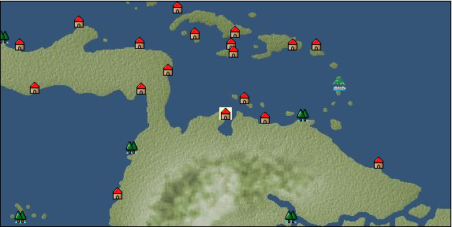

# Port: Maracaibo

import Tabs from '@theme/Tabs';
import TabItem from '@theme/TabItem';

## General Information

| Attribute | Details |
| :--- | :--- |
| **Port Name** | Maracaibo |
| **Port Type** | port of alliance |
| **Region** | Caribbean/Central America |
| **Sea Area** | southern caribbean |
| **Required Language** | mayan languages |
| **Coordinates** | （13143，4391） |
| **Investment Reward** | [Lot (NO.11)](docs/Items/Consumables/Consumables-Treasure-Chests/item_2896.md) （必要投資額：500,000ドゥカード） |

### Available Facilities

| guild | intermediary | exchange | tool shop | workshop craftsman | Painter | sculptor | peddler |
| --- | --- | --- | --- | --- | --- | --- | --- |
|   |   | ○ | ○ | ○ |   |   |   |
| Shipyard Master | Lumbermaker | Sail-maker | weapon craftsman | master | TavernFemale | archive | salesperson |
| --- | --- | --- | --- | --- | --- | --- | --- |
| ○ |   |   |   | ○ |   |   |   |
| Shipwright | 銀行 | street worker | 王宮 | Trading post | church | suburbs | translator |
| --- | --- | --- | --- | --- | --- | --- | --- |
| ○ | ○ | ○ |   |   |   |   |   |

### Description
The city faces Lake Maracaibo, the largest salt lake in South America, which can be said to be a bay that connects to the Caribbean Sea and the Atlantic Ocean. Silent thunder can sometimes occur at this lake. *Spanish is also spoken Cultural area: East coast of Central and South America

<Tabs>
  <TabItem value="trade_goods_sales" label="Trade Goods Sales">

| Item | Group | Purchase Price | Allied Price | Remarks |
| --- | --- | --- | --- | --- |
| [coconut](docs/Items/TradeGoods/TradeGoods-Sunddries/item_96.md) | [Trading goods (hobby goods)](docs/Categories/category_10.md) | 292 | 256 |  |
| [oil](docs/Items/TradeGoods/TradeGoods-Wares/item_613.md) | [交易品（工業品）](docs/Categories/category_19.md) | 579 | 508 |  |
| 要投資（必要投資額：240,000） |
| [cotton](docs/Items/TradeGoods/TradeGoods-Fibers/item_610.md) | [交易品（繊維）](docs/Categories/category_1.md) | (306) | 268 |  |
| [gold](docs/Items/TradeGoods/TradeGoods-Metals/item_659.md) | [Trading products (precious metals)](docs/Categories/category_8.md) | (5,130) | 4,489 |  |
| 要投資（必要投資額：400,000） |
| [iron ore](docs/Items/TradeGoods/TradeGoods-Minerals/item_146.md) | [Trading Items (Iron Stone)](docs/Categories/category_7.md) | (649) | 568 |  |
  </TabItem>
  <TabItem value="sale_specialty" label="Sale (Specialty)">

| Item | Group | sale price | Allied Price | Remarks |
| --- | --- | --- | --- | --- |

#### [交易品（繊維）](docs/Categories/category_1.md)

| [feather](docs/Items/TradeGoods/TradeGoods-Fibers/item_585.md) | 交易品（繊維） | (1,077) | 1,256 |  |
| [Green ramie](docs/Items/TradeGoods/TradeGoods-Fibers/item_3428.md) | 交易品（繊維） | 33,375 | (37,550) |  |

#### [Trading Goods (Dye)](docs/Categories/category_2.md)

| [ward](docs/Items/TradeGoods/TradeGoods-Dye/item_57.md) | Trading Goods (Dye) | (2,048) | 2,389 |  |

#### [Trading items (food items)](docs/Categories/category_3.md)

| [buckwheat](docs/Items/TradeGoods/TradeGoods-Foodstuffs/item_3430.md) | Trading items (food items) | 30,244 | (34,027) |  |

#### [交易品（酒類）](docs/Categories/category_9.md)

| [aquavit](docs/Items/TradeGoods/TradeGoods-Alcohol/item_572.md) | 交易品（酒類） | (1,391) | 1,623 |  |
| 98%＝1590 |
| [whiskey](docs/Items/TradeGoods/TradeGoods-Alcohol/item_1.md) | 交易品（酒類） | (1,517) | 1,770 |  |
| [sherry](docs/Items/TradeGoods/TradeGoods-Alcohol/item_844.md) | 交易品（酒類） | (761) | 887 |  |
| [gin](docs/Items/TradeGoods/TradeGoods-Alcohol/item_291.md) | 交易品（酒類） | (1,553) | 1,812 |  |
| [fruit brandy](docs/Items/TradeGoods/TradeGoods-Alcohol/item_1440.md) | 交易品（酒類） | (1,140) | 1,330 |  |
| When in alliance: confirmed at 100% |

#### [Trading goods (hobby goods)](docs/Categories/category_10.md)

| [prune](docs/Items/TradeGoods/TradeGoods-Sunddries/item_523.md) | Trading goods (hobby goods) | (691) | 806 |  |
| When in alliance: confirmed at 100% |
| [dried apple](docs/Items/TradeGoods/TradeGoods-Sunddries/item_19.md) | Trading goods (hobby goods) | (655) | 764 |  |
| [金針花](docs/Items/TradeGoods/TradeGoods-Sunddries/item_3739.md) | Trading goods (hobby goods) | (3,467) | 4,045 |  |

#### [Trading Goods (Spices)](docs/Categories/category_11.md)

| [geranium](docs/Items/TradeGoods/TradeGoods-Perfume/item_145.md) | Trading Goods (Spices) | (636) | 742 |  |
| [lira](docs/Items/TradeGoods/TradeGoods-Perfume/item_30.md) | Trading Goods (Spices) | (1,586) | 1,850 |  |

#### [Trading Goods (Spices)](docs/Categories/category_12.md)

| [saffron](docs/Items/TradeGoods/TradeGoods-Spices/item_845.md) | Trading Goods (Spices) | (4,921) | 5,742 |  |

#### [Trading goods (artificial goods)](docs/Categories/category_13.md)

| [glasswork](docs/Items/TradeGoods/TradeGoods-Luxuries/item_60.md) | Trading goods (artificial goods) | (2,664) | 3,108 |  |

#### [Trading Items (Firearms)](docs/Categories/category_17.md)

| [musket gun](docs/Items/TradeGoods/TradeGoods-Firearms/item_584.md) | Trading Items (Firearms) | (5,496) | 6,412 |  |
| [tanegashima gun](docs/Items/TradeGoods/TradeGoods-Firearms/item_3423.md) | Trading Items (Firearms) | 33,279 | (37,442) |  |

#### [Trading Goods (Livestock)](docs/Categories/category_18.md)

| [boar](docs/Items/TradeGoods/TradeGoods-Livestock/item_3476.md) | Trading Goods (Livestock) | 29,667 | (33,378) |  |

#### [交易品（織物）](docs/Categories/category_20.md)

| [dutch calico](docs/Items/TradeGoods/TradeGoods-Fabrics/item_1435.md) | 交易品（織物） | 2,353 | 2,608 |  |
| [flannel](docs/Items/TradeGoods/TradeGoods-Fabrics/item_149.md) | 交易品（織物） | (1,864) | 2,174 |  |
| [velvet](docs/Items/TradeGoods/TradeGoods-Fabrics/item_902.md) | 交易品（織物） | (5,406) | 6,307 |  |
| [Nishijin textile](docs/Items/TradeGoods/TradeGoods-Fabrics/item_3431.md) | 交易品（織物） | 31,957 | (35,955) |  |
  </TabItem>
  <TabItem value="sale_no_specialty" label="Sale (No Specialty)">

| Item | Group | sale price | Allied Price | Remarks |
| --- | --- | --- | --- | --- |

#### [交易品（繊維）](docs/Categories/category_1.md)

| [sisal hemp](docs/Items/TradeGoods/TradeGoods-Fibers/item_1766.md) | 交易品（繊維） | (224) | 261 |  |

#### [Trading items (food items)](docs/Categories/category_3.md)

| [sweet potato](docs/Items/TradeGoods/TradeGoods-Foodstuffs/item_1931.md) | Trading items (food items) | (91) | 106 |  |
| [corn](docs/Items/TradeGoods/TradeGoods-Foodstuffs/item_138.md) | Trading items (food items) | (54) | 62 |  |

#### [交易品（調味料）](docs/Categories/category_4.md)

| [coconut vinegar](docs/Items/TradeGoods/TradeGoods-Seasonings/item_1988.md) | 交易品（調味料） | (428) | 499 |  |

#### [Trading products (precious metals)](docs/Categories/category_8.md)

| [gold dust](docs/Items/TradeGoods/TradeGoods-Metals/item_111.md) | Trading products (precious metals) | (1,894) | 2,209 |  |

#### [交易品（酒類）](docs/Categories/category_9.md)

| [tequila](docs/Items/TradeGoods/TradeGoods-Alcohol/item_108.md) | 交易品（酒類） | (1,024) | 1,194 |  |

#### [Trading goods (hobby goods)](docs/Categories/category_10.md)

| [cacao](docs/Items/TradeGoods/TradeGoods-Sunddries/item_140.md) | Trading goods (hobby goods) | (857) | 1,000 |  |
| [pineapple](docs/Items/TradeGoods/TradeGoods-Sunddries/item_867.md) | Trading goods (hobby goods) | (905) | 1,055 |  |
| [raisins](docs/Items/TradeGoods/TradeGoods-Sunddries/item_35.md) | Trading goods (hobby goods) | (350) | 408 |  |

#### [Trading Goods (Spices)](docs/Categories/category_12.md)

| [allspice](docs/Items/TradeGoods/TradeGoods-Spices/item_1848.md) | Trading Goods (Spices) | (390) | 454 |  |
| ▲Special products from the same cultural area |
| [vanilla](docs/Items/TradeGoods/TradeGoods-Spices/item_1810.md) | Trading Goods (Spices) | (334) | 389 |  |

#### [Trading goods (artificial goods)](docs/Categories/category_13.md)

| [coral work](docs/Items/TradeGoods/TradeGoods-Luxuries/item_595.md) | Trading goods (artificial goods) | (2,388) | 2,786 |  |
| [luxury furniture](docs/Items/TradeGoods/TradeGoods-Luxuries/item_1048.md) | Trading goods (artificial goods) | (2,472) | 2,884 |  |

#### [Trading Items (Gemstones)](docs/Categories/category_15.md)

| [opal](docs/Items/TradeGoods/TradeGoods-Gems/item_2006.md) | Trading Items (Gemstones) | (2,293) | 2,675 |  |
| [topaz](docs/Items/TradeGoods/TradeGoods-Gems/item_1097.md) | Trading Items (Gemstones) | (1,703) | 1,987 |  |

#### [Trading Items (Firearms)](docs/Categories/category_17.md)

| [arquebus gun](docs/Items/TradeGoods/TradeGoods-Firearms/item_14.md) | Trading Items (Firearms) | (2,438) | 2,844 |  |
| [大砲](docs/Items/TradeGoods/TradeGoods-Firearms/item_4.md) | Trading Items (Firearms) | (4,735) | 5,525 |  |
| [bullet](docs/Items/TradeGoods/TradeGoods-Firearms/item_13.md) | Trading Items (Firearms) | (1,094) | 1,276 |  |

#### [Trading Goods (Livestock)](docs/Categories/category_18.md)

| [rat](docs/Items/TradeGoods/TradeGoods-Livestock/item_2710.md) | Trading Goods (Livestock) | (18) | 20 |  |

#### [交易品（工業品）](docs/Categories/category_19.md)

| [iron material](docs/Items/TradeGoods/TradeGoods-Wares/item_268.md) | 交易品（工業品） | (700) | 816 |  |

#### [交易品（織物）](docs/Categories/category_20.md)

| [cotton fabric](docs/Items/TradeGoods/TradeGoods-Fabrics/item_571.md) | 交易品（織物） | (1,105) | 1,289 |  |
  </TabItem>
  <TabItem value="guild_&_others" label="Guild & Others">

| Item | Group | Sales price | Handling NPC | Remarks |
| --- | --- | --- | --- | --- |
| There is no sales information for the Item |
| --- |
  </TabItem>
  <TabItem value="toolman" label="Toolman">

| Item | Group | Sales price | Handling NPC | Remarks |
| --- | --- | --- | --- | --- |

#### [recipe book](docs/Categories/category_22.md)

| [How to sew Bora ethnic clothing](docs/Items/RecipeBooks/item_1812.md) | recipe book | Fixed recipe | tool shop owner |  |

#### [Equipment (body)](docs/Categories/category_24.md)

| [Surcoat](docs/Items/Equipment/Equipment-Body/item_131.md) | Equipment (body) | 30,000 | tool shop owner |  |

#### [Equipment (legs)](docs/Categories/category_26.md)

| [boots](docs/Items/Equipment/Equipment-Feet/item_365.md) | Equipment (legs) | 100 | tool shop owner |  |

#### [Equipment (belongings)](docs/Categories/category_27.md)

| [long sword](docs/Items/Equipment/Equipment-Weapon/item_302.md) | Equipment (belongings) | 15,400 | tool shop owner |  |

#### [Consumables (land battle/deck battle)](docs/Categories/category_29.md)

| [Taheebo juice](docs/Items/Consumables/Consumables-Landbattle/item_1807.md) | Consumables (land battle/deck battle) | 300 | tool shop owner |  |
| [taheebo bottle](docs/Items/Consumables/Consumables-Landbattle/item_1823.md) | Consumables (land battle/deck battle) | 600 | tool shop owner |  |
| 要投資（必要投資額：120,000） |
| [tonic](docs/Items/Consumables/Consumables-Landbattle/item_1678.md) | Consumables (land battle/deck battle) | 300 | tool shop owner |  |
| [torch for throwing](docs/Items/Consumables/Consumables-Landbattle/item_313.md) | Consumables (land battle/deck battle) | 150 | tool shop owner |  |

#### [Consumables (request documents)](docs/Categories/category_45.md)

| [spice purchase order](docs/Items/Consumables/Consumables-Documents/item_4918.md) | Consumables (request documents) | 60,000 | tool shop owner |  |
  </TabItem>
  <TabItem value="kobo_craftsmen" label="Craftsman">

| Item | Group | Sales price | Handling NPC | Remarks |
| --- | --- | --- | --- | --- |

#### [Consumables (condition recovery)](docs/Categories/category_21.md)

| [Nostalgic carillon bell](docs/Items/Consumables/Consumables-Recovery/item_245.md) | Consumables (condition recovery) | 200 | workshop craftsman |  |
| [Ship song sheet music](docs/Items/Consumables/Consumables-Recovery/item_247.md) | Consumables (condition recovery) | 200 | workshop craftsman |  |

#### [Consumables (other)](docs/Categories/category_44.md)

| [帆塗料](docs/Items/Consumables/Consumables-Other/item_348.md) | Consumables (other) | 500 | workshop craftsman |  |
| [ship paint](docs/Items/Consumables/Consumables-Other/item_347.md) | Consumables (other) | 500 | workshop craftsman |  |
  </TabItem>
  <TabItem value="shipyard" label="Shipyard">

### Shipyard Master

| Item | Group | Sales price | Handling NPC | Remarks |
| --- | --- | --- | --- | --- |

#### [Boat](docs/Categories/category_43.md)

| [Varsha](docs/Items/Ships/item_201.md) | Boat | 2,000 | Shipyard Master |  |
| [bergantine](docs/Items/Ships/item_208.md) | Boat | 148,800 | Shipyard Master |  |
| [commercial varsha](docs/Items/Ships/item_204.md) | Boat | 5,200 | Shipyard Master |  |
| [Battle Barsha](docs/Items/Ships/item_203.md) | Boat | 5,100 | Shipyard Master |  |
| [exploration barsha](docs/Items/Ships/item_202.md) | Boat | 5,000 | Shipyard Master |  |
  </TabItem>
</Tabs>