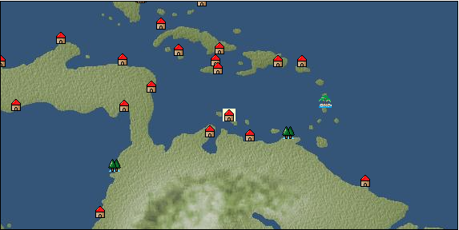

# Port: ウィレムスタッド

import Tabs from '@theme/Tabs';
import TabItem from '@theme/TabItem';

## General Information

| Attribute | Details |
| :--- | :--- |
| **Port Name** | Willemstad |
| **Port Type** | 開拓地 |
| **Region** | Caribbean/Central America |
| **Sea Area** | southern caribbean |
| **Required Language** | dutch |
| **Coordinates** | （13240，4308） |
| **Investment Reward** | [Lot (NO.11)](docs/Items/Consumables/Consumables-Treasure-Chests/item_2896.md) （必要投資額：500,000ドゥカード） |

### Available Facilities

| guild | intermediary | exchange | tool shop | workshop craftsman | Painter | sculptor | peddler |
| --- | --- | --- | --- | --- | --- | --- | --- |
|   |   | ○ | ○ | ○ | ○ | ○ |   |
| Shipyard Master | Lumbermaker | Sail-maker | weapon craftsman | master | TavernFemale | archive | salesperson |
| --- | --- | --- | --- | --- | --- | --- | --- |
| ○ | ○ | ○ | ○ | ○ |   | ○ |   |
| Shipwright | 銀行 | street worker | 王宮 | Trading post | church | suburbs | translator |
| --- | --- | --- | --- | --- | --- | --- | --- |
| ○ | ○ | ○ |   |   |   |   |   |

### Description
A city located in the southeastern part of Curaçao, the southernmost tip of the Caribbean. It was discovered at the end of the 15th century by Alonso Ojeda and Amerigo Vespucci. *Netherlandish territory Clerk Master cook Skilled seamstress Skilled foundry worker Dock manager Cultural area: Caribbean

<Tabs>
  <TabItem value="trade_goods_sales" label="Trade Goods Sales">

| item | group | purchase price | 同盟時 | remarks |
| --- | --- | --- | --- | --- |
| [dutch calico](docs/Items/TradeGoods/TradeGoods-Fabrics/item_1435.md) | [交易品（織物）](docs/Categories/category_20.md) | (2,124) | 1,859 |  |
| 要投資（必要投資額：400,000） |
| [allspice](docs/Items/TradeGoods/TradeGoods-Spices/item_1848.md) | [Trading Goods (Spices)](docs/Categories/category_12.md) | 383 | 283 |  |
| [sisal hemp](docs/Items/TradeGoods/TradeGoods-Fibers/item_1766.md) | [交易品（繊維）](docs/Categories/category_1.md) | (195) | 171 |  |
| 要投資（必要投資額：180,000） |
| [sweet potato](docs/Items/TradeGoods/TradeGoods-Foodstuffs/item_1931.md) | [Trading items (food items)](docs/Categories/category_3.md) | 87 | 64 |  |
| [sugar cane](docs/Items/TradeGoods/TradeGoods-Foodstuffs/item_93.md) | [Trading items (food items)](docs/Categories/category_3.md) | (184) | 161 |  |
| 要投資（必要投資額：240,000） |
| [tobacco](docs/Items/TradeGoods/TradeGoods-Sunddries/item_109.md) | [Trading goods (hobby goods)](docs/Categories/category_10.md) | (429) | 376 |  |
| 要投資（必要投資額：120,000） |
| [log](docs/Items/TradeGoods/TradeGoods-Wares/item_846.md) | [交易品（工業品）](docs/Categories/category_19.md) | (218) | 191 |  |
| Investment required (Required investment amount: 180,000) Confirmed with 100% alliance |
| [gold](docs/Items/TradeGoods/TradeGoods-Metals/item_659.md) | [Trading products (precious metals)](docs/Categories/category_8.md) | (3,212) | 2,811 |  |
| 要投資（必要投資額：320,000） |
| [魚肉](docs/Items/TradeGoods/TradeGoods-Foodstuffs/item_10.md) | [Trading items (food items)](docs/Categories/category_3.md) | 146 | 107 |  |
  </TabItem>
  <TabItem value="sale_specialty" label="Sale (Specialty)">

| item | group | sale price | 同盟時 | remarks |
| --- | --- | --- | --- | --- |

#### [交易品（繊維）](docs/Categories/category_1.md)

| [Green ramie](docs/Items/TradeGoods/TradeGoods-Fibers/item_3428.md) | 交易品（繊維） | 21,512 | 38,024 |  |
| 86%=32700 |
| [deerskin](docs/Items/TradeGoods/TradeGoods-Fibers/item_3648.md) | 交易品（繊維） | 21,861 | (24,596) |  |

#### [Trading items (food items)](docs/Categories/category_3.md)

| [buckwheat](docs/Items/TradeGoods/TradeGoods-Foodstuffs/item_3430.md) | Trading items (food items) | (32,549) | 37,979 |  |
| 94%=35700 |

#### [交易品（雑貨）](docs/Categories/category_5.md)

| [Japanese books](docs/Items/TradeGoods/TradeGoods-Misc/item_3439.md) | 交易品（雑貨） | (33,669) | 39,286 |  |
| 84%=33000 |

#### [Trading products (medical products)](docs/Categories/category_6.md)

| [calamus](docs/Items/TradeGoods/TradeGoods-Medicine/item_3427.md) | Trading products (medical products) | (33,959) | 39,625 |  |
| 80%=31700 |

#### [Trading products (precious metals)](docs/Categories/category_8.md)

| [platinum](docs/Items/TradeGoods/TradeGoods-Metals/item_2178.md) | Trading products (precious metals) | (7,199) | 8,400 |  |
| [佐摩銀](docs/Items/TradeGoods/TradeGoods-Metals/item_3432.md) | Trading products (precious metals) | (24,476) | 28,560 |  |
| 118%=33700 |

#### [交易品（酒類）](docs/Categories/category_9.md)

| [aquavit](docs/Items/TradeGoods/TradeGoods-Alcohol/item_572.md) | 交易品（酒類） | 1,314 | 1,443 |  |
| [whiskey](docs/Items/TradeGoods/TradeGoods-Alcohol/item_1.md) | 交易品（酒類） | 1,540 | (1,732) |  |
| [sherry](docs/Items/TradeGoods/TradeGoods-Alcohol/item_844.md) | 交易品（酒類） | 685 | (770) |  |
| [gin](docs/Items/TradeGoods/TradeGoods-Alcohol/item_291.md) | 交易品（酒類） | (1,495) | 1,744 |  |
| [Taiwan rice wine](docs/Items/TradeGoods/TradeGoods-Alcohol/item_3672.md) | 交易品（酒類） | 22,675 | (25,511) |  |
| [Sake](docs/Items/TradeGoods/TradeGoods-Alcohol/item_3424.md) | 交易品（酒類） | 23,847 | 40,406 |  |
| 74%=29900 |

#### [Trading goods (hobby goods)](docs/Categories/category_10.md)

| [Aigyoku](docs/Items/TradeGoods/TradeGoods-Sunddries/item_3677.md) | Trading goods (hobby goods) | 22,500 | (25,314) |  |
| [eggplant](docs/Items/TradeGoods/TradeGoods-Sunddries/item_3426.md) | Trading goods (hobby goods) | (32,485) | 37,905 |  |
| 105%=39800 |

#### [Trading Goods (Spices)](docs/Categories/category_12.md)

| [Grapefruit](docs/Items/TradeGoods/TradeGoods-Spices/item_3422.md) | Trading Goods (Spices) | (35,659) | 41,608 |  |
| 112%=46600 |

#### [交易品（美術品）](docs/Categories/category_14.md)

| [taiwan wood carving](docs/Items/TradeGoods/TradeGoods-Art/item_3697.md) | 交易品（美術品） | 22,625 | (25,455) |  |
| [Japanese painting](docs/Items/TradeGoods/TradeGoods-Art/item_3436.md) | 交易品（美術品） | (34,173) | 39,875 |  |
| 80%=31900 |

#### [Trading Items (Gemstones)](docs/Categories/category_15.md)

| [alexandrite](docs/Items/TradeGoods/TradeGoods-Gems/item_4429.md) | Trading Items (Gemstones) | (6,904) | 8,055 |  |
| [pink diamond](docs/Items/TradeGoods/TradeGoods-Gems/item_2874.md) | Trading Items (Gemstones) | 12,500 | 13,982 |  |

#### [Trading Items (Arms)](docs/Categories/category_16.md)

| [Japanese sword](docs/Items/TradeGoods/TradeGoods-Weapons/item_3437.md) | Trading Items (Arms) | (33,328) | 38,889 |  |
| 72%=28000 |

#### [Trading Items (Firearms)](docs/Categories/category_17.md)

| [musket gun](docs/Items/TradeGoods/TradeGoods-Firearms/item_584.md) | Trading Items (Firearms) | 5,138 | (5,780) |  |
| [tanegashima gun](docs/Items/TradeGoods/TradeGoods-Firearms/item_3423.md) | Trading Items (Firearms) | (33,501) | 39,091 |  |
| 88%=34400 |

#### [Trading Goods (Livestock)](docs/Categories/category_18.md)

| [boar](docs/Items/TradeGoods/TradeGoods-Livestock/item_3476.md) | Trading Goods (Livestock) | (32,352) | 37,750 |  |
| 80%=30200 |

#### [交易品（工業品）](docs/Categories/category_19.md)

| [Japanese paper](docs/Items/TradeGoods/TradeGoods-Wares/item_3438.md) | 交易品（工業品） | (33,704) | 39,327 |  |
| 104%=40900 |

#### [交易品（織物）](docs/Categories/category_20.md)

| [dutch calico](docs/Items/TradeGoods/TradeGoods-Fabrics/item_1435.md) | 交易品（織物） | (951) | 1,109 |  |
| 要投資（必要投資額：400,000） |
| [felt](docs/Items/TradeGoods/TradeGoods-Fabrics/item_4439.md) | 交易品（織物） | (1,422) | 1,659 |  |
| [flannel](docs/Items/TradeGoods/TradeGoods-Fabrics/item_149.md) | 交易品（織物） | (1,841) | 2,148 |  |
| [velvet](docs/Items/TradeGoods/TradeGoods-Fabrics/item_902.md) | 交易品（織物） | (5,335) | 6,225 |  |
| [Nishijin textile](docs/Items/TradeGoods/TradeGoods-Fabrics/item_3431.md) | 交易品（織物） | (35,312) | 41,204 |  |
| 108%=44500 |
  </TabItem>
  <TabItem value="sale_no_specialty" label="Sale (No Specialty)">

| item | group | sale price | 同盟時 | remarks |
| --- | --- | --- | --- | --- |

#### [交易品（繊維）](docs/Categories/category_1.md)

| [goat hair](docs/Items/TradeGoods/TradeGoods-Fibers/item_770.md) | 交易品（繊維） | (843) | 983 |  |
| [fur](docs/Items/TradeGoods/TradeGoods-Fibers/item_634.md) | 交易品（繊維） | (1,252) | 1,460 |  |
| [cotton](docs/Items/TradeGoods/TradeGoods-Fibers/item_610.md) | 交易品（繊維） | 777 | (874) |  |

#### [Trading items (food items)](docs/Categories/category_3.md)

| [barley](docs/Items/TradeGoods/TradeGoods-Foodstuffs/item_124.md) | Trading items (food items) | 90 | (101) |  |

#### [交易品（調味料）](docs/Categories/category_4.md)

| [almond oil](docs/Items/TradeGoods/TradeGoods-Seasonings/item_578.md) | 交易品（調味料） | (818) | 954 |  |
| [olive oil](docs/Items/TradeGoods/TradeGoods-Seasonings/item_48.md) | 交易品（調味料） | (457) | 533 |  |
| [coconut vinegar](docs/Items/TradeGoods/TradeGoods-Seasonings/item_1988.md) | 交易品（調味料） | (428) | 499 |  |
| [salt](docs/Items/TradeGoods/TradeGoods-Seasonings/item_42.md) | 交易品（調味料） | 234 | (263) |  |
| [Honey](docs/Items/TradeGoods/TradeGoods-Seasonings/item_49.md) | 交易品（調味料） | (851) | 992 |  |

#### [Trading products (medical products)](docs/Categories/category_6.md)

| [mercury agent](docs/Items/TradeGoods/TradeGoods-Medicine/item_703.md) | Trading products (medical products) | (1,339) | 1,562 |  |

#### [Trading Items (Iron Stone)](docs/Categories/category_7.md)

| [iron ore](docs/Items/TradeGoods/TradeGoods-Minerals/item_146.md) | Trading Items (Iron Stone) | 684 | (769) |  |

#### [Trading products (precious metals)](docs/Categories/category_8.md)

| [gold dust](docs/Items/TradeGoods/TradeGoods-Metals/item_111.md) | Trading products (precious metals) | 2,209 | (2,485) |  |

#### [交易品（酒類）](docs/Categories/category_9.md)

| [tequila](docs/Items/TradeGoods/TradeGoods-Alcohol/item_108.md) | 交易品（酒類） | 1,111 | (1,249) |  |
| [Beer](docs/Items/TradeGoods/TradeGoods-Alcohol/item_2.md) | 交易品（酒類） | 397 | (446) |  |
| [palm wine](docs/Items/TradeGoods/TradeGoods-Alcohol/item_436.md) | 交易品（酒類） | (505) | 589 |  |

#### [Trading goods (hobby goods)](docs/Categories/category_10.md)

| [cacao](docs/Items/TradeGoods/TradeGoods-Sunddries/item_140.md) | Trading goods (hobby goods) | 934 | (1,050) |  |
| [coffee](docs/Items/TradeGoods/TradeGoods-Sunddries/item_445.md) | Trading goods (hobby goods) | 525 | (590) |  |
| [tobacco](docs/Items/TradeGoods/TradeGoods-Sunddries/item_109.md) | Trading goods (hobby goods) | 224 | (252) |  |
| 要投資（必要投資額：120,000） |
| [pineapple](docs/Items/TradeGoods/TradeGoods-Sunddries/item_867.md) | Trading goods (hobby goods) | 1,024 | (1,152) |  |

#### [Trading Goods (Spices)](docs/Categories/category_12.md)

| [coriander](docs/Items/TradeGoods/TradeGoods-Spices/item_1044.md) | Trading Goods (Spices) | (540) | 630 |  |

#### [Trading goods (artificial goods)](docs/Categories/category_13.md)

| [皮革製品](docs/Items/TradeGoods/TradeGoods-Luxuries/item_12.md) | Trading goods (artificial goods) | (1,262) | 1,472 |  |
| [luxury clothing](docs/Items/TradeGoods/TradeGoods-Luxuries/item_165.md) | Trading goods (artificial goods) | (3,598) | 4,198 |  |

#### [Trading Items (Gemstones)](docs/Categories/category_15.md)

| [emerald](docs/Items/TradeGoods/TradeGoods-Gems/item_777.md) | Trading Items (Gemstones) | (3,381) | 3,945 |  |
| [opal](docs/Items/TradeGoods/TradeGoods-Gems/item_2006.md) | Trading Items (Gemstones) | (2,604) | 3,038 |  |

#### [Trading Items (Arms)](docs/Categories/category_16.md)

| [two-handed sword](docs/Items/TradeGoods/TradeGoods-Weapons/item_24.md) | Trading Items (Arms) | (1,282) | 1,495 |  |

#### [Trading Items (Firearms)](docs/Categories/category_17.md)

| [cannonball](docs/Items/TradeGoods/TradeGoods-Firearms/item_144.md) | Trading Items (Firearms) | 1,723 | (1,938) |  |

#### [Trading Goods (Livestock)](docs/Categories/category_18.md)

| [rat](docs/Items/TradeGoods/TradeGoods-Livestock/item_2710.md) | Trading Goods (Livestock) | 18 | (20) |  |

#### [交易品（工業品）](docs/Categories/category_19.md)

| [wax](docs/Items/TradeGoods/TradeGoods-Wares/item_54.md) | 交易品（工業品） | (841) | 981 |  |
| [wood](docs/Items/TradeGoods/TradeGoods-Wares/item_277.md) | 交易品（工業品） | 713 | 829 |  |
| [iron material](docs/Items/TradeGoods/TradeGoods-Wares/item_268.md) | 交易品（工業品） | (676) | 788 |  |
| [鋼](docs/Items/TradeGoods/TradeGoods-Wares/item_573.md) | 交易品（工業品） | (1,079) | 1,259 |  |

#### [交易品（織物）](docs/Categories/category_20.md)

| [muslin](docs/Items/TradeGoods/TradeGoods-Fabrics/item_581.md) | 交易品（織物） | (1,266) | 1,477 |  |
  </TabItem>
  <TabItem value="guild_&_others" label="Guild & Others">

| item | group | Sales price | Handling NPC | remarks |
| --- | --- | --- | --- | --- |

#### others

| [master caribbean cuisine](docs/Items/RecipeBooks/item_2847.md) | [recipe book](docs/Categories/category_22.md) | Fixed recipe |  |  |
| Owned by a cooking expert |
| [Advanced sewing technology](docs/Items/RecipeBooks/item_2849.md) | [recipe book](docs/Categories/category_22.md) | Fixed recipe |  |  |
| Owned by a skilled seamstress |
| [Advanced casting technology](docs/Items/RecipeBooks/item_2848.md) | [recipe book](docs/Categories/category_22.md) | Fixed recipe |  |  |
| Owned by a skilled casting engineer |
  </TabItem>
  <TabItem value="toolman" label="Toolman">

| item | group | Sales price | Handling NPC | remarks |
| --- | --- | --- | --- | --- |

#### [Equipment (body)](docs/Categories/category_24.md)

| [Surcoat](docs/Items/Equipment/Equipment-Body/item_131.md) | Equipment (body) | 30,000 | tool shop owner |  |

#### [Equipment (legs)](docs/Categories/category_26.md)

| [boots](docs/Items/Equipment/Equipment-Feet/item_365.md) | Equipment (legs) | 100 | tool shop owner |  |

#### [Equipment (belongings)](docs/Categories/category_27.md)

| [long sword](docs/Items/Equipment/Equipment-Weapon/item_302.md) | Equipment (belongings) | 15,400 | tool shop owner |  |

#### [装備品（服飾品）](docs/Categories/category_28.md)

| [jade ring](docs/Items/Equipment/Equipment-Accessory/item_1955.md) | 装備品（服飾品） | 7,000,000 | tool shop owner |  |
| 要投資（必要投資額：240,000） |

#### [Consumables (land battle/deck battle)](docs/Categories/category_29.md)

| [Taheebo juice](docs/Items/Consumables/Consumables-Landbattle/item_1807.md) | Consumables (land battle/deck battle) | 300 | tool shop owner |  |
| [tonic](docs/Items/Consumables/Consumables-Landbattle/item_1678.md) | Consumables (land battle/deck battle) | 300 | tool shop owner |  |

#### [Consumables (other)](docs/Categories/category_44.md)

| [black powder](docs/Items/Consumables/Consumables-Other/item_1954.md) | Consumables (other) | 1,000 | tool shop owner |  |
  </TabItem>
  <TabItem value="kobo_craftsmen" label="Craftsman">

| item | group | Sales price | Handling NPC | remarks |
| --- | --- | --- | --- | --- |

#### [Consumables (condition recovery)](docs/Categories/category_21.md)

| [Nostalgic carillon bell](docs/Items/Consumables/Consumables-Recovery/item_245.md) | Consumables (condition recovery) | 200 | workshop craftsman |  |
| [Ship song sheet music](docs/Items/Consumables/Consumables-Recovery/item_247.md) | Consumables (condition recovery) | 200 | workshop craftsman |  |

#### [recipe book](docs/Categories/category_22.md)

| [Furniture manufacturing/Caribbean edition](docs/Items/RecipeBooks/item_1951.md) | recipe book | Fixed recipe | workshop craftsman |  |

#### [Consumables (other)](docs/Categories/category_44.md)

| [帆塗料](docs/Items/Consumables/Consumables-Other/item_348.md) | Consumables (other) | 500 | workshop craftsman |  |
| [ship paint](docs/Items/Consumables/Consumables-Other/item_347.md) | Consumables (other) | 500 | workshop craftsman |  |

#### [furniture](docs/Categories/category_48.md)

| [caribbean style costume box](docs/Items/Furniture/item_2088.md) | furniture | Fixed recipe | workshop craftsman |  |
| [food basket](docs/Items/Furniture/item_2089.md) | furniture | Fixed recipe | workshop craftsman |  |
| [Open rack for small items](docs/Items/Furniture/item_2219.md) | furniture | Fixed recipe | workshop craftsman |  |
| [Stone monument for book stand](docs/Items/Furniture/item_1952.md) | furniture | Fixed recipe | workshop craftsman |  |
| [cat car](docs/Items/Furniture/item_2090.md) | furniture | Fixed recipe | workshop craftsman |  |
  </TabItem>
  <TabItem value="Painter" label="Painter">

| item | group | Sales price | Handling NPC | remarks |
| --- | --- | --- | --- | --- |

#### [Ship parts (emblem)](docs/Categories/category_36.md)

| [admiral](docs/Items/ShipParts/Shipparts-Crests/item_548.md) | Ship parts (emblem) | 5,000 | Painter |  |
| [anchor](docs/Items/ShipParts/Shipparts-Crests/item_549.md) | Ship parts (emblem) | 5,000 | Painter |  |
| [Quetzalcoatl](docs/Items/ShipParts/Shipparts-Crests/item_3201.md) | Ship parts (emblem) | 1,000,000 | Painter |  |
| [sun](docs/Items/ShipParts/Shipparts-Crests/item_597.md) | Ship parts (emblem) | 5,000 | Painter |  |
| [circle cross](docs/Items/ShipParts/Shipparts-Crests/item_544.md) | Ship parts (emblem) | 5,000 | Painter |  |
| [shellfish](docs/Items/ShipParts/Shipparts-Crests/item_546.md) | Ship parts (emblem) | 5,000 | Painter |  |
| [Delphine](docs/Items/ShipParts/Shipparts-Crests/item_542.md) | Ship parts (emblem) | 5,000 | Painter |  |
| [butterfly](docs/Items/ShipParts/Shipparts-Crests/item_547.md) | Ship parts (emblem) | 5,000 | Painter |  |
| [fisherman](docs/Items/ShipParts/Shipparts-Crests/item_545.md) | Ship parts (emblem) | 5,000 | Painter |  |
  </TabItem>
  <TabItem value="sculptor" label="sculptor">

| item | group | Sales price | Handling NPC | remarks |
| --- | --- | --- | --- | --- |

#### [Ship parts (figurehead)](docs/Categories/category_34.md)

| [dolphin statue](docs/Items/ShipParts/Shipparts-Figurehead/item_169.md) | Ship parts (figurehead) | 500 | sculptor |  |
| [whale statue](docs/Items/ShipParts/Shipparts-Figurehead/item_172.md) | Ship parts (figurehead) | 12,000 | sculptor |  |
| [shark statue](docs/Items/ShipParts/Shipparts-Figurehead/item_171.md) | Ship parts (figurehead) | 8,600 | sculptor |  |
| [killer whale statue](docs/Items/ShipParts/Shipparts-Figurehead/item_170.md) | Ship parts (figurehead) | 8,600 | sculptor |  |
| [phoenix statue](docs/Items/ShipParts/Shipparts-Figurehead/item_631.md) | Ship parts (figurehead) | 62,000 | sculptor |  |
| [maiden statue](docs/Items/ShipParts/Shipparts-Figurehead/item_167.md) | Ship parts (figurehead) | 13,000 | sculptor |  |
| [statue of a great man](docs/Items/ShipParts/Shipparts-Figurehead/item_717.md) | Ship parts (figurehead) | 60,000 | sculptor |  |
| [statue of the brave](docs/Items/ShipParts/Shipparts-Figurehead/item_716.md) | Ship parts (figurehead) | 60,000 | sculptor |  |
| [angel statue](docs/Items/ShipParts/Shipparts-Figurehead/item_168.md) | Ship parts (figurehead) | 13,000 | sculptor |  |
| [statue of tenryu](docs/Items/ShipParts/Shipparts-Figurehead/item_630.md) | Ship parts (figurehead) | 62,000 | sculptor |  |
| [statue of goddess](docs/Items/ShipParts/Shipparts-Figurehead/item_721.md) | Ship parts (figurehead) | 60,000 | sculptor |  |
| [sea ​​turtle statue](docs/Items/ShipParts/Shipparts-Figurehead/item_173.md) | Ship parts (figurehead) | 1,800 | sculptor |  |
| [sea ​​monster statue](docs/Items/ShipParts/Shipparts-Figurehead/item_628.md) | Ship parts (figurehead) | 62,000 | sculptor |  |
| [statue of sea god](docs/Items/ShipParts/Shipparts-Figurehead/item_720.md) | Ship parts (figurehead) | 60,000 | sculptor |  |
| [statue of king](docs/Items/ShipParts/Shipparts-Figurehead/item_718.md) | Ship parts (figurehead) | 60,000 | sculptor |  |
  </TabItem>
  <TabItem value="shipyard" label="Shipyard">

### Shipyard Master

| item | group | Sales price | Handling NPC | remarks |
| --- | --- | --- | --- | --- |

#### [recipe book](docs/Categories/category_22.md)

| [Book of Shipbuilding Materials and Hulls Volume 3](docs/Items/RecipeBooks/item_1818.md) | recipe book | Fixed recipe | Shipyard Master |  |

#### [Boat](docs/Categories/category_43.md)

| [carrack](docs/Items/Ships/item_236.md) | Boat | 720,000 | Shipyard Master |  |
| [schooner](docs/Items/Ships/item_1889.md) | Boat | 1,713,600 | Shipyard Master |  |
| 要投資（必要投資額：不明） |
| [Varsha](docs/Items/Ships/item_201.md) | Boat | 2,000 | Shipyard Master |  |
| [bergantine](docs/Items/Ships/item_208.md) | Boat | 148,800 | Shipyard Master |  |
| [royal frigate](docs/Items/Ships/item_2839.md) | Boat | 30,300,000 | Shipyard Master |  |
| 要投資（必要投資額：不明） |
| [medical quebec](docs/Items/Ships/item_1898.md) | Boat | 15,390,000 | Shipyard Master |  |
| 要投資（必要投資額：不明） |
| [commercial schooner](docs/Items/Ships/item_1892.md) | Boat | 1,320,000 | Shipyard Master |  |
| 要投資（必要投資額：不明） |
| [commercial varsha](docs/Items/Ships/item_204.md) | Boat | 5,200 | Shipyard Master |  |
| [small galleon](docs/Items/Ships/item_406.md) | Boat | 830,000 | Shipyard Master |  |
| [small carrack](docs/Items/Ships/item_219.md) | Boat | 480,000 | Shipyard Master |  |
| [small caravel](docs/Items/Ships/item_206.md) | Boat | 92,000 | Shipyard Master |  |
| [cruising quebec](docs/Items/Ships/item_2064.md) | Boat | 7,695,000 | Shipyard Master |  |
| 要投資（必要投資額：不明） |
| [Battle Barsha](docs/Items/Ships/item_203.md) | Boat | 5,100 | Shipyard Master |  |
| [exploration barsha](docs/Items/Ships/item_202.md) | Boat | 5,000 | Shipyard Master |  |
| [mobile schooner](docs/Items/Ships/item_2039.md) | Boat | 856,800 | Shipyard Master |  |
| 要投資（必要投資額：不明） |
| [armed schooner](docs/Items/Ships/item_2042.md) | Boat | 660,000 | Shipyard Master |  |
| 要投資（必要投資額：不明） |
| [armored battleship](docs/Items/Ships/item_2306.md) | Boat | 38,784,000 | Shipyard Master |  |
| 要投資（必要投資額：不明） |
| [light galleon](docs/Items/Ships/item_240.md) | Boat | 810,000 | Shipyard Master |  |
| [light carrack](docs/Items/Ships/item_218.md) | Boat | 478,000 | Shipyard Master |  |
| [light caravelle](docs/Items/Ships/item_207.md) | Boat | 92,000 | Shipyard Master |  |
| [transport galleon](docs/Items/Ships/item_407.md) | Boat | 840,000 | Shipyard Master |  |
| [transport carrack](docs/Items/Ships/item_222.md) | Boat | 488,000 | Shipyard Master |  |

#### [shipbuilding materials](docs/Categories/category_47.md)

| [2-deck type large hull](docs/Items/ShipbuildingFS/item_1820.md) | shipbuilding materials | Fixed recipe | Shipyard Master |  |
| [3-deck type large hull](docs/Items/ShipbuildingFS/item_2087.md) | shipbuilding materials | Fixed recipe | Shipyard Master |  |
| [Flat deck type large hull](docs/Items/ShipbuildingFS/item_1819.md) | shipbuilding materials | Fixed recipe | Shipyard Master |  |

### Lumbermaker

| item | group | Sales price | Handling NPC | remarks |
| --- | --- | --- | --- | --- |

#### [recipe book](docs/Categories/category_22.md)

| [Book of Shipbuilding Materials and Crafts Volume 3](docs/Items/RecipeBooks/item_1924.md) | recipe book | Fixed recipe | Lumbermaker |  |

#### [shipbuilding materials](docs/Categories/category_47.md)

| [large mast](docs/Items/ShipbuildingFS/item_1925.md) | shipbuilding materials | Fixed recipe | Lumbermaker |  |

### Sail-maker

| item | group | Sales price | Handling NPC | remarks |
| --- | --- | --- | --- | --- |

#### [recipe book](docs/Categories/category_22.md)

| [Book of Shipbuilding Materials and Sewing Volume 3](docs/Items/RecipeBooks/item_1913.md) | recipe book | Fixed recipe | Sail-maker |  |

#### [shipbuilding materials](docs/Categories/category_47.md)

| [large gaff sail](docs/Items/ShipbuildingFS/item_1917.md) | shipbuilding materials | Fixed recipe | Sail-maker |  |
| [large square sail](docs/Items/ShipbuildingFS/item_1916.md) | shipbuilding materials | Fixed recipe | Sail-maker |  |
| [large lateen sail](docs/Items/ShipbuildingFS/item_1915.md) | shipbuilding materials | Fixed recipe | Sail-maker |  |

### Shipwright

| item | group | Sales price | Handling NPC | remarks |
| --- | --- | --- | --- | --- |

#### [recipe book](docs/Categories/category_22.md)

| [Shipbuilding materials and processed wood](docs/Items/RecipeBooks/item_1774.md) | recipe book | Fixed recipe | Shipwright |  |

#### [shipbuilding materials](docs/Categories/category_47.md)

| [processed wood](docs/Items/ShipbuildingFS/item_1695.md) | shipbuilding materials | Fixed recipe | Shipwright |  |
  </TabItem>
  <TabItem value="weapon craftsman" label="weapon craftsman">

| item | group | Sales price | Handling NPC | remarks |
| --- | --- | --- | --- | --- |

#### [recipe book](docs/Categories/category_22.md)

| [Book of Shipbuilding Materials and Casting Volume 3](docs/Items/RecipeBooks/item_1912.md) | recipe book | Fixed recipe | weapon craftsman |  |

#### [shipbuilding materials](docs/Categories/category_47.md)

| [改良大型砲門](docs/Items/ShipbuildingFS/item_1914.md) | shipbuilding materials | Fixed recipe | weapon craftsman |  |
  </TabItem>
  <TabItem value="dock manager" label="dock manager">

| item | group | Sales price | Handling NPC | remarks |
| --- | --- | --- | --- | --- |

#### [recipe book](docs/Categories/category_22.md)

| [造船技術研究成果](docs/Items/RecipeBooks/item_2850.md) | recipe book | Fixed recipe | dock manager |  |

#### [shipbuilding materials](docs/Categories/category_47.md)

| [lifeboat](docs/Items/ShipbuildingFS/item_2846.md) | shipbuilding materials | Fixed recipe | dock manager |  |
| hub city |
| [Sewing tools set](docs/Items/ShipbuildingFS/item_2879.md) | shipbuilding materials | Fixed recipe | dock manager |  |
| [shipwright's room](docs/Items/ShipbuildingFS/item_2880.md) | shipbuilding materials | Fixed recipe | dock manager |  |
  </TabItem>
  <TabItem value="scholar" label="scholar">

| item | group | Sales price | Handling NPC | remarks |
| --- | --- | --- | --- | --- |

#### [recipe book](docs/Categories/category_22.md)

| [How to make an American language dictionary](docs/Items/RecipeBooks/item_2119.md) | recipe book | Fixed recipe | scholar |  |
| 要投資（必要投資額：不明） |
  </TabItem>
</Tabs>