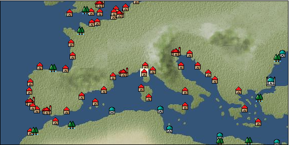

# Port: Calvi

import Tabs from '@theme/Tabs';
import TabItem from '@theme/TabItem';

## General Information

| Attribute | Details |
| :--- | :--- |
| **Port Name** | Calvi |
| **Port Type** | port of alliance |
| **Region** | western europe |
| **Sea Area** | ligurian sea |
| **Required Language** | italian |
| **Coordinates** | （293，2974） |
| **Investment Reward** | [Leather secrets](docs/Items/RecipeBooks/item_1275.md) （必要投資額：500,000ドゥカード） |

### Available Facilities

| guild | intermediary | exchange | tool shop | workshop craftsman | Painter | sculptor | peddler |
| --- | --- | --- | --- | --- | --- | --- | --- |
|   |   | ○ | ○ |   |   |   |   |
| Shipyard Master | Lumbermaker | Sail-maker | weapon craftsman | master | TavernFemale | archive | salesperson |
| --- | --- | --- | --- | --- | --- | --- | --- |
|   |   |   | ○ |   |   |   |   |
| Shipwright | 銀行 | street worker | 王宮 | Trading post | church | suburbs | translator |
| --- | --- | --- | --- | --- | --- | --- | --- |
| ○ | ○ | ○ |   |   |   |   |   |

### Description
A city on the island of Corsica, south of Genoa. Corsica has been a site of conflict between multiple powers since ancient Roman times. This city was founded by the Genoese. *French is also understood Cultural area: Italy/Southern France

<Tabs>
  <TabItem value="trade_goods_sales" label="Trade Goods Sales">

| Item | Group | Purchase Price | Allied Price | Remarks |
| --- | --- | --- | --- | --- |
| [cheese](docs/Items/TradeGoods/TradeGoods-Foodstuffs/item_20.md) | [Trading items (food items)](docs/Categories/category_3.md) | 347 | 304 |  |
| [dill](docs/Items/TradeGoods/TradeGoods-Spices/item_1093.md) | [Trading Goods (Spices)](docs/Categories/category_12.md) | (182) | 160 |  |
| Investment required (Required investment amount: 400,000) At alliance: Confirmed at 100% |
| [egg](docs/Items/TradeGoods/TradeGoods-Foodstuffs/item_40.md) | [Trading items (food items)](docs/Categories/category_3.md) | 28 | 24 |  |
| When in alliance: confirmed at 100% |
| [oil painting](docs/Items/TradeGoods/TradeGoods-Art/item_1088.md) | [交易品（美術品）](docs/Categories/category_14.md) | 2,056 | (1,799) |  |
| 時代限定（15世紀第2期） |
| [sugar](docs/Items/TradeGoods/TradeGoods-Seasonings/item_94.md) | [交易品（調味料）](docs/Categories/category_4.md) | (914) | 800 |  |
| Period limited (15th century 5th period) (Chrono) 15th century 5th period limited |
| [pork](docs/Items/TradeGoods/TradeGoods-Foodstuffs/item_41.md) | [Trading items (food items)](docs/Categories/category_3.md) | (347) | 304 |  |
| 要投資（必要投資額：500,000） EO第４章で追加 |
| [chicken meat](docs/Items/TradeGoods/TradeGoods-Foodstuffs/item_29.md) | [Trading items (food items)](docs/Categories/category_3.md) | 328 | 288 |  |
| When in alliance: confirmed at 100% |
  </TabItem>
  <TabItem value="sale_specialty" label="Sale (Specialty)">

| Item | Group | sale price | Allied Price | Remarks |
| --- | --- | --- | --- | --- |

#### [交易品（繊維）](docs/Categories/category_1.md)

| [sisal hemp](docs/Items/TradeGoods/TradeGoods-Fibers/item_1766.md) | 交易品（繊維） | (329) | 383 |  |
| When in alliance: confirmed at 100% |
| [Basho](docs/Items/TradeGoods/TradeGoods-Fibers/item_3862.md) | 交易品（繊維） | 26,775 | (30,124) |  |
| When in alliance: confirmed at 100% |
| [Panya](docs/Items/TradeGoods/TradeGoods-Fibers/item_2097.md) | 交易品（繊維） | (706) | 823 |  |
| When in alliance: confirmed at 100% |
| [flax](docs/Items/TradeGoods/TradeGoods-Fibers/item_64.md) | 交易品（繊維） | (275) | 320 |  |
| [Green ramie](docs/Items/TradeGoods/TradeGoods-Fibers/item_3428.md) | 交易品（繊維） | (33,091) | 38,612 |  |

#### [Trading Goods (Dye)](docs/Categories/category_2.md)

| [turmeric](docs/Items/TradeGoods/TradeGoods-Dye/item_1433.md) | Trading Goods (Dye) | (662) | 772 |  |
| When in alliance: confirmed at 100% |
| [mayan blue](docs/Items/TradeGoods/TradeGoods-Dye/item_1096.md) | Trading Goods (Dye) | (1,406) | 1,640 |  |
| [mimosa](docs/Items/TradeGoods/TradeGoods-Dye/item_2281.md) | Trading Goods (Dye) | (1,320) | 1,540 |  |
| 98％＝1520　102％＝1560 |
| [gallnut](docs/Items/TradeGoods/TradeGoods-Dye/item_3429.md) | Trading Goods (Dye) | (35,052) | 40,900 |  |
| 98％＝40100　104％＝42500 |

#### [Trading items (food items)](docs/Categories/category_3.md)

| [kangaroo meat](docs/Items/TradeGoods/TradeGoods-Foodstuffs/item_2285.md) | Trading items (food items) | (803) | 936 |  |
| When in alliance: confirmed at 100% |
| [taro](docs/Items/TradeGoods/TradeGoods-Foodstuffs/item_1960.md) | Trading items (food items) | (235) | 274 |  |
| When in alliance: confirmed at 100% |
| [Chamtashima](docs/Items/TradeGoods/TradeGoods-Foodstuffs/item_3771.md) | Trading items (food items) | (1,423) | 1,660 |  |
| 98％＝1650　103％＝1680 |

#### [交易品（調味料）](docs/Categories/category_4.md)

| [tamarind](docs/Items/TradeGoods/TradeGoods-Seasonings/item_1968.md) | 交易品（調味料） | (1,869) | 2,180 |  |
| 98％＝2140　104％＝2250 |
| [Choshi](docs/Items/TradeGoods/TradeGoods-Seasonings/item_3793.md) | 交易品（調味料） | (30,681) | 35,800 |  |
| 98％＝35100　103％＝36800 |
| [miso](docs/Items/TradeGoods/TradeGoods-Seasonings/item_3420.md) | 交易品（調味料） | (3,643) | 4,250 |  |
| When in alliance: confirmed at 100% |
| [Bean sauce](docs/Items/TradeGoods/TradeGoods-Seasonings/item_3875.md) | 交易品（調味料） | (34,023) | 39,700 |  |
| When in alliance: confirmed at 100% |

#### [交易品（雑貨）](docs/Categories/category_5.md)

| [old ink stick](docs/Items/TradeGoods/TradeGoods-Misc/item_3921.md) | 交易品（雑貨） | (9,513) | 11,100 |  |
| When in alliance: confirmed at 100% |
| [lantern](docs/Items/TradeGoods/TradeGoods-Misc/item_3683.md) | 交易品（雑貨） | (36,144) | 42,174 |  |
| [rattan work](docs/Items/TradeGoods/TradeGoods-Misc/item_3698.md) | 交易品（雑貨） | (30,767) | 35,900 |  |
| 98％＝4280　103％＝4450 |

#### [Trading products (medical products)](docs/Categories/category_6.md)

| [Saikaku](docs/Items/TradeGoods/TradeGoods-Medicine/item_1959.md) | Trading products (medical products) | 4,528 | (5,094) |  |
| [tea tree](docs/Items/TradeGoods/TradeGoods-Medicine/item_2283.md) | Trading products (medical products) | (1,277) | 1,490 |  |
| When in alliance: confirmed at 100% |
| [Noni](docs/Items/TradeGoods/TradeGoods-Medicine/item_2099.md) | Trading products (medical products) | (1,200) | 1,400 |  |
| When in alliance: confirmed at 100% |
| [Borei](docs/Items/TradeGoods/TradeGoods-Medicine/item_3678.md) | Trading products (medical products) | 44,946 | (50,569) |  |

#### [Trading Items (Iron Stone)](docs/Categories/category_7.md)

| [white porcelain ore](docs/Items/TradeGoods/TradeGoods-Minerals/item_3433.md) | Trading Items (Iron Stone) | (34,880) | 40,700 |  |
| 98％＝39900　103％＝41800 |

#### [Trading products (precious metals)](docs/Categories/category_8.md)

| [platinum](docs/Items/TradeGoods/TradeGoods-Metals/item_2178.md) | Trading products (precious metals) | (6,514) | 7,600 |  |
| [Korean silver](docs/Items/TradeGoods/TradeGoods-Metals/item_3796.md) | Trading products (precious metals) | (31,281) | 36,500 |  |
| When in alliance: confirmed at 100% |

#### [交易品（酒類）](docs/Categories/category_9.md)

| [aquavit](docs/Items/TradeGoods/TradeGoods-Alcohol/item_572.md) | 交易品（酒類） | (760) | 886 |  |
| [whiskey](docs/Items/TradeGoods/TradeGoods-Alcohol/item_1.md) | 交易品（酒類） | (823) | 960 |  |
| [tequila](docs/Items/TradeGoods/TradeGoods-Alcohol/item_108.md) | 交易品（酒類） | (1,972) | 2,300 |  |
| [fruit brandy](docs/Items/TradeGoods/TradeGoods-Alcohol/item_1440.md) | 交易品（酒類） | (667) | 778 |  |

#### [Trading goods (hobby goods)](docs/Categories/category_10.md)

| [cashew nuts](docs/Items/TradeGoods/TradeGoods-Sunddries/item_2120.md) | Trading goods (hobby goods) | (866) | 1,010 |  |
| When in alliance: confirmed at 100% |
| [caviar](docs/Items/TradeGoods/TradeGoods-Sunddries/item_2122.md) | Trading goods (hobby goods) | (1,149) | 1,340 |  |
| When in alliance: confirmed at 100% |
| [tobacco](docs/Items/TradeGoods/TradeGoods-Sunddries/item_109.md) | Trading goods (hobby goods) | (4,699) | 5,483 |  |
| [peanuts](docs/Items/TradeGoods/TradeGoods-Sunddries/item_134.md) | Trading goods (hobby goods) | (395) | 460 |  |
| When in alliance: confirmed at 100% |
| [macadamia nuts](docs/Items/TradeGoods/TradeGoods-Sunddries/item_2282.md) | Trading goods (hobby goods) | (1,029) | 1,200 |  |
| When in alliance: confirmed at 100% |
| [lemon myrtle](docs/Items/TradeGoods/TradeGoods-Sunddries/item_2840.md) | Trading goods (hobby goods) | (1,963) | 2,290 |  |
| When in alliance: confirmed at 100% |
| [Chinese tea](docs/Items/TradeGoods/TradeGoods-Sunddries/item_3907.md) | Trading goods (hobby goods) | (33,595) | 39,200 |  |
| When in alliance: confirmed at 100% |
| [black tea](docs/Items/TradeGoods/TradeGoods-Sunddries/item_675.md) | Trading goods (hobby goods) | (2,212) | 2,580 |  |
| When in alliance: confirmed at 100% |

#### [Trading Goods (Spices)](docs/Categories/category_11.md)

| [jasmine](docs/Items/TradeGoods/TradeGoods-Perfume/item_772.md) | Trading Goods (Spices) | (5,597) | 6,530 |  |
| 98%＝6460 |
| [Chindarle](docs/Items/TradeGoods/TradeGoods-Perfume/item_3795.md) | Trading Goods (Spices) | (30,767) | 35,900 |  |
| 98％＝35200　103％＝36900 |
| [patchouli](docs/Items/TradeGoods/TradeGoods-Perfume/item_1963.md) | Trading Goods (Spices) | (2,554) | 2,980 |  |
| 98％＝2950 103％＝3020 |
| [eucalyptus](docs/Items/TradeGoods/TradeGoods-Perfume/item_2278.md) | Trading Goods (Spices) | (952) | 1,110 |  |
| When in alliance: confirmed at 100% |
| [lira](docs/Items/TradeGoods/TradeGoods-Perfume/item_30.md) | Trading Goods (Spices) | (857) | 1,000 |  |
| [mastic](docs/Items/TradeGoods/TradeGoods-Perfume/item_680.md) | Trading Goods (Spices) | (2,314) | 2,700 |  |
| 98%＝2670 |
| [benzoin](docs/Items/TradeGoods/TradeGoods-Perfume/item_1962.md) | Trading Goods (Spices) | (1,740) | 2,030 |  |
| When in alliance: confirmed at 100% |
| [sandalwood](docs/Items/TradeGoods/TradeGoods-Perfume/item_771.md) | Trading Goods (Spices) | (3,634) | 4,240 |  |
| When in alliance: confirmed at 100% |
| [龍脳](docs/Items/TradeGoods/TradeGoods-Perfume/item_1676.md) | Trading Goods (Spices) | (2,640) | 3,080 |  |
| When in alliance: confirmed at 100% |

#### [Trading Goods (Spices)](docs/Categories/category_12.md)

| [allspice](docs/Items/TradeGoods/TradeGoods-Spices/item_1848.md) | Trading Goods (Spices) | (1,586) | 1,850 |  |
| When in alliance: confirmed at 100% |
| [cardamom](docs/Items/TradeGoods/TradeGoods-Spices/item_1431.md) | Trading Goods (Spices) | (4,568) | 5,330 |  |
| When in alliance: confirmed at 100% |
| [cloves](docs/Items/TradeGoods/TradeGoods-Spices/item_1092.md) | Trading Goods (Spices) | 13,511 | (15,201) |  |
| [pepper](docs/Items/TradeGoods/TradeGoods-Spices/item_58.md) | Trading Goods (Spices) | 4,961 | 9,320 |  |
| [Sanshou](docs/Items/TradeGoods/TradeGoods-Spices/item_3794.md) | Trading Goods (Spices) | (30,938) | 36,100 |  |
| 98％＝35400　104％＝37500 |
| [cinnamon](docs/Items/TradeGoods/TradeGoods-Spices/item_1432.md) | Trading Goods (Spices) | (4,740) | 5,530 |  |
| When in alliance: confirmed at 100% |
| [mace](docs/Items/TradeGoods/TradeGoods-Spices/item_2100.md) | Trading Goods (Spices) | 13,284 | (14,945) |  |
| [lemongrass](docs/Items/TradeGoods/TradeGoods-Spices/item_2096.md) | Trading Goods (Spices) | (2,914) | 3,400 |  |
| 101%＝3430　104%＝3530 |
| [Grapefruit](docs/Items/TradeGoods/TradeGoods-Spices/item_3422.md) | Trading Goods (Spices) | (34,544) | 40,307 |  |

#### [Trading goods (artificial goods)](docs/Categories/category_13.md)

| [Tumbaga](docs/Items/TradeGoods/TradeGoods-Luxuries/item_3028.md) | Trading goods (artificial goods) | 17,120 | (19,261) |  |
| [Kuresute](docs/Items/TradeGoods/TradeGoods-Luxuries/item_3897.md) | Trading goods (artificial goods) | (10,370) | 12,100 |  |
| When in alliance: confirmed at 100% |
| [Song Baici](docs/Items/TradeGoods/TradeGoods-Luxuries/item_3904.md) | Trading goods (artificial goods) | 33,239 | (37,397) |  |
| 98％＝51600　105％＝55100 |
| [湖筆](docs/Items/TradeGoods/TradeGoods-Luxuries/item_3898.md) | Trading goods (artificial goods) | (9,856) | 11,500 |  |
| When in alliance: confirmed at 100% |
| [lacquerware](docs/Items/TradeGoods/TradeGoods-Luxuries/item_3435.md) | Trading goods (artificial goods) | (36,080) | 42,100 |  |
| 98％＝41300　103％＝43300 |

#### [交易品（美術品）](docs/Categories/category_14.md)

| [Japanese painting](docs/Items/TradeGoods/TradeGoods-Art/item_3436.md) | 交易品（美術品） | (30,852) | 36,000 |  |
| When in alliance: confirmed at 100% |

#### [Trading Items (Gemstones)](docs/Categories/category_15.md)

| [inca rose](docs/Items/TradeGoods/TradeGoods-Gems/item_3014.md) | Trading Items (Gemstones) | (13,758) | 16,053 |  |
| [opal](docs/Items/TradeGoods/TradeGoods-Gems/item_2006.md) | Trading Items (Gemstones) | (6,865) | 8,010 |  |
| 98%＝7890 |
| [sapphire](docs/Items/TradeGoods/TradeGoods-Gems/item_676.md) | Trading Items (Gemstones) | (10,806) | 12,609 |  |
| [turquoise](docs/Items/TradeGoods/TradeGoods-Gems/item_1006.md) | Trading Items (Gemstones) | (3,380) | 3,943 |  |
| [diamond](docs/Items/TradeGoods/TradeGoods-Gems/item_449.md) | Trading Items (Gemstones) | (6,251) | 7,294 |  |
| [topaz](docs/Items/TradeGoods/TradeGoods-Gems/item_1097.md) | Trading Items (Gemstones) | (5,079) | 5,926 |  |
| When in alliance: confirmed at 100% |
| [pink diamond](docs/Items/TradeGoods/TradeGoods-Gems/item_2874.md) | Trading Items (Gemstones) | (12,941) | 15,100 |  |
| When in alliance: confirmed at 100% |
| [ruby](docs/Items/TradeGoods/TradeGoods-Gems/item_773.md) | Trading Items (Gemstones) | 13,433 | 21,449 |  |
| [amber](docs/Items/TradeGoods/TradeGoods-Gems/item_618.md) | Trading Items (Gemstones) | (4,052) | 4,728 |  |
| [tiger eye stone](docs/Items/TradeGoods/TradeGoods-Gems/item_3797.md) | Trading Items (Gemstones) | (30,681) | 35,800 |  |
| When in alliance: confirmed at 100% |

#### [Trading Items (Arms)](docs/Categories/category_16.md)

| [Japanese sword](docs/Items/TradeGoods/TradeGoods-Weapons/item_3437.md) | Trading Items (Arms) | (33,252) | 38,800 |  |
| When in alliance: confirmed at 100% |
| [japanese armor](docs/Items/TradeGoods/TradeGoods-Weapons/item_3590.md) | Trading Items (Arms) | (11,056) | 12,900 |  |
| When in alliance: confirmed at 100% |

#### [Trading Items (Firearms)](docs/Categories/category_17.md)

| [monocular gun](docs/Items/TradeGoods/TradeGoods-Firearms/item_3916.md) | Trading Items (Firearms) | (33,423) | 39,000 |  |
| When in alliance: confirmed at 100% |
| [tanegashima gun](docs/Items/TradeGoods/TradeGoods-Firearms/item_3423.md) | Trading Items (Firearms) | 24,566 | (27,639) |  |
| [銅手銃](docs/Items/TradeGoods/TradeGoods-Firearms/item_3700.md) | Trading Items (Firearms) | 30,422 | (34,228) |  |

#### [Trading Goods (Livestock)](docs/Categories/category_18.md)

| [韓牛](docs/Items/TradeGoods/TradeGoods-Livestock/item_3792.md) | Trading Goods (Livestock) | (37,451) | 43,700 |  |
| When in alliance: confirmed at 100% |

#### [交易品（工業品）](docs/Categories/category_19.md)

| [papyrus](docs/Items/TradeGoods/TradeGoods-Wares/item_616.md) | 交易品（工業品） | (458) | 534 |  |
| [Japanese paper](docs/Items/TradeGoods/TradeGoods-Wares/item_3438.md) | 交易品（工業品） | (24,939) | 29,100 |  |
| [bamboo](docs/Items/TradeGoods/TradeGoods-Wares/item_3899.md) | 交易品（工業品） | (33,595) | 39,200 |  |
| When in alliance: confirmed at 100% |

#### [交易品（織物）](docs/Categories/category_20.md)

| [Awaiyo](docs/Items/TradeGoods/TradeGoods-Fabrics/item_3002.md) | 交易品（織物） | (8,091) | 9,440 |  |
| When in alliance: confirmed at 100% |
| [gobelin weave](docs/Items/TradeGoods/TradeGoods-Fabrics/item_1276.md) | 交易品（織物） | (3,634) | 4,240 |  |
| When in alliance: confirmed at 100% |
| [java chintz](docs/Items/TradeGoods/TradeGoods-Fabrics/item_1970.md) | 交易品（織物） | (3,557) | 4,150 |  |
| When in alliance: confirmed at 100% |
| [damask](docs/Items/TradeGoods/TradeGoods-Fabrics/item_614.md) | 交易品（織物） | (3,454) | 4,030 |  |
| [persian rug](docs/Items/TradeGoods/TradeGoods-Fabrics/item_606.md) | 交易品（織物） | (8,176) | 9,540 |  |
| 98％＝9420　107％＝9940 |
| [唐錦](docs/Items/TradeGoods/TradeGoods-Fabrics/item_3896.md) | 交易品（織物） | (35,052) | 40,900 |  |
| When in alliance: confirmed at 100% |
| [大和錦](docs/Items/TradeGoods/TradeGoods-Fabrics/item_3482.md) | 交易品（織物） | (18,169) | 21,200 |  |
| 98％＝20900　102％＝21500 |
| [Bingata](docs/Items/TradeGoods/TradeGoods-Fabrics/item_3479.md) | 交易品（織物） | (18,083) | 21,100 |  |
| 98％＝20800　103％＝21600 |
  </TabItem>
  <TabItem value="sale_no_specialty" label="Sale (No Specialty)">

| Item | Group | sale price | Allied Price | Remarks |
| --- | --- | --- | --- | --- |

#### [交易品（繊維）](docs/Categories/category_1.md)

| [peacock feather](docs/Items/TradeGoods/TradeGoods-Fibers/item_901.md) | 交易品（繊維） | (446) | 520 |  |
| 98％＝510　107％＝557 |
| [cotton](docs/Items/TradeGoods/TradeGoods-Fibers/item_610.md) | 交易品（繊維） | (558) | 651 |  |
| [wool](docs/Items/TradeGoods/TradeGoods-Fibers/item_5.md) | 交易品（繊維） | (431) | 502 |  |
| [jute](docs/Items/TradeGoods/TradeGoods-Fibers/item_128.md) | 交易品（繊維） | (181) | 211 |  |
| When in alliance: confirmed at 100% |

#### [Trading Goods (Dye)](docs/Categories/category_2.md)

| [ward](docs/Items/TradeGoods/TradeGoods-Dye/item_57.md) | Trading Goods (Dye) | 907 | (1,020) |  |
| [貝紫](docs/Items/TradeGoods/TradeGoods-Dye/item_110.md) | Trading Goods (Dye) | (3,943) | 4,600 |  |

#### [Trading items (food items)](docs/Categories/category_3.md)

| [mushroom](docs/Items/TradeGoods/TradeGoods-Foodstuffs/item_160.md) | Trading items (food items) | 32 | (36) |  |
| [horse mackerel](docs/Items/TradeGoods/TradeGoods-Foodstuffs/item_161.md) | Trading items (food items) | 32 | (36) |  |
| [duck meat](docs/Items/TradeGoods/TradeGoods-Foodstuffs/item_32.md) | Trading items (food items) | 419 | 456 |  |
| [olive](docs/Items/TradeGoods/TradeGoods-Foodstuffs/item_47.md) | Trading items (food items) | (262) | 305 |  |
| [turnip](docs/Items/TradeGoods/TradeGoods-Foodstuffs/item_55.md) | Trading items (food items) | (72) | 84 |  |
| [pumpkin](docs/Items/TradeGoods/TradeGoods-Foodstuffs/item_137.md) | Trading items (food items) | (243) | 283 |  |
| [sweet potato](docs/Items/TradeGoods/TradeGoods-Foodstuffs/item_1931.md) | Trading items (food items) | (203) | 236 |  |
| When in alliance: confirmed at 100% |
| [potato](docs/Items/TradeGoods/TradeGoods-Foodstuffs/item_106.md) | Trading items (food items) | (350) | 408 |  |
| [cheese](docs/Items/TradeGoods/TradeGoods-Foodstuffs/item_20.md) | Trading items (food items) | 152 | (171) |  |
| [corn](docs/Items/TradeGoods/TradeGoods-Foodstuffs/item_138.md) | Trading items (food items) | (193) | 225 |  |
| [crocodile meat](docs/Items/TradeGoods/TradeGoods-Foodstuffs/item_2284.md) | Trading items (food items) | (628) | 732 |  |
| 98％＝717　102％＝746 |
| [egg](docs/Items/TradeGoods/TradeGoods-Foodstuffs/item_40.md) | Trading items (food items) | 12 | (13) |  |
| When in alliance: confirmed at 100% |
| [Red bean](docs/Items/TradeGoods/TradeGoods-Foodstuffs/item_3419.md) | Trading items (food items) | (264) | 308 |  |
| When in alliance: confirmed at 100% |
| [beef](docs/Items/TradeGoods/TradeGoods-Foodstuffs/item_26.md) | Trading items (food items) | 620 | (697) |  |
| [餡](docs/Items/TradeGoods/TradeGoods-Foodstuffs/item_3474.md) | Trading items (food items) | (1,286) | 1,500 |  |
| When in alliance: confirmed at 100% |
| [魚肉](docs/Items/TradeGoods/TradeGoods-Foodstuffs/item_10.md) | Trading items (food items) | 192 | (216) |  |
| [chicken meat](docs/Items/TradeGoods/TradeGoods-Foodstuffs/item_29.md) | Trading items (food items) | 144 | (162) |  |
| When in alliance: confirmed at 100% |

#### [交易品（調味料）](docs/Categories/category_4.md)

| [olive oil](docs/Items/TradeGoods/TradeGoods-Seasonings/item_48.md) | 交易品（調味料） | (291) | 339 |  |
| [white vinegar](docs/Items/TradeGoods/TradeGoods-Seasonings/item_56.md) | 交易品（調味料） | (155) | 180 |  |
| [wine vinegar](docs/Items/TradeGoods/TradeGoods-Seasonings/item_429.md) | 交易品（調味料） | (509) | 593 |  |
| [salt](docs/Items/TradeGoods/TradeGoods-Seasonings/item_42.md) | 交易品（調味料） | (234) | 272 |  |
| [Honey](docs/Items/TradeGoods/TradeGoods-Seasonings/item_49.md) | 交易品（調味料） | (810) | 945 |  |

#### [Trading products (medical products)](docs/Categories/category_6.md)

| [Elder](docs/Items/TradeGoods/TradeGoods-Medicine/item_34.md) | Trading products (medical products) | (238) | 277 |  |
| [senna](docs/Items/TradeGoods/TradeGoods-Medicine/item_155.md) | Trading products (medical products) | (414) | 483 |  |

#### [Trading Items (Iron Stone)](docs/Categories/category_7.md)

| [iron ore](docs/Items/TradeGoods/TradeGoods-Minerals/item_146.md) | Trading Items (Iron Stone) | (672) | 784 |  |

#### [Trading products (precious metals)](docs/Categories/category_8.md)

| [gold dust](docs/Items/TradeGoods/TradeGoods-Metals/item_111.md) | Trading products (precious metals) | (3,919) | 4,572 |  |
| [gold](docs/Items/TradeGoods/TradeGoods-Metals/item_659.md) | Trading products (precious metals) | (7,594) | 8,860 |  |
| 98％＝8680　107％＝9480 |
| [silver](docs/Items/TradeGoods/TradeGoods-Metals/item_136.md) | Trading products (precious metals) | (2,469) | 2,880 |  |
| When in alliance: confirmed at 100% |

#### [交易品（酒類）](docs/Categories/category_9.md)

| [sherry](docs/Items/TradeGoods/TradeGoods-Alcohol/item_844.md) | 交易品（酒類） | 502 | 518 |  |
| [Beer](docs/Items/TradeGoods/TradeGoods-Alcohol/item_2.md) | 交易品（酒類） | (366) | 427 |  |
| [rum](docs/Items/TradeGoods/TradeGoods-Alcohol/item_139.md) | 交易品（酒類） | (646) | 753 |  |
| [liqueur](docs/Items/TradeGoods/TradeGoods-Alcohol/item_18.md) | 交易品（酒類） | 642 | (722) |  |
| [Shochu](docs/Items/TradeGoods/TradeGoods-Alcohol/item_3449.md) | 交易品（酒類） | (6,068) | 7,080 |  |
| When in alliance: confirmed at 100% |

#### [Trading goods (hobby goods)](docs/Categories/category_10.md)

| [almond](docs/Items/TradeGoods/TradeGoods-Sunddries/item_367.md) | Trading goods (hobby goods) | (179) | 208 |  |
| ▲Special products from neighboring cultural areas |
| [walnut](docs/Items/TradeGoods/TradeGoods-Sunddries/item_522.md) | Trading goods (hobby goods) | (419) | 488 |  |
| ▲Special products from the same cultural area |
| [coffee](docs/Items/TradeGoods/TradeGoods-Sunddries/item_445.md) | Trading goods (hobby goods) | (471) | 549 |  |
| [pickles](docs/Items/TradeGoods/TradeGoods-Sunddries/item_535.md) | Trading goods (hobby goods) | 287 | (322) |  |
| [prune](docs/Items/TradeGoods/TradeGoods-Sunddries/item_523.md) | Trading goods (hobby goods) | (321) | 374 |  |
| ▲Special products from the same cultural area |
| [raisins](docs/Items/TradeGoods/TradeGoods-Sunddries/item_35.md) | Trading goods (hobby goods) | (304) | 354 |  |
| [dried mango](docs/Items/TradeGoods/TradeGoods-Sunddries/item_883.md) | Trading goods (hobby goods) | (487) | 568 |  |
| 98％＝556　103％＝585 |

#### [Trading Goods (Spices)](docs/Categories/category_11.md)

| [lavender](docs/Items/TradeGoods/TradeGoods-Perfume/item_150.md) | Trading Goods (Spices) | 872 | (981) |  |
| [agarwood](docs/Items/TradeGoods/TradeGoods-Perfume/item_1058.md) | Trading Goods (Spices) | (2,160) | 2,520 |  |
| When in alliance: confirmed at 100% |
| [Musk](docs/Items/TradeGoods/TradeGoods-Perfume/item_158.md) | Trading Goods (Spices) | (3,891) | 4,540 |  |
| When in alliance: confirmed at 100% |

#### [Trading Goods (Spices)](docs/Categories/category_12.md)

| [garlic](docs/Items/TradeGoods/TradeGoods-Spices/item_526.md) | Trading Goods (Spices) | (290) | 338 |  |
| [cumin](docs/Items/TradeGoods/TradeGoods-Spices/item_156.md) | Trading Goods (Spices) | (976) | 1,138 |  |
| [vanilla](docs/Items/TradeGoods/TradeGoods-Spices/item_1810.md) | Trading Goods (Spices) | (593) | 691 |  |
| [mustard](docs/Items/TradeGoods/TradeGoods-Spices/item_575.md) | Trading Goods (Spices) | (254) | 296 |  |
| When in alliance: confirmed at 100% |
| [mint](docs/Items/TradeGoods/TradeGoods-Spices/item_816.md) | Trading Goods (Spices) | (174) | 202 |  |
| 98％＝197　101％＝204 |

#### [Trading goods (artificial goods)](docs/Categories/category_13.md)

| [glasswork](docs/Items/TradeGoods/TradeGoods-Luxuries/item_60.md) | Trading goods (artificial goods) | (1,037) | 1,210 |  |
| When in alliance: confirmed at 100% |
| [coral work](docs/Items/TradeGoods/TradeGoods-Luxuries/item_595.md) | Trading goods (artificial goods) | (2,585) | 3,016 |  |
| [lapidary work](docs/Items/TradeGoods/TradeGoods-Luxuries/item_153.md) | Trading goods (artificial goods) | (3,514) | 4,100 |  |
| [皮革製品](docs/Items/TradeGoods/TradeGoods-Luxuries/item_12.md) | Trading goods (artificial goods) | (1,132) | 1,320 |  |
| [goldsmith](docs/Items/TradeGoods/TradeGoods-Luxuries/item_687.md) | Trading goods (artificial goods) | (2,597) | 3,030 |  |
| [silversmith](docs/Items/TradeGoods/TradeGoods-Luxuries/item_619.md) | Trading goods (artificial goods) | (2,597) | 3,030 |  |
| When in alliance: confirmed at 100% |
| [ceramics](docs/Items/TradeGoods/TradeGoods-Luxuries/item_152.md) | Trading goods (artificial goods) | (1,295) | 1,510 |  |
| [luxury furniture](docs/Items/TradeGoods/TradeGoods-Luxuries/item_1048.md) | Trading goods (artificial goods) | 2,500 | (2,812) |  |
| [luxury clothing](docs/Items/TradeGoods/TradeGoods-Luxuries/item_165.md) | Trading goods (artificial goods) | (3,754) | 4,380 |  |
| When in alliance: confirmed at 100% |

#### [交易品（美術品）](docs/Categories/category_14.md)

| [古美術品](docs/Items/TradeGoods/TradeGoods-Art/item_51.md) | 交易品（美術品） | (3,069) | 3,580 |  |
| When in alliance: confirmed at 100% |
| [marble statue](docs/Items/TradeGoods/TradeGoods-Art/item_50.md) | 交易品（美術品） | (2,648) | 3,089 |  |
| [oil painting](docs/Items/TradeGoods/TradeGoods-Art/item_1088.md) | 交易品（美術品） | (1,869) | 2,180 |  |
| 時代限定（15世紀第2期） |
| [青銅像](docs/Items/TradeGoods/TradeGoods-Art/item_148.md) | 交易品（美術品） | (926) | 1,080 |  |
| When in alliance: confirmed at 100% |

#### [Trading Items (Gemstones)](docs/Categories/category_15.md)

| [Agate](docs/Items/TradeGoods/TradeGoods-Gems/item_107.md) | Trading Items (Gemstones) | (4,634) | 5,407 |  |
| [emerald](docs/Items/TradeGoods/TradeGoods-Gems/item_777.md) | Trading Items (Gemstones) | 7,860 | 8,170 |  |
| [coral](docs/Items/TradeGoods/TradeGoods-Gems/item_141.md) | Trading Items (Gemstones) | (2,591) | 3,023 |  |
| [nephrite](docs/Items/TradeGoods/TradeGoods-Gems/item_2314.md) | Trading Items (Gemstones) | (2,383) | 2,780 |  |
| When in alliance: confirmed at 100% |

#### [Trading Items (Arms)](docs/Categories/category_16.md)

| [crossbow](docs/Items/TradeGoods/TradeGoods-Weapons/item_537.md) | Trading Items (Arms) | 1,210 | (1,361) |  |

#### [Trading Items (Firearms)](docs/Categories/category_17.md)

| [bullet](docs/Items/TradeGoods/TradeGoods-Firearms/item_13.md) | Trading Items (Firearms) | (783) | 913 |  |
| [gunpowder](docs/Items/TradeGoods/TradeGoods-Firearms/item_352.md) | Trading Items (Firearms) | (989) | 1,154 |  |
| [cannonball](docs/Items/TradeGoods/TradeGoods-Firearms/item_144.md) | Trading Items (Firearms) | (1,513) | 1,765 |  |

#### [Trading Goods (Livestock)](docs/Categories/category_18.md)

| [duck](docs/Items/TradeGoods/TradeGoods-Livestock/item_38.md) | Trading Goods (Livestock) | (60) | 69 |  |
| When in alliance: confirmed at 100% |
| [chicken](docs/Items/TradeGoods/TradeGoods-Livestock/item_252.md) | Trading Goods (Livestock) | (48) | 55 |  |
| [goat](docs/Items/TradeGoods/TradeGoods-Livestock/item_534.md) | Trading Goods (Livestock) | (174) | 203 |  |

#### [交易品（工業品）](docs/Categories/category_19.md)

| [alabaster](docs/Items/TradeGoods/TradeGoods-Wares/item_1086.md) | 交易品（工業品） | (567) | 661 |  |
| [wax](docs/Items/TradeGoods/TradeGoods-Wares/item_54.md) | 交易品（工業品） | (807) | 941 |  |
| [wood](docs/Items/TradeGoods/TradeGoods-Wares/item_277.md) | 交易品（工業品） | 840 | 880 |  |
| [水銀](docs/Items/TradeGoods/TradeGoods-Wares/item_15.md) | 交易品（工業品） | 1,220 | (1,372) |  |
| [羊皮紙](docs/Items/TradeGoods/TradeGoods-Wares/item_53.md) | 交易品（工業品） | (1,106) | 1,290 |  |
| [iron material](docs/Items/TradeGoods/TradeGoods-Wares/item_268.md) | 交易品（工業品） | 972 | (1,093) |  |

#### [交易品（織物）](docs/Categories/category_20.md)

| [corduroy](docs/Items/TradeGoods/TradeGoods-Fabrics/item_824.md) | 交易品（織物） | (840) | 979 |  |
| [satin](docs/Items/TradeGoods/TradeGoods-Fabrics/item_996.md) | 交易品（織物） | 2,824 | (3,177) |  |
| [georgette](docs/Items/TradeGoods/TradeGoods-Fabrics/item_1000.md) | 交易品（織物） | (2,529) | 2,950 |  |
| [knit](docs/Items/TradeGoods/TradeGoods-Fabrics/item_164.md) | 交易品（織物） | (516) | 602 |  |
| When in alliance: confirmed at 100% |
| [velvet](docs/Items/TradeGoods/TradeGoods-Fabrics/item_902.md) | 交易品（織物） | (2,589) | 3,020 |  |
| When in alliance: confirmed at 100% |
| [muslin](docs/Items/TradeGoods/TradeGoods-Fabrics/item_581.md) | 交易品（織物） | (1,375) | 1,604 |  |
| [race](docs/Items/TradeGoods/TradeGoods-Fabrics/item_59.md) | 交易品（織物） | (1,637) | 1,909 |  |
| [woolen fabric](docs/Items/TradeGoods/TradeGoods-Fabrics/item_163.md) | 交易品（織物） | (835) | 974 |  |
| When in alliance: confirmed at 100% |
| [cotton fabric](docs/Items/TradeGoods/TradeGoods-Fabrics/item_571.md) | 交易品（織物） | (917) | 1,070 |  |
| [linen fabric](docs/Items/TradeGoods/TradeGoods-Fabrics/item_135.md) | 交易品（織物） | 493 | (554) |  |
  </TabItem>
  <TabItem value="guild_&_others" label="Guild & Others">

| Item | Group | Sales price | Handling NPC | Remarks |
| --- | --- | --- | --- | --- |
| There is no sales information for the Item |
| --- |
  </TabItem>
  <TabItem value="toolman" label="Toolman">

| Item | Group | Sales price | Handling NPC | Remarks |
| --- | --- | --- | --- | --- |

#### [recipe book](docs/Categories/category_22.md)

| [Mode Design Collection Volume 1](docs/Items/RecipeBooks/item_92.md) | recipe book | 10,000 | tool shop owner |  |
| [Sword training/application](docs/Items/RecipeBooks/item_589.md) | recipe book | 50,000 | tool shop owner |  |
| [Livestock secrets/bird chapter](docs/Items/RecipeBooks/item_162.md) | recipe book | 8,000 | tool shop owner |  |
| [Textile secrets/fabric book](docs/Items/RecipeBooks/item_91.md) | recipe book | 10,000 | tool shop owner |  |

#### [Consumables (land battle/deck battle)](docs/Categories/category_29.md)

| [black kite feather](docs/Items/Consumables/Consumables-Landbattle/item_88.md) | Consumables (land battle/deck battle) | 100 | tool shop owner |  |
| [Assortment of wound medicine](docs/Items/Consumables/Consumables-Landbattle/item_90.md) | Consumables (land battle/deck battle) | 500 | tool shop owner |  |
| [therapeutic drug](docs/Items/Consumables/Consumables-Landbattle/item_89.md) | Consumables (land battle/deck battle) | 300 | tool shop owner |  |
| [antidote](docs/Items/Consumables/Consumables-Landbattle/item_270.md) | Consumables (land battle/deck battle) | 100 | tool shop owner |  |

#### [Consumables (request documents)](docs/Categories/category_45.md)

| [Seasoning purchase order form](docs/Items/Consumables/Consumables-Documents/item_4777.md) | Consumables (request documents) | 20,000 | tool shop owner |  |
  </TabItem>
</Tabs>