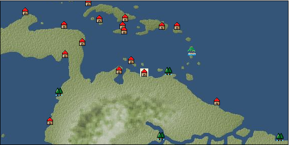

# Port: Caracas

import Tabs from '@theme/Tabs';
import TabItem from '@theme/TabItem';

## General Information

| Attribute | Details |
| :--- | :--- |
| **Port Name** | Caracas |
| **Port Type** | 開拓地 |
| **Region** | Caribbean/Central America |
| **Sea Area** | southern caribbean |
| **Required Language** | italian |
| **Coordinates** | （13343，4412） |
| **Investment Reward** | [Lot (NO.11)](docs/Items/Consumables/Consumables-Treasure-Chests/item_2896.md) （必要投資額：500,000ドゥカード） |

### Available Facilities

| guild | intermediary | exchange | tool shop | workshop craftsman | Painter | sculptor | peddler |
| --- | --- | --- | --- | --- | --- | --- | --- |
|   |   | ○ | ○ | ○ | ○ | ○ | ○ |
| Shipyard Master | Lumbermaker | Sail-maker | weapon craftsman | master | TavernFemale | archive | salesperson |
| --- | --- | --- | --- | --- | --- | --- | --- |
| ○ | ○ | ○ | ○ | ○ |   | ○ |   |
| Shipwright | 銀行 | street worker | 王宮 | Trading post | church | suburbs | translator |
| --- | --- | --- | --- | --- | --- | --- | --- |
| ○ | ○ | ○ |   |   |   |   |   |

### Description
A city located east of Maracaibo on the east coast of South America. The city's name comes from the Caracas people who lived here. *Venice Territory Clerk, Master Cook, Skilled Tailor, Skilled Foundry Technician, Dock Manager Cultural Area: East Coast of Central and South America

<Tabs>
  <TabItem value="trade_goods_sales" label="Trade Goods Sales">

| Item | Group | Purchase Price | Allied Price | Remarks |
| --- | --- | --- | --- | --- |
| [emerald](docs/Items/TradeGoods/TradeGoods-Gems/item_777.md) | [Trading Items (Gemstones)](docs/Categories/category_15.md) | (3,456) | 3,024 |  |
| 要投資（必要投資額：320,000） |
| [opal](docs/Items/TradeGoods/TradeGoods-Gems/item_2006.md) | [Trading Items (Gemstones)](docs/Categories/category_15.md) | (2,724) | 2,384 |  |
| 要投資（必要投資額：320,000） 98%＝2340 99％＝2360 |
| [cacao](docs/Items/TradeGoods/TradeGoods-Sunddries/item_140.md) | [Trading goods (hobby goods)](docs/Categories/category_10.md) | (624) | 546 |  |
| 要投資（必要投資額：240,000） |
| [glasswork](docs/Items/TradeGoods/TradeGoods-Luxuries/item_60.md) | [Trading goods (artificial goods)](docs/Categories/category_13.md) | (3,406) | 2,980 |  |
| Investment required (Required investment amount: 400,000) At alliance: Confirmed at 100% |
| [coffee](docs/Items/TradeGoods/TradeGoods-Sunddries/item_445.md) | [Trading goods (hobby goods)](docs/Categories/category_10.md) | (429) | 376 |  |
| When in alliance: confirmed at 100% |
| [sisal hemp](docs/Items/TradeGoods/TradeGoods-Fibers/item_1766.md) | [交易品（繊維）](docs/Categories/category_1.md) | (233) | 204 |  |
| Investment required (Required investment amount: 180,000) At alliance: Confirmed at 100% |
| [chicken](docs/Items/TradeGoods/TradeGoods-Livestock/item_252.md) | [Trading Goods (Livestock)](docs/Categories/category_18.md) | (50) | 44 |  |
| Investment required (Required investment amount: 120,000) At alliance: Confirmed at 100% |
| [oil](docs/Items/TradeGoods/TradeGoods-Wares/item_613.md) | [交易品（工業品）](docs/Categories/category_19.md) | (580) | 508 |  |
| Investment required (Required investment amount: 180,000) At alliance: Confirmed at 100% |
| [iron ore](docs/Items/TradeGoods/TradeGoods-Minerals/item_146.md) | [Trading Items (Iron Stone)](docs/Categories/category_7.md) | (649) | 568 |  |
| When in alliance: confirmed at 100% |
  </TabItem>
  <TabItem value="sale_specialty" label="Sale (Specialty)">

| Item | Group | sale price | Allied Price | Remarks |
| --- | --- | --- | --- | --- |

#### [交易品（繊維）](docs/Categories/category_1.md)

| [Panya](docs/Items/TradeGoods/TradeGoods-Fibers/item_2097.md) | 交易品（繊維） | (665) | 775 |  |
| [feather](docs/Items/TradeGoods/TradeGoods-Fibers/item_585.md) | 交易品（繊維） | (1,049) | 1,223 |  |
| [Green ramie](docs/Items/TradeGoods/TradeGoods-Fibers/item_3428.md) | 交易品（繊維） | 21,182 | (23,832) |  |
| [deerskin](docs/Items/TradeGoods/TradeGoods-Fibers/item_3648.md) | 交易品（繊維） | 20,300 | (22,839) |  |

#### [Trading Goods (Dye)](docs/Categories/category_2.md)

| [ward](docs/Items/TradeGoods/TradeGoods-Dye/item_57.md) | Trading Goods (Dye) | (2,092) | 2,440 |  |
| 98%＝2410　103%＝2490 |

#### [Trading products (medical products)](docs/Categories/category_6.md)

| [dog saffron](docs/Items/TradeGoods/TradeGoods-Medicine/item_1055.md) | Trading products (medical products) | (783) | 913 |  |
| 98%＝902　104%＝937 |

#### [交易品（酒類）](docs/Categories/category_9.md)

| [aquavit](docs/Items/TradeGoods/TradeGoods-Alcohol/item_572.md) | 交易品（酒類） | (1,391) | 1,623 |  |
| 102%＝1640 98%＝1590 |
| [whiskey](docs/Items/TradeGoods/TradeGoods-Alcohol/item_1.md) | 交易品（酒類） | (1,517) | 1,770 |  |
| When in alliance: confirmed at 100% |
| [gin](docs/Items/TradeGoods/TradeGoods-Alcohol/item_291.md) | 交易品（酒類） | (1,481) | 1,727 |  |
| When in alliance: confirmed at 100% |
| [fruit brandy](docs/Items/TradeGoods/TradeGoods-Alcohol/item_1440.md) | 交易品（酒類） | (1,140) | 1,330 |  |
| When in alliance: confirmed at 100% |
| [Taiwan rice wine](docs/Items/TradeGoods/TradeGoods-Alcohol/item_3672.md) | 交易品（酒類） | 20,139 | (22,658) |  |
| [Sake](docs/Items/TradeGoods/TradeGoods-Alcohol/item_3424.md) | 交易品（酒類） | 20,760 | (23,357) |  |

#### [Trading goods (hobby goods)](docs/Categories/category_10.md)

| [Aigyoku](docs/Items/TradeGoods/TradeGoods-Sunddries/item_3677.md) | Trading goods (hobby goods) | 20,100 | (22,614) |  |
| [Korean tea](docs/Items/TradeGoods/TradeGoods-Sunddries/item_3751.md) | Trading goods (hobby goods) | (17,637) | 20,579 |  |

#### [Trading Goods (Spices)](docs/Categories/category_11.md)

| [lily of the valley](docs/Items/TradeGoods/TradeGoods-Perfume/item_358.md) | Trading Goods (Spices) | (1,457) | 1,700 |  |
| 103%=1720　98%=1680 |
| [lira](docs/Items/TradeGoods/TradeGoods-Perfume/item_30.md) | Trading Goods (Spices) | (1,355) | 1,580 |  |
| 102%＝1600　98%＝1560 |

#### [交易品（美術品）](docs/Categories/category_14.md)

| [taiwan wood carving](docs/Items/TradeGoods/TradeGoods-Art/item_3697.md) | 交易品（美術品） | 19,694 | (22,157) |  |

#### [Trading Items (Gemstones)](docs/Categories/category_15.md)

| [alexandrite](docs/Items/TradeGoods/TradeGoods-Gems/item_4429.md) | Trading Items (Gemstones) | (7,419) | 8,656 |  |
| [pink diamond](docs/Items/TradeGoods/TradeGoods-Gems/item_2874.md) | Trading Items (Gemstones) | 11,367 | (12,789) |  |
| [amber](docs/Items/TradeGoods/TradeGoods-Gems/item_618.md) | Trading Items (Gemstones) | (3,763) | 4,390 |  |
| When in alliance: confirmed at 100% |

#### [Trading Items (Arms)](docs/Categories/category_16.md)

| [crossbow](docs/Items/TradeGoods/TradeGoods-Weapons/item_537.md) | Trading Items (Arms) | (1,492) | 1,740 |  |
| 102%＝1760　98%＝1720 |
| [damascus sword](docs/Items/TradeGoods/TradeGoods-Weapons/item_903.md) | Trading Items (Arms) | (7,679) | 8,960 |  |
| When in alliance: confirmed at 100% |

#### [Trading Items (Firearms)](docs/Categories/category_17.md)

| [musket gun](docs/Items/TradeGoods/TradeGoods-Firearms/item_584.md) | Trading Items (Firearms) | (5,305) | 6,190 |  |
| When in alliance: confirmed at 100% |

#### [交易品（工業品）](docs/Categories/category_19.md)

| [marble](docs/Items/TradeGoods/TradeGoods-Wares/item_52.md) | 交易品（工業品） | (2,057) | 2,400 |  |
| When in alliance: confirmed at 100% |

#### [交易品（織物）](docs/Categories/category_20.md)

| [dutch calico](docs/Items/TradeGoods/TradeGoods-Fabrics/item_1435.md) | 交易品（織物） | (2,254) | 2,630 |  |
| 102%＝2660　98%＝2590 |
| [felt](docs/Items/TradeGoods/TradeGoods-Fabrics/item_4439.md) | 交易品（織物） | (1,442) | 1,682 |  |
| [flannel](docs/Items/TradeGoods/TradeGoods-Fabrics/item_149.md) | 交易品（織物） | (1,810) | 2,112 |  |
| [velvet](docs/Items/TradeGoods/TradeGoods-Fabrics/item_902.md) | 交易品（織物） | (5,357) | 6,250 |  |
| 98%＝6180 104%＝6400 |
  </TabItem>
  <TabItem value="sale_no_specialty" label="Sale (No Specialty)">

| Item | Group | sale price | Allied Price | Remarks |
| --- | --- | --- | --- | --- |

#### [交易品（繊維）](docs/Categories/category_1.md)

| [alpaca hair](docs/Items/TradeGoods/TradeGoods-Fibers/item_3009.md) | 交易品（繊維） | (900) | 1,050 |  |
| When in alliance: confirmed at 100% |
| [fur](docs/Items/TradeGoods/TradeGoods-Fibers/item_634.md) | 交易品（繊維） | (1,256) | 1,465 |  |
| [cotton](docs/Items/TradeGoods/TradeGoods-Fibers/item_610.md) | 交易品（繊維） | (478) | 557 |  |
| When in alliance: confirmed at 100% |

#### [Trading Goods (Dye)](docs/Categories/category_2.md)

| [Gerep](docs/Items/TradeGoods/TradeGoods-Dye/item_1814.md) | Trading Goods (Dye) | (500) | 583 |  |
| [mayan blue](docs/Items/TradeGoods/TradeGoods-Dye/item_1096.md) | Trading Goods (Dye) | (582) | 679 |  |

#### [Trading items (food items)](docs/Categories/category_3.md)

| [Cassava](docs/Items/TradeGoods/TradeGoods-Foodstuffs/item_1805.md) | Trading items (food items) | (63) | 73 |  |
| [sweet potato](docs/Items/TradeGoods/TradeGoods-Foodstuffs/item_1931.md) | Trading items (food items) | (91) | 106 |  |
| [sugar cane](docs/Items/TradeGoods/TradeGoods-Foodstuffs/item_93.md) | Trading items (food items) | (231) | 269 |  |
| [potato](docs/Items/TradeGoods/TradeGoods-Foodstuffs/item_106.md) | Trading items (food items) | (130) | 151 |  |
| [Jambu](docs/Items/TradeGoods/TradeGoods-Foodstuffs/item_1827.md) | Trading items (food items) | (154) | 179 |  |
| [sausage](docs/Items/TradeGoods/TradeGoods-Foodstuffs/item_27.md) | Trading items (food items) | (556) | 648 |  |
| [onion](docs/Items/TradeGoods/TradeGoods-Foodstuffs/item_28.md) | Trading items (food items) | (180) | 209 |  |
| [corn](docs/Items/TradeGoods/TradeGoods-Foodstuffs/item_138.md) | Trading items (food items) | (54) | 62 |  |
| [tomato](docs/Items/TradeGoods/TradeGoods-Foodstuffs/item_1809.md) | Trading items (food items) | (91) | 106 |  |
| [barley](docs/Items/TradeGoods/TradeGoods-Foodstuffs/item_124.md) | Trading items (food items) | 92 | (103) |  |
| [wheat](docs/Items/TradeGoods/TradeGoods-Foodstuffs/item_16.md) | Trading items (food items) | (105) | 122 |  |
| [flour](docs/Items/TradeGoods/TradeGoods-Foodstuffs/item_605.md) | Trading items (food items) | (48) | 56 |  |
| [beef](docs/Items/TradeGoods/TradeGoods-Foodstuffs/item_26.md) | Trading items (food items) | (720) | 840 |  |
| [pork](docs/Items/TradeGoods/TradeGoods-Foodstuffs/item_41.md) | Trading items (food items) | (534) | 623 |  |
| [魚肉](docs/Items/TradeGoods/TradeGoods-Foodstuffs/item_10.md) | Trading items (food items) | (185) | 215 |  |
| [chicken meat](docs/Items/TradeGoods/TradeGoods-Foodstuffs/item_29.md) | Trading items (food items) | (581) | 677 |  |

#### [交易品（調味料）](docs/Categories/category_4.md)

| [butter](docs/Items/TradeGoods/TradeGoods-Seasonings/item_3.md) | 交易品（調味料） | (337) | 393 |  |
| [peanut oil](docs/Items/TradeGoods/TradeGoods-Seasonings/item_596.md) | 交易品（調味料） | (415) | 484 |  |
| [salt](docs/Items/TradeGoods/TradeGoods-Seasonings/item_42.md) | 交易品（調味料） | (234) | 272 |  |
| [sugar](docs/Items/TradeGoods/TradeGoods-Seasonings/item_94.md) | 交易品（調味料） | 951 | 1,062 |  |

#### [Trading Items (Iron Stone)](docs/Categories/category_7.md)

| [copper ore](docs/Items/TradeGoods/TradeGoods-Minerals/item_65.md) | Trading Items (Iron Stone) | (786) | 916 |  |

#### [Trading products (precious metals)](docs/Categories/category_8.md)

| [gold dust](docs/Items/TradeGoods/TradeGoods-Metals/item_111.md) | Trading products (precious metals) | 2,210 | 2,210 |  |
| [gold](docs/Items/TradeGoods/TradeGoods-Metals/item_659.md) | Trading products (precious metals) | (2,362) | 2,756 |  |
| [silver](docs/Items/TradeGoods/TradeGoods-Metals/item_136.md) | Trading products (precious metals) | 1,281 | 1,380 |  |

#### [交易品（酒類）](docs/Categories/category_9.md)

| [tequila](docs/Items/TradeGoods/TradeGoods-Alcohol/item_108.md) | 交易品（酒類） | 1,187 | 1,190 |  |
| ▲Special products from neighboring cultural areas |
| [Beer](docs/Items/TradeGoods/TradeGoods-Alcohol/item_2.md) | 交易品（酒類） | (378) | 441 |  |
| When in alliance: confirmed at 100% |
| [rum](docs/Items/TradeGoods/TradeGoods-Alcohol/item_139.md) | 交易品（酒類） | (535) | 624 |  |
| [liqueur](docs/Items/TradeGoods/TradeGoods-Alcohol/item_18.md) | 交易品（酒類） | (673) | 785 |  |
| [wine](docs/Items/TradeGoods/TradeGoods-Alcohol/item_11.md) | 交易品（酒類） | (542) | 632 |  |

#### [Trading goods (hobby goods)](docs/Categories/category_10.md)

| [cacao](docs/Items/TradeGoods/TradeGoods-Sunddries/item_140.md) | Trading goods (hobby goods) | (234) | 273 |  |
| 要投資（必要投資額：240,000） |
| [tobacco](docs/Items/TradeGoods/TradeGoods-Sunddries/item_109.md) | Trading goods (hobby goods) | (546) | 636 |  |
| [pineapple](docs/Items/TradeGoods/TradeGoods-Sunddries/item_867.md) | Trading goods (hobby goods) | (905) | 1,055 |  |
| [raisins](docs/Items/TradeGoods/TradeGoods-Sunddries/item_35.md) | Trading goods (hobby goods) | (350) | 408 |  |
| When in alliance: confirmed at 100% |

#### [Trading Goods (Spices)](docs/Categories/category_12.md)

| [allspice](docs/Items/TradeGoods/TradeGoods-Spices/item_1848.md) | Trading Goods (Spices) | (389) | 453 |  |
| [vanilla](docs/Items/TradeGoods/TradeGoods-Spices/item_1810.md) | Trading Goods (Spices) | (334) | 389 |  |

#### [Trading goods (artificial goods)](docs/Categories/category_13.md)

| [皮革製品](docs/Items/TradeGoods/TradeGoods-Luxuries/item_12.md) | Trading goods (artificial goods) | (1,320) | 1,540 |  |
| When in alliance: confirmed at 100% |
| [silversmith](docs/Items/TradeGoods/TradeGoods-Luxuries/item_619.md) | Trading goods (artificial goods) | (2,186) | 2,550 |  |
| When in alliance: confirmed at 100% |

#### [交易品（美術品）](docs/Categories/category_14.md)

| [wooden statue](docs/Items/TradeGoods/TradeGoods-Art/item_95.md) | 交易品（美術品） | (984) | 1,148 |  |

#### [Trading Items (Gemstones)](docs/Categories/category_15.md)

| [Agate](docs/Items/TradeGoods/TradeGoods-Gems/item_107.md) | Trading Items (Gemstones) | 2,205 | (2,480) |  |
| [coral](docs/Items/TradeGoods/TradeGoods-Gems/item_141.md) | Trading Items (Gemstones) | (2,749) | 3,207 |  |
| [topaz](docs/Items/TradeGoods/TradeGoods-Gems/item_1097.md) | Trading Items (Gemstones) | (1,706) | 1,990 |  |
| When in alliance: confirmed at 100% |

#### [Trading Items (Arms)](docs/Categories/category_16.md)

| [one handed sword](docs/Items/TradeGoods/TradeGoods-Weapons/item_433.md) | Trading Items (Arms) | (941) | 1,098 |  |

#### [Trading Items (Firearms)](docs/Categories/category_17.md)

| [arquebus gun](docs/Items/TradeGoods/TradeGoods-Firearms/item_14.md) | Trading Items (Firearms) | (2,434) | 2,839 |  |
| [大砲](docs/Items/TradeGoods/TradeGoods-Firearms/item_4.md) | Trading Items (Firearms) | (4,731) | 5,520 |  |
| When in alliance: confirmed at 100% |
| [bullet](docs/Items/TradeGoods/TradeGoods-Firearms/item_13.md) | Trading Items (Firearms) | (1,092) | 1,274 |  |
| [gunpowder](docs/Items/TradeGoods/TradeGoods-Firearms/item_352.md) | Trading Items (Firearms) | (1,334) | 1,556 |  |
| [cannonball](docs/Items/TradeGoods/TradeGoods-Firearms/item_144.md) | Trading Items (Firearms) | (1,514) | 1,766 |  |

#### [Trading Goods (Livestock)](docs/Categories/category_18.md)

| [alpaca](docs/Items/TradeGoods/TradeGoods-Livestock/item_2995.md) | Trading Goods (Livestock) | (705) | 822 |  |
| [rat](docs/Items/TradeGoods/TradeGoods-Livestock/item_2710.md) | Trading Goods (Livestock) | 18 | (20) |  |

#### [交易品（工業品）](docs/Categories/category_19.md)

| [wood](docs/Items/TradeGoods/TradeGoods-Wares/item_277.md) | 交易品（工業品） | (694) | 809 |  |
| [水銀](docs/Items/TradeGoods/TradeGoods-Wares/item_15.md) | 交易品（工業品） | (1,103) | 1,286 |  |
| [青銅](docs/Items/TradeGoods/TradeGoods-Wares/item_7.md) | 交易品（工業品） | (1,087) | 1,268 |  |

#### [交易品（織物）](docs/Categories/category_20.md)

| [Awaiyo](docs/Items/TradeGoods/TradeGoods-Fabrics/item_3002.md) | 交易品（織物） | (1,832) | 2,137 |  |
| [satin](docs/Items/TradeGoods/TradeGoods-Fabrics/item_996.md) | 交易品（織物） | (3,314) | 3,866 |  |
| [georgette](docs/Items/TradeGoods/TradeGoods-Fabrics/item_1000.md) | 交易品（織物） | (3,326) | 3,880 |  |
| When in alliance: confirmed at 100% |
| [tweed](docs/Items/TradeGoods/TradeGoods-Fabrics/item_31.md) | 交易品（織物） | (1,226) | 1,430 |  |
| When in alliance: confirmed at 100% |
| [cotton fabric](docs/Items/TradeGoods/TradeGoods-Fabrics/item_571.md) | 交易品（織物） | (1,077) | 1,256 |  |
| [linen fabric](docs/Items/TradeGoods/TradeGoods-Fabrics/item_135.md) | 交易品（織物） | 395 | (444) |  |
  </TabItem>
  <TabItem value="guild_&_others" label="Guild & Others">

| Item | Group | Sales price | Handling NPC | Remarks |
| --- | --- | --- | --- | --- |

#### others

| [master caribbean cuisine](docs/Items/RecipeBooks/item_2847.md) | [recipe book](docs/Categories/category_22.md) | Fixed recipe |  |  |
| Owned by a cooking expert |
| [Advanced sewing technology](docs/Items/RecipeBooks/item_2849.md) | [recipe book](docs/Categories/category_22.md) | Fixed recipe |  |  |
| Owned by a skilled seamstress |
| [Advanced casting technology](docs/Items/RecipeBooks/item_2848.md) | [recipe book](docs/Categories/category_22.md) | Fixed recipe |  |  |
| Owned by a skilled casting engineer |
  </TabItem>
  <TabItem value="toolman" label="Toolman">

| Item | Group | Sales price | Handling NPC | Remarks |
| --- | --- | --- | --- | --- |

#### [Equipment (body)](docs/Categories/category_24.md)

| [Surcoat](docs/Items/Equipment/Equipment-Body/item_131.md) | Equipment (body) | 30,000 | tool shop owner |  |

#### [Equipment (legs)](docs/Categories/category_26.md)

| [boots](docs/Items/Equipment/Equipment-Feet/item_365.md) | Equipment (legs) | 100 | tool shop owner |  |

#### [Equipment (belongings)](docs/Categories/category_27.md)

| [long sword](docs/Items/Equipment/Equipment-Weapon/item_302.md) | Equipment (belongings) | 15,400 | tool shop owner |  |

#### [装備品（服飾品）](docs/Categories/category_28.md)

| [jade ring](docs/Items/Equipment/Equipment-Accessory/item_1955.md) | 装備品（服飾品） | 7,000,000 | tool shop owner |  |
| 要投資（必要投資額：320,000） |

#### [Consumables (land battle/deck battle)](docs/Categories/category_29.md)

| [Taheebo juice](docs/Items/Consumables/Consumables-Landbattle/item_1807.md) | Consumables (land battle/deck battle) | 300 | tool shop owner |  |
| [taheebo bottle](docs/Items/Consumables/Consumables-Landbattle/item_1823.md) | Consumables (land battle/deck battle) | 600 | tool shop owner |  |
| 要投資（必要投資額：120,000） |
| [tonic](docs/Items/Consumables/Consumables-Landbattle/item_1678.md) | Consumables (land battle/deck battle) | 300 | tool shop owner |  |

#### [Consumables (other)](docs/Categories/category_44.md)

| [black powder](docs/Items/Consumables/Consumables-Other/item_1954.md) | Consumables (other) | 1,000 | tool shop owner |  |
  </TabItem>
  <TabItem value="kobo_craftsmen" label="Craftsman">

| Item | Group | Sales price | Handling NPC | Remarks |
| --- | --- | --- | --- | --- |

#### [Consumables (condition recovery)](docs/Categories/category_21.md)

| [Nostalgic carillon bell](docs/Items/Consumables/Consumables-Recovery/item_245.md) | Consumables (condition recovery) | 200 | workshop craftsman |  |
| [Ship song sheet music](docs/Items/Consumables/Consumables-Recovery/item_247.md) | Consumables (condition recovery) | 200 | workshop craftsman |  |

#### [recipe book](docs/Categories/category_22.md)

| [Furniture manufacturing/Caribbean edition](docs/Items/RecipeBooks/item_1951.md) | recipe book | Fixed recipe | workshop craftsman |  |

#### [Consumables (other)](docs/Categories/category_44.md)

| [帆塗料](docs/Items/Consumables/Consumables-Other/item_348.md) | Consumables (other) | 500 | workshop craftsman |  |
| [ship paint](docs/Items/Consumables/Consumables-Other/item_347.md) | Consumables (other) | 500 | workshop craftsman |  |

#### [furniture](docs/Categories/category_48.md)

| [caribbean style costume box](docs/Items/Furniture/item_2088.md) | furniture | Fixed recipe | workshop craftsman |  |
| [food basket](docs/Items/Furniture/item_2089.md) | furniture | Fixed recipe | workshop craftsman |  |
| [Open rack for small items](docs/Items/Furniture/item_2219.md) | furniture | Fixed recipe | workshop craftsman |  |
| [Stone monument for book stand](docs/Items/Furniture/item_1952.md) | furniture | Fixed recipe | workshop craftsman |  |
| [cat car](docs/Items/Furniture/item_2090.md) | furniture | Fixed recipe | workshop craftsman |  |
  </TabItem>
  <TabItem value="Painter" label="Painter">

| Item | Group | Sales price | Handling NPC | Remarks |
| --- | --- | --- | --- | --- |

#### [Ship parts (emblem)](docs/Categories/category_36.md)

| [admiral](docs/Items/ShipParts/Shipparts-Crests/item_548.md) | Ship parts (emblem) | 5,000 | Painter |  |
| [anchor](docs/Items/ShipParts/Shipparts-Crests/item_549.md) | Ship parts (emblem) | 5,000 | Painter |  |
| [whale](docs/Items/ShipParts/Shipparts-Crests/item_792.md) | Ship parts (emblem) | 5,000 | Painter |  |
| [Quetzalcoatl](docs/Items/ShipParts/Shipparts-Crests/item_3201.md) | Ship parts (emblem) | 1,000,000 | Painter |  |
| [sun](docs/Items/ShipParts/Shipparts-Crests/item_597.md) | Ship parts (emblem) | 5,000 | Painter |  |
| [circle cross](docs/Items/ShipParts/Shipparts-Crests/item_544.md) | Ship parts (emblem) | 5,000 | Painter |  |
| [shellfish](docs/Items/ShipParts/Shipparts-Crests/item_546.md) | Ship parts (emblem) | 5,000 | Painter |  |
| [Delphine](docs/Items/ShipParts/Shipparts-Crests/item_542.md) | Ship parts (emblem) | 5,000 | Painter |  |
| [fisherman](docs/Items/ShipParts/Shipparts-Crests/item_545.md) | Ship parts (emblem) | 5,000 | Painter |  |
  </TabItem>
  <TabItem value="sculptor" label="sculptor">

| Item | Group | Sales price | Handling NPC | Remarks |
| --- | --- | --- | --- | --- |

#### [recipe book](docs/Categories/category_22.md)

| [Saint statue creation, part 3](docs/Items/RecipeBooks/item_3840.md) | recipe book | Fixed recipe | sculptor |  |

#### [Ship parts (figurehead)](docs/Categories/category_34.md)

| [dolphin statue](docs/Items/ShipParts/Shipparts-Figurehead/item_169.md) | Ship parts (figurehead) | 500 | sculptor |  |
| [whale statue](docs/Items/ShipParts/Shipparts-Figurehead/item_172.md) | Ship parts (figurehead) | 12,000 | sculptor |  |
| [shark statue](docs/Items/ShipParts/Shipparts-Figurehead/item_171.md) | Ship parts (figurehead) | 8,600 | sculptor |  |
| [killer whale statue](docs/Items/ShipParts/Shipparts-Figurehead/item_170.md) | Ship parts (figurehead) | 8,600 | sculptor |  |
| [Tobi statue](docs/Items/ShipParts/Shipparts-Figurehead/item_287.md) | Ship parts (figurehead) | 500 | sculptor |  |
| [maiden statue](docs/Items/ShipParts/Shipparts-Figurehead/item_167.md) | Ship parts (figurehead) | 13,000 | sculptor |  |
| [statue of a great man](docs/Items/ShipParts/Shipparts-Figurehead/item_717.md) | Ship parts (figurehead) | 60,000 | sculptor |  |
| [statue of the brave](docs/Items/ShipParts/Shipparts-Figurehead/item_716.md) | Ship parts (figurehead) | 60,000 | sculptor |  |
| [angel statue](docs/Items/ShipParts/Shipparts-Figurehead/item_168.md) | Ship parts (figurehead) | 13,000 | sculptor |  |
| [statue of tenryu](docs/Items/ShipParts/Shipparts-Figurehead/item_630.md) | Ship parts (figurehead) | 62,000 | sculptor |  |
| [statue of goddess](docs/Items/ShipParts/Shipparts-Figurehead/item_721.md) | Ship parts (figurehead) | 60,000 | sculptor |  |
| [sea ​​turtle statue](docs/Items/ShipParts/Shipparts-Figurehead/item_173.md) | Ship parts (figurehead) | 1,800 | sculptor |  |
| [sea ​​monster statue](docs/Items/ShipParts/Shipparts-Figurehead/item_628.md) | Ship parts (figurehead) | 62,000 | sculptor |  |
| [statue of sea god](docs/Items/ShipParts/Shipparts-Figurehead/item_720.md) | Ship parts (figurehead) | 60,000 | sculptor |  |
| [statue of king](docs/Items/ShipParts/Shipparts-Figurehead/item_718.md) | Ship parts (figurehead) | 60,000 | sculptor |  |
| [saint mark statue](docs/Items/ShipParts/Shipparts-Figurehead/item_3304.md) | Ship parts (figurehead) | Fixed recipe | sculptor |  |
  </TabItem>
  <TabItem value="shipyard" label="Shipyard">

### Shipyard Master

| Item | Group | Sales price | Handling NPC | Remarks |
| --- | --- | --- | --- | --- |

#### [recipe book](docs/Categories/category_22.md)

| [Book of Shipbuilding Materials and Hulls Volume 3](docs/Items/RecipeBooks/item_1818.md) | recipe book | Fixed recipe | Shipyard Master |  |

#### [Boat](docs/Categories/category_43.md)

| [Varsha](docs/Items/Ships/item_201.md) | Boat | 2,000 | Shipyard Master |  |

#### [shipbuilding materials](docs/Categories/category_47.md)

| [2-deck type large hull](docs/Items/ShipbuildingFS/item_1820.md) | shipbuilding materials | Fixed recipe | Shipyard Master |  |
| [3-deck type large hull](docs/Items/ShipbuildingFS/item_2087.md) | shipbuilding materials | Fixed recipe | Shipyard Master |  |
| [Flat deck type large hull](docs/Items/ShipbuildingFS/item_1819.md) | shipbuilding materials | Fixed recipe | Shipyard Master |  |

### Lumbermaker

| Item | Group | Sales price | Handling NPC | Remarks |
| --- | --- | --- | --- | --- |

#### [recipe book](docs/Categories/category_22.md)

| [Book of Shipbuilding Materials and Crafts Volume 3](docs/Items/RecipeBooks/item_1924.md) | recipe book | Fixed recipe | Lumbermaker |  |

#### [shipbuilding materials](docs/Categories/category_47.md)

| [large mast](docs/Items/ShipbuildingFS/item_1925.md) | shipbuilding materials | Fixed recipe | Lumbermaker |  |

### Sail-maker

| Item | Group | Sales price | Handling NPC | Remarks |
| --- | --- | --- | --- | --- |

#### [recipe book](docs/Categories/category_22.md)

| [Book of Shipbuilding Materials and Sewing Volume 3](docs/Items/RecipeBooks/item_1913.md) | recipe book | Fixed recipe | Sail-maker |  |

#### [shipbuilding materials](docs/Categories/category_47.md)

| [large gaff sail](docs/Items/ShipbuildingFS/item_1917.md) | shipbuilding materials | Fixed recipe | Sail-maker |  |
| [large square sail](docs/Items/ShipbuildingFS/item_1916.md) | shipbuilding materials | Fixed recipe | Sail-maker |  |
| [large lateen sail](docs/Items/ShipbuildingFS/item_1915.md) | shipbuilding materials | Fixed recipe | Sail-maker |  |

### Shipwright

| Item | Group | Sales price | Handling NPC | Remarks |
| --- | --- | --- | --- | --- |

#### [recipe book](docs/Categories/category_22.md)

| [Shipbuilding materials and processed wood](docs/Items/RecipeBooks/item_1774.md) | recipe book | Fixed recipe | Shipwright |  |

#### [shipbuilding materials](docs/Categories/category_47.md)

| [processed wood](docs/Items/ShipbuildingFS/item_1695.md) | shipbuilding materials | Fixed recipe | Shipwright |  |
  </TabItem>
  <TabItem value="weapon craftsman" label="weapon craftsman">

| Item | Group | Sales price | Handling NPC | Remarks |
| --- | --- | --- | --- | --- |

#### [recipe book](docs/Categories/category_22.md)

| [Book of Shipbuilding Materials and Casting Volume 3](docs/Items/RecipeBooks/item_1912.md) | recipe book | Fixed recipe | weapon craftsman |  |

#### [shipbuilding materials](docs/Categories/category_47.md)

| [改良大型砲門](docs/Items/ShipbuildingFS/item_1914.md) | shipbuilding materials | Fixed recipe | weapon craftsman |  |
  </TabItem>
  <TabItem value="dock manager" label="dock manager">

| Item | Group | Sales price | Handling NPC | Remarks |
| --- | --- | --- | --- | --- |

#### [recipe book](docs/Categories/category_22.md)

| [造船技術研究成果](docs/Items/RecipeBooks/item_2850.md) | recipe book | Fixed recipe | dock manager |  |

#### [shipbuilding materials](docs/Categories/category_47.md)

| [lifeboat](docs/Items/ShipbuildingFS/item_2846.md) | shipbuilding materials | Fixed recipe | dock manager |  |
| hub city |
| [Sewing tools set](docs/Items/ShipbuildingFS/item_2879.md) | shipbuilding materials | Fixed recipe | dock manager |  |
| [shipwright's room](docs/Items/ShipbuildingFS/item_2880.md) | shipbuilding materials | Fixed recipe | dock manager |  |
  </TabItem>
  <TabItem value="scholar" label="scholar">

| Item | Group | Sales price | Handling NPC | Remarks |
| --- | --- | --- | --- | --- |

#### [recipe book](docs/Categories/category_22.md)

| [How to make an American language dictionary](docs/Items/RecipeBooks/item_2119.md) | recipe book | Fixed recipe | scholar |  |
| Investment required (required investment amount: 240,000) We have confirmed that the investment amount is 240,000, but it is not confirmed whether it is the minimum investment amount. |
  </TabItem>
</Tabs>