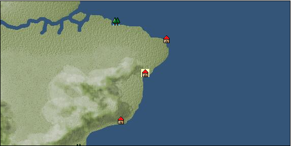

# Port: バイーア

import Tabs from '@theme/Tabs';
import TabItem from '@theme/TabItem';

## General Information

| Attribute | Details |
| :--- | :--- |
| **Port Name** | bahia |
| **Port Type** | port of alliance |
| **Region** | South America |
| **Sea Area** | southwest atlantic |
| **Required Language** | portuguese |
| **Coordinates** | （14647，5336） |
| **Investment Reward** | [Traditional cuisine of Central and South America](docs/Items/RecipeBooks/item_1830.md) （必要投資額：500,000ドゥカード） |

### Available Facilities

| guild | intermediary | exchange | tool shop | workshop craftsman | Painter | sculptor | peddler |
| --- | --- | --- | --- | --- | --- | --- | --- |
|   |   | ○ | ○ |   |   |   | ○ |
| Shipyard Master | Lumbermaker | Sail-maker | weapon craftsman | master | TavernFemale | archive | salesperson |
| --- | --- | --- | --- | --- | --- | --- | --- |
|   |   |   |   | ○ |   |   |   |
| Shipwright | 銀行 | street worker | 王宮 | Trading post | church | suburbs | translator |
| --- | --- | --- | --- | --- | --- | --- | --- |
| ○ | ○ | ○ |   |   |   |   |   |

### Description
Bahia means "bay". A city in South America located on a peninsula facing the Atlantic Ocean and surrounding Todos os Santos ("Bay of All Saints"). Cultural area: East coast of Central and South America

<Tabs>
  <TabItem value="trade_goods_sales" label="Trade Goods Sales">

| item | group | purchase price | 同盟時 | remarks |
| --- | --- | --- | --- | --- |
| [Cassava](docs/Items/TradeGoods/TradeGoods-Foodstuffs/item_1805.md) | [Trading items (food items)](docs/Categories/category_3.md) | 68 | (60) |  |
| [coffee](docs/Items/TradeGoods/TradeGoods-Sunddries/item_445.md) | [Trading goods (hobby goods)](docs/Categories/category_10.md) | 429 | (376) |  |
| [sugar cane](docs/Items/TradeGoods/TradeGoods-Foodstuffs/item_93.md) | [Trading items (food items)](docs/Categories/category_3.md) | 219 | (192) |  |
| [wood](docs/Items/TradeGoods/TradeGoods-Wares/item_277.md) | [交易品（工業品）](docs/Categories/category_19.md) | 675 | (591) |  |
| 要投資（必要投資額：240,000） |
| [beef](docs/Items/TradeGoods/TradeGoods-Foodstuffs/item_26.md) | [Trading items (food items)](docs/Categories/category_3.md) | 647 | (567) |  |
| [cotton](docs/Items/TradeGoods/TradeGoods-Fibers/item_610.md) | [交易品（繊維）](docs/Categories/category_1.md) | 305 | 268 |  |
  </TabItem>
  <TabItem value="sale_specialty" label="Sale (Specialty)">

| item | group | sale price | 同盟時 | remarks |
| --- | --- | --- | --- | --- |

#### [交易品（繊維）](docs/Categories/category_1.md)

| [flax](docs/Items/TradeGoods/TradeGoods-Fibers/item_64.md) | 交易品（繊維） | 372 | (418) |  |
| [feather](docs/Items/TradeGoods/TradeGoods-Fibers/item_585.md) | 交易品（繊維） | 1,143 | (1,286) |  |

#### [交易品（酒類）](docs/Categories/category_9.md)

| [aquavit](docs/Items/TradeGoods/TradeGoods-Alcohol/item_572.md) | 交易品（酒類） | 1,447 | (1,628) |  |
| [whiskey](docs/Items/TradeGoods/TradeGoods-Alcohol/item_1.md) | 交易品（酒類） | 1,620 | (1,822) |  |
| [sherry](docs/Items/TradeGoods/TradeGoods-Alcohol/item_844.md) | 交易品（酒類） | 820 | (922) |  |
| [gin](docs/Items/TradeGoods/TradeGoods-Alcohol/item_291.md) | 交易品（酒類） | 1,622 | 1,866 |  |
| [fruit brandy](docs/Items/TradeGoods/TradeGoods-Alcohol/item_1440.md) | 交易品（酒類） | 1,154 | (1,298) |  |

#### [Trading goods (hobby goods)](docs/Categories/category_10.md)

| [banana](docs/Items/TradeGoods/TradeGoods-Sunddries/item_1947.md) | Trading goods (hobby goods) | 527 | (592) |  |
| [black tea](docs/Items/TradeGoods/TradeGoods-Sunddries/item_675.md) | Trading goods (hobby goods) | 2,316 | (2,605) |  |

#### [Trading Goods (Spices)](docs/Categories/category_11.md)

| [lira](docs/Items/TradeGoods/TradeGoods-Perfume/item_30.md) | Trading Goods (Spices) | 1,489 | (1,675) |  |

#### [Trading Goods (Spices)](docs/Categories/category_12.md)

| [pepper](docs/Items/TradeGoods/TradeGoods-Spices/item_58.md) | Trading Goods (Spices) | 3,317 | (3,731) |  |
| [saffron](docs/Items/TradeGoods/TradeGoods-Spices/item_845.md) | Trading Goods (Spices) | 5,565 | (6,261) |  |
| [nutmeg](docs/Items/TradeGoods/TradeGoods-Spices/item_1969.md) | Trading Goods (Spices) | 4,500 | (5,062) |  |

#### [Trading goods (artificial goods)](docs/Categories/category_13.md)

| [glasswork](docs/Items/TradeGoods/TradeGoods-Luxuries/item_60.md) | Trading goods (artificial goods) | 2,933 | (3,299) |  |

#### [交易品（美術品）](docs/Categories/category_14.md)

| [oil painting](docs/Items/TradeGoods/TradeGoods-Art/item_1088.md) | 交易品（美術品） | 4,100 | (4,612) |  |

#### [Trading Items (Gemstones)](docs/Categories/category_15.md)

| [sapphire](docs/Items/TradeGoods/TradeGoods-Gems/item_676.md) | Trading Items (Gemstones) | 6,730 | (7,571) |  |
| [pink diamond](docs/Items/TradeGoods/TradeGoods-Gems/item_2874.md) | Trading Items (Gemstones) | 12,800 | (14,401) |  |

#### [Trading Items (Firearms)](docs/Categories/category_17.md)

| [musket gun](docs/Items/TradeGoods/TradeGoods-Firearms/item_584.md) | Trading Items (Firearms) | (5,496) | 6,412 |  |

#### [交易品（織物）](docs/Categories/category_20.md)

| [indian chintz](docs/Items/TradeGoods/TradeGoods-Fabrics/item_159.md) | 交易品（織物） | 2,108 | (2,371) |  |
| [dutch calico](docs/Items/TradeGoods/TradeGoods-Fabrics/item_1435.md) | 交易品（織物） | (2,208) | 2,576 |  |
| [flannel](docs/Items/TradeGoods/TradeGoods-Fabrics/item_149.md) | 交易品（織物） | 2,454 | (2,761) |  |
| [velvet](docs/Items/TradeGoods/TradeGoods-Fabrics/item_902.md) | 交易品（織物） | 6,187 | (6,961) |  |
  </TabItem>
  <TabItem value="sale_no_specialty" label="Sale (No Specialty)">

| item | group | sale price | 同盟時 | remarks |
| --- | --- | --- | --- | --- |

#### [交易品（繊維）](docs/Categories/category_1.md)

| [leather](docs/Items/TradeGoods/TradeGoods-Fibers/item_44.md) | 交易品（繊維） | 535 | (601) |  |
| [cotton](docs/Items/TradeGoods/TradeGoods-Fibers/item_610.md) | 交易品（繊維） | 134 | (150) |  |

#### [Trading Goods (Dye)](docs/Categories/category_2.md)

| [log wood](docs/Items/TradeGoods/TradeGoods-Dye/item_1813.md) | Trading Goods (Dye) | 698 | (785) |  |

#### [Trading items (food items)](docs/Categories/category_3.md)

| [Cassava](docs/Items/TradeGoods/TradeGoods-Foodstuffs/item_1805.md) | Trading items (food items) | 30 | (33) |  |
| [Jambu](docs/Items/TradeGoods/TradeGoods-Foodstuffs/item_1827.md) | Trading items (food items) | 179 | (201) |  |
| [corn](docs/Items/TradeGoods/TradeGoods-Foodstuffs/item_138.md) | Trading items (food items) | 59 | (66) |  |
| [wheat](docs/Items/TradeGoods/TradeGoods-Foodstuffs/item_16.md) | Trading items (food items) | 108 | 122 |  |

#### [Trading Items (Iron Stone)](docs/Categories/category_7.md)

| [iron ore](docs/Items/TradeGoods/TradeGoods-Minerals/item_146.md) | Trading Items (Iron Stone) | 727 | 727 |  |
| [copper ore](docs/Items/TradeGoods/TradeGoods-Minerals/item_65.md) | Trading Items (Iron Stone) | 866 | 916 |  |

#### [Trading products (precious metals)](docs/Categories/category_8.md)

| [gold](docs/Items/TradeGoods/TradeGoods-Metals/item_659.md) | Trading products (precious metals) | 2,753 | (3,097) |  |
| [silver](docs/Items/TradeGoods/TradeGoods-Metals/item_136.md) | Trading products (precious metals) | 1,366 | (1,536) |  |

#### [交易品（酒類）](docs/Categories/category_9.md)

| [tequila](docs/Items/TradeGoods/TradeGoods-Alcohol/item_108.md) | 交易品（酒類） | 1,023 | (1,150) |  |

#### [Trading goods (hobby goods)](docs/Categories/category_10.md)

| [cashew nuts](docs/Items/TradeGoods/TradeGoods-Sunddries/item_2120.md) | Trading goods (hobby goods) | 395 | (444) |  |
| [tobacco](docs/Items/TradeGoods/TradeGoods-Sunddries/item_109.md) | Trading goods (hobby goods) | 636 | (715) |  |
| [pineapple](docs/Items/TradeGoods/TradeGoods-Sunddries/item_867.md) | Trading goods (hobby goods) | 1,055 | (1,186) |  |
| [Yerba mate tea](docs/Items/TradeGoods/TradeGoods-Sunddries/item_1808.md) | Trading goods (hobby goods) | 290 | (326) |  |

#### [Trading Goods (Spices)](docs/Categories/category_11.md)

| [rose](docs/Items/TradeGoods/TradeGoods-Perfume/item_536.md) | Trading Goods (Spices) | 4,133 | 4,449 |  |

#### [Trading goods (artificial goods)](docs/Categories/category_13.md)

| [dragonfly ball](docs/Items/TradeGoods/TradeGoods-Luxuries/item_294.md) | Trading goods (artificial goods) | (1,044) | 1,218 |  |
| [lapidary work](docs/Items/TradeGoods/TradeGoods-Luxuries/item_153.md) | Trading goods (artificial goods) | 6,676 | (7,511) |  |
| [goldsmith](docs/Items/TradeGoods/TradeGoods-Luxuries/item_687.md) | Trading goods (artificial goods) | 2,716 | (3,055) |  |

#### [Trading Items (Gemstones)](docs/Categories/category_15.md)

| [opal](docs/Items/TradeGoods/TradeGoods-Gems/item_2006.md) | Trading Items (Gemstones) | 2,673 | (3,007) |  |
| [crystal](docs/Items/TradeGoods/TradeGoods-Gems/item_893.md) | Trading Items (Gemstones) | 1,340 | (1,507) |  |

#### [Trading Items (Firearms)](docs/Categories/category_17.md)

| [arquebus gun](docs/Items/TradeGoods/TradeGoods-Firearms/item_14.md) | Trading Items (Firearms) | (2,438) | 2,844 |  |

#### [交易品（工業品）](docs/Categories/category_19.md)

| [rubber](docs/Items/TradeGoods/TradeGoods-Wares/item_2819.md) | 交易品（工業品） | 731 | (822) |  |
| [log](docs/Items/TradeGoods/TradeGoods-Wares/item_846.md) | 交易品（工業品） | 152 | (171) |  |
| [wood](docs/Items/TradeGoods/TradeGoods-Wares/item_277.md) | 交易品（工業品） | 152 | (171) |  |
| 要投資（必要投資額：240,000） |
| [iron material](docs/Items/TradeGoods/TradeGoods-Wares/item_268.md) | 交易品（工業品） | 784 | 817 |  |

#### [交易品（織物）](docs/Categories/category_20.md)

| [georgette](docs/Items/TradeGoods/TradeGoods-Fabrics/item_1000.md) | 交易品（織物） | 3,730 | (4,196) |  |
| [silk fabric](docs/Items/TradeGoods/TradeGoods-Fabrics/item_823.md) | 交易品（織物） | 2,753 | (3,097) |  |
  </TabItem>
  <TabItem value="guild_&_others" label="Guild & Others">

| item | group | Sales price | Handling NPC | remarks |
| --- | --- | --- | --- | --- |

#### cabral

| [航行技術](docs/Skills/Skill-Adventure/item_1730.md) | [Skill (adventure)](docs/Categories/category_39.md) | 300,000 | cabral |  |
| [applied swordsmanship](docs/Skills/Skill-Battle/item_1733.md) | [Skill (combat)](docs/Categories/category_41.md) | 200,000 | cabral |  |
  </TabItem>
  <TabItem value="toolman" label="Toolman">

| item | group | Sales price | Handling NPC | remarks |
| --- | --- | --- | --- | --- |

#### [Equipment (body)](docs/Categories/category_24.md)

| [Surcoat](docs/Items/Equipment/Equipment-Body/item_131.md) | Equipment (body) | 30,000 | tool shop owner |  |

#### [Equipment (legs)](docs/Categories/category_26.md)

| [boots](docs/Items/Equipment/Equipment-Feet/item_365.md) | Equipment (legs) | 100 | tool shop owner |  |

#### [Equipment (belongings)](docs/Categories/category_27.md)

| [long sword](docs/Items/Equipment/Equipment-Weapon/item_302.md) | Equipment (belongings) | 15,400 | tool shop owner |  |

#### [Consumables (land battle/deck battle)](docs/Categories/category_29.md)

| [Taheebo juice](docs/Items/Consumables/Consumables-Landbattle/item_1807.md) | Consumables (land battle/deck battle) | 300 | tool shop owner |  |
| [taheebo bottle](docs/Items/Consumables/Consumables-Landbattle/item_1823.md) | Consumables (land battle/deck battle) | 600 | tool shop owner |  |
| 要投資（必要投資額：120,000） |
| [tonic](docs/Items/Consumables/Consumables-Landbattle/item_1678.md) | Consumables (land battle/deck battle) | 300 | tool shop owner |  |
| [torch for throwing](docs/Items/Consumables/Consumables-Landbattle/item_313.md) | Consumables (land battle/deck battle) | 150 | tool shop owner |  |
  </TabItem>
  <TabItem value="peddler" label="peddler">

| item | group | Sales price | Handling NPC | remarks |
| --- | --- | --- | --- | --- |

#### [Consumables (condition recovery)](docs/Categories/category_21.md)

| [spare sail](docs/Items/Consumables/Consumables-Recovery/item_242.md) | Consumables (condition recovery) |  | peddler |  |
| [reserve rudder](docs/Items/Consumables/Consumables-Recovery/item_243.md) | Consumables (condition recovery) |  | peddler |  |
| [rope of punishment](docs/Items/Consumables/Consumables-Recovery/item_71.md) | Consumables (condition recovery) |  | peddler |  |

#### [Consumables (land battle/deck battle)](docs/Categories/category_29.md)

| [suma juice](docs/Items/Consumables/Consumables-Landbattle/item_1825.md) | Consumables (land battle/deck battle) |  | peddler |  |
| [suma bottle](docs/Items/Consumables/Consumables-Landbattle/item_1835.md) | Consumables (land battle/deck battle) |  | peddler |  |
| [煙玉](docs/Items/Consumables/Consumables-Landbattle/item_86.md) | Consumables (land battle/deck battle) |  | peddler |  |
| [explosive drug](docs/Items/Consumables/Consumables-Landbattle/item_2493.md) | Consumables (land battle/deck battle) |  | peddler |  |

#### [Consumables (skill activation)](docs/Categories/category_31.md)

| [landmark ribbon](docs/Items/Consumables/Consumables-Skill/item_316.md) | Consumables (skill activation) |  | peddler |  |
  </TabItem>
  <TabItem value="shipyard" label="Shipyard">

### Shipwright

| item | group | Sales price | Handling NPC | remarks |
| --- | --- | --- | --- | --- |

#### [recipe book](docs/Categories/category_22.md)

| [Shipbuilding materials/fender lines](docs/Items/RecipeBooks/item_1770.md) | recipe book | Fixed recipe | Shipwright |  |

#### [shipbuilding materials](docs/Categories/category_47.md)

| [防舷綱](docs/Items/ShipbuildingFS/item_1769.md) | shipbuilding materials | Fixed recipe | Shipwright |  |
  </TabItem>
</Tabs>