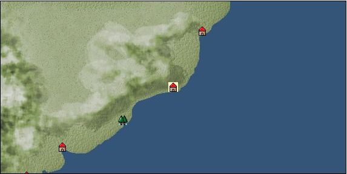

# Port: リオデジャネイロ

import Tabs from '@theme/Tabs';
import TabItem from '@theme/TabItem';

## General Information

| Attribute | Details |
| :--- | :--- |
| **Port Name** | rio de janeiro |
| **Port Type** | port of alliance |
| **Region** | South America |
| **Sea Area** | southwest atlantic |
| **Required Language** | portuguese |
| **Coordinates** | （14456，5711） |
| **Investment Reward** | [Traditional cuisine of Central and South America](Items/Recipe Book/item_1830.md) （必要投資額：500,000ドゥカード） |

### Available Facilities

| guild | intermediary | exchange | tool shop | workshop craftsman | Painter | sculptor | peddler |
| --- | --- | --- | --- | --- | --- | --- | --- |
|   | ○ | ○ | ○ |   |   |   | ○ |
| Shipyard Master | Lumbermaker | Sail-maker | weapon craftsman | master | TavernFemale | archive | salesperson |
| --- | --- | --- | --- | --- | --- | --- | --- |
|   |   |   |   | ○ | ○ |   | ○ |
| Shipwright | 銀行 | street worker | 王宮 | Trading post | church | suburbs | translator |
| --- | --- | --- | --- | --- | --- | --- | --- |
| ○ | ○ | ○ |   |   |   |   | ○ |

### Description
It was discovered in the early 16th century by the explorer Gaspar de Lemos, who mistook the large bay for an estuary and named it Rio de Janeiro, meaning "River of January." Tavern Woman: Giselle Consul Secretary Cultural Area: East Coast of Central and South America

<Tabs>
  <TabItem value="trade_goods_sales" label="Trade Goods Sales">

| item | group | purchase price | 同盟時 | remarks |
| --- | --- | --- | --- | --- |
| [Gerep](Items/Trade Goods/TradeGoods-Dye/item_1814.md) | [Trading Goods (Dye)](Categories/category_2.md) | 492 | (431) |  |
| 要投資（必要投資額：320,000） |
| [coffee](Items/Trade Goods/TradeGoods-Sunddries/item_445.md) | [Trading goods (hobby goods)](Categories/category_10.md) | 428 | (375) |  |
| [sugar cane](Items/Trade Goods/TradeGoods-Foodstuffs/item_93.md) | [Trading items (food items)](Categories/category_3.md) | 219 | (192) |  |
| [Jambu](Items/Trade Goods/TradeGoods-Foodstuffs/item_1827.md) | [Trading items (food items)](Categories/category_3.md) | 128 | (112) |  |
| [topaz](Items/Trade Goods/TradeGoods-Gems/item_1097.md) | [Trading Items (Gemstones)](Categories/category_15.md) | 1,920 | 1,684 |  |
| 要投資（必要投資額：600,000） |
| [cotton](Items/Trade Goods/TradeGoods-Fibers/item_610.md) | [交易品（繊維）](Categories/category_1.md) | 305 | 268 |  |
| [gold](Items/Trade Goods/TradeGoods-Metals/item_659.md) | [Trading products (precious metals)](Categories/category_8.md) | 3,364 | (2,944) |  |
| 要投資（必要投資額：400,000） |
  </TabItem>
  <TabItem value="sale_specialty" label="Sale (Specialty)">

| item | group | sale price | 同盟時 | remarks |
| --- | --- | --- | --- | --- |

#### [交易品（繊維）](Categories/category_1.md)

| [Rush](Items/Trade Goods/TradeGoods-Fibers/item_3675.md) | 交易品（繊維） | (3,138) | 3,661 |  |
| [flax](Items/Trade Goods/TradeGoods-Fibers/item_64.md) | 交易品（繊維） | 373 | (419) |  |

#### [Trading Goods (Dye)](Categories/category_2.md)

| [Shorou](Items/Trade Goods/TradeGoods-Dye/item_3691.md) | Trading Goods (Dye) | (18,395) | 21,464 |  |

#### [交易品（調味料）](Categories/category_4.md)

| [Bean sauce](Items/Trade Goods/TradeGoods-Seasonings/item_3875.md) | 交易品（調味料） | 28,393 | (31,945) |  |

#### [交易品（雑貨）](Categories/category_5.md)

| [lantern](Items/Trade Goods/TradeGoods-Misc/item_3683.md) | 交易品（雑貨） | 3,324 | (3,739) |  |

#### [Trading products (medical products)](Categories/category_6.md)

| [Noni](Items/Trade Goods/TradeGoods-Medicine/item_2099.md) | Trading products (medical products) | (1,012) | 1,180 |  |
| [Nothing](Items/Trade Goods/TradeGoods-Medicine/item_1053.md) | Trading products (medical products) | (1,179) | 1,375 |  |

#### [Trading products (precious metals)](Categories/category_8.md)

| [platinum](Items/Trade Goods/TradeGoods-Metals/item_2178.md) | Trading products (precious metals) | (6,825) | 7,963 |  |

#### [交易品（酒類）](Categories/category_9.md)

| [aquavit](Items/Trade Goods/TradeGoods-Alcohol/item_572.md) | 交易品（酒類） | 1,489 | (1,675) |  |
| [whiskey](Items/Trade Goods/TradeGoods-Alcohol/item_1.md) | 交易品（酒類） | 1,527 | (1,718) |  |
| [sherry](Items/Trade Goods/TradeGoods-Alcohol/item_844.md) | 交易品（酒類） | 725 | (815) |  |
| [gin](Items/Trade Goods/TradeGoods-Alcohol/item_291.md) | 交易品（酒類） | 1,465 | (1,648) |  |
| [fruit brandy](Items/Trade Goods/TradeGoods-Alcohol/item_1440.md) | 交易品（酒類） | 1,130 | (1,271) |  |
| [Taiwan rice wine](Items/Trade Goods/TradeGoods-Alcohol/item_3672.md) | 交易品（酒類） | 29,918 | (33,661) |  |
| [紹興酒](Items/Trade Goods/TradeGoods-Alcohol/item_3882.md) | 交易品（酒類） | 29,814 | (33,544) |  |

#### [Trading goods (hobby goods)](Categories/category_10.md)

| [almond](Items/Trade Goods/TradeGoods-Sunddries/item_367.md) | Trading goods (hobby goods) | 327 | (367) |  |
| [caviar](Items/Trade Goods/TradeGoods-Sunddries/item_2122.md) | Trading goods (hobby goods) | (1,595) | 1,860 |  |
| 同盟時100% |
| [eggplant](Items/Trade Goods/TradeGoods-Sunddries/item_3426.md) | Trading goods (hobby goods) | (18,212) | 21,250 |  |
| [raspberry](Items/Trade Goods/TradeGoods-Sunddries/item_5419.md) | Trading goods (hobby goods) | (3,447) | 4,022 |  |

#### [Trading Goods (Spices)](Categories/category_11.md)

| [jasmine](Items/Trade Goods/TradeGoods-Perfume/item_772.md) | Trading Goods (Spices) | 5,650 | (6,356) |  |
| [lira](Items/Trade Goods/TradeGoods-Perfume/item_30.md) | Trading Goods (Spices) | 1,594 | (1,793) |  |
| [sandalwood](Items/Trade Goods/TradeGoods-Perfume/item_771.md) | Trading Goods (Spices) | 3,733 | (4,200) |  |

#### [Trading Goods (Spices)](Categories/category_12.md)

| [cloves](Items/Trade Goods/TradeGoods-Spices/item_1092.md) | Trading Goods (Spices) | (4,243) | 4,950 |  |
| [pepper](Items/Trade Goods/TradeGoods-Spices/item_58.md) | Trading Goods (Spices) | (3,262) | 3,806 |  |
| [saffron](Items/Trade Goods/TradeGoods-Spices/item_845.md) | Trading Goods (Spices) | 4,784 | (5,382) |  |
| [nutmeg](Items/Trade Goods/TradeGoods-Spices/item_1969.md) | Trading Goods (Spices) | (4,435) | 5,174 |  |
| [mace](Items/Trade Goods/TradeGoods-Spices/item_2100.md) | Trading Goods (Spices) | (4,723) | 5,511 |  |
| [lemongrass](Items/Trade Goods/TradeGoods-Spices/item_2096.md) | Trading Goods (Spices) | (463) | 540 |  |
| [Grapefruit](Items/Trade Goods/TradeGoods-Spices/item_3422.md) | Trading Goods (Spices) | (19,806) | 23,110 |  |

#### [Trading goods (artificial goods)](Categories/category_13.md)

| [glasswork](Items/Trade Goods/TradeGoods-Luxuries/item_60.md) | Trading goods (artificial goods) | 2,830 | (3,184) |  |

#### [交易品（美術品）](Categories/category_14.md)

| [oil painting](Items/Trade Goods/TradeGoods-Art/item_1088.md) | 交易品（美術品） | 3,849 | (4,330) |  |

#### [Trading Items (Gemstones)](Categories/category_15.md)

| [alexandrite](Items/Trade Goods/TradeGoods-Gems/item_4429.md) | Trading Items (Gemstones) | (9,056) | 10,567 |  |
| [sapphire](Items/Trade Goods/TradeGoods-Gems/item_676.md) | Trading Items (Gemstones) | (5,830) | 6,802 |  |
| [diamond](Items/Trade Goods/TradeGoods-Gems/item_449.md) | Trading Items (Gemstones) | 3,167 | (3,563) |  |
| [pink diamond](Items/Trade Goods/TradeGoods-Gems/item_2874.md) | Trading Items (Gemstones) | (11,602) | 13,537 |  |
| [amber](Items/Trade Goods/TradeGoods-Gems/item_618.md) | Trading Items (Gemstones) | 4,140 | (4,657) |  |

#### [Trading Items (Arms)](Categories/category_16.md)

| [damascus sword](Items/Trade Goods/TradeGoods-Weapons/item_903.md) | Trading Items (Arms) | (6,952) | 8,111 |  |
| [Japanese sword](Items/Trade Goods/TradeGoods-Weapons/item_3437.md) | Trading Items (Arms) | 31,628 | (35,584) |  |

#### [Trading Items (Firearms)](Categories/category_17.md)

| [musket gun](Items/Trade Goods/TradeGoods-Firearms/item_584.md) | Trading Items (Firearms) | 5,558 | 6,076 |  |
| [銅手銃](Items/Trade Goods/TradeGoods-Firearms/item_3700.md) | Trading Items (Firearms) | 29,175 | (32,825) |  |

#### [交易品（工業品）](Categories/category_19.md)

| [羊皮紙](Items/Trade Goods/TradeGoods-Wares/item_53.md) | 交易品（工業品） | 2,105 | (2,368) |  |

#### [交易品（織物）](Categories/category_20.md)

| [damask](Items/Trade Goods/TradeGoods-Fabrics/item_614.md) | 交易品（織物） | 6,490 | (7,301) |  |
| [turkish rug](Items/Trade Goods/TradeGoods-Fabrics/item_686.md) | 交易品（織物） | 8,128 | 9,100 |  |
| [flannel](Items/Trade Goods/TradeGoods-Fabrics/item_149.md) | 交易品（織物） | 2,100 | (2,362) |  |
| [velvet](Items/Trade Goods/TradeGoods-Fabrics/item_902.md) | 交易品（織物） | 6,721 | (7,561) |  |
| [麻織物](Items/Trade Goods/TradeGoods-Fabrics/item_3673.md) | 交易品（織物） | 30,463 | (34,274) |  |
  </TabItem>
  <TabItem value="sale_no_specialty" label="Sale (No Specialty)">

| item | group | sale price | 同盟時 | remarks |
| --- | --- | --- | --- | --- |

#### [交易品（繊維）](Categories/category_1.md)

| [Manila hemp](Items/Trade Goods/TradeGoods-Fibers/item_2098.md) | 交易品（繊維） | (196) | 228 |  |
| [raw silk](Items/Trade Goods/TradeGoods-Fibers/item_677.md) | 交易品（繊維） | 2,123 | (2,388) |  |
| [numb](Items/Trade Goods/TradeGoods-Fibers/item_900.md) | 交易品（繊維） | 12 | (13) |  |

#### [Trading Goods (Dye)](Categories/category_2.md)

| [log wood](Items/Trade Goods/TradeGoods-Dye/item_1813.md) | Trading Goods (Dye) | 699 | (786) |  |

#### [Trading items (food items)](Categories/category_3.md)

| [Cassava](Items/Trade Goods/TradeGoods-Foodstuffs/item_1805.md) | Trading items (food items) | 73 | (82) |  |
| [potato](Items/Trade Goods/TradeGoods-Foodstuffs/item_106.md) | Trading items (food items) | (141) | 164 |  |
| [onion](Items/Trade Goods/TradeGoods-Foodstuffs/item_28.md) | Trading items (food items) | 196 | (220) |  |
| [corn](Items/Trade Goods/TradeGoods-Foodstuffs/item_138.md) | Trading items (food items) | 60 | (67) |  |
| [wheat](Items/Trade Goods/TradeGoods-Foodstuffs/item_16.md) | Trading items (food items) | 108 | (121) |  |
| [beef](Items/Trade Goods/TradeGoods-Foodstuffs/item_26.md) | Trading items (food items) | 750 | 841 |  |

#### [交易品（調味料）](Categories/category_4.md)

| [anchovies](Items/Trade Goods/TradeGoods-Seasonings/item_3004.md) | 交易品（調味料） | 161 | (181) |  |
| [almond oil](Items/Trade Goods/TradeGoods-Seasonings/item_578.md) | 交易品（調味料） | (862) | 1,005 |  |
| [coconut vinegar](Items/Trade Goods/TradeGoods-Seasonings/item_1988.md) | 交易品（調味料） | 499 | (561) |  |
| [wine vinegar](Items/Trade Goods/TradeGoods-Seasonings/item_429.md) | 交易品（調味料） | 740 | (832) |  |
| [sugar](Items/Trade Goods/TradeGoods-Seasonings/item_94.md) | 交易品（調味料） | 981 | 1,057 |  |

#### [Trading products (medical products)](Categories/category_6.md)

| [dandelion](Items/Trade Goods/TradeGoods-Medicine/item_1089.md) | Trading products (medical products) | (258) | 300 |  |
| [Maca](Items/Trade Goods/TradeGoods-Medicine/item_3000.md) | Trading products (medical products) | (349) | 407 |  |
| [mercury agent](Items/Trade Goods/TradeGoods-Medicine/item_703.md) | Trading products (medical products) | (1,397) | 1,630 |  |

#### [Trading Items (Iron Stone)](Categories/category_7.md)

| [iron ore](Items/Trade Goods/TradeGoods-Minerals/item_146.md) | Trading Items (Iron Stone) | 727 | (817) |  |
| [copper ore](Items/Trade Goods/TradeGoods-Minerals/item_65.md) | Trading Items (Iron Stone) | 868 | (976) |  |

#### [Trading products (precious metals)](Categories/category_8.md)

| [silver](Items/Trade Goods/TradeGoods-Metals/item_136.md) | Trading products (precious metals) | (1,181) | 1,377 |  |

#### [交易品（酒類）](Categories/category_9.md)

| [tequila](Items/Trade Goods/TradeGoods-Alcohol/item_108.md) | 交易品（酒類） | 1,023 | (1,150) |  |
| [brandy](Items/Trade Goods/TradeGoods-Alcohol/item_9.md) | 交易品（酒類） | 1,471 | 1,604 |  |
| [rum](Items/Trade Goods/TradeGoods-Alcohol/item_139.md) | 交易品（酒類） | (546) | 636 |  |
| [liqueur](Items/Trade Goods/TradeGoods-Alcohol/item_18.md) | 交易品（酒類） | (686) | 800 |  |
| [wine](Items/Trade Goods/TradeGoods-Alcohol/item_11.md) | 交易品（酒類） | 566 | 632 |  |

#### [Trading goods (hobby goods)](Categories/category_10.md)

| [Yerba mate tea](Items/Trade Goods/TradeGoods-Sunddries/item_1808.md) | Trading goods (hobby goods) | 290 | (326) |  |
| [raisins](Items/Trade Goods/TradeGoods-Sunddries/item_35.md) | Trading goods (hobby goods) | 394 | (443) |  |

#### [Trading Goods (Spices)](Categories/category_11.md)

| [rose](Items/Trade Goods/TradeGoods-Perfume/item_536.md) | Trading Goods (Spices) | 4,078 | (4,588) |  |

#### [Trading Goods (Spices)](Categories/category_12.md)

| [garlic](Items/Trade Goods/TradeGoods-Spices/item_526.md) | Trading Goods (Spices) | (335) | 390 |  |
| [chili pepper](Items/Trade Goods/TradeGoods-Spices/item_1831.md) | Trading Goods (Spices) | (254) | 296 |  |

#### [Trading goods (artificial goods)](Categories/category_13.md)

| [coral work](Items/Trade Goods/TradeGoods-Luxuries/item_595.md) | Trading goods (artificial goods) | (2,388) | 2,786 |  |
| [lapidary work](Items/Trade Goods/TradeGoods-Luxuries/item_153.md) | Trading goods (artificial goods) | 6,785 | (7,633) |  |
| [皮革製品](Items/Trade Goods/TradeGoods-Luxuries/item_12.md) | Trading goods (artificial goods) | (1,316) | 1,535 |  |
| [silversmith](Items/Trade Goods/TradeGoods-Luxuries/item_619.md) | Trading goods (artificial goods) | (2,185) | 2,549 |  |
| [ceramics](Items/Trade Goods/TradeGoods-Luxuries/item_152.md) | Trading goods (artificial goods) | (1,365) | 1,592 |  |

#### [Trading Items (Gemstones)](Categories/category_15.md)

| [garnet](Items/Trade Goods/TradeGoods-Gems/item_1005.md) | Trading Items (Gemstones) | 1,940 | (2,182) |  |
| [ivory](Items/Trade Goods/TradeGoods-Gems/item_699.md) | Trading Items (Gemstones) | 2,192 | (2,466) |  |

#### [Trading Items (Arms)](Categories/category_16.md)

| [dagger](Items/Trade Goods/TradeGoods-Weapons/item_143.md) | Trading Items (Arms) | 943 | (1,060) |  |
| [western armor](Items/Trade Goods/TradeGoods-Weapons/item_6.md) | Trading Items (Arms) | 2,253 | (2,534) |  |

#### [Trading Items (Firearms)](Categories/category_17.md)

| [大砲](Items/Trade Goods/TradeGoods-Firearms/item_4.md) | Trading Items (Firearms) | 5,172 | 5,525 |  |
| [bullet](Items/Trade Goods/TradeGoods-Firearms/item_13.md) | Trading Items (Firearms) | 1,189 | (1,337) |  |
| [cannonball](Items/Trade Goods/TradeGoods-Firearms/item_144.md) | Trading Items (Firearms) | 1,743 | (1,961) |  |

#### [Trading Goods (Livestock)](Categories/category_18.md)

| [cow](Items/Trade Goods/TradeGoods-Livestock/item_17.md) | Trading Goods (Livestock) | 337 | 347 |  |

#### [交易品（工業品）](Categories/category_19.md)

| [rubber](Items/Trade Goods/TradeGoods-Wares/item_2819.md) | 交易品（工業品） | 663 | (745) |  |
| [log](Items/Trade Goods/TradeGoods-Wares/item_846.md) | 交易品（工業品） | 130 | (146) |  |
| [wood](Items/Trade Goods/TradeGoods-Wares/item_277.md) | 交易品（工業品） | 696 | 809 |  |
| [iron material](Items/Trade Goods/TradeGoods-Wares/item_268.md) | 交易品（工業品） | (701) | 817 |  |
| [ebony](Items/Trade Goods/TradeGoods-Wares/item_2094.md) | 交易品（工業品） | (1,723) | 2,010 |  |

#### [交易品（織物）](Categories/category_20.md)

| [Awaiyo](Items/Trade Goods/TradeGoods-Fabrics/item_3002.md) | 交易品（織物） | 2,135 | 2,135 |  |
| [georgette](Items/Trade Goods/TradeGoods-Fabrics/item_1000.md) | 交易品（織物） | 3,819 | (4,296) |  |
| [race](Items/Trade Goods/TradeGoods-Fabrics/item_59.md) | 交易品（織物） | 2,278 | (2,562) |  |
| [silk fabric](Items/Trade Goods/TradeGoods-Fabrics/item_823.md) | 交易品（織物） | 2,747 | (3,090) |  |
| [cotton fabric](Items/Trade Goods/TradeGoods-Fabrics/item_571.md) | 交易品（織物） | (1,082) | 1,262 |  |
  </TabItem>
  <TabItem value="guild_&_others" label="Guild & Others">

| item | group | Sales price | Handling NPC | remarks |
| --- | --- | --- | --- | --- |
| There is no sales information for the item |
| --- |
  </TabItem>
  <TabItem value="toolman" label="Toolman">

| item | group | Sales price | Handling NPC | remarks |
| --- | --- | --- | --- | --- |

#### [recipe book](Categories/category_22.md)

| [How to sew Kayabo ethnic clothing](Items/Recipe Book/item_1828.md) | recipe book | Fixed recipe | tool shop owner |  |

#### [Equipment (body)](Categories/category_24.md)

| [Surcoat](Items/Equipment/Equipment-Body/item_131.md) | Equipment (body) | 30,000 | tool shop owner |  |

#### [Equipment (legs)](Categories/category_26.md)

| [boots](Items/Equipment/Equipment-Feet/item_365.md) | Equipment (legs) | 100 | tool shop owner |  |

#### [Equipment (belongings)](Categories/category_27.md)

| [long sword](Items/Equipment/Equipment-Weapon/item_302.md) | Equipment (belongings) | 15,400 | tool shop owner |  |

#### [Consumables (land battle/deck battle)](Categories/category_29.md)

| [Taheebo juice](Items/Consumables/Consumables-Landbattle/item_1807.md) | Consumables (land battle/deck battle) | 300 | tool shop owner |  |
| [taheebo bottle](Items/Consumables/Consumables-Landbattle/item_1823.md) | Consumables (land battle/deck battle) | 600 | tool shop owner |  |
| 要投資（必要投資額：120,000） |
| [tonic](Items/Consumables/Consumables-Landbattle/item_1678.md) | Consumables (land battle/deck battle) | 300 | tool shop owner |  |
| [torch for throwing](Items/Consumables/Consumables-Landbattle/item_313.md) | Consumables (land battle/deck battle) | 150 | tool shop owner |  |
  </TabItem>
  <TabItem value="peddler" label="peddler">

| item | group | Sales price | Handling NPC | remarks |
| --- | --- | --- | --- | --- |

#### [Consumables (condition recovery)](Categories/category_21.md)

| [spare sail](Items/Consumables/Consumables-Recovery/item_242.md) | Consumables (condition recovery) |  | peddler |  |
| [reserve rudder](Items/Consumables/Consumables-Recovery/item_243.md) | Consumables (condition recovery) |  | peddler |  |
| [rope of punishment](Items/Consumables/Consumables-Recovery/item_71.md) | Consumables (condition recovery) |  | peddler |  |

#### [Consumables (land battle/deck battle)](Categories/category_29.md)

| [suma juice](Items/Consumables/Consumables-Landbattle/item_1825.md) | Consumables (land battle/deck battle) |  | peddler |  |
| [suma bottle](Items/Consumables/Consumables-Landbattle/item_1835.md) | Consumables (land battle/deck battle) |  | peddler |  |
| [煙玉](Items/Consumables/Consumables-Landbattle/item_86.md) | Consumables (land battle/deck battle) |  | peddler |  |
| [explosive drug](Items/Consumables/Consumables-Landbattle/item_2493.md) | Consumables (land battle/deck battle) |  | peddler |  |

#### [Consumables (skill activation)](Categories/category_31.md)

| [landmark ribbon](Items/Consumables/Consumables-Skill/item_316.md) | Consumables (skill activation) |  | peddler |  |
  </TabItem>
  <TabItem value="salesperson" label="salesperson">

| item | group | Sales price | Handling NPC | remarks |
| --- | --- | --- | --- | --- |

#### [Consumables (cooking)](Categories/category_32.md)

| [Cacahuatl](Items/Consumables/Consumables-Cooking/item_1942.md) | Consumables (cooking) |  | salesperson |  |
| [ceviche](Items/Consumables/Consumables-Cooking/item_1941.md) | Consumables (cooking) |  | salesperson |  |
| [sopa de tortilla](Items/Consumables/Consumables-Cooking/item_1940.md) | Consumables (cooking) |  | salesperson |  |
| [Takaka](Items/Consumables/Consumables-Cooking/item_1939.md) | Consumables (cooking) |  | salesperson |  |
| [Tlaxcali](Items/Consumables/Consumables-Cooking/item_1832.md) | Consumables (cooking) |  | salesperson |  |
| [Grilled papaya stuffed with meat](Items/Consumables/Consumables-Cooking/item_1110.md) | Consumables (cooking) |  | salesperson |  |
| [Manisoba](Items/Consumables/Consumables-Cooking/item_1938.md) | Consumables (cooking) |  | salesperson |  |
| [Leakage](Items/Consumables/Consumables-Cooking/item_1937.md) | Consumables (cooking) |  | salesperson |  |
  </TabItem>
  <TabItem value="translator" label="translator">

| item | group | Sales price | Handling NPC | remarks |
| --- | --- | --- | --- | --- |

#### [Consumables (skill activation)](Categories/category_31.md)

| [American languages ​​translation notes](Items/Consumables/Consumables-Skill/item_2276.md) | Consumables (skill activation) |  | translator |  |
  </TabItem>
  <TabItem value="shipyard" label="Shipyard">

### Shipwright

| item | group | Sales price | Handling NPC | remarks |
| --- | --- | --- | --- | --- |

#### [recipe book](Categories/category_22.md)

| [Shipbuilding materials/reinforced ropes](Items/Recipe Book/item_1767.md) | recipe book | Fixed recipe | Shipwright |  |

#### [shipbuilding materials](Categories/category_47.md)

| [reinforced rope](Items/Shipbuilding FS Material/item_1685.md) | shipbuilding materials | Fixed recipe | Shipwright |  |
| [Specially processed rope](Items/Shipbuilding FS Material/item_4062.md) | shipbuilding materials | Fixed recipe | Shipwright |  |
  </TabItem>
  <TabItem value="Tavern Master" label="Tavern Master">

| item | group | Sales price | Handling NPC | remarks |
| --- | --- | --- | --- | --- |

#### [adjutant](Categories/category_46.md)

| [Giulio](Items/Aides/item_2271.md) | adjutant | 100,000 | Tavern Master |  |
| [Nazario](Items/Aides/item_2272.md) | adjutant | 100,000 | Tavern Master |  |
| [Bernhard](Items/Aides/item_2270.md) | adjutant | 100,000 | Tavern Master |  |
| [Mauricio](Items/Aides/item_2273.md) | adjutant | 100,000 | Tavern Master |  |
  </TabItem>
</Tabs>