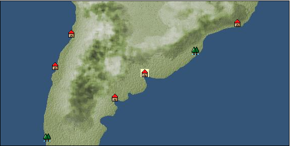

# Port: ブエノスアイレス

import Tabs from '@theme/Tabs';
import TabItem from '@theme/TabItem';

## General Information

| Attribute | Details |
| :--- | :--- |
| **Port Name** | buenos aires |
| **Port Type** | port of alliance |
| **Region** | South America |
| **Sea Area** | Off the coast of Buenos Aires |
| **Required Language** | spanish |
| **Coordinates** | （13723，6109） |
| **Investment Reward** | [Land battle props/cooking book](docs/Items/RecipeBooks/item_1833.md) （必要投資額：500,000ドゥカード） |

### Available Facilities

| guild | intermediary | exchange | tool shop | workshop craftsman | Painter | sculptor | peddler |
| --- | --- | --- | --- | --- | --- | --- | --- |
|   |   | ○ | ○ |   |   |   |   |
| Shipyard Master | Lumbermaker | Sail-maker | weapon craftsman | master | TavernFemale | archive | salesperson |
| --- | --- | --- | --- | --- | --- | --- | --- |
|   |   |   |   | ○ |   |   |   |
| Shipwright | 銀行 | street worker | 王宮 | Trading post | church | suburbs | translator |
| --- | --- | --- | --- | --- | --- | --- | --- |
| ○ | ○ | ○ |   |   |   |   |   |

### Description
The name of the town means "good air". The city is located on the east coast of South America, at the mouth of the La Plata River, in a vast and fertile plain. It has four seasons. The Witians live here. Cultural area: East coast of Central and South America

<Tabs>
  <TabItem value="trade_goods_sales" label="Trade Goods Sales">

| item | group | purchase price | 同盟時 | remarks |
| --- | --- | --- | --- | --- |
| [cow](docs/Items/TradeGoods/TradeGoods-Livestock/item_17.md) | [Trading Goods (Livestock)](docs/Categories/category_18.md) | (320) | 280 |  |
| [garlic](docs/Items/TradeGoods/TradeGoods-Spices/item_526.md) | [Trading Goods (Spices)](docs/Categories/category_12.md) | 278 | 244 |  |
| [onion](docs/Items/TradeGoods/TradeGoods-Foodstuffs/item_28.md) | [Trading items (food items)](docs/Categories/category_3.md) | 82 | 72 |  |
| [sheep](docs/Items/TradeGoods/TradeGoods-Livestock/item_253.md) | [Trading Goods (Livestock)](docs/Categories/category_18.md) | (123) | 108 |  |
| [beef](docs/Items/TradeGoods/TradeGoods-Foodstuffs/item_26.md) | [Trading items (food items)](docs/Categories/category_3.md) | (649) | 568 |  |
| [silver](docs/Items/TradeGoods/TradeGoods-Metals/item_136.md) | [Trading products (precious metals)](docs/Categories/category_8.md) | (1,000) | 875 |  |
| 要投資（必要投資額：400,000） |
  </TabItem>
  <TabItem value="sale_specialty" label="Sale (Specialty)">

| item | group | sale price | 同盟時 | remarks |
| --- | --- | --- | --- | --- |

#### [交易品（酒類）](docs/Categories/category_9.md)

| [aquavit](docs/Items/TradeGoods/TradeGoods-Alcohol/item_572.md) | 交易品（酒類） | 1,387 | (1,560) |  |
| [whiskey](docs/Items/TradeGoods/TradeGoods-Alcohol/item_1.md) | 交易品（酒類） | 1,637 | (1,841) |  |
| [fruit brandy](docs/Items/TradeGoods/TradeGoods-Alcohol/item_1440.md) | 交易品（酒類） | 1,195 | (1,344) |  |

#### [Trading Goods (Spices)](docs/Categories/category_11.md)

| [lira](docs/Items/TradeGoods/TradeGoods-Perfume/item_30.md) | Trading Goods (Spices) | 1,286 | (1,446) |  |

#### [Trading Goods (Spices)](docs/Categories/category_12.md)

| [bergamot](docs/Items/TradeGoods/TradeGoods-Spices/item_879.md) | Trading Goods (Spices) | 1,241 | (1,396) |  |

#### [Trading Items (Gemstones)](docs/Categories/category_15.md)

| [amber](docs/Items/TradeGoods/TradeGoods-Gems/item_618.md) | Trading Items (Gemstones) | 4,180 | (4,702) |  |

#### [Trading Items (Firearms)](docs/Categories/category_17.md)

| [musket gun](docs/Items/TradeGoods/TradeGoods-Firearms/item_584.md) | Trading Items (Firearms) | 5,912 | 5,614 |  |

#### [交易品（織物）](docs/Categories/category_20.md)

| [velvet](docs/Items/TradeGoods/TradeGoods-Fabrics/item_902.md) | 交易品（織物） | 6,450 | (7,256) |  |
  </TabItem>
  <TabItem value="sale_no_specialty" label="Sale (No Specialty)">

| item | group | sale price | 同盟時 | remarks |
| --- | --- | --- | --- | --- |

#### [交易品（繊維）](docs/Categories/category_1.md)

| [numb](docs/Items/TradeGoods/TradeGoods-Fibers/item_900.md) | 交易品（繊維） | 12 | (13) |  |

#### [Trading Goods (Dye)](docs/Categories/category_2.md)

| [Gerep](docs/Items/TradeGoods/TradeGoods-Dye/item_1814.md) | Trading Goods (Dye) | (500) | 583 |  |

#### [Trading items (food items)](docs/Categories/category_3.md)

| [sugar cane](docs/Items/TradeGoods/TradeGoods-Foodstuffs/item_93.md) | Trading items (food items) | (228) | 265 |  |
| [Jambu](docs/Items/TradeGoods/TradeGoods-Foodstuffs/item_1827.md) | Trading items (food items) | 179 | (201) |  |
| [sausage](docs/Items/TradeGoods/TradeGoods-Foodstuffs/item_27.md) | Trading items (food items) | 569 | (640) |  |
| [corn](docs/Items/TradeGoods/TradeGoods-Foodstuffs/item_138.md) | Trading items (food items) | 60 | (67) |  |
| [milk](docs/Items/TradeGoods/TradeGoods-Foodstuffs/item_254.md) | Trading items (food items) | 148 | (166) |  |
| [mutton](docs/Items/TradeGoods/TradeGoods-Foodstuffs/item_33.md) | Trading items (food items) | 555 | (624) |  |

#### [交易品（調味料）](docs/Categories/category_4.md)

| [sugar](docs/Items/TradeGoods/TradeGoods-Seasonings/item_94.md) | 交易品（調味料） | (866) | 1,010 |  |

#### [Trading products (medical products)](docs/Categories/category_6.md)

| [rose hips](docs/Items/TradeGoods/TradeGoods-Medicine/item_904.md) | Trading products (medical products) | 418 | (470) |  |

#### [Trading products (precious metals)](docs/Categories/category_8.md)

| [gold](docs/Items/TradeGoods/TradeGoods-Metals/item_659.md) | Trading products (precious metals) | (2,364) | 2,758 |  |

#### [交易品（酒類）](docs/Categories/category_9.md)

| [rum](docs/Items/TradeGoods/TradeGoods-Alcohol/item_139.md) | 交易品（酒類） | 592 | (666) |  |

#### [Trading goods (hobby goods)](docs/Categories/category_10.md)

| [coffee](docs/Items/TradeGoods/TradeGoods-Sunddries/item_445.md) | Trading goods (hobby goods) | (468) | 545 |  |
| [Yerba mate tea](docs/Items/TradeGoods/TradeGoods-Sunddries/item_1808.md) | Trading goods (hobby goods) | 290 | (326) |  |

#### [Trading Items (Gemstones)](docs/Categories/category_15.md)

| [topaz](docs/Items/TradeGoods/TradeGoods-Gems/item_1097.md) | Trading Items (Gemstones) | 1,990 | (2,238) |  |
| [ivory](docs/Items/TradeGoods/TradeGoods-Gems/item_699.md) | Trading Items (Gemstones) | 2,192 | (2,466) |  |

#### [Trading Items (Arms)](docs/Categories/category_16.md)

| [dagger](docs/Items/TradeGoods/TradeGoods-Weapons/item_143.md) | Trading Items (Arms) | 943 | (1,060) |  |

#### [交易品（工業品）](docs/Categories/category_19.md)

| [wood](docs/Items/TradeGoods/TradeGoods-Wares/item_277.md) | 交易品（工業品） | 785 | (883) |  |
| [iron material](docs/Items/TradeGoods/TradeGoods-Wares/item_268.md) | 交易品（工業品） | (700) | 816 |  |

#### [交易品（織物）](docs/Categories/category_20.md)

| [cotton fabric](docs/Items/TradeGoods/TradeGoods-Fabrics/item_571.md) | 交易品（織物） | (1,032) | 1,204 |  |
  </TabItem>
  <TabItem value="guild_&_others" label="Guild & Others">

| item | group | Sales price | Handling NPC | remarks |
| --- | --- | --- | --- | --- |

#### Diaz de Solis

| [Throwing technique](docs/Skills/Skill-Adventure/item_1729.md) | [Skill (adventure)](docs/Categories/category_39.md) | 200,000 | Diaz de Solis |  |
| [Oceanian languages](docs/Skills/Skills-Language/item_2277.md) | [Skills (language)](docs/Categories/category_42.md) | 1,000,000 | Diaz de Solis |  |
  </TabItem>
  <TabItem value="toolman" label="Toolman">

| item | group | Sales price | Handling NPC | remarks |
| --- | --- | --- | --- | --- |

#### [Equipment (body)](docs/Categories/category_24.md)

| [Surcoat](docs/Items/Equipment/Equipment-Body/item_131.md) | Equipment (body) | 30,000 | tool shop owner |  |

#### [Equipment (legs)](docs/Categories/category_26.md)

| [boots](docs/Items/Equipment/Equipment-Feet/item_365.md) | Equipment (legs) | 100 | tool shop owner |  |

#### [Equipment (belongings)](docs/Categories/category_27.md)

| [long sword](docs/Items/Equipment/Equipment-Weapon/item_302.md) | Equipment (belongings) | 15,400 | tool shop owner |  |

#### [Consumables (land battle/deck battle)](docs/Categories/category_29.md)

| [Taheebo juice](docs/Items/Consumables/Consumables-Landbattle/item_1807.md) | Consumables (land battle/deck battle) | 300 | tool shop owner |  |
| [taheebo bottle](docs/Items/Consumables/Consumables-Landbattle/item_1823.md) | Consumables (land battle/deck battle) | 600 | tool shop owner |  |
| 要投資（必要投資額：120,000） |
| [tonic](docs/Items/Consumables/Consumables-Landbattle/item_1678.md) | Consumables (land battle/deck battle) | 300 | tool shop owner |  |
| [torch for throwing](docs/Items/Consumables/Consumables-Landbattle/item_313.md) | Consumables (land battle/deck battle) | 150 | tool shop owner |  |
  </TabItem>
  <TabItem value="shipyard" label="Shipyard">

### Shipwright

| item | group | Sales price | Handling NPC | remarks |
| --- | --- | --- | --- | --- |

#### [recipe book](docs/Categories/category_22.md)

| [Shipbuilding materials and processed wood](docs/Items/RecipeBooks/item_1774.md) | recipe book | Fixed recipe | Shipwright |  |

#### [shipbuilding materials](docs/Categories/category_47.md)

| [processed wood](docs/Items/ShipbuildingFS/item_1695.md) | shipbuilding materials | Fixed recipe | Shipwright |  |
  </TabItem>
</Tabs>