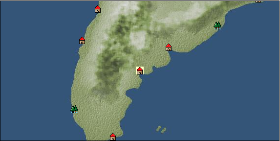

# Port: サンアントニオ

import Tabs from '@theme/Tabs';
import TabItem from '@theme/TabItem';

## General Information

| Attribute | Details |
| :--- | :--- |
| **Port Name** | san antonio |
| **Port Type** | port of alliance |
| **Region** | South America |
| **Sea Area** | Off the coast of Buenos Aires |
| **Required Language** | spanish |
| **Coordinates** | （13487，6302） |
| **Investment Reward** | [Firearm modification law](docs/Items/RecipeBooks/item_1836.md) （必要投資額：1,000,000ドゥカード） |

### Available Facilities

| guild | intermediary | exchange | tool shop | workshop craftsman | Painter | sculptor | peddler |
| --- | --- | --- | --- | --- | --- | --- | --- |
|   |   | ○ | ○ |   |   |   |   |
| Shipyard Master | Lumbermaker | Sail-maker | weapon craftsman | master | TavernFemale | archive | salesperson |
| --- | --- | --- | --- | --- | --- | --- | --- |
|   |   |   |   |   |   |   |   |
| Shipwright | 銀行 | street worker | 王宮 | Trading post | church | suburbs | translator |
| --- | --- | --- | --- | --- | --- | --- | --- |
| ○ | ○ | ○ |   |   |   |   |   |

### Description
A warm port town located in San Matias Bay, south of Buenos Aires, on the east coast of South America. Further south is the arid region of Patagonia. Cultural area: East coast of Central and South America

<Tabs>
  <TabItem value="trade_goods_sales" label="Trade Goods Sales">

| item | group | purchase price | 同盟時 | remarks |
| --- | --- | --- | --- | --- |
| [cow](docs/Items/TradeGoods/TradeGoods-Livestock/item_17.md) | [Trading Goods (Livestock)](docs/Categories/category_18.md) | 319 | 280 |  |
| [corn](docs/Items/TradeGoods/TradeGoods-Foodstuffs/item_138.md) | [Trading items (food items)](docs/Categories/category_3.md) | 55 | 48 |  |
| [Yerba mate tea](docs/Items/TradeGoods/TradeGoods-Sunddries/item_1808.md) | [Trading goods (hobby goods)](docs/Categories/category_10.md) | 265 | 232 |  |
| [beef](docs/Items/TradeGoods/TradeGoods-Foodstuffs/item_26.md) | [Trading items (food items)](docs/Categories/category_3.md) | 647 | 568 |  |
| [silver](docs/Items/TradeGoods/TradeGoods-Metals/item_136.md) | [Trading products (precious metals)](docs/Categories/category_8.md) | 1,000 | (875) |  |
| 要投資（必要投資額：400,000） |
  </TabItem>
  <TabItem value="sale_specialty" label="Sale (Specialty)">

| item | group | sale price | 同盟時 | remarks |
| --- | --- | --- | --- | --- |

#### [交易品（繊維）](docs/Categories/category_1.md)

| [flax](docs/Items/TradeGoods/TradeGoods-Fibers/item_64.md) | 交易品（繊維） | (382) | 445 |  |
| [feather](docs/Items/TradeGoods/TradeGoods-Fibers/item_585.md) | 交易品（繊維） | (1,049) | 1,223 |  |
| [Green ramie](docs/Items/TradeGoods/TradeGoods-Fibers/item_3428.md) | 交易品（繊維） | 21,750 | (24,471) |  |
| [deerskin](docs/Items/TradeGoods/TradeGoods-Fibers/item_3648.md) | 交易品（繊維） | 20,834 | (23,440) |  |

#### [Trading items (food items)](docs/Categories/category_3.md)

| [kangaroo meat](docs/Items/TradeGoods/TradeGoods-Foodstuffs/item_2285.md) | Trading items (food items) | 785 | (883) |  |

#### [交易品（酒類）](docs/Categories/category_9.md)

| [aquavit](docs/Items/TradeGoods/TradeGoods-Alcohol/item_572.md) | 交易品（酒類） | (1,414) | 1,649 |  |
| [whiskey](docs/Items/TradeGoods/TradeGoods-Alcohol/item_1.md) | 交易品（酒類） | (1,463) | 1,706 |  |
| [sherry](docs/Items/TradeGoods/TradeGoods-Alcohol/item_844.md) | 交易品（酒類） | (685) | 799 |  |
| [gin](docs/Items/TradeGoods/TradeGoods-Alcohol/item_291.md) | 交易品（酒類） | (1,439) | 1,678 |  |
| [fruit brandy](docs/Items/TradeGoods/TradeGoods-Alcohol/item_1440.md) | 交易品（酒類） | (1,095) | 1,277 |  |
| [Taiwan rice wine](docs/Items/TradeGoods/TradeGoods-Alcohol/item_3672.md) | 交易品（酒類） | 20,117 | (22,633) |  |
| [Sake](docs/Items/TradeGoods/TradeGoods-Alcohol/item_3424.md) | 交易品（酒類） | 20,561 | (23,133) |  |

#### [Trading goods (hobby goods)](docs/Categories/category_10.md)

| [Aigyoku](docs/Items/TradeGoods/TradeGoods-Sunddries/item_3677.md) | Trading goods (hobby goods) | 20,488 | (23,051) |  |
| [dried apple](docs/Items/TradeGoods/TradeGoods-Sunddries/item_19.md) | Trading goods (hobby goods) | (712) | 830 |  |

#### [Trading Goods (Spices)](docs/Categories/category_11.md)

| [lira](docs/Items/TradeGoods/TradeGoods-Perfume/item_30.md) | Trading Goods (Spices) | (1,436) | 1,675 |  |

#### [Trading Goods (Spices)](docs/Categories/category_12.md)

| [saffron](docs/Items/TradeGoods/TradeGoods-Spices/item_845.md) | Trading Goods (Spices) | (4,612) | 5,381 |  |
| [nutmeg](docs/Items/TradeGoods/TradeGoods-Spices/item_1969.md) | Trading Goods (Spices) | (4,393) | 5,125 |  |
| [mace](docs/Items/TradeGoods/TradeGoods-Spices/item_2100.md) | Trading Goods (Spices) | (4,832) | 5,638 |  |

#### [交易品（美術品）](docs/Categories/category_14.md)

| [taiwan wood carving](docs/Items/TradeGoods/TradeGoods-Art/item_3697.md) | 交易品（美術品） | 20,125 | (22,642) |  |

#### [Trading Items (Firearms)](docs/Categories/category_17.md)

| [musket gun](docs/Items/TradeGoods/TradeGoods-Firearms/item_584.md) | Trading Items (Firearms) | (5,208) | 6,076 |  |

#### [交易品（織物）](docs/Categories/category_20.md)

| [flannel](docs/Items/TradeGoods/TradeGoods-Fabrics/item_149.md) | 交易品（織物） | (2,021) | 2,358 |  |
| [velvet](docs/Items/TradeGoods/TradeGoods-Fabrics/item_902.md) | 交易品（織物） | (5,274) | 6,154 |  |
  </TabItem>
  <TabItem value="sale_no_specialty" label="Sale (No Specialty)">

| item | group | sale price | 同盟時 | remarks |
| --- | --- | --- | --- | --- |

#### [交易品（繊維）](docs/Categories/category_1.md)

| [leather](docs/Items/TradeGoods/TradeGoods-Fibers/item_44.md) | 交易品（繊維） | 517 | (581) |  |
| [cotton](docs/Items/TradeGoods/TradeGoods-Fibers/item_610.md) | 交易品（繊維） | (478) | 557 |  |

#### [Trading items (food items)](docs/Categories/category_3.md)

| [sugar cane](docs/Items/TradeGoods/TradeGoods-Foodstuffs/item_93.md) | Trading items (food items) | 259 | (291) |  |
| [potato](docs/Items/TradeGoods/TradeGoods-Foodstuffs/item_106.md) | Trading items (food items) | 145 | (163) |  |
| [cheese](docs/Items/TradeGoods/TradeGoods-Foodstuffs/item_20.md) | Trading items (food items) | 614 | (690) |  |
| [ham](docs/Items/TradeGoods/TradeGoods-Foodstuffs/item_290.md) | Trading items (food items) | 683 | (768) |  |
| [milk](docs/Items/TradeGoods/TradeGoods-Foodstuffs/item_254.md) | Trading items (food items) | 147 | (165) |  |

#### [交易品（調味料）](docs/Categories/category_4.md)

| [anchovies](docs/Items/TradeGoods/TradeGoods-Seasonings/item_3004.md) | 交易品（調味料） | 161 | (181) |  |
| [coconut vinegar](docs/Items/TradeGoods/TradeGoods-Seasonings/item_1988.md) | 交易品（調味料） | 499 | (561) |  |
| [butter](docs/Items/TradeGoods/TradeGoods-Seasonings/item_3.md) | 交易品（調味料） | 362 | (407) |  |
| [salt](docs/Items/TradeGoods/TradeGoods-Seasonings/item_42.md) | 交易品（調味料） | 265 | (298) |  |
| [sugar](docs/Items/TradeGoods/TradeGoods-Seasonings/item_94.md) | 交易品（調味料） | 986 | (1,109) |  |

#### [Trading Items (Iron Stone)](docs/Categories/category_7.md)

| [copper ore](docs/Items/TradeGoods/TradeGoods-Minerals/item_65.md) | Trading Items (Iron Stone) | 913 | (1,027) |  |

#### [交易品（酒類）](docs/Categories/category_9.md)

| [brandy](docs/Items/TradeGoods/TradeGoods-Alcohol/item_9.md) | 交易品（酒類） | (1,350) | 1,575 |  |
| [rum](docs/Items/TradeGoods/TradeGoods-Alcohol/item_139.md) | 交易品（酒類） | (535) | 624 |  |
| [wine](docs/Items/TradeGoods/TradeGoods-Alcohol/item_11.md) | 交易品（酒類） | (542) | 632 |  |

#### [Trading goods (hobby goods)](docs/Categories/category_10.md)

| [raisins](docs/Items/TradeGoods/TradeGoods-Sunddries/item_35.md) | Trading goods (hobby goods) | (350) | 408 |  |

#### [Trading Goods (Spices)](docs/Categories/category_11.md)

| [rose](docs/Items/TradeGoods/TradeGoods-Perfume/item_536.md) | Trading Goods (Spices) | 3,823 | (4,301) |  |
| [Ryushu incense](docs/Items/TradeGoods/TradeGoods-Perfume/item_101.md) | Trading Goods (Spices) | (2,379) | 2,775 |  |

#### [Trading Goods (Spices)](docs/Categories/category_12.md)

| [vanilla](docs/Items/TradeGoods/TradeGoods-Spices/item_1810.md) | Trading Goods (Spices) | 409 | (460) |  |

#### [Trading goods (artificial goods)](docs/Categories/category_13.md)

| [silversmith](docs/Items/TradeGoods/TradeGoods-Luxuries/item_619.md) | Trading goods (artificial goods) | 2,354 | (2,648) |  |

#### [Trading Items (Gemstones)](docs/Categories/category_15.md)

| [coral](docs/Items/TradeGoods/TradeGoods-Gems/item_141.md) | Trading Items (Gemstones) | (2,754) | 3,213 |  |
| [ivory](docs/Items/TradeGoods/TradeGoods-Gems/item_699.md) | Trading Items (Gemstones) | 2,192 | (2,466) |  |

#### [Trading Items (Arms)](docs/Categories/category_16.md)

| [dagger](docs/Items/TradeGoods/TradeGoods-Weapons/item_143.md) | Trading Items (Arms) | 932 | (1,048) |  |

#### [Trading Items (Firearms)](docs/Categories/category_17.md)

| [大砲](docs/Items/TradeGoods/TradeGoods-Firearms/item_4.md) | Trading Items (Firearms) | 5,270 | (5,929) |  |
| [cannonball](docs/Items/TradeGoods/TradeGoods-Firearms/item_144.md) | Trading Items (Firearms) | 1,710 | (1,923) |  |

#### [Trading Goods (Livestock)](docs/Categories/category_18.md)

| [cow](docs/Items/TradeGoods/TradeGoods-Livestock/item_17.md) | Trading Goods (Livestock) | (120) | 140 |  |
| [rat](docs/Items/TradeGoods/TradeGoods-Livestock/item_2710.md) | Trading Goods (Livestock) | 18 | (20) |  |

#### [交易品（織物）](docs/Categories/category_20.md)

| [Awaiyo](docs/Items/TradeGoods/TradeGoods-Fabrics/item_3002.md) | 交易品（織物） | 2,141 | (2,408) |  |
| [cotton fabric](docs/Items/TradeGoods/TradeGoods-Fabrics/item_571.md) | 交易品（織物） | (1,076) | 1,255 |  |
  </TabItem>
  <TabItem value="guild_&_others" label="Guild & Others">

| item | group | Sales price | Handling NPC | remarks |
| --- | --- | --- | --- | --- |
| There is no sales information for the item |
| --- |
  </TabItem>
  <TabItem value="toolman" label="Toolman">

| item | group | Sales price | Handling NPC | remarks |
| --- | --- | --- | --- | --- |

#### [Equipment (body)](docs/Categories/category_24.md)

| [Surcoat](docs/Items/Equipment/Equipment-Body/item_131.md) | Equipment (body) | 30,000 | tool shop owner |  |

#### [Equipment (legs)](docs/Categories/category_26.md)

| [boots](docs/Items/Equipment/Equipment-Feet/item_365.md) | Equipment (legs) | 100 | tool shop owner |  |

#### [Equipment (belongings)](docs/Categories/category_27.md)

| [long sword](docs/Items/Equipment/Equipment-Weapon/item_302.md) | Equipment (belongings) | 15,400 | tool shop owner |  |

#### [Consumables (land battle/deck battle)](docs/Categories/category_29.md)

| [Taheebo juice](docs/Items/Consumables/Consumables-Landbattle/item_1807.md) | Consumables (land battle/deck battle) | 300 | tool shop owner |  |
| [taheebo bottle](docs/Items/Consumables/Consumables-Landbattle/item_1823.md) | Consumables (land battle/deck battle) | 600 | tool shop owner |  |
| 要投資（必要投資額：120,000） |
| [tonic](docs/Items/Consumables/Consumables-Landbattle/item_1678.md) | Consumables (land battle/deck battle) | 300 | tool shop owner |  |
| [torch for throwing](docs/Items/Consumables/Consumables-Landbattle/item_313.md) | Consumables (land battle/deck battle) | 150 | tool shop owner |  |
  </TabItem>
</Tabs>