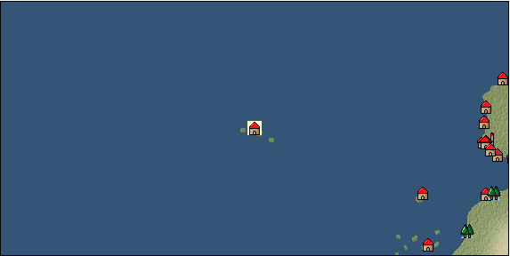

# Port: Azores

import Tabs from '@theme/Tabs';
import TabItem from '@theme/TabItem';

## General Information

| Attribute | Details |
| :--- | :--- |
| **Port Name** | Azores |
| **Port Type** | port of alliance |
| **Region** | western europe |
| **Sea Area** | North Atlantic |
| **Required Language** | portuguese |
| **Coordinates** | （14732，3148） |
| **Investment Reward** | [Lot (NO.1)](docs/Items/Consumables/Consumables-Treasure-Chests/item_2800.md) （必要投資額：500,000ドゥカード） |

### Available Facilities

| guild | intermediary | exchange | tool shop | workshop craftsman | Painter | sculptor | peddler |
| --- | --- | --- | --- | --- | --- | --- | --- |
|   |   | ○ | ○ |   |   |   |   |
| Shipyard Master | Lumbermaker | Sail-maker | weapon craftsman | master | TavernFemale | archive | salesperson |
| --- | --- | --- | --- | --- | --- | --- | --- |
|   |   |   |   | ○ |   |   |   |
| Shipwright | 銀行 | street worker | 王宮 | Trading post | church | suburbs | translator |
| --- | --- | --- | --- | --- | --- | --- | --- |
| ○ | ○ | ○ |   |   |   |   |   |

### Description
A city on a volcanic island located in the middle of the Atlantic Ocean. Since it was discovered by Portugal in the first half of the 15th century, many European powers have immigrated to the island. It serves as a stepping stone on a long-sea voyage to the New World. There was no shopkeeper at the trading post, just the shopkeeper's daughter, but after the 2006.12.6 update, it became possible to buy and sell trade goods. In addition, it was changed to an alliance port in the 2nd AGE update. Cultural area: Atlantic Ocean (Iberian specialties are treated as specialties)

<Tabs>
  <TabItem value="trade_goods_sales" label="Trade Goods Sales">

| Item | Group | Purchase Price | Allied Price | Remarks |
| --- | --- | --- | --- | --- |
| [cow](docs/Items/TradeGoods/TradeGoods-Livestock/item_17.md) | [Trading Goods (Livestock)](docs/Categories/category_18.md) | (320) | 280 |  |
| [wine](docs/Items/TradeGoods/TradeGoods-Alcohol/item_11.md) | [交易品（酒類）](docs/Categories/category_9.md) | (429) | 376 |  |
| [log](docs/Items/TradeGoods/TradeGoods-Wares/item_846.md) | [交易品（工業品）](docs/Categories/category_19.md) | 340 | 304 |  |
| [wheat](docs/Items/TradeGoods/TradeGoods-Foodstuffs/item_16.md) | [Trading items (food items)](docs/Categories/category_3.md) | 45 | 40 |  |
| [魚肉](docs/Items/TradeGoods/TradeGoods-Foodstuffs/item_10.md) | [Trading items (food items)](docs/Categories/category_3.md) | 146 | 128 |  |
  </TabItem>
  <TabItem value="sale_specialty" label="Sale (Specialty)">

| Item | Group | sale price | Allied Price | Remarks |
| --- | --- | --- | --- | --- |

#### [交易品（繊維）](docs/Categories/category_1.md)

| [deerskin](docs/Items/TradeGoods/TradeGoods-Fibers/item_3648.md) | 交易品（繊維） | (16,877) | 19,693 |  |

#### [交易品（調味料）](docs/Categories/category_4.md)

| [apple cider vinegar](docs/Items/TradeGoods/TradeGoods-Seasonings/item_882.md) | 交易品（調味料） | 480 | (540) |  |

#### [交易品（酒類）](docs/Categories/category_9.md)

| [aquavit](docs/Items/TradeGoods/TradeGoods-Alcohol/item_572.md) | 交易品（酒類） | 748 | 797 |  |
| [whiskey](docs/Items/TradeGoods/TradeGoods-Alcohol/item_1.md) | 交易品（酒類） | 823 | 922 |  |
| [sherry](docs/Items/TradeGoods/TradeGoods-Alcohol/item_844.md) | 交易品（酒類） | (462) | 538 |  |
| [tequila](docs/Items/TradeGoods/TradeGoods-Alcohol/item_108.md) | 交易品（酒類） | 1,712 | 1,909 |  |
| [fruit brandy](docs/Items/TradeGoods/TradeGoods-Alcohol/item_1440.md) | 交易品（酒類） | 747 | (840) |  |
| ●Special products from northern France |

#### [Trading goods (hobby goods)](docs/Categories/category_10.md)

| [cacao](docs/Items/TradeGoods/TradeGoods-Sunddries/item_140.md) | Trading goods (hobby goods) | 1,206 | 1,307 |  |
| ●Caribbean specialties |
| [tobacco](docs/Items/TradeGoods/TradeGoods-Sunddries/item_109.md) | Trading goods (hobby goods) | 1,256 | 1,323 |  |
| [chicle](docs/Items/TradeGoods/TradeGoods-Sunddries/item_4083.md) | Trading goods (hobby goods) | 1,146 | (1,289) |  |
| ●Caribbean specialties |
| [peanuts](docs/Items/TradeGoods/TradeGoods-Sunddries/item_134.md) | Trading goods (hobby goods) | (348) | 405 |  |

#### [Trading Goods (Spices)](docs/Categories/category_11.md)

| [lira](docs/Items/TradeGoods/TradeGoods-Perfume/item_30.md) | Trading Goods (Spices) | 914 | (1,028) |  |
| ●Special products from northern France |

#### [Trading Goods (Spices)](docs/Categories/category_12.md)

| [allspice](docs/Items/TradeGoods/TradeGoods-Spices/item_1848.md) | Trading Goods (Spices) | 1,560 | (1,755) |  |
| ●Special products from the east coast of Central and South America |
| [cloves](docs/Items/TradeGoods/TradeGoods-Spices/item_1092.md) | Trading Goods (Spices) | (11,195) | 13,062 |  |
| [pepper](docs/Items/TradeGoods/TradeGoods-Spices/item_58.md) | Trading Goods (Spices) | (4,908) | 5,726 |  |
| [nutmeg](docs/Items/TradeGoods/TradeGoods-Spices/item_1969.md) | Trading Goods (Spices) | (11,768) | 13,731 |  |
| [mace](docs/Items/TradeGoods/TradeGoods-Spices/item_2100.md) | Trading Goods (Spices) | (12,106) | 14,125 |  |

#### [Trading goods (artificial goods)](docs/Categories/category_13.md)

| [Darla Hest](docs/Items/TradeGoods/TradeGoods-Luxuries/item_6190.md) | Trading goods (artificial goods) | (3,746) | 4,370 |  |
| [Kuresute](docs/Items/TradeGoods/TradeGoods-Luxuries/item_3897.md) | Trading goods (artificial goods) | 3,904 | 4,160 |  |
| [湖筆](docs/Items/TradeGoods/TradeGoods-Luxuries/item_3898.md) | Trading goods (artificial goods) | 4,175 | (4,697) |  |

#### [Trading Items (Gemstones)](docs/Categories/category_15.md)

| [opal](docs/Items/TradeGoods/TradeGoods-Gems/item_2006.md) | Trading Items (Gemstones) | 6,218 | 6,623 |  |
| ●Special products from the east coast of Central and South America |
| [tourmaline](docs/Items/TradeGoods/TradeGoods-Gems/item_4092.md) | Trading Items (Gemstones) | 5,552 | (6,246) |  |

#### [Trading Items (Arms)](docs/Categories/category_16.md)

| [Japanese sword](docs/Items/TradeGoods/TradeGoods-Weapons/item_3437.md) | Trading Items (Arms) | (16,044) | 18,721 |  |
| [western armor](docs/Items/TradeGoods/TradeGoods-Weapons/item_6.md) | Trading Items (Arms) | 3,102 | (3,490) |  |
| ●Special products of the British Isles |

#### [Trading Items (Firearms)](docs/Categories/category_17.md)

| [musket gun](docs/Items/TradeGoods/TradeGoods-Firearms/item_584.md) | Trading Items (Firearms) | 3,035 | (3,414) |  |

#### [交易品（織物）](docs/Categories/category_20.md)

| [Bingata](docs/Items/TradeGoods/TradeGoods-Fabrics/item_3479.md) | 交易品（織物） | 16,595 | (18,671) |  |
  </TabItem>
  <TabItem value="sale_no_specialty" label="Sale (No Specialty)">

| Item | Group | sale price | Allied Price | Remarks |
| --- | --- | --- | --- | --- |

#### [交易品（繊維）](docs/Categories/category_1.md)

| [fur](docs/Items/TradeGoods/TradeGoods-Fibers/item_634.md) | 交易品（繊維） | 2,304 | (2,592) |  |
| [cotton](docs/Items/TradeGoods/TradeGoods-Fibers/item_610.md) | 交易品（繊維） | (528) | 616 |  |
| [numb](docs/Items/TradeGoods/TradeGoods-Fibers/item_900.md) | 交易品（繊維） | 12 | (13) |  |

#### [Trading items (food items)](docs/Categories/category_3.md)

| [sugar cane](docs/Items/TradeGoods/TradeGoods-Foodstuffs/item_93.md) | Trading items (food items) | (204) | 238 |  |
| [corn](docs/Items/TradeGoods/TradeGoods-Foodstuffs/item_138.md) | Trading items (food items) | 200 | (225) |  |
| [tomato](docs/Items/TradeGoods/TradeGoods-Foodstuffs/item_1809.md) | Trading items (food items) | 248 | (279) |  |
| [carrot](docs/Items/TradeGoods/TradeGoods-Foodstuffs/item_2708.md) | Trading items (food items) | 103 | (115) |  |
| [european crayfish](docs/Items/TradeGoods/TradeGoods-Foodstuffs/item_6188.md) | Trading items (food items) | (4,183) | 4,880 |  |
| [milk](docs/Items/TradeGoods/TradeGoods-Foodstuffs/item_254.md) | Trading items (food items) | 148 | (166) |  |
| [beef](docs/Items/TradeGoods/TradeGoods-Foodstuffs/item_26.md) | Trading items (food items) | 592 | (666) |  |

#### [交易品（調味料）](docs/Categories/category_4.md)

| [almond oil](docs/Items/TradeGoods/TradeGoods-Seasonings/item_578.md) | 交易品（調味料） | 625 | 672 |  |
| [coconut vinegar](docs/Items/TradeGoods/TradeGoods-Seasonings/item_1988.md) | 交易品（調味料） | 518 | (582) |  |
| [butter](docs/Items/TradeGoods/TradeGoods-Seasonings/item_3.md) | 交易品（調味料） | 359 | (403) |  |
| [wine vinegar](docs/Items/TradeGoods/TradeGoods-Seasonings/item_429.md) | 交易品（調味料） | 544 | 579 |  |
| [salt](docs/Items/TradeGoods/TradeGoods-Seasonings/item_42.md) | 交易品（調味料） | 258 | (290) |  |
| [sugar](docs/Items/TradeGoods/TradeGoods-Seasonings/item_94.md) | 交易品（調味料） | 860 | 932 |  |
| [Honey](docs/Items/TradeGoods/TradeGoods-Seasonings/item_49.md) | 交易品（調味料） | 956 | (1,075) |  |

#### [交易品（雑貨）](docs/Categories/category_5.md)

| [Western books](docs/Items/TradeGoods/TradeGoods-Misc/item_293.md) | 交易品（雑貨） | 709 | (797) |  |

#### [Trading products (medical products)](docs/Categories/category_6.md)

| [nettle](docs/Items/TradeGoods/TradeGoods-Medicine/item_6189.md) | Trading products (medical products) | (632) | 737 |  |

#### [Trading Items (Iron Stone)](docs/Categories/category_7.md)

| [iron ore](docs/Items/TradeGoods/TradeGoods-Minerals/item_146.md) | Trading Items (Iron Stone) | (672) | 783 |  |
| [copper ore](docs/Items/TradeGoods/TradeGoods-Minerals/item_65.md) | Trading Items (Iron Stone) | (798) | 931 |  |

#### [Trading products (precious metals)](docs/Categories/category_8.md)

| [gold](docs/Items/TradeGoods/TradeGoods-Metals/item_659.md) | Trading products (precious metals) | (4,043) | 4,717 |  |
| [silver](docs/Items/TradeGoods/TradeGoods-Metals/item_136.md) | Trading products (precious metals) | 1,919 | (2,159) |  |

#### [交易品（酒類）](docs/Categories/category_9.md)

| [gin](docs/Items/TradeGoods/TradeGoods-Alcohol/item_291.md) | 交易品（酒類） | 798 | (897) |  |
| [Beer](docs/Items/TradeGoods/TradeGoods-Alcohol/item_2.md) | 交易品（酒類） | 353 | 384 |  |
| [brandy](docs/Items/TradeGoods/TradeGoods-Alcohol/item_9.md) | 交易品（酒類） | 760 | 760 |  |
| [rum](docs/Items/TradeGoods/TradeGoods-Alcohol/item_139.md) | 交易品（酒類） | 702 | 749 |  |
| [liqueur](docs/Items/TradeGoods/TradeGoods-Alcohol/item_18.md) | 交易品（酒類） | (552) | 643 |  |

#### [Trading goods (hobby goods)](docs/Categories/category_10.md)

| [almond](docs/Items/TradeGoods/TradeGoods-Sunddries/item_367.md) | Trading goods (hobby goods) | (170) | 198 |  |
| [raisins](docs/Items/TradeGoods/TradeGoods-Sunddries/item_35.md) | Trading goods (hobby goods) | (275) | 320 |  |

#### [Trading goods (artificial goods)](docs/Categories/category_13.md)

| [ceramics](docs/Items/TradeGoods/TradeGoods-Luxuries/item_152.md) | Trading goods (artificial goods) | (1,269) | 1,480 |  |

#### [交易品（美術品）](docs/Categories/category_14.md)

| [wooden statue](docs/Items/TradeGoods/TradeGoods-Art/item_95.md) | 交易品（美術品） | 1,226 | 1,291 |  |

#### [Trading Items (Gemstones)](docs/Categories/category_15.md)

| [Agate](docs/Items/TradeGoods/TradeGoods-Gems/item_107.md) | Trading Items (Gemstones) | 4,922 | 5,406 |  |
| [emerald](docs/Items/TradeGoods/TradeGoods-Gems/item_777.md) | Trading Items (Gemstones) | 6,416 | (7,218) |  |
| [garnet](docs/Items/TradeGoods/TradeGoods-Gems/item_1005.md) | Trading Items (Gemstones) | 3,955 | (4,449) |  |
| [peridot](docs/Items/TradeGoods/TradeGoods-Gems/item_1098.md) | Trading Items (Gemstones) | 2,660 | (2,992) |  |
| [crystal](docs/Items/TradeGoods/TradeGoods-Gems/item_893.md) | Trading Items (Gemstones) | 1,667 | (1,875) |  |

#### [Trading Items (Arms)](docs/Categories/category_16.md)

| [dagger](docs/Items/TradeGoods/TradeGoods-Weapons/item_143.md) | Trading Items (Arms) | 886 | 886 |  |

#### [Trading Items (Firearms)](docs/Categories/category_17.md)

| [arquebus gun](docs/Items/TradeGoods/TradeGoods-Firearms/item_14.md) | Trading Items (Firearms) | 1,798 | (2,022) |  |
| [大砲](docs/Items/TradeGoods/TradeGoods-Firearms/item_4.md) | Trading Items (Firearms) | 3,380 | (3,802) |  |
| [cannonball](docs/Items/TradeGoods/TradeGoods-Firearms/item_144.md) | Trading Items (Firearms) | 1,627 | 1,630 |  |

#### [Trading Goods (Livestock)](docs/Categories/category_18.md)

| [chicken](docs/Items/TradeGoods/TradeGoods-Livestock/item_252.md) | Trading Goods (Livestock) | 48 | 55 |  |

#### [交易品（工業品）](docs/Categories/category_19.md)

| [log](docs/Items/TradeGoods/TradeGoods-Wares/item_846.md) | 交易品（工業品） | 130 | (146) |  |
| [wood](docs/Items/TradeGoods/TradeGoods-Wares/item_277.md) | 交易品（工業品） | 751 | 873 |  |
| [Stone](docs/Items/TradeGoods/TradeGoods-Wares/item_276.md) | 交易品（工業品） | 878 | (987) |  |
| [coal](docs/Items/TradeGoods/TradeGoods-Wares/item_359.md) | 交易品（工業品） | (490) | 571 |  |
| [iron material](docs/Items/TradeGoods/TradeGoods-Wares/item_268.md) | 交易品（工業品） | 935 | 936 |  |
| [青銅](docs/Items/TradeGoods/TradeGoods-Wares/item_7.md) | 交易品（工業品） | 1,100 | (1,237) |  |

#### [交易品（織物）](docs/Categories/category_20.md)

| [linen fabric](docs/Items/TradeGoods/TradeGoods-Fabrics/item_135.md) | 交易品（織物） | 468 | (526) |  |
  </TabItem>
  <TabItem value="guild_&_others" label="Guild & Others">

| Item | Group | Sales price | Handling NPC | Remarks |
| --- | --- | --- | --- | --- |
| There is no sales information for the Item |
| --- |
  </TabItem>
  <TabItem value="toolman" label="Toolman">

| Item | Group | Sales price | Handling NPC | Remarks |
| --- | --- | --- | --- | --- |

#### [Equipment (body)](docs/Categories/category_24.md)

| [Surcoat](docs/Items/Equipment/Equipment-Body/item_131.md) | Equipment (body) | 30,000 | tool shop owner |  |

#### [Equipment (legs)](docs/Categories/category_26.md)

| [boots](docs/Items/Equipment/Equipment-Feet/item_365.md) | Equipment (legs) | 100 | tool shop owner |  |

#### [Equipment (belongings)](docs/Categories/category_27.md)

| [long sword](docs/Items/Equipment/Equipment-Weapon/item_302.md) | Equipment (belongings) | 15,400 | tool shop owner |  |

#### [Consumables (land battle/deck battle)](docs/Categories/category_29.md)

| [Taheebo juice](docs/Items/Consumables/Consumables-Landbattle/item_1807.md) | Consumables (land battle/deck battle) | 300 | tool shop owner |  |
| [taheebo bottle](docs/Items/Consumables/Consumables-Landbattle/item_1823.md) | Consumables (land battle/deck battle) | 600 | tool shop owner |  |
| 要投資（必要投資額：120,000） |
| [tonic](docs/Items/Consumables/Consumables-Landbattle/item_1678.md) | Consumables (land battle/deck battle) | 300 | tool shop owner |  |
| [torch for throwing](docs/Items/Consumables/Consumables-Landbattle/item_313.md) | Consumables (land battle/deck battle) | 150 | tool shop owner |  |

#### [Consumables (request documents)](docs/Categories/category_45.md)

| [spice purchase order](docs/Items/Consumables/Consumables-Documents/item_4918.md) | Consumables (request documents) | 60,000 | tool shop owner |  |
  </TabItem>
  <TabItem value="shipyard" label="Shipyard">

### Shipwright

| Item | Group | Sales price | Handling NPC | Remarks |
| --- | --- | --- | --- | --- |

#### [recipe book](docs/Categories/category_22.md)

| [Shipbuilding materials/stone processing](docs/Items/RecipeBooks/item_1772.md) | recipe book | Fixed recipe | Shipwright |  |

#### [shipbuilding materials](docs/Categories/category_47.md)

| [lime](docs/Items/ShipbuildingFS/item_1771.md) | shipbuilding materials | Fixed recipe | Shipwright |  |
  </TabItem>
</Tabs>