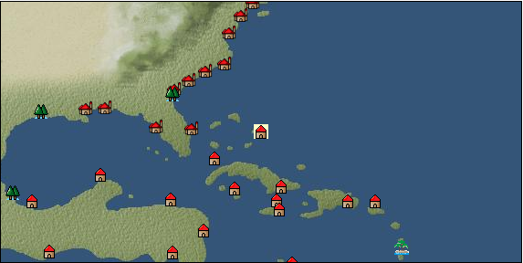

# Port: ナッソー

import Tabs from '@theme/Tabs';
import TabItem from '@theme/TabItem';

## General Information

| Attribute | Details |
| :--- | :--- |
| **Port Name** | nassau |
| **Port Type** | pirate island |
| **Region** | Caribbean/Central America |
| **Sea Area** | Off the coast of the Antilles |
| **Required Language** | dutch |
| **Coordinates** | （13104，3732） |
| **Investment Reward** |  |

### Available Facilities

| guild | intermediary | exchange | tool shop | workshop craftsman | Painter | sculptor | peddler |
| --- | --- | --- | --- | --- | --- | --- | --- |
|   |   | ○ | ○ | ○ |   |   | ○ |
| Shipyard Master | Lumbermaker | Sail-maker | weapon craftsman | master | TavernFemale | archive | salesperson |
| --- | --- | --- | --- | --- | --- | --- | --- |
| ○ |   |   |   | ○ |   |   |   |
| Shipwright | 銀行 | street worker | 王宮 | Trading post | church | suburbs | translator |
| --- | --- | --- | --- | --- | --- | --- | --- |
| ○ | ○ |   |   |   |   |   |   |

### Description
A city on New Providence Island in the northern West Indies, south of the Florida peninsula. They are called the West Indies because they were discovered during the voyage of Cristóbal Colon at the end of the 15th century, but were mistaken for India. Pirate Island: Requires a certain amount of notoriety or 1M bribe to enter the port. Specialty region: Caribbean

<Tabs>
  <TabItem value="trade_goods_sales" label="Trade Goods Sales">

| item | group | purchase price | 同盟時 | remarks |
| --- | --- | --- | --- | --- |
| [tequila](Items/Trade Goods/TradeGoods-Alcohol/item_108.md) | [交易品（酒類）](Categories/category_9.md) | 749 | (656) |  |
| [Beer](Items/Trade Goods/TradeGoods-Alcohol/item_2.md) | [交易品（酒類）](Categories/category_9.md) | 268 | (235) |  |
| [rum](Items/Trade Goods/TradeGoods-Alcohol/item_139.md) | [交易品（酒類）](Categories/category_9.md) | 450 | (394) |  |
| [salt](Items/Trade Goods/TradeGoods-Seasonings/item_42.md) | [交易品（調味料）](Categories/category_4.md) | 237 | 208 |  |
| [lapidary work](Items/Trade Goods/TradeGoods-Luxuries/item_153.md) | [Trading goods (artificial goods)](Categories/category_13.md) | 4,346 | (3,803) |  |
| [oil](Items/Trade Goods/TradeGoods-Wares/item_613.md) | [交易品（工業品）](Categories/category_19.md) | 548 | 508 |  |
| [魚肉](Items/Trade Goods/TradeGoods-Foodstuffs/item_10.md) | [Trading items (food items)](Categories/category_3.md) | 146 | 128 |  |
  </TabItem>
  <TabItem value="sale_specialty" label="Sale (Specialty)">

| item | group | sale price | 同盟時 | remarks |
| --- | --- | --- | --- | --- |

#### [Trading products (medical products)](Categories/category_6.md)

| [Nothing](Items/Trade Goods/TradeGoods-Medicine/item_1053.md) | [Trading products (medical products)](Categories/category_6.md) | 1,096 | (1,233) |  |

#### [Trading Goods (Spices)](Categories/category_11.md)

| [lira](Items/Trade Goods/TradeGoods-Perfume/item_30.md) | [Trading Goods (Spices)](Categories/category_11.md) | 1,394 | (1,568) |  |

#### [Trading goods (artificial goods)](Categories/category_13.md)

| [glasswork](Items/Trade Goods/TradeGoods-Luxuries/item_60.md) | [Trading goods (artificial goods)](Categories/category_13.md) | 2,915 | (3,279) |  |

#### [Trading Items (Arms)](Categories/category_16.md)

| [crossbow](Items/Trade Goods/TradeGoods-Weapons/item_537.md) | [Trading Items (Arms)](Categories/category_16.md) | 1,607 | (1,808) |  |

#### [交易品（織物）](Categories/category_20.md)

| [dutch calico](Items/Trade Goods/TradeGoods-Fabrics/item_1435.md) | [交易品（織物）](Categories/category_20.md) | 2,295 | (2,582) |  |
| [turkish rug](Items/Trade Goods/TradeGoods-Fabrics/item_686.md) | [交易品（織物）](Categories/category_20.md) | 7,715 | (8,680) |  |
  </TabItem>
  <TabItem value="sale_no_specialty" label="Sale (No Specialty)">

| item | group | sale price | 同盟時 | remarks |
| --- | --- | --- | --- | --- |

#### [交易品（繊維）](Categories/category_1.md)

| [cotton](Items/Trade Goods/TradeGoods-Fibers/item_610.md) | [交易品（繊維）](Categories/category_1.md) | 688 | (774) |  |

#### [Trading items (food items)](Categories/category_3.md)

| [Jambu](Items/Trade Goods/TradeGoods-Foodstuffs/item_1827.md) | [Trading items (food items)](Categories/category_3.md) | 179 | (201) |  |

#### [交易品（酒類）](Categories/category_9.md)

| [Beer](Items/Trade Goods/TradeGoods-Alcohol/item_2.md) | [交易品（酒類）](Categories/category_9.md) | 415 | (466) |  |

#### [Trading goods (artificial goods)](Categories/category_13.md)

| [silversmith](Items/Trade Goods/TradeGoods-Luxuries/item_619.md) | [Trading goods (artificial goods)](Categories/category_13.md) | 2,547 | (2,865) |  |
| [ceramics](Items/Trade Goods/TradeGoods-Luxuries/item_152.md) | [Trading goods (artificial goods)](Categories/category_13.md) | 1,542 | (1,734) |  |

#### [交易品（美術品）](Categories/category_14.md)

| [古美術品](Items/Trade Goods/TradeGoods-Art/item_51.md) | [交易品（美術品）](Categories/category_14.md) | 3,707 | (4,170) |  |

#### [交易品（織物）](Categories/category_20.md)

| [cotton fabric](Items/Trade Goods/TradeGoods-Fabrics/item_571.md) | [交易品（織物）](Categories/category_20.md) | 1,154 | (1,298) |  |
  </TabItem>
  <TabItem value="guild_&_others" label="Guild & Others">

| item | group | Sales price | Handling NPC | remarks |
| --- | --- | --- | --- | --- |

#### others

| [Custom pirate costume sewing method](Items/Recipe Book/item_6163.md) | [recipe book](Categories/category_22.md) | Fixed recipe |  |  |
| 女海賊 |
| [私掠海賊風衣装縫製法](Items/Recipe Book/item_4485.md) | [recipe book](Categories/category_22.md) | Fixed recipe |  |  |
| [Era fixed] 16th century pirate ship sailor |
| [Ornate ornament sewing method](Items/Recipe Book/item_4512.md) | [recipe book](Categories/category_22.md) | Fixed recipe |  |  |
| 16th century bottom |
  </TabItem>
  <TabItem value="toolman" label="Toolman">

| item | group | Sales price | Handling NPC | remarks |
| --- | --- | --- | --- | --- |

#### [Equipment (body)](Categories/category_24.md)

| [Surcoat](Items/Equipment/Equipment-Body/item_131.md) | [Equipment (body)](Categories/category_24.md) | 30,000 | tool shop owner |  |

#### [Equipment (legs)](Categories/category_26.md)

| [boots](Items/Equipment/Equipment-Feet/item_365.md) | [Equipment (legs)](Categories/category_26.md) | 100 | tool shop owner |  |

#### [Equipment (belongings)](Categories/category_27.md)

| [Executioners](Items/Equipment/Equipment-Weapon/item_2105.md) | [Equipment (belongings)](Categories/category_27.md) | 800,000 | tool shop owner |  |
| [banded ax](Items/Equipment/Equipment-Weapon/item_6162.md) | [Equipment (belongings)](Categories/category_27.md) | 800,000 | tool shop owner |  |
| [Brigand shot](Items/Equipment/Equipment-Weapon/item_6160.md) | [Equipment (belongings)](Categories/category_27.md) | 800,000 | tool shop owner |  |
| [long sword](Items/Equipment/Equipment-Weapon/item_302.md) | [Equipment (belongings)](Categories/category_27.md) | 15,400 | tool shop owner |  |
| [rogue club](Items/Equipment/Equipment-Weapon/item_6161.md) | [Equipment (belongings)](Categories/category_27.md) | 800,000 | tool shop owner |  |

#### [Consumables (land battle/deck battle)](Categories/category_29.md)

| [Taheebo juice](Items/Consumables/Consumables-Landbattle/item_1807.md) | [Consumables (land battle/deck battle)](Categories/category_29.md) | 300 | tool shop owner |  |
| [taheebo bottle](Items/Consumables/Consumables-Landbattle/item_1823.md) | [Consumables (land battle/deck battle)](Categories/category_29.md) | 600 | tool shop owner |  |
| [tonic](Items/Consumables/Consumables-Landbattle/item_1678.md) | [Consumables (land battle/deck battle)](Categories/category_29.md) | 300 | tool shop owner |  |
| [torch for throwing](Items/Consumables/Consumables-Landbattle/item_313.md) | [Consumables (land battle/deck battle)](Categories/category_29.md) | 150 | tool shop owner |  |
  </TabItem>
  <TabItem value="kobo_craftsmen" label="Craftsman">

| item | group | Sales price | Handling NPC | remarks |
| --- | --- | --- | --- | --- |

#### [Consumables (condition recovery)](Categories/category_21.md)

| [Nostalgic carillon bell](Items/Consumables/Consumables-Recovery/item_245.md) | [Consumables (condition recovery)](Categories/category_21.md) | 200 | workshop craftsman |  |
| [Ship song sheet music](Items/Consumables/Consumables-Recovery/item_247.md) | [Consumables (condition recovery)](Categories/category_21.md) | 200 | workshop craftsman |  |

#### [recipe book](Categories/category_22.md)

| [How to dye pirate clothes](Items/Recipe Book/item_2536.md) | [recipe book](Categories/category_22.md) | Fixed recipe | workshop craftsman |  |

#### [Consumables (other)](Categories/category_44.md)

| [帆塗料](Items/Consumables/Consumables-Other/item_348.md) | [Consumables (other)](Categories/category_44.md) | 500 | workshop craftsman |  |
| [ship paint](Items/Consumables/Consumables-Other/item_347.md) | [Consumables (other)](Categories/category_44.md) | 500 | workshop craftsman |  |
  </TabItem>
  <TabItem value="shipyard" label="Shipyard">

### Shipyard Master

| item | group | Sales price | Handling NPC | remarks |
| --- | --- | --- | --- | --- |

#### [Boat](Categories/category_43.md)

| [Varsha](Items/Ships/item_201.md) | [Boat](Categories/category_43.md) | 2,000 | Shipyard Master |  |
  </TabItem>
</Tabs>