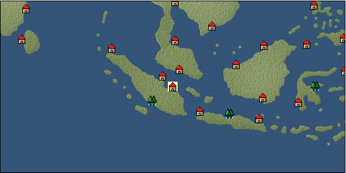

# Port: パレンバン

import Tabs from '@theme/Tabs';
import TabItem from '@theme/TabItem';

## General Information

| Attribute | Details |
| :--- | :--- |
| **Port Name** | Palembang |
| **Port Type** | port of alliance |
| **Region** | Southeast Asia |
| **Sea Area** | java sea |
| **Required Language** | Malayu Tagalog |
| **Coordinates** | （4635，4816） |
| **Investment Reward** | [Lot (NO.13)](docs/Items/Consumables/Consumables-Treasure-Chests/item_3021.md) （必要投資額：500,000ドゥカード） |

### Available Facilities

| guild | intermediary | exchange | tool shop | workshop craftsman | Painter | sculptor | peddler |
| --- | --- | --- | --- | --- | --- | --- | --- |
|   |   | ○ | ○ |   |   |   |   |
| Shipyard Master | Lumbermaker | Sail-maker | weapon craftsman | master | TavernFemale | archive | salesperson |
| --- | --- | --- | --- | --- | --- | --- | --- |
|   |   |   |   |   |   |   |   |
| Shipwright | 銀行 | street worker | 王宮 | Trading post | church | suburbs | translator |
| --- | --- | --- | --- | --- | --- | --- | --- |
| ○ | ○ | ○ |   |   |   |   |   |

### Description
A town on the north coast of southern Sumatra. It was the capital of the Srivijaya kingdom, which exercised power over East-West trade. Cultural area: Southeast Asia

<Tabs>
  <TabItem value="trade_goods_sales" label="Trade Goods Sales">

| item | group | purchase price | 同盟時 | remarks |
| --- | --- | --- | --- | --- |
| [Saikaku](docs/Items/TradeGoods/TradeGoods-Medicine/item_1959.md) | [Trading products (medical products)](docs/Categories/category_6.md) | 2,183 | (1,910) |  |
| [cinnamon](docs/Items/TradeGoods/TradeGoods-Spices/item_1432.md) | [Trading Goods (Spices)](docs/Categories/category_12.md) | 474 | (415) |  |
| [onion](docs/Items/TradeGoods/TradeGoods-Foodstuffs/item_28.md) | [Trading items (food items)](docs/Categories/category_3.md) | 82 | 72 |  |
| [wood](docs/Items/TradeGoods/TradeGoods-Wares/item_277.md) | [交易品（工業品）](docs/Categories/category_19.md) | 674 | (590) |  |
| [pearl](docs/Items/TradeGoods/TradeGoods-Gems/item_769.md) | [Trading Items (Gemstones)](docs/Categories/category_15.md) | 4,842 | 4,253 |  |
| [gold](docs/Items/TradeGoods/TradeGoods-Metals/item_659.md) | [Trading products (precious metals)](docs/Categories/category_8.md) | 7,407 | 6,496 |  |
  </TabItem>
  <TabItem value="sale_specialty" label="Sale (Specialty)">

| item | group | sale price | 同盟時 | remarks |
| --- | --- | --- | --- | --- |

#### [Trading products (precious metals)](docs/Categories/category_8.md)

| [platinum](docs/Items/TradeGoods/TradeGoods-Metals/item_2178.md) | Trading products (precious metals) | (5,521) | 6,442 |  |

#### [Trading Goods (Spices)](docs/Categories/category_12.md)

| [allspice](docs/Items/TradeGoods/TradeGoods-Spices/item_1848.md) | Trading Goods (Spices) | [Edit Sale Price](docs/Ports/port_127.md) |  |

#### [Trading Items (Gemstones)](docs/Categories/category_15.md)

| [topaz](docs/Items/TradeGoods/TradeGoods-Gems/item_1097.md) | Trading Items (Gemstones) | 5,034 | (5,663) |  |
| [pink diamond](docs/Items/TradeGoods/TradeGoods-Gems/item_2874.md) | Trading Items (Gemstones) | 3,904 | (4,392) |  |

#### [Trading Items (Firearms)](docs/Categories/category_17.md)

| [musket gun](docs/Items/TradeGoods/TradeGoods-Firearms/item_584.md) | Trading Items (Firearms) | (5,322) | 6,210 |  |
  </TabItem>
  <TabItem value="sale_no_specialty" label="Sale (No Specialty)">

| item | group | sale price | 同盟時 | remarks |
| --- | --- | --- | --- | --- |

#### [Trading Items (Iron Stone)](docs/Categories/category_7.md)

| [tin ore](docs/Items/TradeGoods/TradeGoods-Minerals/item_23.md) | Trading Items (Iron Stone) | (491) | 572 |  |
| [iron ore](docs/Items/TradeGoods/TradeGoods-Minerals/item_146.md) | Trading Items (Iron Stone) | (639) | 745 |  |
| [copper ore](docs/Items/TradeGoods/TradeGoods-Minerals/item_65.md) | Trading Items (Iron Stone) | (786) | 916 |  |

#### [Trading goods (hobby goods)](docs/Categories/category_10.md)

| [coffee](docs/Items/TradeGoods/TradeGoods-Sunddries/item_445.md) | Trading goods (hobby goods) | 532 | (598) |  |

#### [Trading Goods (Spices)](docs/Categories/category_11.md)

| [patchouli](docs/Items/TradeGoods/TradeGoods-Perfume/item_1963.md) | Trading Goods (Spices) | 1,515 | (1,704) |  |
| [sandalwood](docs/Items/TradeGoods/TradeGoods-Perfume/item_771.md) | Trading Goods (Spices) | 1,450 | (1,631) |  |
| [龍脳](docs/Items/TradeGoods/TradeGoods-Perfume/item_1676.md) | Trading Goods (Spices) | 1,427 | (1,605) |  |

#### [交易品（美術品）](docs/Categories/category_14.md)

| [wooden statue](docs/Items/TradeGoods/TradeGoods-Art/item_95.md) | 交易品（美術品） | (1,061) | 1,237 |  |
| [stone statue](docs/Items/TradeGoods/TradeGoods-Art/item_899.md) | 交易品（美術品） | 1,756 | (1,975) |  |

#### [Trading Items (Gemstones)](docs/Categories/category_15.md)

| [jade](docs/Items/TradeGoods/TradeGoods-Gems/item_2015.md) | Trading Items (Gemstones) | 2,120 | (2,385) |  |
| [Tortoiseshell](docs/Items/TradeGoods/TradeGoods-Gems/item_1980.md) | Trading Items (Gemstones) | 1,458 | (1,640) |  |
| [sapphire](docs/Items/TradeGoods/TradeGoods-Gems/item_676.md) | Trading Items (Gemstones) | (3,677) | 4,290 |  |
| [ruby](docs/Items/TradeGoods/TradeGoods-Gems/item_773.md) | Trading Items (Gemstones) | 4,364 | (4,909) |  |
| [ivory](docs/Items/TradeGoods/TradeGoods-Gems/item_699.md) | Trading Items (Gemstones) | 2,198 | (2,472) |  |

#### [Trading Items (Arms)](docs/Categories/category_16.md)

| [dagger](docs/Items/TradeGoods/TradeGoods-Weapons/item_143.md) | Trading Items (Arms) | 912 | (1,026) |  |

#### [Trading Items (Firearms)](docs/Categories/category_17.md)

| [arquebus gun](docs/Items/TradeGoods/TradeGoods-Firearms/item_14.md) | Trading Items (Firearms) | (2,295) | 2,677 |  |

#### [交易品（工業品）](docs/Categories/category_19.md)

| [coal](docs/Items/TradeGoods/TradeGoods-Wares/item_359.md) | 交易品（工業品） | (466) | 543 |  |
| [iron material](docs/Items/TradeGoods/TradeGoods-Wares/item_268.md) | 交易品（工業品） | (799) | 932 |  |

#### [交易品（織物）](docs/Categories/category_20.md)

| [silk fabric](docs/Items/TradeGoods/TradeGoods-Fabrics/item_823.md) | 交易品（織物） | 2,747 | (3,090) |  |
  </TabItem>
  <TabItem value="guild_&_others" label="Guild & Others">

| item | group | Sales price | Handling NPC | remarks |
| --- | --- | --- | --- | --- |
| There is no sales information for the item |
| --- |
  </TabItem>
  <TabItem value="toolman" label="Toolman">

| item | group | Sales price | Handling NPC | remarks |
| --- | --- | --- | --- | --- |

#### [Equipment (body)](docs/Categories/category_24.md)

| [pirate vest](docs/Items/Equipment/Equipment-Body/item_98.md) | Equipment (body) | 18,500 | tool shop owner |  |

#### [Equipment (legs)](docs/Categories/category_26.md)

| [cross strap sandals](docs/Items/Equipment/Equipment-Feet/item_99.md) | Equipment (legs) | 7,300 | tool shop owner |  |

#### [Equipment (belongings)](docs/Categories/category_27.md)

| [short sword](docs/Items/Equipment/Equipment-Weapon/item_301.md) | Equipment (belongings) | 9,300 | tool shop owner |  |

#### [Consumables (land battle/deck battle)](docs/Categories/category_29.md)

| [strong adhesive oil](docs/Items/Consumables/Consumables-Landbattle/item_662.md) | Consumables (land battle/deck battle) | 200 | tool shop owner |  |
| [tonic](docs/Items/Consumables/Consumables-Landbattle/item_1678.md) | Consumables (land battle/deck battle) | 300 | tool shop owner |  |
| [Arsenite poison](docs/Items/Consumables/Consumables-Landbattle/item_663.md) | Consumables (land battle/deck battle) | 400 | tool shop owner |  |

#### [Consumables (skill activation)](docs/Categories/category_31.md)

| [捕獲網](docs/Items/Consumables/Consumables-Skill/item_315.md) | Consumables (skill activation) | 300 | tool shop owner |  |
| [research monocle](docs/Items/Consumables/Consumables-Skill/item_120.md) | Consumables (skill activation) | 2,500 | tool shop owner |  |
  </TabItem>
</Tabs>