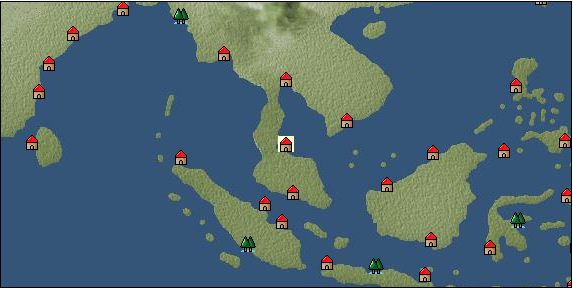

# Port: パタニ

import Tabs from '@theme/Tabs';
import TabItem from '@theme/TabItem';

## General Information

| Attribute | Details |
| :--- | :--- |
| **Port Name** | Patani |
| **Port Type** | port of alliance |
| **Region** | Southeast Asia |
| **Sea Area** | Gulf of Siam |
| **Required Language** | Thai-Burmese |
| **Coordinates** | （4650，4507） |
| **Investment Reward** | [Southeast Asian secret cuisine Riku](docs/Items/RecipeBooks/item_1982.md) （必要投資額：2,000,000ドゥカード） |

### Available Facilities

| guild | intermediary | exchange | tool shop | workshop craftsman | Painter | sculptor | peddler |
| --- | --- | --- | --- | --- | --- | --- | --- |
|   |   | ○ | ○ |   |   |   |   |
| Shipyard Master | Lumbermaker | Sail-maker | weapon craftsman | master | TavernFemale | archive | salesperson |
| --- | --- | --- | --- | --- | --- | --- | --- |
|   |   |   |   | ○ |   |   |   |
| Shipwright | 銀行 | street worker | 王宮 | Trading post | church | suburbs | translator |
| --- | --- | --- | --- | --- | --- | --- | --- |
| ○ | ○ | ○ |   |   |   |   |   |

### Description
The capital of the Kingdom of Patani, a Malay country whose official religion is Islam. It was one of the first Malay dynasties to become Islamic. Sea area: Gulf of Siam Cultural area: Southeast Asia

<Tabs>
  <TabItem value="trade_goods_sales" label="Trade Goods Sales">

| item | group | purchase price | 同盟時 | remarks |
| --- | --- | --- | --- | --- |
| [coconut](docs/Items/TradeGoods/TradeGoods-Sunddries/item_96.md) | [Trading goods (hobby goods)](docs/Categories/category_10.md) | 292 | (256) |  |
| [turmeric](docs/Items/TradeGoods/TradeGoods-Dye/item_1433.md) | [Trading Goods (Dye)](docs/Categories/category_2.md) | 224 | (196) |  |
| [durian](docs/Items/TradeGoods/TradeGoods-Sunddries/item_1949.md) | [Trading goods (hobby goods)](docs/Categories/category_10.md) | 520 | (455) |  |
| [Nampula](docs/Items/TradeGoods/TradeGoods-Seasonings/item_1972.md) | [交易品（調味料）](docs/Categories/category_4.md) | 273 | (239) |  |
| [papaya](docs/Items/TradeGoods/TradeGoods-Sunddries/item_1948.md) | [Trading goods (hobby goods)](docs/Categories/category_10.md) | 346 | (303) |  |
| [mangosteen](docs/Items/TradeGoods/TradeGoods-Dye/item_1973.md) | [Trading Goods (Dye)](docs/Categories/category_2.md) | 752 | (658) |  |
| [pearl](docs/Items/TradeGoods/TradeGoods-Gems/item_769.md) | [Trading Items (Gemstones)](docs/Categories/category_15.md) | 3,407 | (2,981) |  |
| 要投資（必要投資額：240,000） |
  </TabItem>
  <TabItem value="sale_specialty" label="Sale (Specialty)">

| item | group | sale price | 同盟時 | remarks |
| --- | --- | --- | --- | --- |

#### [交易品（繊維）](docs/Categories/category_1.md)

| [deerskin](docs/Items/TradeGoods/TradeGoods-Fibers/item_3648.md) | 交易品（繊維） | 14,579 | (16,402) |  |

#### [Trading Goods (Dye)](docs/Categories/category_2.md)

| [Shorou](docs/Items/TradeGoods/TradeGoods-Dye/item_3691.md) | Trading Goods (Dye) | 9,131 | (10,273) |  |

#### [Trading items (food items)](docs/Categories/category_3.md)

| [Karasumi](docs/Items/TradeGoods/TradeGoods-Foodstuffs/item_3687.md) | Trading items (food items) | 10,133 | (11,400) |  |

#### [交易品（調味料）](docs/Categories/category_4.md)

| [Sha Cha Ji](docs/Items/TradeGoods/TradeGoods-Seasonings/item_3689.md) | 交易品（調味料） | 9,043 | (10,174) |  |

#### [Trading products (medical products)](docs/Categories/category_6.md)

| [Borei](docs/Items/TradeGoods/TradeGoods-Medicine/item_3678.md) | Trading products (medical products) | 7,340 | (8,258) |  |

#### [Trading products (precious metals)](docs/Categories/category_8.md)

| [Jinguashijin](docs/Items/TradeGoods/TradeGoods-Metals/item_3693.md) | Trading products (precious metals) | 9,301 | (10,464) |  |

#### [Trading goods (hobby goods)](docs/Categories/category_10.md)

| [Aigyoku](docs/Items/TradeGoods/TradeGoods-Sunddries/item_3677.md) | Trading goods (hobby goods) | 8,660 | (9,743) |  |

#### [Trading Goods (Spices)](docs/Categories/category_11.md)

| [eucalyptus](docs/Items/TradeGoods/TradeGoods-Perfume/item_2278.md) | Trading Goods (Spices) | 431 | (484) |  |

#### [Trading Goods (Spices)](docs/Categories/category_12.md)

| [Kouzuku](docs/Items/TradeGoods/TradeGoods-Spices/item_3690.md) | Trading Goods (Spices) | 10,279 | (11,564) |  |
| [Grapefruit](docs/Items/TradeGoods/TradeGoods-Spices/item_3422.md) | Trading Goods (Spices) | 11,319 | 13,187 |  |

#### [交易品（美術品）](docs/Categories/category_14.md)

| [Japanese painting](docs/Items/TradeGoods/TradeGoods-Art/item_3436.md) | 交易品（美術品） | 9,133 | (10,275) |  |

#### [Trading Items (Gemstones)](docs/Categories/category_15.md)

| [topaz](docs/Items/TradeGoods/TradeGoods-Gems/item_1097.md) | Trading Items (Gemstones) | 5,189 | (5,838) |  |
| [pink diamond](docs/Items/TradeGoods/TradeGoods-Gems/item_2874.md) | Trading Items (Gemstones) | (3,510) | 4,095 |  |

#### [交易品（織物）](docs/Categories/category_20.md)

| [velvet](docs/Items/TradeGoods/TradeGoods-Fabrics/item_902.md) | 交易品（織物） | 5,368 | (6,039) |  |
| [麻織物](docs/Items/TradeGoods/TradeGoods-Fabrics/item_3673.md) | 交易品（織物） | 8,423 | (9,476) |  |
  </TabItem>
  <TabItem value="sale_no_specialty" label="Sale (No Specialty)">

| item | group | sale price | 同盟時 | remarks |
| --- | --- | --- | --- | --- |

#### [交易品（繊維）](docs/Categories/category_1.md)

| [Panya](docs/Items/TradeGoods/TradeGoods-Fibers/item_2097.md) | 交易品（繊維） | 439 | (493) |  |

#### [Trading products (medical products)](docs/Categories/category_6.md)

| [Saikaku](docs/Items/TradeGoods/TradeGoods-Medicine/item_1959.md) | Trading products (medical products) | 1,920 | (2,160) |  |
| [Noni](docs/Items/TradeGoods/TradeGoods-Medicine/item_2099.md) | Trading products (medical products) | 522 | (587) |  |

#### [Trading products (precious metals)](docs/Categories/category_8.md)

| [gold](docs/Items/TradeGoods/TradeGoods-Metals/item_659.md) | Trading products (precious metals) | 6,888 | (7,749) |  |

#### [Trading Goods (Spices)](docs/Categories/category_11.md)

| [agarwood](docs/Items/TradeGoods/TradeGoods-Perfume/item_1058.md) | Trading Goods (Spices) | 2,490 | (2,801) |  |
| [sandalwood](docs/Items/TradeGoods/TradeGoods-Perfume/item_771.md) | Trading Goods (Spices) | 1,445 | (1,625) |  |

#### [Trading Goods (Spices)](docs/Categories/category_12.md)

| [lemongrass](docs/Items/TradeGoods/TradeGoods-Spices/item_2096.md) | Trading Goods (Spices) | 189 | (212) |  |

#### [交易品（織物）](docs/Categories/category_20.md)

| [silk fabric](docs/Items/TradeGoods/TradeGoods-Fabrics/item_823.md) | 交易品（織物） | 2,754 | (3,098) |  |
  </TabItem>
  <TabItem value="guild_&_others" label="Guild & Others">

| item | group | Sales price | Handling NPC | remarks |
| --- | --- | --- | --- | --- |
| There is no sales information for the item |
| --- |
  </TabItem>
  <TabItem value="toolman" label="Toolman">

| item | group | Sales price | Handling NPC | remarks |
| --- | --- | --- | --- | --- |

#### [Equipment (body)](docs/Categories/category_24.md)

| [pirate vest](docs/Items/Equipment/Equipment-Body/item_98.md) | Equipment (body) | 18,500 | tool shop owner |  |

#### [Equipment (legs)](docs/Categories/category_26.md)

| [cross strap sandals](docs/Items/Equipment/Equipment-Feet/item_99.md) | Equipment (legs) | 7,300 | tool shop owner |  |

#### [Equipment (belongings)](docs/Categories/category_27.md)

| [short sword](docs/Items/Equipment/Equipment-Weapon/item_301.md) | Equipment (belongings) | 9,300 | tool shop owner |  |

#### [Consumables (land battle/deck battle)](docs/Categories/category_29.md)

| [strong adhesive oil](docs/Items/Consumables/Consumables-Landbattle/item_662.md) | Consumables (land battle/deck battle) | 200 | tool shop owner |  |
| [tonic](docs/Items/Consumables/Consumables-Landbattle/item_1678.md) | Consumables (land battle/deck battle) | 300 | tool shop owner |  |
| [Arsenite poison](docs/Items/Consumables/Consumables-Landbattle/item_663.md) | Consumables (land battle/deck battle) | 400 | tool shop owner |  |

#### [Consumables (skill activation)](docs/Categories/category_31.md)

| [捕獲網](docs/Items/Consumables/Consumables-Skill/item_315.md) | Consumables (skill activation) | 300 | tool shop owner |  |
| [research monocle](docs/Items/Consumables/Consumables-Skill/item_120.md) | Consumables (skill activation) | 2,500 | tool shop owner |  |
  </TabItem>
</Tabs>