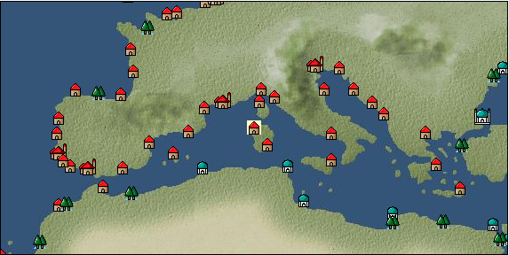

# Port: サッサリ

import Tabs from '@theme/Tabs';
import TabItem from '@theme/TabItem';

## General Information

| Attribute | Details |
| :--- | :--- |
| **Port Name** | Sassari |
| **Port Type** | port of alliance |
| **Region** | western europe |
| **Sea Area** | Tyrrhenian Sea |
| **Required Language** | italian |
| **Coordinates** | （269，3093） |
| **Investment Reward** | [Delicious bread from the bakery](docs/Items/RecipeBooks/item_681.md) （必要投資額：300,000ドゥカード） |

### Available Facilities

| guild | intermediary | exchange | tool shop | workshop craftsman | Painter | sculptor | peddler |
| --- | --- | --- | --- | --- | --- | --- | --- |
|   |   | ○ | ○ |   |   |   |   |
| Shipyard Master | Lumbermaker | Sail-maker | weapon craftsman | master | TavernFemale | archive | salesperson |
| --- | --- | --- | --- | --- | --- | --- | --- |
|   |   |   |   | ○ |   |   |   |
| Shipwright | 銀行 | street worker | 王宮 | Trading post | church | suburbs | translator |
| --- | --- | --- | --- | --- | --- | --- | --- |
| ○ | ○ | ○ |   |   |   |   |   |

### Description
A city located in the northern part of Sardinia. Like Cagliari in the south, many different cultures coexist. *Spanish is also spoken 2010.4.27 Added jute to trade items for sale Cultural area: Italy/Southern France

<Tabs>
  <TabItem value="trade_goods_sales" label="Trade Goods Sales">

| item | group | purchase price | 同盟時 | remarks |
| --- | --- | --- | --- | --- |
| [digitalis](docs/Items/TradeGoods/TradeGoods-Medicine/item_2148.md) | [Trading products (medical products)](docs/Categories/category_6.md) | 317 | 288 |  |
| 要投資（必要投資額：500,000） |
| [turkish rug](docs/Items/TradeGoods/TradeGoods-Fabrics/item_686.md) | [交易品（織物）](docs/Categories/category_20.md) | (4,792) | 4,193 |  |
| 時代限定（15世紀第5期、16世紀第2期） |
| [sheep](docs/Items/TradeGoods/TradeGoods-Livestock/item_253.md) | [Trading Goods (Livestock)](docs/Categories/category_18.md) | 118 | 108 |  |
| [marble](docs/Items/TradeGoods/TradeGoods-Wares/item_52.md) | [交易品（工業品）](docs/Categories/category_19.md) | 1,269 | 1,108 |  |
| 時代限定（15世紀第2期） |
| [gold](docs/Items/TradeGoods/TradeGoods-Metals/item_659.md) | [Trading products (precious metals)](docs/Categories/category_8.md) | 5,907 | (5,168) |  |
| 要投資（必要投資額：700,000） EO第4章で追加 |
| [魚肉](docs/Items/TradeGoods/TradeGoods-Foodstuffs/item_10.md) | [Trading items (food items)](docs/Categories/category_3.md) | 141 | 128 |  |
| [jute](docs/Items/TradeGoods/TradeGoods-Fibers/item_128.md) | [交易品（繊維）](docs/Categories/category_1.md) | 139 | (122) |  |
  </TabItem>
  <TabItem value="sale_specialty" label="Sale (Specialty)">

| item | group | sale price | 同盟時 | remarks |
| --- | --- | --- | --- | --- |

#### [交易品（繊維）](docs/Categories/category_1.md)

| [flax](docs/Items/TradeGoods/TradeGoods-Fibers/item_64.md) | 交易品（繊維） | (275) | 320 |  |
| [Green ramie](docs/Items/TradeGoods/TradeGoods-Fibers/item_3428.md) | 交易品（繊維） | (33,007) | 38,514 |  |

#### [Trading Goods (Dye)](docs/Categories/category_2.md)

| [mayan blue](docs/Items/TradeGoods/TradeGoods-Dye/item_1096.md) | Trading Goods (Dye) | (1,551) | 1,809 |  |

#### [交易品（調味料）](docs/Categories/category_4.md)

| [apple cider vinegar](docs/Items/TradeGoods/TradeGoods-Seasonings/item_882.md) | 交易品（調味料） | [Edit Sale Price](docs/Ports/port_13.md) |  |

#### [Trading products (medical products)](docs/Categories/category_6.md)

| [Saikaku](docs/Items/TradeGoods/TradeGoods-Medicine/item_1959.md) | Trading products (medical products) | 4,659 | (5,241) |  |

#### [Trading products (precious metals)](docs/Categories/category_8.md)

| [platinum](docs/Items/TradeGoods/TradeGoods-Metals/item_2178.md) | Trading products (precious metals) | (6,514) | 7,600 |  |

#### [交易品（酒類）](docs/Categories/category_9.md)

| [aquavit](docs/Items/TradeGoods/TradeGoods-Alcohol/item_572.md) | 交易品（酒類） | (808) | 942 |  |
| [whiskey](docs/Items/TradeGoods/TradeGoods-Alcohol/item_1.md) | 交易品（酒類） | 869 | 960 |  |
| [gin](docs/Items/TradeGoods/TradeGoods-Alcohol/item_291.md) | 交易品（酒類） | 875 | (984) |  |
| [fruit brandy](docs/Items/TradeGoods/TradeGoods-Alcohol/item_1440.md) | 交易品（酒類） | (667) | 778 |  |

#### [Trading Goods (Spices)](docs/Categories/category_11.md)

| [龍脳](docs/Items/TradeGoods/TradeGoods-Perfume/item_1676.md) | Trading Goods (Spices) | 2,852 | (3,208) |  |

#### [Trading Goods (Spices)](docs/Categories/category_12.md)

| [cloves](docs/Items/TradeGoods/TradeGoods-Spices/item_1092.md) | Trading Goods (Spices) | (7,211) | 8,414 |  |
| [pepper](docs/Items/TradeGoods/TradeGoods-Spices/item_58.md) | Trading Goods (Spices) | 8,410 | 5,730 |  |
| [mace](docs/Items/TradeGoods/TradeGoods-Spices/item_2100.md) | Trading Goods (Spices) | 12,948 | (14,567) |  |
| [Grapefruit](docs/Items/TradeGoods/TradeGoods-Spices/item_3422.md) | Trading Goods (Spices) | (35,016) | 40,858 |  |

#### [Trading goods (artificial goods)](docs/Categories/category_13.md)

| [Tumbaga](docs/Items/TradeGoods/TradeGoods-Luxuries/item_3028.md) | Trading goods (artificial goods) | 21,613 | (24,316) |  |

#### [Trading Items (Gemstones)](docs/Categories/category_15.md)

| [opal](docs/Items/TradeGoods/TradeGoods-Gems/item_2006.md) | Trading Items (Gemstones) | (6,865) | 8,010 |  |
| [sapphire](docs/Items/TradeGoods/TradeGoods-Gems/item_676.md) | Trading Items (Gemstones) | 11,471 | 12,609 |  |
| [diamond](docs/Items/TradeGoods/TradeGoods-Gems/item_449.md) | Trading Items (Gemstones) | (6,048) | 7,057 |  |
| [topaz](docs/Items/TradeGoods/TradeGoods-Gems/item_1097.md) | Trading Items (Gemstones) | (5,172) | 6,035 |  |
| [pink diamond](docs/Items/TradeGoods/TradeGoods-Gems/item_2874.md) | Trading Items (Gemstones) | (12,941) | 15,100 |  |
| [ruby](docs/Items/TradeGoods/TradeGoods-Gems/item_773.md) | Trading Items (Gemstones) | 11,961 | (13,457) |  |
| [amber](docs/Items/TradeGoods/TradeGoods-Gems/item_618.md) | Trading Items (Gemstones) | (3,951) | 4,610 |  |

#### [Trading Items (Arms)](docs/Categories/category_16.md)

| [damascus sword](docs/Items/TradeGoods/TradeGoods-Weapons/item_903.md) | Trading Items (Arms) | 5,150 | (5,794) |  |

#### [Trading Items (Firearms)](docs/Categories/category_17.md)

| [tanegashima gun](docs/Items/TradeGoods/TradeGoods-Firearms/item_3423.md) | Trading Items (Firearms) | 23,546 | (26,491) |  |

#### [交易品（工業品）](docs/Categories/category_19.md)

| [Japanese paper](docs/Items/TradeGoods/TradeGoods-Wares/item_3438.md) | 交易品（工業品） | (33,945) | 39,608 |  |

#### [交易品（織物）](docs/Categories/category_20.md)

| [indian chintz](docs/Items/TradeGoods/TradeGoods-Fabrics/item_159.md) | 交易品（織物） | 2,394 | (2,693) |  |
| [gobelin weave](docs/Items/TradeGoods/TradeGoods-Fabrics/item_1276.md) | 交易品（織物） | (3,634) | 4,240 |  |
| [damask](docs/Items/TradeGoods/TradeGoods-Fabrics/item_614.md) | 交易品（織物） | (3,454) | 4,030 |  |
| [turkish rug](docs/Items/TradeGoods/TradeGoods-Fabrics/item_686.md) | 交易品（織物） | (1,798) | 2,097 |  |
| 時代限定（15世紀第5期、16世紀第2期） |
| [flannel](docs/Items/TradeGoods/TradeGoods-Fabrics/item_149.md) | 交易品（織物） | 1,602 | 1,651 |  |
| [persian rug](docs/Items/TradeGoods/TradeGoods-Fabrics/item_606.md) | 交易品（織物） | 10,550 | (11,869) |  |
  </TabItem>
  <TabItem value="sale_no_specialty" label="Sale (No Specialty)">

| item | group | sale price | 同盟時 | remarks |
| --- | --- | --- | --- | --- |

#### [交易品（繊維）](docs/Categories/category_1.md)

| [kenaf](docs/Items/TradeGoods/TradeGoods-Fibers/item_576.md) | 交易品（繊維） | 236 | (265) |  |
| [cotton](docs/Items/TradeGoods/TradeGoods-Fibers/item_610.md) | 交易品（繊維） | (558) | 651 |  |
| [wool](docs/Items/TradeGoods/TradeGoods-Fibers/item_5.md) | 交易品（繊維） | (431) | 502 |  |

#### [Trading Goods (Dye)](docs/Categories/category_2.md)

| [ward](docs/Items/TradeGoods/TradeGoods-Dye/item_57.md) | Trading Goods (Dye) | 907 | (1,020) |  |
| [貝紫](docs/Items/TradeGoods/TradeGoods-Dye/item_110.md) | Trading Goods (Dye) | (3,943) | 4,600 |  |

#### [Trading items (food items)](docs/Categories/category_3.md)

| [fava beans](docs/Items/TradeGoods/TradeGoods-Foodstuffs/item_102.md) | Trading items (food items) | 89 | 95 |  |
| [duck meat](docs/Items/TradeGoods/TradeGoods-Foodstuffs/item_32.md) | Trading items (food items) | (391) | 456 |  |
| [olive](docs/Items/TradeGoods/TradeGoods-Foodstuffs/item_47.md) | Trading items (food items) | (262) | 305 |  |
| [turnip](docs/Items/TradeGoods/TradeGoods-Foodstuffs/item_55.md) | Trading items (food items) | 77 | 84 |  |
| [Oat](docs/Items/TradeGoods/TradeGoods-Foodstuffs/item_275.md) | Trading items (food items) | (77) | 89 |  |
| [sausage](docs/Items/TradeGoods/TradeGoods-Foodstuffs/item_27.md) | Trading items (food items) | (478) | 557 |  |
| [onion](docs/Items/TradeGoods/TradeGoods-Foodstuffs/item_28.md) | Trading items (food items) | 133 | (149) |  |
| [egg](docs/Items/TradeGoods/TradeGoods-Foodstuffs/item_40.md) | Trading items (food items) | (31) | 36 |  |
| [wheat](docs/Items/TradeGoods/TradeGoods-Foodstuffs/item_16.md) | Trading items (food items) | 61 | (68) |  |
| [Paddy rice](docs/Items/TradeGoods/TradeGoods-Foodstuffs/item_654.md) | Trading items (food items) | 97 | (109) |  |
| [beef](docs/Items/TradeGoods/TradeGoods-Foodstuffs/item_26.md) | Trading items (food items) | 648 | (729) |  |
| [mutton](docs/Items/TradeGoods/TradeGoods-Foodstuffs/item_33.md) | Trading items (food items) | 433 | 490 |  |
| [red bean](docs/Items/TradeGoods/TradeGoods-Foodstuffs/item_123.md) | Trading items (food items) | 133 | 143 |  |
| [chicken meat](docs/Items/TradeGoods/TradeGoods-Foodstuffs/item_29.md) | Trading items (food items) | 298 | 331 |  |

#### [交易品（調味料）](docs/Categories/category_4.md)

| [almond oil](docs/Items/TradeGoods/TradeGoods-Seasonings/item_578.md) | 交易品（調味料） | 652 | 717 |  |
| [olive oil](docs/Items/TradeGoods/TradeGoods-Seasonings/item_48.md) | 交易品（調味料） | (291) | 339 |  |
| [butter](docs/Items/TradeGoods/TradeGoods-Seasonings/item_3.md) | 交易品（調味料） | 362 | (407) |  |
| [white vinegar](docs/Items/TradeGoods/TradeGoods-Seasonings/item_56.md) | 交易品（調味料） | (155) | 180 |  |
| [wine vinegar](docs/Items/TradeGoods/TradeGoods-Seasonings/item_429.md) | 交易品（調味料） | 582 | (654) |  |
| [salt](docs/Items/TradeGoods/TradeGoods-Seasonings/item_42.md) | 交易品（調味料） | 270 | (303) |  |

#### [Trading products (medical products)](docs/Categories/category_6.md)

| [belladonna](docs/Items/TradeGoods/TradeGoods-Medicine/item_1056.md) | Trading products (medical products) | (471) | 549 |  |

#### [Trading Items (Iron Stone)](docs/Categories/category_7.md)

| [iron ore](docs/Items/TradeGoods/TradeGoods-Minerals/item_146.md) | Trading Items (Iron Stone) | 755 | 784 |  |

#### [Trading products (precious metals)](docs/Categories/category_8.md)

| [gold](docs/Items/TradeGoods/TradeGoods-Metals/item_659.md) | Trading products (precious metals) | (7,426) | 8,664 |  |
| 要投資（必要投資額：700,000） EO第4章で追加 |
| [silver](docs/Items/TradeGoods/TradeGoods-Metals/item_136.md) | Trading products (precious metals) | (2,469) | 2,880 |  |

#### [交易品（酒類）](docs/Categories/category_9.md)

| [sherry](docs/Items/TradeGoods/TradeGoods-Alcohol/item_844.md) | 交易品（酒類） | 498 | 518 |  |
| [Beer](docs/Items/TradeGoods/TradeGoods-Alcohol/item_2.md) | 交易品（酒類） | (366) | 427 |  |
| [brandy](docs/Items/TradeGoods/TradeGoods-Alcohol/item_9.md) | 交易品（酒類） | 794 | (893) |  |
| [rum](docs/Items/TradeGoods/TradeGoods-Alcohol/item_139.md) | 交易品（酒類） | 712 | 753 |  |

#### [Trading goods (hobby goods)](docs/Categories/category_10.md)

| [almond](docs/Items/TradeGoods/TradeGoods-Sunddries/item_367.md) | Trading goods (hobby goods) | (179) | 208 |  |
| [pickles](docs/Items/TradeGoods/TradeGoods-Sunddries/item_535.md) | Trading goods (hobby goods) | 287 | 297 |  |
| [raisins](docs/Items/TradeGoods/TradeGoods-Sunddries/item_35.md) | Trading goods (hobby goods) | (304) | 354 |  |

#### [Trading Goods (Spices)](docs/Categories/category_11.md)

| [civet](docs/Items/TradeGoods/TradeGoods-Perfume/item_808.md) | Trading Goods (Spices) | 3,458 | (3,890) |  |
| [rose](docs/Items/TradeGoods/TradeGoods-Perfume/item_536.md) | Trading Goods (Spices) | 3,150 | (3,544) |  |

#### [Trading Goods (Spices)](docs/Categories/category_12.md)

| [oregano](docs/Items/TradeGoods/TradeGoods-Spices/item_430.md) | Trading Goods (Spices) | 532 | (598) |  |
| [garlic](docs/Items/TradeGoods/TradeGoods-Spices/item_526.md) | Trading Goods (Spices) | 331 | 338 |  |
| [coriander](docs/Items/TradeGoods/TradeGoods-Spices/item_1044.md) | Trading Goods (Spices) | (415) | 484 |  |
| [Sesame](docs/Items/TradeGoods/TradeGoods-Spices/item_437.md) | Trading Goods (Spices) | 334 | (375) |  |
| [celery](docs/Items/TradeGoods/TradeGoods-Spices/item_431.md) | Trading Goods (Spices) | 136 | (153) |  |
| [time](docs/Items/TradeGoods/TradeGoods-Spices/item_432.md) | Trading Goods (Spices) | 443 | (498) |  |
| [parsley](docs/Items/TradeGoods/TradeGoods-Spices/item_46.md) | Trading Goods (Spices) | 140 | (157) |  |
| [mustard](docs/Items/TradeGoods/TradeGoods-Spices/item_575.md) | Trading Goods (Spices) | 285 | (320) |  |

#### [Trading goods (artificial goods)](docs/Categories/category_13.md)

| [glasswork](docs/Items/TradeGoods/TradeGoods-Luxuries/item_60.md) | Trading goods (artificial goods) | (1,037) | 1,210 |  |
| [coral work](docs/Items/TradeGoods/TradeGoods-Luxuries/item_595.md) | Trading goods (artificial goods) | (2,594) | 3,026 |  |
| [lapidary work](docs/Items/TradeGoods/TradeGoods-Luxuries/item_153.md) | Trading goods (artificial goods) | (3,514) | 4,100 |  |
| [皮革製品](docs/Items/TradeGoods/TradeGoods-Luxuries/item_12.md) | Trading goods (artificial goods) | (1,132) | 1,320 |  |
| [goldsmith](docs/Items/TradeGoods/TradeGoods-Luxuries/item_687.md) | Trading goods (artificial goods) | (2,597) | 3,030 |  |
| [ceramics](docs/Items/TradeGoods/TradeGoods-Luxuries/item_152.md) | Trading goods (artificial goods) | (1,295) | 1,510 |  |
| [luxury furniture](docs/Items/TradeGoods/TradeGoods-Luxuries/item_1048.md) | Trading goods (artificial goods) | 2,515 | (2,829) |  |

#### [交易品（美術品）](docs/Categories/category_14.md)

| [oil painting](docs/Items/TradeGoods/TradeGoods-Art/item_1088.md) | 交易品（美術品） | (1,869) | 2,180 |  |
| [copperplate print](docs/Items/TradeGoods/TradeGoods-Art/item_1087.md) | 交易品（美術品） | 759 | (853) |  |
| [青銅像](docs/Items/TradeGoods/TradeGoods-Art/item_148.md) | 交易品（美術品） | (926) | 1,080 |  |

#### [Trading Items (Gemstones)](docs/Categories/category_15.md)

| [emerald](docs/Items/TradeGoods/TradeGoods-Gems/item_777.md) | Trading Items (Gemstones) | 7,860 | (8,843) |  |
| [coral](docs/Items/TradeGoods/TradeGoods-Gems/item_141.md) | Trading Items (Gemstones) | (2,613) | 3,048 |  |

#### [Trading Items (Arms)](docs/Categories/category_16.md)

| [two-handed sword](docs/Items/TradeGoods/TradeGoods-Weapons/item_24.md) | Trading Items (Arms) | 1,616 | (1,818) |  |

#### [Trading Items (Firearms)](docs/Categories/category_17.md)

| [bullet](docs/Items/TradeGoods/TradeGoods-Firearms/item_13.md) | Trading Items (Firearms) | (783) | 913 |  |
| [gunpowder](docs/Items/TradeGoods/TradeGoods-Firearms/item_352.md) | Trading Items (Firearms) | (986) | 1,150 |  |
| [cannonball](docs/Items/TradeGoods/TradeGoods-Firearms/item_144.md) | Trading Items (Firearms) | (1,507) | 1,758 |  |

#### [Trading Goods (Livestock)](docs/Categories/category_18.md)

| [chicken](docs/Items/TradeGoods/TradeGoods-Livestock/item_252.md) | Trading Goods (Livestock) | (48) | 55 |  |
| [goat](docs/Items/TradeGoods/TradeGoods-Livestock/item_534.md) | Trading Goods (Livestock) | 198 | 203 |  |

#### [交易品（工業品）](docs/Categories/category_19.md)

| [alabaster](docs/Items/TradeGoods/TradeGoods-Wares/item_1086.md) | 交易品（工業品） | (567) | 661 |  |
| [wax](docs/Items/TradeGoods/TradeGoods-Wares/item_54.md) | 交易品（工業品） | (807) | 941 |  |
| [wood](docs/Items/TradeGoods/TradeGoods-Wares/item_277.md) | 交易品（工業品） | 838 | 880 |  |
| [水銀](docs/Items/TradeGoods/TradeGoods-Wares/item_15.md) | 交易品（工業品） | 1,220 | (1,372) |  |
| [graphite](docs/Items/TradeGoods/TradeGoods-Wares/item_25.md) | 交易品（工業品） | 1,156 | (1,300) |  |
| [羊皮紙](docs/Items/TradeGoods/TradeGoods-Wares/item_53.md) | 交易品（工業品） | (1,106) | 1,290 |  |
| [iron material](docs/Items/TradeGoods/TradeGoods-Wares/item_268.md) | 交易品（工業品） | 964 | (1,084) |  |
| [鋼](docs/Items/TradeGoods/TradeGoods-Wares/item_573.md) | 交易品（工業品） | (1,109) | 1,293 |  |

#### [交易品（織物）](docs/Categories/category_20.md)

| [corduroy](docs/Items/TradeGoods/TradeGoods-Fabrics/item_824.md) | 交易品（織物） | (840) | 979 |  |
| [georgette](docs/Items/TradeGoods/TradeGoods-Fabrics/item_1000.md) | 交易品（織物） | (2,529) | 2,950 |  |
| [velvet](docs/Items/TradeGoods/TradeGoods-Fabrics/item_902.md) | 交易品（織物） | 3,020 | (3,397) |  |
| [muslin](docs/Items/TradeGoods/TradeGoods-Fabrics/item_581.md) | 交易品（織物） | 1,516 | (1,705) |  |
| [cotton fabric](docs/Items/TradeGoods/TradeGoods-Fabrics/item_571.md) | 交易品（織物） | (917) | 1,070 |  |
| [linen fabric](docs/Items/TradeGoods/TradeGoods-Fabrics/item_135.md) | 交易品（織物） | 488 | 505 |  |
  </TabItem>
  <TabItem value="guild_&_others" label="Guild & Others">

| item | group | Sales price | Handling NPC | remarks |
| --- | --- | --- | --- | --- |
| There is no sales information for the item |
| --- |
  </TabItem>
  <TabItem value="toolman" label="Toolman">

| item | group | Sales price | Handling NPC | remarks |
| --- | --- | --- | --- | --- |

#### [recipe book](docs/Categories/category_22.md)

| [Mode Design Collection Volume 1](docs/Items/RecipeBooks/item_92.md) | recipe book | 10,000 | tool shop owner |  |
| [Sword training/application](docs/Items/RecipeBooks/item_589.md) | recipe book | 50,000 | tool shop owner |  |
| [Textile secrets/fabric book](docs/Items/RecipeBooks/item_91.md) | recipe book | 10,000 | tool shop owner |  |

#### [Consumables (land battle/deck battle)](docs/Categories/category_29.md)

| [black kite feather](docs/Items/Consumables/Consumables-Landbattle/item_88.md) | Consumables (land battle/deck battle) | 100 | tool shop owner |  |
| [Assortment of wound medicine](docs/Items/Consumables/Consumables-Landbattle/item_90.md) | Consumables (land battle/deck battle) | 500 | tool shop owner |  |
| [therapeutic drug](docs/Items/Consumables/Consumables-Landbattle/item_89.md) | Consumables (land battle/deck battle) | 300 | tool shop owner |  |
| [antidote](docs/Items/Consumables/Consumables-Landbattle/item_270.md) | Consumables (land battle/deck battle) | 100 | tool shop owner |  |
  </TabItem>
</Tabs>