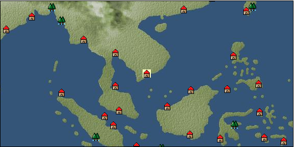

# Port: Yardane

import Tabs from '@theme/Tabs';
import TabItem from '@theme/TabItem';

## General Information

| Attribute | Details |
| :--- | :--- |
| **Port Name** | Yardane |
| **Port Type** | port of alliance |
| **Region** | Southeast Asia |
| **Sea Area** | Gulf of Siam |
| **Required Language** | Mon-Khmer languages |
| **Coordinates** | （4895，4412） |
| **Investment Reward** | [Southeast Asian women's costume sewing method](docs/Items/RecipeBooks/item_1981.md) （必要投資額：2,000,000ドゥカード） |

### Available Facilities

| guild | intermediary | exchange | tool shop | workshop craftsman | Painter | sculptor | peddler |
| --- | --- | --- | --- | --- | --- | --- | --- |
|   |   | ○ | ○ |   |   |   |   |
| Shipyard Master | Lumbermaker | Sail-maker | weapon craftsman | master | TavernFemale | archive | salesperson |
| --- | --- | --- | --- | --- | --- | --- | --- |
|   |   |   |   | ○ |   |   |   |
| Shipwright | 銀行 | street worker | 王宮 | Trading post | church | suburbs | translator |
| --- | --- | --- | --- | --- | --- | --- | --- |
| ○ | ○ | ○ |   |   |   | ○ |   |

### Description
A city built on the Mekong River basin. It was ruled by the Chenla Kingdom for a long time. It is said that the ancient capital of the Chenla Kingdom is located upstream of the river. Suburb: Northwest of Yardein Cultural area: Indochina

<Tabs>
  <TabItem value="trade_goods_sales" label="Trade Goods Sales">

| Item | Group | Purchase Price | Allied Price | Remarks |
| --- | --- | --- | --- | --- |
| [garlic](docs/Items/TradeGoods/TradeGoods-Spices/item_526.md) | [Trading Goods (Spices)](docs/Categories/category_12.md) | 278 | 244 |  |
| [Nyoc mam](docs/Items/TradeGoods/TradeGoods-Seasonings/item_1971.md) | [交易品（調味料）](docs/Categories/category_4.md) | 246 | (216) |  |
| [pig](docs/Items/TradeGoods/TradeGoods-Livestock/item_37.md) | [Trading Goods (Livestock)](docs/Categories/category_18.md) | 246 | (216) |  |
| [Paddy rice](docs/Items/TradeGoods/TradeGoods-Foodstuffs/item_654.md) | [Trading items (food items)](docs/Categories/category_3.md) | 50 | (44) |  |
| [agarwood](docs/Items/TradeGoods/TradeGoods-Perfume/item_1058.md) | [Trading Goods (Spices)](docs/Categories/category_11.md) | 1,956 | (1,712) |  |
| [raw silk](docs/Items/TradeGoods/TradeGoods-Fibers/item_677.md) | [交易品（繊維）](docs/Categories/category_1.md) | 1,897 | (1,660) |  |
| [魚肉](docs/Items/TradeGoods/TradeGoods-Foodstuffs/item_10.md) | [Trading items (food items)](docs/Categories/category_3.md) | 146 | 128 |  |
  </TabItem>
  <TabItem value="sale_specialty" label="Sale (Specialty)">

| Item | Group | sale price | Allied Price | Remarks |
| --- | --- | --- | --- | --- |

#### [交易品（繊維）](docs/Categories/category_1.md)

| [Rush](docs/Items/TradeGoods/TradeGoods-Fibers/item_3675.md) | 交易品（繊維） | (5,673) | 6,619 |  |
| [flax](docs/Items/TradeGoods/TradeGoods-Fibers/item_64.md) | 交易品（繊維） | (405) | 472 |  |
| [Green ramie](docs/Items/TradeGoods/TradeGoods-Fibers/item_3428.md) | 交易品（繊維） | 4,873 | (5,482) |  |

#### [Trading items (food items)](docs/Categories/category_3.md)

| [Chamtashima](docs/Items/TradeGoods/TradeGoods-Foodstuffs/item_3771.md) | Trading items (food items) | 5,673 | (6,382) |  |

#### [交易品（調味料）](docs/Categories/category_4.md)

| [apple cider vinegar](docs/Items/TradeGoods/TradeGoods-Seasonings/item_882.md) | 交易品（調味料） | (738) | 860 |  |
| [羅漢果](docs/Items/TradeGoods/TradeGoods-Seasonings/item_4004.md) | 交易品（調味料） | (2,310) | 2,695 |  |

#### [交易品（雑貨）](docs/Categories/category_5.md)

| [old ink stick](docs/Items/TradeGoods/TradeGoods-Misc/item_3921.md) | 交易品（雑貨） | (2,293) | 2,675 |  |

#### [交易品（酒類）](docs/Categories/category_9.md)

| [aquavit](docs/Items/TradeGoods/TradeGoods-Alcohol/item_572.md) | 交易品（酒類） | (1,029) | 1,200 |  |
| [whiskey](docs/Items/TradeGoods/TradeGoods-Alcohol/item_1.md) | 交易品（酒類） | (1,193) | 1,392 |  |
| [sherry](docs/Items/TradeGoods/TradeGoods-Alcohol/item_844.md) | 交易品（酒類） | (782) | 912 |  |
| [gin](docs/Items/TradeGoods/TradeGoods-Alcohol/item_291.md) | 交易品（酒類） | (1,146) | 1,337 |  |
| [fruit brandy](docs/Items/TradeGoods/TradeGoods-Alcohol/item_1440.md) | 交易品（酒類） | (1,175) | 1,370 |  |
| [Taiwan rice wine](docs/Items/TradeGoods/TradeGoods-Alcohol/item_3672.md) | 交易品（酒類） | (4,553) | 5,312 |  |
| [Andong soju](docs/Items/TradeGoods/TradeGoods-Alcohol/item_3757.md) | 交易品（酒類） | 7,899 | (8,887) |  |

#### [Trading goods (hobby goods)](docs/Categories/category_10.md)

| [tobacco](docs/Items/TradeGoods/TradeGoods-Sunddries/item_109.md) | Trading goods (hobby goods) | 1,356 | (1,525) |  |
| [dried apple](docs/Items/TradeGoods/TradeGoods-Sunddries/item_19.md) | Trading goods (hobby goods) | (583) | 680 |  |

#### [Trading Goods (Spices)](docs/Categories/category_12.md)

| [saffron](docs/Items/TradeGoods/TradeGoods-Spices/item_845.md) | Trading Goods (Spices) | 6,017 | (6,769) |  |
| [Grapefruit](docs/Items/TradeGoods/TradeGoods-Spices/item_3422.md) | Trading Goods (Spices) | 11,327 | 13,164 |  |

#### [Trading goods (artificial goods)](docs/Categories/category_13.md)

| [glasswork](docs/Items/TradeGoods/TradeGoods-Luxuries/item_60.md) | Trading goods (artificial goods) | (2,475) | 2,887 |  |

#### [Trading Items (Gemstones)](docs/Categories/category_15.md)

| [diamond](docs/Items/TradeGoods/TradeGoods-Gems/item_449.md) | Trading Items (Gemstones) | (4,528) | 5,283 |  |
| [topaz](docs/Items/TradeGoods/TradeGoods-Gems/item_1097.md) | Trading Items (Gemstones) | 5,394 | (6,068) |  |
| [pink diamond](docs/Items/TradeGoods/TradeGoods-Gems/item_2874.md) | Trading Items (Gemstones) | 4,072 | (4,581) |  |
| [amber](docs/Items/TradeGoods/TradeGoods-Gems/item_618.md) | Trading Items (Gemstones) | (4,285) | 5,000 |  |

#### [Trading Items (Firearms)](docs/Categories/category_17.md)

| [musket gun](docs/Items/TradeGoods/TradeGoods-Firearms/item_584.md) | Trading Items (Firearms) | (5,571) | 6,500 |  |

#### [交易品（工業品）](docs/Categories/category_19.md)

| [Japanese paper](docs/Items/TradeGoods/TradeGoods-Wares/item_3438.md) | 交易品（工業品） | (11,399) | 13,300 |  |

#### [交易品（織物）](docs/Categories/category_20.md)

| [flannel](docs/Items/TradeGoods/TradeGoods-Fabrics/item_149.md) | 交易品（織物） | 2,286 | (2,572) |  |
  </TabItem>
  <TabItem value="sale_no_specialty" label="Sale (No Specialty)">

| Item | Group | sale price | Allied Price | Remarks |
| --- | --- | --- | --- | --- |

#### [交易品（繊維）](docs/Categories/category_1.md)

| [numb](docs/Items/TradeGoods/TradeGoods-Fibers/item_900.md) | 交易品（繊維） | 12 | (13) |  |

#### [Trading items (food items)](docs/Categories/category_3.md)

| [sausage](docs/Items/TradeGoods/TradeGoods-Foodstuffs/item_27.md) | Trading items (food items) | 415 | (466) |  |
| [ham](docs/Items/TradeGoods/TradeGoods-Foodstuffs/item_290.md) | Trading items (food items) | 512 | (576) |  |
| [bacon](docs/Items/TradeGoods/TradeGoods-Foodstuffs/item_566.md) | Trading items (food items) | 449 | (505) |  |
| [pork](docs/Items/TradeGoods/TradeGoods-Foodstuffs/item_41.md) | Trading items (food items) | 409 | (460) |  |

#### [交易品（調味料）](docs/Categories/category_4.md)

| [lard](docs/Items/TradeGoods/TradeGoods-Seasonings/item_43.md) | 交易品（調味料） | 260 | (292) |  |

#### [Trading products (medical products)](docs/Categories/category_6.md)

| [Saikaku](docs/Items/TradeGoods/TradeGoods-Medicine/item_1959.md) | Trading products (medical products) | 1,872 | (2,106) |  |

#### [Trading products (precious metals)](docs/Categories/category_8.md)

| [gold](docs/Items/TradeGoods/TradeGoods-Metals/item_659.md) | Trading products (precious metals) | 6,888 | (7,749) |  |

#### [Trading Goods (Spices)](docs/Categories/category_11.md)

| [sandalwood](docs/Items/TradeGoods/TradeGoods-Perfume/item_771.md) | Trading Goods (Spices) | 1,445 | (1,625) |  |

#### [Trading Goods (Spices)](docs/Categories/category_12.md)

| [cloves](docs/Items/TradeGoods/TradeGoods-Spices/item_1092.md) | Trading Goods (Spices) | 504 | (567) |  |
| [cinnamon](docs/Items/TradeGoods/TradeGoods-Spices/item_1432.md) | Trading Goods (Spices) | 208 | (234) |  |
| [nutmeg](docs/Items/TradeGoods/TradeGoods-Spices/item_1969.md) | Trading Goods (Spices) | 534 | (600) |  |
| [mace](docs/Items/TradeGoods/TradeGoods-Spices/item_2100.md) | Trading Goods (Spices) | 707 | (795) |  |

#### [Trading Items (Firearms)](docs/Categories/category_17.md)

| [大砲](docs/Items/TradeGoods/TradeGoods-Firearms/item_4.md) | Trading Items (Firearms) | 4,880 | (5,490) |  |
| Confirm at 100% |

#### [交易品（工業品）](docs/Categories/category_19.md)

| [iron material](docs/Items/TradeGoods/TradeGoods-Wares/item_268.md) | 交易品（工業品） | 855 | (961) |  |

#### [交易品（織物）](docs/Categories/category_20.md)

| [silk fabric](docs/Items/TradeGoods/TradeGoods-Fabrics/item_823.md) | 交易品（織物） | 2,715 | 2,754 |  |
  </TabItem>
  <TabItem value="guild_&_others" label="Guild & Others">

| Item | Group | Sales price | Handling NPC | Remarks |
| --- | --- | --- | --- | --- |
| There is no sales information for the Item |
| --- |
  </TabItem>
  <TabItem value="toolman" label="Toolman">

| Item | Group | Sales price | Handling NPC | Remarks |
| --- | --- | --- | --- | --- |

#### [Equipment (body)](docs/Categories/category_24.md)

| [pirate vest](docs/Items/Equipment/Equipment-Body/item_98.md) | Equipment (body) | 18,500 | tool shop owner |  |

#### [Equipment (legs)](docs/Categories/category_26.md)

| [cross strap sandals](docs/Items/Equipment/Equipment-Feet/item_99.md) | Equipment (legs) | 7,300 | tool shop owner |  |

#### [Equipment (belongings)](docs/Categories/category_27.md)

| [short sword](docs/Items/Equipment/Equipment-Weapon/item_301.md) | Equipment (belongings) | 9,300 | tool shop owner |  |

#### [Consumables (land battle/deck battle)](docs/Categories/category_29.md)

| [strong adhesive oil](docs/Items/Consumables/Consumables-Landbattle/item_662.md) | Consumables (land battle/deck battle) | 200 | tool shop owner |  |
| [tonic](docs/Items/Consumables/Consumables-Landbattle/item_1678.md) | Consumables (land battle/deck battle) | 300 | tool shop owner |  |
| [Arsenite poison](docs/Items/Consumables/Consumables-Landbattle/item_663.md) | Consumables (land battle/deck battle) | 400 | tool shop owner |  |

#### [Consumables (skill activation)](docs/Categories/category_31.md)

| [捕獲網](docs/Items/Consumables/Consumables-Skill/item_315.md) | Consumables (skill activation) | 300 | tool shop owner |  |
| [research monocle](docs/Items/Consumables/Consumables-Skill/item_120.md) | Consumables (skill activation) | 2,500 | tool shop owner |  |

#### [Consumables (request documents)](docs/Categories/category_45.md)

| [Livestock purchase order](docs/Items/Consumables/Consumables-Documents/item_4917.md) | Consumables (request documents) | 20,000 | tool shop owner |  |
  </TabItem>
</Tabs>