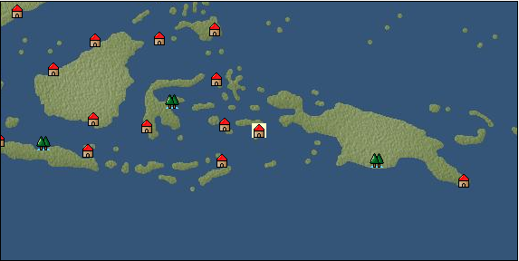

# Port: ルン

import Tabs from '@theme/Tabs';
import TabItem from '@theme/TabItem';

## General Information

| Attribute | Details |
| :--- | :--- |
| **Port Name** | Run |
| **Port Type** | port of alliance |
| **Region** | Southeast Asia |
| **Sea Area** | banda sea |
| **Required Language** | Malayu Tagalog |
| **Coordinates** | （5963，4943） |
| **Investment Reward** | [Lot (NO.12)](Items/Consumables/Consumables-Treasure-Chests/item_3015.md) （必要投資額：500,000ドゥカード） |

### Available Facilities

| guild | intermediary | exchange | tool shop | workshop craftsman | Painter | sculptor | peddler |
| --- | --- | --- | --- | --- | --- | --- | --- |
|   |   | ○ | ○ |   |   |   |   |
| Shipyard Master | Lumbermaker | Sail-maker | weapon craftsman | master | TavernFemale | archive | salesperson |
| --- | --- | --- | --- | --- | --- | --- | --- |
|   |   |   |   | ○ |   |   |   |
| Shipwright | 銀行 | street worker | 王宮 | Trading post | church | suburbs | translator |
| --- | --- | --- | --- | --- | --- | --- | --- |
| ○ | ○ | ○ |   |   |   |   |   |

### Description
A town on Lung Island located in the western part of the Banda Islands. It is a producing area of ​​nutmeg and attracts attention as a center of trade. Cultural area: Indochina

<Tabs>
  <TabItem value="trade_goods_sales" label="Trade Goods Sales">

| item | group | purchase price | 同盟時 | remarks |
| --- | --- | --- | --- | --- |
| [tamarind](Items/Trade Goods/TradeGoods-Seasonings/item_1968.md) | [交易品（調味料）](Categories/category_4.md) | 812 | (711) |  |
| [nutmeg](Items/Trade Goods/TradeGoods-Spices/item_1969.md) | [Trading Goods (Spices)](Categories/category_12.md) | 406 | (356) |  |
| [mint](Items/Trade Goods/TradeGoods-Spices/item_816.md) | [Trading Goods (Spices)](Categories/category_12.md) | 96 | (84) |  |
| [soybeans](Items/Trade Goods/TradeGoods-Foodstuffs/item_1958.md) | [Trading items (food items)](Categories/category_3.md) | 73 | (64) |  |
| [sandalwood](Items/Trade Goods/TradeGoods-Perfume/item_771.md) | [Trading Goods (Spices)](Categories/category_11.md) | 2,062 | (1,805) |  |
| [魚肉](Items/Trade Goods/TradeGoods-Foodstuffs/item_10.md) | [Trading items (food items)](Categories/category_3.md) | 146 | 128 |  |
  </TabItem>
  <TabItem value="sale_specialty" label="Sale (Specialty)">

| item | group | sale price | 同盟時 | remarks |
| --- | --- | --- | --- | --- |

#### [交易品（繊維）](Categories/category_1.md)

| [tiger skin](Items/Trade Goods/TradeGoods-Fibers/item_3790.md) | [交易品（繊維）](Categories/category_1.md) | 14,651 | (16,483) |  |
| [deerskin](Items/Trade Goods/TradeGoods-Fibers/item_3648.md) | [交易品（繊維）](Categories/category_1.md) | 7,139 | (8,032) |  |

#### [Trading Goods (Dye)](Categories/category_2.md)

| [mimosa](Items/Trade Goods/TradeGoods-Dye/item_2281.md) | [Trading Goods (Dye)](Categories/category_2.md) | 640 | (720) |  |

#### [Trading items (food items)](Categories/category_3.md)

| [Lingjiao](Items/Trade Goods/TradeGoods-Foodstuffs/item_3917.md) | [Trading items (food items)](Categories/category_3.md) | 2,860 | (3,217) |  |

#### [Trading products (medical products)](Categories/category_6.md)

| [Korean ginseng](Items/Trade Goods/TradeGoods-Medicine/item_3738.md) | [Trading products (medical products)](Categories/category_6.md) | (7,507) | 8,759 |  |

#### [Trading goods (hobby goods)](Categories/category_10.md)

| [macadamia nuts](Items/Trade Goods/TradeGoods-Sunddries/item_2282.md) | [Trading goods (hobby goods)](Categories/category_10.md) | 451 | (507) |  |

#### [Trading Goods (Spices)](Categories/category_11.md)

| [eucalyptus](Items/Trade Goods/TradeGoods-Perfume/item_2278.md) | [Trading Goods (Spices)](Categories/category_11.md) | 417 | (469) |  |

#### [Trading Goods (Spices)](Categories/category_12.md)

| [saffron](Items/Trade Goods/TradeGoods-Spices/item_845.md) | [Trading Goods (Spices)](Categories/category_12.md) | 6,114 | (6,878) |  |
| [Grapefruit](Items/Trade Goods/TradeGoods-Spices/item_3422.md) | [Trading Goods (Spices)](Categories/category_12.md) | (11,302) | 13,187 |  |

#### [Trading goods (artificial goods)](Categories/category_13.md)

| [Tumbaga](Items/Trade Goods/TradeGoods-Luxuries/item_3028.md) | [Trading goods (artificial goods)](Categories/category_13.md) | 13,071 | (14,706) |  |

#### [Trading Items (Gemstones)](Categories/category_15.md)

| [opal](Items/Trade Goods/TradeGoods-Gems/item_2006.md) | [Trading Items (Gemstones)](Categories/category_15.md) | 9,177 | (10,325) |  |
| [topaz](Items/Trade Goods/TradeGoods-Gems/item_1097.md) | [Trading Items (Gemstones)](Categories/category_15.md) | (5,025) | 5,863 |  |
| [pink diamond](Items/Trade Goods/TradeGoods-Gems/item_2874.md) | [Trading Items (Gemstones)](Categories/category_15.md) | 4,060 | (4,567) |  |

#### [Trading Items (Arms)](Categories/category_16.md)

| [Japanese bow](Items/Trade Goods/TradeGoods-Weapons/item_3469.md) | [Trading Items (Arms)](Categories/category_16.md) | (5,362) | 6,256 |  |

#### [交易品（工業品）](Categories/category_19.md)

| [paint](Items/Trade Goods/TradeGoods-Wares/item_3411.md) | [交易品（工業品）](Categories/category_19.md) | 914 | (1,028) |  |

#### [交易品（織物）](Categories/category_20.md)

| [China Duantong](Items/Trade Goods/TradeGoods-Fabrics/item_3478.md) | [交易品（織物）](Categories/category_20.md) | (7,338) | 8,562 |  |
| [Bingata](Items/Trade Goods/TradeGoods-Fabrics/item_3479.md) | [交易品（織物）](Categories/category_20.md) | (7,474) | 8,721 |  |
  </TabItem>
  <TabItem value="sale_no_specialty" label="Sale (No Specialty)">

| item | group | sale price | 同盟時 | remarks |
| --- | --- | --- | --- | --- |

#### [交易品（繊維）](Categories/category_1.md)

| [numb](Items/Trade Goods/TradeGoods-Fibers/item_900.md) | [交易品（繊維）](Categories/category_1.md) | 12 | (13) |  |

#### [Trading items (food items)](Categories/category_3.md)

| [Cassava](Items/Trade Goods/TradeGoods-Foodstuffs/item_1805.md) | [Trading items (food items)](Categories/category_3.md) | 106 | (119) |  |
| [taro](Items/Trade Goods/TradeGoods-Foodstuffs/item_1960.md) | [Trading items (food items)](Categories/category_3.md) | 175 | (196) |  |
| [ham](Items/Trade Goods/TradeGoods-Foodstuffs/item_290.md) | [Trading items (food items)](Categories/category_3.md) | 1 | (1) |  |
| [crocodile meat](Items/Trade Goods/TradeGoods-Foodstuffs/item_2284.md) | [Trading items (food items)](Categories/category_3.md) | 526 | (591) |  |

#### [交易品（調味料）](Categories/category_4.md)

| [anchovies](Items/Trade Goods/TradeGoods-Seasonings/item_3004.md) | [交易品（調味料）](Categories/category_4.md) | 174 | (195) |  |
| [coconut vinegar](Items/Trade Goods/TradeGoods-Seasonings/item_1988.md) | [交易品（調味料）](Categories/category_4.md) | 460 | (517) |  |

#### [Trading products (medical products)](Categories/category_6.md)

| [tea tree](Items/Trade Goods/TradeGoods-Medicine/item_2283.md) | [Trading products (medical products)](Categories/category_6.md) | 648 | (729) |  |
| [Noni](Items/Trade Goods/TradeGoods-Medicine/item_2099.md) | [Trading products (medical products)](Categories/category_6.md) | 514 | (578) |  |
| [Maca](Items/Trade Goods/TradeGoods-Medicine/item_3000.md) | [Trading products (medical products)](Categories/category_6.md) | 1,192 | (1,341) |  |

#### [Trading goods (hobby goods)](Categories/category_10.md)

| [coconut](Items/Trade Goods/TradeGoods-Sunddries/item_96.md) | [Trading goods (hobby goods)](Categories/category_10.md) | 480 | (540) |  |
| [coffee](Items/Trade Goods/TradeGoods-Sunddries/item_445.md) | [Trading goods (hobby goods)](Categories/category_10.md) | 526 | (591) |  |
| [banana](Items/Trade Goods/TradeGoods-Sunddries/item_1947.md) | [Trading goods (hobby goods)](Categories/category_10.md) | 164 | (184) |  |
| [mango](Items/Trade Goods/TradeGoods-Sunddries/item_2095.md) | [Trading goods (hobby goods)](Categories/category_10.md) | 379 | (426) |  |
| [black tea](Items/Trade Goods/TradeGoods-Sunddries/item_675.md) | [Trading goods (hobby goods)](Categories/category_10.md) | 1,225 | (1,378) |  |

#### [Trading Goods (Spices)](Categories/category_11.md)

| [patchouli](Items/Trade Goods/TradeGoods-Perfume/item_1963.md) | [Trading Goods (Spices)](Categories/category_11.md) | 1,512 | (1,701) |  |

#### [Trading Goods (Spices)](Categories/category_12.md)

| [pepper](Items/Trade Goods/TradeGoods-Spices/item_58.md) | [Trading Goods (Spices)](Categories/category_12.md) | 205 | (230) |  |

#### [Trading goods (artificial goods)](Categories/category_13.md)

| [lapidary work](Items/Trade Goods/TradeGoods-Luxuries/item_153.md) | [Trading goods (artificial goods)](Categories/category_13.md) | 4,300 | (4,837) |  |

#### [交易品（工業品）](Categories/category_19.md)

| [wood](Items/Trade Goods/TradeGoods-Wares/item_277.md) | [交易品（工業品）](Categories/category_19.md) | 806 | (906) |  |
| [Stone](Items/Trade Goods/TradeGoods-Wares/item_276.md) | [交易品（工業品）](Categories/category_19.md) | 684 | (769) |  |
| [oil](Items/Trade Goods/TradeGoods-Wares/item_613.md) | [交易品（工業品）](Categories/category_19.md) | 609 | (685) |  |
| [iron material](Items/Trade Goods/TradeGoods-Wares/item_268.md) | [交易品（工業品）](Categories/category_19.md) | 872 | (981) |  |
  </TabItem>
  <TabItem value="guild_&_others" label="Guild & Others">

| item | group | Sales price | Handling NPC | remarks |
| --- | --- | --- | --- | --- |
| There is no sales information for the item |
| --- |
  </TabItem>
  <TabItem value="toolman" label="Toolman">

| item | group | Sales price | Handling NPC | remarks |
| --- | --- | --- | --- | --- |

#### [Equipment (body)](Categories/category_24.md)

| [pirate vest](Items/Equipment/Equipment-Body/item_98.md) | [Equipment (body)](Categories/category_24.md) | 18,500 | tool shop owner |  |

#### [Equipment (legs)](Categories/category_26.md)

| [cross strap sandals](Items/Equipment/Equipment-Feet/item_99.md) | [Equipment (legs)](Categories/category_26.md) | 7,300 | tool shop owner |  |

#### [Equipment (belongings)](Categories/category_27.md)

| [short sword](Items/Equipment/Equipment-Weapon/item_301.md) | [Equipment (belongings)](Categories/category_27.md) | 9,300 | tool shop owner |  |

#### [Consumables (land battle/deck battle)](Categories/category_29.md)

| [strong adhesive oil](Items/Consumables/Consumables-Landbattle/item_662.md) | [Consumables (land battle/deck battle)](Categories/category_29.md) | 200 | tool shop owner |  |
| [tonic](Items/Consumables/Consumables-Landbattle/item_1678.md) | [Consumables (land battle/deck battle)](Categories/category_29.md) | 300 | tool shop owner |  |
| [Arsenite poison](Items/Consumables/Consumables-Landbattle/item_663.md) | [Consumables (land battle/deck battle)](Categories/category_29.md) | 400 | tool shop owner |  |

#### [Consumables (skill activation)](Categories/category_31.md)

| [捕獲網](Items/Consumables/Consumables-Skill/item_315.md) | [Consumables (skill activation)](Categories/category_31.md) | 300 | tool shop owner |  |
| [research monocle](Items/Consumables/Consumables-Skill/item_120.md) | [Consumables (skill activation)](Categories/category_31.md) | 2,500 | tool shop owner |  |
  </TabItem>
</Tabs>