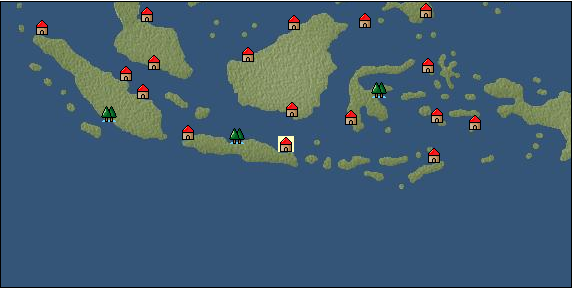

# Port: Surabaya

import Tabs from '@theme/Tabs';
import TabItem from '@theme/TabItem';

## General Information

| Attribute | Details |
| :--- | :--- |
| **Port Name** | Surabaya |
| **Port Type** | port of alliance |
| **Region** | Southeast Asia |
| **Sea Area** | java sea |
| **Required Language** | Malayu Tagalog |
| **Coordinates** | （5207，5032） |
| **Investment Reward** | [Lot (NO.13)](docs/Items/Consumables/Consumables-Treasure-Chests/item_3021.md) （必要投資額：500,000ドゥカード） |

### Available Facilities

| guild | intermediary | exchange | tool shop | workshop craftsman | Painter | sculptor | peddler |
| --- | --- | --- | --- | --- | --- | --- | --- |
|   |   | ○ | ○ | ○ |   |   |   |
| Shipyard Master | Lumbermaker | Sail-maker | weapon craftsman | master | TavernFemale | archive | salesperson |
| --- | --- | --- | --- | --- | --- | --- | --- |
| ○ |   |   | ○ | ○ |   |   |   |
| Shipwright | 銀行 | street worker | 王宮 | Trading post | church | suburbs | translator |
| --- | --- | --- | --- | --- | --- | --- | --- |
| ○ | ○ | ○ |   |   |   |   |   |

### Description
A city located on the northeast coast of Java. It was under the rule of the Majapahit Kingdom and began the golden age of Hindu culture. Cultural area: Southeast Asia

<Tabs>
  <TabItem value="trade_goods_sales" label="Trade Goods Sales">

| Item | Group | Purchase Price | Allied Price | Remarks |
| --- | --- | --- | --- | --- |
| [java chintz](docs/Items/TradeGoods/TradeGoods-Fabrics/item_1970.md) | [交易品（織物）](docs/Categories/category_20.md) | 657 | 576 |  |
| [taro](docs/Items/TradeGoods/TradeGoods-Foodstuffs/item_1960.md) | [Trading items (food items)](docs/Categories/category_3.md) | 77 | 68 |  |
| [nickel ore](docs/Items/TradeGoods/TradeGoods-Minerals/item_5163.md) | [Trading Items (Iron Stone)](docs/Categories/category_7.md) | 3,240 | (2,835) |  |
| 要投資（必要投資額：8,500,000） |
| [banana](docs/Items/TradeGoods/TradeGoods-Sunddries/item_1947.md) | [Trading goods (hobby goods)](docs/Categories/category_10.md) | 150 | 132 |  |
| [cotton](docs/Items/TradeGoods/TradeGoods-Fibers/item_610.md) | [交易品（繊維）](docs/Categories/category_1.md) | 306 | 268 |  |
| [goldsmith](docs/Items/TradeGoods/TradeGoods-Luxuries/item_687.md) | [Trading goods (artificial goods)](docs/Categories/category_13.md) | 3,254 | (2,847) |  |
| 要投資（必要投資額：320,000） |
  </TabItem>
  <TabItem value="sale_specialty" label="Sale (Specialty)">

| Item | Group | sale price | Allied Price | Remarks |
| --- | --- | --- | --- | --- |

#### [交易品（繊維）](docs/Categories/category_1.md)

| [feather](docs/Items/TradeGoods/TradeGoods-Fibers/item_585.md) | 交易品（繊維） | 936 | (1,053) |  |

#### [Trading Goods (Dye)](docs/Categories/category_2.md)

| [ward](docs/Items/TradeGoods/TradeGoods-Dye/item_57.md) | Trading Goods (Dye) | (1,792) | 2,090 |  |
| 98%＝2070　103%＝2120 |
| [mimosa](docs/Items/TradeGoods/TradeGoods-Dye/item_2281.md) | Trading Goods (Dye) | (586) | 683 |  |
| 106%＝716　102%＝691 |

#### [Trading items (food items)](docs/Categories/category_3.md)

| [kangaroo meat](docs/Items/TradeGoods/TradeGoods-Foodstuffs/item_2285.md) | Trading items (food items) | 399 | (448) |  |

#### [交易品（調味料）](docs/Categories/category_4.md)

| [tamarind](docs/Items/TradeGoods/TradeGoods-Seasonings/item_1968.md) | 交易品（調味料） | 787 | (885) |  |

#### [Trading products (medical products)](docs/Categories/category_6.md)

| [Saikaku](docs/Items/TradeGoods/TradeGoods-Medicine/item_1959.md) | Trading products (medical products) | 1,872 | (2,106) |  |
| [tea tree](docs/Items/TradeGoods/TradeGoods-Medicine/item_2283.md) | Trading products (medical products) | (543) | 633 |  |
| When in alliance: confirmed at 100% |

#### [Trading goods (hobby goods)](docs/Categories/category_10.md)

| [tobacco](docs/Items/TradeGoods/TradeGoods-Sunddries/item_109.md) | Trading goods (hobby goods) | 1,528 | (1,719) |  |
| [macadamia nuts](docs/Items/TradeGoods/TradeGoods-Sunddries/item_2282.md) | Trading goods (hobby goods) | (416) | 485 |  |
| When in alliance: confirmed at 100% |

#### [Trading Goods (Spices)](docs/Categories/category_11.md)

| [eucalyptus](docs/Items/TradeGoods/TradeGoods-Perfume/item_2278.md) | Trading Goods (Spices) | (371) | 432 |  |
| When in alliance: confirmed at 100% |
| [lira](docs/Items/TradeGoods/TradeGoods-Perfume/item_30.md) | Trading Goods (Spices) | 1,373 | (1,544) |  |

#### [Trading goods (artificial goods)](docs/Categories/category_13.md)

| [Tumbaga](docs/Items/TradeGoods/TradeGoods-Luxuries/item_3028.md) | Trading goods (artificial goods) | 11,461 | (12,894) |  |

#### [Trading Items (Gemstones)](docs/Categories/category_15.md)

| [diamond](docs/Items/TradeGoods/TradeGoods-Gems/item_449.md) | Trading Items (Gemstones) | 4,420 | (4,972) |  |
| [pink diamond](docs/Items/TradeGoods/TradeGoods-Gems/item_2874.md) | Trading Items (Gemstones) | 4,148 | (4,666) |  |

#### [Trading Items (Arms)](docs/Categories/category_16.md)

| [damascus sword](docs/Items/TradeGoods/TradeGoods-Weapons/item_903.md) | Trading Items (Arms) | 8,580 | (9,653) |  |

#### [交易品（工業品）](docs/Categories/category_19.md)

| [marble](docs/Items/TradeGoods/TradeGoods-Wares/item_52.md) | 交易品（工業品） | (2,374) | 2,770 |  |
| When in alliance: confirmed at 100% |

#### [交易品（織物）](docs/Categories/category_20.md)

| [Awaiyo](docs/Items/TradeGoods/TradeGoods-Fabrics/item_3002.md) | 交易品（織物） | (3,711) | 4,330 |  |
| When in alliance: confirmed at 100% |
| [dutch calico](docs/Items/TradeGoods/TradeGoods-Fabrics/item_1435.md) | 交易品（織物） | 2,000 | (2,250) |  |
| [velvet](docs/Items/TradeGoods/TradeGoods-Fabrics/item_902.md) | 交易品（織物） | (4,731) | 5,520 |  |
| 98%＝5480　104%＝5600 |
  </TabItem>
  <TabItem value="sale_no_specialty" label="Sale (No Specialty)">

| Item | Group | sale price | Allied Price | Remarks |
| --- | --- | --- | --- | --- |

#### [交易品（繊維）](docs/Categories/category_1.md)

| [Panya](docs/Items/TradeGoods/TradeGoods-Fibers/item_2097.md) | 交易品（繊維） | (394) | 459 |  |
| [raw silk](docs/Items/TradeGoods/TradeGoods-Fibers/item_677.md) | 交易品（繊維） | 2,600 | (2,925) |  |
| [numb](docs/Items/TradeGoods/TradeGoods-Fibers/item_900.md) | 交易品（繊維） | 12 | (13) |  |

#### [Trading Goods (Dye)](docs/Categories/category_2.md)

| [Indian indigo](docs/Items/TradeGoods/TradeGoods-Dye/item_157.md) | Trading Goods (Dye) | 576 | (648) |  |

#### [交易品（調味料）](docs/Categories/category_4.md)

| [anchovies](docs/Items/TradeGoods/TradeGoods-Seasonings/item_3004.md) | 交易品（調味料） | 174 | (195) |  |

#### [Trading products (medical products)](docs/Categories/category_6.md)

| [Noni](docs/Items/TradeGoods/TradeGoods-Medicine/item_2099.md) | Trading products (medical products) | 522 | 522 |  |

#### [Trading goods (hobby goods)](docs/Categories/category_10.md)

| [durian](docs/Items/TradeGoods/TradeGoods-Sunddries/item_1949.md) | Trading goods (hobby goods) | 593 | (667) |  |
| [banana](docs/Items/TradeGoods/TradeGoods-Sunddries/item_1947.md) | Trading goods (hobby goods) | 66 | (74) |  |

#### [Trading Goods (Spices)](docs/Categories/category_11.md)

| [jasmine](docs/Items/TradeGoods/TradeGoods-Perfume/item_772.md) | Trading Goods (Spices) | 3,143 | (3,536) |  |
| [patchouli](docs/Items/TradeGoods/TradeGoods-Perfume/item_1963.md) | Trading Goods (Spices) | 1,512 | (1,701) |  |
| [benzoin](docs/Items/TradeGoods/TradeGoods-Perfume/item_1962.md) | Trading Goods (Spices) | 1,029 | (1,157) |  |
| [agarwood](docs/Items/TradeGoods/TradeGoods-Perfume/item_1058.md) | Trading Goods (Spices) | 2,371 | (2,667) |  |
| [sandalwood](docs/Items/TradeGoods/TradeGoods-Perfume/item_771.md) | Trading Goods (Spices) | 1,445 | (1,625) |  |
| [龍脳](docs/Items/TradeGoods/TradeGoods-Perfume/item_1676.md) | Trading Goods (Spices) | 1,397 | (1,571) |  |

#### [Trading Goods (Spices)](docs/Categories/category_12.md)

| [cloves](docs/Items/TradeGoods/TradeGoods-Spices/item_1092.md) | Trading Goods (Spices) | 494 | (555) |  |
| [cinnamon](docs/Items/TradeGoods/TradeGoods-Spices/item_1432.md) | Trading Goods (Spices) | 208 | (234) |  |
| [nutmeg](docs/Items/TradeGoods/TradeGoods-Spices/item_1969.md) | Trading Goods (Spices) | 508 | (571) |  |
| [mace](docs/Items/TradeGoods/TradeGoods-Spices/item_2100.md) | Trading Goods (Spices) | 707 | (795) |  |
| [lemongrass](docs/Items/TradeGoods/TradeGoods-Spices/item_2096.md) | Trading Goods (Spices) | (169) | 197 |  |

#### [Trading goods (artificial goods)](docs/Categories/category_13.md)

| [silversmith](docs/Items/TradeGoods/TradeGoods-Luxuries/item_619.md) | Trading goods (artificial goods) | (2,794) | 3,260 |  |
| When in alliance: confirmed at 100% |

#### [Trading Items (Gemstones)](docs/Categories/category_15.md)

| [jade](docs/Items/TradeGoods/TradeGoods-Gems/item_2015.md) | Trading Items (Gemstones) | 2,083 | (2,343) |  |
| [Tortoiseshell](docs/Items/TradeGoods/TradeGoods-Gems/item_1980.md) | Trading Items (Gemstones) | 1,453 | (1,634) |  |
| [sapphire](docs/Items/TradeGoods/TradeGoods-Gems/item_676.md) | Trading Items (Gemstones) | 4,203 | (4,728) |  |
| [lapis lazuli](docs/Items/TradeGoods/TradeGoods-Gems/item_995.md) | Trading Items (Gemstones) | 3,014 | (3,391) |  |
| [ruby](docs/Items/TradeGoods/TradeGoods-Gems/item_773.md) | Trading Items (Gemstones) | 4,365 | (4,911) |  |
| [pearl](docs/Items/TradeGoods/TradeGoods-Gems/item_769.md) | Trading Items (Gemstones) | 5,710 | (6,424) |  |
| [ivory](docs/Items/TradeGoods/TradeGoods-Gems/item_699.md) | Trading Items (Gemstones) | 2,190 | (2,463) |  |

#### [交易品（工業品）](docs/Categories/category_19.md)

| [wood](docs/Items/TradeGoods/TradeGoods-Wares/item_277.md) | 交易品（工業品） | 809 | (910) |  |
| [graphite](docs/Items/TradeGoods/TradeGoods-Wares/item_25.md) | 交易品（工業品） | 1,053 | (1,184) |  |
| [iron material](docs/Items/TradeGoods/TradeGoods-Wares/item_268.md) | 交易品（工業品） | 931 | (1,047) |  |

#### [交易品（織物）](docs/Categories/category_20.md)

| [indian chintz](docs/Items/TradeGoods/TradeGoods-Fabrics/item_159.md) | 交易品（織物） | 1,361 | (1,531) |  |
| [silk fabric](docs/Items/TradeGoods/TradeGoods-Fabrics/item_823.md) | 交易品（織物） | 2,743 | 2,750 |  |
| [cotton fabric](docs/Items/TradeGoods/TradeGoods-Fabrics/item_571.md) | 交易品（織物） | (1,007) | 1,174 |  |
  </TabItem>
  <TabItem value="guild_&_others" label="Guild & Others">

| Item | Group | Sales price | Handling NPC | Remarks |
| --- | --- | --- | --- | --- |
| There is no sales information for the Item |
| --- |
  </TabItem>
  <TabItem value="toolman" label="Toolman">

| Item | Group | Sales price | Handling NPC | Remarks |
| --- | --- | --- | --- | --- |

#### [Equipment (body)](docs/Categories/category_24.md)

| [pirate vest](docs/Items/Equipment/Equipment-Body/item_98.md) | Equipment (body) | 18,500 | tool shop owner |  |

#### [Equipment (legs)](docs/Categories/category_26.md)

| [cross strap sandals](docs/Items/Equipment/Equipment-Feet/item_99.md) | Equipment (legs) | 7,300 | tool shop owner |  |

#### [Equipment (belongings)](docs/Categories/category_27.md)

| [short sword](docs/Items/Equipment/Equipment-Weapon/item_301.md) | Equipment (belongings) | 9,300 | tool shop owner |  |

#### [Consumables (land battle/deck battle)](docs/Categories/category_29.md)

| [strong adhesive oil](docs/Items/Consumables/Consumables-Landbattle/item_662.md) | Consumables (land battle/deck battle) | 200 | tool shop owner |  |
| [tonic](docs/Items/Consumables/Consumables-Landbattle/item_1678.md) | Consumables (land battle/deck battle) | 300 | tool shop owner |  |
| [Arsenite poison](docs/Items/Consumables/Consumables-Landbattle/item_663.md) | Consumables (land battle/deck battle) | 400 | tool shop owner |  |

#### [Consumables (skill activation)](docs/Categories/category_31.md)

| [research monocle](docs/Items/Consumables/Consumables-Skill/item_120.md) | Consumables (skill activation) | 2,500 | tool shop owner |  |
  </TabItem>
  <TabItem value="kobo_craftsmen" label="Craftsman">

| Item | Group | Sales price | Handling NPC | Remarks |
| --- | --- | --- | --- | --- |

#### [Consumables (condition recovery)](docs/Categories/category_21.md)

| [Nostalgic carillon bell](docs/Items/Consumables/Consumables-Recovery/item_245.md) | Consumables (condition recovery) | 200 | workshop craftsman |  |
| [Ship song sheet music](docs/Items/Consumables/Consumables-Recovery/item_247.md) | Consumables (condition recovery) | 200 | workshop craftsman |  |

#### [Consumables (other)](docs/Categories/category_44.md)

| [帆塗料](docs/Items/Consumables/Consumables-Other/item_348.md) | Consumables (other) | 500 | workshop craftsman |  |
| [ship paint](docs/Items/Consumables/Consumables-Other/item_347.md) | Consumables (other) | 500 | workshop craftsman |  |
  </TabItem>
  <TabItem value="shipyard" label="Shipyard">

### Shipyard Master

| Item | Group | Sales price | Handling NPC | Remarks |
| --- | --- | --- | --- | --- |

#### [Boat](docs/Categories/category_43.md)

| [sambouk](docs/Items/Ships/item_783.md) | Boat | 1,000,000 | Shipyard Master |  |
| [Dow](docs/Items/Ships/item_780.md) | Boat | 360,000 | Shipyard Master |  |
| [Varsha](docs/Items/Ships/item_201.md) | Boat | 2,000 | Shipyard Master |  |
| [commercial thumb book](docs/Items/Ships/item_785.md) | Boat | 1,100,000 | Shipyard Master |  |
| [commercial dow](docs/Items/Ships/item_782.md) | Boat | 372,000 | Shipyard Master |  |
| [commercial varsha](docs/Items/Ships/item_204.md) | Boat | 5,200 | Shipyard Master |  |
| [Battle Barsha](docs/Items/Ships/item_203.md) | Boat | 5,100 | Shipyard Master |  |
| [exploration barsha](docs/Items/Ships/item_202.md) | Boat | 5,000 | Shipyard Master |  |
| [Armed Sambouk](docs/Items/Ships/item_784.md) | Boat | 1,000,000 | Shipyard Master |  |
| [assault dhow](docs/Items/Ships/item_781.md) | Boat | 365,000 | Shipyard Master |  |
  </TabItem>
  <TabItem value="weapon craftsman" label="weapon craftsman">

| Item | Group | Sales price | Handling NPC | Remarks |
| --- | --- | --- | --- | --- |

#### [Ship parts (special weapons)](docs/Categories/category_37.md)

| [Corvus](docs/Items/ShipParts/Shipparts-Special-Equipment/item_194.md) | Ship parts (special weapons) | 24,000 | weapon craftsman |  |
| [rum](docs/Items/ShipParts/Shipparts-Special-Equipment/item_191.md) | Ship parts (special weapons) | 4,800 | weapon craftsman |  |
| [small corvus](docs/Items/ShipParts/Shipparts-Special-Equipment/item_193.md) | Ship parts (special weapons) | 3,000 | weapon craftsman |  |
| [small ram](docs/Items/ShipParts/Shipparts-Special-Equipment/item_190.md) | Ship parts (special weapons) | 1,000 | weapon craftsman |  |
| [small ship forecastle](docs/Items/ShipParts/Shipparts-Special-Equipment/item_195.md) | Ship parts (special weapons) | 5,000 | weapon craftsman |  |
| [additional small spanker](docs/Items/ShipParts/Shipparts-Special-Equipment/item_199.md) | Ship parts (special weapons) | 3,500 | weapon craftsman |  |
| [additional small split](docs/Items/ShipParts/Shipparts-Special-Equipment/item_196.md) | Ship parts (special weapons) | 2,000 | weapon craftsman |  |

#### [Ship parts (cannon)](docs/Categories/category_38.md)

| [8 Exploder guns](docs/Items/ShipParts/Shipparts-Cannons/item_1164.md) | Ship parts (cannon) | 113,900 | weapon craftsman |  |
| [10 angel cannons](docs/Items/ShipParts/Shipparts-Cannons/item_853.md) | Ship parts (cannon) | 249,400 | weapon craftsman |  |
| [8 angel cannons](docs/Items/ShipParts/Shipparts-Cannons/item_389.md) | Ship parts (cannon) | 159,600 | weapon craftsman |  |
| [10 Caprice guns](docs/Items/ShipParts/Shipparts-Cannons/item_2211.md) | Ship parts (cannon) | 161,300 | weapon craftsman |  |
| [8 Caprice guns](docs/Items/ShipParts/Shipparts-Cannons/item_397.md) | Ship parts (cannon) | 103,600 | weapon craftsman |  |
| [10 culverines](docs/Items/ShipParts/Shipparts-Cannons/item_375.md) | Ship parts (cannon) | 136,300 | weapon craftsman |  |
| [12 culverin guns](docs/Items/ShipParts/Shipparts-Cannons/item_744.md) | Ship parts (cannon) | 196,300 | weapon craftsman |  |
| [8 culverine guns](docs/Items/ShipParts/Shipparts-Cannons/item_374.md) | Ship parts (cannon) | 87,300 | weapon craftsman |  |
| [10 Cannon Pedro guns](docs/Items/ShipParts/Shipparts-Cannons/item_746.md) | Ship parts (cannon) | 190,900 | weapon craftsman |  |
| [8 Cannon Pedro guns](docs/Items/ShipParts/Shipparts-Cannons/item_745.md) | Ship parts (cannon) | 122,200 | weapon craftsman |  |
| [10 Saker cannons](docs/Items/ShipParts/Shipparts-Cannons/item_187.md) | Ship parts (cannon) | 79,000 | weapon craftsman |  |
| [8 Saker cannons](docs/Items/ShipParts/Shipparts-Cannons/item_186.md) | Ship parts (cannon) | 50,500 | weapon craftsman |  |
| [10 demi culverin cannons](docs/Items/ShipParts/Shipparts-Cannons/item_370.md) | Ship parts (cannon) | 101,000 | weapon craftsman |  |
| [12 demi culverin cannons](docs/Items/ShipParts/Shipparts-Cannons/item_371.md) | Ship parts (cannon) | 145,400 | weapon craftsman |  |
| [8 demi culverin cannons](docs/Items/ShipParts/Shipparts-Cannons/item_369.md) | Ship parts (cannon) | 64,600 | weapon craftsman |  |
| [10 trench guns](docs/Items/ShipParts/Shipparts-Cannons/item_835.md) | Ship parts (cannon) | 163,600 | weapon craftsman |  |
| [8 trench guns](docs/Items/ShipParts/Shipparts-Cannons/item_381.md) | Ship parts (cannon) | 104,700 | weapon craftsman |  |
| [10 Draconis cannons](docs/Items/ShipParts/Shipparts-Cannons/item_2210.md) | Ship parts (cannon) | 161,300 | weapon craftsman |  |
| [8 Draconis cannons](docs/Items/ShipParts/Shipparts-Cannons/item_390.md) | Ship parts (cannon) | 103,600 | weapon craftsman |  |
| [10 pyro cannons](docs/Items/ShipParts/Shipparts-Cannons/item_1185.md) | Ship parts (cannon) | 110,500 | weapon craftsman |  |
| [8 pyro cannons](docs/Items/ShipParts/Shipparts-Cannons/item_1184.md) | Ship parts (cannon) | 71,000 | weapon craftsman |  |
| [2 falcon guns](docs/Items/ShipParts/Shipparts-Cannons/item_174.md) | Ship parts (cannon) | 500 | weapon craftsman |  |
| [4 falcon guns](docs/Items/ShipParts/Shipparts-Cannons/item_175.md) | Ship parts (cannon) | 2,000 | weapon craftsman |  |
| [6 falcon guns](docs/Items/ShipParts/Shipparts-Cannons/item_176.md) | Ship parts (cannon) | 4,600 | weapon craftsman |  |
| [8 falcon guns](docs/Items/ShipParts/Shipparts-Cannons/item_177.md) | Ship parts (cannon) | 8,100 | weapon craftsman |  |
| [10 Heitzer guns](docs/Items/ShipParts/Shipparts-Cannons/item_947.md) | Ship parts (cannon) | 226,800 | weapon craftsman |  |
| [8 Heutzer guns](docs/Items/ShipParts/Shipparts-Cannons/item_946.md) | Ship parts (cannon) | 145,200 | weapon craftsman |  |
| [10 minion cannons](docs/Items/ShipParts/Shipparts-Cannons/item_182.md) | Ship parts (cannon) | 34,800 | weapon craftsman |  |
| [8 minion cannons](docs/Items/ShipParts/Shipparts-Cannons/item_181.md) | Ship parts (cannon) | 22,400 | weapon craftsman |  |
| [10 rapid fire cannons](docs/Items/ShipParts/Shipparts-Cannons/item_1024.md) | Ship parts (cannon) | 123,200 | weapon craftsman |  |
| [8 rapid fire cannons](docs/Items/ShipParts/Shipparts-Cannons/item_1023.md) | Ship parts (cannon) | 78,900 | weapon craftsman |  |
  </TabItem>
</Tabs>