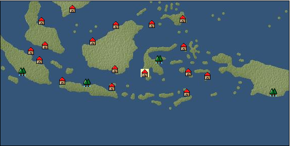

# Port: マカッサル

import Tabs from '@theme/Tabs';
import TabItem from '@theme/TabItem';

## General Information

| Attribute | Details |
| :--- | :--- |
| **Port Name** | Makassar |
| **Port Type** | port of alliance |
| **Region** | Southeast Asia |
| **Sea Area** | banda sea |
| **Required Language** | Malayu Tagalog |
| **Coordinates** | （5468，4921） |
| **Investment Reward** | [Lot (NO.13)](docs/Items/Consumables/Consumables-Treasure-Chests/item_3021.md) （必要投資額：500,000ドゥカード） |

### Available Facilities

| guild | intermediary | exchange | tool shop | workshop craftsman | Painter | sculptor | peddler |
| --- | --- | --- | --- | --- | --- | --- | --- |
|   |   | ○ | ○ |   |   |   |   |
| Shipyard Master | Lumbermaker | Sail-maker | weapon craftsman | master | TavernFemale | archive | salesperson |
| --- | --- | --- | --- | --- | --- | --- | --- |
|   |   |   | ○ |   |   |   |   |
| Shipwright | 銀行 | street worker | 王宮 | Trading post | church | suburbs | translator |
| --- | --- | --- | --- | --- | --- | --- | --- |
| ○ | ○ | ○ |   |   |   |   |   |

### Description
A town located in the southern part of Celebes Island. It flourished as a trading transit port during the era of the Gowa and Tallo kingdoms. Cultural area: Southeast Asia

<Tabs>
  <TabItem value="trade_goods_sales" label="Trade Goods Sales">

| item | group | purchase price | 同盟時 | remarks |
| --- | --- | --- | --- | --- |
| [Tortoiseshell](docs/Items/TradeGoods/TradeGoods-Gems/item_1980.md) | [Trading Items (Gemstones)](docs/Categories/category_15.md) | 1,416 | (1,239) |  |
| 要投資（必要投資額：180,000） |
| [cloves](docs/Items/TradeGoods/TradeGoods-Spices/item_1092.md) | [Trading Goods (Spices)](docs/Categories/category_12.md) | 383 | (336) |  |
| [banana](docs/Items/TradeGoods/TradeGoods-Sunddries/item_1947.md) | [Trading goods (hobby goods)](docs/Categories/category_10.md) | 150 | (132) |  |
| [salt](docs/Items/TradeGoods/TradeGoods-Seasonings/item_42.md) | [交易品（調味料）](docs/Categories/category_4.md) | 237 | 208 |  |
| [iron ore](docs/Items/TradeGoods/TradeGoods-Minerals/item_146.md) | [Trading Items (Iron Stone)](docs/Categories/category_7.md) | 648 | (567) |  |
  </TabItem>
  <TabItem value="sale_specialty" label="Sale (Specialty)">

| item | group | sale price | 同盟時 | remarks |
| --- | --- | --- | --- | --- |

#### [交易品（繊維）](docs/Categories/category_1.md)

| [feather](docs/Items/TradeGoods/TradeGoods-Fibers/item_585.md) | 交易品（繊維） | (783) | 913 |  |

#### [Trading Goods (Dye)](docs/Categories/category_2.md)

| [mimosa](docs/Items/TradeGoods/TradeGoods-Dye/item_2281.md) | Trading Goods (Dye) | 637 | (716) |  |

#### [Trading products (medical products)](docs/Categories/category_6.md)

| [Saikaku](docs/Items/TradeGoods/TradeGoods-Medicine/item_1959.md) | Trading products (medical products) | 1,979 | (2,226) |  |

#### [Trading goods (hobby goods)](docs/Categories/category_10.md)

| [macadamia nuts](docs/Items/TradeGoods/TradeGoods-Sunddries/item_2282.md) | Trading goods (hobby goods) | 474 | (533) |  |

#### [Trading Goods (Spices)](docs/Categories/category_11.md)

| [eucalyptus](docs/Items/TradeGoods/TradeGoods-Perfume/item_2278.md) | Trading Goods (Spices) | 424 | (477) |  |
| [mastic](docs/Items/TradeGoods/TradeGoods-Perfume/item_680.md) | Trading Goods (Spices) | 2,119 | (2,384) |  |
| [貝甲香](docs/Items/TradeGoods/TradeGoods-Perfume/item_776.md) | Trading Goods (Spices) | 1,530 | (1,721) |  |

#### [Trading goods (artificial goods)](docs/Categories/category_13.md)

| [Tumbaga](docs/Items/TradeGoods/TradeGoods-Luxuries/item_3028.md) | Trading goods (artificial goods) | (10,681) | 12,463 |  |

#### [Trading Items (Gemstones)](docs/Categories/category_15.md)

| [diamond](docs/Items/TradeGoods/TradeGoods-Gems/item_449.md) | Trading Items (Gemstones) | 4,638 | (5,218) |  |
| [topaz](docs/Items/TradeGoods/TradeGoods-Gems/item_1097.md) | Trading Items (Gemstones) | (5,504) | 6,422 |  |
| [pink diamond](docs/Items/TradeGoods/TradeGoods-Gems/item_2874.md) | Trading Items (Gemstones) | 4,211 | (4,737) |  |

#### [交易品（織物）](docs/Categories/category_20.md)

| [dutch calico](docs/Items/TradeGoods/TradeGoods-Fabrics/item_1435.md) | 交易品（織物） | (1,987) | 2,318 |  |
| [velvet](docs/Items/TradeGoods/TradeGoods-Fabrics/item_902.md) | 交易品（織物） | 5,368 | (6,039) |  |
  </TabItem>
  <TabItem value="sale_no_specialty" label="Sale (No Specialty)">

| item | group | sale price | 同盟時 | remarks |
| --- | --- | --- | --- | --- |

#### [交易品（繊維）](docs/Categories/category_1.md)

| [Panya](docs/Items/TradeGoods/TradeGoods-Fibers/item_2097.md) | 交易品（繊維） | 438 | (492) |  |
| [cotton](docs/Items/TradeGoods/TradeGoods-Fibers/item_610.md) | 交易品（繊維） | 662 | (744) |  |
| [numb](docs/Items/TradeGoods/TradeGoods-Fibers/item_900.md) | 交易品（繊維） | 12 | (13) |  |

#### [Trading Goods (Dye)](docs/Categories/category_2.md)

| [Indian indigo](docs/Items/TradeGoods/TradeGoods-Dye/item_157.md) | Trading Goods (Dye) | 588 | (661) |  |

#### [Trading items (food items)](docs/Categories/category_3.md)

| [taro](docs/Items/TradeGoods/TradeGoods-Foodstuffs/item_1960.md) | Trading items (food items) | (166) | 193 |  |

#### [交易品（調味料）](docs/Categories/category_4.md)

| [anchovies](docs/Items/TradeGoods/TradeGoods-Seasonings/item_3004.md) | 交易品（調味料） | 174 | (195) |  |

#### [Trading products (medical products)](docs/Categories/category_6.md)

| [senna](docs/Items/TradeGoods/TradeGoods-Medicine/item_155.md) | Trading products (medical products) | 416 | (468) |  |

#### [Trading products (precious metals)](docs/Categories/category_8.md)

| [gold](docs/Items/TradeGoods/TradeGoods-Metals/item_659.md) | Trading products (precious metals) | 6,580 | (7,403) |  |

#### [Trading goods (hobby goods)](docs/Categories/category_10.md)

| [coffee](docs/Items/TradeGoods/TradeGoods-Sunddries/item_445.md) | Trading goods (hobby goods) | 545 | (613) |  |
| [banana](docs/Items/TradeGoods/TradeGoods-Sunddries/item_1947.md) | Trading goods (hobby goods) | (57) | 66 |  |
| [black tea](docs/Items/TradeGoods/TradeGoods-Sunddries/item_675.md) | Trading goods (hobby goods) | 1,256 | (1,413) |  |

#### [Trading Goods (Spices)](docs/Categories/category_11.md)

| [patchouli](docs/Items/TradeGoods/TradeGoods-Perfume/item_1963.md) | Trading Goods (Spices) | 1,513 | (1,702) |  |
| [benzoin](docs/Items/TradeGoods/TradeGoods-Perfume/item_1962.md) | Trading Goods (Spices) | 1,029 | (1,157) |  |
| [sandalwood](docs/Items/TradeGoods/TradeGoods-Perfume/item_771.md) | Trading Goods (Spices) | 1,445 | (1,625) |  |
| [龍脳](docs/Items/TradeGoods/TradeGoods-Perfume/item_1676.md) | Trading Goods (Spices) | 1,400 | (1,575) |  |

#### [Trading Goods (Spices)](docs/Categories/category_12.md)

| [pepper](docs/Items/TradeGoods/TradeGoods-Spices/item_58.md) | Trading Goods (Spices) | 516 | (580) |  |
| [ginger](docs/Items/TradeGoods/TradeGoods-Spices/item_112.md) | Trading Goods (Spices) | 704 | (792) |  |
| [nutmeg](docs/Items/TradeGoods/TradeGoods-Spices/item_1969.md) | Trading Goods (Spices) | 534 | (600) |  |
| [mace](docs/Items/TradeGoods/TradeGoods-Spices/item_2100.md) | Trading Goods (Spices) | 706 | (794) |  |
| [lemongrass](docs/Items/TradeGoods/TradeGoods-Spices/item_2096.md) | Trading Goods (Spices) | 188 | (211) |  |

#### [Trading goods (artificial goods)](docs/Categories/category_13.md)

| [goldsmith](docs/Items/TradeGoods/TradeGoods-Luxuries/item_687.md) | Trading goods (artificial goods) | 3,332 | 3,560 |  |

#### [Trading Items (Gemstones)](docs/Categories/category_15.md)

| [jade](docs/Items/TradeGoods/TradeGoods-Gems/item_2015.md) | Trading Items (Gemstones) | 2,231 | (2,510) |  |
| [Tortoiseshell](docs/Items/TradeGoods/TradeGoods-Gems/item_1980.md) | Trading Items (Gemstones) | 663 | (745) |  |
| 要投資（必要投資額：180,000） |
| [sapphire](docs/Items/TradeGoods/TradeGoods-Gems/item_676.md) | Trading Items (Gemstones) | 4,280 | (4,815) |  |
| [ruby](docs/Items/TradeGoods/TradeGoods-Gems/item_773.md) | Trading Items (Gemstones) | 4,363 | (4,908) |  |
| [pearl](docs/Items/TradeGoods/TradeGoods-Gems/item_769.md) | Trading Items (Gemstones) | 5,670 | (6,379) |  |
| [ivory](docs/Items/TradeGoods/TradeGoods-Gems/item_699.md) | Trading Items (Gemstones) | 2,188 | (2,461) |  |

#### [Trading Items (Firearms)](docs/Categories/category_17.md)

| [arquebus gun](docs/Items/TradeGoods/TradeGoods-Firearms/item_14.md) | Trading Items (Firearms) | 2,530 | (2,846) |  |

#### [交易品（工業品）](docs/Categories/category_19.md)

| [wood](docs/Items/TradeGoods/TradeGoods-Wares/item_277.md) | 交易品（工業品） | (694) | 809 |  |
| [iron material](docs/Items/TradeGoods/TradeGoods-Wares/item_268.md) | 交易品（工業品） | (799) | 932 |  |

#### [交易品（織物）](docs/Categories/category_20.md)

| [indian chintz](docs/Items/TradeGoods/TradeGoods-Fabrics/item_159.md) | 交易品（織物） | 1,359 | (1,529) |  |
| [java chintz](docs/Items/TradeGoods/TradeGoods-Fabrics/item_1970.md) | 交易品（織物） | 633 | (712) |  |
| [silk fabric](docs/Items/TradeGoods/TradeGoods-Fabrics/item_823.md) | 交易品（織物） | 2,745 | (3,088) |  |
  </TabItem>
  <TabItem value="guild_&_others" label="Guild & Others">

| item | group | Sales price | Handling NPC | remarks |
| --- | --- | --- | --- | --- |
| There is no sales information for the item |
| --- |
  </TabItem>
  <TabItem value="toolman" label="Toolman">

| item | group | Sales price | Handling NPC | remarks |
| --- | --- | --- | --- | --- |

#### [Equipment (body)](docs/Categories/category_24.md)

| [pirate vest](docs/Items/Equipment/Equipment-Body/item_98.md) | Equipment (body) | 18,500 | tool shop owner |  |

#### [Equipment (legs)](docs/Categories/category_26.md)

| [cross strap sandals](docs/Items/Equipment/Equipment-Feet/item_99.md) | Equipment (legs) | 7,300 | tool shop owner |  |

#### [Equipment (belongings)](docs/Categories/category_27.md)

| [short sword](docs/Items/Equipment/Equipment-Weapon/item_301.md) | Equipment (belongings) | 9,300 | tool shop owner |  |

#### [Consumables (land battle/deck battle)](docs/Categories/category_29.md)

| [strong adhesive oil](docs/Items/Consumables/Consumables-Landbattle/item_662.md) | Consumables (land battle/deck battle) | 200 | tool shop owner |  |
| [tonic](docs/Items/Consumables/Consumables-Landbattle/item_1678.md) | Consumables (land battle/deck battle) | 300 | tool shop owner |  |
| [Arsenite poison](docs/Items/Consumables/Consumables-Landbattle/item_663.md) | Consumables (land battle/deck battle) | 400 | tool shop owner |  |

#### [Consumables (skill activation)](docs/Categories/category_31.md)

| [捕獲網](docs/Items/Consumables/Consumables-Skill/item_315.md) | Consumables (skill activation) | 300 | tool shop owner |  |
| [research monocle](docs/Items/Consumables/Consumables-Skill/item_120.md) | Consumables (skill activation) | 2,500 | tool shop owner |  |
  </TabItem>
</Tabs>