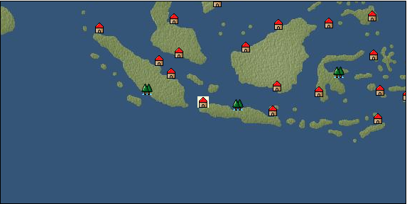

# Port: ジャカルタ

import Tabs from '@theme/Tabs';
import TabItem from '@theme/TabItem';

## General Information

| Attribute | Details |
| :--- | :--- |
| **Port Name** | jakarta |
| **Port Type** | port of alliance |
| **Region** | Southeast Asia |
| **Sea Area** | java sea |
| **Required Language** | Malayu Tagalog |
| **Coordinates** | （4815，4980） |
| **Investment Reward** | [Southeast Asian male costume sewing method](Items/Recipe Book/item_1977.md) （必要投資額：2,120,000ドゥカード） |

### Available Facilities

| guild | intermediary | exchange | tool shop | workshop craftsman | Painter | sculptor | peddler |
| --- | --- | --- | --- | --- | --- | --- | --- |
|   | ○ | ○ | ○ | ○ |   |   | ○ |
| Shipyard Master | Lumbermaker | Sail-maker | weapon craftsman | master | TavernFemale | archive | salesperson |
| --- | --- | --- | --- | --- | --- | --- | --- |
| ○ | ○ |   |   | ○ | ○ |   | ○ |
| Shipwright | 銀行 | street worker | 王宮 | Trading post | church | suburbs | translator |
| --- | --- | --- | --- | --- | --- | --- | --- |
| ○ | ○ | ○ |   |   |   |   | ○ |

### Description
A city located on the northwest coast of Java. It was originally a small village of Sundanese people called "Sunda Kelapa". The Sundanese established the Kingdom of Pajadjaran and did not succumb to the invasion of the Majapahit Kingdom. There appears to be no mercenary intermediary. Tavern woman: Lautu Trader (market information) Cultural area: Southeast Asia

<Tabs>
  <TabItem value="trade_goods_sales" label="Trade Goods Sales">

| item | group | purchase price | 同盟時 | remarks |
| --- | --- | --- | --- | --- |
| [duck](Items/Trade Goods/TradeGoods-Livestock/item_38.md) | [Trading Goods (Livestock)](Categories/category_18.md) | 64 | 56 |  |
| [Paddy rice](Items/Trade Goods/TradeGoods-Foodstuffs/item_654.md) | [Trading items (food items)](Categories/category_3.md) | 50 | (44) |  |
| [oil](Items/Trade Goods/TradeGoods-Wares/item_613.md) | [交易品（工業品）](Categories/category_19.md) | (580) | 508 |  |
| 要投資（必要投資額：240,000） |
| [魚肉](Items/Trade Goods/TradeGoods-Foodstuffs/item_10.md) | [Trading items (food items)](Categories/category_3.md) | 146 | 128 |  |
  </TabItem>
  <TabItem value="sale_specialty" label="Sale (Specialty)">

| item | group | sale price | 同盟時 | remarks |
| --- | --- | --- | --- | --- |

#### [交易品（繊維）](Categories/category_1.md)

| [Basho](Items/Trade Goods/TradeGoods-Fibers/item_3862.md) | [交易品（繊維）](Categories/category_1.md) | (5,119) | 5,973 |  |
| [feather](Items/Trade Goods/TradeGoods-Fibers/item_585.md) | [交易品（繊維）](Categories/category_1.md) | 860 | 911 |  |
| [Green ramie](Items/Trade Goods/TradeGoods-Fibers/item_3428.md) | [交易品（繊維）](Categories/category_1.md) | 4,909 | (5,523) |  |

#### [Trading Goods (Dye)](Categories/category_2.md)

| [mimosa](Items/Trade Goods/TradeGoods-Dye/item_2281.md) | [Trading Goods (Dye)](Categories/category_2.md) | 653 | (734) |  |
| [Locao](Items/Trade Goods/TradeGoods-Dye/item_3909.md) | [Trading Goods (Dye)](Categories/category_2.md) | (4,591) | 5,357 |  |

#### [Trading items (food items)](Categories/category_3.md)

| [kangaroo meat](Items/Trade Goods/TradeGoods-Foodstuffs/item_2285.md) | [Trading items (food items)](Categories/category_3.md) | 382 | 405 |  |
| [taro](Items/Trade Goods/TradeGoods-Foodstuffs/item_1960.md) | [Trading items (food items)](Categories/category_3.md) | 175 | 182 |  |
| [Chinese noodles](Items/Trade Goods/TradeGoods-Foodstuffs/item_3906.md) | [Trading items (food items)](Categories/category_3.md) | (5,161) | 6,022 |  |

#### [交易品（調味料）](Categories/category_4.md)

| [tamarind](Items/Trade Goods/TradeGoods-Seasonings/item_1968.md) | [交易品（調味料）](Categories/category_4.md) | (655) | 764 |  |
| [羅漢果](Items/Trade Goods/TradeGoods-Seasonings/item_4004.md) | [交易品（調味料）](Categories/category_4.md) | (2,229) | 2,600 |  |
| [Bean sauce](Items/Trade Goods/TradeGoods-Seasonings/item_3875.md) | [交易品（調味料）](Categories/category_4.md) | (4,504) | 5,255 |  |

#### [交易品（雑貨）](Categories/category_5.md)

| [chinese books](Items/Trade Goods/TradeGoods-Misc/item_3927.md) | [交易品（雑貨）](Categories/category_5.md) | (4,495) | 5,245 |  |
| [old ink stick](Items/Trade Goods/TradeGoods-Misc/item_3921.md) | [交易品（雑貨）](Categories/category_5.md) | (2,293) | 2,675 |  |

#### [Trading products (medical products)](Categories/category_6.md)

| [Saikaku](Items/Trade Goods/TradeGoods-Medicine/item_1959.md) | [Trading products (medical products)](Categories/category_6.md) | (1,697) | 1,979 |  |
| [tea tree](Items/Trade Goods/TradeGoods-Medicine/item_2283.md) | [Trading products (medical products)](Categories/category_6.md) | 611 | (687) |  |
| [Cordyceps sinensis](Items/Trade Goods/TradeGoods-Medicine/item_3839.md) | [Trading products (medical products)](Categories/category_6.md) | (4,450) | 5,192 |  |

#### [Trading Items (Iron Stone)](Categories/category_7.md)

| [red copper ore](Items/Trade Goods/TradeGoods-Minerals/item_3863.md) | [Trading Items (Iron Stone)](Categories/category_7.md) | (4,512) | 5,264 |  |

#### [Trading products (precious metals)](Categories/category_8.md)

| [platinum](Items/Trade Goods/TradeGoods-Metals/item_2178.md) | [Trading products (precious metals)](Categories/category_8.md) | 5,746 | (6,464) |  |
| [Jinguashijin](Items/Trade Goods/TradeGoods-Metals/item_3693.md) | [Trading products (precious metals)](Categories/category_8.md) | 12,282 | (13,818) |  |
| [雲南銀](Items/Trade Goods/TradeGoods-Metals/item_3905.md) | [Trading products (precious metals)](Categories/category_8.md) | (4,491) | 5,240 |  |

#### [Trading goods (hobby goods)](Categories/category_10.md)

| [macadamia nuts](Items/Trade Goods/TradeGoods-Sunddries/item_2282.md) | [Trading goods (hobby goods)](Categories/category_10.md) | 453 | (509) |  |
| [Chinese tea](Items/Trade Goods/TradeGoods-Sunddries/item_3907.md) | [Trading goods (hobby goods)](Categories/category_10.md) | (5,172) | 6,035 |  |
| [Korean tea](Items/Trade Goods/TradeGoods-Sunddries/item_3751.md) | [Trading goods (hobby goods)](Categories/category_10.md) | 8,490 | (9,552) |  |
| 非同盟時100% |

#### [Trading Goods (Spices)](Categories/category_11.md)

| [ylang ylang](Items/Trade Goods/TradeGoods-Perfume/item_1434.md) | [Trading Goods (Spices)](Categories/category_11.md) | 1,266 | (1,424) |  |
| [Osmanthus](Items/Trade Goods/TradeGoods-Perfume/item_3925.md) | [Trading Goods (Spices)](Categories/category_11.md) | (4,621) | 5,391 |  |
| [geranium](Items/Trade Goods/TradeGoods-Perfume/item_145.md) | [Trading Goods (Spices)](Categories/category_11.md) | 991 | (1,114) |  |
| [eucalyptus](Items/Trade Goods/TradeGoods-Perfume/item_2278.md) | [Trading Goods (Spices)](Categories/category_11.md) | 425 | (478) |  |
| [lira](Items/Trade Goods/TradeGoods-Perfume/item_30.md) | [Trading Goods (Spices)](Categories/category_11.md) | 1,400 | (1,575) |  |
| [貝甲香](Items/Trade Goods/TradeGoods-Perfume/item_776.md) | [Trading Goods (Spices)](Categories/category_11.md) | (1,367) | 1,594 |  |

#### [Trading Goods (Spices)](Categories/category_12.md)

| [Kouzuku](Items/Trade Goods/TradeGoods-Spices/item_3690.md) | [Trading Goods (Spices)](Categories/category_12.md) | (4,637) | 5,410 |  |
| [saffron](Items/Trade Goods/TradeGoods-Spices/item_845.md) | [Trading Goods (Spices)](Categories/category_12.md) | 4,215 | 4,956 |  |
| [star anise](Items/Trade Goods/TradeGoods-Spices/item_3908.md) | [Trading Goods (Spices)](Categories/category_12.md) | (5,195) | 6,061 |  |

#### [Trading goods (artificial goods)](Categories/category_13.md)

| [glasswork](Items/Trade Goods/TradeGoods-Luxuries/item_60.md) | [Trading goods (artificial goods)](Categories/category_13.md) | 2,460 | (2,767) |  |
| [Tumbaga](Items/Trade Goods/TradeGoods-Luxuries/item_3028.md) | [Trading goods (artificial goods)](Categories/category_13.md) | 9,403 | (10,579) |  |
| [Kuresute](Items/Trade Goods/TradeGoods-Luxuries/item_3897.md) | [Trading goods (artificial goods)](Categories/category_13.md) | (2,268) | 2,646 |  |
| [Song Baici](Items/Trade Goods/TradeGoods-Luxuries/item_3904.md) | [Trading goods (artificial goods)](Categories/category_13.md) | (4,608) | 5,376 |  |
| [湖筆](Items/Trade Goods/TradeGoods-Luxuries/item_3898.md) | [Trading goods (artificial goods)](Categories/category_13.md) | (2,263) | 2,640 |  |
| [Saori](Items/Trade Goods/TradeGoods-Luxuries/item_3676.md) | [Trading goods (artificial goods)](Categories/category_13.md) | (2,760) | 3,220 |  |

#### [交易品（美術品）](Categories/category_14.md)

| [chinese calligraphy](Items/Trade Goods/TradeGoods-Art/item_3926.md) | [交易品（美術品）](Categories/category_14.md) | (4,515) | 5,268 |  |

#### [Trading Items (Gemstones)](Categories/category_15.md)

| [inca rose](Items/Trade Goods/TradeGoods-Gems/item_3014.md) | [Trading Items (Gemstones)](Categories/category_15.md) | (11,046) | 12,889 |  |
| [opal](Items/Trade Goods/TradeGoods-Gems/item_2006.md) | [Trading Items (Gemstones)](Categories/category_15.md) | (8,504) | 9,922 |  |
| [diamond](Items/Trade Goods/TradeGoods-Gems/item_449.md) | [Trading Items (Gemstones)](Categories/category_15.md) | 5,020 | (5,648) |  |
| [topaz](Items/Trade Goods/TradeGoods-Gems/item_1097.md) | [Trading Items (Gemstones)](Categories/category_15.md) | (5,373) | 6,269 |  |
| [pink diamond](Items/Trade Goods/TradeGoods-Gems/item_2874.md) | [Trading Items (Gemstones)](Categories/category_15.md) | (3,585) | 4,183 |  |
| [ruby](Items/Trade Goods/TradeGoods-Gems/item_773.md) | [Trading Items (Gemstones)](Categories/category_15.md) | (3,743) | 4,367 |  |
| [taiwan sapphire](Items/Trade Goods/TradeGoods-Gems/item_3695.md) | [Trading Items (Gemstones)](Categories/category_15.md) | 11,510 | (12,950) |  |
| [amber](Items/Trade Goods/TradeGoods-Gems/item_618.md) | [Trading Items (Gemstones)](Categories/category_15.md) | 4,570 | (5,141) |  |
| [mutton fat white jade](Items/Trade Goods/TradeGoods-Gems/item_3903.md) | [Trading Items (Gemstones)](Categories/category_15.md) | (4,641) | 5,415 |  |

#### [Trading Items (Arms)](Categories/category_16.md)

| [damascus sword](Items/Trade Goods/TradeGoods-Weapons/item_903.md) | [Trading Items (Arms)](Categories/category_16.md) | 10,165 | (11,436) |  |
| [Blue dragon sword](Items/Trade Goods/TradeGoods-Weapons/item_3923.md) | [Trading Items (Arms)](Categories/category_16.md) | (4,445) | 5,186 |  |

#### [Trading Items (Firearms)](Categories/category_17.md)

| [musket gun](Items/Trade Goods/TradeGoods-Firearms/item_584.md) | [Trading Items (Firearms)](Categories/category_17.md) | (5,853) | 6,829 |  |
| [monocular gun](Items/Trade Goods/TradeGoods-Firearms/item_3916.md) | [Trading Items (Firearms)](Categories/category_17.md) | (4,541) | 5,298 |  |

#### [Trading Goods (Livestock)](Categories/category_18.md)

| [donkey](Items/Trade Goods/TradeGoods-Livestock/item_3924.md) | [Trading Goods (Livestock)](Categories/category_18.md) | (5,095) | 5,945 |  |

#### [交易品（工業品）](Categories/category_19.md)

| [bamboo](Items/Trade Goods/TradeGoods-Wares/item_3899.md) | [交易品（工業品）](Categories/category_19.md) | (4,433) | 5,172 |  |

#### [交易品（織物）](Categories/category_20.md)

| [Awaiyo](Items/Trade Goods/TradeGoods-Fabrics/item_3002.md) | [交易品（織物）](Categories/category_20.md) | 4,143 | (4,661) |  |
| [velvet](Items/Trade Goods/TradeGoods-Fabrics/item_902.md) | [交易品（織物）](Categories/category_20.md) | 5,194 | (5,843) |  |
| [唐錦](Items/Trade Goods/TradeGoods-Fabrics/item_3896.md) | [交易品（織物）](Categories/category_20.md) | (4,525) | 5,279 |  |
  </TabItem>
  <TabItem value="sale_no_specialty" label="Sale (No Specialty)">

| item | group | sale price | 同盟時 | remarks |
| --- | --- | --- | --- | --- |

#### [交易品（繊維）](Categories/category_1.md)

| [fur](Items/Trade Goods/TradeGoods-Fibers/item_634.md) | [交易品（繊維）](Categories/category_1.md) | 1,460 | (1,642) |  |
| [raw silk](Items/Trade Goods/TradeGoods-Fibers/item_677.md) | [交易品（繊維）](Categories/category_1.md) | 2,623 | (2,951) |  |
| [numb](Items/Trade Goods/TradeGoods-Fibers/item_900.md) | [交易品（繊維）](Categories/category_1.md) | 12 | (13) |  |

#### [Trading Goods (Dye)](Categories/category_2.md)

| [Indian indigo](Items/Trade Goods/TradeGoods-Dye/item_157.md) | [Trading Goods (Dye)](Categories/category_2.md) | (516) | 601 |  |

#### [Trading items (food items)](Categories/category_3.md)

| [duck meat](Items/Trade Goods/TradeGoods-Foodstuffs/item_32.md) | [Trading items (food items)](Categories/category_3.md) | 321 | (361) |  |
| [Cassava](Items/Trade Goods/TradeGoods-Foodstuffs/item_1805.md) | [Trading items (food items)](Categories/category_3.md) | 108 | 114 |  |
| [egg](Items/Trade Goods/TradeGoods-Foodstuffs/item_40.md) | [Trading items (food items)](Categories/category_3.md) | 35 | (39) |  |
| [strange fruit](Items/Trade Goods/TradeGoods-Foodstuffs/item_1673.md) | [Trading items (food items)](Categories/category_3.md) | 32 | (36) |  |
| [Paddy rice](Items/Trade Goods/TradeGoods-Foodstuffs/item_654.md) | [Trading items (food items)](Categories/category_3.md) | 22 | (24) |  |

#### [交易品（調味料）](Categories/category_4.md)

| [anchovies](Items/Trade Goods/TradeGoods-Seasonings/item_3004.md) | [交易品（調味料）](Categories/category_4.md) | 174 | (195) |  |
| [Nyoc mam](Items/Trade Goods/TradeGoods-Seasonings/item_1971.md) | [交易品（調味料）](Categories/category_4.md) | 261 | (293) |  |
| [lard](Items/Trade Goods/TradeGoods-Seasonings/item_43.md) | [交易品（調味料）](Categories/category_4.md) | 263 | (295) |  |
| [Honey](Items/Trade Goods/TradeGoods-Seasonings/item_49.md) | [交易品（調味料）](Categories/category_4.md) | 850 | 989 |  |
| [black vinegar](Items/Trade Goods/TradeGoods-Seasonings/item_3475.md) | [交易品（調味料）](Categories/category_4.md) | 1,583 | (1,781) |  |

#### [Trading products (medical products)](Categories/category_6.md)

| [senna](Items/Trade Goods/TradeGoods-Medicine/item_155.md) | [Trading products (medical products)](Categories/category_6.md) | 433 | (487) |  |
| [Noni](Items/Trade Goods/TradeGoods-Medicine/item_2099.md) | [Trading products (medical products)](Categories/category_6.md) | 506 | (569) |  |
| [Maca](Items/Trade Goods/TradeGoods-Medicine/item_3000.md) | [Trading products (medical products)](Categories/category_6.md) | 768 | (864) |  |

#### [Trading Items (Iron Stone)](Categories/category_7.md)

| [tin ore](Items/Trade Goods/TradeGoods-Minerals/item_23.md) | [Trading Items (Iron Stone)](Categories/category_7.md) | 560 | (630) |  |
| [iron ore](Items/Trade Goods/TradeGoods-Minerals/item_146.md) | [Trading Items (Iron Stone)](Categories/category_7.md) | 734 | (825) |  |
| [copper ore](Items/Trade Goods/TradeGoods-Minerals/item_65.md) | [Trading Items (Iron Stone)](Categories/category_7.md) | (786) | 916 |  |

#### [Trading goods (hobby goods)](Categories/category_10.md)

| [coconut](Items/Trade Goods/TradeGoods-Sunddries/item_96.md) | [Trading goods (hobby goods)](Categories/category_10.md) | 499 | 525 |  |
| [coffee](Items/Trade Goods/TradeGoods-Sunddries/item_445.md) | [Trading goods (hobby goods)](Categories/category_10.md) | (468) | 545 |  |
| [durian](Items/Trade Goods/TradeGoods-Sunddries/item_1949.md) | [Trading goods (hobby goods)](Categories/category_10.md) | 593 | (667) |  |
| [banana](Items/Trade Goods/TradeGoods-Sunddries/item_1947.md) | [Trading goods (hobby goods)](Categories/category_10.md) | 167 | (187) |  |
| [mango](Items/Trade Goods/TradeGoods-Sunddries/item_2095.md) | [Trading goods (hobby goods)](Categories/category_10.md) | (325) | 379 |  |
| [black tea](Items/Trade Goods/TradeGoods-Sunddries/item_675.md) | [Trading goods (hobby goods)](Categories/category_10.md) | 1,181 | (1,328) |  |

#### [Trading Goods (Spices)](Categories/category_11.md)

| [cedar wood](Items/Trade Goods/TradeGoods-Perfume/item_905.md) | [Trading Goods (Spices)](Categories/category_11.md) | (408) | 475 |  |
| [jasmine](Items/Trade Goods/TradeGoods-Perfume/item_772.md) | [Trading Goods (Spices)](Categories/category_11.md) | (3,133) | 3,655 |  |
| [patchouli](Items/Trade Goods/TradeGoods-Perfume/item_1963.md) | [Trading Goods (Spices)](Categories/category_11.md) | (1,295) | 1,510 |  |
| [benzoin](Items/Trade Goods/TradeGoods-Perfume/item_1962.md) | [Trading Goods (Spices)](Categories/category_11.md) | (887) | 1,035 |  |
| [agarwood](Items/Trade Goods/TradeGoods-Perfume/item_1058.md) | [Trading Goods (Spices)](Categories/category_11.md) | (2,136) | 2,492 |  |
| [sandalwood](Items/Trade Goods/TradeGoods-Perfume/item_771.md) | [Trading Goods (Spices)](Categories/category_11.md) | 1,445 | 1,447 |  |
| [Musk](Items/Trade Goods/TradeGoods-Perfume/item_158.md) | [Trading Goods (Spices)](Categories/category_11.md) | 3,854 | (4,336) |  |
| [龍脳](Items/Trade Goods/TradeGoods-Perfume/item_1676.md) | [Trading Goods (Spices)](Categories/category_11.md) | (1,255) | 1,464 |  |

#### [Trading Goods (Spices)](Categories/category_12.md)

| [garlic](Items/Trade Goods/TradeGoods-Spices/item_526.md) | [Trading Goods (Spices)](Categories/category_12.md) | 331 | (372) |  |
| [cloves](Items/Trade Goods/TradeGoods-Spices/item_1092.md) | [Trading Goods (Spices)](Categories/category_12.md) | (432) | 504 |  |
| [pepper](Items/Trade Goods/TradeGoods-Spices/item_58.md) | [Trading Goods (Spices)](Categories/category_12.md) | 517 | (581) |  |
| [cinnamon](Items/Trade Goods/TradeGoods-Spices/item_1432.md) | [Trading Goods (Spices)](Categories/category_12.md) | 208 | (234) |  |
| [ginger](Items/Trade Goods/TradeGoods-Spices/item_112.md) | [Trading Goods (Spices)](Categories/category_12.md) | 703 | (790) |  |
| [time](Items/Trade Goods/TradeGoods-Spices/item_432.md) | [Trading Goods (Spices)](Categories/category_12.md) | 415 | (466) |  |
| [nutmeg](Items/Trade Goods/TradeGoods-Spices/item_1969.md) | [Trading Goods (Spices)](Categories/category_12.md) | 516 | (580) |  |
| [mace](Items/Trade Goods/TradeGoods-Spices/item_2100.md) | [Trading Goods (Spices)](Categories/category_12.md) | 655 | (736) |  |

#### [Trading goods (artificial goods)](Categories/category_13.md)

| [皮革製品](Items/Trade Goods/TradeGoods-Luxuries/item_12.md) | [Trading goods (artificial goods)](Categories/category_13.md) | 1,327 | (1,493) |  |
| [goldsmith](Items/Trade Goods/TradeGoods-Luxuries/item_687.md) | [Trading goods (artificial goods)](Categories/category_13.md) | 3,549 | (3,993) |  |
| [silversmith](Items/Trade Goods/TradeGoods-Luxuries/item_619.md) | [Trading goods (artificial goods)](Categories/category_13.md) | 3,221 | (3,623) |  |
| [luxury clothing](Items/Trade Goods/TradeGoods-Luxuries/item_165.md) | [Trading goods (artificial goods)](Categories/category_13.md) | 4,050 | (4,556) |  |

#### [交易品（美術品）](Categories/category_14.md)

| [古美術品](Items/Trade Goods/TradeGoods-Art/item_51.md) | [交易品（美術品）](Categories/category_14.md) | 3,880 | (4,365) |  |
| [stone statue](Items/Trade Goods/TradeGoods-Art/item_899.md) | [交易品（美術品）](Categories/category_14.md) | (1,511) | 1,762 |  |
| [copperplate print](Items/Trade Goods/TradeGoods-Art/item_1087.md) | [交易品（美術品）](Categories/category_14.md) | 674 | (758) |  |

#### [Trading Items (Gemstones)](Categories/category_15.md)

| [jade](Items/Trade Goods/TradeGoods-Gems/item_2015.md) | [Trading Items (Gemstones)](Categories/category_15.md) | (1,916) | 2,235 |  |
| [Tortoiseshell](Items/Trade Goods/TradeGoods-Gems/item_1980.md) | [Trading Items (Gemstones)](Categories/category_15.md) | (1,245) | 1,452 |  |
| [sapphire](Items/Trade Goods/TradeGoods-Gems/item_676.md) | [Trading Items (Gemstones)](Categories/category_15.md) | (3,679) | 4,292 |  |
| [nephrite](Items/Trade Goods/TradeGoods-Gems/item_2314.md) | [Trading Items (Gemstones)](Categories/category_15.md) | 1,805 | (2,030) |  |
| [pearl](Items/Trade Goods/TradeGoods-Gems/item_769.md) | [Trading Items (Gemstones)](Categories/category_15.md) | (4,894) | 5,710 |  |
| [ivory](Items/Trade Goods/TradeGoods-Gems/item_699.md) | [Trading Items (Gemstones)](Categories/category_15.md) | (1,879) | 2,192 |  |

#### [Trading Items (Arms)](Categories/category_16.md)

| [dagger](Items/Trade Goods/TradeGoods-Weapons/item_143.md) | [Trading Items (Arms)](Categories/category_16.md) | (809) | 943 |  |

#### [Trading Items (Firearms)](Categories/category_17.md)

| [arquebus gun](Items/Trade Goods/TradeGoods-Firearms/item_14.md) | [Trading Items (Firearms)](Categories/category_17.md) | 2,442 | (2,747) |  |
| [大砲](Items/Trade Goods/TradeGoods-Firearms/item_4.md) | [Trading Items (Firearms)](Categories/category_17.md) | 4,940 | (5,558) |  |
| [bullet](Items/Trade Goods/TradeGoods-Firearms/item_13.md) | [Trading Items (Firearms)](Categories/category_17.md) | 1,298 | (1,460) |  |

#### [Trading Goods (Livestock)](Categories/category_18.md)

| [sheep](Items/Trade Goods/TradeGoods-Livestock/item_253.md) | [Trading Goods (Livestock)](Categories/category_18.md) | 131 | (147) |  |

#### [交易品（工業品）](Categories/category_19.md)

| [wax](Items/Trade Goods/TradeGoods-Wares/item_54.md) | [交易品（工業品）](Categories/category_19.md) | 856 | (963) |  |
| [wood](Items/Trade Goods/TradeGoods-Wares/item_277.md) | [交易品（工業品）](Categories/category_19.md) | 777 | 809 |  |
| [水銀](Items/Trade Goods/TradeGoods-Wares/item_15.md) | [交易品（工業品）](Categories/category_19.md) | 1,286 | (1,446) |  |
| [brass](Items/Trade Goods/TradeGoods-Wares/item_624.md) | [交易品（工業品）](Categories/category_19.md) | 751 | (844) |  |
| [coal](Items/Trade Goods/TradeGoods-Wares/item_359.md) | [交易品（工業品）](Categories/category_19.md) | 537 | (604) |  |
| [iron material](Items/Trade Goods/TradeGoods-Wares/item_268.md) | [交易品（工業品）](Categories/category_19.md) | 893 | (1,004) |  |
| [鉛](Items/Trade Goods/TradeGoods-Wares/item_895.md) | [交易品（工業品）](Categories/category_19.md) | 640 | (720) |  |

#### [交易品（織物）](Categories/category_20.md)

| [indian chintz](Items/Trade Goods/TradeGoods-Fabrics/item_159.md) | [交易品（織物）](Categories/category_20.md) | 1,354 | (1,523) |  |
| [java chintz](Items/Trade Goods/TradeGoods-Fabrics/item_1970.md) | [交易品（織物）](Categories/category_20.md) | (544) | 634 |  |
| [silk fabric](Items/Trade Goods/TradeGoods-Fabrics/item_823.md) | [交易品（織物）](Categories/category_20.md) | 2,686 | (3,022) |  |
| [cotton fabric](Items/Trade Goods/TradeGoods-Fabrics/item_571.md) | [交易品（織物）](Categories/category_20.md) | 1,109 | (1,247) |  |
| [linen fabric](Items/Trade Goods/TradeGoods-Fabrics/item_135.md) | [交易品（織物）](Categories/category_20.md) | 484 | (544) |  |
  </TabItem>
  <TabItem value="guild_&_others" label="Guild & Others">

| item | group | Sales price | Handling NPC | remarks |
| --- | --- | --- | --- | --- |

#### others

| [ivan](Items/Aides/item_1964.md) | [adjutant](Categories/category_46.md) | 100,000 |  |  |
| [Karen](Items/Aides/item_1966.md) | [adjutant](Categories/category_46.md) | 100,000 |  |  |
| [claudia](Items/Aides/item_2103.md) | [adjutant](Categories/category_46.md) | 100,000 |  |  |
| [Jorge](Items/Aides/item_2102.md) | [adjutant](Categories/category_46.md) | 100,000 |  |  |
| [vincent](Items/Aides/item_1965.md) | [adjutant](Categories/category_46.md) | 100,000 |  |  |
  </TabItem>
  <TabItem value="toolman" label="Toolman">

| item | group | Sales price | Handling NPC | remarks |
| --- | --- | --- | --- | --- |

#### [Equipment (body)](Categories/category_24.md)

| [pirate vest](Items/Equipment/Equipment-Body/item_98.md) | [Equipment (body)](Categories/category_24.md) | 18,500 | tool shop owner |  |

#### [Equipment (legs)](Categories/category_26.md)

| [cross strap sandals](Items/Equipment/Equipment-Feet/item_99.md) | [Equipment (legs)](Categories/category_26.md) | 7,300 | tool shop owner |  |

#### [Equipment (belongings)](Categories/category_27.md)

| [short sword](Items/Equipment/Equipment-Weapon/item_301.md) | [Equipment (belongings)](Categories/category_27.md) | 9,300 | tool shop owner |  |
| [Replenishment hoe](Items/Equipment/Equipment-Weapon/item_2298.md) | [Equipment (belongings)](Categories/category_27.md) | 1,000 | tool shop owner |  |

#### [装備品（服飾品）](Categories/category_28.md)

| [refill candle](Items/Equipment/Equipment-Accessory/item_2299.md) | [装備品（服飾品）](Categories/category_28.md) | 1,000 | tool shop owner |  |
| [refill bell](Items/Equipment/Equipment-Accessory/item_2300.md) | [装備品（服飾品）](Categories/category_28.md) | 1,000 | tool shop owner |  |
| [補充用漁網](Items/Equipment/Equipment-Accessory/item_2301.md) | [装備品（服飾品）](Categories/category_28.md) | 1,000 | tool shop owner |  |

#### [Consumables (land battle/deck battle)](Categories/category_29.md)

| [strong adhesive oil](Items/Consumables/Consumables-Landbattle/item_662.md) | [Consumables (land battle/deck battle)](Categories/category_29.md) | 200 | tool shop owner |  |
| [tonic](Items/Consumables/Consumables-Landbattle/item_1678.md) | [Consumables (land battle/deck battle)](Categories/category_29.md) | 300 | tool shop owner |  |
| [Arsenite poison](Items/Consumables/Consumables-Landbattle/item_663.md) | [Consumables (land battle/deck battle)](Categories/category_29.md) | 400 | tool shop owner |  |

#### [Consumables (skill activation)](Categories/category_31.md)

| [捕獲網](Items/Consumables/Consumables-Skill/item_315.md) | [Consumables (skill activation)](Categories/category_31.md) | 300 | tool shop owner |  |
| [research monocle](Items/Consumables/Consumables-Skill/item_120.md) | [Consumables (skill activation)](Categories/category_31.md) | 2,500 | tool shop owner |  |
  </TabItem>
  <TabItem value="kobo_craftsmen" label="Craftsman">

| item | group | Sales price | Handling NPC | remarks |
| --- | --- | --- | --- | --- |

#### [Consumables (condition recovery)](Categories/category_21.md)

| [Nostalgic carillon bell](Items/Consumables/Consumables-Recovery/item_245.md) | [Consumables (condition recovery)](Categories/category_21.md) | 200 | workshop craftsman |  |
| [Ship song sheet music](Items/Consumables/Consumables-Recovery/item_247.md) | [Consumables (condition recovery)](Categories/category_21.md) | 200 | workshop craftsman |  |

#### [Consumables (other)](Categories/category_44.md)

| [帆塗料](Items/Consumables/Consumables-Other/item_348.md) | [Consumables (other)](Categories/category_44.md) | 500 | workshop craftsman |  |
| [ship paint](Items/Consumables/Consumables-Other/item_347.md) | [Consumables (other)](Categories/category_44.md) | 500 | workshop craftsman |  |
  </TabItem>
  <TabItem value="peddler" label="peddler">

| item | group | Sales price | Handling NPC | remarks |
| --- | --- | --- | --- | --- |

#### [Consumables (condition recovery)](Categories/category_21.md)

| [spare sail](Items/Consumables/Consumables-Recovery/item_242.md) | [Consumables (condition recovery)](Categories/category_21.md) |  | peddler |  |
| [reserve rudder](Items/Consumables/Consumables-Recovery/item_243.md) | [Consumables (condition recovery)](Categories/category_21.md) |  | peddler |  |
| [hand bucket](Items/Consumables/Consumables-Recovery/item_69.md) | [Consumables (condition recovery)](Categories/category_21.md) |  | peddler |  |
| [fire extinguishing sand](Items/Consumables/Consumables-Recovery/item_68.md) | [Consumables (condition recovery)](Categories/category_21.md) |  | peddler |  |

#### [Consumables (land battle/deck battle)](Categories/category_29.md)

| [煙玉](Items/Consumables/Consumables-Landbattle/item_86.md) | [Consumables (land battle/deck battle)](Categories/category_29.md) |  | peddler |  |

#### [Consumables (naval/hand-to-hand combat)](Categories/category_30.md)

| [evacuation bell](Items/Consumables/Consumables-navalhand-to-hand combat/item_919.md) | [Consumables (naval/hand-to-hand combat)](Categories/category_30.md) |  | peddler |  |

#### [Consumables (skill activation)](Categories/category_31.md)

| [life aid](Items/Consumables/Consumables-Skill/item_67.md) | [Consumables (skill activation)](Categories/category_31.md) |  | peddler |  |
| [landmark ribbon](Items/Consumables/Consumables-Skill/item_316.md) | [Consumables (skill activation)](Categories/category_31.md) |  | peddler |  |
  </TabItem>
  <TabItem value="salesperson" label="salesperson">

| item | group | Sales price | Handling NPC | remarks |
| --- | --- | --- | --- | --- |

#### [Consumables (cooking)](Categories/category_32.md)

| [green curry](Items/Consumables/Consumables-Cooking/item_2016.md) | [Consumables (cooking)](Categories/category_32.md) |  | salesperson |  |
| [coconut rice curry](Items/Consumables/Consumables-Cooking/item_2020.md) | [Consumables (cooking)](Categories/category_32.md) |  | salesperson |  |
| [sinigang](Items/Consumables/Consumables-Cooking/item_2313.md) | [Consumables (cooking)](Categories/category_32.md) |  | salesperson |  |
| [Che](Items/Consumables/Consumables-Cooking/item_2222.md) | [Consumables (cooking)](Categories/category_32.md) |  | salesperson |  |
| [tom yum goong](Items/Consumables/Consumables-Cooking/item_1995.md) | [Consumables (cooking)](Categories/category_32.md) |  | salesperson |  |
| [Nasi goreng](Items/Consumables/Consumables-Cooking/item_2223.md) | [Consumables (cooking)](Categories/category_32.md) |  | salesperson |  |
| Memorial: Enjoy the taste of shrimp and rice cuisine from around the world |
| [Four](Items/Consumables/Consumables-Cooking/item_1996.md) | [Consumables (cooking)](Categories/category_32.md) |  | salesperson |  |
| [rice paper](Items/Consumables/Consumables-Cooking/item_1989.md) | [Consumables (cooking)](Categories/category_32.md) |  | salesperson |  |
  </TabItem>
  <TabItem value="translator" label="translator">

| item | group | Sales price | Handling NPC | remarks |
| --- | --- | --- | --- | --- |

#### [Consumables (skill activation)](Categories/category_31.md)

| [Southern languages ​​translation notes](Items/Consumables/Consumables-Skill/item_3788.md) | [Consumables (skill activation)](Categories/category_31.md) | 2,700 | translator |  |
  </TabItem>
  <TabItem value="shipyard" label="Shipyard">

### Shipyard Master

| item | group | Sales price | Handling NPC | remarks |
| --- | --- | --- | --- | --- |

#### [Boat](Categories/category_43.md)

| [sambouk](Items/Ships/item_783.md) | [Boat](Categories/category_43.md) | 1,000,000 | Shipyard Master |  |
| [Dow](Items/Ships/item_780.md) | [Boat](Categories/category_43.md) | 360,000 | Shipyard Master |  |
| [Varsha](Items/Ships/item_201.md) | [Boat](Categories/category_43.md) | 2,000 | Shipyard Master |  |
| [commercial thumb book](Items/Ships/item_785.md) | [Boat](Categories/category_43.md) | 1,100,000 | Shipyard Master |  |
| [commercial dow](Items/Ships/item_782.md) | [Boat](Categories/category_43.md) | 372,000 | Shipyard Master |  |
| [commercial varsha](Items/Ships/item_204.md) | [Boat](Categories/category_43.md) | 5,200 | Shipyard Master |  |
| [Battle Barsha](Items/Ships/item_203.md) | [Boat](Categories/category_43.md) | 5,100 | Shipyard Master |  |
| [exploration barsha](Items/Ships/item_202.md) | [Boat](Categories/category_43.md) | 5,000 | Shipyard Master |  |
| [Armed Sambouk](Items/Ships/item_784.md) | [Boat](Categories/category_43.md) | 1,000,000 | Shipyard Master |  |
| [assault dhow](Items/Ships/item_781.md) | [Boat](Categories/category_43.md) | 365,000 | Shipyard Master |  |

### Lumbermaker

| item | group | Sales price | Handling NPC | remarks |
| --- | --- | --- | --- | --- |

#### [Ship parts (additional armor)](Categories/category_35.md)

| [elm board](Items/Ship Parts/Shipparts-Plates/item_328.md) | [Ship parts (additional armor)](Categories/category_35.md) | 13,000 | Lumbermaker |  |
| [cedar board](Items/Ship Parts/Shipparts-Plates/item_353.md) | [Ship parts (additional armor)](Categories/category_35.md) | 800 | Lumbermaker |  |
| [teak board](Items/Ship Parts/Shipparts-Plates/item_813.md) | [Ship parts (additional armor)](Categories/category_35.md) | 22,000 | Lumbermaker |  |
| [beach board](Items/Ship Parts/Shipparts-Plates/item_327.md) | [Ship parts (additional armor)](Categories/category_35.md) | 6,400 | Lumbermaker |  |
| [red pine board](Items/Ship Parts/Shipparts-Plates/item_326.md) | [Ship parts (additional armor)](Categories/category_35.md) | 2,700 | Lumbermaker |  |
| [lightweight mahogany board](Items/Ship Parts/Shipparts-Plates/item_831.md) | [Ship parts (additional armor)](Categories/category_35.md) | 56,000 | Lumbermaker |  |
| [lightweight rosewood plank](Items/Ship Parts/Shipparts-Plates/item_832.md) | [Ship parts (additional armor)](Categories/category_35.md) | 110,000 | Lumbermaker |  |
  </TabItem>
</Tabs>