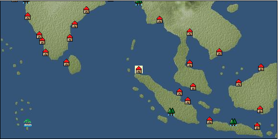

# Port: アチン

import Tabs from '@theme/Tabs';
import TabItem from '@theme/TabItem';

## General Information

| Attribute | Details |
| :--- | :--- |
| **Port Name** | Achin |
| **Port Type** | port of alliance |
| **Region** | Southeast Asia |
| **Sea Area** | andaman sea |
| **Required Language** | Malayu Tagalog |
| **Coordinates** | （4230，4560） |
| **Investment Reward** | [Lot (NO.13)](Items/Consumables/Consumables-Treasure-Chests/item_3021.md) （必要投資額：500,000ドゥカード） |

### Available Facilities

| guild | intermediary | exchange | tool shop | workshop craftsman | Painter | sculptor | peddler |
| --- | --- | --- | --- | --- | --- | --- | --- |
|   |   | ○ | ○ |   |   |   |   |
| Shipyard Master | Lumbermaker | Sail-maker | weapon craftsman | master | TavernFemale | archive | salesperson |
| --- | --- | --- | --- | --- | --- | --- | --- |
|   |   |   |   |   |   |   |   |
| Shipwright | 銀行 | street worker | 王宮 | Trading post | church | suburbs | translator |
| --- | --- | --- | --- | --- | --- | --- | --- |
| ○ | ○ | ○ |   |   |   |   |   |

### Description
A city located at the northern tip of Sumatra. It is the capital of the Kingdom of Aceh, which was independent from the Kingdom of Majapahit. Added on December 6, 2006 Cultural area: Southeast Asia

<Tabs>
  <TabItem value="trade_goods_sales" label="Trade Goods Sales">

| item | group | purchase price | 同盟時 | remarks |
| --- | --- | --- | --- | --- |
| [pepper](Items/Trade Goods/TradeGoods-Spices/item_58.md) | [Trading Goods (Spices)](Categories/category_12.md) | (292) | 256 |  |
| [Saikaku](Items/Trade Goods/TradeGoods-Medicine/item_1959.md) | [Trading products (medical products)](Categories/category_6.md) | (1,647) | 1,441 |  |
| [ivory](Items/Trade Goods/TradeGoods-Gems/item_699.md) | [Trading Items (Gemstones)](Categories/category_15.md) | (1,924) | 1,684 |  |
| [chicken meat](Items/Trade Goods/TradeGoods-Foodstuffs/item_29.md) | [Trading items (food items)](Categories/category_3.md) | 328 | 288 |  |
| [龍脳](Items/Trade Goods/TradeGoods-Perfume/item_1676.md) | [Trading Goods (Spices)](Categories/category_11.md) | (1,240) | 1,085 |  |
  </TabItem>
  <TabItem value="sale_specialty" label="Sale (Specialty)">

| item | group | sale price | 同盟時 | remarks |
| --- | --- | --- | --- | --- |

#### [Trading products (precious metals)](Categories/category_8.md)

| [platinum](Items/Trade Goods/TradeGoods-Metals/item_2178.md) | [Trading products (precious metals)](Categories/category_8.md) | (5,595) | 6,528 |  |

#### [Trading goods (artificial goods)](Categories/category_13.md)

| [Tumbaga](Items/Trade Goods/TradeGoods-Luxuries/item_3028.md) | [Trading goods (artificial goods)](Categories/category_13.md) | 12,200 | (13,726) |  |

#### [Trading Items (Gemstones)](Categories/category_15.md)

| [topaz](Items/Trade Goods/TradeGoods-Gems/item_1097.md) | [Trading Items (Gemstones)](Categories/category_15.md) | (5,504) | 6,422 |  |
| [pink diamond](Items/Trade Goods/TradeGoods-Gems/item_2874.md) | [Trading Items (Gemstones)](Categories/category_15.md) | 4,148 | (4,666) |  |

#### [Trading Items (Firearms)](Categories/category_17.md)

| [musket gun](Items/Trade Goods/TradeGoods-Firearms/item_584.md) | [Trading Items (Firearms)](Categories/category_17.md) | (5,653) | 6,596 |  |
  </TabItem>
  <TabItem value="sale_no_specialty" label="Sale (No Specialty)">

| item | group | sale price | 同盟時 | remarks |
| --- | --- | --- | --- | --- |

#### [Trading Goods (Dye)](Categories/category_2.md)

| [Indian indigo](Items/Trade Goods/TradeGoods-Dye/item_157.md) | [Trading Goods (Dye)](Categories/category_2.md) | (516) | 601 |  |

#### [Trading items (food items)](Categories/category_3.md)

| [taro](Items/Trade Goods/TradeGoods-Foodstuffs/item_1960.md) | [Trading items (food items)](Categories/category_3.md) | 176 | 193 |  |

#### [Trading Items (Iron Stone)](Categories/category_7.md)

| [Saltpeter](Items/Trade Goods/TradeGoods-Minerals/item_884.md) | [Trading Items (Iron Stone)](Categories/category_7.md) | (1,714) | 2,000 |  |

#### [Trading products (precious metals)](Categories/category_8.md)

| [gold](Items/Trade Goods/TradeGoods-Metals/item_659.md) | [Trading products (precious metals)](Categories/category_8.md) | (5,904) | 6,888 |  |

#### [Trading goods (hobby goods)](Categories/category_10.md)

| [banana](Items/Trade Goods/TradeGoods-Sunddries/item_1947.md) | [Trading goods (hobby goods)](Categories/category_10.md) | 167 | 172 |  |
| [mango](Items/Trade Goods/TradeGoods-Sunddries/item_2095.md) | [Trading goods (hobby goods)](Categories/category_10.md) | 363 | 379 |  |
| [black tea](Items/Trade Goods/TradeGoods-Sunddries/item_675.md) | [Trading goods (hobby goods)](Categories/category_10.md) | (1,104) | 1,288 |  |

#### [Trading Goods (Spices)](Categories/category_11.md)

| [patchouli](Items/Trade Goods/TradeGoods-Perfume/item_1963.md) | [Trading Goods (Spices)](Categories/category_11.md) | (1,299) | 1,515 |  |
| [benzoin](Items/Trade Goods/TradeGoods-Perfume/item_1962.md) | [Trading Goods (Spices)](Categories/category_11.md) | (889) | 1,037 |  |
| [sandalwood](Items/Trade Goods/TradeGoods-Perfume/item_771.md) | [Trading Goods (Spices)](Categories/category_11.md) | (1,241) | 1,448 |  |
| [Musk](Items/Trade Goods/TradeGoods-Perfume/item_158.md) | [Trading Goods (Spices)](Categories/category_11.md) | (3,540) | 4,130 |  |

#### [Trading Goods (Spices)](Categories/category_12.md)

| [cloves](Items/Trade Goods/TradeGoods-Spices/item_1092.md) | [Trading Goods (Spices)](Categories/category_12.md) | (432) | 503 |  |

#### [Trading goods (artificial goods)](Categories/category_13.md)

| [goldsmith](Items/Trade Goods/TradeGoods-Luxuries/item_687.md) | [Trading goods (artificial goods)](Categories/category_13.md) | 3,563 | (4,008) |  |

#### [Trading Items (Gemstones)](Categories/category_15.md)

| [jade](Items/Trade Goods/TradeGoods-Gems/item_2015.md) | [Trading Items (Gemstones)](Categories/category_15.md) | (1,910) | 2,228 |  |
| [Tortoiseshell](Items/Trade Goods/TradeGoods-Gems/item_1980.md) | [Trading Items (Gemstones)](Categories/category_15.md) | (1,241) | 1,447 |  |
| [sapphire](Items/Trade Goods/TradeGoods-Gems/item_676.md) | [Trading Items (Gemstones)](Categories/category_15.md) | (3,679) | 4,292 |  |
| [ruby](Items/Trade Goods/TradeGoods-Gems/item_773.md) | [Trading Items (Gemstones)](Categories/category_15.md) | (3,735) | 4,358 |  |
| [pearl](Items/Trade Goods/TradeGoods-Gems/item_769.md) | [Trading Items (Gemstones)](Categories/category_15.md) | (4,882) | 5,696 |  |

#### [交易品（工業品）](Categories/category_19.md)

| [wood](Items/Trade Goods/TradeGoods-Wares/item_277.md) | [交易品（工業品）](Categories/category_19.md) | (694) | 809 |  |
| [iron material](Items/Trade Goods/TradeGoods-Wares/item_268.md) | [交易品（工業品）](Categories/category_19.md) | (799) | 932 |  |

#### [交易品（織物）](Categories/category_20.md)

| [indian chintz](Items/Trade Goods/TradeGoods-Fabrics/item_159.md) | [交易品（織物）](Categories/category_20.md) | 1,300 | 1,391 |  |
| [silk fabric](Items/Trade Goods/TradeGoods-Fabrics/item_823.md) | [交易品（織物）](Categories/category_20.md) | (2,351) | 2,743 |  |
  </TabItem>
  <TabItem value="guild_&_others" label="Guild & Others">

| item | group | Sales price | Handling NPC | remarks |
| --- | --- | --- | --- | --- |
| There is no sales information for the item |
| --- |
  </TabItem>
  <TabItem value="toolman" label="Toolman">

| item | group | Sales price | Handling NPC | remarks |
| --- | --- | --- | --- | --- |

#### [Equipment (body)](Categories/category_24.md)

| [pirate vest](Items/Equipment/Equipment-Body/item_98.md) | [Equipment (body)](Categories/category_24.md) | 18,500 | tool shop owner |  |

#### [Equipment (legs)](Categories/category_26.md)

| [cross strap sandals](Items/Equipment/Equipment-Feet/item_99.md) | [Equipment (legs)](Categories/category_26.md) | 7,300 | tool shop owner |  |

#### [Equipment (belongings)](Categories/category_27.md)

| [short sword](Items/Equipment/Equipment-Weapon/item_301.md) | [Equipment (belongings)](Categories/category_27.md) | 9,300 | tool shop owner |  |

#### [Consumables (land battle/deck battle)](Categories/category_29.md)

| [strong adhesive oil](Items/Consumables/Consumables-Landbattle/item_662.md) | [Consumables (land battle/deck battle)](Categories/category_29.md) | 200 | tool shop owner |  |
| [tonic](Items/Consumables/Consumables-Landbattle/item_1678.md) | [Consumables (land battle/deck battle)](Categories/category_29.md) | 300 | tool shop owner |  |
| [Arsenite poison](Items/Consumables/Consumables-Landbattle/item_663.md) | [Consumables (land battle/deck battle)](Categories/category_29.md) | 400 | tool shop owner |  |

#### [Consumables (skill activation)](Categories/category_31.md)

| [捕獲網](Items/Consumables/Consumables-Skill/item_315.md) | [Consumables (skill activation)](Categories/category_31.md) | 300 | tool shop owner |  |
| [research monocle](Items/Consumables/Consumables-Skill/item_120.md) | [Consumables (skill activation)](Categories/category_31.md) | 2,500 | tool shop owner |  |

#### [Consumables (request documents)](Categories/category_45.md)

| [Livestock purchase order](Items/Consumables/Consumables-Documents/item_4917.md) | [Consumables (request documents)](Categories/category_45.md) | 20,000 | tool shop owner |  |
  </TabItem>
</Tabs>