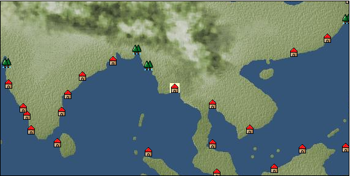

# Port: ペグー

import Tabs from '@theme/Tabs';
import TabItem from '@theme/TabItem';

## General Information

| Attribute | Details |
| :--- | :--- |
| **Port Name** | Pegu |
| **Port Type** | port of alliance |
| **Region** | Southeast Asia |
| **Sea Area** | bay of bengal |
| **Required Language** | Thai-Burmese |
| **Coordinates** | （4405，4140） |
| **Investment Reward** | [Lot (NO.12)](Items/Consumables/Consumables-Treasure-Chests/item_3015.md) （必要投資額：500,000ドゥカード） |

### Available Facilities

| guild | intermediary | exchange | tool shop | workshop craftsman | Painter | sculptor | peddler |
| --- | --- | --- | --- | --- | --- | --- | --- |
|   |   | ○ | ○ |   |   |   |   |
| Shipyard Master | Lumbermaker | Sail-maker | weapon craftsman | master | TavernFemale | archive | salesperson |
| --- | --- | --- | --- | --- | --- | --- | --- |
|   |   |   |   |   |   |   |   |
| Shipwright | 銀行 | street worker | 王宮 | Trading post | church | suburbs | translator |
| --- | --- | --- | --- | --- | --- | --- | --- |
| ○ | ○ | ○ |   |   |   | ○ |   |

### Description
A city located on the eastern shore of the Bay of Bengal. It is a city built by the Mon people, one of the ethnic groups living in Southeast Asia, and is also the capital of the Pegu Dynasty. Suburbs: Pegu North Cultural Area: Indochina

<Tabs>
  <TabItem value="trade_goods_sales" label="Trade Goods Sales">

| item | group | purchase price | 同盟時 | remarks |
| --- | --- | --- | --- | --- |
| [jade](Items/Trade Goods/TradeGoods-Gems/item_2015.md) | [Trading Items (Gemstones)](Categories/category_15.md) | (1,645) | 1,440 |  |
| 要投資（必要投資額：400,000） |
| [Tortoiseshell](Items/Trade Goods/TradeGoods-Gems/item_1980.md) | [Trading Items (Gemstones)](Categories/category_15.md) | (1,353) | 1,184 |  |
| 要投資（必要投資額：320,000） |
| [ruby](Items/Trade Goods/TradeGoods-Gems/item_773.md) | [Trading Items (Gemstones)](Categories/category_15.md) | (3,095) | 2,708 |  |
| 要投資（必要投資額：500,000） |
| [soybeans](Items/Trade Goods/TradeGoods-Foodstuffs/item_1958.md) | [Trading items (food items)](Categories/category_3.md) | (73) | 64 |  |
| [wood](Items/Trade Goods/TradeGoods-Wares/item_277.md) | [交易品（工業品）](Categories/category_19.md) | (676) | 592 |  |
| [pearl](Items/Trade Goods/TradeGoods-Gems/item_769.md) | [Trading Items (Gemstones)](Categories/category_15.md) | (3,881) | 3,396 |  |
| 要投資（必要投資額：320,000） |
| [silk fabric](Items/Trade Goods/TradeGoods-Fabrics/item_823.md) | [交易品（織物）](Categories/category_20.md) | (2,514) | 2,200 |  |
  </TabItem>
  <TabItem value="sale_specialty" label="Sale (Specialty)">

| item | group | sale price | 同盟時 | remarks |
| --- | --- | --- | --- | --- |

#### [交易品（酒類）](Categories/category_9.md)

| [aquavit](Items/Trade Goods/TradeGoods-Alcohol/item_572.md) | 交易品（酒類） | [Edit Sale Price](Ports/port_137.md) |  |
| [tequila](Items/Trade Goods/TradeGoods-Alcohol/item_108.md) | 交易品（酒類） | 2,009 | (2,260) |  |
| [Andong soju](Items/Trade Goods/TradeGoods-Alcohol/item_3757.md) | 交易品（酒類） | (7,586) | 8,851 |  |

#### [Trading goods (hobby goods)](Categories/category_10.md)

| [tobacco](Items/Trade Goods/TradeGoods-Sunddries/item_109.md) | Trading goods (hobby goods) | 1,409 | (1,585) |  |
| [dried figs](Items/Trade Goods/TradeGoods-Sunddries/item_611.md) | Trading goods (hobby goods) | 529 | (595) |  |

#### [Trading Goods (Spices)](Categories/category_11.md)

| [oakmoss](Items/Trade Goods/TradeGoods-Perfume/item_819.md) | Trading Goods (Spices) | 1,470 | (1,653) |  |
| [lira](Items/Trade Goods/TradeGoods-Perfume/item_30.md) | Trading Goods (Spices) | 1,500 | (1,687) |  |

#### [Trading goods (artificial goods)](Categories/category_13.md)

| [glasswork](Items/Trade Goods/TradeGoods-Luxuries/item_60.md) | Trading goods (artificial goods) | 2,628 | (2,956) |  |
| [Tumbaga](Items/Trade Goods/TradeGoods-Luxuries/item_3028.md) | Trading goods (artificial goods) | 10,845 | (12,201) |  |

#### [Trading Items (Gemstones)](Categories/category_15.md)

| [topaz](Items/Trade Goods/TradeGoods-Gems/item_1097.md) | Trading Items (Gemstones) | 5,816 | (6,543) |  |
| [pink diamond](Items/Trade Goods/TradeGoods-Gems/item_2874.md) | Trading Items (Gemstones) | 4,060 | (4,567) |  |
| [amber](Items/Trade Goods/TradeGoods-Gems/item_618.md) | Trading Items (Gemstones) | 5,474 | (6,158) |  |

#### [Trading Items (Arms)](Categories/category_16.md)

| [damascus sword](Items/Trade Goods/TradeGoods-Weapons/item_903.md) | Trading Items (Arms) | 9,513 | (10,703) |  |

#### [Trading Items (Firearms)](Categories/category_17.md)

| [musket gun](Items/Trade Goods/TradeGoods-Firearms/item_584.md) | Trading Items (Firearms) | 6,137 | 6,250 |  |

#### [交易品（工業品）](Categories/category_19.md)

| [rubber](Items/Trade Goods/TradeGoods-Wares/item_2819.md) | 交易品（工業品） | 1,491 | (1,677) |  |
| [marble](Items/Trade Goods/TradeGoods-Wares/item_52.md) | 交易品（工業品） | 3,112 | (3,501) |  |

#### [交易品（織物）](Categories/category_20.md)

| [dutch calico](Items/Trade Goods/TradeGoods-Fabrics/item_1435.md) | 交易品（織物） | 2,011 | (2,262) |  |
| [damask](Items/Trade Goods/TradeGoods-Fabrics/item_614.md) | 交易品（織物） | 6,662 | (7,495) |  |
| [turkish rug](Items/Trade Goods/TradeGoods-Fabrics/item_686.md) | 交易品（織物） | 10,775 | (12,123) |  |
| [flannel](Items/Trade Goods/TradeGoods-Fabrics/item_149.md) | 交易品（織物） | 2,774 | (3,121) |  |
| [velvet](Items/Trade Goods/TradeGoods-Fabrics/item_902.md) | 交易品（織物） | 5,049 | (5,680) |  |
  </TabItem>
  <TabItem value="sale_no_specialty" label="Sale (No Specialty)">

| item | group | sale price | 同盟時 | remarks |
| --- | --- | --- | --- | --- |

#### [交易品（繊維）](Categories/category_1.md)

| [cotton](Items/Trade Goods/TradeGoods-Fibers/item_610.md) | 交易品（繊維） | 618 | (695) |  |

#### [Trading Goods (Dye)](Categories/category_2.md)

| [Indian indigo](Items/Trade Goods/TradeGoods-Dye/item_157.md) | Trading Goods (Dye) | (496) | 578 |  |

#### [Trading items (food items)](Categories/category_3.md)

| [taro](Items/Trade Goods/TradeGoods-Foodstuffs/item_1960.md) | Trading items (food items) | 175 | 193 |  |

#### [Trading products (medical products)](Categories/category_6.md)

| [Saikaku](Items/Trade Goods/TradeGoods-Medicine/item_1959.md) | Trading products (medical products) | 1,831 | 1,920 |  |
| [Noni](Items/Trade Goods/TradeGoods-Medicine/item_2099.md) | Trading products (medical products) | 523 | (588) |  |

#### [Trading products (precious metals)](Categories/category_8.md)

| [gold](Items/Trade Goods/TradeGoods-Metals/item_659.md) | Trading products (precious metals) | 6,584 | (7,407) |  |
| Approximate estimate |

#### [交易品（酒類）](Categories/category_9.md)

| [Beer](Items/Trade Goods/TradeGoods-Alcohol/item_2.md) | 交易品（酒類） | (288) | 336 |  |
| [Milk liquor](Items/Trade Goods/TradeGoods-Alcohol/item_2897.md) | 交易品（酒類） | 368 | (414) |  |

#### [Trading goods (hobby goods)](Categories/category_10.md)

| [banana](Items/Trade Goods/TradeGoods-Sunddries/item_1947.md) | Trading goods (hobby goods) | 166 | 172 |  |
| [mango](Items/Trade Goods/TradeGoods-Sunddries/item_2095.md) | Trading goods (hobby goods) | (325) | 379 |  |
| [black tea](Items/Trade Goods/TradeGoods-Sunddries/item_675.md) | Trading goods (hobby goods) | (1,107) | 1,291 |  |

#### [Trading Goods (Spices)](Categories/category_11.md)

| [patchouli](Items/Trade Goods/TradeGoods-Perfume/item_1963.md) | Trading Goods (Spices) | (1,302) | 1,519 |  |
| [benzoin](Items/Trade Goods/TradeGoods-Perfume/item_1962.md) | Trading Goods (Spices) | (885) | 1,032 |  |
| [agarwood](Items/Trade Goods/TradeGoods-Perfume/item_1058.md) | Trading Goods (Spices) | 2,490 | (2,801) |  |
| [sandalwood](Items/Trade Goods/TradeGoods-Perfume/item_771.md) | Trading Goods (Spices) | 1,445 | 1,456 |  |
| [龍脳](Items/Trade Goods/TradeGoods-Perfume/item_1676.md) | Trading Goods (Spices) | 1,387 | 1,472 |  |

#### [Trading Goods (Spices)](Categories/category_12.md)

| [cloves](Items/Trade Goods/TradeGoods-Spices/item_1092.md) | Trading Goods (Spices) | 499 | (561) |  |
| [pepper](Items/Trade Goods/TradeGoods-Spices/item_58.md) | Trading Goods (Spices) | 176 | 205 |  |
| [Sesame](Items/Trade Goods/TradeGoods-Spices/item_437.md) | Trading Goods (Spices) | 327 | (367) |  |

#### [Trading goods (artificial goods)](Categories/category_13.md)

| [goldsmith](Items/Trade Goods/TradeGoods-Luxuries/item_687.md) | Trading goods (artificial goods) | 3,563 | (4,008) |  |

#### [交易品（美術品）](Categories/category_14.md)

| [stone statue](Items/Trade Goods/TradeGoods-Art/item_899.md) | 交易品（美術品） | 1,610 | (1,811) |  |

#### [Trading Items (Gemstones)](Categories/category_15.md)

| [garnet](Items/Trade Goods/TradeGoods-Gems/item_1005.md) | Trading Items (Gemstones) | 1,947 | (2,190) |  |
| [ivory](Items/Trade Goods/TradeGoods-Gems/item_699.md) | Trading Items (Gemstones) | (1,879) | 2,192 |  |

#### [Trading Items (Arms)](Categories/category_16.md)

| [dagger](Items/Trade Goods/TradeGoods-Weapons/item_143.md) | Trading Items (Arms) | (809) | 943 |  |

#### [交易品（工業品）](Categories/category_19.md)

| [Stone](Items/Trade Goods/TradeGoods-Wares/item_276.md) | 交易品（工業品） | 616 | (693) |  |
| [iron material](Items/Trade Goods/TradeGoods-Wares/item_268.md) | 交易品（工業品） | 932 | (1,048) |  |

#### [交易品（織物）](Categories/category_20.md)

| [indian chintz](Items/Trade Goods/TradeGoods-Fabrics/item_159.md) | 交易品（織物） | (1,187) | 1,385 |  |
  </TabItem>
  <TabItem value="guild_&_others" label="Guild & Others">

| item | group | Sales price | Handling NPC | remarks |
| --- | --- | --- | --- | --- |
| There is no sales information for the item |
| --- |
  </TabItem>
  <TabItem value="toolman" label="Toolman">

| item | group | Sales price | Handling NPC | remarks |
| --- | --- | --- | --- | --- |

#### [Equipment (body)](Categories/category_24.md)

| [pirate vest](Items/Equipment/Equipment-Body/item_98.md) | Equipment (body) | 18,500 | tool shop owner |  |

#### [Equipment (legs)](Categories/category_26.md)

| [cross strap sandals](Items/Equipment/Equipment-Feet/item_99.md) | Equipment (legs) | 7,300 | tool shop owner |  |

#### [Equipment (belongings)](Categories/category_27.md)

| [short sword](Items/Equipment/Equipment-Weapon/item_301.md) | Equipment (belongings) | 9,300 | tool shop owner |  |

#### [Consumables (land battle/deck battle)](Categories/category_29.md)

| [strong adhesive oil](Items/Consumables/Consumables-Landbattle/item_662.md) | Consumables (land battle/deck battle) | 200 | tool shop owner |  |
| [tonic](Items/Consumables/Consumables-Landbattle/item_1678.md) | Consumables (land battle/deck battle) | 300 | tool shop owner |  |
| [Arsenite poison](Items/Consumables/Consumables-Landbattle/item_663.md) | Consumables (land battle/deck battle) | 400 | tool shop owner |  |

#### [Consumables (skill activation)](Categories/category_31.md)

| [捕獲網](Items/Consumables/Consumables-Skill/item_315.md) | Consumables (skill activation) | 300 | tool shop owner |  |
| [research monocle](Items/Consumables/Consumables-Skill/item_120.md) | Consumables (skill activation) | 2,500 | tool shop owner |  |
  </TabItem>
</Tabs>