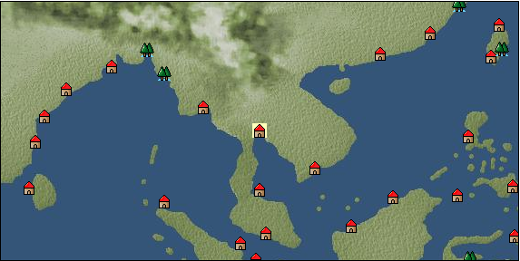

# Port: ロッブリー

import Tabs from '@theme/Tabs';
import TabItem from '@theme/TabItem';

## General Information

| Attribute | Details |
| :--- | :--- |
| **Port Name** | Lopburi |
| **Port Type** | port of alliance |
| **Region** | Southeast Asia |
| **Sea Area** | Gulf of Siam |
| **Required Language** | Thai-Burmese |
| **Coordinates** | （4652，4245） |
| **Investment Reward** | [Lot (NO.12)](Items/Consumables/Consumables-Treasure-Chests/item_3015.md) （必要投資額：500,000ドゥカード） |

### Available Facilities

| guild | intermediary | exchange | tool shop | workshop craftsman | Painter | sculptor | peddler |
| --- | --- | --- | --- | --- | --- | --- | --- |
|   |   | ○ | ○ |   |   |   |   |
| Shipyard Master | Lumbermaker | Sail-maker | weapon craftsman | master | TavernFemale | archive | salesperson |
| --- | --- | --- | --- | --- | --- | --- | --- |
|   |   |   |   | ○ |   |   |   |
| Shipwright | 銀行 | street worker | 王宮 | Trading post | church | suburbs | translator |
| --- | --- | --- | --- | --- | --- | --- | --- |
| ○ | ○ | ○ |   |   |   |   |   |

### Description
A city along the Chao Phraya River. It was called Lawau until the 10th century. After becoming known as a city of the Khmer Mon people, it flourished as an important city in Ayutthaya. Trader (market information) Cultural area: Indochina

<Tabs>
  <TabItem value="trade_goods_sales" label="Trade Goods Sales">

| item | group | purchase price | 同盟時 | remarks |
| --- | --- | --- | --- | --- |
| [tin ore](Items/Trade Goods/TradeGoods-Minerals/item_23.md) | [Trading Items (Iron Stone)](Categories/category_7.md) | 483 | 424 |  |
| When in alliance: confirmed at 100% |
| [Panya](Items/Trade Goods/TradeGoods-Fibers/item_2097.md) | [交易品（繊維）](Categories/category_1.md) | 347 | 304 |  |
| [mango](Items/Trade Goods/TradeGoods-Sunddries/item_2095.md) | [Trading goods (hobby goods)](Categories/category_10.md) | 360 | 316 |  |
| [lemongrass](Items/Trade Goods/TradeGoods-Spices/item_2096.md) | [Trading Goods (Spices)](Categories/category_12.md) | 123 | 108 |  |
| [Paddy rice](Items/Trade Goods/TradeGoods-Foodstuffs/item_654.md) | [Trading items (food items)](Categories/category_3.md) | 50 | 44 |  |
| [leather](Items/Trade Goods/TradeGoods-Fibers/item_44.md) | [交易品（繊維）](Categories/category_1.md) | 424 | 372 |  |
| [silk fabric](Items/Trade Goods/TradeGoods-Fabrics/item_823.md) | [交易品（織物）](Categories/category_20.md) | 2,505 | 2,199 |  |
  </TabItem>
  <TabItem value="sale_specialty" label="Sale (Specialty)">

| item | group | sale price | 同盟時 | remarks |
| --- | --- | --- | --- | --- |

#### [Trading Goods (Dye)](Categories/category_2.md)

| [ward](Items/Trade Goods/TradeGoods-Dye/item_57.md) | [Trading Goods (Dye)](Categories/category_2.md) | (1,792) | 2,090 |  |
| 98%＝2070　103%＝2120 |

#### [Trading goods (hobby goods)](Categories/category_10.md)

| [tobacco](Items/Trade Goods/TradeGoods-Sunddries/item_109.md) | [Trading goods (hobby goods)](Categories/category_10.md) | 1,356 | (1,525) |  |

#### [Trading Goods (Spices)](Categories/category_12.md)

| [Grapefruit](Items/Trade Goods/TradeGoods-Spices/item_3422.md) | [Trading Goods (Spices)](Categories/category_12.md) | 11,445 | 13,302 |  |

#### [Trading goods (artificial goods)](Categories/category_13.md)

| [glasswork](Items/Trade Goods/TradeGoods-Luxuries/item_60.md) | [Trading goods (artificial goods)](Categories/category_13.md) | (2,323) | 2,710 |  |
| When in alliance: confirmed at 100% |

#### [Trading Items (Gemstones)](Categories/category_15.md)

| [topaz](Items/Trade Goods/TradeGoods-Gems/item_1097.md) | [Trading Items (Gemstones)](Categories/category_15.md) | 5,816 | (6,543) |  |
| [pink diamond](Items/Trade Goods/TradeGoods-Gems/item_2874.md) | [Trading Items (Gemstones)](Categories/category_15.md) | 4,095 | (4,607) |  |

#### [Trading Items (Arms)](Categories/category_16.md)

| [damascus sword](Items/Trade Goods/TradeGoods-Weapons/item_903.md) | [Trading Items (Arms)](Categories/category_16.md) | (8,545) | 9,970 |  |
| When in alliance: confirmed at 100% |

#### [交易品（工業品）](Categories/category_19.md)

| [rubber](Items/Trade Goods/TradeGoods-Wares/item_2819.md) | [交易品（工業品）](Categories/category_19.md) | 1,575 | (1,772) |  |

#### [交易品（織物）](Categories/category_20.md)

| [damask](Items/Trade Goods/TradeGoods-Fabrics/item_614.md) | [交易品（織物）](Categories/category_20.md) | (6,788) | 7,920 |  |
| When in alliance: confirmed at 100% |
| [turkish rug](Items/Trade Goods/TradeGoods-Fabrics/item_686.md) | [交易品（織物）](Categories/category_20.md) | 8,686 | (9,772) |  |
  </TabItem>
  <TabItem value="sale_no_specialty" label="Sale (No Specialty)">

| item | group | sale price | 同盟時 | remarks |
| --- | --- | --- | --- | --- |

#### [交易品（繊維）](Categories/category_1.md)

| [raw silk](Items/Trade Goods/TradeGoods-Fibers/item_677.md) | [交易品（繊維）](Categories/category_1.md) | 2,699 | (3,036) |  |

#### [Trading items (food items)](Categories/category_3.md)

| [sausage](Items/Trade Goods/TradeGoods-Foodstuffs/item_27.md) | [Trading items (food items)](Categories/category_3.md) | 415 | (466) |  |
| [ham](Items/Trade Goods/TradeGoods-Foodstuffs/item_290.md) | [Trading items (food items)](Categories/category_3.md) | 511 | (574) |  |
| [bacon](Items/Trade Goods/TradeGoods-Foodstuffs/item_566.md) | [Trading items (food items)](Categories/category_3.md) | 451 | (507) |  |
| [pork](Items/Trade Goods/TradeGoods-Foodstuffs/item_41.md) | [Trading items (food items)](Categories/category_3.md) | 409 | (460) |  |

#### [交易品（調味料）](Categories/category_4.md)

| [lard](Items/Trade Goods/TradeGoods-Seasonings/item_43.md) | [交易品（調味料）](Categories/category_4.md) | 264 | (297) |  |

#### [Trading products (medical products)](Categories/category_6.md)

| [Saikaku](Items/Trade Goods/TradeGoods-Medicine/item_1959.md) | [Trading products (medical products)](Categories/category_6.md) | 1,796 | (2,020) |  |
| [Noni](Items/Trade Goods/TradeGoods-Medicine/item_2099.md) | [Trading products (medical products)](Categories/category_6.md) | 522 | 523 |  |

#### [Trading products (precious metals)](Categories/category_8.md)

| [gold](Items/Trade Goods/TradeGoods-Metals/item_659.md) | [Trading products (precious metals)](Categories/category_8.md) | 6,888 | (7,749) |  |

#### [Trading Goods (Spices)](Categories/category_11.md)

| [jasmine](Items/Trade Goods/TradeGoods-Perfume/item_772.md) | [Trading Goods (Spices)](Categories/category_11.md) | 3,133 | (3,524) |  |
| [agarwood](Items/Trade Goods/TradeGoods-Perfume/item_1058.md) | [Trading Goods (Spices)](Categories/category_11.md) | 2,490 | (2,801) |  |
| [sandalwood](Items/Trade Goods/TradeGoods-Perfume/item_771.md) | [Trading Goods (Spices)](Categories/category_11.md) | 1,445 | (1,625) |  |

#### [Trading Goods (Spices)](Categories/category_12.md)

| [cloves](Items/Trade Goods/TradeGoods-Spices/item_1092.md) | [Trading Goods (Spices)](Categories/category_12.md) | 504 | (567) |  |
| [cinnamon](Items/Trade Goods/TradeGoods-Spices/item_1432.md) | [Trading Goods (Spices)](Categories/category_12.md) | 208 | (234) |  |
| [nutmeg](Items/Trade Goods/TradeGoods-Spices/item_1969.md) | [Trading Goods (Spices)](Categories/category_12.md) | 534 | (600) |  |
| [mace](Items/Trade Goods/TradeGoods-Spices/item_2100.md) | [Trading Goods (Spices)](Categories/category_12.md) | 706 | (794) |  |

#### [Trading goods (artificial goods)](Categories/category_13.md)

| [silversmith](Items/Trade Goods/TradeGoods-Luxuries/item_619.md) | [Trading goods (artificial goods)](Categories/category_13.md) | (2,801) | 3,268 |  |

#### [Trading Items (Gemstones)](Categories/category_15.md)

| [garnet](Items/Trade Goods/TradeGoods-Gems/item_1005.md) | [Trading Items (Gemstones)](Categories/category_15.md) | 1,940 | (2,182) |  |
  </TabItem>
  <TabItem value="guild_&_others" label="Guild & Others">

| item | group | Sales price | Handling NPC | remarks |
| --- | --- | --- | --- | --- |
| There is no sales information for the item |
| --- |
  </TabItem>
  <TabItem value="toolman" label="Toolman">

| item | group | Sales price | Handling NPC | remarks |
| --- | --- | --- | --- | --- |

#### [Equipment (body)](Categories/category_24.md)

| [pirate vest](Items/Equipment/Equipment-Body/item_98.md) | [Equipment (body)](Categories/category_24.md) | 18,500 | tool shop owner |  |

#### [Equipment (legs)](Categories/category_26.md)

| [cross strap sandals](Items/Equipment/Equipment-Feet/item_99.md) | [Equipment (legs)](Categories/category_26.md) | 7,300 | tool shop owner |  |

#### [Equipment (belongings)](Categories/category_27.md)

| [short sword](Items/Equipment/Equipment-Weapon/item_301.md) | [Equipment (belongings)](Categories/category_27.md) | 9,300 | tool shop owner |  |

#### [Consumables (land battle/deck battle)](Categories/category_29.md)

| [strong adhesive oil](Items/Consumables/Consumables-Landbattle/item_662.md) | [Consumables (land battle/deck battle)](Categories/category_29.md) | 200 | tool shop owner |  |
| [tonic](Items/Consumables/Consumables-Landbattle/item_1678.md) | [Consumables (land battle/deck battle)](Categories/category_29.md) | 300 | tool shop owner |  |
| [Arsenite poison](Items/Consumables/Consumables-Landbattle/item_663.md) | [Consumables (land battle/deck battle)](Categories/category_29.md) | 400 | tool shop owner |  |

#### [Consumables (skill activation)](Categories/category_31.md)

| [捕獲網](Items/Consumables/Consumables-Skill/item_315.md) | [Consumables (skill activation)](Categories/category_31.md) | 300 | tool shop owner |  |
| [research monocle](Items/Consumables/Consumables-Skill/item_120.md) | [Consumables (skill activation)](Categories/category_31.md) | 2,500 | tool shop owner |  |
  </TabItem>
</Tabs>