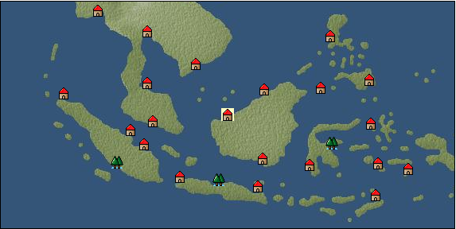

# Port: クチン

import Tabs from '@theme/Tabs';
import TabItem from '@theme/TabItem';

## General Information

| Attribute | Details |
| :--- | :--- |
| **Port Name** | Kuching |
| **Port Type** | port of alliance |
| **Region** | Southeast Asia |
| **Sea Area** | java sea |
| **Required Language** | Malayu Tagalog |
| **Coordinates** | （5054，4667） |
| **Investment Reward** | [Lot (NO.13)](Items/Consumables/Consumables-Treasure-Chests/item_3021.md) （必要投資額：500,000ドゥカード） |

### Available Facilities

| guild | intermediary | exchange | tool shop | workshop craftsman | Painter | sculptor | peddler |
| --- | --- | --- | --- | --- | --- | --- | --- |
|   |   | ○ | ○ | ○ |   |   |   |
| Shipyard Master | Lumbermaker | Sail-maker | weapon craftsman | master | TavernFemale | archive | salesperson |
| --- | --- | --- | --- | --- | --- | --- | --- |
|   |   |   |   | ○ |   |   |   |
| Shipwright | 銀行 | street worker | 王宮 | Trading post | church | suburbs | translator |
| --- | --- | --- | --- | --- | --- | --- | --- |
| ○ | ○ | ○ |   |   |   |   |   |

### Description
A town located on the central west coast of Kalimantan Island. It is under the control of the Kingdom of Brunei, which is headquartered in Brunei in the northeast. Kuching means cat in the local language. Cultural area: Southeast Asia

<Tabs>
  <TabItem value="trade_goods_sales" label="Trade Goods Sales">

| item | group | purchase price | 同盟時 | remarks |
| --- | --- | --- | --- | --- |
| [Cassava](Items/Trade Goods/TradeGoods-Foodstuffs/item_1805.md) | [Trading items (food items)](Categories/category_3.md) | 69 | (61) |  |
| [coal](Items/Trade Goods/TradeGoods-Wares/item_359.md) | [交易品（工業品）](Categories/category_19.md) | 474 | (415) |  |
| [sulfur](Items/Trade Goods/TradeGoods-Wares/item_66.md) | [交易品（工業品）](Categories/category_19.md) | 383 | (336) |  |
| [Honey](Items/Trade Goods/TradeGoods-Seasonings/item_49.md) | [交易品（調味料）](Categories/category_4.md) | 879 | 768 |  |
| [魚肉](Items/Trade Goods/TradeGoods-Foodstuffs/item_10.md) | [Trading items (food items)](Categories/category_3.md) | 146 | 128 |  |
  </TabItem>
  <TabItem value="sale_specialty" label="Sale (Specialty)">

| item | group | sale price | 同盟時 | remarks |
| --- | --- | --- | --- | --- |

#### [交易品（繊維）](Categories/category_1.md)

| [Basho](Items/Trade Goods/TradeGoods-Fibers/item_3862.md) | [交易品（繊維）](Categories/category_1.md) | 11,212 | (12,614) |  |
| [deerskin](Items/Trade Goods/TradeGoods-Fibers/item_3648.md) | [交易品（繊維）](Categories/category_1.md) | 14,981 | (16,855) |  |

#### [Trading Goods (Dye)](Categories/category_2.md)

| [Shorou](Items/Trade Goods/TradeGoods-Dye/item_3691.md) | [Trading Goods (Dye)](Categories/category_2.md) | 9,375 | (10,547) |  |
| [Locao](Items/Trade Goods/TradeGoods-Dye/item_3909.md) | [Trading Goods (Dye)](Categories/category_2.md) | 9,206 | (10,357) |  |

#### [Trading items (food items)](Categories/category_3.md)

| [Karasumi](Items/Trade Goods/TradeGoods-Foodstuffs/item_3687.md) | [Trading items (food items)](Categories/category_3.md) | 10,132 | (11,399) |  |
| [Chinese noodles](Items/Trade Goods/TradeGoods-Foodstuffs/item_3906.md) | [Trading items (food items)](Categories/category_3.md) | 10,159 | (11,429) |  |

#### [交易品（調味料）](Categories/category_4.md)

| [Sha Cha Ji](Items/Trade Goods/TradeGoods-Seasonings/item_3689.md) | [交易品（調味料）](Categories/category_4.md) | 9,018 | (10,146) |  |
| [Bean sauce](Items/Trade Goods/TradeGoods-Seasonings/item_3875.md) | [交易品（調味料）](Categories/category_4.md) | 9,017 | (10,145) |  |

#### [Trading products (medical products)](Categories/category_6.md)

| [Borei](Items/Trade Goods/TradeGoods-Medicine/item_3678.md) | [Trading products (medical products)](Categories/category_6.md) | 7,442 | (8,373) |  |
| [Cordyceps sinensis](Items/Trade Goods/TradeGoods-Medicine/item_3839.md) | [Trading products (medical products)](Categories/category_6.md) | 9,609 | (10,811) |  |

#### [Trading products (precious metals)](Categories/category_8.md)

| [Jinguashijin](Items/Trade Goods/TradeGoods-Metals/item_3693.md) | [Trading products (precious metals)](Categories/category_8.md) | 9,375 | (10,547) |  |
| [雲南銀](Items/Trade Goods/TradeGoods-Metals/item_3905.md) | [Trading products (precious metals)](Categories/category_8.md) | 9,458 | (10,641) |  |

#### [Trading goods (hobby goods)](Categories/category_10.md)

| [Aigyoku](Items/Trade Goods/TradeGoods-Sunddries/item_3677.md) | [Trading goods (hobby goods)](Categories/category_10.md) | 8,731 | (9,823) |  |
| [Chinese tea](Items/Trade Goods/TradeGoods-Sunddries/item_3907.md) | [Trading goods (hobby goods)](Categories/category_10.md) | 10,105 | (11,369) |  |

#### [Trading Goods (Spices)](Categories/category_12.md)

| [Kouzuku](Items/Trade Goods/TradeGoods-Spices/item_3690.md) | [Trading Goods (Spices)](Categories/category_12.md) | 10,257 | (11,540) |  |
| [star anise](Items/Trade Goods/TradeGoods-Spices/item_3908.md) | [Trading Goods (Spices)](Categories/category_12.md) | 9,627 | (10,831) |  |

#### [交易品（美術品）](Categories/category_14.md)

| [Japanese painting](Items/Trade Goods/TradeGoods-Art/item_3436.md) | [交易品（美術品）](Categories/category_14.md) | 9,063 | (10,196) |  |

#### [Trading Items (Gemstones)](Categories/category_15.md)

| [topaz](Items/Trade Goods/TradeGoods-Gems/item_1097.md) | [Trading Items (Gemstones)](Categories/category_15.md) | 5,189 | (5,838) |  |
| [pink diamond](Items/Trade Goods/TradeGoods-Gems/item_2874.md) | [Trading Items (Gemstones)](Categories/category_15.md) | 4,243 | (4,773) |  |

#### [Trading Items (Arms)](Categories/category_16.md)

| [Japanese sword](Items/Trade Goods/TradeGoods-Weapons/item_3437.md) | [Trading Items (Arms)](Categories/category_16.md) | 8,246 | (9,277) |  |

#### [Trading Items (Firearms)](Categories/category_17.md)

| [銅手銃](Items/Trade Goods/TradeGoods-Firearms/item_3700.md) | [Trading Items (Firearms)](Categories/category_17.md) | 10,260 | (11,543) |  |

#### [交易品（工業品）](Categories/category_19.md)

| [Japanese paper](Items/Trade Goods/TradeGoods-Wares/item_3438.md) | [交易品（工業品）](Categories/category_19.md) | (10,634) | 12,408 |  |

#### [交易品（織物）](Categories/category_20.md)

| [唐錦](Items/Trade Goods/TradeGoods-Fabrics/item_3896.md) | [交易品（織物）](Categories/category_20.md) | 9,206 | (10,357) |  |
| [明紬](Items/Trade Goods/TradeGoods-Fabrics/item_3753.md) | [交易品（織物）](Categories/category_20.md) | (7,917) | 9,237 |  |
| [麻織物](Items/Trade Goods/TradeGoods-Fabrics/item_3673.md) | [交易品（織物）](Categories/category_20.md) | 8,527 | (9,593) |  |
  </TabItem>
  <TabItem value="sale_no_specialty" label="Sale (No Specialty)">

| item | group | sale price | 同盟時 | remarks |
| --- | --- | --- | --- | --- |

#### [Trading Goods (Spices)](Categories/category_12.md)

| [cloves](Items/Trade Goods/TradeGoods-Spices/item_1092.md) | [Trading Goods (Spices)](Categories/category_12.md) | 503 | (565) |  |
| [nutmeg](Items/Trade Goods/TradeGoods-Spices/item_1969.md) | [Trading Goods (Spices)](Categories/category_12.md) | 534 | (600) |  |
| [mace](Items/Trade Goods/TradeGoods-Spices/item_2100.md) | [Trading Goods (Spices)](Categories/category_12.md) | 706 | (794) |  |

#### [Trading Items (Gemstones)](Categories/category_15.md)

| [pearl](Items/Trade Goods/TradeGoods-Gems/item_769.md) | [Trading Items (Gemstones)](Categories/category_15.md) | (4,826) | 5,631 |  |
  </TabItem>
  <TabItem value="guild_&_others" label="Guild & Others">

| item | group | Sales price | Handling NPC | remarks |
| --- | --- | --- | --- | --- |
| There is no sales information for the item |
| --- |
  </TabItem>
  <TabItem value="toolman" label="Toolman">

| item | group | Sales price | Handling NPC | remarks |
| --- | --- | --- | --- | --- |

#### [Equipment (body)](Categories/category_24.md)

| [pirate vest](Items/Equipment/Equipment-Body/item_98.md) | [Equipment (body)](Categories/category_24.md) | 18,500 | tool shop owner |  |

#### [Equipment (legs)](Categories/category_26.md)

| [cross strap sandals](Items/Equipment/Equipment-Feet/item_99.md) | [Equipment (legs)](Categories/category_26.md) | 7,300 | tool shop owner |  |

#### [Equipment (belongings)](Categories/category_27.md)

| [short sword](Items/Equipment/Equipment-Weapon/item_301.md) | [Equipment (belongings)](Categories/category_27.md) | 9,300 | tool shop owner |  |

#### [Consumables (land battle/deck battle)](Categories/category_29.md)

| [strong adhesive oil](Items/Consumables/Consumables-Landbattle/item_662.md) | [Consumables (land battle/deck battle)](Categories/category_29.md) | 200 | tool shop owner |  |

#### [Consumables (skill activation)](Categories/category_31.md)

| [research monocle](Items/Consumables/Consumables-Skill/item_120.md) | [Consumables (skill activation)](Categories/category_31.md) | 2,500 | tool shop owner |  |
  </TabItem>
  <TabItem value="kobo_craftsmen" label="Craftsman">

| item | group | Sales price | Handling NPC | remarks |
| --- | --- | --- | --- | --- |

#### [Consumables (condition recovery)](Categories/category_21.md)

| [Nostalgic carillon bell](Items/Consumables/Consumables-Recovery/item_245.md) | [Consumables (condition recovery)](Categories/category_21.md) | 200 | workshop craftsman |  |
| [Ship song sheet music](Items/Consumables/Consumables-Recovery/item_247.md) | [Consumables (condition recovery)](Categories/category_21.md) | 200 | workshop craftsman |  |

#### [Consumables (other)](Categories/category_44.md)

| [帆塗料](Items/Consumables/Consumables-Other/item_348.md) | [Consumables (other)](Categories/category_44.md) | 500 | workshop craftsman |  |
| [ship paint](Items/Consumables/Consumables-Other/item_347.md) | [Consumables (other)](Categories/category_44.md) | 500 | workshop craftsman |  |
  </TabItem>
</Tabs>