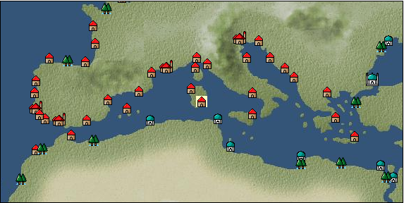

# Port: カリアリ

import Tabs from '@theme/Tabs';
import TabItem from '@theme/TabItem';

## General Information

| Attribute | Details |
| :--- | :--- |
| **Port Name** | Cagliari |
| **Port Type** | port of alliance |
| **Region** | western europe |
| **Sea Area** | Tyrrhenian Sea |
| **Required Language** | italian |
| **Coordinates** | （329，3170） |
| **Investment Reward** | [Sake brewing secret](Items/Recipe Book/item_565.md) （必要投資額：300,000ドゥカード） |

### Available Facilities

| guild | intermediary | exchange | tool shop | workshop craftsman | Painter | sculptor | peddler |
| --- | --- | --- | --- | --- | --- | --- | --- |
|   |   | ○ | ○ |   |   |   |   |
| Shipyard Master | Lumbermaker | Sail-maker | weapon craftsman | master | TavernFemale | archive | salesperson |
| --- | --- | --- | --- | --- | --- | --- | --- |
|   |   |   |   | ○ |   |   |   |
| Shipwright | 銀行 | street worker | 王宮 | Trading post | church | suburbs | translator |
| --- | --- | --- | --- | --- | --- | --- | --- |
| ○ | ○ | ○ |   |   |   |   |   |

### Description
A city in the southern part of Sardinia. Geographically, it was easy to get involved in conflicts between many powers, and the ruling power changed one after another. As a result, the city has become a place where various cultures coexist. *Spanish is also spoken Cultural area: Italy, southern France

<Tabs>
  <TabItem value="trade_goods_sales" label="Trade Goods Sales">

| item | group | purchase price | 同盟時 | remarks |
| --- | --- | --- | --- | --- |
| [olive oil](Items/Trade Goods/TradeGoods-Seasonings/item_48.md) | [交易品（調味料）](Categories/category_4.md) | (315) | 276 |  |
| [peonies](Items/Trade Goods/TradeGoods-Medicine/item_1051.md) | [Trading products (medical products)](Categories/category_6.md) | 346 | 312 |  |
| 要投資（必要投資額：500,000） |
| [goat](Items/Trade Goods/TradeGoods-Livestock/item_534.md) | [Trading Goods (Livestock)](Categories/category_18.md) | (187) | 164 |  |
| [wine](Items/Trade Goods/TradeGoods-Alcohol/item_11.md) | [交易品（酒類）](Categories/category_9.md) | (429) | 376 |  |
| 要投資（必要投資額：500,000） EO第4章で追加 |
| [marble statue](Items/Trade Goods/TradeGoods-Art/item_50.md) | [交易品（美術品）](Categories/category_14.md) | (2,318) | 2,028 |  |
| 時代限定（15世紀第4期、15世紀第5期、16世紀第1期） |
| [lapidary work](Items/Trade Goods/TradeGoods-Luxuries/item_153.md) | [Trading goods (artificial goods)](Categories/category_13.md) | 4,177 | (3,655) |  |
| 時代限定（16世紀第1期、16世紀第2期、16世紀第3期） |
| [crystal](Items/Trade Goods/TradeGoods-Gems/item_893.md) | [Trading Items (Gemstones)](Categories/category_15.md) | 1,646 | 1,456 |  |
| 要投資（必要投資額：720,000） |
| [羊皮紙](Items/Trade Goods/TradeGoods-Wares/item_53.md) | [交易品（工業品）](Categories/category_19.md) | 1,101 | (964) |  |
| 時代限定（15世紀第2期） |
| [魚肉](Items/Trade Goods/TradeGoods-Foodstuffs/item_10.md) | [Trading items (food items)](Categories/category_3.md) | 146 | 128 |  |
  </TabItem>
  <TabItem value="sale_specialty" label="Sale (Specialty)">

| item | group | sale price | 同盟時 | remarks |
| --- | --- | --- | --- | --- |

#### [交易品（繊維）](Categories/category_1.md)

| [flax](Items/Trade Goods/TradeGoods-Fibers/item_64.md) | [交易品（繊維）](Categories/category_1.md) | (275) | 320 |  |
| [Green ramie](Items/Trade Goods/TradeGoods-Fibers/item_3428.md) | [交易品（繊維）](Categories/category_1.md) | (33,147) | 38,677 |  |

#### [Trading Goods (Dye)](Categories/category_2.md)

| [mayan blue](Items/Trade Goods/TradeGoods-Dye/item_1096.md) | [Trading Goods (Dye)](Categories/category_2.md) | (1,390) | 1,621 |  |

#### [Trading items (food items)](Categories/category_3.md)

| [buckwheat](Items/Trade Goods/TradeGoods-Foodstuffs/item_3430.md) | [Trading items (food items)](Categories/category_3.md) | 47,046 | (52,931) |  |

#### [交易品（調味料）](Categories/category_4.md)

| [oyster sauce](Items/Trade Goods/TradeGoods-Seasonings/item_3505.md) | [交易品（調味料）](Categories/category_4.md) | 3,012 | (3,388) |  |
| [black vinegar](Items/Trade Goods/TradeGoods-Seasonings/item_3475.md) | [交易品（調味料）](Categories/category_4.md) | 5,063 | (5,696) |  |

#### [交易品（雑貨）](Categories/category_5.md)

| [Japanese books](Items/Trade Goods/TradeGoods-Misc/item_3439.md) | [交易品（雑貨）](Categories/category_5.md) | 34,900 | (39,266) |  |
| [lantern](Items/Trade Goods/TradeGoods-Misc/item_3683.md) | [交易品（雑貨）](Categories/category_5.md) | (36,446) | 42,527 |  |

#### [Trading products (medical products)](Categories/category_6.md)

| [Borei](Items/Trade Goods/TradeGoods-Medicine/item_3678.md) | [Trading products (medical products)](Categories/category_6.md) | 45,409 | (51,090) |  |
| [calamus](Items/Trade Goods/TradeGoods-Medicine/item_3427.md) | [Trading products (medical products)](Categories/category_6.md) | 35,369 | (39,793) |  |

#### [Trading Items (Iron Stone)](Categories/category_7.md)

| [Hokutolite](Items/Trade Goods/TradeGoods-Minerals/item_3694.md) | [Trading Items (Iron Stone)](Categories/category_7.md) | 32,719 | (36,812) |  |

#### [Trading products (precious metals)](Categories/category_8.md)

| [platinum](Items/Trade Goods/TradeGoods-Metals/item_2178.md) | [Trading products (precious metals)](Categories/category_8.md) | (6,514) | 7,600 |  |

#### [交易品（酒類）](Categories/category_9.md)

| [aquavit](Items/Trade Goods/TradeGoods-Alcohol/item_572.md) | [交易品（酒類）](Categories/category_9.md) | 833 | (937) |  |
| [whiskey](Items/Trade Goods/TradeGoods-Alcohol/item_1.md) | [交易品（酒類）](Categories/category_9.md) | (823) | 960 |  |
| [fruit brandy](Items/Trade Goods/TradeGoods-Alcohol/item_1440.md) | [交易品（酒類）](Categories/category_9.md) | (667) | 778 |  |

#### [Trading goods (hobby goods)](Categories/category_10.md)

| [cacao](Items/Trade Goods/TradeGoods-Sunddries/item_140.md) | [Trading goods (hobby goods)](Categories/category_10.md) | 1,390 | (1,563) |  |
| [eggplant](Items/Trade Goods/TradeGoods-Sunddries/item_3426.md) | [Trading goods (hobby goods)](Categories/category_10.md) | 33,264 | (37,425) |  |
| [金針花](Items/Trade Goods/TradeGoods-Sunddries/item_3739.md) | [Trading goods (hobby goods)](Categories/category_10.md) | 9,788 | (11,012) |  |

#### [Trading Goods (Spices)](Categories/category_11.md)

| [gardenia](Items/Trade Goods/TradeGoods-Perfume/item_1091.md) | [Trading Goods (Spices)](Categories/category_11.md) | (23,347) | 27,242 |  |
| [Hamanasu](Items/Trade Goods/TradeGoods-Perfume/item_3692.md) | [Trading Goods (Spices)](Categories/category_11.md) | 31,711 | (35,678) |  |

#### [Trading Goods (Spices)](Categories/category_12.md)

| [cloves](Items/Trade Goods/TradeGoods-Spices/item_1092.md) | [Trading Goods (Spices)](Categories/category_12.md) | (10,631) | 12,404 |  |
| [Kouzuku](Items/Trade Goods/TradeGoods-Spices/item_3690.md) | [Trading Goods (Spices)](Categories/category_12.md) | 32,622 | (36,703) |  |
| [pepper](Items/Trade Goods/TradeGoods-Spices/item_58.md) | [Trading Goods (Spices)](Categories/category_12.md) | (4,911) | 5,730 |  |
| [nutmeg](Items/Trade Goods/TradeGoods-Spices/item_1969.md) | [Trading Goods (Spices)](Categories/category_12.md) | 13,163 | (14,809) |  |
| [mace](Items/Trade Goods/TradeGoods-Spices/item_2100.md) | [Trading Goods (Spices)](Categories/category_12.md) | 13,542 | (15,236) |  |
| [Grapefruit](Items/Trade Goods/TradeGoods-Spices/item_3422.md) | [Trading Goods (Spices)](Categories/category_12.md) | 35,100 | 40,650 |  |

#### [Trading goods (artificial goods)](Categories/category_13.md)

| [Tumbaga](Items/Trade Goods/TradeGoods-Luxuries/item_3028.md) | [Trading goods (artificial goods)](Categories/category_13.md) | (16,004) | 18,674 |  |
| [Song Baici](Items/Trade Goods/TradeGoods-Luxuries/item_3904.md) | [Trading goods (artificial goods)](Categories/category_13.md) | (33,057) | 38,572 |  |

#### [交易品（美術品）](Categories/category_14.md)

| [taiwan wood carving](Items/Trade Goods/TradeGoods-Art/item_3697.md) | [交易品（美術品）](Categories/category_14.md) | 31,875 | (35,862) |  |

#### [Trading Items (Gemstones)](Categories/category_15.md)

| [opal](Items/Trade Goods/TradeGoods-Gems/item_2006.md) | [Trading Items (Gemstones)](Categories/category_15.md) | 7,319 | (8,234) |  |
| Calculation in Venice, the weakest country ^^; |
| [sapphire](Items/Trade Goods/TradeGoods-Gems/item_676.md) | [Trading Items (Gemstones)](Categories/category_15.md) | 12,000 | 13,422 |  |
| [diamond](Items/Trade Goods/TradeGoods-Gems/item_449.md) | [Trading Items (Gemstones)](Categories/category_15.md) | 7,313 | 7,104 |  |
| [topaz](Items/Trade Goods/TradeGoods-Gems/item_1097.md) | [Trading Items (Gemstones)](Categories/category_15.md) | (4,925) | 5,746 |  |
| [ruby](Items/Trade Goods/TradeGoods-Gems/item_773.md) | [Trading Items (Gemstones)](Categories/category_15.md) | (10,269) | 11,982 |  |
| [taiwan sapphire](Items/Trade Goods/TradeGoods-Gems/item_3695.md) | [Trading Items (Gemstones)](Categories/category_15.md) | 47,429 | (53,362) |  |
| [amber](Items/Trade Goods/TradeGoods-Gems/item_618.md) | [Trading Items (Gemstones)](Categories/category_15.md) | (3,951) | 4,610 |  |

#### [Trading Items (Arms)](Categories/category_16.md)

| [Japanese bow](Items/Trade Goods/TradeGoods-Weapons/item_3469.md) | [Trading Items (Arms)](Categories/category_16.md) | 11,686 | (13,148) |  |
| [japanese armor](Items/Trade Goods/TradeGoods-Weapons/item_3590.md) | [Trading Items (Arms)](Categories/category_16.md) | 11,340 | (12,758) |  |

#### [Trading Items (Firearms)](Categories/category_17.md)

| [tanegashima gun](Items/Trade Goods/TradeGoods-Firearms/item_3423.md) | [Trading Items (Firearms)](Categories/category_17.md) | 24,584 | (27,659) |  |
| [銅手銃](Items/Trade Goods/TradeGoods-Firearms/item_3700.md) | [Trading Items (Firearms)](Categories/category_17.md) | 31,443 | (35,376) |  |

#### [交易品（工業品）](Categories/category_19.md)

| [Japanese paper](Items/Trade Goods/TradeGoods-Wares/item_3438.md) | [交易品（工業品）](Categories/category_19.md) | (33,938) | 39,600 |  |
| [paint](Items/Trade Goods/TradeGoods-Wares/item_3411.md) | [交易品（工業品）](Categories/category_19.md) | 2,759 | (3,104) |  |

#### [交易品（織物）](Categories/category_20.md)

| [Awaiyo](Items/Trade Goods/TradeGoods-Fabrics/item_3002.md) | [交易品（織物）](Categories/category_20.md) | (7,686) | 8,968 |  |
| [gobelin weave](Items/Trade Goods/TradeGoods-Fabrics/item_1276.md) | [交易品（織物）](Categories/category_20.md) | (3,634) | 4,240 |  |
| [damask](Items/Trade Goods/TradeGoods-Fabrics/item_614.md) | [交易品（織物）](Categories/category_20.md) | (3,454) | 4,030 |  |
| [flannel](Items/Trade Goods/TradeGoods-Fabrics/item_149.md) | [交易品（織物）](Categories/category_20.md) | (1,413) | 1,648 |  |
| [China Duantong](Items/Trade Goods/TradeGoods-Fabrics/item_3478.md) | [交易品（織物）](Categories/category_20.md) | 18,889 | (21,252) |  |
  </TabItem>
  <TabItem value="sale_no_specialty" label="Sale (No Specialty)">

| item | group | sale price | 同盟時 | remarks |
| --- | --- | --- | --- | --- |

#### [交易品（繊維）](Categories/category_1.md)

| [goat hair](Items/Trade Goods/TradeGoods-Fibers/item_770.md) | [交易品（繊維）](Categories/category_1.md) | 1,248 | (1,404) |  |
| [leather](Items/Trade Goods/TradeGoods-Fibers/item_44.md) | [交易品（繊維）](Categories/category_1.md) | 613 | (689) |  |
| [cotton](Items/Trade Goods/TradeGoods-Fibers/item_610.md) | [交易品（繊維）](Categories/category_1.md) | (558) | 651 |  |
| [wool](Items/Trade Goods/TradeGoods-Fibers/item_5.md) | [交易品（繊維）](Categories/category_1.md) | (431) | 502 |  |

#### [Trading Goods (Dye)](Categories/category_2.md)

| [貝紫](Items/Trade Goods/TradeGoods-Dye/item_110.md) | [Trading Goods (Dye)](Categories/category_2.md) | (3,943) | 4,600 |  |

#### [Trading items (food items)](Categories/category_3.md)

| [fava beans](Items/Trade Goods/TradeGoods-Foodstuffs/item_102.md) | [Trading items (food items)](Categories/category_3.md) | 113 | (127) |  |
| [duck meat](Items/Trade Goods/TradeGoods-Foodstuffs/item_32.md) | [Trading items (food items)](Categories/category_3.md) | (391) | 456 |  |
| [olive](Items/Trade Goods/TradeGoods-Foodstuffs/item_47.md) | [Trading items (food items)](Categories/category_3.md) | (262) | 305 |  |
| [turnip](Items/Trade Goods/TradeGoods-Foodstuffs/item_55.md) | [Trading items (food items)](Categories/category_3.md) | (72) | 84 |  |
| [Oat](Items/Trade Goods/TradeGoods-Foodstuffs/item_275.md) | [Trading items (food items)](Categories/category_3.md) | (77) | 89 |  |
| [Quinoa](Items/Trade Goods/TradeGoods-Foodstuffs/item_2994.md) | [Trading items (food items)](Categories/category_3.md) | 360 | (405) |  |
| [sausage](Items/Trade Goods/TradeGoods-Foodstuffs/item_27.md) | [Trading items (food items)](Categories/category_3.md) | (478) | 557 |  |
| [cheese](Items/Trade Goods/TradeGoods-Foodstuffs/item_20.md) | [Trading items (food items)](Categories/category_3.md) | (349) | 407 |  |
| [egg](Items/Trade Goods/TradeGoods-Foodstuffs/item_40.md) | [Trading items (food items)](Categories/category_3.md) | (31) | 36 |  |
| [wheat](Items/Trade Goods/TradeGoods-Foodstuffs/item_16.md) | [Trading items (food items)](Categories/category_3.md) | 63 | (70) |  |
| [beef](Items/Trade Goods/TradeGoods-Foodstuffs/item_26.md) | [Trading items (food items)](Categories/category_3.md) | (556) | 648 |  |
| [mutton](Items/Trade Goods/TradeGoods-Foodstuffs/item_33.md) | [Trading items (food items)](Categories/category_3.md) | (420) | 490 |  |
| [red bean](Items/Trade Goods/TradeGoods-Foodstuffs/item_123.md) | [Trading items (food items)](Categories/category_3.md) | 135 | 143 |  |
| [taro](Items/Trade Goods/TradeGoods-Foodstuffs/item_3421.md) | [Trading items (food items)](Categories/category_3.md) | 302 | (339) |  |
| [魚肉](Items/Trade Goods/TradeGoods-Foodstuffs/item_10.md) | [Trading items (food items)](Categories/category_3.md) | 64 | (72) |  |
| [chicken meat](Items/Trade Goods/TradeGoods-Foodstuffs/item_29.md) | [Trading items (food items)](Categories/category_3.md) | (284) | 331 |  |

#### [交易品（調味料）](Categories/category_4.md)

| [almond oil](Items/Trade Goods/TradeGoods-Seasonings/item_578.md) | [交易品（調味料）](Categories/category_4.md) | (615) | 717 |  |
| [coconut vinegar](Items/Trade Goods/TradeGoods-Seasonings/item_1988.md) | [交易品（調味料）](Categories/category_4.md) | (444) | 518 |  |
| [butter](Items/Trade Goods/TradeGoods-Seasonings/item_3.md) | [交易品（調味料）](Categories/category_4.md) | (350) | 408 |  |
| [white vinegar](Items/Trade Goods/TradeGoods-Seasonings/item_56.md) | [交易品（調味料）](Categories/category_4.md) | (155) | 180 |  |
| [wine vinegar](Items/Trade Goods/TradeGoods-Seasonings/item_429.md) | [交易品（調味料）](Categories/category_4.md) | (509) | 593 |  |
| [salt](Items/Trade Goods/TradeGoods-Seasonings/item_42.md) | [交易品（調味料）](Categories/category_4.md) | (234) | 272 |  |
| [sugar](Items/Trade Goods/TradeGoods-Seasonings/item_94.md) | [交易品（調味料）](Categories/category_4.md) | (833) | 971 |  |
| [Honey](Items/Trade Goods/TradeGoods-Seasonings/item_49.md) | [交易品（調味料）](Categories/category_4.md) | (810) | 945 |  |

#### [Trading products (medical products)](Categories/category_6.md)

| [cinchona bark](Items/Trade Goods/TradeGoods-Medicine/item_2121.md) | [Trading products (medical products)](Categories/category_6.md) | 965 | (1,085) |  |
| [belladonna](Items/Trade Goods/TradeGoods-Medicine/item_1056.md) | [Trading products (medical products)](Categories/category_6.md) | (471) | 549 |  |

#### [Trading Items (Iron Stone)](Categories/category_7.md)

| [iron ore](Items/Trade Goods/TradeGoods-Minerals/item_146.md) | [Trading Items (Iron Stone)](Categories/category_7.md) | (672) | 784 |  |

#### [Trading products (precious metals)](Categories/category_8.md)

| [gold](Items/Trade Goods/TradeGoods-Metals/item_659.md) | [Trading products (precious metals)](Categories/category_8.md) | 11,811 | 12,500 |  |
| [silver](Items/Trade Goods/TradeGoods-Metals/item_136.md) | [Trading products (precious metals)](Categories/category_8.md) | 3,380 | 2,880 |  |

#### [交易品（酒類）](Categories/category_9.md)

| [sherry](Items/Trade Goods/TradeGoods-Alcohol/item_844.md) | [交易品（酒類）](Categories/category_9.md) | 479 | 518 |  |
| [Beer](Items/Trade Goods/TradeGoods-Alcohol/item_2.md) | [交易品（酒類）](Categories/category_9.md) | (366) | 427 |  |
| [brandy](Items/Trade Goods/TradeGoods-Alcohol/item_9.md) | [交易品（酒類）](Categories/category_9.md) | 764 | 794 |  |
| [rum](Items/Trade Goods/TradeGoods-Alcohol/item_139.md) | [交易品（酒類）](Categories/category_9.md) | (646) | 753 |  |
| [liqueur](Items/Trade Goods/TradeGoods-Alcohol/item_18.md) | [交易品（酒類）](Categories/category_9.md) | 685 | (770) |  |
| [wine](Items/Trade Goods/TradeGoods-Alcohol/item_11.md) | [交易品（酒類）](Categories/category_9.md) | 501 | (563) |  |
| 要投資（必要投資額：500,000） EO第4章で追加 |
| [Shochu](Items/Trade Goods/TradeGoods-Alcohol/item_3449.md) | [交易品（酒類）](Categories/category_9.md) | 6,507 | (7,321) |  |

#### [Trading goods (hobby goods)](Categories/category_10.md)

| [almond](Items/Trade Goods/TradeGoods-Sunddries/item_367.md) | [Trading goods (hobby goods)](Categories/category_10.md) | (179) | 208 |  |
| [walnut](Items/Trade Goods/TradeGoods-Sunddries/item_522.md) | [Trading goods (hobby goods)](Categories/category_10.md) | (419) | 488 |  |
| [pickles](Items/Trade Goods/TradeGoods-Sunddries/item_535.md) | [Trading goods (hobby goods)](Categories/category_10.md) | (255) | 297 |  |
| [prune](Items/Trade Goods/TradeGoods-Sunddries/item_523.md) | [Trading goods (hobby goods)](Categories/category_10.md) | (321) | 374 |  |
| Specialties of neighboring cultural areas |
| [raisins](Items/Trade Goods/TradeGoods-Sunddries/item_35.md) | [Trading goods (hobby goods)](Categories/category_10.md) | (304) | 354 |  |

#### [Trading Goods (Spices)](Categories/category_11.md)

| [oakmoss](Items/Trade Goods/TradeGoods-Perfume/item_819.md) | [Trading Goods (Spices)](Categories/category_11.md) | (720) | 840 |  |
| [lavender](Items/Trade Goods/TradeGoods-Perfume/item_150.md) | [Trading Goods (Spices)](Categories/category_11.md) | (772) | 900 |  |

#### [Trading Goods (Spices)](Categories/category_12.md)

| [garlic](Items/Trade Goods/TradeGoods-Spices/item_526.md) | [Trading Goods (Spices)](Categories/category_12.md) | (290) | 338 |  |
| [parsley](Items/Trade Goods/TradeGoods-Spices/item_46.md) | [Trading Goods (Spices)](Categories/category_12.md) | 138 | (155) |  |
| [fennel](Items/Trade Goods/TradeGoods-Spices/item_1045.md) | [Trading Goods (Spices)](Categories/category_12.md) | 321 | (361) |  |

#### [Trading goods (artificial goods)](Categories/category_13.md)

| [glasswork](Items/Trade Goods/TradeGoods-Luxuries/item_60.md) | [Trading goods (artificial goods)](Categories/category_13.md) | 1,214 | (1,365) |  |
| [coral work](Items/Trade Goods/TradeGoods-Luxuries/item_595.md) | [Trading goods (artificial goods)](Categories/category_13.md) | (2,590) | 3,022 |  |
| [lapidary work](Items/Trade Goods/TradeGoods-Luxuries/item_153.md) | [Trading goods (artificial goods)](Categories/category_13.md) | 1,882 | (2,117) |  |
| 時代限定（16世紀第1期、16世紀第2期、16世紀第3期） |
| [皮革製品](Items/Trade Goods/TradeGoods-Luxuries/item_12.md) | [Trading goods (artificial goods)](Categories/category_13.md) | (1,132) | 1,320 |  |
| [goldsmith](Items/Trade Goods/TradeGoods-Luxuries/item_687.md) | [Trading goods (artificial goods)](Categories/category_13.md) | (2,597) | 3,030 |  |
| [silversmith](Items/Trade Goods/TradeGoods-Luxuries/item_619.md) | [Trading goods (artificial goods)](Categories/category_13.md) | 2,733 | (3,074) |  |
| [ceramics](Items/Trade Goods/TradeGoods-Luxuries/item_152.md) | [Trading goods (artificial goods)](Categories/category_13.md) | 1,486 | 1,510 |  |

#### [交易品（美術品）](Categories/category_14.md)

| [古美術品](Items/Trade Goods/TradeGoods-Art/item_51.md) | [交易品（美術品）](Categories/category_14.md) | (3,069) | 3,580 |  |
| [oil painting](Items/Trade Goods/TradeGoods-Art/item_1088.md) | [交易品（美術品）](Categories/category_14.md) | (1,869) | 2,180 |  |
| [copperplate print](Items/Trade Goods/TradeGoods-Art/item_1087.md) | [交易品（美術品）](Categories/category_14.md) | 771 | (867) |  |
| [青銅像](Items/Trade Goods/TradeGoods-Art/item_148.md) | [交易品（美術品）](Categories/category_14.md) | (926) | 1,080 |  |

#### [Trading Items (Gemstones)](Categories/category_15.md)

| [emerald](Items/Trade Goods/TradeGoods-Gems/item_777.md) | [Trading Items (Gemstones)](Categories/category_15.md) | 7,860 | (8,843) |  |
| [coral](Items/Trade Goods/TradeGoods-Gems/item_141.md) | [Trading Items (Gemstones)](Categories/category_15.md) | (2,585) | 3,016 |  |
| [pearl](Items/Trade Goods/TradeGoods-Gems/item_769.md) | [Trading Items (Gemstones)](Categories/category_15.md) | 8,893 | (10,005) |  |

#### [Trading Items (Arms)](Categories/category_16.md)

| [crossbow](Items/Trade Goods/TradeGoods-Weapons/item_537.md) | [Trading Items (Arms)](Categories/category_16.md) | (876) | 1,022 |  |

#### [Trading Items (Firearms)](Categories/category_17.md)

| [musket gun](Items/Trade Goods/TradeGoods-Firearms/item_584.md) | [Trading Items (Firearms)](Categories/category_17.md) | (2,374) | 2,770 |  |
| [大砲](Items/Trade Goods/TradeGoods-Firearms/item_4.md) | [Trading Items (Firearms)](Categories/category_17.md) | (3,009) | 3,510 |  |
| [bullet](Items/Trade Goods/TradeGoods-Firearms/item_13.md) | [Trading Items (Firearms)](Categories/category_17.md) | (783) | 913 |  |
| [gunpowder](Items/Trade Goods/TradeGoods-Firearms/item_352.md) | [Trading Items (Firearms)](Categories/category_17.md) | (992) | 1,157 |  |
| [cannonball](Items/Trade Goods/TradeGoods-Firearms/item_144.md) | [Trading Items (Firearms)](Categories/category_17.md) | (1,511) | 1,763 |  |

#### [Trading Goods (Livestock)](Categories/category_18.md)

| [chicken](Items/Trade Goods/TradeGoods-Livestock/item_252.md) | [Trading Goods (Livestock)](Categories/category_18.md) | (48) | 55 |  |

#### [交易品（工業品）](Categories/category_19.md)

| [alabaster](Items/Trade Goods/TradeGoods-Wares/item_1086.md) | [交易品（工業品）](Categories/category_19.md) | (567) | 661 |  |
| [wax](Items/Trade Goods/TradeGoods-Wares/item_54.md) | [交易品（工業品）](Categories/category_19.md) | (807) | 941 |  |
| [wood](Items/Trade Goods/TradeGoods-Wares/item_277.md) | [交易品（工業品）](Categories/category_19.md) | (755) | 880 |  |
| [水銀](Items/Trade Goods/TradeGoods-Wares/item_15.md) | [交易品（工業品）](Categories/category_19.md) | 1,220 | (1,372) |  |
| [羊皮紙](Items/Trade Goods/TradeGoods-Wares/item_53.md) | [交易品（工業品）](Categories/category_19.md) | (1,106) | 1,290 |  |
| 時代限定（15世紀第2期） |
| [鋼](Items/Trade Goods/TradeGoods-Wares/item_573.md) | [交易品（工業品）](Categories/category_19.md) | (1,109) | 1,293 |  |

#### [交易品（織物）](Categories/category_20.md)

| [corduroy](Items/Trade Goods/TradeGoods-Fabrics/item_824.md) | [交易品（織物）](Categories/category_20.md) | (840) | 979 |  |
| [georgette](Items/Trade Goods/TradeGoods-Fabrics/item_1000.md) | [交易品（織物）](Categories/category_20.md) | (2,529) | 2,950 |  |
| [velvet](Items/Trade Goods/TradeGoods-Fabrics/item_902.md) | [交易品（織物）](Categories/category_20.md) | 2,968 | 3,020 |  |
| [muslin](Items/Trade Goods/TradeGoods-Fabrics/item_581.md) | [交易品（織物）](Categories/category_20.md) | 1,525 | (1,715) |  |
| [cotton fabric](Items/Trade Goods/TradeGoods-Fabrics/item_571.md) | [交易品（織物）](Categories/category_20.md) | (917) | 1,070 |  |
| [linen fabric](Items/Trade Goods/TradeGoods-Fabrics/item_135.md) | [交易品（織物）](Categories/category_20.md) | 493 | 505 |  |
  </TabItem>
  <TabItem value="guild_&_others" label="Guild & Others">

| item | group | Sales price | Handling NPC | remarks |
| --- | --- | --- | --- | --- |
| There is no sales information for the item |
| --- |
  </TabItem>
  <TabItem value="toolman" label="Toolman">

| item | group | Sales price | Handling NPC | remarks |
| --- | --- | --- | --- | --- |

#### [recipe book](Categories/category_22.md)

| [Mode Design Collection Volume 1](Items/Recipe Book/item_92.md) | [recipe book](Categories/category_22.md) | 10,000 | tool shop owner |  |
| [Sword training/application](Items/Recipe Book/item_589.md) | [recipe book](Categories/category_22.md) | 50,000 | tool shop owner |  |
| [Staff officer's guide](Items/Recipe Book/item_743.md) | [recipe book](Categories/category_22.md) | 30,000 | tool shop owner |  |
| [Textile secrets/fabric book](Items/Recipe Book/item_91.md) | [recipe book](Categories/category_22.md) | 10,000 | tool shop owner |  |

#### [Consumables (land battle/deck battle)](Categories/category_29.md)

| [black kite feather](Items/Consumables/Consumables-Landbattle/item_88.md) | [Consumables (land battle/deck battle)](Categories/category_29.md) | 100 | tool shop owner |  |
| [Assortment of wound medicine](Items/Consumables/Consumables-Landbattle/item_90.md) | [Consumables (land battle/deck battle)](Categories/category_29.md) | 500 | tool shop owner |  |
| [therapeutic drug](Items/Consumables/Consumables-Landbattle/item_89.md) | [Consumables (land battle/deck battle)](Categories/category_29.md) | 300 | tool shop owner |  |

#### [Consumables (request documents)](Categories/category_45.md)

| [Seasoning purchase order form](Items/Consumables/Consumables-Documents/item_4777.md) | [Consumables (request documents)](Categories/category_45.md) | 20,000 | tool shop owner |  |
  </TabItem>
</Tabs>