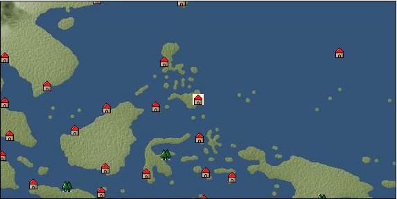

# Port: Davao

import Tabs from '@theme/Tabs';
import TabItem from '@theme/TabItem';

## General Information

| Attribute | Details |
| :--- | :--- |
| **Port Name** | Davao |
| **Port Type** | port of alliance |
| **Region** | Southeast Asia |
| **Sea Area** | celebes sea |
| **Required Language** | Malayu Tagalog |
| **Coordinates** | （5768，4492） |
| **Investment Reward** | [Lot (NO.12)](docs/Items/Consumables/Consumables-Treasure-Chests/item_3015.md) （必要投資額：500,000ドゥカード） |

### Available Facilities

| guild | intermediary | exchange | tool shop | workshop craftsman | Painter | sculptor | peddler |
| --- | --- | --- | --- | --- | --- | --- | --- |
|   |   | ○ | ○ | ○ |   |   |   |
| Shipyard Master | Lumbermaker | Sail-maker | weapon craftsman | master | TavernFemale | archive | salesperson |
| --- | --- | --- | --- | --- | --- | --- | --- |
| ○ |   |   | ○ |   |   |   |   |
| Shipwright | 銀行 | street worker | 王宮 | Trading post | church | suburbs | translator |
| --- | --- | --- | --- | --- | --- | --- | --- |
| ○ | ○ | ○ |   |   |   |   |   |

### Description
A city located on the southern coast of Mindanao. Mindanao has a stable climate, making it the perfect land for agriculture. Additionally, Davao City has mountain ranges on the ocean side, making it less susceptible to storms. Cultural area: Indochina

<Tabs>
  <TabItem value="trade_goods_sales" label="Trade Goods Sales">

| Item | Group | Purchase Price | Allied Price | Remarks |
| --- | --- | --- | --- | --- |
| [coconut](docs/Items/TradeGoods/TradeGoods-Sunddries/item_96.md) | [Trading goods (hobby goods)](docs/Categories/category_10.md) | (292) | 256 |  |
| [banana](docs/Items/TradeGoods/TradeGoods-Sunddries/item_1947.md) | [Trading goods (hobby goods)](docs/Categories/category_10.md) | (150) | 132 |  |
| [coconut oil](docs/Items/TradeGoods/TradeGoods-Seasonings/item_446.md) | [交易品（調味料）](docs/Categories/category_4.md) | (210) | 184 |  |
| [wood](docs/Items/TradeGoods/TradeGoods-Wares/item_277.md) | [交易品（工業品）](docs/Categories/category_19.md) | (676) | 592 |  |
| [水銀](docs/Items/TradeGoods/TradeGoods-Wares/item_15.md) | [交易品（工業品）](docs/Categories/category_19.md) | 1,116 | 977 |  |
| 要投資（必要投資額：180,000） |
| [graphite](docs/Items/TradeGoods/TradeGoods-Wares/item_25.md) | [交易品（工業品）](docs/Categories/category_19.md) | (890) | 779 |  |
| 要投資（必要投資額：240,000） |
| [陸稲](docs/Items/TradeGoods/TradeGoods-Foodstuffs/item_100.md) | [Trading items (food items)](docs/Categories/category_3.md) | (41) | 36 |  |
| [青銅](docs/Items/TradeGoods/TradeGoods-Wares/item_7.md) | [交易品（工業品）](docs/Categories/category_19.md) | (987) | 864 |  |
  </TabItem>
  <TabItem value="sale_specialty" label="Sale (Specialty)">

| Item | Group | sale price | Allied Price | Remarks |
| --- | --- | --- | --- | --- |

#### [交易品（繊維）](docs/Categories/category_1.md)

| [Basho](docs/Items/TradeGoods/TradeGoods-Fibers/item_3862.md) | 交易品（繊維） | 9,722 | (10,938) |  |
| [Green ramie](docs/Items/TradeGoods/TradeGoods-Fibers/item_3428.md) | 交易品（繊維） | 11,347 | (12,766) |  |
| [deerskin](docs/Items/TradeGoods/TradeGoods-Fibers/item_3648.md) | 交易品（繊維） | 7,293 | (8,205) |  |

#### [Trading Goods (Dye)](docs/Categories/category_2.md)

| [ward](docs/Items/TradeGoods/TradeGoods-Dye/item_57.md) | Trading Goods (Dye) | 2,000 | (2,250) |  |
| [Locao](docs/Items/TradeGoods/TradeGoods-Dye/item_3909.md) | Trading Goods (Dye) | 9,323 | (10,489) |  |

#### [Trading items (food items)](docs/Categories/category_3.md)

| [Chinese noodles](docs/Items/TradeGoods/TradeGoods-Foodstuffs/item_3906.md) | Trading items (food items) | 10,257 | (11,540) |  |

#### [交易品（調味料）](docs/Categories/category_4.md)

| [Sha Cha Ji](docs/Items/TradeGoods/TradeGoods-Seasonings/item_3689.md) | 交易品（調味料） | 14,625 | (16,454) |  |
| [Bean sauce](docs/Items/TradeGoods/TradeGoods-Seasonings/item_3875.md) | 交易品（調味料） | 9,090 | (10,227) |  |

#### [Trading products (medical products)](docs/Categories/category_6.md)

| [tea tree](docs/Items/TradeGoods/TradeGoods-Medicine/item_2283.md) | Trading products (medical products) | 633 | (712) |  |
| [Borei](docs/Items/TradeGoods/TradeGoods-Medicine/item_3678.md) | Trading products (medical products) | (6,743) | 7,868 |  |
| [Cordyceps sinensis](docs/Items/TradeGoods/TradeGoods-Medicine/item_3839.md) | Trading products (medical products) | 9,797 | (11,022) |  |

#### [Trading products (precious metals)](docs/Categories/category_8.md)

| [雲南銀](docs/Items/TradeGoods/TradeGoods-Metals/item_3905.md) | Trading products (precious metals) | 9,449 | (10,631) |  |

#### [交易品（酒類）](docs/Categories/category_9.md)

| [Taiwan rice wine](docs/Items/TradeGoods/TradeGoods-Alcohol/item_3672.md) | 交易品（酒類） | (7,631) | 8,904 |  |
| [紹興酒](docs/Items/TradeGoods/TradeGoods-Alcohol/item_3882.md) | 交易品（酒類） | 9,989 | 10,655 |  |

#### [Trading goods (hobby goods)](docs/Categories/category_10.md)

| [Aigyoku](docs/Items/TradeGoods/TradeGoods-Sunddries/item_3677.md) | Trading goods (hobby goods) | (7,917) | 9,238 |  |
| [macadamia nuts](docs/Items/TradeGoods/TradeGoods-Sunddries/item_2282.md) | Trading goods (hobby goods) | 477 | (536) |  |
| [Chinese tea](docs/Items/TradeGoods/TradeGoods-Sunddries/item_3907.md) | Trading goods (hobby goods) | 10,000 | (11,251) |  |

#### [Trading Goods (Spices)](docs/Categories/category_12.md)

| [Kouzuku](docs/Items/TradeGoods/TradeGoods-Spices/item_3690.md) | Trading Goods (Spices) | (9,493) | 11,076 |  |
| [star anise](docs/Items/TradeGoods/TradeGoods-Spices/item_3908.md) | Trading Goods (Spices) | 14,224 | (16,003) |  |

#### [Trading Items (Gemstones)](docs/Categories/category_15.md)

| [opal](docs/Items/TradeGoods/TradeGoods-Gems/item_2006.md) | Trading Items (Gemstones) | 7,664 | (8,622) |  |
| [pink diamond](docs/Items/TradeGoods/TradeGoods-Gems/item_2874.md) | Trading Items (Gemstones) | 3,877 | (4,362) |  |

#### [Trading Items (Firearms)](docs/Categories/category_17.md)

| [musket gun](docs/Items/TradeGoods/TradeGoods-Firearms/item_584.md) | Trading Items (Firearms) | (5,653) | 6,596 |  |

#### [交易品（織物）](docs/Categories/category_20.md)

| [Awaiyo](docs/Items/TradeGoods/TradeGoods-Fabrics/item_3002.md) | 交易品（織物） | 4,110 | (4,624) |  |
| [velvet](docs/Items/TradeGoods/TradeGoods-Fabrics/item_902.md) | 交易品（織物） | 5,368 | (6,039) |  |
| [唐錦](docs/Items/TradeGoods/TradeGoods-Fabrics/item_3896.md) | 交易品（織物） | 8,385 | (9,434) |  |
| [Nishijin textile](docs/Items/TradeGoods/TradeGoods-Fabrics/item_3431.md) | 交易品（織物） | 11,776 | (13,249) |  |
| [麻織物](docs/Items/TradeGoods/TradeGoods-Fabrics/item_3673.md) | 交易品（織物） | (7,838) | 9,145 |  |
  </TabItem>
  <TabItem value="sale_no_specialty" label="Sale (No Specialty)">

| Item | Group | sale price | Allied Price | Remarks |
| --- | --- | --- | --- | --- |

#### [交易品（繊維）](docs/Categories/category_1.md)

| [Manila hemp](docs/Items/TradeGoods/TradeGoods-Fibers/item_2098.md) | 交易品（繊維） | 218 | (245) |  |
| [numb](docs/Items/TradeGoods/TradeGoods-Fibers/item_900.md) | 交易品（繊維） | 12 | (13) |  |

#### [Trading items (food items)](docs/Categories/category_3.md)

| [Karasumi](docs/Items/TradeGoods/TradeGoods-Foodstuffs/item_3687.md) | Trading items (food items) | (9,345) | 10,904 |  |
| [corn](docs/Items/TradeGoods/TradeGoods-Foodstuffs/item_138.md) | Trading items (food items) | 199 | (223) |  |

#### [交易品（調味料）](docs/Categories/category_4.md)

| [anchovies](docs/Items/TradeGoods/TradeGoods-Seasonings/item_3004.md) | 交易品（調味料） | 174 | (195) |  |
| [coconut vinegar](docs/Items/TradeGoods/TradeGoods-Seasonings/item_1988.md) | 交易品（調味料） | 461 | (518) |  |
| [salt](docs/Items/TradeGoods/TradeGoods-Seasonings/item_42.md) | 交易品（調味料） | 268 | (301) |  |
| [sugar](docs/Items/TradeGoods/TradeGoods-Seasonings/item_94.md) | 交易品（調味料） | 933 | (1,049) |  |

#### [Trading Items (Iron Stone)](docs/Categories/category_7.md)

| [copper ore](docs/Items/TradeGoods/TradeGoods-Minerals/item_65.md) | Trading Items (Iron Stone) | 892 | (1,003) |  |

#### [Trading products (precious metals)](docs/Categories/category_8.md)

| [gold](docs/Items/TradeGoods/TradeGoods-Metals/item_659.md) | Trading products (precious metals) | 6,888 | (7,749) |  |

#### [Trading Goods (Spices)](docs/Categories/category_11.md)

| [patchouli](docs/Items/TradeGoods/TradeGoods-Perfume/item_1963.md) | Trading Goods (Spices) | 1,467 | 1,515 |  |
| [benzoin](docs/Items/TradeGoods/TradeGoods-Perfume/item_1962.md) | Trading Goods (Spices) | 1,032 | (1,161) |  |

#### [Trading Goods (Spices)](docs/Categories/category_12.md)

| [cloves](docs/Items/TradeGoods/TradeGoods-Spices/item_1092.md) | Trading Goods (Spices) | 500 | (562) |  |
| [nutmeg](docs/Items/TradeGoods/TradeGoods-Spices/item_1969.md) | Trading Goods (Spices) | 533 | (599) |  |
| [mace](docs/Items/TradeGoods/TradeGoods-Spices/item_2100.md) | Trading Goods (Spices) | 692 | (778) |  |

#### [Trading goods (artificial goods)](docs/Categories/category_13.md)

| [silversmith](docs/Items/TradeGoods/TradeGoods-Luxuries/item_619.md) | Trading goods (artificial goods) | 3,097 | (3,484) |  |

#### [Trading Items (Gemstones)](docs/Categories/category_15.md)

| [Tortoiseshell](docs/Items/TradeGoods/TradeGoods-Gems/item_1980.md) | Trading Items (Gemstones) | 1,553 | (1,747) |  |
| [pearl](docs/Items/TradeGoods/TradeGoods-Gems/item_769.md) | Trading Items (Gemstones) | (4,885) | 5,699 |  |

#### [Trading Items (Firearms)](docs/Categories/category_17.md)

| [tanegashima gun](docs/Items/TradeGoods/TradeGoods-Firearms/item_3423.md) | Trading Items (Firearms) | 4,591 | (5,165) |  |
| [銅手銃](docs/Items/TradeGoods/TradeGoods-Firearms/item_3700.md) | Trading Items (Firearms) | (7,420) | 8,657 |  |

#### [Trading Goods (Livestock)](docs/Categories/category_18.md)

| [alpaca](docs/Items/TradeGoods/TradeGoods-Livestock/item_2995.md) | Trading Goods (Livestock) | 875 | (984) |  |
  </TabItem>
  <TabItem value="guild_&_others" label="Guild & Others">

| Item | Group | Sales price | Handling NPC | Remarks |
| --- | --- | --- | --- | --- |
| There is no sales information for the Item |
| --- |
  </TabItem>
  <TabItem value="toolman" label="Toolman">

| Item | Group | Sales price | Handling NPC | Remarks |
| --- | --- | --- | --- | --- |

#### [Equipment (body)](docs/Categories/category_24.md)

| [pirate vest](docs/Items/Equipment/Equipment-Body/item_98.md) | Equipment (body) | 18,500 | tool shop owner |  |

#### [Equipment (legs)](docs/Categories/category_26.md)

| [cross strap sandals](docs/Items/Equipment/Equipment-Feet/item_99.md) | Equipment (legs) | 7,300 | tool shop owner |  |

#### [Equipment (belongings)](docs/Categories/category_27.md)

| [short sword](docs/Items/Equipment/Equipment-Weapon/item_301.md) | Equipment (belongings) | 9,300 | tool shop owner |  |

#### [Consumables (land battle/deck battle)](docs/Categories/category_29.md)

| [strong adhesive oil](docs/Items/Consumables/Consumables-Landbattle/item_662.md) | Consumables (land battle/deck battle) | 200 | tool shop owner |  |
| [tonic](docs/Items/Consumables/Consumables-Landbattle/item_1678.md) | Consumables (land battle/deck battle) | 300 | tool shop owner |  |
| [Arsenite poison](docs/Items/Consumables/Consumables-Landbattle/item_663.md) | Consumables (land battle/deck battle) | 400 | tool shop owner |  |

#### [Consumables (skill activation)](docs/Categories/category_31.md)

| [捕獲網](docs/Items/Consumables/Consumables-Skill/item_315.md) | Consumables (skill activation) | 300 | tool shop owner |  |
| [research monocle](docs/Items/Consumables/Consumables-Skill/item_120.md) | Consumables (skill activation) | 2,500 | tool shop owner |  |

#### [Consumables (request documents)](docs/Categories/category_45.md)

| [Livestock purchase order](docs/Items/Consumables/Consumables-Documents/item_4917.md) | Consumables (request documents) | 20,000 | tool shop owner |  |

#### [Consumables (lots, treasure chests)](docs/Categories/category_50.md)

| [Fun box (NO.4)](docs/Items/Consumables/Consumables-Treasure-Chests/item_4754.md) | Consumables (lots, treasure chests) | 50,000,000 | tool shop owner |  |
  </TabItem>
  <TabItem value="kobo_craftsmen" label="Craftsman">

| Item | Group | Sales price | Handling NPC | Remarks |
| --- | --- | --- | --- | --- |

#### [Consumables (condition recovery)](docs/Categories/category_21.md)

| [Nostalgic carillon bell](docs/Items/Consumables/Consumables-Recovery/item_245.md) | Consumables (condition recovery) | 200 | workshop craftsman |  |
| [Ship song sheet music](docs/Items/Consumables/Consumables-Recovery/item_247.md) | Consumables (condition recovery) | 200 | workshop craftsman |  |

#### [Consumables (other)](docs/Categories/category_44.md)

| [帆塗料](docs/Items/Consumables/Consumables-Other/item_348.md) | Consumables (other) | 500 | workshop craftsman |  |
| [ship paint](docs/Items/Consumables/Consumables-Other/item_347.md) | Consumables (other) | 500 | workshop craftsman |  |
  </TabItem>
  <TabItem value="shipyard" label="Shipyard">

### Shipyard Master

| Item | Group | Sales price | Handling NPC | Remarks |
| --- | --- | --- | --- | --- |

#### [Boat](docs/Categories/category_43.md)

| [sambouk](docs/Items/Ships/item_783.md) | Boat | 1,000,000 | Shipyard Master |  |
| [Dow](docs/Items/Ships/item_780.md) | Boat | 360,000 | Shipyard Master |  |
| [Varsha](docs/Items/Ships/item_201.md) | Boat | 2,000 | Shipyard Master |  |
| [commercial thumb book](docs/Items/Ships/item_785.md) | Boat | 1,100,000 | Shipyard Master |  |
| [commercial dow](docs/Items/Ships/item_782.md) | Boat | 372,000 | Shipyard Master |  |
| [commercial varsha](docs/Items/Ships/item_204.md) | Boat | 5,200 | Shipyard Master |  |
| [Battle Barsha](docs/Items/Ships/item_203.md) | Boat | 5,100 | Shipyard Master |  |
| [exploration barsha](docs/Items/Ships/item_202.md) | Boat | 5,000 | Shipyard Master |  |
| [Armed Sambouk](docs/Items/Ships/item_784.md) | Boat | 1,000,000 | Shipyard Master |  |
| [assault dhow](docs/Items/Ships/item_781.md) | Boat | 365,000 | Shipyard Master |  |
  </TabItem>
  <TabItem value="weapon craftsman" label="weapon craftsman">

| Item | Group | Sales price | Handling NPC | Remarks |
| --- | --- | --- | --- | --- |

#### [Ship parts (special weapons)](docs/Categories/category_37.md)

| [Corvus](docs/Items/ShipParts/Shipparts-Special-Equipment/item_194.md) | Ship parts (special weapons) | 24,000 | weapon craftsman |  |
| [rum](docs/Items/ShipParts/Shipparts-Special-Equipment/item_191.md) | Ship parts (special weapons) | 4,800 | weapon craftsman |  |
| [small corvus](docs/Items/ShipParts/Shipparts-Special-Equipment/item_193.md) | Ship parts (special weapons) | 3,000 | weapon craftsman |  |
| [small ram](docs/Items/ShipParts/Shipparts-Special-Equipment/item_190.md) | Ship parts (special weapons) | 1,000 | weapon craftsman |  |
| [small poop](docs/Items/ShipParts/Shipparts-Special-Equipment/item_198.md) | Ship parts (special weapons) | 39,000 | weapon craftsman |  |
| [small ship forecastle](docs/Items/ShipParts/Shipparts-Special-Equipment/item_195.md) | Ship parts (special weapons) | 5,000 | weapon craftsman |  |
| [additional small spanker](docs/Items/ShipParts/Shipparts-Special-Equipment/item_199.md) | Ship parts (special weapons) | 3,500 | weapon craftsman |  |
| [additional small split](docs/Items/ShipParts/Shipparts-Special-Equipment/item_196.md) | Ship parts (special weapons) | 2,000 | weapon craftsman |  |

#### [Ship parts (cannon)](docs/Categories/category_38.md)

| [8 Exploder guns](docs/Items/ShipParts/Shipparts-Cannons/item_1164.md) | Ship parts (cannon) | 113,900 | weapon craftsman |  |
| [10 angel cannons](docs/Items/ShipParts/Shipparts-Cannons/item_853.md) | Ship parts (cannon) | 249,400 | weapon craftsman |  |
| [8 angel cannons](docs/Items/ShipParts/Shipparts-Cannons/item_389.md) | Ship parts (cannon) | 159,600 | weapon craftsman |  |
| [10 Caprice guns](docs/Items/ShipParts/Shipparts-Cannons/item_2211.md) | Ship parts (cannon) | 161,300 | weapon craftsman |  |
| [12 Caprice guns](docs/Items/ShipParts/Shipparts-Cannons/item_2439.md) | Ship parts (cannon) | 198,500 | weapon craftsman |  |
| [8 Caprice guns](docs/Items/ShipParts/Shipparts-Cannons/item_397.md) | Ship parts (cannon) | 103,600 | weapon craftsman |  |
| [10 culverines](docs/Items/ShipParts/Shipparts-Cannons/item_375.md) | Ship parts (cannon) | 136,300 | weapon craftsman |  |
| [12 culverin guns](docs/Items/ShipParts/Shipparts-Cannons/item_744.md) | Ship parts (cannon) | 196,300 | weapon craftsman |  |
| [8 culverine guns](docs/Items/ShipParts/Shipparts-Cannons/item_374.md) | Ship parts (cannon) | 87,300 | weapon craftsman |  |
| [10 Cannon Pedro guns](docs/Items/ShipParts/Shipparts-Cannons/item_746.md) | Ship parts (cannon) | 190,900 | weapon craftsman |  |
| [12 Cannon Pedro guns](docs/Items/ShipParts/Shipparts-Cannons/item_834.md) | Ship parts (cannon) | 274,900 | weapon craftsman |  |
| [8 Cannon Pedro guns](docs/Items/ShipParts/Shipparts-Cannons/item_745.md) | Ship parts (cannon) | 122,200 | weapon craftsman |  |
| [10 Saker cannons](docs/Items/ShipParts/Shipparts-Cannons/item_187.md) | Ship parts (cannon) | 79,000 | weapon craftsman |  |
| [8 Saker cannons](docs/Items/ShipParts/Shipparts-Cannons/item_186.md) | Ship parts (cannon) | 50,500 | weapon craftsman |  |
| [10 Seraphim cannons](docs/Items/ShipParts/Shipparts-Cannons/item_2293.md) | Ship parts (cannon) | 269,400 | weapon craftsman |  |
| [8 Seraphim cannons](docs/Items/ShipParts/Shipparts-Cannons/item_2292.md) | Ship parts (cannon) | 172,400 | weapon craftsman |  |
| [10 demi culverin cannons](docs/Items/ShipParts/Shipparts-Cannons/item_370.md) | Ship parts (cannon) | 101,000 | weapon craftsman |  |
| [12 demi culverin cannons](docs/Items/ShipParts/Shipparts-Cannons/item_371.md) | Ship parts (cannon) | 145,400 | weapon craftsman |  |
| [14 demi-culverin guns](docs/Items/ShipParts/Shipparts-Cannons/item_2436.md) | Ship parts (cannon) | 196,500 | weapon craftsman |  |
| [8 demi culverin cannons](docs/Items/ShipParts/Shipparts-Cannons/item_369.md) | Ship parts (cannon) | 64,600 | weapon craftsman |  |
| [10 demi cannons](docs/Items/ShipParts/Shipparts-Cannons/item_940.md) | Ship parts (cannon) | 99,400 | weapon craftsman |  |
| [8 demi cannons](docs/Items/ShipParts/Shipparts-Cannons/item_943.md) | Ship parts (cannon) | 55,900 | weapon craftsman |  |
| [10 trench guns](docs/Items/ShipParts/Shipparts-Cannons/item_835.md) | Ship parts (cannon) | 163,600 | weapon craftsman |  |
| [8 trench guns](docs/Items/ShipParts/Shipparts-Cannons/item_381.md) | Ship parts (cannon) | 104,700 | weapon craftsman |  |
| [10 Draconis cannons](docs/Items/ShipParts/Shipparts-Cannons/item_2210.md) | Ship parts (cannon) | 161,300 | weapon craftsman |  |
| [12 Draconis cannons](docs/Items/ShipParts/Shipparts-Cannons/item_2438.md) | Ship parts (cannon) | 198,500 | weapon craftsman |  |
| [8 Draconis cannons](docs/Items/ShipParts/Shipparts-Cannons/item_390.md) | Ship parts (cannon) | 103,600 | weapon craftsman |  |
| [8 Hyperier guns](docs/Items/ShipParts/Shipparts-Cannons/item_2437.md) | Ship parts (cannon) | 71,000 | weapon craftsman |  |
| [10 pyro cannons](docs/Items/ShipParts/Shipparts-Cannons/item_1185.md) | Ship parts (cannon) | 110,500 | weapon craftsman |  |
| [12 pyro cannons](docs/Items/ShipParts/Shipparts-Cannons/item_1186.md) | Ship parts (cannon) | 136,000 | weapon craftsman |  |
| [14 pyro cannons](docs/Items/ShipParts/Shipparts-Cannons/item_3167.md) | Ship parts (cannon) | 185,000 | weapon craftsman |  |
| [8 pyro cannons](docs/Items/ShipParts/Shipparts-Cannons/item_1184.md) | Ship parts (cannon) | 71,000 | weapon craftsman |  |
| [2 falcon guns](docs/Items/ShipParts/Shipparts-Cannons/item_174.md) | Ship parts (cannon) | 500 | weapon craftsman |  |
| [4 falcon guns](docs/Items/ShipParts/Shipparts-Cannons/item_175.md) | Ship parts (cannon) | 2,000 | weapon craftsman |  |
| [6 falcon guns](docs/Items/ShipParts/Shipparts-Cannons/item_176.md) | Ship parts (cannon) | 4,600 | weapon craftsman |  |
| [8 falcon guns](docs/Items/ShipParts/Shipparts-Cannons/item_177.md) | Ship parts (cannon) | 8,100 | weapon craftsman |  |
| [8 Perrier guns](docs/Items/ShipParts/Shipparts-Cannons/item_1152.md) | Ship parts (cannon) | 70,400 | weapon craftsman |  |
| [10 Heitzer guns](docs/Items/ShipParts/Shipparts-Cannons/item_947.md) | Ship parts (cannon) | 226,800 | weapon craftsman |  |
| [8 Heutzer guns](docs/Items/ShipParts/Shipparts-Cannons/item_946.md) | Ship parts (cannon) | 145,200 | weapon craftsman |  |
| [10 minion cannons](docs/Items/ShipParts/Shipparts-Cannons/item_182.md) | Ship parts (cannon) | 34,800 | weapon craftsman |  |
| [8 minion cannons](docs/Items/ShipParts/Shipparts-Cannons/item_181.md) | Ship parts (cannon) | 22,400 | weapon craftsman |  |
| [8 motor guns](docs/Items/ShipParts/Shipparts-Cannons/item_936.md) | Ship parts (cannon) | 245,200 | weapon craftsman |  |
| [10 rapid fire cannons](docs/Items/ShipParts/Shipparts-Cannons/item_1024.md) | Ship parts (cannon) | 123,200 | weapon craftsman |  |
| [8 rapid fire cannons](docs/Items/ShipParts/Shipparts-Cannons/item_1023.md) | Ship parts (cannon) | 78,900 | weapon craftsman |  |
  </TabItem>
</Tabs>