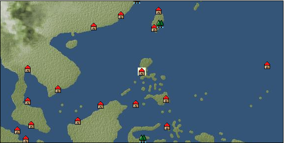

# Port: Manila

import Tabs from '@theme/Tabs';
import TabItem from '@theme/TabItem';

## General Information

| Attribute | Details |
| :--- | :--- |
| **Port Name** | Manila |
| **Port Type** | port of alliance |
| **Region** | Southeast Asia |
| **Sea Area** | celebes sea |
| **Required Language** | Malayu Tagalog |
| **Coordinates** | （5572，4268） |
| **Investment Reward** | [Lot (NO.12)](docs/Items/Consumables/Consumables-Treasure-Chests/item_3015.md) （必要投資額：500,000ドゥカード） |

### Available Facilities

| guild | intermediary | exchange | tool shop | workshop craftsman | Painter | sculptor | peddler |
| --- | --- | --- | --- | --- | --- | --- | --- |
|   | ○ | ○ | ○ | ○ |   |   | ○ |
| Shipyard Master | Lumbermaker | Sail-maker | weapon craftsman | master | TavernFemale | archive | salesperson |
| --- | --- | --- | --- | --- | --- | --- | --- |
| ○ |   | ○ |   | ○ |   |   |   |
| Shipwright | 銀行 | street worker | 王宮 | Trading post | church | suburbs | translator |
| --- | --- | --- | --- | --- | --- | --- | --- |
| ○ | ○ | ○ |   |   |   |   |   |

### Description
A port town located in the southern part of Luzon. Malay settlements existed there, and trade was active. In the late 16th century, it was occupied by the Spanish Legazpi. Trader (market information) Cultural area: Indochina

<Tabs>
  <TabItem value="trade_goods_sales" label="Trade Goods Sales">

| Item | Group | Purchase Price | Allied Price | Remarks |
| --- | --- | --- | --- | --- |
| [banana](docs/Items/TradeGoods/TradeGoods-Sunddries/item_1947.md) | [Trading goods (hobby goods)](docs/Categories/category_10.md) | (150) | 132 |  |
| [patchouli](docs/Items/TradeGoods/TradeGoods-Perfume/item_1963.md) | [Trading Goods (Spices)](docs/Categories/category_11.md) | (1,396) | 1,222 |  |
| [Manila hemp](docs/Items/TradeGoods/TradeGoods-Fibers/item_2098.md) | [交易品（繊維）](docs/Categories/category_1.md) | (146) | 128 |  |
| [pearl](docs/Items/TradeGoods/TradeGoods-Gems/item_769.md) | [Trading Items (Gemstones)](docs/Categories/category_15.md) | (4,857) | 4,250 |  |
| [sugar](docs/Items/TradeGoods/TradeGoods-Seasonings/item_94.md) | [交易品（調味料）](docs/Categories/category_4.md) | (653) | 572 |  |
| [copper ore](docs/Items/TradeGoods/TradeGoods-Minerals/item_65.md) | [Trading Items (Iron Stone)](docs/Categories/category_7.md) | (790) | 692 |  |
| [陸稲](docs/Items/TradeGoods/TradeGoods-Foodstuffs/item_100.md) | [Trading items (food items)](docs/Categories/category_3.md) | (41) | 36 |  |
  </TabItem>
  <TabItem value="sale_specialty" label="Sale (Specialty)">

| Item | Group | sale price | Allied Price | Remarks |
| --- | --- | --- | --- | --- |

#### [交易品（繊維）](docs/Categories/category_1.md)

| [Basho](docs/Items/TradeGoods/TradeGoods-Fibers/item_3862.md) | 交易品（繊維） | (4,525) | 5,280 |  |
| [tiger skin](docs/Items/TradeGoods/TradeGoods-Fibers/item_3790.md) | 交易品（繊維） | 5,800 | 15,814 |  |

#### [Trading Goods (Dye)](docs/Categories/category_2.md)

| [Indian indigo](docs/Items/TradeGoods/TradeGoods-Dye/item_157.md) | Trading Goods (Dye) | 543 | (610) |  |
| [Shorou](docs/Items/TradeGoods/TradeGoods-Dye/item_3691.md) | Trading Goods (Dye) | 9,040 | (10,170) |  |
| [mimosa](docs/Items/TradeGoods/TradeGoods-Dye/item_2281.md) | Trading Goods (Dye) | (584) | 681 |  |
| [Locao](docs/Items/TradeGoods/TradeGoods-Dye/item_3909.md) | Trading Goods (Dye) | (4,663) | 5,441 |  |
| [gallnut](docs/Items/TradeGoods/TradeGoods-Dye/item_3429.md) | Trading Goods (Dye) | 4,791 | (5,390) |  |

#### [Trading items (food items)](docs/Categories/category_3.md)

| [buckwheat](docs/Items/TradeGoods/TradeGoods-Foodstuffs/item_3430.md) | Trading items (food items) | 10,785 | 11,932 |  |
| [Karasumi](docs/Items/TradeGoods/TradeGoods-Foodstuffs/item_3687.md) | Trading items (food items) | (4,513) | 5,266 |  |
| [Chamtashima](docs/Items/TradeGoods/TradeGoods-Foodstuffs/item_3771.md) | Trading items (food items) | 5,662 | (6,370) |  |
| [Lingjiao](docs/Items/TradeGoods/TradeGoods-Foodstuffs/item_3917.md) | Trading items (food items) | 2,941 | (3,308) |  |
| [Chinese noodles](docs/Items/TradeGoods/TradeGoods-Foodstuffs/item_3906.md) | Trading items (food items) | (5,125) | 5,980 |  |

#### [交易品（調味料）](docs/Categories/category_4.md)

| [Sha Cha Ji](docs/Items/TradeGoods/TradeGoods-Seasonings/item_3689.md) | 交易品（調味料） | (17,689) | 20,640 |  |
| [羅漢果](docs/Items/TradeGoods/TradeGoods-Seasonings/item_4004.md) | 交易品（調味料） | (2,204) | 2,571 |  |
| [Bean sauce](docs/Items/TradeGoods/TradeGoods-Seasonings/item_3875.md) | 交易品（調味料） | (4,491) | 5,240 |  |
| [soy sauce](docs/Items/TradeGoods/TradeGoods-Seasonings/item_3425.md) | 交易品（調味料） | 5,372 | (6,044) |  |

#### [交易品（雑貨）](docs/Categories/category_5.md)

| [chinese books](docs/Items/TradeGoods/TradeGoods-Misc/item_3927.md) | 交易品（雑貨） | (4,741) | 5,532 |  |
| Re-examined on April 25, 2017. |
| [old ink stick](docs/Items/TradeGoods/TradeGoods-Misc/item_3921.md) | 交易品（雑貨） | (2,430) | 2,835 |  |
| [Japanese books](docs/Items/TradeGoods/TradeGoods-Misc/item_3439.md) | 交易品（雑貨） | 4,740 | (5,333) |  |
| [Korean books](docs/Items/TradeGoods/TradeGoods-Misc/item_3750.md) | 交易品（雑貨） | 7,375 | (8,297) |  |

#### [Trading products (medical products)](docs/Categories/category_6.md)

| [tea tree](docs/Items/TradeGoods/TradeGoods-Medicine/item_2283.md) | Trading products (medical products) | (534) | 623 |  |
| [Borei](docs/Items/TradeGoods/TradeGoods-Medicine/item_3678.md) | Trading products (medical products) | 7,402 | (8,328) |  |
| [Cordyceps sinensis](docs/Items/TradeGoods/TradeGoods-Medicine/item_3839.md) | Trading products (medical products) | (4,450) | 5,192 |  |
| [calamus](docs/Items/TradeGoods/TradeGoods-Medicine/item_3427.md) | Trading products (medical products) | 4,905 | (5,518) |  |

#### [Trading Items (Iron Stone)](docs/Categories/category_7.md)

| [white porcelain ore](docs/Items/TradeGoods/TradeGoods-Minerals/item_3433.md) | Trading Items (Iron Stone) | 5,398 | (6,073) |  |
| [red copper ore](docs/Items/TradeGoods/TradeGoods-Minerals/item_3863.md) | Trading Items (Iron Stone) | (4,574) | 5,337 |  |
| [medical stone](docs/Items/TradeGoods/TradeGoods-Minerals/item_3786.md) | Trading Items (Iron Stone) | 7,352 | (8,271) |  |

#### [Trading products (precious metals)](docs/Categories/category_8.md)

| [platinum](docs/Items/TradeGoods/TradeGoods-Metals/item_2178.md) | Trading products (precious metals) | 6,057 | (6,814) |  |
| [佐摩銀](docs/Items/TradeGoods/TradeGoods-Metals/item_3432.md) | Trading products (precious metals) | 5,153 | (5,797) |  |
| [Jinguashijin](docs/Items/TradeGoods/TradeGoods-Metals/item_3693.md) | Trading products (precious metals) | 9,055 | (10,187) |  |
| [雲南銀](docs/Items/TradeGoods/TradeGoods-Metals/item_3905.md) | Trading products (precious metals) | (4,530) | 5,285 |  |

#### [交易品（酒類）](docs/Categories/category_9.md)

| [aquavit](docs/Items/TradeGoods/TradeGoods-Alcohol/item_572.md) | 交易品（酒類） | 1,245 | (1,400) |  |
| [whiskey](docs/Items/TradeGoods/TradeGoods-Alcohol/item_1.md) | 交易品（酒類） | (1,088) | 1,269 |  |
| [紹興酒](docs/Items/TradeGoods/TradeGoods-Alcohol/item_3882.md) | 交易品（酒類） | (5,142) | 6,000 |  |

#### [Trading goods (hobby goods)](docs/Categories/category_10.md)

| [Aigyoku](docs/Items/TradeGoods/TradeGoods-Sunddries/item_3677.md) | Trading goods (hobby goods) | 4,830 | (5,434) |  |
| [eggplant](docs/Items/TradeGoods/TradeGoods-Sunddries/item_3426.md) | Trading goods (hobby goods) | 14,588 | (16,413) |  |
| [Chinese tea](docs/Items/TradeGoods/TradeGoods-Sunddries/item_3907.md) | Trading goods (hobby goods) | (5,151) | 6,010 |  |
| [Korean tea](docs/Items/TradeGoods/TradeGoods-Sunddries/item_3751.md) | Trading goods (hobby goods) | 4,973 | (5,595) |  |
| [金針花](docs/Items/TradeGoods/TradeGoods-Sunddries/item_3739.md) | Trading goods (hobby goods) | (2,297) | 2,680 |  |

#### [Trading Goods (Spices)](docs/Categories/category_11.md)

| [Osmanthus](docs/Items/TradeGoods/TradeGoods-Perfume/item_3925.md) | Trading Goods (Spices) | (4,459) | 5,203 |  |
| [gardenia](docs/Items/TradeGoods/TradeGoods-Perfume/item_1091.md) | Trading Goods (Spices) | 8,201 | 11,745 |  |
| [Chindarle](docs/Items/TradeGoods/TradeGoods-Perfume/item_3795.md) | Trading Goods (Spices) | 7,153 | (8,047) |  |
| [eucalyptus](docs/Items/TradeGoods/TradeGoods-Perfume/item_2278.md) | Trading Goods (Spices) | (373) | 435 |  |

#### [Trading Goods (Spices)](docs/Categories/category_12.md)

| [Kouzuku](docs/Items/TradeGoods/TradeGoods-Spices/item_3690.md) | Trading Goods (Spices) | (4,503) | 5,254 |  |
| [Sanshou](docs/Items/TradeGoods/TradeGoods-Spices/item_3794.md) | Trading Goods (Spices) | 4,970 | (5,591) |  |
| [star anise](docs/Items/TradeGoods/TradeGoods-Spices/item_3908.md) | Trading Goods (Spices) | (5,250) | 6,125 |  |
| [Grapefruit](docs/Items/TradeGoods/TradeGoods-Spices/item_3422.md) | Trading Goods (Spices) | 4,560 | (5,130) |  |

#### [Trading goods (artificial goods)](docs/Categories/category_13.md)

| [Tumbaga](docs/Items/TradeGoods/TradeGoods-Luxuries/item_3028.md) | Trading goods (artificial goods) | 9,440 | (10,621) |  |
| [Kuresute](docs/Items/TradeGoods/TradeGoods-Luxuries/item_3897.md) | Trading goods (artificial goods) | (2,548) | 2,973 |  |
| [Song Baici](docs/Items/TradeGoods/TradeGoods-Luxuries/item_3904.md) | Trading goods (artificial goods) | (4,497) | 5,247 |  |
| [湖筆](docs/Items/TradeGoods/TradeGoods-Luxuries/item_3898.md) | Trading goods (artificial goods) | (2,186) | 2,550 |  |
| [lacquerware](docs/Items/TradeGoods/TradeGoods-Luxuries/item_3435.md) | Trading goods (artificial goods) | 8,712 | 12,841 |  |
| [Goryeo celadon](docs/Items/TradeGoods/TradeGoods-Luxuries/item_3758.md) | Trading goods (artificial goods) | 7,904 | (8,892) |  |

#### [交易品（美術品）](docs/Categories/category_14.md)

| [chinese calligraphy](docs/Items/TradeGoods/TradeGoods-Art/item_3926.md) | 交易品（美術品） | (4,554) | 5,313 |  |
| [Japanese painting](docs/Items/TradeGoods/TradeGoods-Art/item_3436.md) | 交易品（美術品） | 9,308 | 13,524 |  |
| [Mother-of-pearl lacquerware](docs/Items/TradeGoods/TradeGoods-Art/item_3785.md) | 交易品（美術品） | 8,127 | (9,143) |  |

#### [Trading Items (Gemstones)](docs/Categories/category_15.md)

| [alexandrite](docs/Items/TradeGoods/TradeGoods-Gems/item_4429.md) | Trading Items (Gemstones) | 11,315 | (12,730) |  |
| [inca rose](docs/Items/TradeGoods/TradeGoods-Gems/item_3014.md) | Trading Items (Gemstones) | 10,902 | (12,265) |  |
| [pink diamond](docs/Items/TradeGoods/TradeGoods-Gems/item_2874.md) | Trading Items (Gemstones) | 3,941 | (4,434) |  |
| [amethyst](docs/Items/TradeGoods/TradeGoods-Gems/item_3434.md) | Trading Items (Gemstones) | (13,468) | 15,715 |  |
| [mutton fat white jade](docs/Items/TradeGoods/TradeGoods-Gems/item_3903.md) | Trading Items (Gemstones) | (4,567) | 5,329 |  |
| [tiger eye stone](docs/Items/TradeGoods/TradeGoods-Gems/item_3797.md) | Trading Items (Gemstones) | 6,895 | (7,757) |  |

#### [Trading Items (Arms)](docs/Categories/category_16.md)

| [broadsword](docs/Items/TradeGoods/TradeGoods-Weapons/item_3754.md) | Trading Items (Arms) | 7,990 | 8,610 |  |
| [Japanese sword](docs/Items/TradeGoods/TradeGoods-Weapons/item_3437.md) | Trading Items (Arms) | 8,949 | 9,560 |  |
| [藤製鎧](docs/Items/TradeGoods/TradeGoods-Weapons/item_4276.md) | Trading Items (Arms) | (7,342) | 8,566 |  |
| [Blue dragon sword](docs/Items/TradeGoods/TradeGoods-Weapons/item_3923.md) | Trading Items (Arms) | (4,590) | 5,355 |  |

#### [Trading Items (Firearms)](docs/Categories/category_17.md)

| [musket gun](docs/Items/TradeGoods/TradeGoods-Firearms/item_584.md) | Trading Items (Firearms) | (5,440) | 6,347 |  |
| In Davao, 94% is 6200. Why? |
| [monocular gun](docs/Items/TradeGoods/TradeGoods-Firearms/item_3916.md) | Trading Items (Firearms) | (4,549) | 5,308 |  |
| [throwing bomb](docs/Items/TradeGoods/TradeGoods-Firearms/item_3784.md) | Trading Items (Firearms) | 8,063 | (9,071) |  |
| [tanegashima gun](docs/Items/TradeGoods/TradeGoods-Firearms/item_3423.md) | Trading Items (Firearms) | 5,180 | 9,639 |  |

#### [Trading Goods (Livestock)](docs/Categories/category_18.md)

| [boar](docs/Items/TradeGoods/TradeGoods-Livestock/item_3476.md) | Trading Goods (Livestock) | 8,291 | 11,883 |  |
| [water buffalo](docs/Items/TradeGoods/TradeGoods-Livestock/item_3688.md) | Trading Goods (Livestock) | 5,548 | 26,123 |  |
| [donkey](docs/Items/TradeGoods/TradeGoods-Livestock/item_3924.md) | Trading Goods (Livestock) | 5,690 | 6,066 |  |
| [韓牛](docs/Items/TradeGoods/TradeGoods-Livestock/item_3792.md) | Trading Goods (Livestock) | 8,235 | (9,265) |  |

#### [交易品（工業品）](docs/Categories/category_19.md)

| [Japanese paper](docs/Items/TradeGoods/TradeGoods-Wares/item_3438.md) | 交易品（工業品） | 8,724 | (9,815) |  |
| [bamboo](docs/Items/TradeGoods/TradeGoods-Wares/item_3899.md) | 交易品（工業品） | (4,486) | 5,234 |  |
| [韓紙](docs/Items/TradeGoods/TradeGoods-Wares/item_3755.md) | 交易品（工業品） | 8,694 | (9,781) |  |

#### [交易品（織物）](docs/Categories/category_20.md)

| [Awaiyo](docs/Items/TradeGoods/TradeGoods-Fabrics/item_3002.md) | 交易品（織物） | 4,209 | (4,735) |  |
| [Karasa Sarasa](docs/Items/TradeGoods/TradeGoods-Fabrics/item_3637.md) | 交易品（織物） | 7,343 | (8,261) |  |
| [唐錦](docs/Items/TradeGoods/TradeGoods-Fabrics/item_3896.md) | 交易品（織物） | (4,477) | 5,224 |  |
| [明紬](docs/Items/TradeGoods/TradeGoods-Fabrics/item_3753.md) | 交易品（織物） | 8,526 | (9,592) |  |
| [Nishijin textile](docs/Items/TradeGoods/TradeGoods-Fabrics/item_3431.md) | 交易品（織物） | 8,537 | (9,605) |  |
| [麻織物](docs/Items/TradeGoods/TradeGoods-Fabrics/item_3673.md) | 交易品（織物） | (4,509) | 5,261 |  |
  </TabItem>
  <TabItem value="sale_no_specialty" label="Sale (No Specialty)">

| Item | Group | sale price | Allied Price | Remarks |
| --- | --- | --- | --- | --- |

#### [交易品（繊維）](docs/Categories/category_1.md)

| [Rush](docs/Items/TradeGoods/TradeGoods-Fibers/item_3675.md) | 交易品（繊維） | (11,495) | 13,412 |  |
| [Green ramie](docs/Items/TradeGoods/TradeGoods-Fibers/item_3428.md) | 交易品（繊維） | 4,728 | (5,319) |  |
| [deerskin](docs/Items/TradeGoods/TradeGoods-Fibers/item_3648.md) | 交易品（繊維） | 4,992 | 7,600 |  |
| [numb](docs/Items/TradeGoods/TradeGoods-Fibers/item_900.md) | 交易品（繊維） | 12 | (13) |  |

#### [Trading Goods (Dye)](docs/Categories/category_2.md)

| [purple root](docs/Items/TradeGoods/TradeGoods-Dye/item_3752.md) | Trading Goods (Dye) | (6,347) | 7,406 |  |

#### [Trading items (food items)](docs/Categories/category_3.md)

| [sausage](docs/Items/TradeGoods/TradeGoods-Foodstuffs/item_27.md) | Trading items (food items) | (412) | 480 |  |
| [taro](docs/Items/TradeGoods/TradeGoods-Foodstuffs/item_1960.md) | Trading items (food items) | (166) | 193 |  |
| [mutton](docs/Items/TradeGoods/TradeGoods-Foodstuffs/item_33.md) | Trading items (food items) | (426) | 496 |  |

#### [交易品（調味料）](docs/Categories/category_4.md)

| [anchovies](docs/Items/TradeGoods/TradeGoods-Seasonings/item_3004.md) | 交易品（調味料） | 174 | (195) |  |
| [Gochujang](docs/Items/TradeGoods/TradeGoods-Seasonings/item_3591.md) | 交易品（調味料） | (3,040) | 3,547 |  |

#### [交易品（雑貨）](docs/Categories/category_5.md)

| [Rattan work](docs/Items/TradeGoods/TradeGoods-Misc/item_4277.md) | 交易品（雑貨） | (6,504) | 7,589 |  |

#### [Trading products (medical products)](docs/Categories/category_6.md)

| [Centennial grass](docs/Items/TradeGoods/TradeGoods-Medicine/item_5503.md) | Trading products (medical products) | 2,356 | (2,650) |  |

#### [Trading Items (Iron Stone)](docs/Categories/category_7.md)

| [Hokutolite](docs/Items/TradeGoods/TradeGoods-Minerals/item_3694.md) | Trading Items (Iron Stone) | (6,797) | 7,930 |  |

#### [Trading products (precious metals)](docs/Categories/category_8.md)

| [Korean silver](docs/Items/TradeGoods/TradeGoods-Metals/item_3796.md) | Trading products (precious metals) | (6,719) | 7,840 |  |
| [gold](docs/Items/TradeGoods/TradeGoods-Metals/item_659.md) | Trading products (precious metals) | 6,888 | (7,749) |  |

#### [交易品（酒類）](docs/Categories/category_9.md)

| [Beer](docs/Items/TradeGoods/TradeGoods-Alcohol/item_2.md) | 交易品（酒類） | 312 | (351) |  |
| [Taiwan rice wine](docs/Items/TradeGoods/TradeGoods-Alcohol/item_3672.md) | 交易品（酒類） | 4,900 | (5,513) |  |
| [Sake](docs/Items/TradeGoods/TradeGoods-Alcohol/item_3424.md) | 交易品（酒類） | 5,216 | 12,016 |  |

#### [Trading goods (hobby goods)](docs/Categories/category_10.md)

| [black tea](docs/Items/TradeGoods/TradeGoods-Sunddries/item_675.md) | Trading goods (hobby goods) | (1,121) | 1,307 |  |

#### [Trading Goods (Spices)](docs/Categories/category_11.md)

| [benzoin](docs/Items/TradeGoods/TradeGoods-Perfume/item_1962.md) | Trading Goods (Spices) | 1,032 | (1,161) |  |
| [agarwood](docs/Items/TradeGoods/TradeGoods-Perfume/item_1058.md) | Trading Goods (Spices) | (2,134) | 2,489 |  |
| [Musk](docs/Items/TradeGoods/TradeGoods-Perfume/item_158.md) | Trading Goods (Spices) | (3,542) | 4,133 |  |

#### [Trading Goods (Spices)](docs/Categories/category_12.md)

| [cumin](docs/Items/TradeGoods/TradeGoods-Spices/item_156.md) | Trading Goods (Spices) | 912 | (1,026) |  |
| [cloves](docs/Items/TradeGoods/TradeGoods-Spices/item_1092.md) | Trading Goods (Spices) | 496 | (558) |  |
| [pepper](docs/Items/TradeGoods/TradeGoods-Spices/item_58.md) | Trading Goods (Spices) | (176) | 205 |  |
| [cinnamon](docs/Items/TradeGoods/TradeGoods-Spices/item_1432.md) | Trading Goods (Spices) | 208 | (234) |  |
| [ginger](docs/Items/TradeGoods/TradeGoods-Spices/item_112.md) | Trading Goods (Spices) | 714 | (803) |  |
| [nutmeg](docs/Items/TradeGoods/TradeGoods-Spices/item_1969.md) | Trading Goods (Spices) | 519 | (583) |  |
| [mace](docs/Items/TradeGoods/TradeGoods-Spices/item_2100.md) | Trading Goods (Spices) | 707 | (795) |  |

#### [Trading goods (artificial goods)](docs/Categories/category_13.md)

| [Corner work](docs/Items/TradeGoods/TradeGoods-Luxuries/item_3696.md) | Trading goods (artificial goods) | (7,330) | 8,553 |  |

#### [交易品（美術品）](docs/Categories/category_14.md)

| [taiwan wood carving](docs/Items/TradeGoods/TradeGoods-Art/item_3697.md) | 交易品（美術品） | 5,353 | 87,442 |  |

#### [Trading Items (Gemstones)](docs/Categories/category_15.md)

| [Tortoiseshell](docs/Items/TradeGoods/TradeGoods-Gems/item_1980.md) | Trading Items (Gemstones) | 1,500 | (1,687) |  |
| [aventurine](docs/Items/TradeGoods/TradeGoods-Gems/item_678.md) | Trading Items (Gemstones) | 1,760 | (1,980) |  |
| [emerald](docs/Items/TradeGoods/TradeGoods-Gems/item_777.md) | Trading Items (Gemstones) | 3,444 | (3,874) |  |
| [malachite](docs/Items/TradeGoods/TradeGoods-Gems/item_679.md) | Trading Items (Gemstones) | 1,872 | (2,106) |  |

#### [Trading Items (Arms)](docs/Categories/category_16.md)

| [Japanese bow](docs/Items/TradeGoods/TradeGoods-Weapons/item_3469.md) | Trading Items (Arms) | (5,330) | 6,219 |  |
| [japanese armor](docs/Items/TradeGoods/TradeGoods-Weapons/item_3590.md) | Trading Items (Arms) | (5,329) | 6,218 |  |
| [short bow](docs/Items/TradeGoods/TradeGoods-Weapons/item_3764.md) | Trading Items (Arms) | (5,421) | 6,325 |  |

#### [Trading Items (Firearms)](docs/Categories/category_17.md)

| [大砲](docs/Items/TradeGoods/TradeGoods-Firearms/item_4.md) | Trading Items (Firearms) | (4,457) | 5,200 |  |
| [銅手銃](docs/Items/TradeGoods/TradeGoods-Firearms/item_3700.md) | Trading Items (Firearms) | (7,539) | 8,796 |  |

#### [Trading Goods (Livestock)](docs/Categories/category_18.md)

| [rat](docs/Items/TradeGoods/TradeGoods-Livestock/item_2710.md) | Trading Goods (Livestock) | 18 | (20) |  |
| [sheep](docs/Items/TradeGoods/TradeGoods-Livestock/item_253.md) | Trading Goods (Livestock) | (115) | 134 |  |

#### [交易品（工業品）](docs/Categories/category_19.md)

| [Wisteria](docs/Items/TradeGoods/TradeGoods-Wares/item_4278.md) | 交易品（工業品） | (7,294) | 8,510 |  |

#### [交易品（織物）](docs/Categories/category_20.md)

| [indian chintz](docs/Items/TradeGoods/TradeGoods-Fabrics/item_159.md) | 交易品（織物） | (1,191) | 1,389 |  |
| [大和錦](docs/Items/TradeGoods/TradeGoods-Fabrics/item_3482.md) | 交易品（織物） | (7,693) | 8,976 |  |
| [Bingata](docs/Items/TradeGoods/TradeGoods-Fabrics/item_3479.md) | 交易品（織物） | (7,408) | 8,643 |  |
  </TabItem>
  <TabItem value="guild_&_others" label="Guild & Others">

| Item | Group | Sales price | Handling NPC | Remarks |
| --- | --- | --- | --- | --- |

#### López de Legazpi

| [weapons technology](docs/Skills/Skill-Battle/item_1731.md) | [Skill (combat)](docs/Categories/category_41.md) | 300,000 | López de Legazpi |  |
| [Indian languages](docs/Skills/Skills-Language/item_590.md) | [Skills (language)](docs/Categories/category_42.md) | 30,000 | López de Legazpi |  |
| [Oceanian languages](docs/Skills/Skills-Language/item_2277.md) | [Skills (language)](docs/Categories/category_42.md) | 1,000,000 | López de Legazpi |  |
  </TabItem>
  <TabItem value="toolman" label="Toolman">

| Item | Group | Sales price | Handling NPC | Remarks |
| --- | --- | --- | --- | --- |

#### [Equipment (body)](docs/Categories/category_24.md)

| [pirate vest](docs/Items/Equipment/Equipment-Body/item_98.md) | Equipment (body) | 18,500 | tool shop owner |  |

#### [Equipment (legs)](docs/Categories/category_26.md)

| [cross strap sandals](docs/Items/Equipment/Equipment-Feet/item_99.md) | Equipment (legs) | 7,300 | tool shop owner |  |

#### [Equipment (belongings)](docs/Categories/category_27.md)

| [short sword](docs/Items/Equipment/Equipment-Weapon/item_301.md) | Equipment (belongings) | 9,300 | tool shop owner |  |

#### [Consumables (land battle/deck battle)](docs/Categories/category_29.md)

| [strong adhesive oil](docs/Items/Consumables/Consumables-Landbattle/item_662.md) | Consumables (land battle/deck battle) | 200 | tool shop owner |  |
| [tonic](docs/Items/Consumables/Consumables-Landbattle/item_1678.md) | Consumables (land battle/deck battle) | 300 | tool shop owner |  |
| [Arsenite poison](docs/Items/Consumables/Consumables-Landbattle/item_663.md) | Consumables (land battle/deck battle) | 400 | tool shop owner |  |

#### [Consumables (skill activation)](docs/Categories/category_31.md)

| [捕獲網](docs/Items/Consumables/Consumables-Skill/item_315.md) | Consumables (skill activation) | 300 | tool shop owner |  |
| [research monocle](docs/Items/Consumables/Consumables-Skill/item_120.md) | Consumables (skill activation) | 2,500 | tool shop owner |  |
  </TabItem>
  <TabItem value="kobo_craftsmen" label="Craftsman">

| Item | Group | Error 500 (Server Error)!!1500.That’s an error.There was an error. Please try again later.That’s all we know. | Handling NPC | Remarks |
| --- | --- | --- | --- | --- |

#### [Consumables (condition recovery)](docs/Categories/category_21.md)

| [Nostalgic carillon bell](docs/Items/Consumables/Consumables-Recovery/item_245.md) | Consumables (condition recovery) | 200 | workshop craftsman |  |
| [Ship song sheet music](docs/Items/Consumables/Consumables-Recovery/item_247.md) | Consumables (condition recovery) | 200 | workshop craftsman |  |

#### [Consumables (other)](docs/Categories/category_44.md)

| [帆塗料](docs/Items/Consumables/Consumables-Other/item_348.md) | Consumables (other) | 500 | workshop craftsman |  |
| [ship paint](docs/Items/Consumables/Consumables-Other/item_347.md) | Consumables (other) | 500 | workshop craftsman |  |
  </TabItem>
  <TabItem value="peddler" label="peddler">

| Item | Group | Sales price | Handling NPC | Remarks |
| --- | --- | --- | --- | --- |

#### [Consumables (condition recovery)](docs/Categories/category_21.md)

| [spare sail](docs/Items/Consumables/Consumables-Recovery/item_242.md) | Consumables (condition recovery) |  | peddler |  |
| [reserve rudder](docs/Items/Consumables/Consumables-Recovery/item_243.md) | Consumables (condition recovery) |  | peddler |  |
| [hand bucket](docs/Items/Consumables/Consumables-Recovery/item_69.md) | Consumables (condition recovery) |  | peddler |  |

#### [Consumables (land battle/deck battle)](docs/Categories/category_29.md)

| [煙玉](docs/Items/Consumables/Consumables-Landbattle/item_86.md) | Consumables (land battle/deck battle) |  | peddler |  |

#### [Consumables (naval/hand-to-hand combat)](docs/Categories/category_30.md)

| [evacuation bell](docs/Items/Consumables/Consumables-navalhand-to-hand combat/item_919.md) | Consumables (naval/hand-to-hand combat) |  | peddler |  |

#### [Consumables (skill activation)](docs/Categories/category_31.md)

| [life aid](docs/Items/Consumables/Consumables-Skill/item_67.md) | Consumables (skill activation) |  | peddler |  |
| [landmark ribbon](docs/Items/Consumables/Consumables-Skill/item_316.md) | Consumables (skill activation) |  | peddler |  |
  </TabItem>
  <TabItem value="shipyard" label="Shipyard">

### Shipyard Master

| Item | Group | Sales price | Handling NPC | Remarks |
| --- | --- | --- | --- | --- |

#### [Boat](docs/Categories/category_43.md)

| [sambouk](docs/Items/Ships/item_783.md) | Boat | 1,000,000 | Shipyard Master |  |
| [Dow](docs/Items/Ships/item_780.md) | Boat | 360,000 | Shipyard Master |  |
| [Varsha](docs/Items/Ships/item_201.md) | Boat | 2,000 | Shipyard Master |  |
| [commercial thumb book](docs/Items/Ships/item_785.md) | Boat | 1,100,000 | Shipyard Master |  |
| [commercial dow](docs/Items/Ships/item_782.md) | Boat | 372,000 | Shipyard Master |  |
| [commercial varsha](docs/Items/Ships/item_204.md) | Boat | 5,200 | Shipyard Master |  |
| [Battle Barsha](docs/Items/Ships/item_203.md) | Boat | 5,100 | Shipyard Master |  |
| [exploration barsha](docs/Items/Ships/item_202.md) | Boat | 5,000 | Shipyard Master |  |
| [Armed Sambouk](docs/Items/Ships/item_784.md) | Boat | 1,000,000 | Shipyard Master |  |
| [assault dhow](docs/Items/Ships/item_781.md) | Boat | 365,000 | Shipyard Master |  |

### Sail-maker

| Item | Group | Sales price | Handling NPC | Remarks |
| --- | --- | --- | --- | --- |

#### [Ship parts (auxiliary sails)](docs/Categories/category_33.md)

| [outer jib](docs/Items/ShipParts/Shipparts-Studding-Sail/item_331.md) | Ship parts (auxiliary sails) | 18,000 | Sail-maker |  |
| [Outer & inner jib](docs/Items/ShipParts/Shipparts-Studding-Sail/item_332.md) | Ship parts (auxiliary sails) | 23,000 | Sail-maker |  |
| [inner jib](docs/Items/ShipParts/Shipparts-Studding-Sail/item_279.md) | Ship parts (auxiliary sails) | 1,700 | Sail-maker |  |
| [Vorgernstaisl](docs/Items/ShipParts/Shipparts-Studding-Sail/item_333.md) | Ship parts (auxiliary sails) | 22,000 | Sail-maker |  |
| [Forestaisle](docs/Items/ShipParts/Shipparts-Studding-Sail/item_280.md) | Ship parts (auxiliary sails) | 8,300 | Sail-maker |  |
| [Foretop Gernsur](docs/Items/ShipParts/Shipparts-Studding-Sail/item_282.md) | Ship parts (auxiliary sails) | 2,400 | Sail-maker |  |
| [Foretop staysle](docs/Items/ShipParts/Shipparts-Studding-Sail/item_357.md) | Ship parts (auxiliary sails) | 29,000 | Sail-maker |  |
| [Fore Royal Stains](docs/Items/ShipParts/Shipparts-Studding-Sail/item_931.md) | Ship parts (auxiliary sails) | 70,000 | Sail-maker |  |
| [bonnet](docs/Items/ShipParts/Shipparts-Studding-Sail/item_329.md) | Ship parts (auxiliary sails) | 25,000 | Sail-maker |  |
| [mizungernstaisl](docs/Items/ShipParts/Shipparts-Studding-Sail/item_334.md) | Ship parts (auxiliary sails) | 22,000 | Sail-maker |  |
| [mizzen staple](docs/Items/ShipParts/Shipparts-Studding-Sail/item_281.md) | Ship parts (auxiliary sails) | 11,000 | Sail-maker |  |
| [mizzen top gelrunsle](docs/Items/ShipParts/Shipparts-Studding-Sail/item_283.md) | Ship parts (auxiliary sails) | 4,200 | Sail-maker |  |
| [mizzen top staysle](docs/Items/ShipParts/Shipparts-Studding-Sail/item_402.md) | Ship parts (auxiliary sails) | 35,000 | Sail-maker |  |
| [mizzen royal gelrunsle](docs/Items/ShipParts/Shipparts-Studding-Sail/item_284.md) | Ship parts (auxiliary sails) | 21,000 | Sail-maker |  |
| [small inner jib](docs/Items/ShipParts/Shipparts-Studding-Sail/item_278.md) | Ship parts (auxiliary sails) | 500 | Sail-maker |  |
| [wide bonnet](docs/Items/ShipParts/Shipparts-Studding-Sail/item_356.md) | Ship parts (auxiliary sails) | 38,000 | Sail-maker |  |
  </TabItem>
</Tabs>