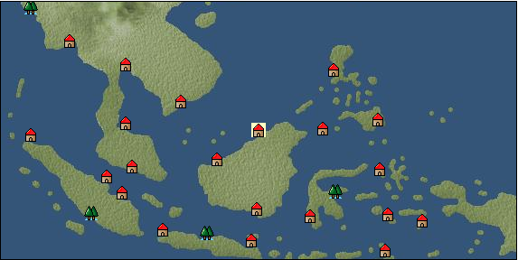

# Port: ブルネイ

import Tabs from '@theme/Tabs';
import TabItem from '@theme/TabItem';

## General Information

| Attribute | Details |
| :--- | :--- |
| **Port Name** | brunei |
| **Port Type** | port of alliance |
| **Region** | Southeast Asia |
| **Sea Area** | celebes sea |
| **Required Language** | Malayu Tagalog |
| **Coordinates** | （5238，4540） |
| **Investment Reward** | [Lot (NO.13)](Items/Consumables/Consumables-Treasure-Chests/item_3021.md) （必要投資額：500,000ドゥカード） |

### Available Facilities

| guild | intermediary | exchange | tool shop | workshop craftsman | Painter | sculptor | peddler |
| --- | --- | --- | --- | --- | --- | --- | --- |
|   |   | ○ | ○ | ○ |   |   | ○ |
| Shipyard Master | Lumbermaker | Sail-maker | weapon craftsman | master | TavernFemale | archive | salesperson |
| --- | --- | --- | --- | --- | --- | --- | --- |
| ○ | ○ |   |   |   |   |   |   |
| Shipwright | 銀行 | street worker | 王宮 | Trading post | church | suburbs | translator |
| --- | --- | --- | --- | --- | --- | --- | --- |
| ○ | ○ | ○ |   |   |   | ○ |   |

### Description
Islam is propagated in the center of the Kingdom of Brunei. It is a country rich in resources, producing oil and minerals. Suburbs: Southeast Brunei Cultural area: Southeast Asia

<Tabs>
  <TabItem value="trade_goods_sales" label="Trade Goods Sales">

| item | group | purchase price | 同盟時 | remarks |
| --- | --- | --- | --- | --- |
| [wood](Items/Trade Goods/TradeGoods-Wares/item_277.md) | [交易品（工業品）](Categories/category_19.md) | 675 | (591) |  |
| [agarwood](Items/Trade Goods/TradeGoods-Perfume/item_1058.md) | [Trading Goods (Spices)](Categories/category_11.md) | 1,954 | (1,710) |  |
| [oil](Items/Trade Goods/TradeGoods-Wares/item_613.md) | [交易品（工業品）](Categories/category_19.md) | 579 | 508 |  |
| 要投資（必要投資額：240,000） |
| [copper ore](Items/Trade Goods/TradeGoods-Minerals/item_65.md) | [Trading Items (Iron Stone)](Categories/category_7.md) | 789 | (691) |  |
| [魚肉](Items/Trade Goods/TradeGoods-Foodstuffs/item_10.md) | [Trading items (food items)](Categories/category_3.md) | 146 | 128 |  |
| [ebony](Items/Trade Goods/TradeGoods-Wares/item_2094.md) | [交易品（工業品）](Categories/category_19.md) | 1,200 | (1,050) |  |
  </TabItem>
  <TabItem value="sale_specialty" label="Sale (Specialty)">

| item | group | sale price | 同盟時 | remarks |
| --- | --- | --- | --- | --- |

#### [交易品（繊維）](Categories/category_1.md)

| [Basho](Items/Trade Goods/TradeGoods-Fibers/item_3862.md) | [交易品（繊維）](Categories/category_1.md) | 10,818 | (12,171) |  |
| [deerskin](Items/Trade Goods/TradeGoods-Fibers/item_3648.md) | [交易品（繊維）](Categories/category_1.md) | 14,790 | (16,640) |  |

#### [Trading Goods (Dye)](Categories/category_2.md)

| [mimosa](Items/Trade Goods/TradeGoods-Dye/item_2281.md) | [Trading Goods (Dye)](Categories/category_2.md) | (588) | 685 |  |
| [Locao](Items/Trade Goods/TradeGoods-Dye/item_3909.md) | [Trading Goods (Dye)](Categories/category_2.md) | 9,238 | (10,393) |  |
| [gallnut](Items/Trade Goods/TradeGoods-Dye/item_3429.md) | [Trading Goods (Dye)](Categories/category_2.md) | 9,000 | (10,125) |  |

#### [Trading items (food items)](Categories/category_3.md)

| [Chamtashima](Items/Trade Goods/TradeGoods-Foodstuffs/item_3771.md) | [Trading items (food items)](Categories/category_3.md) | 14,408 | (16,210) |  |
| [Lingjiao](Items/Trade Goods/TradeGoods-Foodstuffs/item_3917.md) | [Trading items (food items)](Categories/category_3.md) | 14,800 | (16,651) |  |
| [Chinese noodles](Items/Trade Goods/TradeGoods-Foodstuffs/item_3906.md) | [Trading items (food items)](Categories/category_3.md) | 10,159 | (11,429) |  |

#### [交易品（調味料）](Categories/category_4.md)

| [Bean sauce](Items/Trade Goods/TradeGoods-Seasonings/item_3875.md) | [交易品（調味料）](Categories/category_4.md) | 9,066 | (10,200) |  |

#### [交易品（雑貨）](Categories/category_5.md)

| [chinese books](Items/Trade Goods/TradeGoods-Misc/item_3927.md) | [交易品（雑貨）](Categories/category_5.md) | 9,425 | (10,604) |  |
| [Japanese books](Items/Trade Goods/TradeGoods-Misc/item_3439.md) | [交易品（雑貨）](Categories/category_5.md) | 9,310 | (10,474) |  |
| [Korean books](Items/Trade Goods/TradeGoods-Misc/item_3750.md) | [交易品（雑貨）](Categories/category_5.md) | 7,111 | (8,000) |  |

#### [Trading products (medical products)](Categories/category_6.md)

| [tea tree](Items/Trade Goods/TradeGoods-Medicine/item_2283.md) | [Trading products (medical products)](Categories/category_6.md) | (552) | 643 |  |
| [Borei](Items/Trade Goods/TradeGoods-Medicine/item_3678.md) | [Trading products (medical products)](Categories/category_6.md) | 10,340 | (11,633) |  |
| [Cordyceps sinensis](Items/Trade Goods/TradeGoods-Medicine/item_3839.md) | [Trading products (medical products)](Categories/category_6.md) | 9,711 | (10,925) |  |
| [calamus](Items/Trade Goods/TradeGoods-Medicine/item_3427.md) | [Trading products (medical products)](Categories/category_6.md) | 8,900 | (10,013) |  |

#### [Trading Items (Iron Stone)](Categories/category_7.md)

| [white porcelain ore](Items/Trade Goods/TradeGoods-Minerals/item_3433.md) | [Trading Items (Iron Stone)](Categories/category_7.md) | 8,943 | (10,061) |  |
| [medical stone](Items/Trade Goods/TradeGoods-Minerals/item_3786.md) | [Trading Items (Iron Stone)](Categories/category_7.md) | 7,310 | (8,224) |  |

#### [Trading products (precious metals)](Categories/category_8.md)

| [platinum](Items/Trade Goods/TradeGoods-Metals/item_2178.md) | [Trading products (precious metals)](Categories/category_8.md) | (5,691) | 6,640 |  |
| [佐摩銀](Items/Trade Goods/TradeGoods-Metals/item_3432.md) | [Trading products (precious metals)](Categories/category_8.md) | (4,381) | 5,111 |  |
| [雲南銀](Items/Trade Goods/TradeGoods-Metals/item_3905.md) | [Trading products (precious metals)](Categories/category_8.md) | 9,671 | (10,880) |  |

#### [Trading goods (hobby goods)](Categories/category_10.md)

| [Aigyoku](Items/Trade Goods/TradeGoods-Sunddries/item_3677.md) | [Trading goods (hobby goods)](Categories/category_10.md) | (8,075) | 9,422 |  |
| [eggplant](Items/Trade Goods/TradeGoods-Sunddries/item_3426.md) | [Trading goods (hobby goods)](Categories/category_10.md) | 8,356 | (9,401) |  |
| [Chinese tea](Items/Trade Goods/TradeGoods-Sunddries/item_3907.md) | [Trading goods (hobby goods)](Categories/category_10.md) | 10,043 | (11,299) |  |
| [Korean tea](Items/Trade Goods/TradeGoods-Sunddries/item_3751.md) | [Trading goods (hobby goods)](Categories/category_10.md) | 8,580 | (9,653) |  |

#### [Trading Goods (Spices)](Categories/category_11.md)

| [Osmanthus](Items/Trade Goods/TradeGoods-Perfume/item_3925.md) | [Trading Goods (Spices)](Categories/category_11.md) | 9,418 | (10,596) |  |
| [gardenia](Items/Trade Goods/TradeGoods-Perfume/item_1091.md) | [Trading Goods (Spices)](Categories/category_11.md) | 8,190 | (9,214) |  |
| [Chindarle](Items/Trade Goods/TradeGoods-Perfume/item_3795.md) | [Trading Goods (Spices)](Categories/category_11.md) | 7,120 | (8,010) |  |
| [eucalyptus](Items/Trade Goods/TradeGoods-Perfume/item_2278.md) | [Trading Goods (Spices)](Categories/category_11.md) | (371) | 432 |  |

#### [Trading Goods (Spices)](Categories/category_12.md)

| [Kouzuku](Items/Trade Goods/TradeGoods-Spices/item_3690.md) | [Trading Goods (Spices)](Categories/category_12.md) | 12,800 | (14,401) |  |
| [Sanshou](Items/Trade Goods/TradeGoods-Spices/item_3794.md) | [Trading Goods (Spices)](Categories/category_12.md) | (13,119) | 15,307 |  |
| [star anise](Items/Trade Goods/TradeGoods-Spices/item_3908.md) | [Trading Goods (Spices)](Categories/category_12.md) | 9,545 | (10,739) |  |
| [chili pepper](Items/Trade Goods/TradeGoods-Spices/item_1831.md) | [Trading Goods (Spices)](Categories/category_12.md) | 698 | (785) |  |
| [Grapefruit](Items/Trade Goods/TradeGoods-Spices/item_3422.md) | [Trading Goods (Spices)](Categories/category_12.md) | 9,285 | 13,110 |  |
| [green chili pepper](Items/Trade Goods/TradeGoods-Spices/item_1990.md) | [Trading Goods (Spices)](Categories/category_12.md) | 1,087 | (1,222) |  |

#### [Trading goods (artificial goods)](Categories/category_13.md)

| [Song Baici](Items/Trade Goods/TradeGoods-Luxuries/item_3904.md) | [Trading goods (artificial goods)](Categories/category_13.md) | 10,964 | (12,335) |  |
| [lacquerware](Items/Trade Goods/TradeGoods-Luxuries/item_3435.md) | [Trading goods (artificial goods)](Categories/category_13.md) | 8,612 | (9,689) |  |
| [Goryeo celadon](Items/Trade Goods/TradeGoods-Luxuries/item_3758.md) | [Trading goods (artificial goods)](Categories/category_13.md) | 8,142 | (9,160) |  |

#### [交易品（美術品）](Categories/category_14.md)

| [chinese calligraphy](Items/Trade Goods/TradeGoods-Art/item_3926.md) | [交易品（美術品）](Categories/category_14.md) | 10,740 | (12,083) |  |
| [Mother-of-pearl lacquerware](Items/Trade Goods/TradeGoods-Art/item_3785.md) | [交易品（美術品）](Categories/category_14.md) | 8,142 | (9,160) |  |

#### [Trading Items (Gemstones)](Categories/category_15.md)

| [topaz](Items/Trade Goods/TradeGoods-Gems/item_1097.md) | [Trading Items (Gemstones)](Categories/category_15.md) | 5,394 | (6,068) |  |
| [pink diamond](Items/Trade Goods/TradeGoods-Gems/item_2874.md) | [Trading Items (Gemstones)](Categories/category_15.md) | 4,039 | (4,544) |  |
| [amethyst](Items/Trade Goods/TradeGoods-Gems/item_3434.md) | [Trading Items (Gemstones)](Categories/category_15.md) | 14,531 | (16,348) |  |
| [mutton fat white jade](Items/Trade Goods/TradeGoods-Gems/item_3903.md) | [Trading Items (Gemstones)](Categories/category_15.md) | 9,157 | (10,302) |  |
| [tiger eye stone](Items/Trade Goods/TradeGoods-Gems/item_3797.md) | [Trading Items (Gemstones)](Categories/category_15.md) | 6,989 | (7,863) |  |

#### [Trading Items (Arms)](Categories/category_16.md)

| [broadsword](Items/Trade Goods/TradeGoods-Weapons/item_3754.md) | [Trading Items (Arms)](Categories/category_16.md) | 8,010 | (9,012) |  |
| [Japanese sword](Items/Trade Goods/TradeGoods-Weapons/item_3437.md) | [Trading Items (Arms)](Categories/category_16.md) | 8,881 | (9,992) |  |
| [Blue dragon sword](Items/Trade Goods/TradeGoods-Weapons/item_3923.md) | [Trading Items (Arms)](Categories/category_16.md) | 10,657 | (11,990) |  |

#### [Trading Items (Firearms)](Categories/category_17.md)

| [monocular gun](Items/Trade Goods/TradeGoods-Firearms/item_3916.md) | [Trading Items (Firearms)](Categories/category_17.md) | 10,625 | (11,954) |  |
| [throwing bomb](Items/Trade Goods/TradeGoods-Firearms/item_3784.md) | [Trading Items (Firearms)](Categories/category_17.md) | 8,018 | (9,021) |  |
| [tanegashima gun](Items/Trade Goods/TradeGoods-Firearms/item_3423.md) | [Trading Items (Firearms)](Categories/category_17.md) | 11,429 | 13,266 |  |

#### [Trading Goods (Livestock)](Categories/category_18.md)

| [boar](Items/Trade Goods/TradeGoods-Livestock/item_3476.md) | [Trading Goods (Livestock)](Categories/category_18.md) | 1 | (1) |  |
| [water buffalo](Items/Trade Goods/TradeGoods-Livestock/item_3688.md) | [Trading Goods (Livestock)](Categories/category_18.md) | 23,500 | (26,440) |  |
| [donkey](Items/Trade Goods/TradeGoods-Livestock/item_3924.md) | [Trading Goods (Livestock)](Categories/category_18.md) | 11,888 | (13,375) |  |
| [韓牛](Items/Trade Goods/TradeGoods-Livestock/item_3792.md) | [Trading Goods (Livestock)](Categories/category_18.md) | 8,085 | (9,096) |  |

#### [交易品（工業品）](Categories/category_19.md)

| [Japanese paper](Items/Trade Goods/TradeGoods-Wares/item_3438.md) | [交易品（工業品）](Categories/category_19.md) | 8,729 | (9,821) |  |
| [韓紙](Items/Trade Goods/TradeGoods-Wares/item_3755.md) | [交易品（工業品）](Categories/category_19.md) | 8,720 | (9,810) |  |

#### [交易品（織物）](Categories/category_20.md)

| [唐錦](Items/Trade Goods/TradeGoods-Fabrics/item_3896.md) | [交易品（織物）](Categories/category_20.md) | 8,401 | (9,452) |  |
| [明紬](Items/Trade Goods/TradeGoods-Fabrics/item_3753.md) | [交易品（織物）](Categories/category_20.md) | 8,627 | (9,706) |  |
| [Nishijin textile](Items/Trade Goods/TradeGoods-Fabrics/item_3431.md) | [交易品（織物）](Categories/category_20.md) | 8,958 | (10,078) |  |
| [麻織物](Items/Trade Goods/TradeGoods-Fabrics/item_3673.md) | [交易品（織物）](Categories/category_20.md) | 5,356 | (6,026) |  |
  </TabItem>
  <TabItem value="sale_no_specialty" label="Sale (No Specialty)">

| item | group | sale price | 同盟時 | remarks |
| --- | --- | --- | --- | --- |

#### [交易品（繊維）](Categories/category_1.md)

| [Manila hemp](Items/Trade Goods/TradeGoods-Fibers/item_2098.md) | [交易品（繊維）](Categories/category_1.md) | (196) | 228 |  |
| [numb](Items/Trade Goods/TradeGoods-Fibers/item_900.md) | [交易品（繊維）](Categories/category_1.md) | 12 | (13) |  |

#### [Trading items (food items)](Categories/category_3.md)

| [陸稲](Items/Trade Goods/TradeGoods-Foodstuffs/item_100.md) | [Trading items (food items)](Categories/category_3.md) | (58) | 67 |  |

#### [交易品（調味料）](Categories/category_4.md)

| [coconut vinegar](Items/Trade Goods/TradeGoods-Seasonings/item_1988.md) | [交易品（調味料）](Categories/category_4.md) | 422 | (474) |  |

#### [Trading products (medical products)](Categories/category_6.md)

| [Saikaku](Items/Trade Goods/TradeGoods-Medicine/item_1959.md) | [Trading products (medical products)](Categories/category_6.md) | 2,049 | (2,305) |  |

#### [Trading products (precious metals)](Categories/category_8.md)

| [gold](Items/Trade Goods/TradeGoods-Metals/item_659.md) | [Trading products (precious metals)](Categories/category_8.md) | 6,888 | 6,888 |  |

#### [Trading goods (hobby goods)](Categories/category_10.md)

| [coconut](Items/Trade Goods/TradeGoods-Sunddries/item_96.md) | [Trading goods (hobby goods)](Categories/category_10.md) | (450) | 525 |  |
| [banana](Items/Trade Goods/TradeGoods-Sunddries/item_1947.md) | [Trading goods (hobby goods)](Categories/category_10.md) | (147) | 171 |  |
| [black tea](Items/Trade Goods/TradeGoods-Sunddries/item_675.md) | [Trading goods (hobby goods)](Categories/category_10.md) | 1,230 | 1,291 |  |

#### [Trading Goods (Spices)](Categories/category_11.md)

| [jasmine](Items/Trade Goods/TradeGoods-Perfume/item_772.md) | [Trading Goods (Spices)](Categories/category_11.md) | (3,129) | 3,650 |  |
| [patchouli](Items/Trade Goods/TradeGoods-Perfume/item_1963.md) | [Trading Goods (Spices)](Categories/category_11.md) | (1,298) | 1,514 |  |
| [sandalwood](Items/Trade Goods/TradeGoods-Perfume/item_771.md) | [Trading Goods (Spices)](Categories/category_11.md) | 1,445 | 1,456 |  |

#### [Trading Goods (Spices)](Categories/category_12.md)

| [garlic](Items/Trade Goods/TradeGoods-Spices/item_526.md) | [Trading Goods (Spices)](Categories/category_12.md) | 333 | (374) |  |
| [cloves](Items/Trade Goods/TradeGoods-Spices/item_1092.md) | [Trading Goods (Spices)](Categories/category_12.md) | 504 | (567) |  |
| [pepper](Items/Trade Goods/TradeGoods-Spices/item_58.md) | [Trading Goods (Spices)](Categories/category_12.md) | 522 | (587) |  |
| [cinnamon](Items/Trade Goods/TradeGoods-Spices/item_1432.md) | [Trading Goods (Spices)](Categories/category_12.md) | 208 | (234) |  |
| [nutmeg](Items/Trade Goods/TradeGoods-Spices/item_1969.md) | [Trading Goods (Spices)](Categories/category_12.md) | 534 | (600) |  |
| [mace](Items/Trade Goods/TradeGoods-Spices/item_2100.md) | [Trading Goods (Spices)](Categories/category_12.md) | 707 | (795) |  |

#### [Trading Items (Gemstones)](Categories/category_15.md)

| [aventurine](Items/Trade Goods/TradeGoods-Gems/item_678.md) | [Trading Items (Gemstones)](Categories/category_15.md) | 1,964 | (2,209) |  |
| [emerald](Items/Trade Goods/TradeGoods-Gems/item_777.md) | [Trading Items (Gemstones)](Categories/category_15.md) | 3,952 | (4,446) |  |
| [sapphire](Items/Trade Goods/TradeGoods-Gems/item_676.md) | [Trading Items (Gemstones)](Categories/category_15.md) | (3,674) | 4,286 |  |
| [malachite](Items/Trade Goods/TradeGoods-Gems/item_679.md) | [Trading Items (Gemstones)](Categories/category_15.md) | 2,054 | (2,310) |  |

#### [Trading Goods (Livestock)](Categories/category_18.md)

| [sheep](Items/Trade Goods/TradeGoods-Livestock/item_253.md) | [Trading Goods (Livestock)](Categories/category_18.md) | 131 | (147) |  |

#### [交易品（工業品）](Categories/category_19.md)

| [graphite](Items/Trade Goods/TradeGoods-Wares/item_25.md) | [交易品（工業品）](Categories/category_19.md) | (939) | 1,095 |  |
| [銅](Items/Trade Goods/TradeGoods-Wares/item_894.md) | [交易品（工業品）](Categories/category_19.md) | 1,034 | (1,163) |  |

#### [交易品（織物）](Categories/category_20.md)

| [indian chintz](Items/Trade Goods/TradeGoods-Fabrics/item_159.md) | [交易品（織物）](Categories/category_20.md) | 1,299 | (1,461) |  |
  </TabItem>
  <TabItem value="guild_&_others" label="Guild & Others">

| item | group | Sales price | Handling NPC | remarks |
| --- | --- | --- | --- | --- |
| There is no sales information for the item |
| --- |
  </TabItem>
  <TabItem value="toolman" label="Toolman">

| item | group | Sales price | Handling NPC | remarks |
| --- | --- | --- | --- | --- |

#### [Equipment (body)](Categories/category_24.md)

| [pirate vest](Items/Equipment/Equipment-Body/item_98.md) | [Equipment (body)](Categories/category_24.md) | 18,500 | tool shop owner |  |

#### [Equipment (legs)](Categories/category_26.md)

| [cross strap sandals](Items/Equipment/Equipment-Feet/item_99.md) | [Equipment (legs)](Categories/category_26.md) | 7,300 | tool shop owner |  |

#### [Equipment (belongings)](Categories/category_27.md)

| [short sword](Items/Equipment/Equipment-Weapon/item_301.md) | [Equipment (belongings)](Categories/category_27.md) | 9,300 | tool shop owner |  |

#### [Consumables (land battle/deck battle)](Categories/category_29.md)

| [strong adhesive oil](Items/Consumables/Consumables-Landbattle/item_662.md) | [Consumables (land battle/deck battle)](Categories/category_29.md) | 200 | tool shop owner |  |
| [tonic](Items/Consumables/Consumables-Landbattle/item_1678.md) | [Consumables (land battle/deck battle)](Categories/category_29.md) | 300 | tool shop owner |  |
| [Arsenite poison](Items/Consumables/Consumables-Landbattle/item_663.md) | [Consumables (land battle/deck battle)](Categories/category_29.md) | 400 | tool shop owner |  |

#### [Consumables (skill activation)](Categories/category_31.md)

| [捕獲網](Items/Consumables/Consumables-Skill/item_315.md) | [Consumables (skill activation)](Categories/category_31.md) | 300 | tool shop owner |  |
| [research monocle](Items/Consumables/Consumables-Skill/item_120.md) | [Consumables (skill activation)](Categories/category_31.md) | 2,500 | tool shop owner |  |
  </TabItem>
  <TabItem value="kobo_craftsmen" label="Craftsman">

| item | group | Sales price | Handling NPC | remarks |
| --- | --- | --- | --- | --- |

#### [Consumables (condition recovery)](Categories/category_21.md)

| [Nostalgic carillon bell](Items/Consumables/Consumables-Recovery/item_245.md) | [Consumables (condition recovery)](Categories/category_21.md) | 200 | workshop craftsman |  |
| [Ship song sheet music](Items/Consumables/Consumables-Recovery/item_247.md) | [Consumables (condition recovery)](Categories/category_21.md) | 200 | workshop craftsman |  |

#### [Consumables (other)](Categories/category_44.md)

| [帆塗料](Items/Consumables/Consumables-Other/item_348.md) | [Consumables (other)](Categories/category_44.md) | 500 | workshop craftsman |  |
| [ship paint](Items/Consumables/Consumables-Other/item_347.md) | [Consumables (other)](Categories/category_44.md) | 500 | workshop craftsman |  |
  </TabItem>
  <TabItem value="shipyard" label="Shipyard">

### Shipyard Master

| item | group | Sales price | Handling NPC | remarks |
| --- | --- | --- | --- | --- |

#### [Boat](Categories/category_43.md)

| [sambouk](Items/Ships/item_783.md) | [Boat](Categories/category_43.md) | 1,000,000 | Shipyard Master |  |
| [Dow](Items/Ships/item_780.md) | [Boat](Categories/category_43.md) | 360,000 | Shipyard Master |  |
| [Varsha](Items/Ships/item_201.md) | [Boat](Categories/category_43.md) | 2,000 | Shipyard Master |  |
| [commercial thumb book](Items/Ships/item_785.md) | [Boat](Categories/category_43.md) | 1,100,000 | Shipyard Master |  |
| [commercial dow](Items/Ships/item_782.md) | [Boat](Categories/category_43.md) | 372,000 | Shipyard Master |  |
| [commercial varsha](Items/Ships/item_204.md) | [Boat](Categories/category_43.md) | 5,200 | Shipyard Master |  |
| [Battle Barsha](Items/Ships/item_203.md) | [Boat](Categories/category_43.md) | 5,100 | Shipyard Master |  |
| [exploration barsha](Items/Ships/item_202.md) | [Boat](Categories/category_43.md) | 5,000 | Shipyard Master |  |
| [Armed Sambouk](Items/Ships/item_784.md) | [Boat](Categories/category_43.md) | 1,000,000 | Shipyard Master |  |
| [assault dhow](Items/Ships/item_781.md) | [Boat](Categories/category_43.md) | 365,000 | Shipyard Master |  |

### Lumbermaker

| item | group | Sales price | Handling NPC | remarks |
| --- | --- | --- | --- | --- |

#### [Ship parts (additional armor)](Categories/category_35.md)

| [elm board](Items/Ship Parts/Shipparts-Plates/item_328.md) | [Ship parts (additional armor)](Categories/category_35.md) | 13,000 | Lumbermaker |  |
| [cedar board](Items/Ship Parts/Shipparts-Plates/item_353.md) | [Ship parts (additional armor)](Categories/category_35.md) | 800 | Lumbermaker |  |
| [teak board](Items/Ship Parts/Shipparts-Plates/item_813.md) | [Ship parts (additional armor)](Categories/category_35.md) | 22,000 | Lumbermaker |  |
| [beach board](Items/Ship Parts/Shipparts-Plates/item_327.md) | [Ship parts (additional armor)](Categories/category_35.md) | 6,400 | Lumbermaker |  |
| [red pine board](Items/Ship Parts/Shipparts-Plates/item_326.md) | [Ship parts (additional armor)](Categories/category_35.md) | 2,700 | Lumbermaker |  |
| [lightweight mahogany board](Items/Ship Parts/Shipparts-Plates/item_831.md) | [Ship parts (additional armor)](Categories/category_35.md) | 56,000 | Lumbermaker |  |
| [lightweight rosewood plank](Items/Ship Parts/Shipparts-Plates/item_832.md) | [Ship parts (additional armor)](Categories/category_35.md) | 110,000 | Lumbermaker |  |
  </TabItem>
</Tabs>