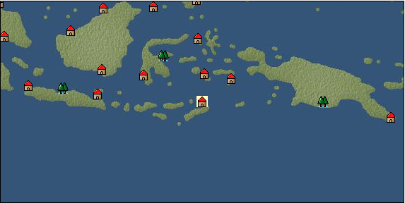

# Port: Dili

import Tabs from '@theme/Tabs';
import TabItem from '@theme/TabItem';

## General Information

| Attribute | Details |
| :--- | :--- |
| **Port Name** | Dili |
| **Port Type** | port of alliance |
| **Region** | Southeast Asia |
| **Sea Area** | banda sea |
| **Required Language** | Malayu Tagalog |
| **Coordinates** | （5799，5076） |
| **Investment Reward** | [Lot (NO.12)](docs/Items/Consumables/Consumables-Treasure-Chests/item_3015.md) （必要投資額：500,000ドゥカード） |

### Available Facilities

| guild | intermediary | exchange | tool shop | workshop craftsman | Painter | sculptor | peddler |
| --- | --- | --- | --- | --- | --- | --- | --- |
|   |   | ○ | ○ |   |   |   |   |
| Shipyard Master | Lumbermaker | Sail-maker | weapon craftsman | master | TavernFemale | archive | salesperson |
| --- | --- | --- | --- | --- | --- | --- | --- |
|   |   |   |   | ○ |   |   |   |
| Shipwright | 銀行 | street worker | 王宮 | Trading post | church | suburbs | translator |
| --- | --- | --- | --- | --- | --- | --- | --- |
| ○ | ○ | ○ |   |   |   |   |   |

### Description
A town located on the eastern north coast of the island of Timor. Timor Island has long been known as a sandalwood production area, and many trading ships visit the island. In recent years, the number of European trading ships has been increasing. Cultural area: Indochina

<Tabs>
  <TabItem value="trade_goods_sales" label="Trade Goods Sales">

| Item | Group | Purchase Price | Allied Price | Remarks |
| --- | --- | --- | --- | --- |
| [Cassava](docs/Items/TradeGoods/TradeGoods-Foodstuffs/item_1805.md) | [Trading items (food items)](docs/Categories/category_3.md) | (68) | 60 |  |
| [coconut](docs/Items/TradeGoods/TradeGoods-Sunddries/item_96.md) | [Trading goods (hobby goods)](docs/Categories/category_10.md) | (292) | 256 |  |
| [coffee](docs/Items/TradeGoods/TradeGoods-Sunddries/item_445.md) | [Trading goods (hobby goods)](docs/Categories/category_10.md) | (429) | 376 |  |
| [taro](docs/Items/TradeGoods/TradeGoods-Foodstuffs/item_1960.md) | [Trading items (food items)](docs/Categories/category_3.md) | (77) | 68 |  |
| [sandalwood](docs/Items/TradeGoods/TradeGoods-Perfume/item_771.md) | [Trading Goods (Spices)](docs/Categories/category_11.md) | (2,077) | 1,818 |  |
| [Stone](docs/Items/TradeGoods/TradeGoods-Wares/item_276.md) | [交易品（工業品）](docs/Categories/category_19.md) | (653) | 572 |  |
| 要投資（必要投資額：120,000） |
| [oil](docs/Items/TradeGoods/TradeGoods-Wares/item_613.md) | [交易品（工業品）](docs/Categories/category_19.md) | 549 | 508 |  |
| 要投資（必要投資額：320,000） |
  </TabItem>
  <TabItem value="sale_specialty" label="Sale (Specialty)">

| Item | Group | sale price | Allied Price | Remarks |
| --- | --- | --- | --- | --- |

#### [Trading Goods (Dye)](docs/Categories/category_2.md)

| [mimosa](docs/Items/TradeGoods/TradeGoods-Dye/item_2281.md) | Trading Goods (Dye) | 656 | 678 |  |
| [Locao](docs/Items/TradeGoods/TradeGoods-Dye/item_3909.md) | Trading Goods (Dye) | (8,412) | 9,815 |  |

#### [Trading items (food items)](docs/Categories/category_3.md)

| [buckwheat](docs/Items/TradeGoods/TradeGoods-Foodstuffs/item_3430.md) | Trading items (food items) | 5,022 | (5,650) |  |
| [kangaroo meat](docs/Items/TradeGoods/TradeGoods-Foodstuffs/item_2285.md) | Trading items (food items) | 389 | 403 |  |

#### [交易品（雑貨）](docs/Categories/category_5.md)

| [chinese books](docs/Items/TradeGoods/TradeGoods-Misc/item_3927.md) | 交易品（雑貨） | (8,999) | 10,500 |  |

#### [Trading products (medical products)](docs/Categories/category_6.md)

| [tea tree](docs/Items/TradeGoods/TradeGoods-Medicine/item_2283.md) | Trading products (medical products) | 613 | (689) |  |
| [Cordyceps sinensis](docs/Items/TradeGoods/TradeGoods-Medicine/item_3839.md) | Trading products (medical products) | (8,839) | 10,313 |  |

#### [Trading Items (Iron Stone)](docs/Categories/category_7.md)

| [red copper ore](docs/Items/TradeGoods/TradeGoods-Minerals/item_3863.md) | Trading Items (Iron Stone) | (8,906) | 10,391 |  |

#### [Trading products (precious metals)](docs/Categories/category_8.md)

| [Jinguashijin](docs/Items/TradeGoods/TradeGoods-Metals/item_3693.md) | Trading products (precious metals) | (4,580) | 5,344 |  |
| [雲南銀](docs/Items/TradeGoods/TradeGoods-Metals/item_3905.md) | Trading products (precious metals) | (8,643) | 10,085 |  |

#### [交易品（酒類）](docs/Categories/category_9.md)

| [gin](docs/Items/TradeGoods/TradeGoods-Alcohol/item_291.md) | 交易品（酒類） | 1,216 | (1,368) |  |
| [紹興酒](docs/Items/TradeGoods/TradeGoods-Alcohol/item_3882.md) | 交易品（酒類） | (9,309) | 10,862 |  |

#### [Trading goods (hobby goods)](docs/Categories/category_10.md)

| [macadamia nuts](docs/Items/TradeGoods/TradeGoods-Sunddries/item_2282.md) | Trading goods (hobby goods) | (416) | 485 |  |
| [Chinese tea](docs/Items/TradeGoods/TradeGoods-Sunddries/item_3907.md) | Trading goods (hobby goods) | (9,251) | 10,794 |  |

#### [Trading Goods (Spices)](docs/Categories/category_11.md)

| [Osmanthus](docs/Items/TradeGoods/TradeGoods-Perfume/item_3925.md) | Trading Goods (Spices) | (8,570) | 10,000 |  |
| [gardenia](docs/Items/TradeGoods/TradeGoods-Perfume/item_1091.md) | Trading Goods (Spices) | 5,175 | (5,822) |  |
| [Hamanasu](docs/Items/TradeGoods/TradeGoods-Perfume/item_3692.md) | Trading Goods (Spices) | (4,632) | 5,404 |  |
| [eucalyptus](docs/Items/TradeGoods/TradeGoods-Perfume/item_2278.md) | Trading Goods (Spices) | 429 | 430 |  |

#### [Trading Goods (Spices)](docs/Categories/category_12.md)

| [saffron](docs/Items/TradeGoods/TradeGoods-Spices/item_845.md) | Trading Goods (Spices) | 5,409 | 5,662 |  |

#### [Trading goods (artificial goods)](docs/Categories/category_13.md)

| [Tumbaga](docs/Items/TradeGoods/TradeGoods-Luxuries/item_3028.md) | Trading goods (artificial goods) | 11,461 | (12,894) |  |

#### [交易品（美術品）](docs/Categories/category_14.md)

| [chinese calligraphy](docs/Items/TradeGoods/TradeGoods-Art/item_3926.md) | 交易品（美術品） | (9,902) | 11,554 |  |
| 103％＝11900 |

#### [Trading Items (Gemstones)](docs/Categories/category_15.md)

| [diamond](docs/Items/TradeGoods/TradeGoods-Gems/item_449.md) | Trading Items (Gemstones) | 5,408 | (6,084) |  |
| [pink diamond](docs/Items/TradeGoods/TradeGoods-Gems/item_2874.md) | Trading Items (Gemstones) | 4,128 | (4,644) |  |
| [mutton fat white jade](docs/Items/TradeGoods/TradeGoods-Gems/item_3903.md) | Trading Items (Gemstones) | (8,436) | 9,843 |  |

#### [Trading Items (Arms)](docs/Categories/category_16.md)

| [Blue dragon sword](docs/Items/TradeGoods/TradeGoods-Weapons/item_3923.md) | Trading Items (Arms) | (9,685) | 11,300 |  |
| When in alliance: confirmed at 100% |

#### [Trading Goods (Livestock)](docs/Categories/category_18.md)

| [donkey](docs/Items/TradeGoods/TradeGoods-Livestock/item_3924.md) | Trading Goods (Livestock) | (10,970) | 12,800 |  |
| When in alliance: confirmed at 100% |

#### [交易品（織物）](docs/Categories/category_20.md)

| [Awaiyo](docs/Items/TradeGoods/TradeGoods-Fabrics/item_3002.md) | 交易品（織物） | 4,110 | (4,624) |  |
| [唐錦](docs/Items/TradeGoods/TradeGoods-Fabrics/item_3896.md) | 交易品（織物） | 4,893 | (5,505) |  |
  </TabItem>
  <TabItem value="sale_no_specialty" label="Sale (No Specialty)">

| Item | Group | sale price | Allied Price | Remarks |
| --- | --- | --- | --- | --- |

#### [交易品（繊維）](docs/Categories/category_1.md)

| [Panya](docs/Items/TradeGoods/TradeGoods-Fibers/item_2097.md) | 交易品（繊維） | 437 | (491) |  |
| [raw silk](docs/Items/TradeGoods/TradeGoods-Fibers/item_677.md) | 交易品（繊維） | 1,182 | (1,329) |  |
| [numb](docs/Items/TradeGoods/TradeGoods-Fibers/item_900.md) | 交易品（繊維） | 12 | (13) |  |

#### [Trading Goods (Dye)](docs/Categories/category_2.md)

| [Indian indigo](docs/Items/TradeGoods/TradeGoods-Dye/item_157.md) | Trading Goods (Dye) | (496) | 578 |  |
| [turmeric](docs/Items/TradeGoods/TradeGoods-Dye/item_1433.md) | Trading Goods (Dye) | 157 | (176) |  |
| [mangosteen](docs/Items/TradeGoods/TradeGoods-Dye/item_1973.md) | Trading Goods (Dye) | 792 | (891) |  |

#### [Trading items (food items)](docs/Categories/category_3.md)

| [Paddy rice](docs/Items/TradeGoods/TradeGoods-Foodstuffs/item_654.md) | Trading items (food items) | (93) | 108 |  |
| [魚肉](docs/Items/TradeGoods/TradeGoods-Foodstuffs/item_10.md) | Trading items (food items) | (185) | 215 |  |

#### [交易品（調味料）](docs/Categories/category_4.md)

| [anchovies](docs/Items/TradeGoods/TradeGoods-Seasonings/item_3004.md) | 交易品（調味料） | 174 | (195) |  |
| [coconut vinegar](docs/Items/TradeGoods/TradeGoods-Seasonings/item_1988.md) | 交易品（調味料） | (396) | 461 |  |
| [Nyoc mam](docs/Items/TradeGoods/TradeGoods-Seasonings/item_1971.md) | 交易品（調味料） | 266 | (299) |  |

#### [Trading products (medical products)](docs/Categories/category_6.md)

| [Saikaku](docs/Items/TradeGoods/TradeGoods-Medicine/item_1959.md) | Trading products (medical products) | 2,137 | 2,137 |  |
| [Noni](docs/Items/TradeGoods/TradeGoods-Medicine/item_2099.md) | Trading products (medical products) | 511 | (574) |  |
| [Maca](docs/Items/TradeGoods/TradeGoods-Medicine/item_3000.md) | Trading products (medical products) | 1,178 | (1,325) |  |

#### [Trading products (precious metals)](docs/Categories/category_8.md)

| [gold](docs/Items/TradeGoods/TradeGoods-Metals/item_659.md) | Trading products (precious metals) | 6,888 | (7,749) |  |

#### [交易品（酒類）](docs/Categories/category_9.md)

| [palm wine](docs/Items/TradeGoods/TradeGoods-Alcohol/item_436.md) | 交易品（酒類） | (420) | 489 |  |

#### [Trading goods (hobby goods)](docs/Categories/category_10.md)

| [durian](docs/Items/TradeGoods/TradeGoods-Sunddries/item_1949.md) | Trading goods (hobby goods) | 593 | (667) |  |
| [banana](docs/Items/TradeGoods/TradeGoods-Sunddries/item_1947.md) | Trading goods (hobby goods) | (147) | 171 |  |
| [papaya](docs/Items/TradeGoods/TradeGoods-Sunddries/item_1948.md) | Trading goods (hobby goods) | 365 | (410) |  |
| [mango](docs/Items/TradeGoods/TradeGoods-Sunddries/item_2095.md) | Trading goods (hobby goods) | 379 | 379 |  |
| [black tea](docs/Items/TradeGoods/TradeGoods-Sunddries/item_675.md) | Trading goods (hobby goods) | (1,105) | 1,289 |  |

#### [Trading Goods (Spices)](docs/Categories/category_11.md)

| [agarwood](docs/Items/TradeGoods/TradeGoods-Perfume/item_1058.md) | Trading Goods (Spices) | 2,490 | (2,801) |  |
| [Musk](docs/Items/TradeGoods/TradeGoods-Perfume/item_158.md) | Trading Goods (Spices) | (3,538) | 4,128 |  |
| [龍脳](docs/Items/TradeGoods/TradeGoods-Perfume/item_1676.md) | Trading Goods (Spices) | (1,262) | 1,472 |  |

#### [Trading Goods (Spices)](docs/Categories/category_12.md)

| [cloves](docs/Items/TradeGoods/TradeGoods-Spices/item_1092.md) | Trading Goods (Spices) | (432) | 504 |  |
| [pepper](docs/Items/TradeGoods/TradeGoods-Spices/item_58.md) | Trading Goods (Spices) | (176) | 205 |  |
| [cinnamon](docs/Items/TradeGoods/TradeGoods-Spices/item_1432.md) | Trading Goods (Spices) | 208 | (234) |  |
| [nutmeg](docs/Items/TradeGoods/TradeGoods-Spices/item_1969.md) | Trading Goods (Spices) | 534 | 534 |  |
| [mace](docs/Items/TradeGoods/TradeGoods-Spices/item_2100.md) | Trading Goods (Spices) | (606) | 706 |  |
| [lemongrass](docs/Items/TradeGoods/TradeGoods-Spices/item_2096.md) | Trading Goods (Spices) | 189 | (212) |  |

#### [Trading goods (artificial goods)](docs/Categories/category_13.md)

| [goldsmith](docs/Items/TradeGoods/TradeGoods-Luxuries/item_687.md) | Trading goods (artificial goods) | 3,470 | (3,904) |  |
| [silversmith](docs/Items/TradeGoods/TradeGoods-Luxuries/item_619.md) | Trading goods (artificial goods) | 3,090 | (3,476) |  |

#### [Trading Items (Gemstones)](docs/Categories/category_15.md)

| [jade](docs/Items/TradeGoods/TradeGoods-Gems/item_2015.md) | Trading Items (Gemstones) | 1,896 | (2,133) |  |
| [Tortoiseshell](docs/Items/TradeGoods/TradeGoods-Gems/item_1980.md) | Trading Items (Gemstones) | 1,584 | (1,782) |  |
| [sapphire](docs/Items/TradeGoods/TradeGoods-Gems/item_676.md) | Trading Items (Gemstones) | (3,674) | 4,286 |  |
| [ruby](docs/Items/TradeGoods/TradeGoods-Gems/item_773.md) | Trading Items (Gemstones) | 4,112 | (4,626) |  |
| [pearl](docs/Items/TradeGoods/TradeGoods-Gems/item_769.md) | Trading Items (Gemstones) | 4,963 | (5,583) |  |

#### [交易品（工業品）](docs/Categories/category_19.md)

| [wood](docs/Items/TradeGoods/TradeGoods-Wares/item_277.md) | 交易品（工業品） | 809 | (910) |  |
| [coal](docs/Items/TradeGoods/TradeGoods-Wares/item_359.md) | 交易品（工業品） | 533 | (599) |  |
| [iron material](docs/Items/TradeGoods/TradeGoods-Wares/item_268.md) | 交易品（工業品） | 867 | 932 |  |

#### [交易品（織物）](docs/Categories/category_20.md)

| [indian chintz](docs/Items/TradeGoods/TradeGoods-Fabrics/item_159.md) | 交易品（織物） | (1,194) | 1,393 |  |
| [silk fabric](docs/Items/TradeGoods/TradeGoods-Fabrics/item_823.md) | 交易品（織物） | 2,616 | (2,943) |  |
  </TabItem>
  <TabItem value="guild_&_others" label="Guild & Others">

| Item | Group | Sales price | Handling NPC | Remarks |
| --- | --- | --- | --- | --- |
| There is no sales information for the Item |
| --- |
  </TabItem>
  <TabItem value="toolman" label="Toolman">

| Item | Group | Sales price | Handling NPC | Remarks |
| --- | --- | --- | --- | --- |

#### [Equipment (body)](docs/Categories/category_24.md)

| [pirate vest](docs/Items/Equipment/Equipment-Body/item_98.md) | Equipment (body) | 18,500 | tool shop owner |  |

#### [Equipment (legs)](docs/Categories/category_26.md)

| [cross strap sandals](docs/Items/Equipment/Equipment-Feet/item_99.md) | Equipment (legs) | 7,300 | tool shop owner |  |

#### [Equipment (belongings)](docs/Categories/category_27.md)

| [short sword](docs/Items/Equipment/Equipment-Weapon/item_301.md) | Equipment (belongings) | 9,300 | tool shop owner |  |

#### [Consumables (land battle/deck battle)](docs/Categories/category_29.md)

| [strong adhesive oil](docs/Items/Consumables/Consumables-Landbattle/item_662.md) | Consumables (land battle/deck battle) | 200 | tool shop owner |  |
| [tonic](docs/Items/Consumables/Consumables-Landbattle/item_1678.md) | Consumables (land battle/deck battle) | 300 | tool shop owner |  |
| [Arsenite poison](docs/Items/Consumables/Consumables-Landbattle/item_663.md) | Consumables (land battle/deck battle) | 400 | tool shop owner |  |

#### [Consumables (skill activation)](docs/Categories/category_31.md)

| [捕獲網](docs/Items/Consumables/Consumables-Skill/item_315.md) | Consumables (skill activation) | 300 | tool shop owner |  |
| [research monocle](docs/Items/Consumables/Consumables-Skill/item_120.md) | Consumables (skill activation) | 2,500 | tool shop owner |  |
  </TabItem>
</Tabs>