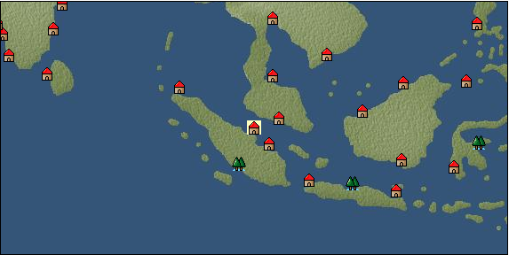

# Port: ジャンビ

import Tabs from '@theme/Tabs';
import TabItem from '@theme/TabItem';

## General Information

| Attribute | Details |
| :--- | :--- |
| **Port Name** | Jambi |
| **Port Type** | port of alliance |
| **Region** | Southeast Asia |
| **Sea Area** | andaman sea |
| **Required Language** | Malayu Tagalog |
| **Coordinates** | （4567，4744） |
| **Investment Reward** | [Lot (NO.13)](docs/Items/Consumables/Consumables-Treasure-Chests/item_3021.md) （必要投資額：500,000ドゥカード） |

### Available Facilities

| guild | intermediary | exchange | tool shop | workshop craftsman | Painter | sculptor | peddler |
| --- | --- | --- | --- | --- | --- | --- | --- |
|   |   | ○ | ○ | ○ |   |   |   |
| Shipyard Master | Lumbermaker | Sail-maker | weapon craftsman | master | TavernFemale | archive | salesperson |
| --- | --- | --- | --- | --- | --- | --- | --- |
| ○ |   | ○ |   |   |   |   |   |
| Shipwright | 銀行 | street worker | 王宮 | Trading post | church | suburbs | translator |
| --- | --- | --- | --- | --- | --- | --- | --- |
| ○ | ○ | ○ |   |   |   |   |   |

### Description
A Jambi town located in the center of Sumatra. It is covered in tropical rainforest and has a thriving forestry industry. It is strongly influenced by Islam, but Buddhist buildings can also be seen in the suburbs, creating a mix of history and culture. Cultural area: Southeast Asia

<Tabs>
  <TabItem value="trade_goods_sales" label="Trade Goods Sales">

| item | group | purchase price | 同盟時 | remarks |
| --- | --- | --- | --- | --- |
| [coffee](docs/Items/TradeGoods/TradeGoods-Sunddries/item_445.md) | [Trading goods (hobby goods)](docs/Categories/category_10.md) | 428 | (375) |  |
| [wood](docs/Items/TradeGoods/TradeGoods-Wares/item_277.md) | [交易品（工業品）](docs/Categories/category_19.md) | 674 | (590) |  |
| [pearl](docs/Items/TradeGoods/TradeGoods-Gems/item_769.md) | [Trading Items (Gemstones)](docs/Categories/category_15.md) | (4,467) | 3,909 |  |
| 要投資（必要投資額：320,000） |
| [dagger](docs/Items/TradeGoods/TradeGoods-Weapons/item_143.md) | [Trading Items (Arms)](docs/Categories/category_16.md) | 871 | (763) |  |
| [stone statue](docs/Items/TradeGoods/TradeGoods-Art/item_899.md) | [交易品（美術品）](docs/Categories/category_14.md) | 1,593 | (1,394) |  |
| [龍脳](docs/Items/TradeGoods/TradeGoods-Perfume/item_1676.md) | [Trading Goods (Spices)](docs/Categories/category_11.md) | 1,238 | (1,084) |  |
  </TabItem>
  <TabItem value="sale_specialty" label="Sale (Specialty)">

| item | group | sale price | 同盟時 | remarks |
| --- | --- | --- | --- | --- |

#### [Trading products (medical products)](docs/Categories/category_6.md)

| [Saikaku](docs/Items/TradeGoods/TradeGoods-Medicine/item_1959.md) | Trading products (medical products) | (1,929) | 2,250 |  |

#### [Trading goods (artificial goods)](docs/Categories/category_13.md)

| [Tumbaga](docs/Items/TradeGoods/TradeGoods-Luxuries/item_3028.md) | Trading goods (artificial goods) | 14,194 | (15,969) |  |

#### [Trading Items (Gemstones)](docs/Categories/category_15.md)

| [opal](docs/Items/TradeGoods/TradeGoods-Gems/item_2006.md) | Trading Items (Gemstones) | (8,073) | 9,419 |  |
| [topaz](docs/Items/TradeGoods/TradeGoods-Gems/item_1097.md) | Trading Items (Gemstones) | 5,189 | (5,838) |  |
| [pink diamond](docs/Items/TradeGoods/TradeGoods-Gems/item_2874.md) | Trading Items (Gemstones) | 4,220 | (4,747) |  |

#### [Trading Items (Firearms)](docs/Categories/category_17.md)

| [musket gun](docs/Items/TradeGoods/TradeGoods-Firearms/item_584.md) | Trading Items (Firearms) | (5,499) | 6,416 |  |
  </TabItem>
  <TabItem value="sale_no_specialty" label="Sale (No Specialty)">

| item | group | sale price | 同盟時 | remarks |
| --- | --- | --- | --- | --- |

#### [交易品（繊維）](docs/Categories/category_1.md)

| [Panya](docs/Items/TradeGoods/TradeGoods-Fibers/item_2097.md) | 交易品（繊維） | 448 | (504) |  |

#### [Trading items (food items)](docs/Categories/category_3.md)

| [taro](docs/Items/TradeGoods/TradeGoods-Foodstuffs/item_1960.md) | Trading items (food items) | 175 | 193 |  |
| [Paddy rice](docs/Items/TradeGoods/TradeGoods-Foodstuffs/item_654.md) | Trading items (food items) | (93) | 108 |  |
| [魚肉](docs/Items/TradeGoods/TradeGoods-Foodstuffs/item_10.md) | Trading items (food items) | 204 | 215 |  |

#### [Trading goods (hobby goods)](docs/Categories/category_10.md)

| [banana](docs/Items/TradeGoods/TradeGoods-Sunddries/item_1947.md) | Trading goods (hobby goods) | 167 | 172 |  |
| [mango](docs/Items/TradeGoods/TradeGoods-Sunddries/item_2095.md) | Trading goods (hobby goods) | 379 | (426) |  |

#### [Trading Goods (Spices)](docs/Categories/category_11.md)

| [patchouli](docs/Items/TradeGoods/TradeGoods-Perfume/item_1963.md) | Trading Goods (Spices) | (1,302) | 1,519 |  |
| [benzoin](docs/Items/TradeGoods/TradeGoods-Perfume/item_1962.md) | Trading Goods (Spices) | (887) | 1,034 |  |
| [sandalwood](docs/Items/TradeGoods/TradeGoods-Perfume/item_771.md) | Trading Goods (Spices) | (1,247) | 1,454 |  |

#### [Trading Goods (Spices)](docs/Categories/category_12.md)

| [cloves](docs/Items/TradeGoods/TradeGoods-Spices/item_1092.md) | Trading Goods (Spices) | 524 | (589) |  |
| [lemongrass](docs/Items/TradeGoods/TradeGoods-Spices/item_2096.md) | Trading Goods (Spices) | 183 | (205) |  |

#### [Trading goods (artificial goods)](docs/Categories/category_13.md)

| [goldsmith](docs/Items/TradeGoods/TradeGoods-Luxuries/item_687.md) | Trading goods (artificial goods) | 3,470 | (3,904) |  |

#### [Trading Items (Gemstones)](docs/Categories/category_15.md)

| [jade](docs/Items/TradeGoods/TradeGoods-Gems/item_2015.md) | Trading Items (Gemstones) | (1,912) | 2,230 |  |
| [Tortoiseshell](docs/Items/TradeGoods/TradeGoods-Gems/item_1980.md) | Trading Items (Gemstones) | (1,246) | 1,453 |  |
| [ruby](docs/Items/TradeGoods/TradeGoods-Gems/item_773.md) | Trading Items (Gemstones) | (3,735) | 4,358 |  |
| [pearl](docs/Items/TradeGoods/TradeGoods-Gems/item_769.md) | Trading Items (Gemstones) | (2,365) | 2,759 |  |
| 要投資（必要投資額：320,000） |
| [ivory](docs/Items/TradeGoods/TradeGoods-Gems/item_699.md) | Trading Items (Gemstones) | (1,885) | 2,199 |  |

#### [交易品（工業品）](docs/Categories/category_19.md)

| [wood](docs/Items/TradeGoods/TradeGoods-Wares/item_277.md) | 交易品（工業品） | 296 | (333) |  |
| [iron material](docs/Items/TradeGoods/TradeGoods-Wares/item_268.md) | 交易品（工業品） | 1,103 | (1,240) |  |

#### [交易品（織物）](docs/Categories/category_20.md)

| [silk fabric](docs/Items/TradeGoods/TradeGoods-Fabrics/item_823.md) | 交易品（織物） | (2,351) | 2,743 |  |
  </TabItem>
  <TabItem value="guild_&_others" label="Guild & Others">

| item | group | Sales price | Handling NPC | remarks |
| --- | --- | --- | --- | --- |
| There is no sales information for the item |
| --- |
  </TabItem>
  <TabItem value="toolman" label="Toolman">

| item | group | Sales price | Handling NPC | remarks |
| --- | --- | --- | --- | --- |

#### [Equipment (body)](docs/Categories/category_24.md)

| [pirate vest](docs/Items/Equipment/Equipment-Body/item_98.md) | Equipment (body) | 18,500 | tool shop owner |  |

#### [Equipment (legs)](docs/Categories/category_26.md)

| [cross strap sandals](docs/Items/Equipment/Equipment-Feet/item_99.md) | Equipment (legs) | 7,300 | tool shop owner |  |

#### [Equipment (belongings)](docs/Categories/category_27.md)

| [short sword](docs/Items/Equipment/Equipment-Weapon/item_301.md) | Equipment (belongings) | 9,300 | tool shop owner |  |

#### [Consumables (land battle/deck battle)](docs/Categories/category_29.md)

| [strong adhesive oil](docs/Items/Consumables/Consumables-Landbattle/item_662.md) | Consumables (land battle/deck battle) | 200 | tool shop owner |  |
| [tonic](docs/Items/Consumables/Consumables-Landbattle/item_1678.md) | Consumables (land battle/deck battle) | 300 | tool shop owner |  |
| [Arsenite poison](docs/Items/Consumables/Consumables-Landbattle/item_663.md) | Consumables (land battle/deck battle) | 400 | tool shop owner |  |

#### [Consumables (skill activation)](docs/Categories/category_31.md)

| [捕獲網](docs/Items/Consumables/Consumables-Skill/item_315.md) | Consumables (skill activation) | 300 | tool shop owner |  |
| [research monocle](docs/Items/Consumables/Consumables-Skill/item_120.md) | Consumables (skill activation) | 2,500 | tool shop owner |  |
  </TabItem>
  <TabItem value="kobo_craftsmen" label="Craftsman">

| item | group | Sales price | Handling NPC | remarks |
| --- | --- | --- | --- | --- |

#### [Consumables (condition recovery)](docs/Categories/category_21.md)

| [Nostalgic carillon bell](docs/Items/Consumables/Consumables-Recovery/item_245.md) | Consumables (condition recovery) | 200 | workshop craftsman |  |
| [Ship song sheet music](docs/Items/Consumables/Consumables-Recovery/item_247.md) | Consumables (condition recovery) | 200 | workshop craftsman |  |

#### [Consumables (other)](docs/Categories/category_44.md)

| [帆塗料](docs/Items/Consumables/Consumables-Other/item_348.md) | Consumables (other) | 500 | workshop craftsman |  |
| [ship paint](docs/Items/Consumables/Consumables-Other/item_347.md) | Consumables (other) | 500 | workshop craftsman |  |
  </TabItem>
  <TabItem value="shipyard" label="Shipyard">

### Shipyard Master

| item | group | Sales price | Handling NPC | remarks |
| --- | --- | --- | --- | --- |

#### [Boat](docs/Categories/category_43.md)

| [sambouk](docs/Items/Ships/item_783.md) | Boat | 1,000,000 | Shipyard Master |  |
| [Dow](docs/Items/Ships/item_780.md) | Boat | 360,000 | Shipyard Master |  |
| [Varsha](docs/Items/Ships/item_201.md) | Boat | 2,000 | Shipyard Master |  |
| [commercial thumb book](docs/Items/Ships/item_785.md) | Boat | 1,100,000 | Shipyard Master |  |
| [commercial dow](docs/Items/Ships/item_782.md) | Boat | 372,000 | Shipyard Master |  |
| [commercial varsha](docs/Items/Ships/item_204.md) | Boat | 5,200 | Shipyard Master |  |
| [Battle Barsha](docs/Items/Ships/item_203.md) | Boat | 5,100 | Shipyard Master |  |
| [exploration barsha](docs/Items/Ships/item_202.md) | Boat | 5,000 | Shipyard Master |  |
| [Armed Sambouk](docs/Items/Ships/item_784.md) | Boat | 1,000,000 | Shipyard Master |  |
| [assault dhow](docs/Items/Ships/item_781.md) | Boat | 365,000 | Shipyard Master |  |

### Sail-maker

| item | group | Sales price | Handling NPC | remarks |
| --- | --- | --- | --- | --- |

#### [Ship parts (auxiliary sails)](docs/Categories/category_33.md)

| [outer jib](docs/Items/ShipParts/Shipparts-Studding-Sail/item_331.md) | Ship parts (auxiliary sails) | 18,000 | Sail-maker |  |
| [Outer & inner jib](docs/Items/ShipParts/Shipparts-Studding-Sail/item_332.md) | Ship parts (auxiliary sails) | 23,000 | Sail-maker |  |
| [inner jib](docs/Items/ShipParts/Shipparts-Studding-Sail/item_279.md) | Ship parts (auxiliary sails) | 1,700 | Sail-maker |  |
| [Vorgernstaisl](docs/Items/ShipParts/Shipparts-Studding-Sail/item_333.md) | Ship parts (auxiliary sails) | 22,000 | Sail-maker |  |
| [Forestaisle](docs/Items/ShipParts/Shipparts-Studding-Sail/item_280.md) | Ship parts (auxiliary sails) | 8,300 | Sail-maker |  |
| [Foretop Gernsur](docs/Items/ShipParts/Shipparts-Studding-Sail/item_282.md) | Ship parts (auxiliary sails) | 2,400 | Sail-maker |  |
| [bonnet](docs/Items/ShipParts/Shipparts-Studding-Sail/item_329.md) | Ship parts (auxiliary sails) | 25,000 | Sail-maker |  |
| [mizungernstaisl](docs/Items/ShipParts/Shipparts-Studding-Sail/item_334.md) | Ship parts (auxiliary sails) | 22,000 | Sail-maker |  |
| [mizzen staple](docs/Items/ShipParts/Shipparts-Studding-Sail/item_281.md) | Ship parts (auxiliary sails) | 11,000 | Sail-maker |  |
| [mizzen top gelrunsle](docs/Items/ShipParts/Shipparts-Studding-Sail/item_283.md) | Ship parts (auxiliary sails) | 4,200 | Sail-maker |  |
| [mizzen royal gelrunsle](docs/Items/ShipParts/Shipparts-Studding-Sail/item_284.md) | Ship parts (auxiliary sails) | 21,000 | Sail-maker |  |
| [small inner jib](docs/Items/ShipParts/Shipparts-Studding-Sail/item_278.md) | Ship parts (auxiliary sails) | 500 | Sail-maker |  |
| [wide bonnet](docs/Items/ShipParts/Shipparts-Studding-Sail/item_356.md) | Ship parts (auxiliary sails) | 38,000 | Sail-maker |  |
  </TabItem>
</Tabs>