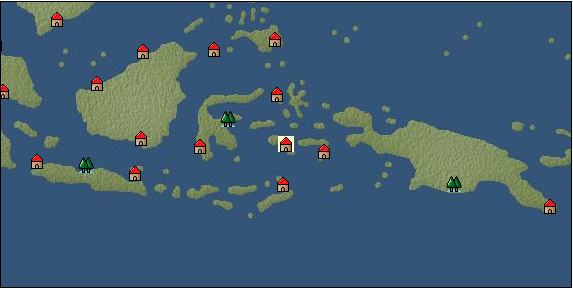

# Port: アンボイナ

import Tabs from '@theme/Tabs';
import TabItem from '@theme/TabItem';

## General Information

| Attribute | Details |
| :--- | :--- |
| **Port Name** | Amboina |
| **Port Type** | 開拓地 |
| **Region** | Southeast Asia |
| **Sea Area** | banda sea |
| **Required Language** | Malayu Tagalog |
| **Coordinates** | （5812，4912） |
| **Investment Reward** | [Lot (NO.12)](Items/Consumables/Consumables-Treasure-Chests/item_3015.md) （必要投資額：500,000ドゥカード） |

### Available Facilities

| guild | intermediary | exchange | tool shop | workshop craftsman | Painter | sculptor | peddler |
| --- | --- | --- | --- | --- | --- | --- | --- |
|   |   | ○ | ○ | ○ | ○ | ○ |   |
| Shipyard Master | Lumbermaker | Sail-maker | weapon craftsman | master | TavernFemale | archive | salesperson |
| --- | --- | --- | --- | --- | --- | --- | --- |
| ○ | ○ | ○ | ○ | ○ |   | ○ |   |
| Shipwright | 銀行 | street worker | 王宮 | Trading post | church | suburbs | translator |
| --- | --- | --- | --- | --- | --- | --- | --- |
| ○ | ○ | ○ |   |   |   |   |   |

### Description
A town located on a small island located in the southern part of the Moluccas, where spices such as cloves are produced. In search of spices, people from Europe began to move into the country one after another. Settlement area with alliance port attribute Clerk *Dutch can also be understood Cultural area: Indochina

<Tabs>
  <TabItem value="trade_goods_sales" label="Trade Goods Sales">

| item | group | purchase price | 同盟時 | remarks |
| --- | --- | --- | --- | --- |
| [java chintz](Items/Trade Goods/TradeGoods-Fabrics/item_1970.md) | [交易品（織物）](Categories/category_20.md) | 622 | (545) |  |
| 要投資（必要投資額：400,000） |
| [durian](Items/Trade Goods/TradeGoods-Sunddries/item_1949.md) | [Trading goods (hobby goods)](Categories/category_10.md) | 520 | (455) |  |
| 要投資（必要投資額：240,000） |
| [nutmeg](Items/Trade Goods/TradeGoods-Spices/item_1969.md) | [Trading Goods (Spices)](Categories/category_12.md) | 406 | (356) |  |
| [mango](Items/Trade Goods/TradeGoods-Sunddries/item_2095.md) | [Trading goods (hobby goods)](Categories/category_10.md) | 360 | (315) |  |
| [mace](Items/Trade Goods/TradeGoods-Spices/item_2100.md) | [Trading Goods (Spices)](Categories/category_12.md) | 597 | (523) |  |
| [coal](Items/Trade Goods/TradeGoods-Wares/item_359.md) | [交易品（工業品）](Categories/category_19.md) | 474 | (415) |  |
| [cannonball](Items/Trade Goods/TradeGoods-Firearms/item_144.md) | [Trading Items (Firearms)](Categories/category_17.md) | 1,674 | (1,465) |  |
| 要投資（必要投資額：400,000） |
| [魚肉](Items/Trade Goods/TradeGoods-Foodstuffs/item_10.md) | [Trading items (food items)](Categories/category_3.md) | 146 | 128 |  |
  </TabItem>
  <TabItem value="sale_specialty" label="Sale (Specialty)">

| item | group | sale price | 同盟時 | remarks |
| --- | --- | --- | --- | --- |

#### [交易品（繊維）](Categories/category_1.md)

| [feather](Items/Trade Goods/TradeGoods-Fibers/item_585.md) | 交易品（繊維） | 1,356 | (1,525) |  |

#### [Trading Goods (Dye)](Categories/category_2.md)

| [ward](Items/Trade Goods/TradeGoods-Dye/item_57.md) | Trading Goods (Dye) | 2,000 | (2,250) |  |
| [mimosa](Items/Trade Goods/TradeGoods-Dye/item_2281.md) | Trading Goods (Dye) | 659 | 650 |  |

#### [Trading items (food items)](Categories/category_3.md)

| [kangaroo meat](Items/Trade Goods/TradeGoods-Foodstuffs/item_2285.md) | Trading items (food items) | 403 | (453) |  |

#### [交易品（調味料）](Categories/category_4.md)

| [tamarind](Items/Trade Goods/TradeGoods-Seasonings/item_1968.md) | 交易品（調味料） | 883 | 732 |  |

#### [Trading products (medical products)](Categories/category_6.md)

| [Saikaku](Items/Trade Goods/TradeGoods-Medicine/item_1959.md) | Trading products (medical products) | 1,979 | (2,226) |  |
| [tea tree](Items/Trade Goods/TradeGoods-Medicine/item_2283.md) | Trading products (medical products) | 639 | (718) |  |
| [heath](Items/Trade Goods/TradeGoods-Medicine/item_63.md) | Trading products (medical products) | 395 | (444) |  |
| [Nothing](Items/Trade Goods/TradeGoods-Medicine/item_1053.md) | Trading products (medical products) | 1,477 | (1,661) |  |

#### [交易品（酒類）](Categories/category_9.md)

| [Sake](Items/Trade Goods/TradeGoods-Alcohol/item_3424.md) | 交易品（酒類） | 10,173 | (11,445) |  |

#### [Trading goods (hobby goods)](Categories/category_10.md)

| [prune](Items/Trade Goods/TradeGoods-Sunddries/item_523.md) | Trading goods (hobby goods) | 693 | (779) |  |
| [macadamia nuts](Items/Trade Goods/TradeGoods-Sunddries/item_2282.md) | Trading goods (hobby goods) | 481 | 488 |  |

#### [Trading Goods (Spices)](Categories/category_11.md)

| [eucalyptus](Items/Trade Goods/TradeGoods-Perfume/item_2278.md) | Trading Goods (Spices) | 426 | 432 |  |

#### [Trading Goods (Spices)](Categories/category_12.md)

| [saffron](Items/Trade Goods/TradeGoods-Spices/item_845.md) | Trading Goods (Spices) | 4,215 | 5,045 |  |

#### [Trading goods (artificial goods)](Categories/category_13.md)

| [Tumbaga](Items/Trade Goods/TradeGoods-Luxuries/item_3028.md) | Trading goods (artificial goods) | (9,708) | 11,327 |  |
| [Saori](Items/Trade Goods/TradeGoods-Luxuries/item_3676.md) | Trading goods (artificial goods) | 2,772 | (3,118) |  |

#### [交易品（美術品）](Categories/category_14.md)

| [Japanese painting](Items/Trade Goods/TradeGoods-Art/item_3436.md) | 交易品（美術品） | 8,640 | (9,720) |  |

#### [Trading Items (Gemstones)](Categories/category_15.md)

| [diamond](Items/Trade Goods/TradeGoods-Gems/item_449.md) | Trading Items (Gemstones) | 5,692 | (6,404) |  |
| [topaz](Items/Trade Goods/TradeGoods-Gems/item_1097.md) | Trading Items (Gemstones) | 5,117 | (5,757) |  |
| [pink diamond](Items/Trade Goods/TradeGoods-Gems/item_2874.md) | Trading Items (Gemstones) | 4,085 | (4,596) |  |

#### [Trading Items (Arms)](Categories/category_16.md)

| [damascus sword](Items/Trade Goods/TradeGoods-Weapons/item_903.md) | Trading Items (Arms) | 9,180 | (10,328) |  |

#### [Trading Items (Firearms)](Categories/category_17.md)

| [musket gun](Items/Trade Goods/TradeGoods-Firearms/item_584.md) | Trading Items (Firearms) | 6,229 | (7,008) |  |

#### [交易品（工業品）](Categories/category_19.md)

| [羊皮紙](Items/Trade Goods/TradeGoods-Wares/item_53.md) | 交易品（工業品） | 2,302 | (2,590) |  |

#### [交易品（織物）](Categories/category_20.md)

| [dutch calico](Items/Trade Goods/TradeGoods-Fabrics/item_1435.md) | 交易品（織物） | 2,078 | (2,337) |  |
  </TabItem>
  <TabItem value="sale_no_specialty" label="Sale (No Specialty)">

| item | group | sale price | 同盟時 | remarks |
| --- | --- | --- | --- | --- |

#### [交易品（繊維）](Categories/category_1.md)

| [Rush](Items/Trade Goods/TradeGoods-Fibers/item_3675.md) | 交易品（繊維） | (11,346) | 13,239 |  |
| [cotton](Items/Trade Goods/TradeGoods-Fibers/item_610.md) | 交易品（繊維） | 793 | (892) |  |
| [numb](Items/Trade Goods/TradeGoods-Fibers/item_900.md) | 交易品（繊維） | 12 | (13) |  |

#### [Trading items (food items)](Categories/category_3.md)

| [taro](Items/Trade Goods/TradeGoods-Foodstuffs/item_1960.md) | Trading items (food items) | 174 | (195) |  |
| [crocodile meat](Items/Trade Goods/TradeGoods-Foodstuffs/item_2284.md) | Trading items (food items) | 526 | (591) |  |
| [egg](Items/Trade Goods/TradeGoods-Foodstuffs/item_40.md) | Trading items (food items) | (30) | 34 |  |

#### [交易品（調味料）](Categories/category_4.md)

| [anchovies](Items/Trade Goods/TradeGoods-Seasonings/item_3004.md) | 交易品（調味料） | 174 | (195) |  |
| [coconut vinegar](Items/Trade Goods/TradeGoods-Seasonings/item_1988.md) | 交易品（調味料） | 461 | (518) |  |

#### [Trading products (medical products)](Categories/category_6.md)

| [Noni](Items/Trade Goods/TradeGoods-Medicine/item_2099.md) | Trading products (medical products) | (448) | 522 |  |
| [belladonna](Items/Trade Goods/TradeGoods-Medicine/item_1056.md) | Trading products (medical products) | 513 | (577) |  |
| [Maca](Items/Trade Goods/TradeGoods-Medicine/item_3000.md) | Trading products (medical products) | (1,128) | 1,316 |  |

#### [Trading goods (hobby goods)](Categories/category_10.md)

| [banana](Items/Trade Goods/TradeGoods-Sunddries/item_1947.md) | Trading goods (hobby goods) | (148) | 172 |  |
| [black tea](Items/Trade Goods/TradeGoods-Sunddries/item_675.md) | Trading goods (hobby goods) | (1,103) | 1,287 |  |

#### [Trading Goods (Spices)](Categories/category_11.md)

| [patchouli](Items/Trade Goods/TradeGoods-Perfume/item_1963.md) | Trading Goods (Spices) | 1,512 | (1,701) |  |
| [benzoin](Items/Trade Goods/TradeGoods-Perfume/item_1962.md) | Trading Goods (Spices) | 1,032 | (1,161) |  |
| [agarwood](Items/Trade Goods/TradeGoods-Perfume/item_1058.md) | Trading Goods (Spices) | 2,487 | (2,798) |  |
| [sandalwood](Items/Trade Goods/TradeGoods-Perfume/item_771.md) | Trading Goods (Spices) | 1,454 | (1,635) |  |
| [龍脳](Items/Trade Goods/TradeGoods-Perfume/item_1676.md) | Trading Goods (Spices) | 1,400 | (1,575) |  |

#### [Trading Goods (Spices)](Categories/category_12.md)

| [cloves](Items/Trade Goods/TradeGoods-Spices/item_1092.md) | Trading Goods (Spices) | 504 | 505 |  |
| [pepper](Items/Trade Goods/TradeGoods-Spices/item_58.md) | Trading Goods (Spices) | 205 | (230) |  |
| [ginger](Items/Trade Goods/TradeGoods-Spices/item_112.md) | Trading Goods (Spices) | 789 | (887) |  |
| [mint](Items/Trade Goods/TradeGoods-Spices/item_816.md) | Trading Goods (Spices) | 143 | (160) |  |

#### [Trading goods (artificial goods)](Categories/category_13.md)

| [goldsmith](Items/Trade Goods/TradeGoods-Luxuries/item_687.md) | Trading goods (artificial goods) | 3,564 | (4,009) |  |

#### [Trading Items (Gemstones)](Categories/category_15.md)

| [jade](Items/Trade Goods/TradeGoods-Gems/item_2015.md) | Trading Items (Gemstones) | 1,971 | (2,217) |  |
| [Tortoiseshell](Items/Trade Goods/TradeGoods-Gems/item_1980.md) | Trading Items (Gemstones) | 1,579 | (1,776) |  |
| [sapphire](Items/Trade Goods/TradeGoods-Gems/item_676.md) | Trading Items (Gemstones) | 4,290 | (4,826) |  |
| [nephrite](Items/Trade Goods/TradeGoods-Gems/item_2314.md) | Trading Items (Gemstones) | 1,724 | (1,939) |  |
| [peridot](Items/Trade Goods/TradeGoods-Gems/item_1098.md) | Trading Items (Gemstones) | 2,027 | (2,280) |  |
| [ruby](Items/Trade Goods/TradeGoods-Gems/item_773.md) | Trading Items (Gemstones) | 4,358 | (4,903) |  |

#### [Trading Items (Firearms)](Categories/category_17.md)

| [arquebus gun](Items/Trade Goods/TradeGoods-Firearms/item_14.md) | Trading Items (Firearms) | 2,432 | (2,736) |  |
| [大砲](Items/Trade Goods/TradeGoods-Firearms/item_4.md) | Trading Items (Firearms) | 4,869 | (5,478) |  |

#### [交易品（工業品）](Categories/category_19.md)

| [wood](Items/Trade Goods/TradeGoods-Wares/item_277.md) | 交易品（工業品） | (694) | 809 |  |
| [oil](Items/Trade Goods/TradeGoods-Wares/item_613.md) | 交易品（工業品） | 635 | (714) |  |
| [sulfur](Items/Trade Goods/TradeGoods-Wares/item_66.md) | 交易品（工業品） | 445 | (500) |  |
| [iron material](Items/Trade Goods/TradeGoods-Wares/item_268.md) | 交易品（工業品） | (959) | 1,118 |  |

#### [交易品（織物）](Categories/category_20.md)

| [silk fabric](Items/Trade Goods/TradeGoods-Fabrics/item_823.md) | 交易品（織物） | 2,748 | (3,091) |  |
  </TabItem>
  <TabItem value="guild_&_others" label="Guild & Others">

| item | group | Sales price | Handling NPC | remarks |
| --- | --- | --- | --- | --- |
| There is no sales information for the item |
| --- |
  </TabItem>
  <TabItem value="toolman" label="Toolman">

| item | group | Sales price | Handling NPC | remarks |
| --- | --- | --- | --- | --- |

#### [Equipment (head)](Categories/category_23.md)

| [Chapron](Items/Equipment/Equipment-Head/item_1443.md) | Equipment (head) | 53,800 | tool shop owner |  |
| 要投資（必要投資額：180,000） |

#### [Equipment (body)](Categories/category_24.md)

| [pirate vest](Items/Equipment/Equipment-Body/item_98.md) | Equipment (body) | 18,500 | tool shop owner |  |
| [lace cufflinks handler](Items/Equipment/Equipment-Body/item_528.md) | Equipment (body) | 41,100 | tool shop owner |  |

#### [Equipment (legs)](Categories/category_26.md)

| [cross strap sandals](Items/Equipment/Equipment-Feet/item_99.md) | Equipment (legs) | 7,300 | tool shop owner |  |

#### [Equipment (belongings)](Categories/category_27.md)

| [saber](Items/Equipment/Equipment-Weapon/item_865.md) | Equipment (belongings) | 29,100 | tool shop owner |  |
| 要投資（必要投資額：240,000） |
| [short sword](Items/Equipment/Equipment-Weapon/item_301.md) | Equipment (belongings) | 9,300 | tool shop owner |  |

#### [装備品（服飾品）](Categories/category_28.md)

| [black pearl necklace](Items/Equipment/Equipment-Accessory/item_2297.md) | 装備品（服飾品） | 8,000,000 | tool shop owner |  |
| 要投資（必要投資額：180,000） |

#### [Consumables (land battle/deck battle)](Categories/category_29.md)

| [strong adhesive oil](Items/Consumables/Consumables-Landbattle/item_662.md) | Consumables (land battle/deck battle) | 200 | tool shop owner |  |
| [tonic](Items/Consumables/Consumables-Landbattle/item_1678.md) | Consumables (land battle/deck battle) | 300 | tool shop owner |  |
| [Arsenite poison](Items/Consumables/Consumables-Landbattle/item_663.md) | Consumables (land battle/deck battle) | 400 | tool shop owner |  |

#### [Consumables (skill activation)](Categories/category_31.md)

| [捕獲網](Items/Consumables/Consumables-Skill/item_315.md) | Consumables (skill activation) | 300 | tool shop owner |  |
| [research monocle](Items/Consumables/Consumables-Skill/item_120.md) | Consumables (skill activation) | 2,500 | tool shop owner |  |

#### [Consumables (other)](Categories/category_44.md)

| [black powder](Items/Consumables/Consumables-Other/item_1954.md) | Consumables (other) | 1,000 | tool shop owner |  |

#### [Consumables (request documents)](Categories/category_45.md)

| [Textile purchase order](Items/Consumables/Consumables-Documents/item_2979.md) | Consumables (request documents) | 40,000 | tool shop owner |  |
  </TabItem>
  <TabItem value="kobo_craftsmen" label="Craftsman">

| item | group | Sales price | Handling NPC | remarks |
| --- | --- | --- | --- | --- |

#### [Consumables (condition recovery)](Categories/category_21.md)

| [Nostalgic carillon bell](Items/Consumables/Consumables-Recovery/item_245.md) | Consumables (condition recovery) | 200 | workshop craftsman |  |
| [Ship song sheet music](Items/Consumables/Consumables-Recovery/item_247.md) | Consumables (condition recovery) | 200 | workshop craftsman |  |

#### [Consumables (other)](Categories/category_44.md)

| [帆塗料](Items/Consumables/Consumables-Other/item_348.md) | Consumables (other) | 500 | workshop craftsman |  |
| [ship paint](Items/Consumables/Consumables-Other/item_347.md) | Consumables (other) | 500 | workshop craftsman |  |
  </TabItem>
  <TabItem value="Painter" label="Painter">

| item | group | Sales price | Handling NPC | remarks |
| --- | --- | --- | --- | --- |

#### [Ship parts (emblem)](Categories/category_36.md)

| [admiral](Items/Ship Parts/Shipparts-Crests/item_548.md) | Ship parts (emblem) | 5,000 | Painter |  |
| [anchor](Items/Ship Parts/Shipparts-Crests/item_549.md) | Ship parts (emblem) | 5,000 | Painter |  |
| [ape](Items/Ship Parts/Shipparts-Crests/item_793.md) | Ship parts (emblem) | 5,000 | Painter |  |
| [circle cross](Items/Ship Parts/Shipparts-Crests/item_544.md) | Ship parts (emblem) | 5,000 | Painter |  |
| [Delphine](Items/Ship Parts/Shipparts-Crests/item_542.md) | Ship parts (emblem) | 5,000 | Painter |  |
| [butterfly](Items/Ship Parts/Shipparts-Crests/item_547.md) | Ship parts (emblem) | 5,000 | Painter |  |
| [fisherman](Items/Ship Parts/Shipparts-Crests/item_545.md) | Ship parts (emblem) | 5,000 | Painter |  |
  </TabItem>
  <TabItem value="sculptor" label="sculptor">

| item | group | Sales price | Handling NPC | remarks |
| --- | --- | --- | --- | --- |

#### [recipe book](Categories/category_22.md)

| [Saint statue creation, part 10](Items/Recipe Book/item_3335.md) | recipe book | Fixed recipe | sculptor |  |

#### [Ship parts (figurehead)](Categories/category_34.md)

| [dolphin statue](Items/Ship Parts/Shipparts-Figurehead/item_169.md) | Ship parts (figurehead) | 500 | sculptor |  |
| [whale statue](Items/Ship Parts/Shipparts-Figurehead/item_172.md) | Ship parts (figurehead) | 12,000 | sculptor |  |
| [shark statue](Items/Ship Parts/Shipparts-Figurehead/item_171.md) | Ship parts (figurehead) | 8,600 | sculptor |  |
| [killer whale statue](Items/Ship Parts/Shipparts-Figurehead/item_170.md) | Ship parts (figurehead) | 8,600 | sculptor |  |
| [phoenix statue](Items/Ship Parts/Shipparts-Figurehead/item_631.md) | Ship parts (figurehead) | 62,000 | sculptor |  |
| [maiden statue](Items/Ship Parts/Shipparts-Figurehead/item_167.md) | Ship parts (figurehead) | 13,000 | sculptor |  |
| [statue of a great man](Items/Ship Parts/Shipparts-Figurehead/item_717.md) | Ship parts (figurehead) | 60,000 | sculptor |  |
| [statue of the brave](Items/Ship Parts/Shipparts-Figurehead/item_716.md) | Ship parts (figurehead) | 60,000 | sculptor |  |
| [angel statue](Items/Ship Parts/Shipparts-Figurehead/item_168.md) | Ship parts (figurehead) | 13,000 | sculptor |  |
| [statue of tenryu](Items/Ship Parts/Shipparts-Figurehead/item_630.md) | Ship parts (figurehead) | 62,000 | sculptor |  |
| [statue of goddess](Items/Ship Parts/Shipparts-Figurehead/item_721.md) | Ship parts (figurehead) | 60,000 | sculptor |  |
| [sea ​​turtle statue](Items/Ship Parts/Shipparts-Figurehead/item_173.md) | Ship parts (figurehead) | 1,800 | sculptor |  |
| [sea ​​monster statue](Items/Ship Parts/Shipparts-Figurehead/item_628.md) | Ship parts (figurehead) | 62,000 | sculptor |  |
| [statue of sea god](Items/Ship Parts/Shipparts-Figurehead/item_720.md) | Ship parts (figurehead) | 60,000 | sculptor |  |
| [statue of king](Items/Ship Parts/Shipparts-Figurehead/item_718.md) | Ship parts (figurehead) | 60,000 | sculptor |  |
  </TabItem>
  <TabItem value="shipyard" label="Shipyard">

### Shipyard Master

| item | group | Sales price | Handling NPC | remarks |
| --- | --- | --- | --- | --- |

#### [Boat](Categories/category_43.md)

| [sambouk](Items/Ships/item_783.md) | Boat | 1,000,000 | Shipyard Master |  |
| [Dow](Items/Ships/item_780.md) | Boat | 360,000 | Shipyard Master |  |
| [Varsha](Items/Ships/item_201.md) | Boat | 2,000 | Shipyard Master |  |
| [commercial thumb book](Items/Ships/item_785.md) | Boat | 1,100,000 | Shipyard Master |  |
| [commercial dow](Items/Ships/item_782.md) | Boat | 372,000 | Shipyard Master |  |
| [commercial varsha](Items/Ships/item_204.md) | Boat | 5,200 | Shipyard Master |  |
| [Battle Barsha](Items/Ships/item_203.md) | Boat | 5,100 | Shipyard Master |  |
| [exploration barsha](Items/Ships/item_202.md) | Boat | 5,000 | Shipyard Master |  |
| [Armed Sambouk](Items/Ships/item_784.md) | Boat | 1,000,000 | Shipyard Master |  |
| [assault dhow](Items/Ships/item_781.md) | Boat | 365,000 | Shipyard Master |  |

### Lumbermaker

| item | group | Sales price | Handling NPC | remarks |
| --- | --- | --- | --- | --- |

#### [Ship parts (additional armor)](Categories/category_35.md)

| [elm board](Items/Ship Parts/Shipparts-Plates/item_328.md) | Ship parts (additional armor) | 13,000 | Lumbermaker |  |
| [cedar board](Items/Ship Parts/Shipparts-Plates/item_353.md) | Ship parts (additional armor) | 800 | Lumbermaker |  |
| [teak board](Items/Ship Parts/Shipparts-Plates/item_813.md) | Ship parts (additional armor) | 22,000 | Lumbermaker |  |
| [beach board](Items/Ship Parts/Shipparts-Plates/item_327.md) | Ship parts (additional armor) | 6,400 | Lumbermaker |  |
| [red pine board](Items/Ship Parts/Shipparts-Plates/item_326.md) | Ship parts (additional armor) | 2,700 | Lumbermaker |  |
| [lightweight mahogany board](Items/Ship Parts/Shipparts-Plates/item_831.md) | Ship parts (additional armor) | 56,000 | Lumbermaker |  |
| [lightweight rosewood plank](Items/Ship Parts/Shipparts-Plates/item_832.md) | Ship parts (additional armor) | 110,000 | Lumbermaker |  |

### Sail-maker

| item | group | Sales price | Handling NPC | remarks |
| --- | --- | --- | --- | --- |

#### [recipe book](Categories/category_22.md)

| [Book of Shipbuilding Materials and Sewing Volume 2](Items/Recipe Book/item_1686.md) | recipe book | Fixed recipe | Sail-maker |  |

#### [Ship parts (auxiliary sails)](Categories/category_33.md)

| [outer jib](Items/Ship Parts/Shipparts-Studding-Sail/item_331.md) | Ship parts (auxiliary sails) | 18,000 | Sail-maker |  |
| [Outer & inner jib](Items/Ship Parts/Shipparts-Studding-Sail/item_332.md) | Ship parts (auxiliary sails) | 23,000 | Sail-maker |  |
| [inner jib](Items/Ship Parts/Shipparts-Studding-Sail/item_279.md) | Ship parts (auxiliary sails) | 1,700 | Sail-maker |  |
| [Vorgernstaisl](Items/Ship Parts/Shipparts-Studding-Sail/item_333.md) | Ship parts (auxiliary sails) | 22,000 | Sail-maker |  |
| [Forestaisle](Items/Ship Parts/Shipparts-Studding-Sail/item_280.md) | Ship parts (auxiliary sails) | 8,300 | Sail-maker |  |
| [Foretop Gernsur](Items/Ship Parts/Shipparts-Studding-Sail/item_282.md) | Ship parts (auxiliary sails) | 2,400 | Sail-maker |  |
| [Foretop staysle](Items/Ship Parts/Shipparts-Studding-Sail/item_357.md) | Ship parts (auxiliary sails) | 29,000 | Sail-maker |  |
| [Foretop Royal Sur](Items/Ship Parts/Shipparts-Studding-Sail/item_403.md) | Ship parts (auxiliary sails) | 48,000 | Sail-maker |  |
| [Fore Royal Stains](Items/Ship Parts/Shipparts-Studding-Sail/item_931.md) | Ship parts (auxiliary sails) | 70,000 | Sail-maker |  |
| [flying outer jib](Items/Ship Parts/Shipparts-Studding-Sail/item_400.md) | Ship parts (auxiliary sails) | 49,000 | Sail-maker |  |
| [flying inner jib](Items/Ship Parts/Shipparts-Studding-Sail/item_401.md) | Ship parts (auxiliary sails) | 58,000 | Sail-maker |  |
| [bonnet](Items/Ship Parts/Shipparts-Studding-Sail/item_329.md) | Ship parts (auxiliary sails) | 25,000 | Sail-maker |  |
| [mizungernstaisl](Items/Ship Parts/Shipparts-Studding-Sail/item_334.md) | Ship parts (auxiliary sails) | 22,000 | Sail-maker |  |
| [mizzen staple](Items/Ship Parts/Shipparts-Studding-Sail/item_281.md) | Ship parts (auxiliary sails) | 11,000 | Sail-maker |  |
| [mizzen top gelrunsle](Items/Ship Parts/Shipparts-Studding-Sail/item_283.md) | Ship parts (auxiliary sails) | 4,200 | Sail-maker |  |
| [mizzen top staysle](Items/Ship Parts/Shipparts-Studding-Sail/item_402.md) | Ship parts (auxiliary sails) | 35,000 | Sail-maker |  |
| [Mizzen Top Royal Sur](Items/Ship Parts/Shipparts-Studding-Sail/item_404.md) | Ship parts (auxiliary sails) | 45,000 | Sail-maker |  |
| [mizzen royal gelrunsle](Items/Ship Parts/Shipparts-Studding-Sail/item_284.md) | Ship parts (auxiliary sails) | 21,000 | Sail-maker |  |
| [small inner jib](Items/Ship Parts/Shipparts-Studding-Sail/item_278.md) | Ship parts (auxiliary sails) | 500 | Sail-maker |  |
| [wide bonnet](Items/Ship Parts/Shipparts-Studding-Sail/item_356.md) | Ship parts (auxiliary sails) | 38,000 | Sail-maker |  |
  </TabItem>
  <TabItem value="weapon craftsman" label="weapon craftsman">

| item | group | Sales price | Handling NPC | remarks |
| --- | --- | --- | --- | --- |

#### [recipe book](Categories/category_22.md)

| [Book of Shipbuilding Materials and Casting Volume 2](Items/Recipe Book/item_1723.md) | recipe book | Fixed recipe | weapon craftsman |  |

#### [Ship parts (special weapons)](Categories/category_37.md)

| [Corvus](Items/Ship Parts/Shipparts-Special-Weapons/item_194.md) | Ship parts (special weapons) | 24,000 | weapon craftsman |  |
| [rum](Items/Ship Parts/Shipparts-Special-Weapons/item_191.md) | Ship parts (special weapons) | 4,800 | weapon craftsman |  |
| [small corvus](Items/Ship Parts/Shipparts-Special-Weapons/item_193.md) | Ship parts (special weapons) | 3,000 | weapon craftsman |  |
| [small ram](Items/Ship Parts/Shipparts-Special-Weapons/item_190.md) | Ship parts (special weapons) | 1,000 | weapon craftsman |  |
| [small poop](Items/Ship Parts/Shipparts-Special-Weapons/item_198.md) | Ship parts (special weapons) | 39,000 | weapon craftsman |  |
| [small ship forecastle](Items/Ship Parts/Shipparts-Special-Weapons/item_195.md) | Ship parts (special weapons) | 5,000 | weapon craftsman |  |
| [additional small spanker](Items/Ship Parts/Shipparts-Special-Weapons/item_199.md) | Ship parts (special weapons) | 3,500 | weapon craftsman |  |
| [additional small split](Items/Ship Parts/Shipparts-Special-Weapons/item_196.md) | Ship parts (special weapons) | 2,000 | weapon craftsman |  |

#### [Ship parts (cannon)](Categories/category_38.md)

| [8 angel cannons](Items/Ship Parts/Shipparts-Cannons/item_389.md) | Ship parts (cannon) | 159,600 | weapon craftsman |  |
| [8 Caprice guns](Items/Ship Parts/Shipparts-Cannons/item_397.md) | Ship parts (cannon) | 103,600 | weapon craftsman |  |
| [10 culverines](Items/Ship Parts/Shipparts-Cannons/item_375.md) | Ship parts (cannon) | 136,300 | weapon craftsman |  |
| [8 culverine guns](Items/Ship Parts/Shipparts-Cannons/item_374.md) | Ship parts (cannon) | 87,300 | weapon craftsman |  |
| [10 Saker cannons](Items/Ship Parts/Shipparts-Cannons/item_187.md) | Ship parts (cannon) | 79,000 | weapon craftsman |  |
| [8 Saker cannons](Items/Ship Parts/Shipparts-Cannons/item_186.md) | Ship parts (cannon) | 50,500 | weapon craftsman |  |
| [10 demi culverin cannons](Items/Ship Parts/Shipparts-Cannons/item_370.md) | Ship parts (cannon) | 101,000 | weapon craftsman |  |
| [12 demi culverin cannons](Items/Ship Parts/Shipparts-Cannons/item_371.md) | Ship parts (cannon) | 145,400 | weapon craftsman |  |
| [8 demi culverin cannons](Items/Ship Parts/Shipparts-Cannons/item_369.md) | Ship parts (cannon) | 64,600 | weapon craftsman |  |
| [10 trench guns](Items/Ship Parts/Shipparts-Cannons/item_835.md) | Ship parts (cannon) | 163,600 | weapon craftsman |  |
| [8 trench guns](Items/Ship Parts/Shipparts-Cannons/item_381.md) | Ship parts (cannon) | 104,700 | weapon craftsman |  |
| [8 Draconis cannons](Items/Ship Parts/Shipparts-Cannons/item_390.md) | Ship parts (cannon) | 103,600 | weapon craftsman |  |
| [10 pyro cannons](Items/Ship Parts/Shipparts-Cannons/item_1185.md) | Ship parts (cannon) | 110,500 | weapon craftsman |  |
| [8 pyro cannons](Items/Ship Parts/Shipparts-Cannons/item_1184.md) | Ship parts (cannon) | 71,000 | weapon craftsman |  |
| [2 falcon guns](Items/Ship Parts/Shipparts-Cannons/item_174.md) | Ship parts (cannon) | 500 | weapon craftsman |  |
| [4 falcon guns](Items/Ship Parts/Shipparts-Cannons/item_175.md) | Ship parts (cannon) | 2,000 | weapon craftsman |  |
| [6 falcon guns](Items/Ship Parts/Shipparts-Cannons/item_176.md) | Ship parts (cannon) | 4,600 | weapon craftsman |  |
| [8 falcon guns](Items/Ship Parts/Shipparts-Cannons/item_177.md) | Ship parts (cannon) | 8,100 | weapon craftsman |  |
| [8 Heutzer guns](Items/Ship Parts/Shipparts-Cannons/item_946.md) | Ship parts (cannon) | 145,200 | weapon craftsman |  |
| [10 minion cannons](Items/Ship Parts/Shipparts-Cannons/item_182.md) | Ship parts (cannon) | 34,800 | weapon craftsman |  |
| [8 minion cannons](Items/Ship Parts/Shipparts-Cannons/item_181.md) | Ship parts (cannon) | 22,400 | weapon craftsman |  |

#### [shipbuilding materials](Categories/category_47.md)

| [改良中型砲門](Items/Shipbuilding FS Material/item_1724.md) | shipbuilding materials | Fixed recipe | weapon craftsman |  |
  </TabItem>
  <TabItem value="scholar" label="scholar">

| item | group | Sales price | Handling NPC | remarks |
| --- | --- | --- | --- | --- |

#### [recipe book](Categories/category_22.md)

| [How to make a dictionary of southern languages](Items/Recipe Book/item_3802.md) | recipe book | Fixed recipe | scholar |  |
| 要投資（必要投資額：200,000） |

#### [Consumables (skill activation)](Categories/category_31.md)

| [Southern languages ​​translation notes](Items/Consumables/Consumables-Skill/item_3788.md) | Consumables (skill activation) | Fixed recipe | scholar |  |
| 要投資（必要投資額：不明） |
| [Southern languages ​​dictionary](Items/Consumables/Consumables-Skill/item_4329.md) | Consumables (skill activation) | Fixed recipe | scholar |  |
  </TabItem>
</Tabs>