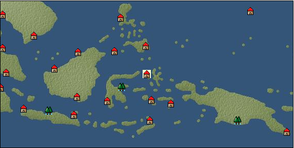

# Port: Ternate

import Tabs from '@theme/Tabs';
import TabItem from '@theme/TabItem';

## General Information

| Attribute | Details |
| :--- | :--- |
| **Port Name** | Ternate |
| **Port Type** | 開拓地 |
| **Region** | Southeast Asia |
| **Sea Area** | celebes sea |
| **Required Language** | Malayu Tagalog |
| **Coordinates** | （5776，4712） |
| **Investment Reward** | [Lot (NO.12)](docs/Items/Consumables/Consumables-Treasure-Chests/item_3015.md) （必要投資額：500,000ドゥカード） |

### Available Facilities

| guild | intermediary | exchange | tool shop | workshop craftsman | Painter | sculptor | peddler |
| --- | --- | --- | --- | --- | --- | --- | --- |
|   |   | ○ | ○ | ○ | ○ | ○ |   |
| Shipyard Master | Lumbermaker | Sail-maker | weapon craftsman | master | TavernFemale | archive | salesperson |
| --- | --- | --- | --- | --- | --- | --- | --- |
| ○ | ○ | ○ | ○ | ○ |   | ○ |   |
| Shipwright | 銀行 | street worker | 王宮 | Trading post | church | suburbs | translator |
| --- | --- | --- | --- | --- | --- | --- | --- |
| ○ | ○ | ○ |   |   |   |   |   |

### Description
It is the capital of the Kingdom of Ternate and is located on the island of Ternate, located in the northern part of the Moluccas. In recent years, Europeans have moved to the island in search of the expensive spices produced on the island. They ended up building a city. Settlement area with alliance port attribute Clerk *Dutch can also be understood Cultural area: Indochina

<Tabs>
  <TabItem value="trade_goods_sales" label="Trade Goods Sales">

| Item | Group | Purchase Price | Allied Price | Remarks |
| --- | --- | --- | --- | --- |
| [cloves](docs/Items/TradeGoods/TradeGoods-Spices/item_1092.md) | [Trading Goods (Spices)](docs/Categories/category_12.md) | (384) | 336 |  |
| [corn](docs/Items/TradeGoods/TradeGoods-Foodstuffs/item_138.md) | [Trading items (food items)](docs/Categories/category_3.md) | (54) | 48 |  |
| [Noni](docs/Items/TradeGoods/TradeGoods-Medicine/item_2099.md) | [Trading products (medical products)](docs/Categories/category_6.md) | (498) | 436 |  |
| [banana](docs/Items/TradeGoods/TradeGoods-Sunddries/item_1947.md) | [Trading goods (hobby goods)](docs/Categories/category_10.md) | (150) | 132 |  |
| [大砲](docs/Items/TradeGoods/TradeGoods-Firearms/item_4.md) | [Trading Items (Firearms)](docs/Categories/category_17.md) | 5,050 | (4,419) |  |
| 要投資（必要投資額：400,000） |
| [iron material](docs/Items/TradeGoods/TradeGoods-Wares/item_268.md) | [交易品（工業品）](docs/Categories/category_19.md) | (649) | 568 |  |
| 要投資（必要投資額：180,000） |
| [iron ore](docs/Items/TradeGoods/TradeGoods-Minerals/item_146.md) | [Trading Items (Iron Stone)](docs/Categories/category_7.md) | (649) | 568 |  |
  </TabItem>
  <TabItem value="sale_specialty" label="Sale (Specialty)">

| Item | Group | sale price | Allied Price | Remarks |
| --- | --- | --- | --- | --- |

#### [Trading Goods (Dye)](docs/Categories/category_2.md)

| [ward](docs/Items/TradeGoods/TradeGoods-Dye/item_57.md) | Trading Goods (Dye) | 1,899 | (2,136) |  |
| [mimosa](docs/Items/TradeGoods/TradeGoods-Dye/item_2281.md) | Trading Goods (Dye) | 656 | (738) |  |

#### [Trading items (food items)](docs/Categories/category_3.md)

| [buckwheat](docs/Items/TradeGoods/TradeGoods-Foodstuffs/item_3430.md) | Trading items (food items) | (10,284) | 12,000 |  |

#### [交易品（酒類）](docs/Categories/category_9.md)

| [whiskey](docs/Items/TradeGoods/TradeGoods-Alcohol/item_1.md) | 交易品（酒類） | (1,162) | 1,355 |  |

#### [Trading goods (hobby goods)](docs/Categories/category_10.md)

| [prune](docs/Items/TradeGoods/TradeGoods-Sunddries/item_523.md) | Trading goods (hobby goods) | 728 | (819) |  |
| [macadamia nuts](docs/Items/TradeGoods/TradeGoods-Sunddries/item_2282.md) | Trading goods (hobby goods) | 496 | (558) |  |

#### [Trading Goods (Spices)](docs/Categories/category_11.md)

| [eucalyptus](docs/Items/TradeGoods/TradeGoods-Perfume/item_2278.md) | Trading Goods (Spices) | 425 | (478) |  |

#### [Trading Goods (Spices)](docs/Categories/category_12.md)

| [saffron](docs/Items/TradeGoods/TradeGoods-Spices/item_845.md) | Trading Goods (Spices) | 4,551 | (5,120) |  |

#### [Trading goods (artificial goods)](docs/Categories/category_13.md)

| [Tumbaga](docs/Items/TradeGoods/TradeGoods-Luxuries/item_3028.md) | Trading goods (artificial goods) | 13,071 | (14,706) |  |

#### [Trading Items (Gemstones)](docs/Categories/category_15.md)

| [alexandrite](docs/Items/TradeGoods/TradeGoods-Gems/item_4429.md) | Trading Items (Gemstones) | (9,867) | 11,513 |  |
| [pink diamond](docs/Items/TradeGoods/TradeGoods-Gems/item_2874.md) | Trading Items (Gemstones) | 3,941 | (4,434) |  |

#### [Trading Items (Arms)](docs/Categories/category_16.md)

| [crossbow](docs/Items/TradeGoods/TradeGoods-Weapons/item_537.md) | Trading Items (Arms) | 1,853 | (2,084) |  |

#### [Trading Items (Firearms)](docs/Categories/category_17.md)

| [musket gun](docs/Items/TradeGoods/TradeGoods-Firearms/item_584.md) | Trading Items (Firearms) | 5,948 | (6,692) |  |

#### [交易品（織物）](docs/Categories/category_20.md)

| [dutch calico](docs/Items/TradeGoods/TradeGoods-Fabrics/item_1435.md) | 交易品（織物） | 2,196 | (2,470) |  |
  </TabItem>
  <TabItem value="sale_no_specialty" label="Sale (No Specialty)">

| Item | Group | sale price | Allied Price | Remarks |
| --- | --- | --- | --- | --- |

#### [交易品（繊維）](docs/Categories/category_1.md)

| [Panya](docs/Items/TradeGoods/TradeGoods-Fibers/item_2097.md) | 交易品（繊維） | 435 | (489) |  |
| [cotton](docs/Items/TradeGoods/TradeGoods-Fibers/item_610.md) | 交易品（繊維） | (616) | 718 |  |
| [numb](docs/Items/TradeGoods/TradeGoods-Fibers/item_900.md) | 交易品（繊維） | 12 | (13) |  |

#### [Trading Goods (Dye)](docs/Categories/category_2.md)

| [Indian indigo](docs/Items/TradeGoods/TradeGoods-Dye/item_157.md) | Trading Goods (Dye) | 557 | (626) |  |

#### [Trading items (food items)](docs/Categories/category_3.md)

| [Cassava](docs/Items/TradeGoods/TradeGoods-Foodstuffs/item_1805.md) | Trading items (food items) | 107 | 109 |  |
| [taro](docs/Items/TradeGoods/TradeGoods-Foodstuffs/item_1960.md) | Trading items (food items) | 175 | 183 |  |
| [wheat](docs/Items/TradeGoods/TradeGoods-Foodstuffs/item_16.md) | Trading items (food items) | (97) | 113 |  |
| [flour](docs/Items/TradeGoods/TradeGoods-Foodstuffs/item_605.md) | Trading items (food items) | (48) | 56 |  |
| [Paddy rice](docs/Items/TradeGoods/TradeGoods-Foodstuffs/item_654.md) | Trading items (food items) | 100 | (112) |  |
| [魚肉](docs/Items/TradeGoods/TradeGoods-Foodstuffs/item_10.md) | Trading items (food items) | 204 | (229) |  |

#### [交易品（調味料）](docs/Categories/category_4.md)

| [anchovies](docs/Items/TradeGoods/TradeGoods-Seasonings/item_3004.md) | 交易品（調味料） | 174 | (195) |  |
| [coconut oil](docs/Items/TradeGoods/TradeGoods-Seasonings/item_446.md) | 交易品（調味料） | 341 | (383) |  |

#### [Trading products (medical products)](docs/Categories/category_6.md)

| [Saikaku](docs/Items/TradeGoods/TradeGoods-Medicine/item_1959.md) | Trading products (medical products) | 2,049 | 2,137 |  |
| [tea tree](docs/Items/TradeGoods/TradeGoods-Medicine/item_2283.md) | Trading products (medical products) | 633 | (712) |  |
| [Maca](docs/Items/TradeGoods/TradeGoods-Medicine/item_3000.md) | Trading products (medical products) | 1,178 | (1,325) |  |

#### [Trading Items (Iron Stone)](docs/Categories/category_7.md)

| [copper ore](docs/Items/TradeGoods/TradeGoods-Minerals/item_65.md) | Trading Items (Iron Stone) | 916 | (1,030) |  |

#### [Trading products (precious metals)](docs/Categories/category_8.md)

| [gold](docs/Items/TradeGoods/TradeGoods-Metals/item_659.md) | Trading products (precious metals) | 6,888 | (7,749) |  |

#### [交易品（酒類）](docs/Categories/category_9.md)

| [Beer](docs/Items/TradeGoods/TradeGoods-Alcohol/item_2.md) | 交易品（酒類） | (290) | 338 |  |

#### [Trading goods (hobby goods)](docs/Categories/category_10.md)

| [coconut](docs/Items/TradeGoods/TradeGoods-Sunddries/item_96.md) | Trading goods (hobby goods) | 483 | 500 |  |
| [black tea](docs/Items/TradeGoods/TradeGoods-Sunddries/item_675.md) | Trading goods (hobby goods) | 1,210 | (1,361) |  |

#### [Trading Goods (Spices)](docs/Categories/category_11.md)

| [patchouli](docs/Items/TradeGoods/TradeGoods-Perfume/item_1963.md) | Trading Goods (Spices) | 1,514 | (1,703) |  |
| [benzoin](docs/Items/TradeGoods/TradeGoods-Perfume/item_1962.md) | Trading Goods (Spices) | (887) | 1,034 |  |
| [agarwood](docs/Items/TradeGoods/TradeGoods-Perfume/item_1058.md) | Trading Goods (Spices) | 2,490 | (2,801) |  |
| [sandalwood](docs/Items/TradeGoods/TradeGoods-Perfume/item_771.md) | Trading Goods (Spices) | 1,445 | 1,450 |  |
| [龍脳](docs/Items/TradeGoods/TradeGoods-Perfume/item_1676.md) | Trading Goods (Spices) | (1,260) | 1,470 |  |

#### [Trading Goods (Spices)](docs/Categories/category_12.md)

| [pepper](docs/Items/TradeGoods/TradeGoods-Spices/item_58.md) | Trading Goods (Spices) | 205 | (230) |  |
| [nutmeg](docs/Items/TradeGoods/TradeGoods-Spices/item_1969.md) | Trading Goods (Spices) | 498 | 523 |  |
| [lemongrass](docs/Items/TradeGoods/TradeGoods-Spices/item_2096.md) | Trading Goods (Spices) | 188 | (211) |  |

#### [Trading goods (artificial goods)](docs/Categories/category_13.md)

| [goldsmith](docs/Items/TradeGoods/TradeGoods-Luxuries/item_687.md) | Trading goods (artificial goods) | (3,054) | 3,563 |  |

#### [Trading Items (Gemstones)](docs/Categories/category_15.md)

| [jade](docs/Items/TradeGoods/TradeGoods-Gems/item_2015.md) | Trading Items (Gemstones) | (1,823) | 2,127 |  |
| [Tortoiseshell](docs/Items/TradeGoods/TradeGoods-Gems/item_1980.md) | Trading Items (Gemstones) | (1,355) | 1,581 |  |
| [sapphire](docs/Items/TradeGoods/TradeGoods-Gems/item_676.md) | Trading Items (Gemstones) | 4,290 | 4,290 |  |
| [ruby](docs/Items/TradeGoods/TradeGoods-Gems/item_773.md) | Trading Items (Gemstones) | (3,736) | 4,359 |  |
| [pearl](docs/Items/TradeGoods/TradeGoods-Gems/item_769.md) | Trading Items (Gemstones) | (4,885) | 5,700 |  |

#### [Trading Items (Firearms)](docs/Categories/category_17.md)

| [arquebus gun](docs/Items/TradeGoods/TradeGoods-Firearms/item_14.md) | Trading Items (Firearms) | 2,446 | (2,752) |  |
| [大砲](docs/Items/TradeGoods/TradeGoods-Firearms/item_4.md) | Trading Items (Firearms) | 2,277 | (2,561) |  |
| 要投資（必要投資額：400,000） |

#### [交易品（工業品）](docs/Categories/category_19.md)

| [wood](docs/Items/TradeGoods/TradeGoods-Wares/item_277.md) | 交易品（工業品） | 798 | (897) |  |
| [oil](docs/Items/TradeGoods/TradeGoods-Wares/item_613.md) | 交易品（工業品） | (540) | 629 |  |

#### [交易品（織物）](docs/Categories/category_20.md)

| [indian chintz](docs/Items/TradeGoods/TradeGoods-Fabrics/item_159.md) | 交易品（織物） | 1,291 | (1,452) |  |
| [java chintz](docs/Items/TradeGoods/TradeGoods-Fabrics/item_1970.md) | 交易品（織物） | (592) | 690 |  |
| [silk fabric](docs/Items/TradeGoods/TradeGoods-Fabrics/item_823.md) | 交易品（織物） | 2,715 | 2,747 |  |
  </TabItem>
  <TabItem value="guild_&_others" label="Guild & Others">

| Item | Group | Sales price | Handling NPC | Remarks |
| --- | --- | --- | --- | --- |
| There is no sales information for the Item |
| --- |
  </TabItem>
  <TabItem value="toolman" label="Toolman">

| Item | Group | Sales price | Handling NPC | Remarks |
| --- | --- | --- | --- | --- |

#### [Equipment (head)](docs/Categories/category_23.md)

| [padded roll](docs/Items/Equipment/Equipment-Head/item_713.md) | Equipment (head) | 40,800 | tool shop owner |  |
| 要投資（必要投資額：120,000） |

#### [Equipment (body)](docs/Categories/category_24.md)

| [pirate vest](docs/Items/Equipment/Equipment-Body/item_98.md) | Equipment (body) | 18,500 | tool shop owner |  |
| [rough color doublet](docs/Items/Equipment/Equipment-Body/item_711.md) | Equipment (body) | 116,500 | tool shop owner |  |
| 要投資（必要投資額：120,000） |

#### [Equipment (legs)](docs/Categories/category_26.md)

| [cross strap sandals](docs/Items/Equipment/Equipment-Feet/item_99.md) | Equipment (legs) | 7,300 | tool shop owner |  |

#### [Equipment (belongings)](docs/Categories/category_27.md)

| [saber](docs/Items/Equipment/Equipment-Weapon/item_865.md) | Equipment (belongings) | 29,100 | tool shop owner |  |
| 要投資（必要投資額：240,000） |
| [short sword](docs/Items/Equipment/Equipment-Weapon/item_301.md) | Equipment (belongings) | 9,300 | tool shop owner |  |

#### [装備品（服飾品）](docs/Categories/category_28.md)

| [black pearl earrings](docs/Items/Equipment/Equipment-Accessory/item_2296.md) | 装備品（服飾品） | 7,000,000 | tool shop owner |  |

#### [Consumables (land battle/deck battle)](docs/Categories/category_29.md)

| [strong adhesive oil](docs/Items/Consumables/Consumables-Landbattle/item_662.md) | Consumables (land battle/deck battle) | 200 | tool shop owner |  |
| [tonic](docs/Items/Consumables/Consumables-Landbattle/item_1678.md) | Consumables (land battle/deck battle) | 300 | tool shop owner |  |
| [Arsenite poison](docs/Items/Consumables/Consumables-Landbattle/item_663.md) | Consumables (land battle/deck battle) | 400 | tool shop owner |  |

#### [Consumables (skill activation)](docs/Categories/category_31.md)

| [捕獲網](docs/Items/Consumables/Consumables-Skill/item_315.md) | Consumables (skill activation) | 300 | tool shop owner |  |
| [research monocle](docs/Items/Consumables/Consumables-Skill/item_120.md) | Consumables (skill activation) | 2,500 | tool shop owner |  |

#### [Consumables (other)](docs/Categories/category_44.md)

| [white powder](docs/Items/Consumables/Consumables-Other/item_1953.md) | Consumables (other) | 1,000 | tool shop owner |  |

#### [Consumables (request documents)](docs/Categories/category_45.md)

| [Miscellaneous goods purchase order form](docs/Items/Consumables/Consumables-Documents/item_5372.md) | Consumables (request documents) | 10,000 | tool shop owner |  |
  </TabItem>
  <TabItem value="kobo_craftsmen" label="Craftsman">

| Item | Group | Sales price | Handling NPC | Remarks |
| --- | --- | --- | --- | --- |

#### [Consumables (condition recovery)](docs/Categories/category_21.md)

| [Nostalgic carillon bell](docs/Items/Consumables/Consumables-Recovery/item_245.md) | Consumables (condition recovery) | 200 | workshop craftsman |  |
| [Ship song sheet music](docs/Items/Consumables/Consumables-Recovery/item_247.md) | Consumables (condition recovery) | 200 | workshop craftsman |  |

#### [Consumables (other)](docs/Categories/category_44.md)

| [帆塗料](docs/Items/Consumables/Consumables-Other/item_348.md) | Consumables (other) | 500 | workshop craftsman |  |
| [ship paint](docs/Items/Consumables/Consumables-Other/item_347.md) | Consumables (other) | 500 | workshop craftsman |  |

#### [shipbuilding materials](docs/Categories/category_47.md)

| [General purpose large square sail](docs/Items/ShipbuildingFS/item_3462.md) | shipbuilding materials | 1,500,000 | workshop craftsman |  |
| [General purpose large Latin sail](docs/Items/ShipbuildingFS/item_3461.md) | shipbuilding materials | 1,500,000 | workshop craftsman |  |
| [General-purpose large paddle boat](docs/Items/ShipbuildingFS/item_3459.md) | shipbuilding materials | 5,000,000 | workshop craftsman |  |
| [General-purpose large gun port](docs/Items/ShipbuildingFS/item_3464.md) | shipbuilding materials | 1,500,000 | workshop craftsman |  |
| [General-purpose large hull](docs/Items/ShipbuildingFS/item_3460.md) | shipbuilding materials | 5,000,000 | workshop craftsman |  |
  </TabItem>
  <TabItem value="Painter" label="Painter">

| Item | Group | Sales price | Handling NPC | Remarks |
| --- | --- | --- | --- | --- |

#### [Ship parts (emblem)](docs/Categories/category_36.md)

| [admiral](docs/Items/ShipParts/Shipparts-Crests/item_548.md) | Ship parts (emblem) | 5,000 | Painter |  |
| [anchor](docs/Items/ShipParts/Shipparts-Crests/item_549.md) | Ship parts (emblem) | 5,000 | Painter |  |
| [ape](docs/Items/ShipParts/Shipparts-Crests/item_793.md) | Ship parts (emblem) | 5,000 | Painter |  |
| [circle cross](docs/Items/ShipParts/Shipparts-Crests/item_544.md) | Ship parts (emblem) | 5,000 | Painter |  |
| [Delphine](docs/Items/ShipParts/Shipparts-Crests/item_542.md) | Ship parts (emblem) | 5,000 | Painter |  |
| [butterfly](docs/Items/ShipParts/Shipparts-Crests/item_547.md) | Ship parts (emblem) | 5,000 | Painter |  |
| [fisherman](docs/Items/ShipParts/Shipparts-Crests/item_545.md) | Ship parts (emblem) | 5,000 | Painter |  |
  </TabItem>
  <TabItem value="sculptor" label="sculptor">

| Item | Group | Sales price | Handling NPC | Remarks |
| --- | --- | --- | --- | --- |

#### [recipe book](docs/Categories/category_22.md)

| [Creating saint statues, part 11](docs/Items/RecipeBooks/item_3332.md) | recipe book | Fixed recipe | sculptor |  |

#### [Ship parts (figurehead)](docs/Categories/category_34.md)

| [dolphin statue](docs/Items/ShipParts/Shipparts-Figurehead/item_169.md) | Ship parts (figurehead) | 500 | sculptor |  |
| [whale statue](docs/Items/ShipParts/Shipparts-Figurehead/item_172.md) | Ship parts (figurehead) | 12,000 | sculptor |  |
| [shark statue](docs/Items/ShipParts/Shipparts-Figurehead/item_171.md) | Ship parts (figurehead) | 8,600 | sculptor |  |
| [killer whale statue](docs/Items/ShipParts/Shipparts-Figurehead/item_170.md) | Ship parts (figurehead) | 8,600 | sculptor |  |
| [phoenix statue](docs/Items/ShipParts/Shipparts-Figurehead/item_631.md) | Ship parts (figurehead) | 62,000 | sculptor |  |
| [maiden statue](docs/Items/ShipParts/Shipparts-Figurehead/item_167.md) | Ship parts (figurehead) | 13,000 | sculptor |  |
| [statue of a great man](docs/Items/ShipParts/Shipparts-Figurehead/item_717.md) | Ship parts (figurehead) | 60,000 | sculptor |  |
| [statue of the brave](docs/Items/ShipParts/Shipparts-Figurehead/item_716.md) | Ship parts (figurehead) | 60,000 | sculptor |  |
| [angel statue](docs/Items/ShipParts/Shipparts-Figurehead/item_168.md) | Ship parts (figurehead) | 13,000 | sculptor |  |
| [statue of tenryu](docs/Items/ShipParts/Shipparts-Figurehead/item_630.md) | Ship parts (figurehead) | 62,000 | sculptor |  |
| [statue of goddess](docs/Items/ShipParts/Shipparts-Figurehead/item_721.md) | Ship parts (figurehead) | 60,000 | sculptor |  |
| [sea ​​turtle statue](docs/Items/ShipParts/Shipparts-Figurehead/item_173.md) | Ship parts (figurehead) | 1,800 | sculptor |  |
| [sea ​​monster statue](docs/Items/ShipParts/Shipparts-Figurehead/item_628.md) | Ship parts (figurehead) | 62,000 | sculptor |  |
| [statue of sea god](docs/Items/ShipParts/Shipparts-Figurehead/item_720.md) | Ship parts (figurehead) | 60,000 | sculptor |  |
| [statue of king](docs/Items/ShipParts/Shipparts-Figurehead/item_718.md) | Ship parts (figurehead) | 60,000 | sculptor |  |
| [saint agatha statue](docs/Items/ShipParts/Shipparts-Figurehead/item_3331.md) | Ship parts (figurehead) | Fixed recipe | sculptor |  |
  </TabItem>
  <TabItem value="shipyard" label="Shipyard">

### Shipyard Master

| Item | Group | Sales price | Handling NPC | Remarks |
| --- | --- | --- | --- | --- |

#### [Boat](docs/Categories/category_43.md)

| [sambouk](docs/Items/Ships/item_783.md) | Boat | 1,000,000 | Shipyard Master |  |
| [Dow](docs/Items/Ships/item_780.md) | Boat | 360,000 | Shipyard Master |  |
| [Varsha](docs/Items/Ships/item_201.md) | Boat | 2,000 | Shipyard Master |  |
| [commercial thumb book](docs/Items/Ships/item_785.md) | Boat | 1,100,000 | Shipyard Master |  |
| [commercial dow](docs/Items/Ships/item_782.md) | Boat | 372,000 | Shipyard Master |  |
| [commercial varsha](docs/Items/Ships/item_204.md) | Boat | 5,200 | Shipyard Master |  |
| [Battle Barsha](docs/Items/Ships/item_203.md) | Boat | 5,100 | Shipyard Master |  |
| [exploration barsha](docs/Items/Ships/item_202.md) | Boat | 5,000 | Shipyard Master |  |
| [Armed Sambouk](docs/Items/Ships/item_784.md) | Boat | 1,000,000 | Shipyard Master |  |
| [assault dhow](docs/Items/Ships/item_781.md) | Boat | 365,000 | Shipyard Master |  |

### Lumbermaker

| Item | Group | Sales price | Handling NPC | Remarks |
| --- | --- | --- | --- | --- |

#### [Ship parts (additional armor)](docs/Categories/category_35.md)

| [elm board](docs/Items/ShipParts/Shipparts-Plates/item_328.md) | Ship parts (additional armor) | 13,000 | Lumbermaker |  |
| [cedar board](docs/Items/ShipParts/Shipparts-Plates/item_353.md) | Ship parts (additional armor) | 800 | Lumbermaker |  |
| [teak board](docs/Items/ShipParts/Shipparts-Plates/item_813.md) | Ship parts (additional armor) | 22,000 | Lumbermaker |  |
| [beach board](docs/Items/ShipParts/Shipparts-Plates/item_327.md) | Ship parts (additional armor) | 6,400 | Lumbermaker |  |
| [red pine board](docs/Items/ShipParts/Shipparts-Plates/item_326.md) | Ship parts (additional armor) | 2,700 | Lumbermaker |  |
| [lightweight mahogany board](docs/Items/ShipParts/Shipparts-Plates/item_831.md) | Ship parts (additional armor) | 56,000 | Lumbermaker |  |
| [lightweight rosewood plank](docs/Items/ShipParts/Shipparts-Plates/item_832.md) | Ship parts (additional armor) | 110,000 | Lumbermaker |  |

### Sail-maker

| Item | Group | Sales price | Handling NPC | Remarks |
| --- | --- | --- | --- | --- |

#### [recipe book](docs/Categories/category_22.md)

| [Book of Shipbuilding Materials and Sewing Volume 3](docs/Items/RecipeBooks/item_1913.md) | recipe book | Fixed recipe | Sail-maker |  |

#### [Ship parts (auxiliary sails)](docs/Categories/category_33.md)

| [outer jib](docs/Items/ShipParts/Shipparts-Studding-Sail/item_331.md) | Ship parts (auxiliary sails) | 18,000 | Sail-maker |  |
| [Outer & inner jib](docs/Items/ShipParts/Shipparts-Studding-Sail/item_332.md) | Ship parts (auxiliary sails) | 23,000 | Sail-maker |  |
| [inner jib](docs/Items/ShipParts/Shipparts-Studding-Sail/item_279.md) | Ship parts (auxiliary sails) | 1,700 | Sail-maker |  |
| [Vorgernstaisl](docs/Items/ShipParts/Shipparts-Studding-Sail/item_333.md) | Ship parts (auxiliary sails) | 22,000 | Sail-maker |  |
| [Vorgeln bonnet](docs/Items/ShipParts/Shipparts-Studding-Sail/item_929.md) | Ship parts (auxiliary sails) | 110,000 | Sail-maker |  |
| [Forestaisle](docs/Items/ShipParts/Shipparts-Studding-Sail/item_280.md) | Ship parts (auxiliary sails) | 8,300 | Sail-maker |  |
| [Foretop Gernsur](docs/Items/ShipParts/Shipparts-Studding-Sail/item_282.md) | Ship parts (auxiliary sails) | 2,400 | Sail-maker |  |
| [Foretop staysle](docs/Items/ShipParts/Shipparts-Studding-Sail/item_357.md) | Ship parts (auxiliary sails) | 29,000 | Sail-maker |  |
| [Foretop Royal Sur](docs/Items/ShipParts/Shipparts-Studding-Sail/item_403.md) | Ship parts (auxiliary sails) | 48,000 | Sail-maker |  |
| [Fore Royal Stains](docs/Items/ShipParts/Shipparts-Studding-Sail/item_931.md) | Ship parts (auxiliary sails) | 70,000 | Sail-maker |  |
| [flying outer jib](docs/Items/ShipParts/Shipparts-Studding-Sail/item_400.md) | Ship parts (auxiliary sails) | 49,000 | Sail-maker |  |
| [flying inner jib](docs/Items/ShipParts/Shipparts-Studding-Sail/item_401.md) | Ship parts (auxiliary sails) | 58,000 | Sail-maker |  |
| [bonnet](docs/Items/ShipParts/Shipparts-Studding-Sail/item_329.md) | Ship parts (auxiliary sails) | 25,000 | Sail-maker |  |
| [mizungernstaisl](docs/Items/ShipParts/Shipparts-Studding-Sail/item_334.md) | Ship parts (auxiliary sails) | 22,000 | Sail-maker |  |
| [Mizungern bonnet](docs/Items/ShipParts/Shipparts-Studding-Sail/item_930.md) | Ship parts (auxiliary sails) | 130,000 | Sail-maker |  |
| [mizzen staple](docs/Items/ShipParts/Shipparts-Studding-Sail/item_281.md) | Ship parts (auxiliary sails) | 11,000 | Sail-maker |  |
| [mizzen top gelrunsle](docs/Items/ShipParts/Shipparts-Studding-Sail/item_283.md) | Ship parts (auxiliary sails) | 4,200 | Sail-maker |  |
| [mizzen top staysle](docs/Items/ShipParts/Shipparts-Studding-Sail/item_402.md) | Ship parts (auxiliary sails) | 35,000 | Sail-maker |  |
| [Mizzen Top Royal Sur](docs/Items/ShipParts/Shipparts-Studding-Sail/item_404.md) | Ship parts (auxiliary sails) | 45,000 | Sail-maker |  |
| [mizzen royal gelrunsle](docs/Items/ShipParts/Shipparts-Studding-Sail/item_284.md) | Ship parts (auxiliary sails) | 21,000 | Sail-maker |  |
| [mizzen royal staysle](docs/Items/ShipParts/Shipparts-Studding-Sail/item_932.md) | Ship parts (auxiliary sails) | 79,000 | Sail-maker |  |
| [small inner jib](docs/Items/ShipParts/Shipparts-Studding-Sail/item_278.md) | Ship parts (auxiliary sails) | 500 | Sail-maker |  |
| [wide bonnet](docs/Items/ShipParts/Shipparts-Studding-Sail/item_356.md) | Ship parts (auxiliary sails) | 38,000 | Sail-maker |  |
  </TabItem>
  <TabItem value="weapon craftsman" label="weapon craftsman">

| Item | Group | Sales price | Handling NPC | Remarks |
| --- | --- | --- | --- | --- |

#### [recipe book](docs/Categories/category_22.md)

| [Book of Shipbuilding Materials and Casting Volume 3](docs/Items/RecipeBooks/item_1912.md) | recipe book | Fixed recipe | weapon craftsman |  |

#### [Ship parts (special weapons)](docs/Categories/category_37.md)

| [Corvus](docs/Items/ShipParts/Shipparts-Special-Weapons/item_194.md) | Ship parts (special weapons) | 24,000 | weapon craftsman |  |
| [rum](docs/Items/ShipParts/Shipparts-Special-Weapons/item_191.md) | Ship parts (special weapons) | 4,800 | weapon craftsman |  |
| [small corvus](docs/Items/ShipParts/Shipparts-Special-Weapons/item_193.md) | Ship parts (special weapons) | 3,000 | weapon craftsman |  |
| [small ram](docs/Items/ShipParts/Shipparts-Special-Weapons/item_190.md) | Ship parts (special weapons) | 1,000 | weapon craftsman |  |
| [small poop](docs/Items/ShipParts/Shipparts-Special-Weapons/item_198.md) | Ship parts (special weapons) | 39,000 | weapon craftsman |  |
| [small ship forecastle](docs/Items/ShipParts/Shipparts-Special-Weapons/item_195.md) | Ship parts (special weapons) | 5,000 | weapon craftsman |  |
| [additional small spanker](docs/Items/ShipParts/Shipparts-Special-Weapons/item_199.md) | Ship parts (special weapons) | 3,500 | weapon craftsman |  |
| [additional small split](docs/Items/ShipParts/Shipparts-Special-Weapons/item_196.md) | Ship parts (special weapons) | 2,000 | weapon craftsman |  |

#### [Ship parts (cannon)](docs/Categories/category_38.md)

| [8 Exploder guns](docs/Items/ShipParts/Shipparts-Cannons/item_1164.md) | Ship parts (cannon) | 113,900 | weapon craftsman |  |
| [10 angel cannons](docs/Items/ShipParts/Shipparts-Cannons/item_853.md) | Ship parts (cannon) | 249,400 | weapon craftsman |  |
| [8 angel cannons](docs/Items/ShipParts/Shipparts-Cannons/item_389.md) | Ship parts (cannon) | 159,600 | weapon craftsman |  |
| [10 Caprice guns](docs/Items/ShipParts/Shipparts-Cannons/item_2211.md) | Ship parts (cannon) | 161,300 | weapon craftsman |  |
| [12 Caprice guns](docs/Items/ShipParts/Shipparts-Cannons/item_2439.md) | Ship parts (cannon) | 198,500 | weapon craftsman |  |
| [8 Caprice guns](docs/Items/ShipParts/Shipparts-Cannons/item_397.md) | Ship parts (cannon) | 103,600 | weapon craftsman |  |
| [10 culverines](docs/Items/ShipParts/Shipparts-Cannons/item_375.md) | Ship parts (cannon) | 136,300 | weapon craftsman |  |
| [12 culverin guns](docs/Items/ShipParts/Shipparts-Cannons/item_744.md) | Ship parts (cannon) | 196,300 | weapon craftsman |  |
| [8 culverine guns](docs/Items/ShipParts/Shipparts-Cannons/item_374.md) | Ship parts (cannon) | 87,300 | weapon craftsman |  |
| [10 Cannon Pedro guns](docs/Items/ShipParts/Shipparts-Cannons/item_746.md) | Ship parts (cannon) | 190,900 | weapon craftsman |  |
| [12 Cannon Pedro guns](docs/Items/ShipParts/Shipparts-Cannons/item_834.md) | Ship parts (cannon) | 274,900 | weapon craftsman |  |
| [8 Cannon Pedro guns](docs/Items/ShipParts/Shipparts-Cannons/item_745.md) | Ship parts (cannon) | 122,200 | weapon craftsman |  |
| [10 Saker cannons](docs/Items/ShipParts/Shipparts-Cannons/item_187.md) | Ship parts (cannon) | 79,000 | weapon craftsman |  |
| [8 Saker cannons](docs/Items/ShipParts/Shipparts-Cannons/item_186.md) | Ship parts (cannon) | 50,500 | weapon craftsman |  |
| [10 Seraphim cannons](docs/Items/ShipParts/Shipparts-Cannons/item_2293.md) | Ship parts (cannon) | 172,400 | weapon craftsman |  |
| [8 Seraphim cannons](docs/Items/ShipParts/Shipparts-Cannons/item_2292.md) | Ship parts (cannon) | 269,400 | weapon craftsman |  |
| [10 demi culverin cannons](docs/Items/ShipParts/Shipparts-Cannons/item_370.md) | Ship parts (cannon) | 101,000 | weapon craftsman |  |
| [12 demi culverin cannons](docs/Items/ShipParts/Shipparts-Cannons/item_371.md) | Ship parts (cannon) | 145,400 | weapon craftsman |  |
| [14 demi-culverin guns](docs/Items/ShipParts/Shipparts-Cannons/item_2436.md) | Ship parts (cannon) | 196,500 | weapon craftsman |  |
| [8 demi culverin cannons](docs/Items/ShipParts/Shipparts-Cannons/item_369.md) | Ship parts (cannon) | 64,600 | weapon craftsman |  |
| [10 demi cannons](docs/Items/ShipParts/Shipparts-Cannons/item_940.md) | Ship parts (cannon) | 99,400 | weapon craftsman |  |
| [8 demi cannons](docs/Items/ShipParts/Shipparts-Cannons/item_943.md) | Ship parts (cannon) | 55,900 | weapon craftsman |  |
| [10 trench guns](docs/Items/ShipParts/Shipparts-Cannons/item_835.md) | Ship parts (cannon) | 163,600 | weapon craftsman |  |
| [8 trench guns](docs/Items/ShipParts/Shipparts-Cannons/item_381.md) | Ship parts (cannon) | 104,700 | weapon craftsman |  |
| [10 Draconis cannons](docs/Items/ShipParts/Shipparts-Cannons/item_2210.md) | Ship parts (cannon) | 161,300 | weapon craftsman |  |
| [12 Draconis cannons](docs/Items/ShipParts/Shipparts-Cannons/item_2438.md) | Ship parts (cannon) | 198,500 | weapon craftsman |  |
| [8 Draconis cannons](docs/Items/ShipParts/Shipparts-Cannons/item_390.md) | Ship parts (cannon) | 103,600 | weapon craftsman |  |
| [8 Hyperier guns](docs/Items/ShipParts/Shipparts-Cannons/item_2437.md) | Ship parts (cannon) | 83,100 | weapon craftsman |  |
| [10 pyro cannons](docs/Items/ShipParts/Shipparts-Cannons/item_1185.md) | Ship parts (cannon) | 110,500 | weapon craftsman |  |
| [12 pyro cannons](docs/Items/ShipParts/Shipparts-Cannons/item_1186.md) | Ship parts (cannon) | 136,000 | weapon craftsman |  |
| [8 pyro cannons](docs/Items/ShipParts/Shipparts-Cannons/item_1184.md) | Ship parts (cannon) | 71,000 | weapon craftsman |  |
| [2 falcon guns](docs/Items/ShipParts/Shipparts-Cannons/item_174.md) | Ship parts (cannon) | 500 | weapon craftsman |  |
| [4 falcon guns](docs/Items/ShipParts/Shipparts-Cannons/item_175.md) | Ship parts (cannon) | 2,000 | weapon craftsman |  |
| [6 falcon guns](docs/Items/ShipParts/Shipparts-Cannons/item_176.md) | Ship parts (cannon) | 4,600 | weapon craftsman |  |
| [8 falcon guns](docs/Items/ShipParts/Shipparts-Cannons/item_177.md) | Ship parts (cannon) | 8,100 | weapon craftsman |  |
| [8 Perrier guns](docs/Items/ShipParts/Shipparts-Cannons/item_1152.md) | Ship parts (cannon) | 70,400 | weapon craftsman |  |
| [10 Heitzer guns](docs/Items/ShipParts/Shipparts-Cannons/item_947.md) | Ship parts (cannon) | 226,800 | weapon craftsman |  |
| [8 Heutzer guns](docs/Items/ShipParts/Shipparts-Cannons/item_946.md) | Ship parts (cannon) | 145,200 | weapon craftsman |  |
| [10 minion cannons](docs/Items/ShipParts/Shipparts-Cannons/item_182.md) | Ship parts (cannon) | 34,800 | weapon craftsman |  |
| [8 minion cannons](docs/Items/ShipParts/Shipparts-Cannons/item_181.md) | Ship parts (cannon) | 22,400 | weapon craftsman |  |
| [8 motor guns](docs/Items/ShipParts/Shipparts-Cannons/item_936.md) | Ship parts (cannon) | 245,200 | weapon craftsman |  |
| [10 rapid fire cannons](docs/Items/ShipParts/Shipparts-Cannons/item_1024.md) | Ship parts (cannon) | 123,200 | weapon craftsman |  |
| [8 rapid fire cannons](docs/Items/ShipParts/Shipparts-Cannons/item_1023.md) | Ship parts (cannon) | 78,900 | weapon craftsman |  |

#### [shipbuilding materials](docs/Categories/category_47.md)

| [改良大型砲門](docs/Items/ShipbuildingFS/item_1914.md) | shipbuilding materials | Fixed recipe | weapon craftsman |  |
  </TabItem>
  <TabItem value="scholar" label="scholar">

| Item | Group | Sales price | Handling NPC | Remarks |
| --- | --- | --- | --- | --- |

#### [recipe book](docs/Categories/category_22.md)

| [How to make a dictionary of southern languages](docs/Items/RecipeBooks/item_3802.md) | recipe book | Fixed recipe | scholar |  |

#### [Consumables (skill activation)](docs/Categories/category_31.md)

| [Southern languages ​​translation notes](docs/Items/Consumables/Consumables-Skill/item_3788.md) | Consumables (skill activation) | Fixed recipe | scholar |  |
| 要投資（必要投資額：不明） |
| [Southern languages ​​dictionary](docs/Items/Consumables/Consumables-Skill/item_4329.md) | Consumables (skill activation) | Fixed recipe | scholar |  |
  </TabItem>
</Tabs>