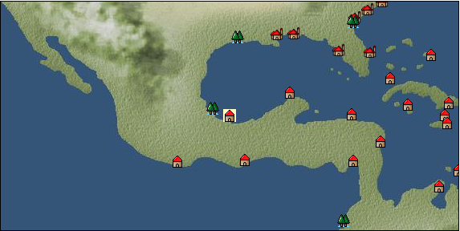

# Port: テノチティトラン

import Tabs from '@theme/Tabs';
import TabItem from '@theme/TabItem';

## General Information

| Attribute | Details |
| :--- | :--- |
| **Port Name** | tenochtitlan |
| **Port Type** | Landing point |
| **Region** | Caribbean/Central America |
| **Sea Area** |  |
| **Required Language** | Nahuatl |
| **Coordinates** | （，） |
| **Investment Reward** |  |

### Available Facilities

| guild | intermediary | exchange | tool shop | workshop craftsman | Painter | sculptor | peddler |
| --- | --- | --- | --- | --- | --- | --- | --- |
|   |   |   | ○ |   |   |   | ○ |
| Shipyard Master | Lumbermaker | Sail-maker | weapon craftsman | master | TavernFemale | archive | salesperson |
| --- | --- | --- | --- | --- | --- | --- | --- |
|   |   |   |   | ○ |   |   |   |
| Shipwright | 銀行 | street worker | 王宮 | Trading post | church | suburbs | translator |
| --- | --- | --- | --- | --- | --- | --- | --- |
|   |   |   |   |   |   |   |   |

### Description
In the southeastern hinterland of Veracruz, there is a diner owner in place of the Tavern Master, the capital of the Aztec Empire. It is a capital built on an island in the center of Lake Texcoco, and the sight of three bridges extending to the shore is magnificent. Cortés also wrote in his report, ``It is so vast and beautiful that I will only report on half of it.''

<Tabs>
  <TabItem value="trade_goods_sales" label="Trade Goods Sales">

| item | group | purchase price | 同盟時 | remarks |
| --- | --- | --- | --- | --- |
| There is no purchase information for trade goods. |
  </TabItem>
  <TabItem value="sale_specialty" label="Sale (Specialty)">

| item | group | sale price | 同盟時 | remarks |
| --- | --- | --- | --- | --- |
| Sales information for trade items with specialty judgment set is not registered. |
  </TabItem>
  <TabItem value="sale_no_specialty" label="Sale (No Specialty)">

| item | group | sale price | 同盟時 | remarks |
| --- | --- | --- | --- | --- |
| There is no information on the sale of trade goods. |
  </TabItem>
  <TabItem value="guild_&_others" label="Guild & Others">

| item | group | Sales price | Handling NPC | remarks |
| --- | --- | --- | --- | --- |
| There is no sales information for the item |
| --- |
  </TabItem>
  <TabItem value="toolman" label="Toolman">

| item | group | Sales price | Handling NPC | remarks |
| --- | --- | --- | --- | --- |

#### [recipe book](docs/Categories/category_22.md)

| [How to sew Central American ethnic clothing](docs/Items/RecipeBooks/item_2167.md) | recipe book | Fixed recipe | tool shop owner |  |

#### [装備品（服飾品）](docs/Categories/category_28.md)

| [aztec opal](docs/Items/Equipment/Equipment-Accessory/item_2427.md) | 装備品（服飾品） | 15,000,000 | tool shop owner |  |
| [aztec calendar](docs/Items/Equipment/Equipment-Accessory/item_2426.md) | 装備品（服飾品） | 15,000,000 | tool shop owner |  |
| [eagle feather](docs/Items/Equipment/Equipment-Accessory/item_2425.md) | 装備品（服飾品） | 15,000,000 | tool shop owner |  |

#### [Consumables (land battle/deck battle)](docs/Categories/category_29.md)

| [Taheebo juice](docs/Items/Consumables/Consumables-Landbattle/item_1807.md) | Consumables (land battle/deck battle) | 300 | tool shop owner |  |
| [tonic](docs/Items/Consumables/Consumables-Landbattle/item_1678.md) | Consumables (land battle/deck battle) | 300 | tool shop owner |  |
| [torch for throwing](docs/Items/Consumables/Consumables-Landbattle/item_313.md) | Consumables (land battle/deck battle) | 150 | tool shop owner |  |
  </TabItem>
  <TabItem value="peddler" label="peddler">

| item | group | Sales price | Handling NPC | remarks |
| --- | --- | --- | --- | --- |

#### [Consumables (land battle/deck battle)](docs/Categories/category_29.md)

| [agni firestick](docs/Items/Consumables/Consumables-Landbattle/item_1737.md) | Consumables (land battle/deck battle) |  | peddler |  |
| [javelin](docs/Items/Consumables/Consumables-Landbattle/item_1515.md) | Consumables (land battle/deck battle) |  | peddler |  |
| [spice sauce](docs/Items/Consumables/Consumables-Landbattle/item_2430.md) | Consumables (land battle/deck battle) |  | peddler |  |
| [maracuja juice](docs/Items/Consumables/Consumables-Landbattle/item_2431.md) | Consumables (land battle/deck battle) |  | peddler |  |
| [maracuja bottle](docs/Items/Consumables/Consumables-Landbattle/item_2432.md) | Consumables (land battle/deck battle) |  | peddler |  |
| [煙玉](docs/Items/Consumables/Consumables-Landbattle/item_86.md) | Consumables (land battle/deck battle) |  | peddler |  |
| [explosive drug](docs/Items/Consumables/Consumables-Landbattle/item_2493.md) | Consumables (land battle/deck battle) |  | peddler |  |

#### [Consumables (skill activation)](docs/Categories/category_31.md)

| [landmark ribbon](docs/Items/Consumables/Consumables-Skill/item_316.md) | Consumables (skill activation) |  | peddler |  |
  </TabItem>
  <TabItem value="Tavern Master" label="Tavern Master">

| item | group | Sales price | Handling NPC | remarks |
| --- | --- | --- | --- | --- |

#### [recipe book](docs/Categories/category_22.md)

| [Land battle props/cooking part 2](docs/Items/RecipeBooks/item_2433.md) | recipe book | Fixed recipe | Tavern Master |  |
| owner of the restaurant |
  </TabItem>
</Tabs>